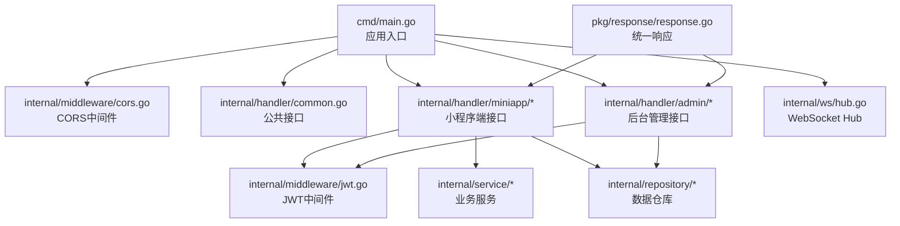
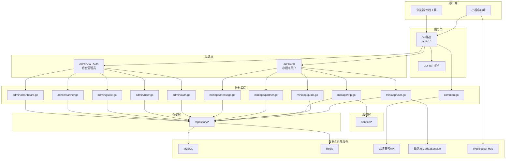
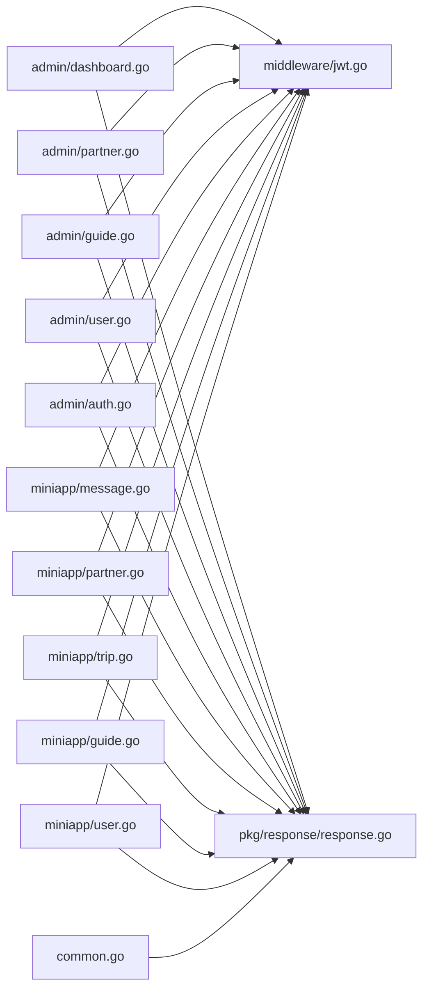

# API接口文档

<cite>
**本文档引用的文件**
- [main.go](file://cmd/main.go)
- [common.go](file://internal/handler/common.go)
- [response.go](file://pkg/response/response.go)
- [jwt.go](file://internal/middleware/jwt.go)
- [cors.go](file://internal/middleware/cors.go)
- [user.go](file://internal/handler/miniapp/user.go)
- [guide.go](file://internal/handler/miniapp/guide.go)
- [trip.go](file://internal/handler/miniapp/trip.go)
- [partner.go](file://internal/handler/miniapp/partner.go)
- [message.go](file://internal/handler/miniapp/message.go)
- [auth.go](file://internal/handler/admin/auth.go)
- [user.go](file://internal/handler/admin/user.go)
- [guide.go](file://internal/handler/admin/guide.go)
- [partner.go](file://internal/handler/admin/partner.go)
- [dashboard.go](file://internal/handler/admin/dashboard.go)
</cite>

## 目录
1. [简介](#简介)
2. [项目结构](#项目结构)
3. [核心组件](#核心组件)
4. [架构总览](#架构总览)
5. [详细组件分析](#详细组件分析)
6. [依赖关系分析](#依赖关系分析)
7. [性能考虑](#性能考虑)
8. [故障排除指南](#故障排除指南)
9. [结论](#结论)
10. [附录](#附录)

## 简介
本项目是一个旅行社交平台的后端服务，基于Gin框架构建，提供小程序端的用户管理、攻略系统、行程管理、搭子匹配、消息通信、AI智能生成、足迹与收藏、记账与备忘清单等功能，以及后台管理系统的认证、用户与角色管理、内容审核与推荐管理等能力。接口采用RESTful风格，统一响应格式，支持跨域访问，并通过JWT进行认证。

## 项目结构
后端采用按功能模块划分的层次化结构：
- cmd：应用入口，初始化配置、数据库、注册路由并启动HTTP服务
- internal/handler：控制器层，按功能模块拆分（miniapp与admin）
- internal/middleware：中间件（JWT认证、CORS）
- internal/service：业务逻辑层（部分服务）
- internal/repository：数据访问层（DAO）
- internal/model：数据模型
- internal/ws：WebSocket处理
- pkg/response：统一响应封装
- pkg/config、pkg/database：配置与数据库连接

图表来源
- [main.go:31-151](file://cmd/main.go#L31-L151)
- [cors.go:10-22](file://internal/middleware/cors.go#L10-L22)
- [jwt.go:48-122](file://internal/middleware/jwt.go#L48-L122)
- [common.go:19-42](file://internal/handler/common.go#L19-L42)
- [response.go:10-25](file://pkg/response/response.go#L10-L25)

章节来源
- [main.go:31-151](file://cmd/main.go#L31-L151)

## 核心组件
- 统一响应格式：所有接口返回统一的JSON结构，包含状态码、消息与数据体
- CORS中间件：允许跨域请求，设置允许的方法与头部
- JWT认证：
  - 小程序用户JWT：用于小程序端接口鉴权，生成与解析使用独立密钥
  - 后台管理员JWT：用于后台管理接口鉴权，生成与解析使用独立密钥，并在中间件中校验管理员状态与角色
- 路由分组：
  - 公开接口：无需登录即可访问
  - 小程序端需登录接口：通过JWTAuth中间件保护
  - 后台管理接口：通过AdminJWTAuth中间件保护，具备管理员身份与权限

章节来源
- [response.go:10-25](file://pkg/response/response.go#L10-L25)
- [cors.go:10-22](file://internal/middleware/cors.go#L10-L22)
- [jwt.go:14-46](file://internal/middleware/jwt.go#L14-L46)
- [jwt.go:48-122](file://internal/middleware/jwt.go#L48-L122)
- [main.go:47-143](file://cmd/main.go#L47-L143)

## 架构总览
系统采用“控制器-服务-仓储-模型”的分层架构，接口通过Gin路由分组，结合JWT中间件实现不同层级的鉴权控制；公共接口如天气查询直接调用第三方服务；WebSocket用于协同编辑与消息传输。

图表来源
- [main.go:47-143](file://cmd/main.go#L47-L143)
- [jwt.go:48-122](file://internal/middleware/jwt.go#L48-L122)
- [user.go:19-51](file://internal/handler/miniapp/user.go#L19-L51)
- [guide.go:13-80](file://internal/handler/miniapp/guide.go#L13-L80)
- [trip.go:16-92](file://internal/handler/miniapp/trip.go#L16-L92)
- [partner.go:14-139](file://internal/handler/miniapp/partner.go#L14-L139)
- [message.go:13-67](file://internal/handler/miniapp/message.go#L13-L67)
- [auth.go:14-54](file://internal/handler/admin/auth.go#L14-L54)
- [user.go:13-62](file://internal/handler/admin/user.go#L13-L62)
- [guide.go:12-61](file://internal/handler/admin/guide.go#L12-L61)
- [partner.go:13-57](file://internal/handler/admin/partner.go#L13-L57)
- [dashboard.go:11-27](file://internal/handler/admin/dashboard.go#L11-L27)
- [common.go:19-42](file://internal/handler/common.go#L19-L42)

## 详细组件分析

### 认证与安全
- 小程序用户登录
  - 方法与路径：POST /api/v1/user/login
  - 请求参数：code（字符串，必填）
  - 成功响应：token（JWT）、user（用户对象）
  - 错误码：400 参数错误；500 微信登录失败/服务器错误
  - 使用场景：小程序首次登录换取用户态
  - 最佳实践：前端应在登录成功后缓存token并在后续请求头携带Authorization: Bearer token
- 小程序用户JWT认证
  - 中间件：JWTAuth
  - 要求：请求头必须包含Authorization: Bearer <token>
  - 失败：未登录/无效token返回401
- 后台管理员登录
  - 方法与路径：POST /api/v1/admin/login
  - 请求参数：username（字符串，必填）、password（字符串，必填）
  - 成功响应：token（JWT）、user（包含id、username、role）
  - 错误码：400 参数错误；500 登录失败/生成token失败
  - 使用场景：后台管理登录
- 后台管理员JWT认证
  - 中间件：AdminJWTAuth
  - 要求：请求头必须包含Authorization: Bearer <token>，且管理员存在且启用
  - 失败：未登录/无效token/用户被禁用返回401/403

章节来源
- [user.go:19-51](file://internal/handler/miniapp/user.go#L19-L51)
- [jwt.go:48-65](file://internal/middleware/jwt.go#L48-L65)
- [jwt.go:95-122](file://internal/middleware/jwt.go#L95-L122)
- [auth.go:14-54](file://internal/handler/admin/auth.go#L14-L54)

### 公共接口
- 天气查询
  - 方法与路径：GET /api/v1/weather
  - 查询参数：city（字符串，必填）
  - 成功响应：天气数据对象
  - 错误码：400 缺少city参数；500 天气查询失败
  - 使用场景：根据城市获取天气信息
- WebSocket 协同编辑
  - 路径：GET /ws
  - 查询参数：token（字符串，必填）
  - 功能：升级为WebSocket，支持加入行程房间、协同编辑并广播
  - 错误码：401 token无效
  - 使用场景：多端协同编辑行程

章节来源
- [common.go:19-42](file://internal/handler/common.go#L19-L42)
- [common.go:48-91](file://internal/handler/common.go#L48-L91)

### 小程序-用户
- 获取用户信息
  - 方法与路径：GET /api/v1/user/info
  - 鉴权：Bearer JWT
  - 成功响应：用户对象
  - 错误码：404 用户不存在
- 更新个人资料
  - 方法与路径：PUT /api/v1/user/profile
  - 鉴权：Bearer JWT
  - 请求参数：nickname（字符串）、avatarUrl（字符串）
  - 成功响应：空数据
  - 错误码：400 参数错误

章节来源
- [user.go:77-91](file://internal/handler/miniapp/user.go#L77-L91)
- [user.go:93-115](file://internal/handler/miniapp/user.go#L93-L115)

### 小程序-攻略
- 攻略瀑布流
  - 方法与路径：GET /api/v1/feed
  - 查询参数：page（整数，默认1）、pageSize（整数，默认10）、destination（字符串，筛选）
  - 成功响应：list（攻略数组）、total（总数）
- 发布攻略
  - 方法与路径：POST /api/v1/guide
  - 鉴权：Bearer JWT
  - 请求参数：攻略对象（默认状态为草稿）
  - 成功响应：攻略对象
- 攻略详情
  - 方法与路径：GET /api/v1/guide/{id}
  - 路径参数：id（整数，攻略ID）
  - 成功响应：guide（攻略）、sections（板块数组）
  - 说明：非作者访问会增加浏览量
- 添加攻略板块
  - 方法与路径：POST /api/v1/guide/section
  - 鉴权：Bearer JWT
  - 请求参数：板块对象
  - 成功响应：板块对象

章节来源
- [guide.go:13-31](file://internal/handler/miniapp/guide.go#L13-L31)
- [guide.go:33-53](file://internal/handler/miniapp/guide.go#L33-L53)
- [guide.go:55-80](file://internal/handler/miniapp/guide.go#L55-L80)
- [guide.go:82-100](file://internal/handler/miniapp/guide.go#L82-L100)

### 小程序-行程
- AI生成行程
  - 方法与路径：POST /api/v1/trip/ai-generate
  - 鉴权：Bearer JWT
  - 请求参数：destination（字符串）、days（整数）、tags（字符串数组）
  - 成功响应：完整行程对象（含行程日与行程项）
  - 错误码：400 参数错误；500 AI生成失败/保存失败/返回格式异常
- 手动创建行程
  - 方法与路径：POST /api/v1/trip
  - 鉴权：Bearer JWT
  - 请求参数：行程对象（状态默认草稿）
  - 成功响应：行程对象
- 获取行程详情
  - 方法与路径：GET /api/v1/trip/{id}
  - 路径参数：id（整数）
  - 成功响应：行程对象
- 更新行程
  - 方法与路径：PUT /api/v1/trip/{id}
  - 鉴权：Bearer JWT
  - 路径参数：id（整数）
  - 请求参数：更新字段对象（过滤id、user_id、created_at）
  - 成功响应：空数据
  - 错误码：403 无编辑权限；400/500 参数错误/更新失败
- 行程日相关
  - 添加行程日：POST /api/v1/trip/day
  - 更新行程日：PUT /api/v1/trip/day/{id}
  - 删除行程日：DELETE /api/v1/trip/day/{id}
- 行程项相关
  - 添加行程项：POST /api/v1/trip/item
  - 更新行程项：PUT /api/v1/trip/item/{id}
  - 删除行程项：DELETE /api/v1/trip/item/{id}
- 同行者管理
  - 邀请同行者：POST /api/v1/trip/member
  - 移除同行者：DELETE /api/v1/trip/member/{id}

章节来源
- [trip.go:16-92](file://internal/handler/miniapp/trip.go#L16-L92)
- [trip.go:94-114](file://internal/handler/miniapp/trip.go#L94-L114)
- [trip.go:116-130](file://internal/handler/miniapp/trip.go#L116-L130)
- [trip.go:132-169](file://internal/handler/miniapp/trip.go#L132-L169)
- [trip.go:173-229](file://internal/handler/miniapp/trip.go#L173-L229)
- [trip.go:233-289](file://internal/handler/miniapp/trip.go#L233-L289)
- [trip.go:293-327](file://internal/handler/miniapp/trip.go#L293-L327)

### 小程序-搭子
- 发布搭子
  - 方法与路径：POST /api/v1/partner
  - 鉴权：Bearer JWT
  - 请求参数：搭子对象（状态默认招募中，当前成员包含发起人）
  - 成功响应：搭子对象
- 搭子列表
  - 方法与路径：GET /api/v1/partner/list
  - 鉴权：Bearer JWT
  - 查询参数：page（整数，默认1）、pageSize（整数，默认10）
  - 成功响应：list（搭子数组）、total（总数）
- 申请加入搭子
  - 方法与路径：POST /api/v1/partner/{id}/apply
  - 鉴权：Bearer JWT
  - 路径参数：id（整数）
  - 请求参数：message（字符串）
  - 成功响应：空数据
- 处理申请
  - 方法与路径：PUT /api/v1/partner/{id}/application
  - 鉴权：Bearer JWT
  - 路径参数：id（整数）
  - 请求参数：applicationId（整数）、status（整数，1同意/2拒绝）
  - 成功响应：空数据
  - 错误码：403 无权限处理；400/500 参数错误/处理失败

章节来源
- [partner.go:14-35](file://internal/handler/miniapp/partner.go#L14-L35)
- [partner.go:37-53](file://internal/handler/miniapp/partner.go#L37-L53)
- [partner.go:55-86](file://internal/handler/miniapp/partner.go#L55-L86)
- [partner.go:88-139](file://internal/handler/miniapp/partner.go#L88-L139)

### 小程序-消息
- 获取消息列表
  - 方法与路径：GET /api/v1/message/list
  - 鉴权：Bearer JWT
  - 查询参数：targetUserId（整数，必填）
  - 成功响应：消息数组
- 发送私聊消息
  - 方法与路径：POST /api/v1/message/send
  - 鉴权：Bearer JWT
  - 请求参数：toUserId（整数）、content（字符串）
  - 成功响应：消息对象

章节来源
- [message.go:13-38](file://internal/handler/miniapp/message.go#L13-L38)
- [message.go:40-67](file://internal/handler/miniapp/message.go#L40-L67)

### 后台管理-认证
- 管理员登录
  - 方法与路径：POST /api/v1/admin/login
  - 请求参数：username（字符串，必填）、password（字符串，必填）
  - 成功响应：token（JWT）、user（id、username、role）
- 获取管理员信息
  - 方法与路径：GET /api/v1/admin/info
  - 鉴权：Bearer Admin JWT
  - 成功响应：id、username、role（包含name与permissions）

章节来源
- [auth.go:14-54](file://internal/handler/admin/auth.go#L14-L54)
- [auth.go:56-79](file://internal/handler/admin/auth.go#L56-L79)

### 后台管理-用户
- 用户列表
  - 方法与路径：GET /api/v1/admin/users
  - 鉴权：Bearer Admin JWT
  - 查询参数：page（整数，默认1）、pageSize（整数，默认10）
  - 成功响应：list（用户数组）、total（总数）
- 更新用户角色
  - 方法与路径：PUT /api/v1/admin/user/{id}/role
  - 鉴权：Bearer Admin JWT
  - 路径参数：id（整数）
  - 请求参数：role（整数，0普通/1领队/2管理员）
  - 成功响应：空数据
  - 错误码：400/500 参数错误/更新失败

章节来源
- [user.go:13-30](file://internal/handler/admin/user.go#L13-L30)
- [user.go:32-62](file://internal/handler/admin/user.go#L32-L62)

### 后台管理-内容
- 攻略列表
  - 方法与路径：GET /api/v1/admin/guides
  - 鉴权：Bearer Admin JWT
  - 查询参数：page（整数，默认1）、pageSize（整数，默认10）
  - 成功响应：list（攻略数组）、total（总数）
- 审核攻略
  - 方法与路径：PUT /api/v1/admin/guide/{id}/status
  - 鉴权：Bearer Admin JWT
  - 路径参数：id（整数）
  - 请求参数：status（整数，1已发布/2下架）
  - 成功响应：空数据
  - 错误码：400/500 参数错误/更新失败

章节来源
- [guide.go:12-29](file://internal/handler/admin/guide.go#L12-L29)
- [guide.go:31-61](file://internal/handler/admin/guide.go#L31-L61)

### 后台管理-搭子
- 创建官方搭子团
  - 方法与路径：POST /api/v1/admin/partner
  - 鉴权：Bearer Admin JWT
  - 请求参数：搭子对象（类型设为官方）
  - 成功响应：搭子对象
- 官方搭子团列表
  - 方法与路径：GET /api/v1/admin/partners
  - 鉴权：Bearer Admin JWT
  - 查询参数：page（整数，默认1）、pageSize（整数，默认10）
  - 成功响应：list（搭子数组）、total（总数）

章节来源
- [partner.go:13-33](file://internal/handler/admin/partner.go#L13-L33)
- [partner.go:35-57](file://internal/handler/admin/partner.go#L35-L57)

### 后台管理-仪表盘
- 仪表盘统计
  - 方法与路径：GET /api/v1/admin/dashboard
  - 鉴权：Bearer Admin JWT
  - 成功响应：userCount、guideCount、partnerCount

章节来源
- [dashboard.go:11-27](file://internal/handler/admin/dashboard.go#L11-L27)

### 统一响应与错误处理
- 成功响应：统一返回结构，code=0表示成功，msg="ok"，data为具体数据
- 失败响应：统一返回结构，code=1表示错误，msg为错误描述
- 常见HTTP状态码：
  - 400 参数错误
  - 401 未登录/无效token
  - 403 无权限
  - 404 资源不存在
  - 500 服务器内部错误

章节来源
- [response.go:10-25](file://pkg/response/response.go#L10-L25)

## 依赖关系分析
- 控制器到中间件：小程序端接口依赖JWTAuth，后台接口依赖AdminJWTAuth
- 控制器到仓储：各模块控制器通过repository访问数据
- 控制器到服务：部分复杂业务通过service封装
- 控制器到公共模块：天气查询直接调用高德API，WebSocket处理在公共模块
- 统一响应：所有控制器均通过response包返回统一格式

图表来源
- [jwt.go:48-122](file://internal/middleware/jwt.go#L48-L122)
- [user.go:19-51](file://internal/handler/miniapp/user.go#L19-L51)
- [guide.go:13-80](file://internal/handler/miniapp/guide.go#L13-L80)
- [trip.go:16-92](file://internal/handler/miniapp/trip.go#L16-L92)
- [partner.go:14-139](file://internal/handler/miniapp/partner.go#L14-L139)
- [message.go:13-67](file://internal/handler/miniapp/message.go#L13-L67)
- [auth.go:14-54](file://internal/handler/admin/auth.go#L14-L54)
- [user.go:13-62](file://internal/handler/admin/user.go#L13-L62)
- [guide.go:12-61](file://internal/handler/admin/guide.go#L12-L61)
- [partner.go:13-57](file://internal/handler/admin/partner.go#L13-L57)
- [dashboard.go:11-27](file://internal/handler/admin/dashboard.go#L11-L27)
- [response.go:10-25](file://pkg/response/response.go#L10-L25)

## 性能考虑
- 跨域与预检：CORS中间件对OPTIONS请求快速返回，减少不必要的处理
- JWT负载：Claims中仅包含必要字段，避免过大的token体积
- 分页查询：瀑布流与列表接口支持分页参数，降低单次响应数据量
- WebSocket：仅在需要协同编辑时建立连接，避免长连接过多导致资源消耗
- 第三方API：天气查询与微信登录采用HTTP直连，注意超时与重试策略

## 故障排除指南
- 401 未登录/无效token
  - 检查请求头Authorization是否正确携带Bearer token
  - 确认token未过期，小程序与后台使用不同的密钥生成
- 403 无权限
  - 后台接口需确保管理员账户存在且状态为启用
  - 搭子申请处理需为发起人本人
- 404 资源不存在
  - 检查ID参数是否正确，如攻略、行程、用户等
- 500 服务器错误
  - 关注具体错误提示，如微信登录失败、AI生成失败、数据库操作失败等
- CORS问题
  - 确认前端请求头包含Content-Type与Authorization，后端已允许相应方法与头部

章节来源
- [jwt.go:95-122](file://internal/middleware/jwt.go#L95-L122)
- [trip.go:147-152](file://internal/handler/miniapp/trip.go#L147-L152)
- [partner.go:115-124](file://internal/handler/miniapp/partner.go#L115-L124)
- [user.go:86-88](file://internal/handler/miniapp/user.go#L86-L88)
- [trip.go:37-40](file://internal/handler/miniapp/trip.go#L37-L40)

## 结论
本API文档覆盖了旅行社交平台的主要功能模块，明确了各接口的HTTP方法、路径、参数、响应格式与状态码，并提供了认证机制、错误处理与最佳实践建议。通过JWT与CORS中间件保障安全性与兼容性，统一响应格式提升前后端协作效率。建议在生产环境中进一步完善日志监控、限流与缓存策略以提升稳定性与性能。

## 附录
- Swagger文档：可通过 /swagger/*any 访问自动生成的接口文档
- 端口：服务运行在8082端口（可在配置中调整）

章节来源
- [main.go:44](file://cmd/main.go#L44-L44)
- [main.go:149](file://cmd/main.go#L149-L150)