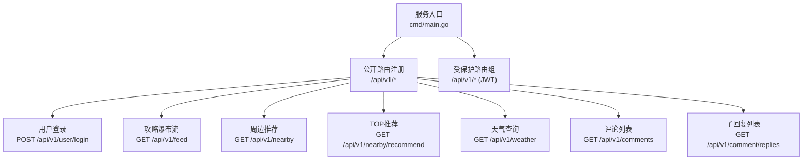
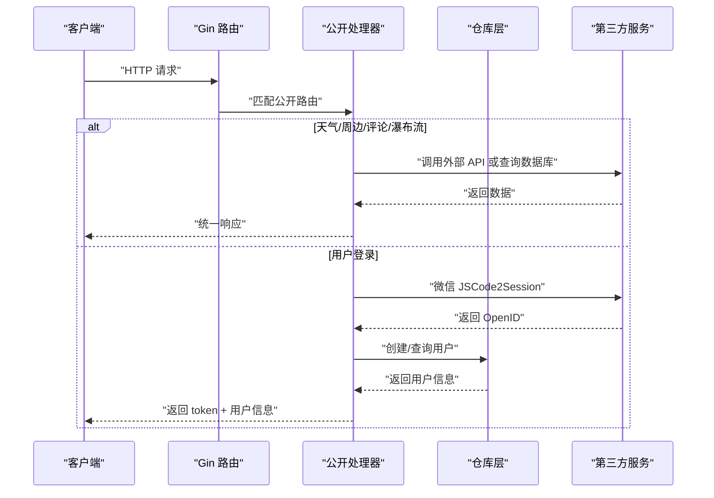
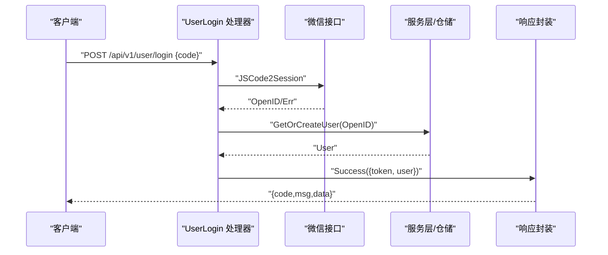
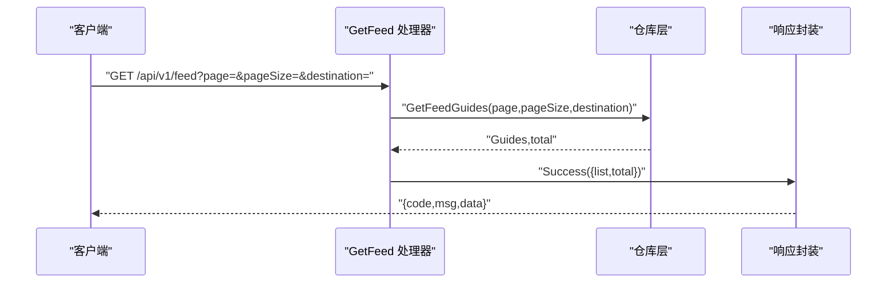
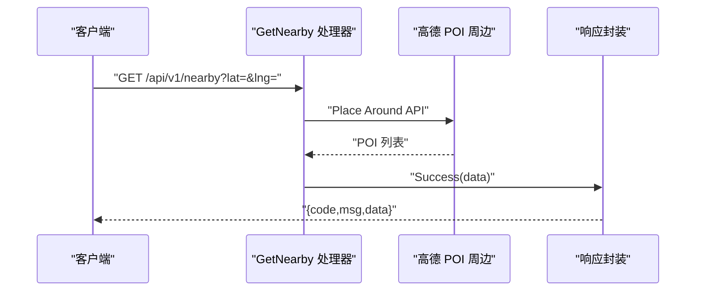
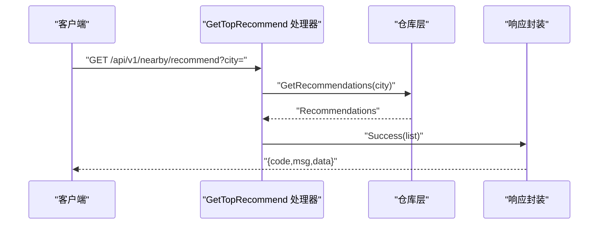
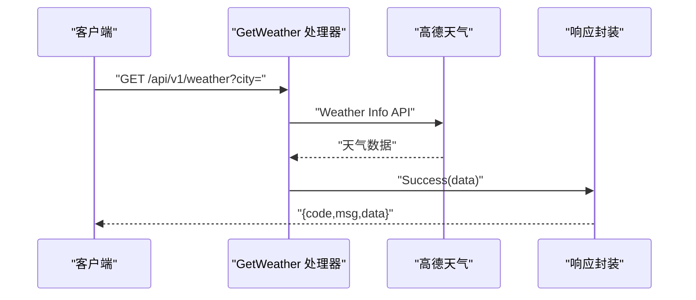
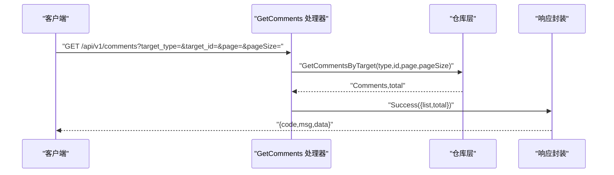
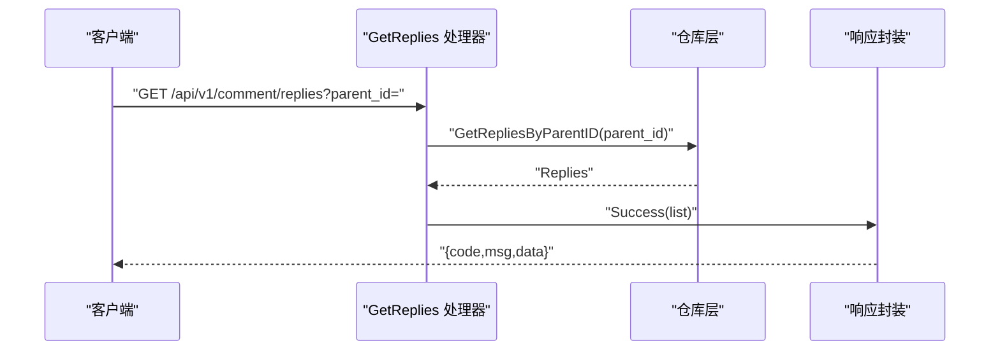
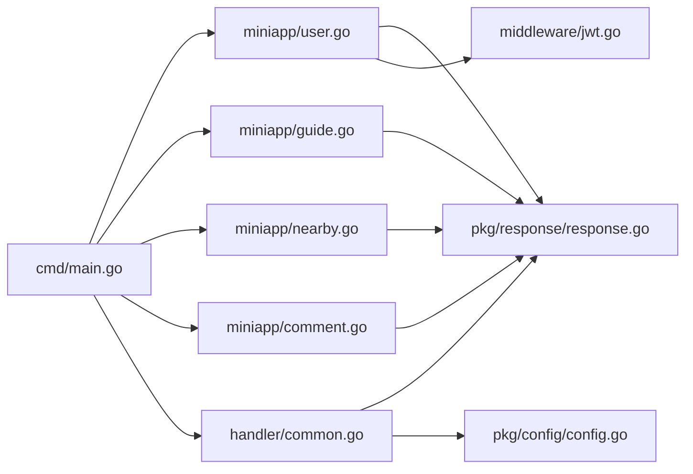

# 公开接口

<cite>
**本文引用的文件**
- [cmd/main.go](file://cmd/main.go)
- [internal/handler/common.go](file://internal/handler/common.go)
- [internal/handler/miniapp/user.go](file://internal/handler/miniapp/user.go)
- [internal/handler/miniapp/guide.go](file://internal/handler/miniapp/guide.go)
- [internal/handler/miniapp/nearby.go](file://internal/handler/miniapp/nearby.go)
- [internal/handler/miniapp/comment.go](file://internal/handler/miniapp/comment.go)
- [internal/middleware/jwt.go](file://internal/middleware/jwt.go)
- [pkg/config/config.go](file://pkg/config/config.go)
- [pkg/response/response.go](file://pkg/response/response.go)
- [internal/model/user.go](file://internal/model/user.go)
- [internal/model/guide.go](file://internal/model/guide.go)
- [internal/model/comment.go](file://internal/model/comment.go)
- [internal/repository/recommendation_repo.go](file://internal/repository/recommendation_repo.go)
- [README.md](file://README.md)
</cite>

## 目录
1. [简介](#简介)
2. [项目结构](#项目结构)
3. [核心组件](#核心组件)
4. [架构总览](#架构总览)
5. [详细组件分析](#详细组件分析)
6. [依赖关系分析](#依赖关系分析)
7. [性能考虑](#性能考虑)
8. [故障排查指南](#故障排查指南)
9. [结论](#结论)
10. [附录](#附录)

## 简介
本文件面向前端与集成开发者，系统性梳理旅行小程序后端中“无需登录即可访问”的公开接口，覆盖用户登录、攻略瀑布流、周边推荐、天气查询、评论列表等能力。文档逐项给出 HTTP 方法、URL 路径、请求参数、响应格式、典型使用场景与调用方式，并提供错误处理说明、常见异常与最佳实践建议。

## 项目结构
- 服务入口负责加载配置、初始化数据库、注册路由与中间件，并暴露 Swagger 文档。
- 公开接口集中在 /api/v1 下，无需 Authorization 即可访问。
- 需登录的接口位于 /api/v1 下的受保护分组，使用 JWT 中间件校验。

图表来源
- [cmd/main.go:47-57](file://cmd/main.go#L47-L57)

章节来源
- [cmd/main.go:31-151](file://cmd/main.go#L31-L151)
- [README.md:154-205](file://README.md#L154-L205)

## 核心组件
- 统一响应封装：所有接口返回统一结构，便于前端解析与错误处理。
- 配置加载：通过环境变量注入第三方服务密钥（如高德地图）。
- 公共处理器：天气查询与 WebSocket 公共处理。
- 小程序端公开接口：用户登录、攻略瀑布流、周边推荐、评论相关等。

章节来源
- [pkg/response/response.go:10-25](file://pkg/response/response.go#L10-L25)
- [pkg/config/config.go:61-99](file://pkg/config/config.go#L61-L99)
- [internal/handler/common.go:19-42](file://internal/handler/common.go#L19-L42)

## 架构总览
公开接口整体调用链路如下：

图表来源
- [cmd/main.go:47-57](file://cmd/main.go#L47-L57)
- [internal/handler/common.go:19-42](file://internal/handler/common.go#L19-L42)
- [internal/handler/miniapp/user.go:19-51](file://internal/handler/miniapp/user.go#L19-L51)
- [internal/handler/miniapp/guide.go:13-31](file://internal/handler/miniapp/guide.go#L13-L31)
- [internal/handler/miniapp/nearby.go:17-43](file://internal/handler/miniapp/nearby.go#L17-L43)
- [internal/handler/miniapp/comment.go:34-58](file://internal/handler/miniapp/comment.go#L34-L58)

## 详细组件分析

### 用户登录
- 方法与路径
  - POST /api/v1/user/login
- 请求参数
  - JSON 参数：code（字符串，必填）
- 响应格式
  - 成功：{ code: 0, msg: "ok", data: { token: string, user: User } }
  - 失败：{ code: 1, msg: string }
- 使用场景
  - 小程序首次登录，换取用户身份与 JWT。
- 调用流程
  - 以 code 调用微信 JSCode2Session 获取 openid。
  - 通过服务层创建/查询用户，生成小程序 JWT。
- 错误处理
  - 参数缺失或微信接口异常时返回错误。
- 性能与安全
  - 建议前端缓存 token，减少重复登录。
  - 服务端对微信接口调用进行超时与重试策略（建议）。

图表来源
- [internal/handler/miniapp/user.go:19-51](file://internal/handler/miniapp/user.go#L19-L51)
- [internal/middleware/jwt.go:26-36](file://internal/middleware/jwt.go#L26-L36)

章节来源
- [internal/handler/miniapp/user.go:19-51](file://internal/handler/miniapp/user.go#L19-L51)
- [internal/middleware/jwt.go:26-36](file://internal/middleware/jwt.go#L26-L36)
- [pkg/response/response.go:17-25](file://pkg/response/response.go#L17-L25)

### 攻略瀑布流
- 方法与路径
  - GET /api/v1/feed
- 请求参数
  - page（整数，可选，默认 1）
  - pageSize（整数，可选，默认 10）
  - destination（字符串，可选，按目的地筛选）
- 响应格式
  - 成功：{ code: 0, msg: "ok", data: { list: Guide[], total: number } }
  - 失败：{ code: 1, msg: string }
- 使用场景
  - 首页瀑布流展示公开攻略。
- 调用方式
  - 分页拉取，支持按目的地过滤。
- 错误处理
  - 数据库查询异常时返回错误。
- 性能建议
  - 前端做滚动分页，避免一次性加载过多。
  - 对热门目的地增加缓存（建议）。

图表来源
- [internal/handler/miniapp/guide.go:13-31](file://internal/handler/miniapp/guide.go#L13-L31)
- [internal/model/guide.go:9-27](file://internal/model/guide.go#L9-L27)

章节来源
- [internal/handler/miniapp/guide.go:13-31](file://internal/handler/miniapp/guide.go#L13-L31)
- [internal/model/guide.go:9-27](file://internal/model/guide.go#L9-L27)
- [pkg/response/response.go:17-25](file://pkg/response/response.go#L17-L25)

### 周边推荐
- 方法与路径
  - GET /api/v1/nearby
- 请求参数
  - lat（字符串，必填，纬度）
  - lng（字符串，必填，经度）
- 响应格式
  - 成功：{ code: 0, msg: "ok", data: any }
  - 失败：{ code: 1, msg: string }
- 使用场景
  - 基于当前位置搜索周边景区/民宿。
- 调用方式
  - 传入经纬度，调用高德 POI 周边搜索。
- 错误处理
  - 缺少经纬度或高德接口异常时返回错误。
- 性能建议
  - 前端合并频繁请求，限制搜索半径与关键词。
  - 对热门区域结果做本地缓存（建议）。

图表来源
- [internal/handler/miniapp/nearby.go:17-43](file://internal/handler/miniapp/nearby.go#L17-L43)
- [pkg/config/config.go:95-96](file://pkg/config/config.go#L95-L96)

章节来源
- [internal/handler/miniapp/nearby.go:17-43](file://internal/handler/miniapp/nearby.go#L17-L43)
- [pkg/config/config.go:95-96](file://pkg/config/config.go#L95-L96)
- [pkg/response/response.go:17-25](file://pkg/response/response.go#L17-L25)

### 本周 TOP 推荐
- 方法与路径
  - GET /api/v1/nearby/recommend
- 请求参数
  - city（字符串，可选，按城市筛选）
- 响应格式
  - 成功：{ code: 0, msg: "ok", data: Recommendation[] }
  - 失败：{ code: 1, msg: string }
- 使用场景
  - 展示后台配置的“本周 TOP 推荐”列表。
- 调用方式
  - 可选传入城市参数，后端按条件查询。
- 错误处理
  - 查询异常时返回错误。
- 性能建议
  - 对推荐列表做短期缓存（建议）。

图表来源
- [internal/handler/miniapp/nearby.go:45-59](file://internal/handler/miniapp/nearby.go#L45-L59)
- [internal/repository/recommendation_repo.go:13-22](file://internal/repository/recommendation_repo.go#L13-L22)

章节来源
- [internal/handler/miniapp/nearby.go:45-59](file://internal/handler/miniapp/nearby.go#L45-L59)
- [internal/repository/recommendation_repo.go:13-22](file://internal/repository/recommendation_repo.go#L13-L22)
- [pkg/response/response.go:17-25](file://pkg/response/response.go#L17-L25)

### 天气查询
- 方法与路径
  - GET /api/v1/weather
- 请求参数
  - city（字符串，必填，城市名称）
- 响应格式
  - 成功：{ code: 0, msg: "ok", data: any }
  - 失败：{ code: 1, msg: string }
- 使用场景
  - 获取指定城市的天气信息（扩展字段）。
- 调用方式
  - 通过高德天气接口查询，透传第三方返回。
- 错误处理
  - 缺少 city 或高德接口异常时返回错误。
- 性能建议
  - 对常用城市做本地缓存，降低第三方调用频率（建议）。

图表来源
- [internal/handler/common.go:19-42](file://internal/handler/common.go#L19-L42)
- [pkg/config/config.go:95-96](file://pkg/config/config.go#L95-L96)

章节来源
- [internal/handler/common.go:19-42](file://internal/handler/common.go#L19-L42)
- [pkg/config/config.go:95-96](file://pkg/config/config.go#L95-L96)
- [pkg/response/response.go:17-25](file://pkg/response/response.go#L17-L25)

### 评论列表
- 方法与路径
  - GET /api/v1/comments
- 请求参数
  - target_type（字符串，必填，取值 guide 或 trip）
  - target_id（整数，必填，目标对象 ID）
  - page（整数，可选，默认 1）
  - pageSize（整数，可选，默认 10）
- 响应格式
  - 成功：{ code: 0, msg: "ok", data: { list: Comment[], total: number } }
  - 失败：{ code: 1, msg: string }
- 使用场景
  - 展示某篇攻略或行程下的评论列表。
- 调用方式
  - 按目标类型与 ID 查询评论，支持分页。
- 错误处理
  - 参数缺失或查询异常时返回错误。
- 性能建议
  - 对热门目标的评论做分页缓存（建议）。

图表来源
- [internal/handler/miniapp/comment.go:34-58](file://internal/handler/miniapp/comment.go#L34-L58)
- [internal/model/comment.go:5-15](file://internal/model/comment.go#L5-L15)

章节来源
- [internal/handler/miniapp/comment.go:34-58](file://internal/handler/miniapp/comment.go#L34-L58)
- [internal/model/comment.go:5-15](file://internal/model/comment.go#L5-L15)
- [pkg/response/response.go:17-25](file://pkg/response/response.go#L17-L25)

### 子回复列表
- 方法与路径
  - GET /api/v1/comment/replies
- 请求参数
  - parent_id（整数，必填，父评论 ID）
- 响应格式
  - 成功：{ code: 0, msg: "ok", data: Comment[] }
  - 失败：{ code: 1, msg: string }
- 使用场景
  - 展示某条评论下的子回复列表。
- 调用方式
  - 按父评论 ID 查询回复。
- 错误处理
  - 查询异常时返回错误。
- 性能建议
  - 对热点评论的回复做缓存（建议）。

图表来源
- [internal/handler/miniapp/comment.go:60-74](file://internal/handler/miniapp/comment.go#L60-L74)

章节来源
- [internal/handler/miniapp/comment.go:60-74](file://internal/handler/miniapp/comment.go#L60-L74)
- [pkg/response/response.go:17-25](file://pkg/response/response.go#L17-L25)

## 依赖关系分析
- 路由注册集中于服务入口，公开接口与受保护接口分组清晰。
- 公共处理器依赖配置模块读取第三方服务 Key。
- 处理器依赖仓库层执行数据库查询。
- 统一响应封装保证前后端契约一致。

图表来源
- [cmd/main.go:47-57](file://cmd/main.go#L47-L57)
- [internal/handler/common.go:19-42](file://internal/handler/common.go#L19-L42)
- [internal/handler/miniapp/user.go:19-51](file://internal/handler/miniapp/user.go#L19-L51)
- [internal/handler/miniapp/guide.go:13-31](file://internal/handler/miniapp/guide.go#L13-L31)
- [internal/handler/miniapp/nearby.go:17-43](file://internal/handler/miniapp/nearby.go#L17-L43)
- [internal/handler/miniapp/comment.go:34-58](file://internal/handler/miniapp/comment.go#L34-L58)
- [pkg/response/response.go:17-25](file://pkg/response/response.go#L17-L25)
- [pkg/config/config.go:95-96](file://pkg/config/config.go#L95-L96)
- [internal/middleware/jwt.go:26-36](file://internal/middleware/jwt.go#L26-L36)

章节来源
- [cmd/main.go:47-57](file://cmd/main.go#L47-L57)
- [pkg/config/config.go:95-96](file://pkg/config/config.go#L95-L96)
- [pkg/response/response.go:17-25](file://pkg/response/response.go#L17-L25)

## 性能考虑
- 缓存策略
  - 对高频查询（天气、周边、评论、推荐）实施短期缓存，降低第三方与数据库压力。
- 分页与限流
  - 公开接口默认分页，建议前端做请求去抖与合并，服务端可引入简单限流（建议）。
- 超时与重试
  - 调用第三方接口时设置合理超时与指数退避重试（建议）。
- 响应压缩
  - 启用 gzip 压缩（建议）。
- CDN 与就近接入
  - 第三方 API 可结合就近域名或代理（建议）。

## 故障排查指南
- 常见错误与定位
  - 参数缺失：检查必填参数是否传递（如 city、lat/lng、target_type/target_id）。
  - 第三方接口异常：确认高德 Key 是否正确、配额是否充足。
  - 数据库异常：关注仓库层查询错误返回。
- 统一错误响应
  - 所有错误返回 { code: 1, msg: string }，前端据此提示与重试。
- 日志与监控
  - 建议在处理器中记录关键请求参数与错误堆栈，便于定位问题（建议）。

章节来源
- [internal/handler/common.go:25-41](file://internal/handler/common.go#L25-L41)
- [internal/handler/miniapp/user.go:28-50](file://internal/handler/miniapp/user.go#L28-L50)
- [internal/handler/miniapp/guide.go:21-30](file://internal/handler/miniapp/guide.go#L21-L30)
- [internal/handler/miniapp/nearby.go:24-42](file://internal/handler/miniapp/nearby.go#L24-L42)
- [internal/handler/miniapp/comment.go:43-57](file://internal/handler/miniapp/comment.go#L43-L57)
- [pkg/response/response.go:22-25](file://pkg/response/response.go#L22-L25)

## 结论
本文档梳理了旅行小程序后端的公开接口，明确了各接口的调用方式、参数约束与响应格式，并给出了错误处理与性能优化建议。建议在生产环境中配合缓存、限流与监控机制，持续提升稳定性与用户体验。

## 附录
- 路由概览（公开接口）
  - POST /api/v1/user/login
  - GET /api/v1/feed
  - GET /api/v1/nearby
  - GET /api/v1/nearby/recommend
  - GET /api/v1/weather
  - GET /api/v1/comments
  - GET /api/v1/comment/replies

章节来源
- [cmd/main.go:47-57](file://cmd/main.go#L47-L57)
- [README.md:154-205](file://README.md#L154-L205)