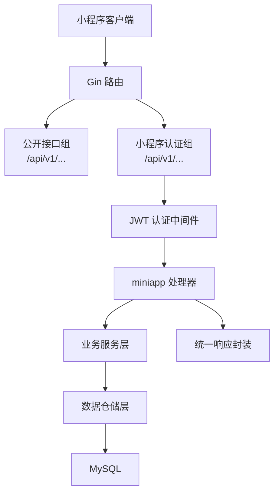
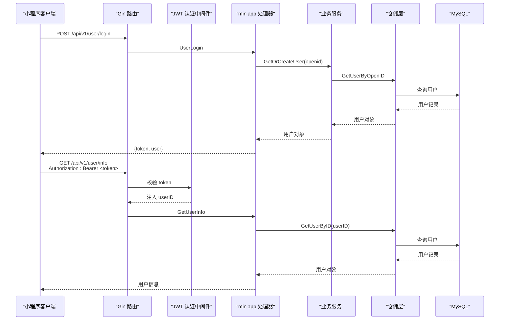
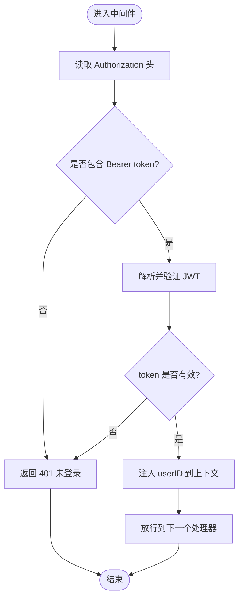
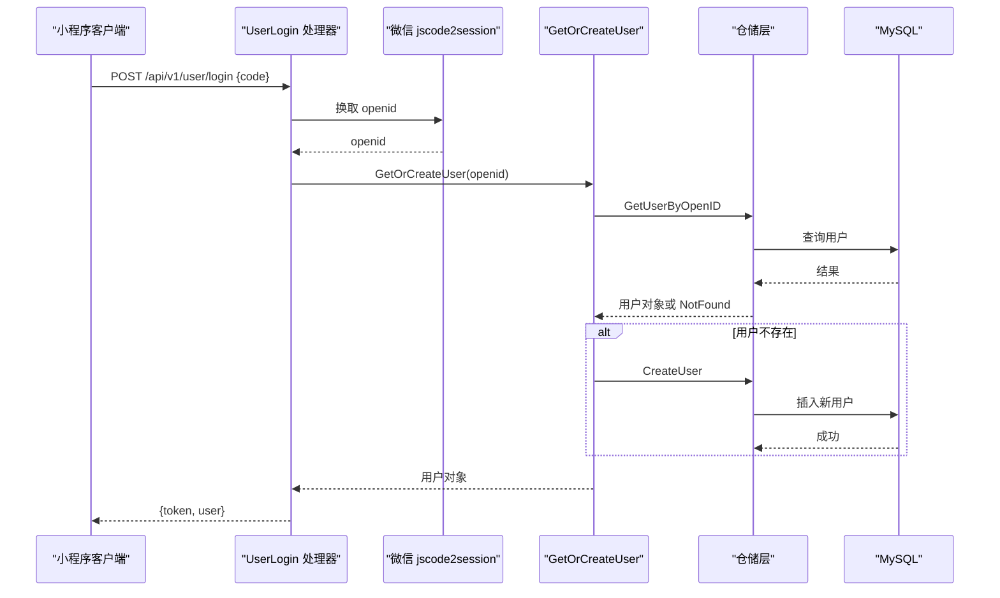
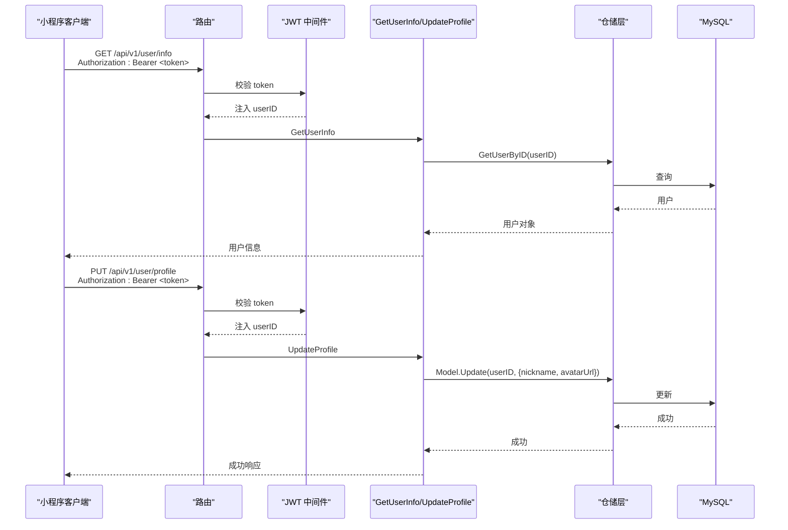
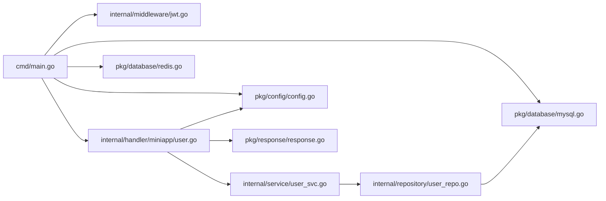

# 小程序认证接口

<cite>
**本文引用的文件**
- [main.go](file://cmd/main.go)
- [jwt.go](file://internal/middleware/jwt.go)
- [user.go](file://internal/handler/miniapp/user.go)
- [user.go](file://internal/repository/user_repo.go)
- [user_svc.go](file://internal/service/user_svc.go)
- [config.go](file://pkg/config/config.go)
- [response.go](file://pkg/response/response.go)
- [mysql.go](file://pkg/database/mysql.go)
- [redis.go](file://pkg/database/redis.go)
- [README.md](file://README.md)
</cite>

## 目录
1. [简介](#简介)
2. [项目结构](#项目结构)
3. [核心组件](#核心组件)
4. [架构总览](#架构总览)
5. [详细组件分析](#详细组件分析)
6. [依赖关系分析](#依赖关系分析)
7. [性能考虑](#性能考虑)
8. [故障排除指南](#故障排除指南)
9. [结论](#结论)
10. [附录](#附录)

## 简介
本文件面向小程序前端开发者，提供“旅行搭子”小程序后端的认证接口完整集成指南。重点覆盖以下内容：
- 需要 JWT 认证的小程序端接口清单与使用方法
- 用户信息获取与个人资料更新接口的调用规范
- JWT 认证机制的工作原理：token 生成、验证与过期策略
- 认证头设置方法与 token 管理策略
- 认证失败的处理方案与安全注意事项
- 基于仓库现有实现的端到端集成步骤

## 项目结构
后端采用 Gin 框架，路由在服务入口集中注册，认证通过中间件实现，用户相关接口位于 miniapp 分组下，公开接口与小程序认证接口清晰分离。

图表来源
- [main.go:47-118](file://cmd/main.go#L47-L118)
- [jwt.go:48-65](file://internal/middleware/jwt.go#L48-L65)
- [user.go:77-115](file://internal/handler/miniapp/user.go#L77-L115)

章节来源
- [main.go:47-118](file://cmd/main.go#L47-L118)
- [README.md:154-205](file://README.md#L154-L205)

## 核心组件
- 认证中间件：负责从请求头解析 Bearer token，校验签名与有效期，并将用户标识注入上下文。
- 登录处理器：通过微信 jscode2session 获取 openid，查询或创建用户，签发小程序 JWT。
- 用户信息处理器：从上下文读取用户标识，查询用户信息。
- 统一响应：标准化返回结构，便于前端处理。

章节来源
- [jwt.go:14-46](file://internal/middleware/jwt.go#L14-L46)
- [user.go:19-75](file://internal/handler/miniapp/user.go#L19-L75)
- [response.go:10-25](file://pkg/response/response.go#L10-L25)

## 架构总览
小程序端认证接口均位于 `/api/v1` 下的认证组，通过全局中间件启用 JWT 校验。公开接口（如登录、瀑布流、周边推荐等）无需认证。

图表来源
- [main.go:50-64](file://cmd/main.go#L50-L64)
- [jwt.go:48-65](file://internal/middleware/jwt.go#L48-L65)
- [user.go:19-91](file://internal/handler/miniapp/user.go#L19-L91)
- [user_svc.go:12-27](file://internal/service/user_svc.go#L12-L27)
- [user_repo.go:8-28](file://internal/repository/user_repo.go#L8-L28)

## 详细组件分析

### JWT 认证中间件
- 密钥与声明
  - 小程序 JWT 密钥与后台管理 JWT 密钥分离，分别用于不同场景。
  - Claims 包含用户标识与标准声明（过期时间、签发者等）。
- 生成与解析
  - 生成：以 HS256 算法签名，设置 7 天有效期。
  - 解析：校验签名与有效期，失败则返回未授权。
- 中间件行为
  - 从 Authorization 请求头提取 Bearer token。
  - 校验失败中断请求并返回未授权。
  - 成功则将用户标识写入上下文，供后续处理器使用。

图表来源
- [jwt.go:48-65](file://internal/middleware/jwt.go#L48-L65)

章节来源
- [jwt.go:14-46](file://internal/middleware/jwt.go#L14-L46)
- [jwt.go:48-65](file://internal/middleware/jwt.go#L48-L65)

### 小程序登录流程
- 输入：小程序前端传入微信临时登录凭证 code。
- 步骤：
  1) 调用微信 jscode2session 获取 openid。
  2) 通过业务服务查询或创建用户。
  3) 生成小程序 JWT 并返回给前端。
- 注意：登录接口为公开接口，不需认证头。

图表来源
- [user.go:19-75](file://internal/handler/miniapp/user.go#L19-L75)
- [user_svc.go:12-27](file://internal/service/user_svc.go#L12-L27)
- [user_repo.go:8-21](file://internal/repository/user_repo.go#L8-L21)

章节来源
- [user.go:19-75](file://internal/handler/miniapp/user.go#L19-L75)
- [user_svc.go:12-27](file://internal/service/user_svc.go#L12-L27)
- [user_repo.go:8-21](file://internal/repository/user_repo.go#L8-L21)

### 用户信息与个人资料接口
- 获取用户信息
  - 路径：GET /api/v1/user/info
  - 认证：需要 Bearer token
  - 行为：从上下文读取 userID，查询用户并返回
- 更新个人资料
  - 路径：PUT /api/v1/user/profile
  - 认证：需要 Bearer token
  - 请求体：包含 nickname 与 avatarUrl
  - 行为：更新用户昵称与头像字段

图表来源
- [main.go:63-64](file://cmd/main.go#L63-L64)
- [jwt.go:48-65](file://internal/middleware/jwt.go#L48-L65)
- [user.go:77-115](file://internal/handler/miniapp/user.go#L77-L115)
- [user_repo.go:23-28](file://internal/repository/user_repo.go#L23-L28)

章节来源
- [main.go:63-64](file://cmd/main.go#L63-L64)
- [user.go:77-115](file://internal/handler/miniapp/user.go#L77-L115)
- [user_repo.go:23-28](file://internal/repository/user_repo.go#L23-L28)

### 认证头设置与 token 管理
- 认证头格式
  - Authorization: Bearer <token>
  - 该格式在路由注释中明确标注为 BearerAuth
- token 生命周期
  - 小程序 JWT 默认有效期为 7 天
  - 建议前端在登录成功后持久化存储 token，并在请求前检查是否过期
- 刷新策略
  - 当前实现未提供内置的 token 刷新接口
  - 建议前端在 token 即将过期时重新触发登录流程，换取新的 token

章节来源
- [jwt.go:26-36](file://internal/middleware/jwt.go#L26-L36)
- [user.go:49](file://internal/handler/miniapp/user.go#L49)
- [README.md:204](file://README.md#L204)

## 依赖关系分析
- 路由与中间件
  - 公开接口与小程序认证接口分组注册，认证组通过中间件启用 JWT 校验
- 处理器与服务
  - 处理器依赖服务层进行业务逻辑处理
  - 服务层依赖仓储层访问数据库
- 配置与基础设施
  - 配置从环境变量加载，数据库与 Redis 在启动时初始化
  - 统一响应封装简化错误与成功返回

图表来源
- [main.go:47-118](file://cmd/main.go#L47-L118)
- [jwt.go:1-123](file://internal/middleware/jwt.go#L1-L123)
- [user.go:1-116](file://internal/handler/miniapp/user.go#L1-L116)
- [user_svc.go:1-28](file://internal/service/user_svc.go#L1-L28)
- [user_repo.go:1-44](file://internal/repository/user_repo.go#L1-L44)
- [mysql.go:17-91](file://pkg/database/mysql.go#L17-L91)
- [redis.go:13-32](file://pkg/database/redis.go#L13-L32)
- [config.go:57-100](file://pkg/config/config.go#L57-L100)
- [response.go:10-25](file://pkg/response/response.go#L10-L25)

章节来源
- [main.go:47-118](file://cmd/main.go#L47-L118)
- [jwt.go:1-123](file://internal/middleware/jwt.go#L1-L123)
- [user.go:1-116](file://internal/handler/miniapp/user.go#L1-L116)
- [user_svc.go:1-28](file://internal/service/user_svc.go#L1-L28)
- [user_repo.go:1-44](file://internal/repository/user_repo.go#L1-L44)
- [mysql.go:17-91](file://pkg/database/mysql.go#L17-L91)
- [redis.go:13-32](file://pkg/database/redis.go#L13-L32)
- [config.go:57-100](file://pkg/config/config.go#L57-L100)
- [response.go:10-25](file://pkg/response/response.go#L10-L25)

## 性能考虑
- JWT 校验为内存计算，开销极低
- 建议前端复用已登录状态，减少不必要的重复登录请求
- 对高频接口可结合缓存策略（如 Redis）优化用户信息查询，但当前实现直接查询数据库

## 故障排除指南
- 未携带认证头
  - 现象：返回未登录
  - 处理：在请求头添加 Authorization: Bearer <token>
- token 无效或过期
  - 现象：返回 token 无效
  - 处理：重新触发登录流程获取新 token
- 用户不存在
  - 现象：获取用户信息时返回用户不存在
  - 处理：确认用户已通过登录流程创建，或检查用户标识是否正确
- 参数错误
  - 现象：更新个人资料时返回参数错误
  - 处理：检查请求体字段是否符合接口定义

章节来源
- [jwt.go:50-64](file://internal/middleware/jwt.go#L50-L64)
- [user.go:32-46](file://internal/handler/miniapp/user.go#L32-L46)
- [user.go:86-89](file://internal/handler/miniapp/user.go#L86-L89)
- [user.go:105-108](file://internal/handler/miniapp/user.go#L105-L108)
- [response.go:22-25](file://pkg/response/response.go#L22-L25)

## 结论
本项目基于 Gin 与 golang-jwt 实现了简洁可靠的 JWT 认证体系，公开接口与小程序认证接口职责清晰。前端只需在需要认证的请求中携带 Bearer token，即可无缝访问用户信息与个人资料更新等接口。建议在前端实现 token 的持久化与过期管理，并在必要时重新登录以获取新 token。

## 附录

### 接口清单与认证要求
- 公开接口（无需认证）
  - POST /api/v1/user/login
  - GET /api/v1/feed
  - GET /api/v1/nearby
  - GET /api/v1/nearby/recommend
  - GET /api/v1/weather
  - GET /api/v1/comments
  - GET /api/v1/comment/replies
- 小程序认证接口（需要 Bearer token）
  - GET /api/v1/user/info
  - PUT /api/v1/user/profile
  - 更多接口详见 README 的“小程序端接口”表格

章节来源
- [README.md:154-205](file://README.md#L154-L205)

### 认证头设置示例
- 请求头格式
  - Authorization: Bearer <token>
- 设置位置
  - 在每个需要认证的 HTTP 请求头中添加上述字段

章节来源
- [README.md:204](file://README.md#L204)

### 安全注意事项
- 密钥管理
  - 当前密钥为硬编码，建议在生产环境通过环境变量注入
- 传输安全
  - 建议仅在 HTTPS 环境下使用，避免 token 泄露
- 令牌生命周期
  - 7 天有效期较长，建议结合刷新策略或缩短有效期
- 日志与监控
  - 对认证失败与异常请求进行记录与告警

章节来源
- [jwt.go:14-18](file://internal/middleware/jwt.go#L14-L18)
- [config.go:61-100](file://pkg/config/config.go#L61-L100)