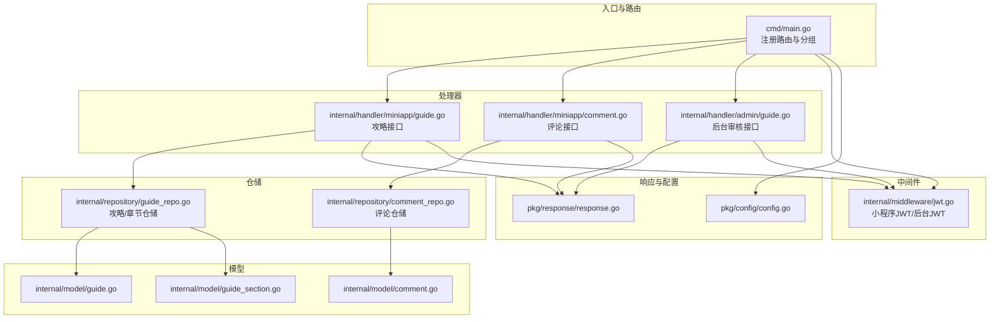
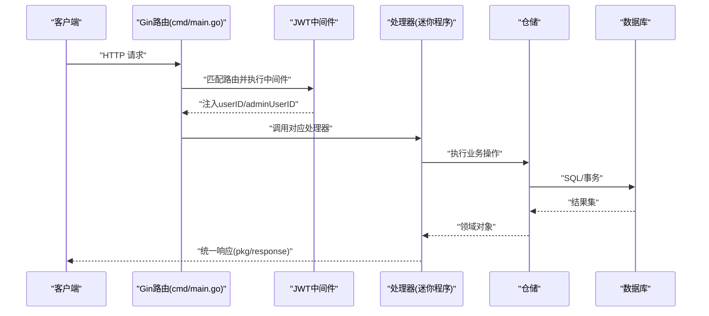
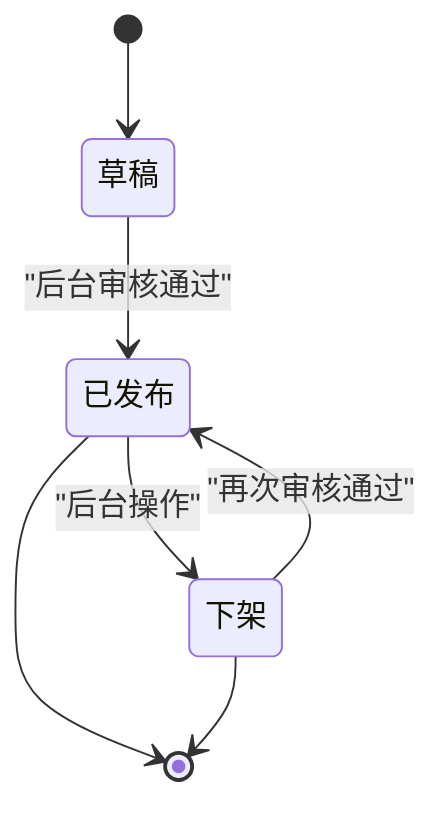
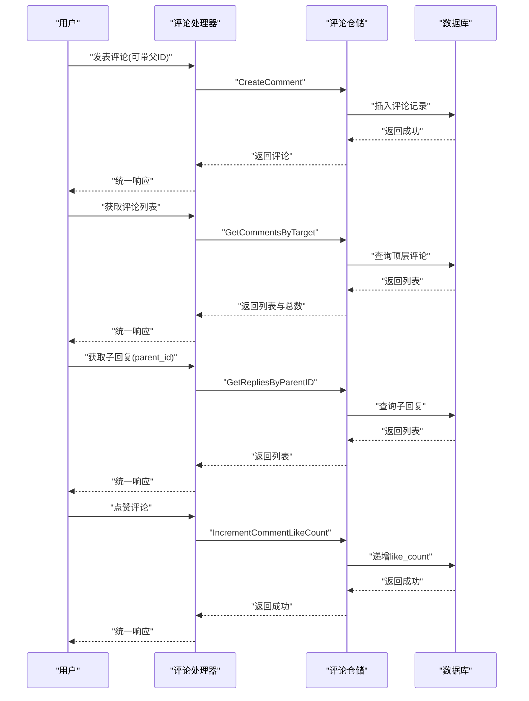
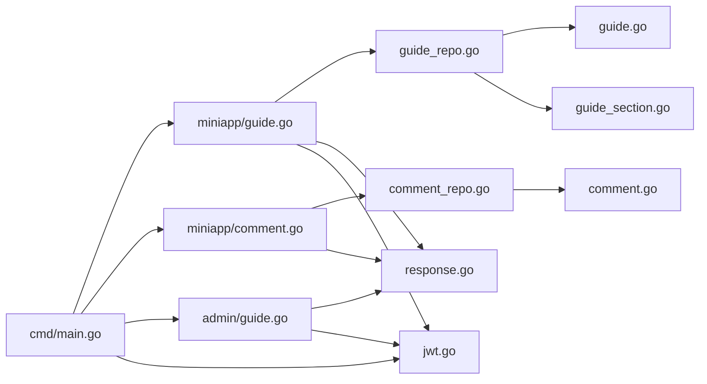

# 攻略系统接口

<cite>
**本文引用的文件**
- [cmd/main.go](file://cmd/main.go)
- [internal/handler/miniapp/guide.go](file://internal/handler/miniapp/guide.go)
- [internal/handler/miniapp/comment.go](file://internal/handler/miniapp/comment.go)
- [internal/handler/admin/guide.go](file://internal/handler/admin/guide.go)
- [internal/middleware/jwt.go](file://internal/middleware/jwt.go)
- [internal/repository/guide_repo.go](file://internal/repository/guide_repo.go)
- [internal/repository/comment_repo.go](file://internal/repository/comment_repo.go)
- [internal/model/guide.go](file://internal/model/guide.go)
- [internal/model/guide_section.go](file://internal/model/guide_section.go)
- [internal/model/comment.go](file://internal/model/comment.go)
- [pkg/response/response.go](file://pkg/response/response.go)
- [pkg/config/config.go](file://pkg/config/config.go)
</cite>

## 目录
1. [简介](#简介)
2. [项目结构](#项目结构)
3. [核心组件](#核心组件)
4. [架构总览](#架构总览)
5. [详细组件分析](#详细组件分析)
6. [依赖关系分析](#依赖关系分析)
7. [性能考虑](#性能考虑)
8. [故障排查指南](#故障排查指南)
9. [结论](#结论)
10. [附录](#附录)

## 简介
本接口文档面向“攻略系统”，覆盖攻略的创建、编辑、浏览与评论能力，以及章节管理、评论嵌套回复与点赞、攻略生命周期与审核机制。系统采用 Gin 路由框架，统一响应体封装，JWT 认证中间件保障安全访问；数据持久化通过 GORM 实现。

## 项目结构
- 路由与入口：在应用入口中注册公开与受保护路由，分组挂载小程序与后台管理模块。
- 处理器层：miniapp 包含攻略与评论接口；admin 包含后台审核与列表接口。
- 中间件层：JWT 认证与后台管理员认证，注入用户上下文。
- 仓储层：封装数据库操作，提供攻略、章节、评论的增删改查与统计。
- 模型层：定义攻略、章节、评论等实体字段及约束。
- 统一响应：标准化返回结构，便于前端消费。

图表来源
- [cmd/main.go:46-143](file://cmd/main.go#L46-L143)
- [internal/handler/miniapp/guide.go:13-101](file://internal/handler/miniapp/guide.go#L13-L101)
- [internal/handler/miniapp/comment.go:13-91](file://internal/handler/miniapp/comment.go#L13-L91)
- [internal/handler/admin/guide.go:12-62](file://internal/handler/admin/guide.go#L12-L62)
- [internal/middleware/jwt.go:48-122](file://internal/middleware/jwt.go#L48-L122)
- [internal/repository/guide_repo.go:12-104](file://internal/repository/guide_repo.go#L12-L104)
- [internal/repository/comment_repo.go:10-46](file://internal/repository/comment_repo.go#L10-L46)
- [internal/model/guide.go:9-27](file://internal/model/guide.go#L9-L27)
- [internal/model/guide_section.go:18-27](file://internal/model/guide_section.go#L18-L27)
- [internal/model/comment.go:5-15](file://internal/model/comment.go#L5-L15)
- [pkg/response/response.go:10-26](file://pkg/response/response.go#L10-L26)
- [pkg/config/config.go:51-87](file://pkg/config/config.go#L51-L87)

章节来源
- [cmd/main.go:46-143](file://cmd/main.go#L46-L143)

## 核心组件
- 攻略模型：包含标题、封面、目的地、摘要、预算区间、建议天数、浏览/点赞计数、状态、软删除等字段。
- 章节模型：支持概览、交通、住宿、美食、景点、行程、预算、注意事项、自定义等板块类型，按排序序号排列。
- 评论模型：支持目标类型与ID、父子级嵌套回复、点赞计数。
- 仓储接口：提供攻略瀑布流、详情、章节读取、创建、更新状态、浏览量递增；评论创建、列表、子回复、点赞。
- 处理器接口：提供攻略创建、详情、章节新增；评论创建、列表、子回复、点赞；后台攻略列表与审核。
- 认证中间件：小程序用户与后台管理员双令牌体系，注入 userID 或 adminUserID。

章节来源
- [internal/model/guide.go:9-27](file://internal/model/guide.go#L9-L27)
- [internal/model/guide_section.go:5-16](file://internal/model/guide_section.go#L5-L16)
- [internal/model/guide_section.go:18-27](file://internal/model/guide_section.go#L18-L27)
- [internal/model/comment.go:5-15](file://internal/model/comment.go#L5-L15)
- [internal/repository/guide_repo.go:12-104](file://internal/repository/guide_repo.go#L12-L104)
- [internal/repository/comment_repo.go:10-46](file://internal/repository/comment_repo.go#L10-L46)
- [internal/handler/miniapp/guide.go:13-101](file://internal/handler/miniapp/guide.go#L13-L101)
- [internal/handler/miniapp/comment.go:13-91](file://internal/handler/miniapp/comment.go#L13-L91)
- [internal/handler/admin/guide.go:12-62](file://internal/handler/admin/guide.go#L12-L62)
- [internal/middleware/jwt.go:48-122](file://internal/middleware/jwt.go#L48-L122)

## 架构总览
下图展示从客户端到处理器、仓储与数据库的整体调用链路，以及认证与响应封装流程。

图表来源
- [cmd/main.go:46-143](file://cmd/main.go#L46-L143)
- [internal/middleware/jwt.go:48-122](file://internal/middleware/jwt.go#L48-L122)
- [pkg/response/response.go:17-25](file://pkg/response/response.go#L17-L25)

## 详细组件分析

### 攻略接口
- 创建攻略
  - 方法与路径：POST /api/v1/guide
  - 认证：小程序 JWT（Bearer）
  - 请求体：攻略模型（除作者、状态、计数外）
  - 响应：成功返回创建的攻略；失败返回统一错误
  - 说明：默认状态为草稿，作者ID来自 JWT 注入
- 获取攻略详情
  - 方法与路径：GET /api/v1/guide/{id}
  - 认证：无需登录
  - 路径参数：id（攻略ID）
  - 响应：返回攻略与章节集合；非作者访问会增加浏览量
- 获取瀑布流
  - 方法与路径：GET /api/v1/feed
  - 认证：无需登录
  - 查询参数：page、pageSize、destination（可选）
  - 响应：分页列表与总数
- 新增章节
  - 方法与路径：POST /api/v1/guide/section
  - 认证：小程序 JWT（Bearer）
  - 请求体：章节模型（包含板块类型、标题、内容、排序）
  - 响应：成功返回新增章节

章节来源
- [internal/handler/miniapp/guide.go:13-101](file://internal/handler/miniapp/guide.go#L13-L101)
- [internal/repository/guide_repo.go:12-104](file://internal/repository/guide_repo.go#L12-L104)
- [internal/model/guide.go:9-27](file://internal/model/guide.go#L9-L27)
- [internal/model/guide_section.go:18-27](file://internal/model/guide_section.go#L18-L27)

### 评论接口
- 发表评论
  - 方法与路径：POST /api/v1/comment
  - 认证：小程序 JWT（Bearer）
  - 请求体：评论模型（目标类型、目标ID、内容，可选父评论ID）
  - 响应：成功返回评论
- 获取评论列表
  - 方法与路径：GET /api/v1/comments
  - 认证：无需登录
  - 查询参数：target_type（guide/trip）、target_id、page、pageSize
  - 响应：评论列表与总数
- 获取子回复
  - 方法与路径：GET /api/v1/comment/replies
  - 认证：无需登录
  - 查询参数：parent_id（父评论ID）
  - 响应：该父评论下的子回复列表
- 点赞评论
  - 方法与路径：POST /api/v1/comment/{id}/like
  - 认证：小程序 JWT（Bearer）
  - 路径参数：id（评论ID）
  - 响应：成功无返回体

章节来源
- [internal/handler/miniapp/comment.go:13-91](file://internal/handler/miniapp/comment.go#L13-L91)
- [internal/repository/comment_repo.go:10-46](file://internal/repository/comment_repo.go#L10-L46)
- [internal/model/comment.go:5-15](file://internal/model/comment.go#L5-L15)

### 后台审核接口
- 后台攻略列表
  - 方法与路径：GET /api/v1/admin/guides
  - 认证：后台 JWT（Bearer）
  - 查询参数：page、pageSize
  - 响应：攻略列表与总数
- 更新攻略状态
  - 方法与路径：PUT /api/v1/admin/guide/{id}/status
  - 认证：后台 JWT（Bearer）
  - 路径参数：id（攻略ID）
  - 请求体：状态（1 已发布 / 2 下架）
  - 响应：成功无返回体

章节来源
- [internal/handler/admin/guide.go:12-62](file://internal/handler/admin/guide.go#L12-L62)
- [internal/repository/guide_repo.go:41-54](file://internal/repository/guide_repo.go#L41-L54)

### 认证与授权
- 小程序用户 JWT
  - 生成：包含 userID、过期时间、签发方
  - 校验：Authorization Bearer 头部传递
  - 中间件：自动注入 userID 到上下文
- 后台管理员 JWT
  - 生成：包含 adminUserID、过期时间、签发方
  - 校验：Authorization Bearer 头部传递
  - 中间件：校验管理员存在且启用，注入 adminUserID 与角色

章节来源
- [internal/middleware/jwt.go:26-46](file://internal/middleware/jwt.go#L26-L46)
- [internal/middleware/jwt.go:73-93](file://internal/middleware/jwt.go#L73-L93)
- [internal/middleware/jwt.go:48-65](file://internal/middleware/jwt.go#L48-L65)
- [internal/middleware/jwt.go:95-122](file://internal/middleware/jwt.go#L95-L122)

### 统一响应
- 成功响应：Code=0，Msg="ok"，Data 为业务数据
- 错误响应：Code=1，Msg 为错误描述
- 使用：处理器在异常分支调用 Fail，在成功分支调用 Success

章节来源
- [pkg/response/response.go:10-26](file://pkg/response/response.go#L10-L26)

### 数据模型与复杂度
- 攻略模型：字段用于存储基础信息与状态，查询瀑布流与详情属于 O(logN)~O(N) 的范围查询与分页扫描。
- 章节模型：按排序序号升序读取，批量创建支持一次性写入，复杂度与条目数线性相关。
- 评论模型：按目标类型与ID过滤顶层评论，子回复按父ID查询，均为索引驱动的等值/范围查询。

章节来源
- [internal/model/guide.go:9-27](file://internal/model/guide.go#L9-L27)
- [internal/model/guide_section.go:18-27](file://internal/model/guide_section.go#L18-L27)
- [internal/model/comment.go:5-15](file://internal/model/comment.go#L5-L15)
- [internal/repository/guide_repo.go:64-70](file://internal/repository/guide_repo.go#L64-L70)
- [internal/repository/comment_repo.go:15-26](file://internal/repository/comment_repo.go#L15-L26)

### 生命周期与审核机制
- 状态流转
  - 草稿：创建时默认状态为草稿，仅作者可见。
  - 已发布：后台审核通过后状态变为已发布，进入公开瀑布流。
  - 下架：后台可将已发布攻略下架，不再对外展示。
- 审核流程
  - 后台管理员在后台列表中查看所有状态的攻略，选择将草稿改为已发布或下架。
  - 审核接口对状态值进行校验，确保只接受有效状态。

图表来源
- [internal/model/guide.go:23](file://internal/model/guide.go#L23)
- [internal/handler/admin/guide.go:31-61](file://internal/handler/admin/guide.go#L31-L61)

章节来源
- [internal/model/guide.go:23](file://internal/model/guide.go#L23)
- [internal/handler/admin/guide.go:31-61](file://internal/handler/admin/guide.go#L31-L61)

### 富文本与图片上传
- 富文本编辑
  - 章节内容字段支持富文本/Markdown，可在前端编辑器中生成并提交。
- 图片上传
  - 项目包含上传目录与七牛云相关配置项，可用于上传封面与内容图片。
  - 建议：前端上传至对象存储，后端保存访问 URL 到封面或章节内容中。

章节来源
- [internal/model/guide_section.go:24](file://internal/model/guide_section.go#L24)
- [pkg/config/config.go:75-82](file://pkg/config/config.go#L75-L82)

### 评论系统：嵌套回复与点赞
- 嵌套回复
  - 评论模型包含父评论ID字段，支持多级回复。
  - 获取评论列表时先取顶层评论，再通过父ID获取子回复。
- 点赞
  - 评论模型包含点赞计数字段，提供点赞接口进行递增。

图表来源
- [internal/handler/miniapp/comment.go:13-91](file://internal/handler/miniapp/comment.go#L13-L91)
- [internal/repository/comment_repo.go:10-46](file://internal/repository/comment_repo.go#L10-L46)
- [internal/model/comment.go:5-15](file://internal/model/comment.go#L5-L15)

章节来源
- [internal/handler/miniapp/comment.go:13-91](file://internal/handler/miniapp/comment.go#L13-L91)
- [internal/repository/comment_repo.go:10-46](file://internal/repository/comment_repo.go#L10-L46)
- [internal/model/comment.go:5-15](file://internal/model/comment.go#L5-L15)

## 依赖关系分析
- 路由到处理器：入口路由将请求分发到对应处理器，处理器负责参数解析与调用仓储。
- 处理器到仓储：处理器仅负责编排，具体数据库操作委托给仓储。
- 仓储到模型：仓储使用 GORM 模型映射，保证字段一致性与约束。
- 中间件到处理器：JWT 中间件在进入处理器前完成身份校验与上下文注入。
- 统一响应：所有处理器均通过统一响应封装返回，保持前后端契约一致。

图表来源
- [cmd/main.go:46-143](file://cmd/main.go#L46-L143)
- [internal/handler/miniapp/guide.go:13-101](file://internal/handler/miniapp/guide.go#L13-L101)
- [internal/handler/miniapp/comment.go:13-91](file://internal/handler/miniapp/comment.go#L13-L91)
- [internal/handler/admin/guide.go:12-62](file://internal/handler/admin/guide.go#L12-L62)
- [internal/repository/guide_repo.go:12-104](file://internal/repository/guide_repo.go#L12-L104)
- [internal/repository/comment_repo.go:10-46](file://internal/repository/comment_repo.go#L10-L46)
- [internal/model/guide.go:9-27](file://internal/model/guide.go#L9-L27)
- [internal/model/guide_section.go:18-27](file://internal/model/guide_section.go#L18-L27)
- [internal/model/comment.go:5-15](file://internal/model/comment.go#L5-L15)
- [pkg/response/response.go:17-25](file://pkg/response/response.go#L17-L25)
- [internal/middleware/jwt.go:48-122](file://internal/middleware/jwt.go#L48-L122)

章节来源
- [cmd/main.go:46-143](file://cmd/main.go#L46-L143)

## 性能考虑
- 分页与索引
  - 瀑布流与评论列表均采用分页查询，避免一次性拉取大量数据。
  - 建议在目标类型与ID、父ID等字段上建立合适索引，提升查询效率。
- 并发与事务
  - 章节重排使用事务逐条更新排序，保证一致性；批量创建章节可一次写入减少往返。
- 缓存与热点
  - 可考虑对热门攻略详情与评论列表做缓存，降低数据库压力。
- 响应体
  - 统一响应体减少前端判断成本，建议在网关层开启 gzip 压缩。

## 故障排查指南
- 认证失败
  - 现象：返回未登录或 token 无效
  - 排查：确认 Authorization 头是否携带 Bearer Token；检查密钥与过期时间
- 参数错误
  - 现象：返回参数错误
  - 排查：核对请求体字段与查询参数类型；检查必填字段是否缺失
- 数据不存在
  - 现象：攻略不存在或评论不存在
  - 排查：确认 ID 是否正确；检查软删除与状态字段
- 审核状态异常
  - 现象：状态值无效或更新失败
  - 排查：确认传入状态值是否为 1 或 2；检查后台权限

章节来源
- [internal/handler/miniapp/guide.go:21-31](file://internal/handler/miniapp/guide.go#L21-L31)
- [internal/handler/miniapp/guide.go:61-80](file://internal/handler/miniapp/guide.go#L61-L80)
- [internal/handler/miniapp/comment.go:43-58](file://internal/handler/miniapp/comment.go#L43-L58)
- [internal/handler/miniapp/comment.go:66-74](file://internal/handler/miniapp/comment.go#L66-L74)
- [internal/handler/admin/guide.go:40-61](file://internal/handler/admin/guide.go#L40-L61)
- [internal/middleware/jwt.go:50-65](file://internal/middleware/jwt.go#L50-L65)
- [internal/middleware/jwt.go:97-122](file://internal/middleware/jwt.go#L97-L122)

## 结论
本接口文档梳理了攻略系统的核心能力：创建/浏览/章节管理、评论与嵌套回复、点赞、生命周期与审核。通过清晰的路由分组、JWT 认证与统一响应封装，系统具备良好的扩展性与可维护性。建议后续补充富文本编辑器与图片上传的具体交互规范，并完善缓存与监控策略。

## 附录

### 接口一览与最佳实践
- 攻略
  - 创建：携带必要字段，提交后为草稿；后台审核后发布
  - 详情：非作者访问会增加浏览量；建议前端做缓存与懒加载
  - 瀑布流：按目的地筛选时注意模糊匹配的性能
- 章节
  - 类型枚举：概览/交通/住宿/美食/景点/行程/预算/注意事项/自定义
  - 排序：使用重排接口保证顺序一致性
- 评论
  - 嵌套：父ID为空代表顶层评论；子回复按创建时间升序
  - 点赞：幂等递增，建议前端做去抖与本地乐观更新
- 审核
  - 状态值：仅允许 1（已发布）与 2（下架）
  - 权限：后台管理员专用

章节来源
- [internal/handler/miniapp/guide.go:13-101](file://internal/handler/miniapp/guide.go#L13-L101)
- [internal/handler/miniapp/comment.go:13-91](file://internal/handler/miniapp/comment.go#L13-L91)
- [internal/handler/admin/guide.go:12-62](file://internal/handler/admin/guide.go#L12-L62)
- [internal/model/guide_section.go:5-16](file://internal/model/guide_section.go#L5-L16)