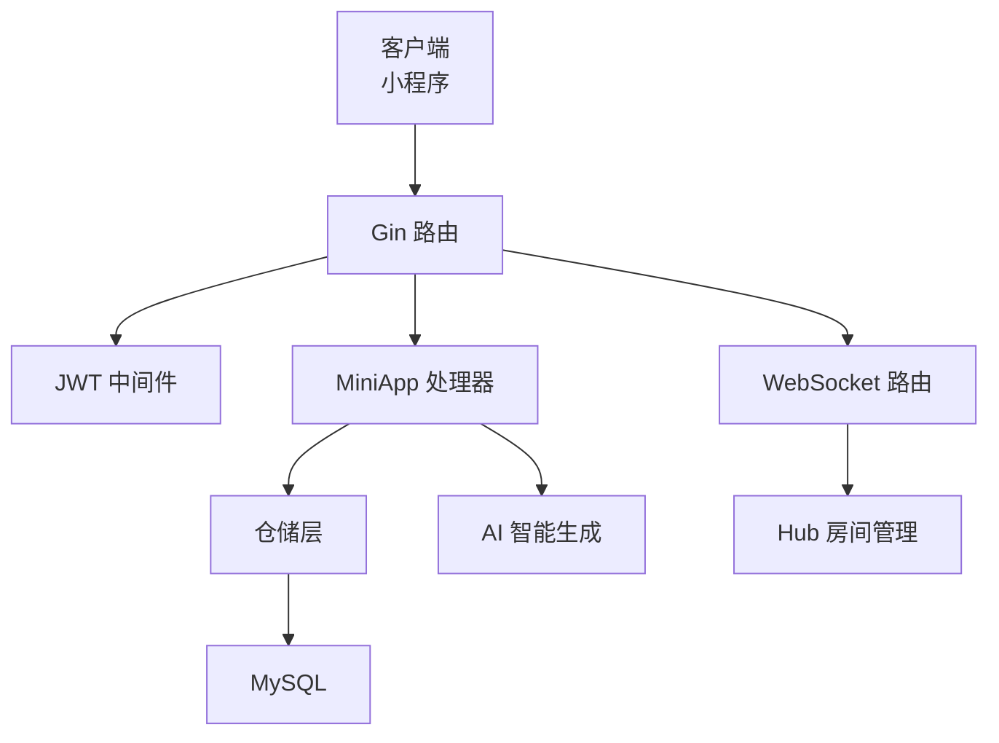
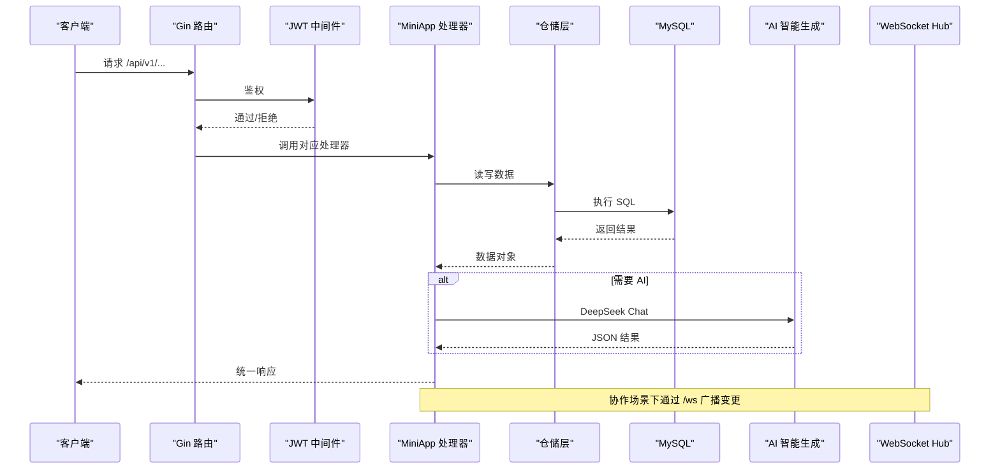
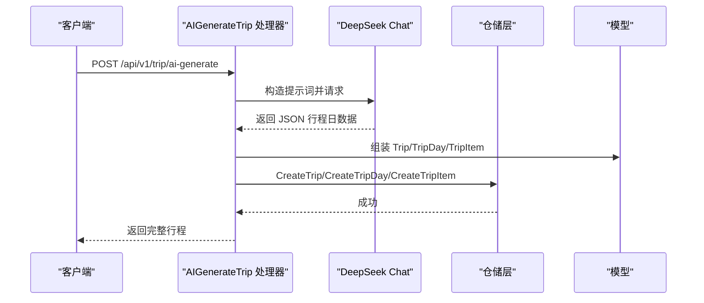
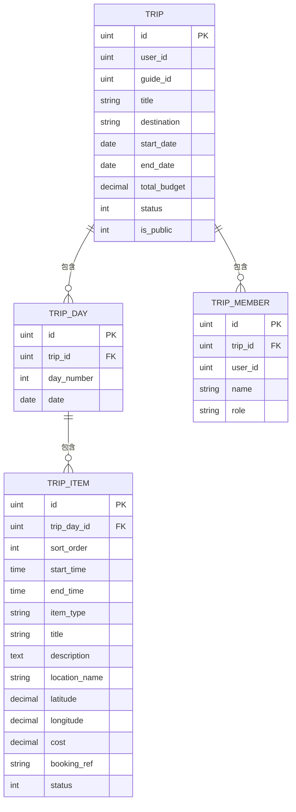
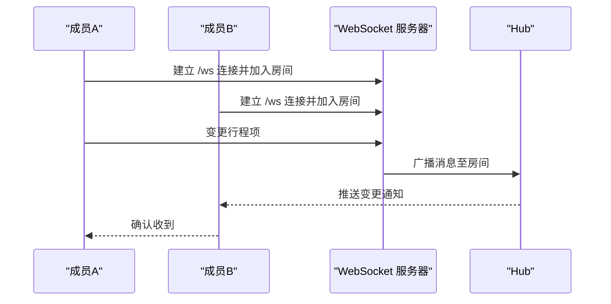
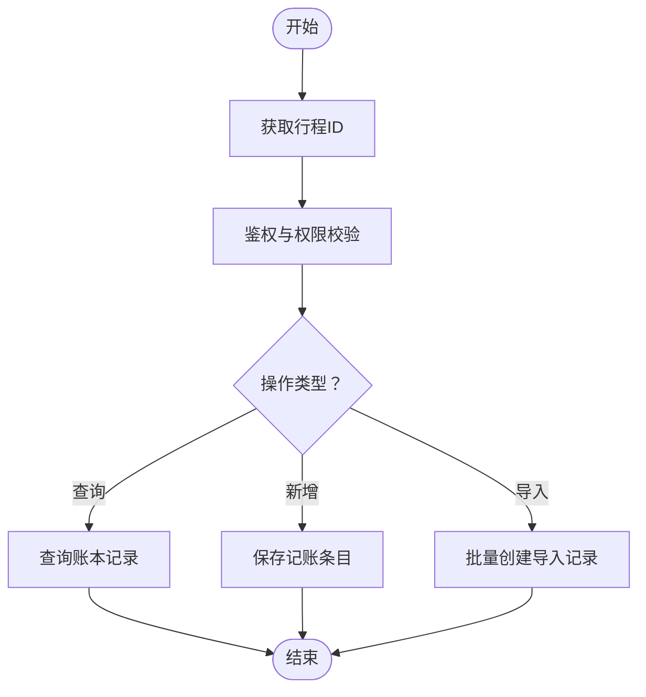
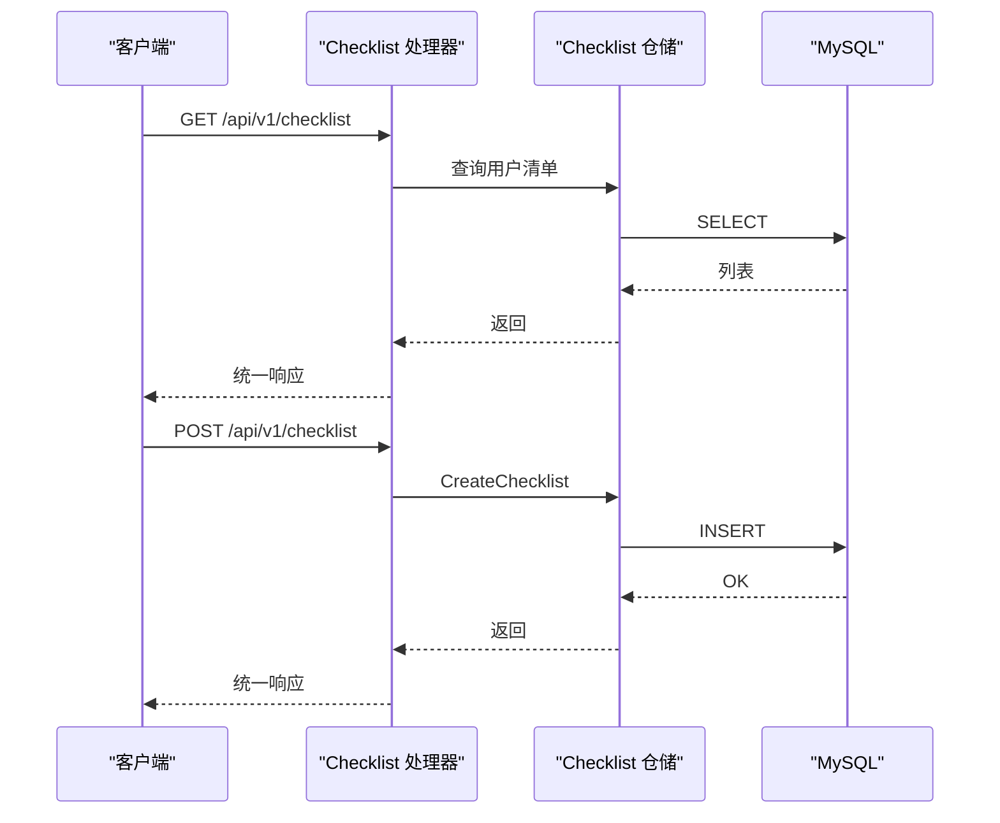
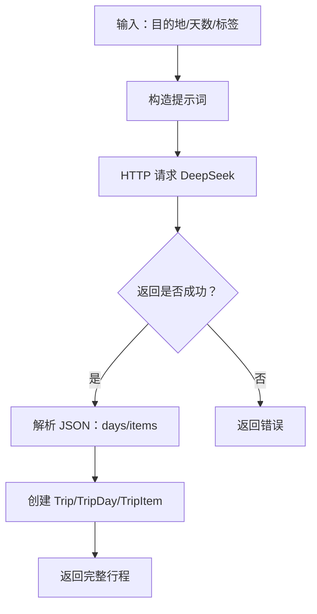
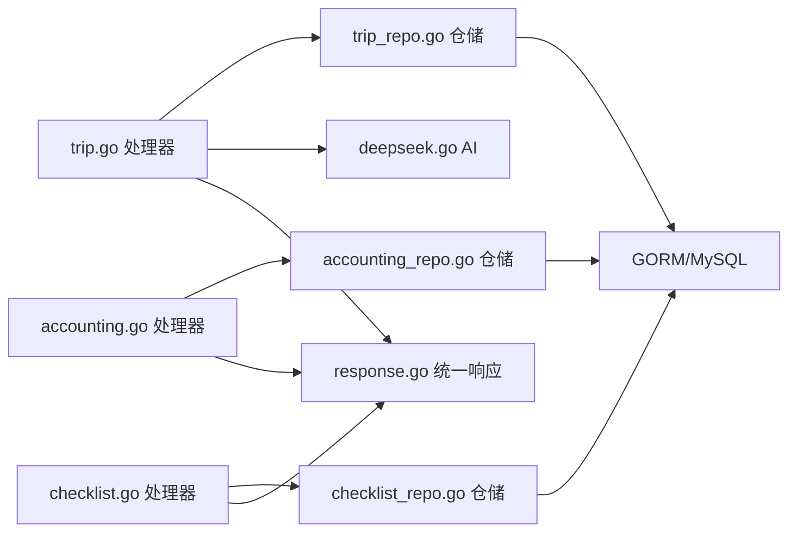

# 行程管理接口

<cite>
**本文引用的文件**
- [main.go](file://cmd/main.go)
- [trip.go](file://internal/handler/miniapp/trip.go)
- [accounting.go](file://internal/handler/miniapp/accounting.go)
- [checklist.go](file://internal/handler/miniapp/checklist.go)
- [trip.go](file://internal/model/trip.go)
- [trip_day.go](file://internal/model/trip_day.go)
- [trip_item.go](file://internal/model/trip_item.go)
- [accounting.go](file://internal/model/accounting.go)
- [checklist.go](file://internal/model/checklist.go)
- [trip_repo.go](file://internal/repository/trip_repo.go)
- [accounting_repo.go](file://internal/repository/accounting_repo.go)
- [checklist_repo.go](file://internal/repository/checklist_repo.go)
- [deepseek.go](file://internal/ai/deepseek.go)
- [response.go](file://pkg/response/response.go)
- [hub.go](file://internal/ws/hub.go)
</cite>

## 目录
1. [简介](#简介)
2. [项目结构](#项目结构)
3. [核心组件](#核心组件)
4. [架构总览](#架构总览)
5. [详细组件分析](#详细组件分析)
6. [依赖分析](#依赖分析)
7. [性能考虑](#性能考虑)
8. [故障排查指南](#故障排查指南)
9. [结论](#结论)
10. [附录](#附录)

## 简介
本接口文档面向“旅行搭子”小程序后端，聚焦于行程管理能力，包括行程创建与编辑、AI智能生成、日程管理、行程项操作、成员邀请与协作、记账功能（费用统计与微信支付导入）、备忘清单管理，以及基于 WebSocket 的协作实时同步。文档提供接口定义、数据模型、调用流程、最佳实践与排障建议，帮助开发者快速集成与扩展。

## 项目结构
后端采用 GIN 路由 + GORM 数据访问层 + 自定义响应封装的分层架构。核心模块如下：
- 路由入口：注册公开与受保护接口，分组鉴权与后台管理
- 处理器（Handler）：MiniApp 业务接口实现，负责参数校验、鉴权与调用仓储
- 仓储（Repository）：封装数据库操作，提供事务与预加载
- 模型（Model）：定义数据库表结构与关联关系
- AI 集成：DeepSeek 智能生成提示词与调用
- WebSocket：房间与广播，支撑协作实时同步

图表来源
- [main.go:46-146](file://cmd/main.go#L46-L146)
- [trip.go:16-92](file://internal/handler/miniapp/trip.go#L16-L92)
- [accounting.go:14-84](file://internal/handler/miniapp/accounting.go#L14-L84)
- [checklist.go:13-76](file://internal/handler/miniapp/checklist.go#L13-L76)
- [trip_repo.go:12-137](file://internal/repository/trip_repo.go#L12-L137)
- [deepseek.go:18-52](file://internal/ai/deepseek.go#L18-L52)
- [hub.go:10-55](file://internal/ws/hub.go#L10-L55)

章节来源
- [main.go:46-146](file://cmd/main.go#L46-L146)

## 核心组件
- 行程模型与关系
  - Trip：行程主表，含标题、目的地、起止日期、预算、状态、公开标记等
  - TripDay：行程日，按天组织，包含行程项
  - TripItem：行程项，最小执行单元，含类型、时间、地点、成本、状态等
  - TripMember：同行者，支持角色（拥有者/编辑者/查看者）
- 记账模型
  - Accounting：按行程维度的消费记录，支持分类、金额、备注、微信支付单号、消费时间
- 备忘清单模型
  - Checklist：清单，可关联行程；ChecklistItem：清单条目，含勾选状态
- 统一响应
  - Response：统一返回结构，成功返回 code=0，失败返回 code=1

章节来源
- [trip.go:9-37](file://internal/model/trip.go#L9-L37)
- [trip_day.go:5-15](file://internal/model/trip_day.go#L5-L15)
- [trip_item.go:5-22](file://internal/model/trip_item.go#L5-L22)
- [accounting.go:5-16](file://internal/model/accounting.go#L5-L16)
- [checklist.go:5-22](file://internal/model/checklist.go#L5-L22)
- [response.go:10-25](file://pkg/response/response.go#L10-L25)

## 架构总览
下图展示从客户端到处理器、仓储、数据库与 AI 的整体交互路径，以及 WebSocket 协作同步。

图表来源
- [main.go:46-146](file://cmd/main.go#L46-L146)
- [trip.go:16-92](file://internal/handler/miniapp/trip.go#L16-L92)
- [accounting.go:14-84](file://internal/handler/miniapp/accounting.go#L14-L84)
- [checklist.go:13-76](file://internal/handler/miniapp/checklist.go#L13-L76)
- [trip_repo.go:12-137](file://internal/repository/trip_repo.go#L12-L137)
- [deepseek.go:18-52](file://internal/ai/deepseek.go#L18-L52)
- [hub.go:10-55](file://internal/ws/hub.go#L10-L55)

## 详细组件分析

### 行程管理接口
- 接口概览
  - 创建行程（手动）：POST /api/v1/trip
  - AI 智能生成：POST /api/v1/trip/ai-generate
  - 获取行程详情：GET /api/v1/trip/{id}
  - 更新行程：PUT /api/v1/trip/{id}
  - 添加行程日：POST /api/v1/trip/day
  - 更新行程日：PUT /api/v1/trip/day/{id}
  - 删除行程日：DELETE /api/v1/trip/day/{id}
  - 添加行程项：POST /api/v1/trip/item
  - 更新行程项：PUT /api/v1/trip/item/{id}
  - 删除行程项：DELETE /api/v1/trip/item/{id}
  - 邀请同行者：POST /api/v1/trip/member
  - 移除同行者：DELETE /api/v1/trip/member/{id}

- 权限与控制
  - 更新行程与成员管理需登录态，且仅行程创建者可编辑基本信息
  - 行程日与行程项的增删改均在处理器内完成参数校验与仓储调用

- 流程示意：AI 智能生成

图表来源
- [trip.go:16-92](file://internal/handler/miniapp/trip.go#L16-L92)
- [trip_repo.go:12-137](file://internal/repository/trip_repo.go#L12-L137)
- [deepseek.go:18-52](file://internal/ai/deepseek.go#L18-L52)

- 数据模型关系

图表来源
- [trip.go:9-37](file://internal/model/trip.go#L9-L37)
- [trip_day.go:5-15](file://internal/model/trip_day.go#L5-L15)
- [trip_item.go:5-22](file://internal/model/trip_item.go#L5-L22)

章节来源
- [main.go:71-83](file://cmd/main.go#L71-L83)
- [trip.go:94-169](file://internal/handler/miniapp/trip.go#L94-L169)
- [trip.go:173-229](file://internal/handler/miniapp/trip.go#L173-L229)
- [trip.go:233-289](file://internal/handler/miniapp/trip.go#L233-L289)
- [trip.go:293-327](file://internal/handler/miniapp/trip.go#L293-L327)
- [trip_repo.go:12-137](file://internal/repository/trip_repo.go#L12-L137)

### 协作编辑与实时同步
- 协作机制
  - 成员邀请与角色：邀请接口支持新增同行者，移除接口支持移除成员
  - 权限控制：更新行程基本信息仅允许创建者
- 实时同步
  - WebSocket 路由：/ws
  - Hub 管理：Join/Lave/Broadcast，支持房间内广播与排除发送者
  - 使用建议：在行程变更（如新增/修改行程项、成员变动）时，向对应行程房间广播增量消息，前端订阅并刷新 UI

图表来源
- [main.go:145-146](file://cmd/main.go#L145-L146)
- [hub.go:23-55](file://internal/ws/hub.go#L23-L55)

章节来源
- [trip.go:293-327](file://internal/handler/miniapp/trip.go#L293-L327)
- [hub.go:10-55](file://internal/ws/hub.go#L10-L55)

### 记账功能
- 接口概览
  - 获取账本：GET /api/v1/account/{tripId}
  - 新增记账：POST /api/v1/account
  - 导入微信支付：POST /api/v1/account/import
- 功能说明
  - 账本按行程与用户过滤，支持分类、金额、备注、微信支付单号、消费时间
  - 导入接口接收交易单号列表，批量创建空金额记录（实际金额由前端传入）

图表来源
- [accounting.go:14-84](file://internal/handler/miniapp/accounting.go#L14-L84)
- [accounting_repo.go:8-18](file://internal/repository/accounting_repo.go#L8-L18)

章节来源
- [main.go:95-99](file://cmd/main.go#L95-L99)
- [accounting.go:14-84](file://internal/handler/miniapp/accounting.go#L14-L84)
- [accounting_repo.go:8-18](file://internal/repository/accounting_repo.go#L8-L18)
- [accounting.go:57-84](file://internal/handler/miniapp/accounting.go#L57-L84)

### 备忘清单
- 接口概览
  - 获取清单：GET /api/v1/checklist
  - 创建清单：POST /api/v1/checklist
  - 更新条目勾选状态：PUT /api/v1/checklist/{id}/item
- 功能说明
  - 清单可关联行程，支持模板化；条目含文本与勾选状态

图表来源
- [checklist.go:13-76](file://internal/handler/miniapp/checklist.go#L13-L76)
- [checklist_repo.go:8-23](file://internal/repository/checklist_repo.go#L8-L23)

章节来源
- [main.go:100-104](file://cmd/main.go#L100-L104)
- [checklist.go:13-76](file://internal/handler/miniapp/checklist.go#L13-L76)
- [checklist_repo.go:8-23](file://internal/repository/checklist_repo.go#L8-L23)

### AI 智能生成
- 提示词模板与调用
  - 提示词包含目的地、天数与偏好，要求返回严格 JSON
  - 调用 DeepSeek Chat 完成生成，解析后落库为行程日与行程项

图表来源
- [deepseek.go:13-52](file://internal/ai/deepseek.go#L13-L52)
- [trip.go:16-92](file://internal/handler/miniapp/trip.go#L16-L92)

章节来源
- [deepseek.go:13-52](file://internal/ai/deepseek.go#L13-L52)
- [trip.go:16-92](file://internal/handler/miniapp/trip.go#L16-L92)

## 依赖分析
- 组件耦合
  - 处理器依赖仓储与 AI，不直接依赖数据库
  - 仓储依赖 GORM 与数据库连接
  - 统一响应封装在独立包，被各处理器复用
- 外部依赖
  - DeepSeek API：用于智能生成
  - WebSocket：用于协作实时同步

图表来源
- [trip.go:16-327](file://internal/handler/miniapp/trip.go#L16-L327)
- [accounting.go:14-84](file://internal/handler/miniapp/accounting.go#L14-L84)
- [checklist.go:13-76](file://internal/handler/miniapp/checklist.go#L13-L76)
- [trip_repo.go:12-137](file://internal/repository/trip_repo.go#L12-L137)
- [accounting_repo.go:8-18](file://internal/repository/accounting_repo.go#L8-L18)
- [checklist_repo.go:8-23](file://internal/repository/checklist_repo.go#L8-L23)
- [deepseek.go:18-52](file://internal/ai/deepseek.go#L18-L52)
- [response.go:17-25](file://pkg/response/response.go#L17-L25)

章节来源
- [trip_repo.go:12-137](file://internal/repository/trip_repo.go#L12-L137)
- [accounting_repo.go:8-18](file://internal/repository/accounting_repo.go#L8-L18)
- [checklist_repo.go:8-23](file://internal/repository/checklist_repo.go#L8-L23)

## 性能考虑
- 数据加载
  - 行程详情使用预加载（行程日、行程项按排序、成员），避免 N+1 查询
- 事务与批量
  - 删除行程日时先删除其下行程项，使用事务保证一致性
  - 批量创建行程项接口可用于优化导入场景
- 缓存与并发
  - 可结合 Redis 对热点行程或公共行程列表做缓存
  - WebSocket 广播需注意房间规模与消息频率，避免阻塞

## 故障排查指南
- 常见错误与定位
  - 参数错误：处理器对 JSON 绑定失败会返回统一错误响应
  - 权限不足：更新行程仅允许创建者，否则返回无权限
  - 资源不存在：获取行程详情若不存在返回 404
  - AI 生成失败：网络或解析异常导致失败，需检查密钥与返回格式
- 建议排查步骤
  - 核对鉴权头与用户上下文
  - 检查请求体字段与类型
  - 查看仓储层返回的底层错误
  - 关注 WebSocket 房间加入/离开与广播逻辑

章节来源
- [trip.go:140-168](file://internal/handler/miniapp/trip.go#L140-L168)
- [trip.go:122-129](file://internal/handler/miniapp/trip.go#L122-L129)
- [accounting.go:21-34](file://internal/handler/miniapp/accounting.go#L21-L34)
- [checklist.go:58-76](file://internal/handler/miniapp/checklist.go#L58-L76)
- [deepseek.go:18-52](file://internal/ai/deepseek.go#L18-L52)

## 结论
本接口体系以清晰的分层设计实现了从行程创建、AI 生成、日程编排、成员协作到记账与清单管理的全链路能力。配合 WebSocket 的房间广播机制，可满足多人协作与实时同步需求。建议在生产环境中完善鉴权策略、引入缓存与限流、增强日志与监控，并持续优化 AI 提示词与解析健壮性。

## 附录

### 接口一览与最佳实践
- 行程创建
  - 手动创建：携带必要字段提交，服务端自动设置创建者与默认状态
  - AI 生成：提供目的地、天数与偏好，解析返回的 JSON 并落库
- 日程管理
  - 按天组织，行程项按排序序号维护；删除日程会级联清理行程项
- 成员协作
  - 仅创建者可编辑行程基本信息；成员邀请后可在房间内实时同步
- 记账
  - 按行程与用户维度查询；导入微信支付时保留单号便于溯源
- 备忘清单
  - 支持模板化与行程关联；条目勾选状态可单独更新

章节来源
- [main.go:71-83](file://cmd/main.go#L71-L83)
- [trip.go:94-169](file://internal/handler/miniapp/trip.go#L94-L169)
- [trip_repo.go:76-84](file://internal/repository/trip_repo.go#L76-L84)
- [accounting.go:14-84](file://internal/handler/miniapp/accounting.go#L14-L84)
- [checklist.go:13-76](file://internal/handler/miniapp/checklist.go#L13-L76)