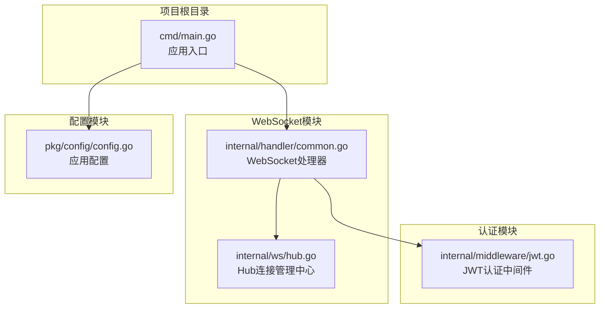
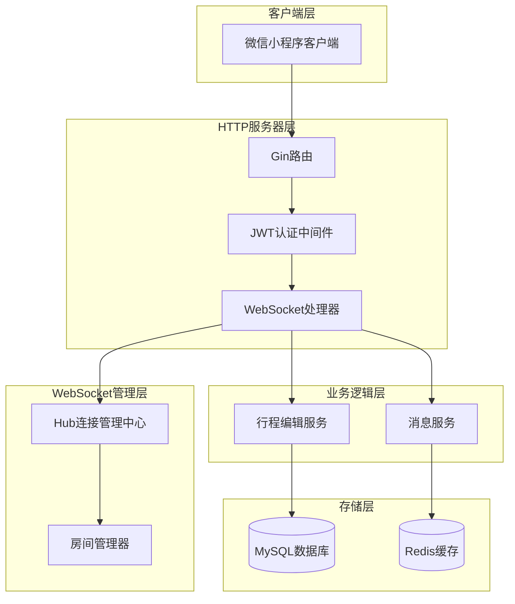
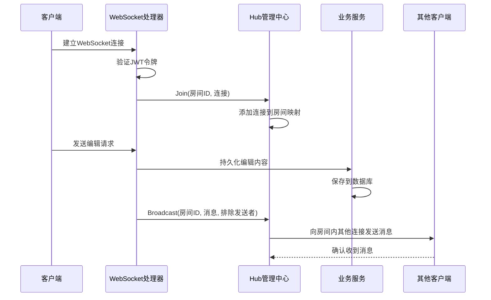
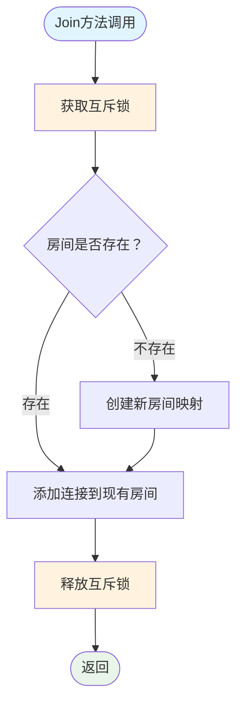
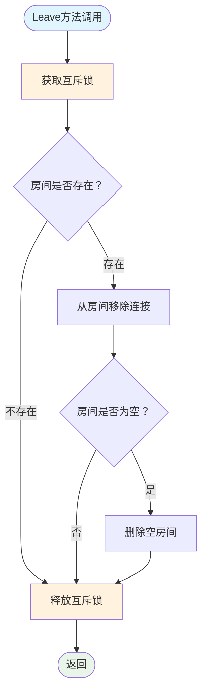
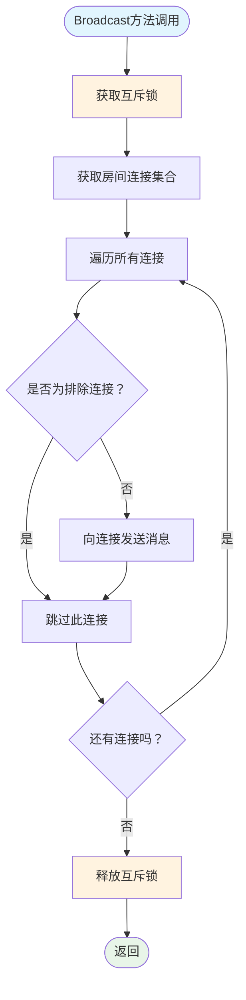
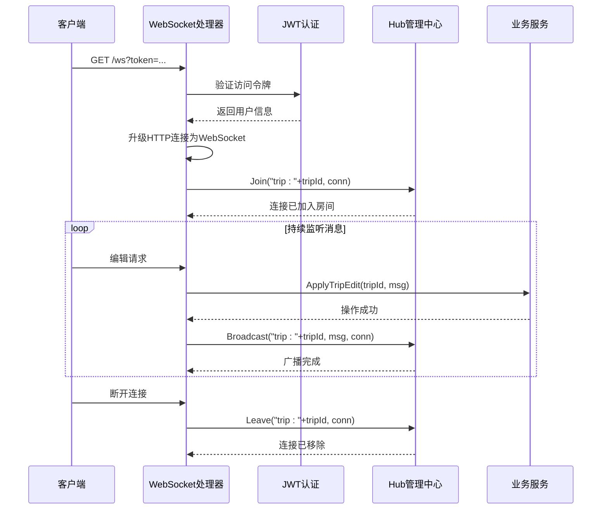
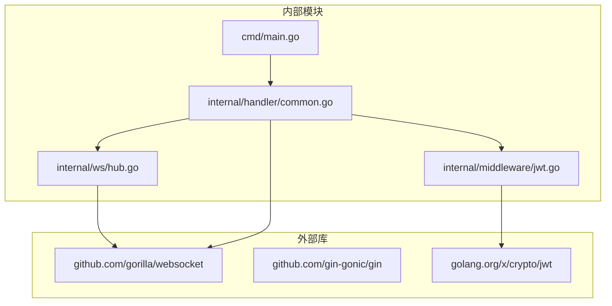

# Hub连接管理中心

<cite>
**本文档引用的文件**
- [hub.go](file://internal/ws/hub.go)
- [common.go](file://internal/handler/common.go)
- [main.go](file://cmd/main.go)
- [jwt.go](file://internal/middleware/jwt.go)
- [config.go](file://pkg/config/config.go)
</cite>

## 目录
1. [简介](#简介)
2. [项目结构](#项目结构)
3. [核心组件](#核心组件)
4. [架构概览](#架构概览)
5. [详细组件分析](#详细组件分析)
6. [依赖关系分析](#依赖关系分析)
7. [性能考虑](#性能考虑)
8. [故障排除指南](#故障排除指南)
9. [结论](#结论)

## 简介

Hub连接管理中心是旅行搭子小程序后端WebSocket架构的核心组件，负责管理WebSocket连接的房间映射、连接集合管理和消息广播功能。该系统采用Gorilla WebSocket库实现实时通信，支持多人协作编辑、消息推送等场景。

系统通过Hub模式实现了连接的集中管理，确保在高并发环境下能够安全地处理多个客户端的连接和消息传递。Hub的设计遵循了Go语言的并发编程最佳实践，使用互斥锁保证数据一致性。

## 项目结构

旅行搭子项目的WebSocket相关代码主要分布在以下目录中：



**图表来源**
- [main.go:1-152](file://cmd/main.go#L1-L152)
- [hub.go:1-56](file://internal/ws/hub.go#L1-L56)
- [common.go:1-91](file://internal/handler/common.go#L1-L91)

**章节来源**
- [main.go:145-146](file://cmd/main.go#L145-L146)
- [hub.go:1-56](file://internal/ws/hub.go#L1-L56)

## 核心组件

### Hub结构体设计

Hub结构体是整个WebSocket连接管理的核心，其设计理念体现了简洁而高效的数据结构设计：

```mermaid
classDiagram
class Hub {
+map~string,map~*websocket.Conn,bool~~ rooms
+Mutex mu
+NewHub() Hub
+Join(room string, conn *websocket.Conn) void
+Leave(room string, conn *websocket.Conn) void
+Broadcast(room string, msg interface{}, exclude *websocket.Conn) void
}
class RoomConnection {
+map~*websocket.Conn,bool~ connections
}
class WebSocketConn {
+WriteJSON(message interface{}) error
+ReadMessage() (int, []byte, error)
+Close() error
}
Hub --> RoomConnection : "管理房间"
RoomConnection --> WebSocketConn : "包含连接"
```

**图表来源**
- [hub.go:10-14](file://internal/ws/hub.go#L10-L14)

### 数据结构设计原理

Hub采用了双重映射的数据结构来实现房间到连接的快速查找：
- 外层映射：`map[string]map[*websocket.Conn]bool`，键为房间ID，值为连接集合
- 内层映射：`map[*websocket.Conn]bool`，键为WebSocket连接指针，值为布尔标记
- 使用布尔值作为占位符，避免额外的内存分配

这种设计的优势：
1. **O(1)查找复杂度**：房间查找和连接查找均为常数时间
2. **内存效率**：布尔值占用最小内存空间
3. **类型安全**：使用指针确保连接对象的唯一性

**章节来源**
- [hub.go:11-14](file://internal/ws/hub.go#L11-L14)

## 架构概览

WebSocket系统的整体架构采用分层设计，各组件职责明确：



**图表来源**
- [main.go:40-46](file://cmd/main.go#L40-L46)
- [common.go:48-91](file://internal/handler/common.go#L48-L91)

### 请求处理流程

WebSocket连接建立后的典型请求处理流程：



**图表来源**
- [common.go:74-88](file://internal/handler/common.go#L74-L88)
- [hub.go:23-31](file://internal/ws/hub.go#L23-L31)

## 详细组件分析

### Hub连接管理中心

#### Join方法的房间加入逻辑

Join方法实现了线程安全的房间加入机制：



**图表来源**
- [hub.go:23-31](file://internal/ws/hub.go#L23-L31)

Join方法的关键特性：
1. **原子性操作**：使用互斥锁确保房间创建和连接添加的原子性
2. **惰性创建**：只有在需要时才创建新的房间映射
3. **幂等性**：重复加入同一房间不会产生重复连接

#### Leave方法的连接移除机制

Leave方法负责清理断开连接的资源：



**图表来源**
- [hub.go:33-43](file://internal/ws/hub.go#L33-L43)

Leave方法的优化策略：
1. **及时清理**：连接断开后立即从房间映射中移除
2. **内存回收**：空房间自动删除，防止内存泄漏
3. **线程安全**：所有操作都在互斥锁保护下进行

#### Broadcast方法的消息广播实现

Broadcast方法实现了高效的房间内消息广播：



**图表来源**
- [hub.go:45-55](file://internal/ws/hub.go#L45-L55)

Broadcast方法的性能优化：
1. **批量操作**：一次性获取房间连接集合，减少锁竞争
2. **条件过滤**：支持排除特定连接，避免消息回环
3. **异步处理**：每个连接的消息发送相对独立

**章节来源**
- [hub.go:23-55](file://internal/ws/hub.go#L23-L55)

### WebSocket处理器集成

WebSocket处理器与Hub的集成展示了完整的实时通信流程：



**图表来源**
- [common.go:48-91](file://internal/handler/common.go#L48-L91)

**章节来源**
- [common.go:48-91](file://internal/handler/common.go#L48-L91)

## 依赖关系分析

### 外部依赖

系统对外部库的依赖关系清晰明确：



**图表来源**
- [hub.go:4-8](file://internal/ws/hub.go#L4-L8)
- [common.go:9-17](file://internal/handler/common.go#L9-L17)

### 内部模块耦合

Hub与其他模块的耦合关系体现了良好的分层设计：

| 模块 | 依赖关系 | 用途 |
|------|----------|------|
| Hub | Gorilla WebSocket | WebSocket连接管理 |
| WebSocket处理器 | Hub, JWT中间件 | 实时通信业务逻辑 |
| JWT中间件 | Hub | 用户身份验证 |
| 主程序 | WebSocket处理器 | 应用入口 |

**章节来源**
- [hub.go:1-8](file://internal/ws/hub.go#L1-L8)
- [common.go:13-17](file://internal/handler/common.go#L13-L17)

## 性能考虑

### 并发安全策略

Hub采用互斥锁确保线程安全，但需要注意以下性能影响：

1. **锁粒度控制**：当前实现对整个Hub加锁，可能成为高并发瓶颈
2. **连接数量限制**：房间内连接过多会影响广播性能
3. **内存使用**：每个连接占用一定内存空间

### 优化建议

针对高并发场景，建议考虑以下优化方案：

1. **分段锁策略**：按房间ID哈希值对房间进行分段，减少锁竞争
2. **连接池管理**：实现连接池复用，减少频繁创建销毁
3. **异步广播**：使用goroutine异步发送消息，避免阻塞主循环
4. **批量处理**：合并多个小消息为批量消息，减少网络往返

### 内存管理策略

系统采用的内存管理策略有效防止了内存泄漏：

1. **及时清理**：连接断开时自动从房间映射中移除
2. **空房间检测**：房间为空时自动删除，释放内存
3. **垃圾回收**：依赖Go的垃圾回收机制自动清理无引用对象

## 故障排除指南

### 常见问题及解决方案

#### 连接无法加入房间

**症状**：客户端无法加入指定房间
**可能原因**：
1. 房间ID格式不正确
2. WebSocket连接状态异常
3. Hub实例未正确初始化

**解决步骤**：
1. 检查房间ID格式："trip:"+tripId
2. 验证WebSocket连接状态
3. 确认Hub实例可用性

#### 消息广播失败

**症状**：房间内消息无法正常广播
**可能原因**：
1. 房间映射被意外清空
2. 连接对象失效
3. 广播过程中出现异常

**排查方法**：
1. 检查房间映射状态
2. 验证连接有效性
3. 查看错误日志

#### 内存泄漏问题

**症状**：服务器内存持续增长
**检查要点**：
1. 确认所有断开连接都被正确移除
2. 检查空房间是否被及时清理
3. 监控连接数量变化趋势

**章节来源**
- [hub.go:33-43](file://internal/ws/hub.go#L33-L43)

## 结论

Hub连接管理中心作为旅行搭子小程序WebSocket架构的核心组件，展现了优秀的软件设计原则：

### 设计优势

1. **简洁高效**：采用最小必要的数据结构实现复杂功能
2. **线程安全**：通过互斥锁确保并发环境下的数据一致性
3. **易于扩展**：模块化设计便于功能扩展和维护
4. **性能可靠**：合理的数据结构选择保证了良好的性能表现

### 技术亮点

- **房间映射机制**：实现了高效的连接组织和查找
- **消息广播系统**：支持排除特定连接的精准广播
- **资源清理策略**：自动化的内存管理和资源回收
- **集成设计**：与JWT认证和业务逻辑无缝集成

### 发展建议

随着业务规模的增长，建议考虑以下演进方向：
1. 引入更细粒度的锁机制以提升并发性能
2. 实现连接池和消息队列以支持更大规模的并发
3. 添加监控指标以更好地了解系统运行状况
4. 考虑分布式部署以支持水平扩展

Hub连接管理中心为整个WebSocket系统奠定了坚实的基础，其设计理念和实现方式值得在类似项目中借鉴和参考。