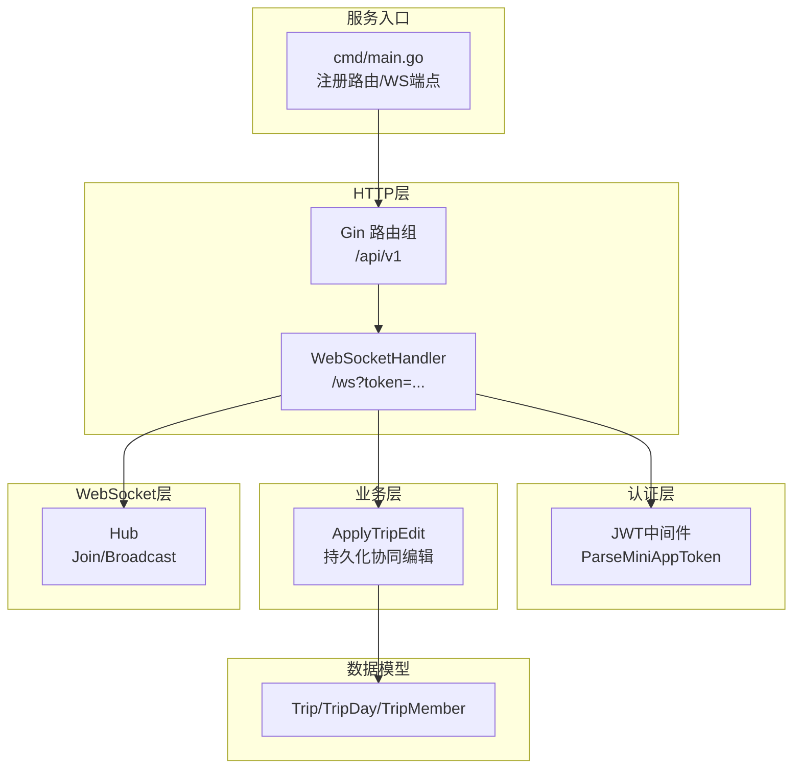
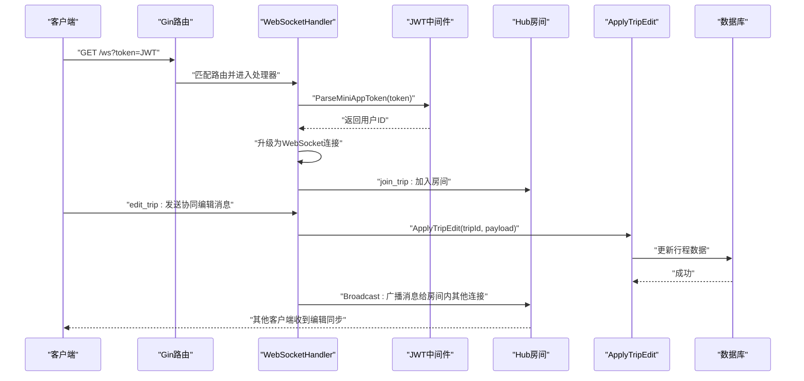
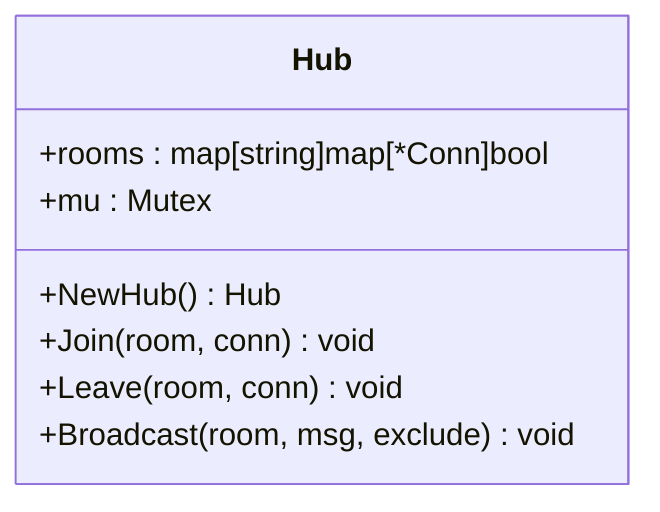
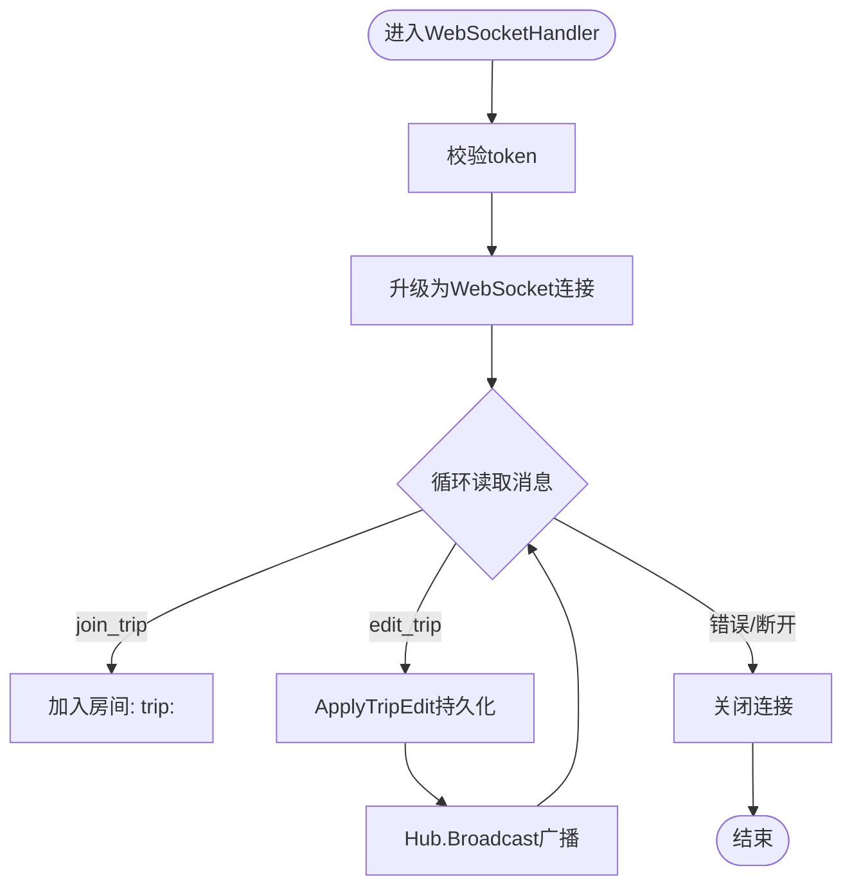
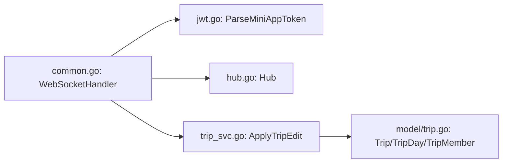

# WebSocket实时通信

<cite>
**本文引用的文件**
- [cmd/main.go](file://cmd/main.go)
- [internal/ws/hub.go](file://internal/ws/hub.go)
- [internal/handler/common.go](file://internal/handler/common.go)
- [internal/middleware/jwt.go](file://internal/middleware/jwt.go)
- [internal/service/trip_svc.go](file://internal/service/trip_svc.go)
- [internal/handler/miniapp/trip.go](file://internal/handler/miniapp/trip.go)
- [internal/model/trip.go](file://internal/model/trip.go)
- [internal/model/user.go](file://internal/model/user.go)
- [pkg/config/config.go](file://pkg/config/config.go)
- [README.md](file://README.md)
</cite>

## 目录
1. [引言](#引言)
2. [项目结构](#项目结构)
3. [核心组件](#核心组件)
4. [架构总览](#架构总览)
5. [详细组件分析](#详细组件分析)
6. [依赖关系分析](#依赖关系分析)
7. [性能考量](#性能考量)
8. [故障排查指南](#故障排查指南)
9. [结论](#结论)
10. [附录](#附录)

## 引言
本文件面向旅行社交平台的WebSocket实时通信系统，聚焦于以下目标：
- 解释WebSocket在平台中的应用场景：实时消息传输、多人协同编辑等
- 详解Hub系统：连接管理、房间系统、消息广播机制
- 说明WebSocket连接生命周期：连接建立、心跳检测与断线重连策略
- 提供架构设计图与交互流程图，帮助开发者快速理解客户端与服务器的交互模式
- 定义消息格式与事件类型，明确协同编辑的数据结构与冲突解决思路
- 提供调试工具与监控方案建议

## 项目结构
该仓库采用模块化分层结构，WebSocket相关能力集中在以下位置：
- 服务入口与路由：cmd/main.go
- WebSocket处理器：internal/handler/common.go
- Hub房间管理：internal/ws/hub.go
- JWT认证中间件：internal/middleware/jwt.go
- 协同编辑业务：internal/service/trip_svc.go
- 行程模型与API：internal/model/trip.go、internal/handler/miniapp/trip.go
- 配置加载：pkg/config/config.go
- 项目说明与WebSocket示例：README.md

图表来源
- [cmd/main.go:145-146](file://cmd/main.go#L145-L146)
- [internal/handler/common.go:48-91](file://internal/handler/common.go#L48-L91)
- [internal/ws/hub.go:10-55](file://internal/ws/hub.go#L10-L55)
- [internal/middleware/jwt.go:38-46](file://internal/middleware/jwt.go#L38-L46)
- [internal/service/trip_svc.go:7-18](file://internal/service/trip_svc.go#L7-L18)
- [internal/model/trip.go:9-37](file://internal/model/trip.go#L9-L37)

章节来源
- [cmd/main.go:145-146](file://cmd/main.go#L145-L146)
- [README.md:208-235](file://README.md#L208-L235)

## 核心组件
- Hub房间管理：维护房间ID到连接集合的映射，提供加入、离开与广播功能
- WebSocket处理器：负责升级HTTP为WebSocket，校验token，解析消息，调用业务与广播
- JWT认证：校验小程序端JWT，提取用户标识
- 协同编辑服务：接收编辑消息，过滤敏感字段后持久化，再广播给房间内其他成员
- 数据模型：Trip及其子模型支撑协同编辑的数据结构

章节来源
- [internal/ws/hub.go:10-55](file://internal/ws/hub.go#L10-L55)
- [internal/handler/common.go:48-91](file://internal/handler/common.go#L48-L91)
- [internal/middleware/jwt.go:38-46](file://internal/middleware/jwt.go#L38-L46)
- [internal/service/trip_svc.go:7-18](file://internal/service/trip_svc.go#L7-L18)
- [internal/model/trip.go:9-37](file://internal/model/trip.go#L9-L37)

## 架构总览
下图展示了从客户端发起WS连接到协同编辑生效的全链路交互。

图表来源
- [cmd/main.go:145-146](file://cmd/main.go#L145-L146)
- [internal/handler/common.go:48-91](file://internal/handler/common.go#L48-L91)
- [internal/middleware/jwt.go:38-46](file://internal/middleware/jwt.go#L38-L46)
- [internal/ws/hub.go:23-55](file://internal/ws/hub.go#L23-L55)
- [internal/service/trip_svc.go:7-18](file://internal/service/trip_svc.go#L7-L18)

## 详细组件分析

### Hub系统：连接管理、房间与广播
- 房间命名规范：以“trip:<tripId>”作为房间ID，便于按行程维度隔离
- 并发安全：通过互斥锁保护房间映射，避免竞态
- 广播策略：支持排除发送者，避免回环

图表来源
- [internal/ws/hub.go:10-55](file://internal/ws/hub.go#L10-L55)

章节来源
- [internal/ws/hub.go:10-55](file://internal/ws/hub.go#L10-L55)

### WebSocket处理器：连接建立、消息解析与广播
- 连接建立：通过Gorilla WebSocket升级HTTP请求
- 认证：从查询参数读取token，使用JWT中间件解析
- 消息处理：解析JSON，识别action类型，执行对应逻辑
- 协同编辑：持久化后广播给房间内其他成员

图表来源
- [internal/handler/common.go:48-91](file://internal/handler/common.go#L48-L91)
- [internal/middleware/jwt.go:38-46](file://internal/middleware/jwt.go#L38-L46)
- [internal/ws/hub.go:23-55](file://internal/ws/hub.go#L23-L55)
- [internal/service/trip_svc.go:7-18](file://internal/service/trip_svc.go#L7-L18)

章节来源
- [internal/handler/common.go:48-91](file://internal/handler/common.go#L48-L91)

### JWT认证与用户身份
- 小程序JWT密钥固定，签发有效期7天
- 中间件从Authorization头或查询参数解析token，校验有效性并注入userID

章节来源
- [internal/middleware/jwt.go:26-46](file://internal/middleware/jwt.go#L26-L46)

### 协同编辑业务：持久化与广播
- ApplyTripEdit接收编辑消息，过滤不可更新字段后调用仓储层更新
- 广播前先持久化，保证一致性

章节来源
- [internal/service/trip_svc.go:7-18](file://internal/service/trip_svc.go#L7-L18)

### 数据模型：行程与协同编辑载体
- Trip：行程主表，包含基础信息与关联的行程日、成员
- TripDay/TripItem：行程日与行程项，支撑编辑项粒度
- 协同编辑payload通常包含tripId与行程日/项的变更

章节来源
- [internal/model/trip.go:9-37](file://internal/model/trip.go#L9-L37)

### 服务入口与路由
- /ws端点注册在根路由，配合JWT中间件用于后续扩展
- 主要API在/api/v1下，WS用于实时协同编辑与消息

章节来源
- [cmd/main.go:145-146](file://cmd/main.go#L145-L146)

## 依赖关系分析
- WebSocket处理器依赖JWT中间件进行认证
- 处理器依赖Hub进行房间管理与广播
- 协同编辑依赖服务层进行数据持久化
- 服务层依赖模型与仓储层完成数据库操作

图表来源
- [internal/handler/common.go:48-91](file://internal/handler/common.go#L48-L91)
- [internal/middleware/jwt.go:38-46](file://internal/middleware/jwt.go#L38-L46)
- [internal/ws/hub.go:10-55](file://internal/ws/hub.go#L10-L55)
- [internal/service/trip_svc.go:7-18](file://internal/service/trip_svc.go#L7-L18)
- [internal/model/trip.go:9-37](file://internal/model/trip.go#L9-L37)

章节来源
- [internal/handler/common.go:48-91](file://internal/handler/common.go#L48-L91)
- [internal/middleware/jwt.go:38-46](file://internal/middleware/jwt.go#L38-L46)
- [internal/ws/hub.go:10-55](file://internal/ws/hub.go#L10-L55)
- [internal/service/trip_svc.go:7-18](file://internal/service/trip_svc.go#L7-L18)
- [internal/model/trip.go:9-37](file://internal/model/trip.go#L9-L37)

## 性能考量
- 广播复杂度：每次广播遍历房间内连接，房间规模较大时存在O(n)写入成本
- 并发安全：Hub内部使用互斥锁，避免竞态；建议在高并发场景考虑更细粒度的锁或分区策略
- 消息体积：协同编辑payload建议最小化，仅包含必要字段，减少网络与序列化开销
- 连接数管理：建议结合上游网关/反向代理的连接限制与超时配置，防止资源耗尽
- 持久化顺序：先持久化再广播，降低广播后客户端状态不一致的风险

[本节为通用指导，不直接分析具体文件]

## 故障排查指南
- token无效
  - 现象：WS连接被拒绝
  - 排查：确认查询参数token有效、未过期、签名正确
  - 参考
    - [internal/handler/common.go:50-55](file://internal/handler/common.go#L50-L55)
    - [internal/middleware/jwt.go:38-46](file://internal/middleware/jwt.go#L38-L46)
- 连接升级失败
  - 现象：日志出现ws upgrade error
  - 排查：检查客户端握手参数、CORS策略、上游代理配置
  - 参考
    - [internal/handler/common.go:56-60](file://internal/handler/common.go#L56-L60)
- 消息解析失败
  - 现象：日志提示JSON解析错误
  - 排查：确认客户端发送的消息格式符合预期
  - 参考
    - [internal/handler/common.go:69-72](file://internal/handler/common.go#L69-L72)
- 房间广播无响应
  - 现象：编辑消息未同步到其他客户端
  - 排查：确认客户端已加入房间、房间ID一致、Hub广播未被阻塞
  - 参考
    - [internal/ws/hub.go:23-55](file://internal/ws/hub.go#L23-L55)
- 持久化失败
  - 现象：编辑未落库或报错
  - 排查：检查数据库连接、事务与字段过滤逻辑
  - 参考
    - [internal/service/trip_svc.go:7-18](file://internal/service/trip_svc.go#L7-L18)

章节来源
- [internal/handler/common.go:50-60](file://internal/handler/common.go#L50-L60)
- [internal/handler/common.go:69-72](file://internal/handler/common.go#L69-L72)
- [internal/ws/hub.go:23-55](file://internal/ws/hub.go#L23-L55)
- [internal/service/trip_svc.go:7-18](file://internal/service/trip_svc.go#L7-L18)

## 结论
本WebSocket系统围绕“房间+广播”的简单而高效的Hub模式，实现了旅行社交平台的核心实时能力。通过JWT认证与统一的处理器，系统具备清晰的职责边界与良好的扩展性。对于大规模场景，建议引入心跳检测、断线重连、消息去重与幂等、以及更细粒度的锁或分区策略，以进一步提升稳定性与性能。

[本节为总结性内容，不直接分析具体文件]

## 附录

### WebSocket连接生命周期管理
- 连接建立：HTTP请求经Gin路由匹配至/ws，处理器通过Gorilla WebSocket升级
- 认证：从查询参数读取token，使用JWT中间件解析并校验
- 消息循环：读取消息，解析action，执行房间加入或协同编辑持久化与广播
- 断开清理：读取错误触发循环退出，连接关闭，Hub自动清理房间内的连接

章节来源
- [internal/handler/common.go:48-91](file://internal/handler/common.go#L48-L91)
- [internal/middleware/jwt.go:38-46](file://internal/middleware/jwt.go#L38-L46)

### 心跳检测与断线重连
- 当前实现未显式包含ping/pong心跳与自动重连逻辑
- 建议
  - 服务端：启用ReadDeadline/WriteDeadline，定期发送ping，检测pong超时
  - 客户端：监听onclose/onerror，按指数退避策略重连
  - 服务端：在Hub中记录连接活跃状态，避免广播到已断开连接

[本小节为通用建议，不直接分析具体文件]

### 消息格式与事件类型
- 连接地址：ws://host/ws?token=jwt_token
- join_trip
  - 字段：action（固定）、tripId（行程ID）
  - 作用：加入房间
- edit_trip
  - 字段：action（固定）、tripId（行程ID）、daily_plans（行程日变更）
  - 作用：协同编辑并广播

章节来源
- [README.md:208-235](file://README.md#L208-L235)
- [internal/handler/common.go:74-88](file://internal/handler/common.go#L74-L88)

### 实时协作编辑技术实现与冲突解决
- 技术实现
  - 客户端：编辑时发送edit_trip消息，包含行程日/项变更
  - 服务端：ApplyTripEdit过滤敏感字段后持久化，随后广播给房间内其他成员
- 冲突解决
  - 乐观锁：建议在Trip模型中增加版本号字段，编辑时校验版本，避免覆盖
  - 幂等：客户端对重复提交进行去重，服务端对相同版本/时间戳的消息进行幂等处理
  - 合并策略：若出现并发编辑，优先采用“最后写入获胜”或引入CRDT等高级合并算法

章节来源
- [internal/service/trip_svc.go:7-18](file://internal/service/trip_svc.go#L7-L18)
- [internal/model/trip.go:9-37](file://internal/model/trip.go#L9-L37)

### WebSocket调试工具与监控方案
- 调试工具
  - 浏览器开发者工具Network面板观察握手与消息
  - 使用websocat/wscat等命令行工具进行快速测试
- 监控指标
  - 连接数、消息吞吐量、广播延迟、持久化耗时、错误率
  - 建议集成Prometheus/Grafana或APM工具进行可视化
- 日志
  - 记录连接建立/断开、消息解析、广播结果、持久化结果与异常

[本小节为通用建议，不直接分析具体文件]