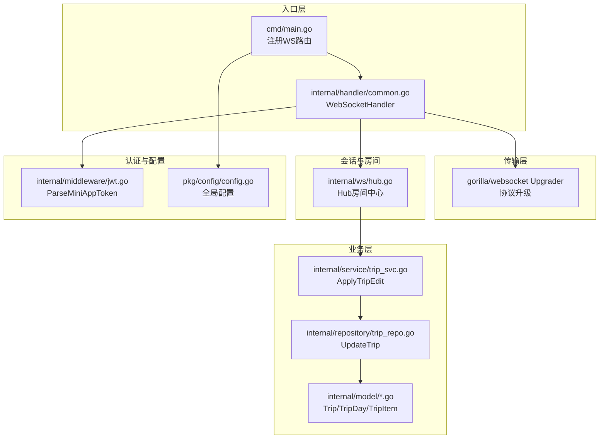
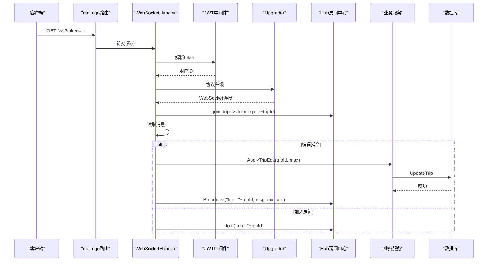
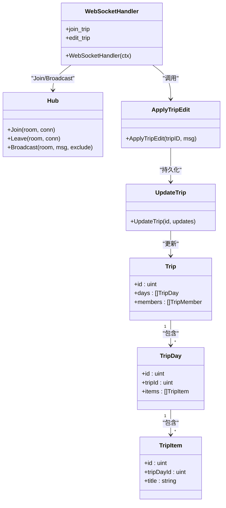
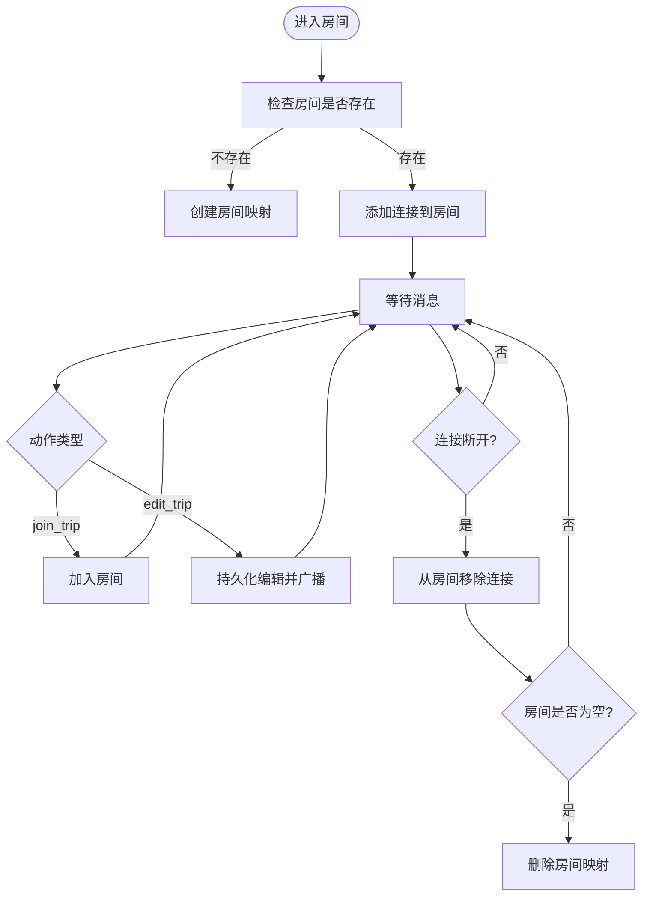
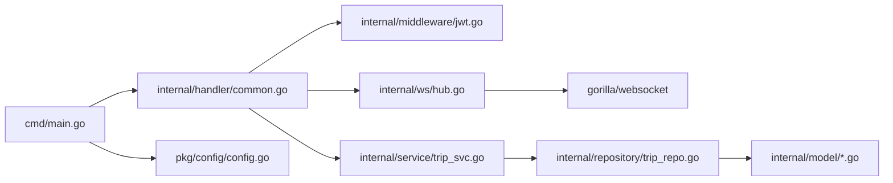

# 房间系统设计

<cite>
**本文档引用的文件**
- [main.go](file://cmd/main.go)
- [common.go](file://internal/handler/common.go)
- [hub.go](file://internal/ws/hub.go)
- [jwt.go](file://internal/middleware/jwt.go)
- [trip_svc.go](file://internal/service/trip_svc.go)
- [trip_repo.go](file://internal/repository/trip_repo.go)
- [trip.go](file://internal/model/trip.go)
- [trip_day.go](file://internal/model/trip_day.go)
- [trip_item.go](file://internal/model/trip_item.go)
- [config.go](file://pkg/config/config.go)
</cite>

## 目录
1. [引言](#引言)
2. [项目结构](#项目结构)
3. [核心组件](#核心组件)
4. [架构概览](#架构概览)
5. [详细组件分析](#详细组件分析)
6. [依赖分析](#依赖分析)
7. [性能考虑](#性能考虑)
8. [故障排查指南](#故障排查指南)
9. [结论](#结论)
10. [附录](#附录)

## 引言
本文件系统性梳理旅行服务器中的WebSocket房间系统，重点覆盖以下方面：
- 房间ID生成规则与命名规范
- 房间与业务实体（行程、攻略等）的关联关系
- 房间的生命周期管理（创建、成员管理、销毁条件）
- 技术实现细节（房间映射数据结构、并发安全、内存优化）
- 权限控制机制（成员资格验证、访问控制）
- 使用场景与业务价值（多人协作编辑、实时讨论）
- 监控指标与故障排查方法

## 项目结构
房间系统位于后端服务的WebSocket处理链路中，核心文件分布如下：
- 入口路由与WebSocket升级：cmd/main.go、internal/handler/common.go
- 房间中心Hub：internal/ws/hub.go
- 认证与授权：internal/middleware/jwt.go
- 业务处理与持久化：internal/service/trip_svc.go、internal/repository/trip_repo.go
- 数据模型：internal/model/trip*.go
- 配置：pkg/config/config.go

**图表来源**
- [main.go:145-146](file://cmd/main.go#L145-L146)
- [common.go:48-91](file://internal/handler/common.go#L48-L91)
- [hub.go:10-55](file://internal/ws/hub.go#L10-L55)
- [jwt.go:38-46](file://internal/middleware/jwt.go#L38-L46)
- [trip_svc.go:7-18](file://internal/service/trip_svc.go#L7-L18)
- [trip_repo.go:29-32](file://internal/repository/trip_repo.go#L29-L32)
- [trip.go:9-27](file://internal/model/trip.go#L9-L27)

**章节来源**
- [main.go:145-146](file://cmd/main.go#L145-L146)
- [common.go:48-91](file://internal/handler/common.go#L48-L91)

## 核心组件
- Hub房间中心：维护房间ID到连接集合的映射，提供Join、Leave、Broadcast等能力，内部以互斥锁保证并发安全。
- WebSocket处理器：负责鉴权、协议升级、消息解析与房间编排。
- 认证中间件：提供小程序用户JWT解析，确保房间访问的合法性。
- 业务服务与仓库：在收到编辑指令时，持久化变更并广播给房间内其他成员。

**章节来源**
- [hub.go:10-55](file://internal/ws/hub.go#L10-L55)
- [common.go:48-91](file://internal/handler/common.go#L48-L91)
- [jwt.go:38-46](file://internal/middleware/jwt.go#L38-L46)
- [trip_svc.go:7-18](file://internal/service/trip_svc.go#L7-L18)

## 架构概览
WebSocket房间系统采用“请求-房间-广播”的模式：
- 客户端通过HTTP路由升级为WebSocket
- 服务端解析JWT，校验用户身份
- 客户端发送加入房间或编辑指令
- 服务端将连接加入对应房间，或持久化编辑并广播

**图表来源**
- [main.go:145-146](file://cmd/main.go#L145-L146)
- [common.go:48-91](file://internal/handler/common.go#L48-L91)
- [jwt.go:38-46](file://internal/middleware/jwt.go#L38-L46)
- [hub.go:23-55](file://internal/ws/hub.go#L23-L55)
- [trip_svc.go:7-18](file://internal/service/trip_svc.go#L7-L18)
- [trip_repo.go:29-32](file://internal/repository/trip_repo.go#L29-L32)

## 详细组件分析

### 房间ID生成规则与命名规范
- 命名规范：房间ID采用“trip:{行程ID}”的字符串格式，其中行程ID来自客户端消息中的tripId字段。
- 生成流程：当客户端发送加入房间动作时，服务端将tripId拼接为“trip:{tripId}”作为房间标识；若房间不存在则自动创建。
- 设计考量：该命名方式直接绑定业务实体（行程），便于按业务维度隔离与扩展（例如未来可扩展“guide:{攻略ID}”等）。

**章节来源**
- [common.go:75-77](file://internal/handler/common.go#L75-L77)
- [common.go:86-87](file://internal/handler/common.go#L86-L87)
- [hub.go:11-14](file://internal/ws/hub.go#L11-L14)

### 房间与业务实体的关联关系
- 行程（Trip）：房间ID与Trip.id强绑定，房间用于承载行程的多人协作编辑与实时同步。
- 行程日（TripDay）与行程项（TripItem）：通过Trip的预加载关系在查询时一并获取，编辑持久化时由服务层统一处理。
- 关联要点：房间只负责连接管理与广播，不直接持有业务数据；业务数据的增删改查由仓库层完成。

**图表来源**
- [hub.go:10-55](file://internal/ws/hub.go#L10-L55)
- [common.go:48-91](file://internal/handler/common.go#L48-L91)
- [trip_svc.go:7-18](file://internal/service/trip_svc.go#L7-L18)
- [trip_repo.go:29-32](file://internal/repository/trip_repo.go#L29-L32)
- [trip.go:9-27](file://internal/model/trip.go#L9-L27)
- [trip_day.go:5-15](file://internal/model/trip_day.go#L5-L15)
- [trip_item.go:5-22](file://internal/model/trip_item.go#L5-L22)

**章节来源**
- [trip.go:9-27](file://internal/model/trip.go#L9-L27)
- [trip_day.go:5-15](file://internal/model/trip_day.go#L5-L15)
- [trip_item.go:5-22](file://internal/model/trip_item.go#L5-L22)

### 房间的生命周期管理
- 创建：首次有连接加入某房间ID时自动创建房间映射。
- 成员管理：Join添加连接，Leave移除连接；当房间内无连接时自动销毁房间。
- 销毁条件：房间内连接数归零即删除房间映射，释放内存。
- 广播：向房间内除发送者外的所有连接推送消息，避免重复回显。

**图表来源**
- [hub.go:23-55](file://internal/ws/hub.go#L23-L55)
- [common.go:75-87](file://internal/handler/common.go#L75-L87)

**章节来源**
- [hub.go:23-55](file://internal/ws/hub.go#L23-L55)
- [common.go:75-87](file://internal/handler/common.go#L75-L87)

### 技术实现细节与内存优化
- 数据结构选择：房间映射采用“房间ID -> 连接集合”的两级映射，连接集合使用布尔值占位，减少存储开销。
- 并发安全：Hub内部使用互斥锁保护房间映射的读写，确保多协程并发下的数据一致性。
- 内存优化：
  - 房间空闲即销毁，避免长期驻留的空房间占用内存。
  - 连接断开后及时清理，降低内存泄漏风险。
  - 广播时排除发送者，减少不必要的I/O。
- 可扩展性：房间ID命名规范预留了“guide:{攻略ID}”等扩展空间，便于后续业务拓展。

**章节来源**
- [hub.go:10-14](file://internal/ws/hub.go#L10-L14)
- [hub.go:23-55](file://internal/ws/hub.go#L23-L55)

### 权限控制机制
- 成员资格验证：WebSocketHandler在处理消息前，通过JWT中间件解析token，获取用户ID，确保只有合法用户可加入房间。
- 访问控制：当前实现未在房间层面做更细粒度的角色校验（如仅编辑者可编辑），建议在业务层（服务/仓库）增加成员角色与权限判断，以限制对特定字段的修改范围。
- 建议增强：
  - 在加入房间时校验用户与行程成员关系
  - 在编辑指令中校验用户角色（如仅拥有编辑权限的成员可修改）

**章节来源**
- [common.go:50-55](file://internal/handler/common.go#L50-L55)
- [jwt.go:38-46](file://internal/middleware/jwt.go#L38-L46)

### 使用场景与业务价值
- 多人协作编辑：多个用户同时编辑同一行程，编辑变更通过房间广播同步至所有参与者，提升协作效率。
- 实时讨论：结合消息模块，可在房间内进行实时讨论与通知。
- 业务价值：降低延迟、提升交互体验，支撑行程规划的实时性需求。

**章节来源**
- [common.go:75-87](file://internal/handler/common.go#L75-L87)

## 依赖分析
- 入口路由依赖WebSocket处理器；WebSocket处理器依赖JWT中间件与Upgrader。
- Hub依赖gorilla/websocket进行连接管理。
- 业务层依赖仓库层进行数据持久化。
- 配置层为全局配置提供基础能力。

**图表来源**
- [main.go:145-146](file://cmd/main.go#L145-L146)
- [common.go:48-91](file://internal/handler/common.go#L48-L91)
- [hub.go:10-55](file://internal/ws/hub.go#L10-L55)
- [jwt.go:38-46](file://internal/middleware/jwt.go#L38-L46)
- [trip_svc.go:7-18](file://internal/service/trip_svc.go#L7-L18)
- [trip_repo.go:29-32](file://internal/repository/trip_repo.go#L29-L32)
- [trip.go:9-27](file://internal/model/trip.go#L9-L27)
- [config.go:1-129](file://pkg/config/config.go#L1-L129)

**章节来源**
- [main.go:145-146](file://cmd/main.go#L145-L146)
- [common.go:48-91](file://internal/handler/common.go#L48-L91)
- [hub.go:10-55](file://internal/ws/hub.go#L10-L55)
- [jwt.go:38-46](file://internal/middleware/jwt.go#L38-L46)
- [trip_svc.go:7-18](file://internal/service/trip_svc.go#L7-L18)
- [trip_repo.go:29-32](file://internal/repository/trip_repo.go#L29-L32)
- [trip.go:9-27](file://internal/model/trip.go#L9-L27)
- [config.go:1-129](file://pkg/config/config.go#L1-L129)

## 性能考虑
- 广播复杂度：每次广播遍历房间内连接，房间规模较大时应关注WriteJSON的I/O开销。
- 并发安全：Hub使用互斥锁串行化房间映射的读写，避免锁竞争；但大量房间同时操作可能成为瓶颈。
- 内存占用：房间映射与连接集合均驻内存，建议结合业务流量评估峰值连接数与房间数量。
- 优化建议：
  - 对房间规模较大的场景，可引入房间分片或连接池
  - 在广播前过滤消息，减少不必要的序列化与网络传输
  - 对频繁编辑的行程，可考虑增量更新与去重策略

[本节为通用性能指导，不直接分析具体文件]

## 故障排查指南
- 无法建立WebSocket连接
  - 检查路由是否正确注册：/ws
  - 检查协议升级是否成功
- token无效
  - 确认前端传递的token是否正确
  - 检查JWT密钥与签名是否匹配
- 房间无消息
  - 确认客户端已发送join_trip加入房间
  - 检查edit_trip是否携带正确的tripId
  - 核对房间ID命名规范（trip:{id}）
- 连接断开后仍占用内存
  - 确认Leave逻辑是否触发
  - 检查房间为空时是否被正确销毁
- 编辑未持久化
  - 检查服务层ApplyTripEdit与仓库层UpdateTrip的调用链
  - 核对数据库连接与事务配置

**章节来源**
- [main.go:145-146](file://cmd/main.go#L145-L146)
- [common.go:50-55](file://internal/handler/common.go#L50-L55)
- [common.go:75-87](file://internal/handler/common.go#L75-L87)
- [hub.go:33-43](file://internal/ws/hub.go#L33-L43)
- [trip_svc.go:7-18](file://internal/service/trip_svc.go#L7-L18)
- [trip_repo.go:29-32](file://internal/repository/trip_repo.go#L29-L32)

## 结论
本房间系统以简洁的Hub模型实现了基于业务实体（行程）的WebSocket房间管理，具备良好的扩展性与实时协作能力。建议在后续版本中增强成员角色校验与权限控制，完善监控指标（连接数、房间数、广播耗时等），以进一步提升稳定性与可观测性。

[本节为总结性内容，不直接分析具体文件]

## 附录

### 房间ID命名规范速查
- 格式：trip:{行程ID}
- 生成位置：WebSocketHandler根据客户端消息中的tripId拼接
- 扩展建议：guide:{攻略ID}、group:{群组ID}等

**章节来源**
- [common.go:75-77](file://internal/handler/common.go#L75-L77)
- [common.go:86-87](file://internal/handler/common.go#L86-L87)

### 监控指标建议
- 房间数量：统计当前活跃房间数
- 连接数：统计每个房间内的连接数
- 广播耗时：记录一次广播的平均耗时
- 错误率：统计token解析失败、数据库更新失败等错误次数
- 内存占用：监控房间映射与连接集合的内存使用趋势

[本节为通用指导，不直接分析具体文件]