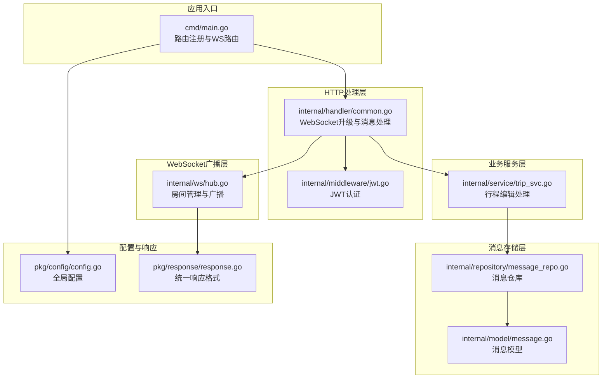
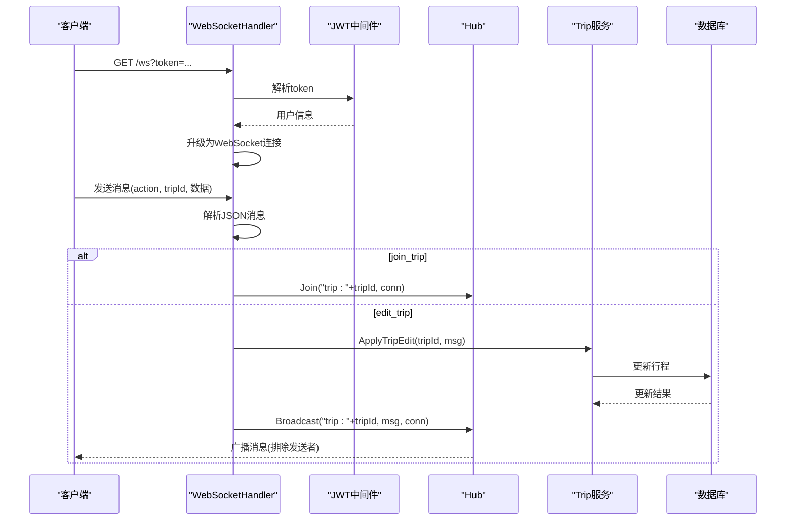
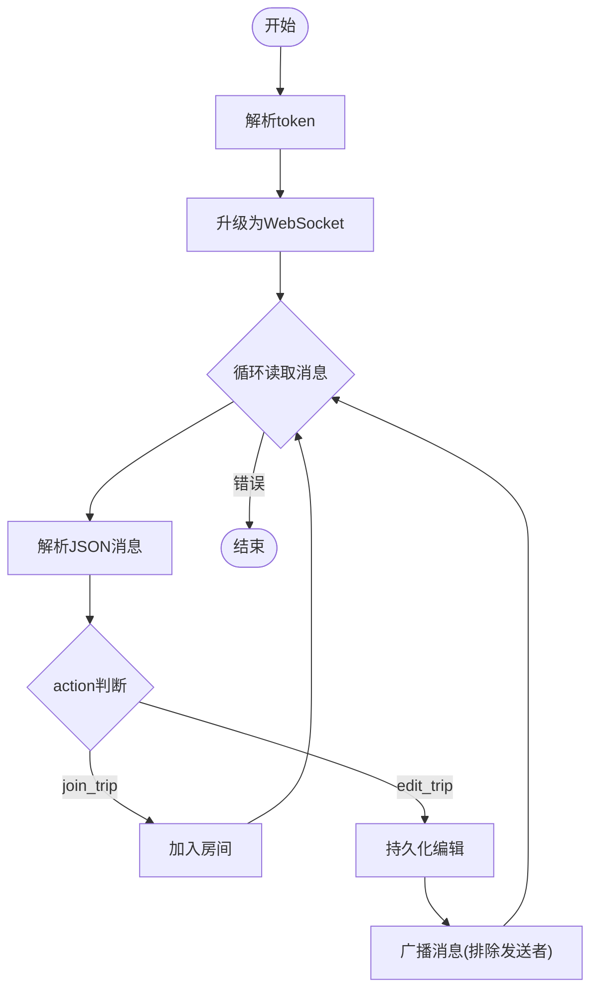
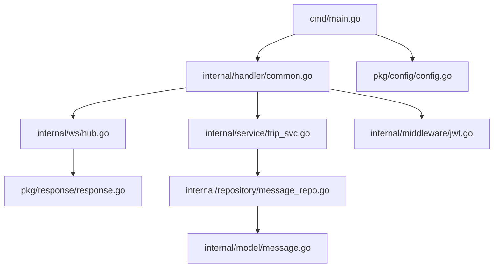

# 消息广播机制

<cite>
**本文档引用的文件**
- [hub.go](file://internal/ws/hub.go)
- [common.go](file://internal/handler/common.go)
- [main.go](file://cmd/main.go)
- [trip_svc.go](file://internal/service/trip_svc.go)
- [message.go](file://internal/model/message.go)
- [message_repo.go](file://internal/repository/message_repo.go)
- [jwt.go](file://internal/middleware/jwt.go)
- [config.go](file://pkg/config/config.go)
- [response.go](file://pkg/response/response.go)
</cite>

## 目录
1. [简介](#简介)
2. [项目结构](#项目结构)
3. [核心组件](#核心组件)
4. [架构概览](#架构概览)
5. [详细组件分析](#详细组件分析)
6. [依赖关系分析](#依赖关系分析)
7. [性能考虑](#性能考虑)
8. [故障排查指南](#故障排查指南)
9. [结论](#结论)
10. [附录](#附录)

## 简介
本文件深入解析旅行社交平台中的WebSocket消息广播机制，重点围绕Broadcast方法的实现原理展开，涵盖消息序列化、连接遍历与异步发送策略、消息排除机制、不同消息类型的处理策略、消息格式规范与事件类型定义、广播性能优化技术以及消息可靠性保障机制。文档旨在帮助开发者在不直接阅读源码的情况下，快速理解并正确使用该广播系统。

## 项目结构
该项目采用分层架构设计，WebSocket广播功能主要分布在以下模块：
- ws层：负责房间管理和广播逻辑
- handler层：负责HTTP升级为WebSocket、消息接收与路由
- service层：负责业务逻辑处理（如行程编辑持久化）
- model/repository层：负责消息模型与数据库交互
- middleware层：负责JWT认证与授权
- pkg层：负责配置与统一响应格式



**图表来源**
- [main.go:145-146](file://cmd/main.go#L145-L146)
- [common.go:48-91](file://internal/handler/common.go#L48-L91)
- [hub.go:10-55](file://internal/ws/hub.go#L10-L55)
- [trip_svc.go:7-18](file://internal/service/trip_svc.go#L7-L18)
- [message.go:5-14](file://internal/model/message.go#L5-L14)
- [message_repo.go:8-19](file://internal/repository/message_repo.go#L8-L19)
- [jwt.go:48-65](file://internal/middleware/jwt.go#L48-L65)
- [config.go:60-100](file://pkg/config/config.go#L60-L100)
- [response.go:10-26](file://pkg/response/response.go#L10-L26)

**章节来源**
- [main.go:145-146](file://cmd/main.go#L145-L146)
- [common.go:48-91](file://internal/handler/common.go#L48-L91)
- [hub.go:10-55](file://internal/ws/hub.go#L10-L55)

## 核心组件
本节聚焦于WebSocket广播的核心组件及其职责：
- Hub：维护房间与连接映射关系，提供Join、Leave、Broadcast等房间管理能力
- WebSocketHandler：负责HTTP到WebSocket的升级、消息接收与路由
- Broadcast方法：实现向房间内所有连接广播消息的逻辑，支持排除发送者

关键特性：
- 房间标识：以字符串形式标识房间，如"trip:{tripID}"
- 连接集合：使用map[*websocket.Conn]bool存储房间内的连接
- 排除机制：通过比较指针地址实现消息排除，避免回环
- 序列化策略：使用WriteJSON进行消息序列化，确保客户端收到标准JSON

**章节来源**
- [hub.go:10-55](file://internal/ws/hub.go#L10-L55)
- [common.go:48-91](file://internal/handler/common.go#L48-L91)

## 架构概览
WebSocket消息广播的整体流程如下：
1. 客户端发起HTTP请求，携带token参数
2. 服务器通过JWT中间件校验token有效性
3. 使用gorilla/websocket将HTTP升级为WebSocket连接
4. 客户端发送消息，包含action字段（如join_trip、edit_trip）
5. 服务器根据action执行相应逻辑（加入房间、持久化编辑）
6. 服务器调用Broadcast向房间内其他连接广播消息



**图表来源**
- [common.go:48-91](file://internal/handler/common.go#L48-L91)
- [hub.go:23-55](file://internal/ws/hub.go#L23-L55)
- [trip_svc.go:7-18](file://internal/service/trip_svc.go#L7-L18)

## 详细组件分析

### Hub类与Broadcast方法
Hub是房间管理的核心，提供以下能力：
- Join：将连接加入指定房间
- Leave：将连接从房间移除
- Broadcast：向房间内所有连接广播消息，支持排除发送者

Broadcast方法的实现要点：
- 使用互斥锁保护房间映射，确保并发安全
- 遍历房间内的所有连接
- 通过指针比较实现消息排除，避免向发送者回环
- 使用WriteJSON进行消息序列化，确保客户端收到标准JSON

```mermaid
classDiagram
class Hub {
+rooms map[string]map[*websocket.Conn]bool
+mu Mutex
+NewHub() Hub
+Join(room string, conn *websocket.Conn) void
+Leave(room string, conn *websocket.Conn) void
+Broadcast(room string, msg interface{}, exclude *websocket.Conn) void
}
class WebSocketConn {
+WriteJSON(v interface{}) error
}
Hub --> WebSocketConn : "广播消息"
```

**图表来源**
- [hub.go:10-55](file://internal/ws/hub.go#L10-L55)

**章节来源**
- [hub.go:10-55](file://internal/ws/hub.go#L10-L55)

### WebSocketHandler的消息处理流程
WebSocketHandler负责：
- 验证token并获取用户信息
- 升级HTTP连接为WebSocket
- 循环读取消息，解析JSON
- 根据action执行相应逻辑

消息处理的关键分支：
- join_trip：将连接加入对应trip房间
- edit_trip：持久化行程编辑，然后广播给房间内其他连接



**图表来源**
- [common.go:48-91](file://internal/handler/common.go#L48-L91)

**章节来源**
- [common.go:48-91](file://internal/handler/common.go#L48-L91)

### 消息排除机制与回环防护
消息排除机制通过比较连接指针实现：
- Broadcast方法接收exclude参数
- 在遍历房间连接时，跳过与exclude相同的连接
- 由于每个WebSocket连接有唯一的指针地址，因此能有效避免回环

这种设计的优势：
- 简洁高效：基于指针比较，时间复杂度为O(1)
- 无额外状态：不需要维护额外的会话状态
- 内存安全：Go的垃圾回收机制确保连接生命周期管理

**章节来源**
- [hub.go:45-55](file://internal/ws/hub.go#L45-L55)

### 不同类型消息的处理策略
当前代码中涉及的消息类型及处理策略：
- 文本消息：通过ReadMessage读取字节数组，再解析为JSON对象
- JSON数据：直接作为interface{}传递给Broadcast，由WriteJSON序列化
- 二进制消息：同样通过ReadMessage读取，但当前实现中未见专门的二进制处理逻辑

注意：当前实现中，所有消息都以JSON格式传输，二进制消息需要客户端自行处理。

**章节来源**
- [common.go:64-72](file://internal/handler/common.go#L64-L72)
- [hub.go:52](file://internal/ws/hub.go#L52)

### 消息格式规范与事件类型定义
基于现有实现，消息格式规范如下：
- 必填字段：action（字符串），用于指示消息类型
- 行程相关：tripId（字符串或数字），标识目标行程
- 其他字段：根据具体业务场景动态添加

事件类型定义：
- join_trip：客户端加入行程房间
- edit_trip：客户端提交行程编辑

消息结构示例（字段含义）：
- action：事件类型，决定服务器处理逻辑
- tripId：行程标识符，用于房间路由
- 其他业务字段：具体的编辑内容或数据

版本兼容性：
- 当前实现未包含版本字段
- 建议在消息中增加version字段以支持未来版本演进

**章节来源**
- [common.go:73-87](file://internal/handler/common.go#L73-L87)

### 广播性能优化技术
当前实现的性能特征：
- 同步广播：Broadcast方法按顺序遍历房间连接并发送
- 无批量发送：每次只发送单条消息
- 无消息合并：不同编辑操作分别广播

潜在优化方向：
- 批量发送：收集一段时间内的消息，合并后一次性发送
- 异步发送：为每个连接的WriteJSON操作创建goroutine
- 消息去重：对相同内容的消息进行去重处理
- 连接池管理：优化连接的创建与销毁

**章节来源**
- [hub.go:45-55](file://internal/ws/hub.go#L45-L55)

### 消息可靠性保证机制
当前实现的消息可靠性：
- 无确认机制：客户端未收到确认响应
- 无重传策略：网络异常时不会自动重发
- 无持久化：消息仅在内存中广播

建议的可靠性改进：
- 确认机制：客户端收到消息后发送ACK
- 重传策略：超时未收到ACK则重发
- 消息持久化：将重要消息持久化到数据库
- 幂等处理：服务端对重复消息进行幂等处理

**章节来源**
- [common.go:84-87](file://internal/handler/common.go#L84-L87)

## 依赖关系分析
WebSocket广播系统的依赖关系如下：
- cmd/main.go：注册WebSocket路由，启动HTTP服务
- internal/handler/common.go：处理WebSocket升级与消息路由
- internal/ws/hub.go：提供房间管理与广播功能
- internal/service/trip_svc.go：处理业务逻辑（如行程编辑）
- internal/middleware/jwt.go：提供JWT认证
- pkg/config/config.go：提供全局配置
- pkg/response/response.go：提供统一响应格式



**图表来源**
- [main.go:145-146](file://cmd/main.go#L145-L146)
- [common.go:48-91](file://internal/handler/common.go#L48-L91)
- [hub.go:10-55](file://internal/ws/hub.go#L10-L55)
- [trip_svc.go:7-18](file://internal/service/trip_svc.go#L7-L18)
- [jwt.go:48-65](file://internal/middleware/jwt.go#L48-L65)
- [config.go:60-100](file://pkg/config/config.go#L60-L100)
- [response.go:10-26](file://pkg/response/response.go#L10-L26)

**章节来源**
- [main.go:145-146](file://cmd/main.go#L145-L146)
- [common.go:48-91](file://internal/handler/common.go#L48-L91)
- [hub.go:10-55](file://internal/ws/hub.go#L10-L55)

## 性能考虑
针对当前实现的性能优化建议：
- 并发控制：为每个连接的WriteJSON操作使用goroutine
- 缓冲区管理：合理设置WebSocket的读写缓冲区大小
- 连接池：复用连接，减少频繁建立/断开连接的开销
- 压缩传输：对大消息进行压缩后再发送
- 背压处理：当客户端处理速度较慢时，适当降低发送频率

当前实现的限制：
- Broadcast方法为同步阻塞式发送
- 未实现任何缓存或队列机制
- 缺少连接健康检查与自动重连

[本节提供一般性指导，无需特定文件来源]

## 故障排查指南
常见问题与排查方法：
- 连接无法升级：检查token是否有效，确认JWT中间件正常工作
- 消息无法到达：确认房间名称格式是否正确（trip:{tripID}）
- 回环问题：检查Broadcast调用时是否正确传入exclude参数
- 性能问题：监控连接数量与消息发送频率，考虑异步发送优化

调试工具与方法：
- 日志记录：在关键路径添加日志输出
- 连接状态监控：统计房间内连接数量
- 错误计数：统计WriteJSON失败次数
- 性能分析：使用pprof分析CPU与内存使用情况

**章节来源**
- [common.go:50-60](file://internal/handler/common.go#L50-L60)
- [hub.go:45-55](file://internal/ws/hub.go#L45-L55)

## 结论
该WebSocket消息广播机制实现了简洁高效的房间管理与消息分发功能。Broadcast方法通过互斥锁保证线程安全，通过指针比较实现消息排除，避免了回环问题。当前实现专注于协同编辑场景，后续可在消息可靠性、性能优化等方面进一步增强。

[本节为总结性内容，无需特定文件来源]

## 附录

### 消息格式规范
- 必填字段：action（字符串）
- 行程相关：tripId（字符串或数字）
- 其他字段：业务自定义

### 事件类型定义
- join_trip：加入行程房间
- edit_trip：提交行程编辑

### 配置项
- SERVER_PORT：服务器监听端口
- APPID/APPSECRET：微信小程序配置
- AMAP_KEY：高德地图API Key

**章节来源**
- [config.go:18-55](file://pkg/config/config.go#L18-L55)