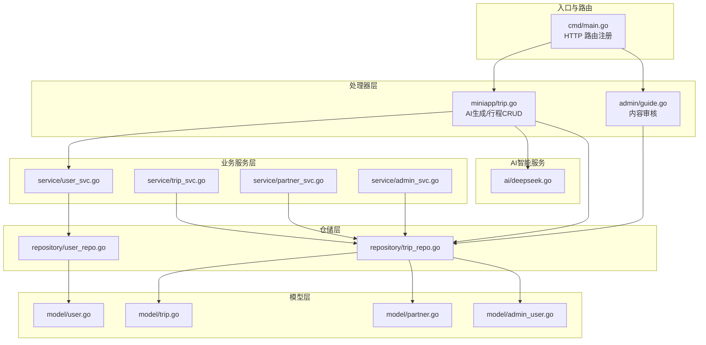
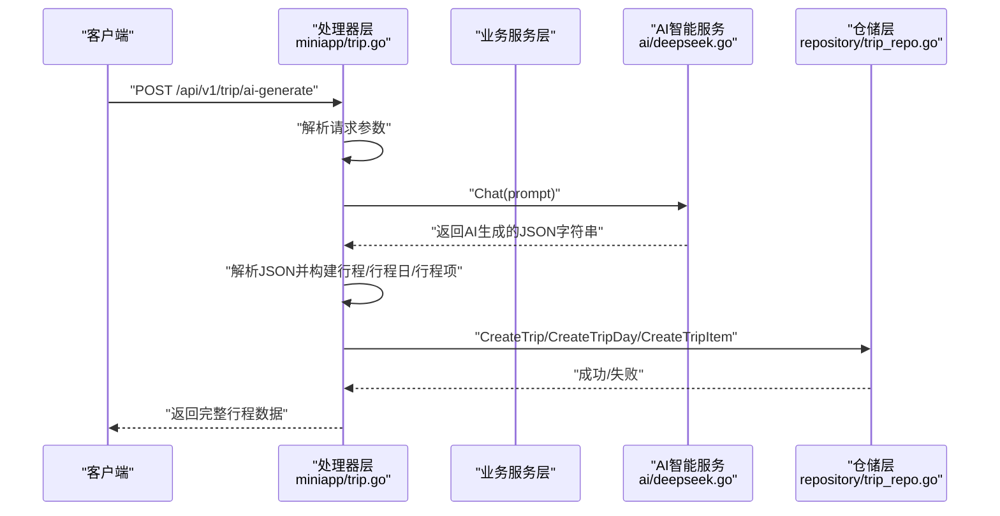
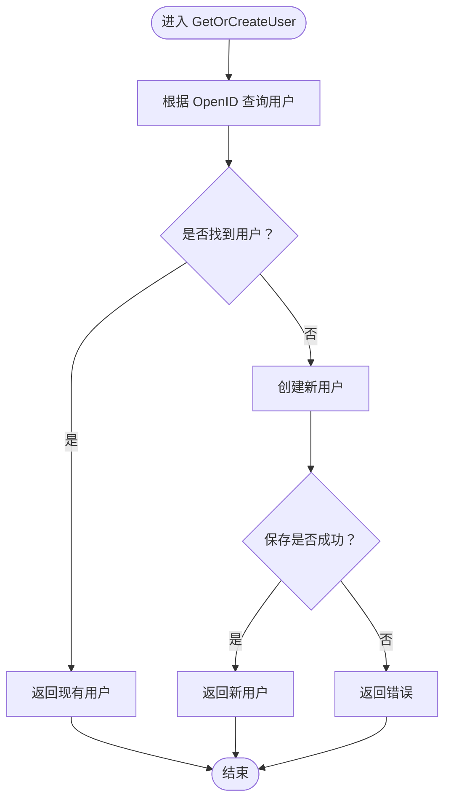
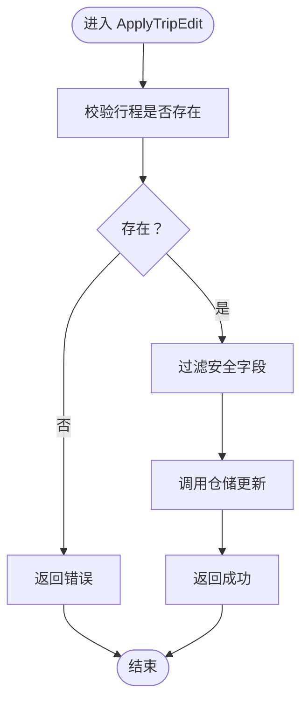
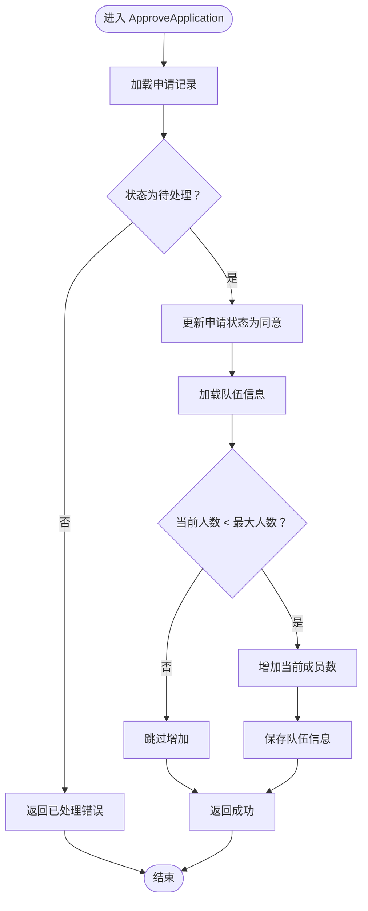
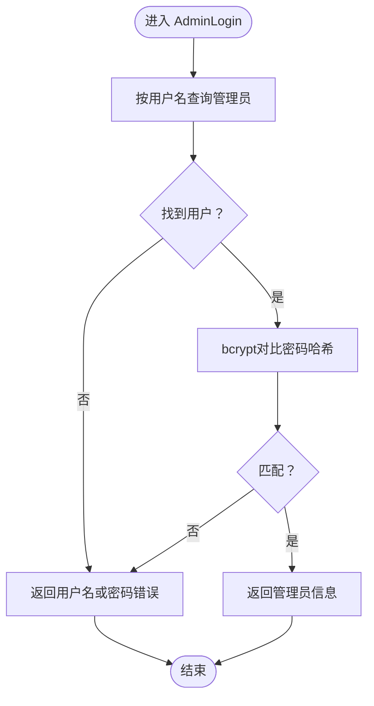
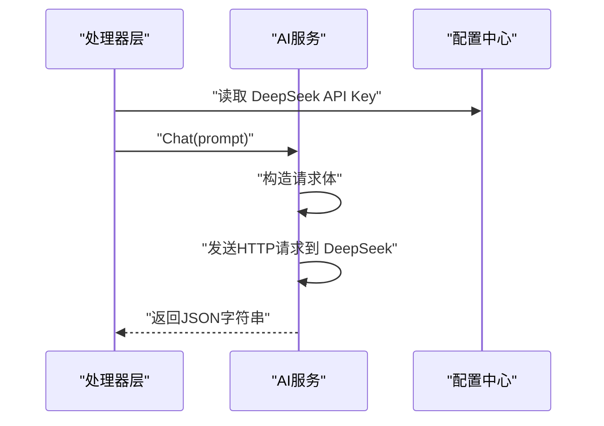
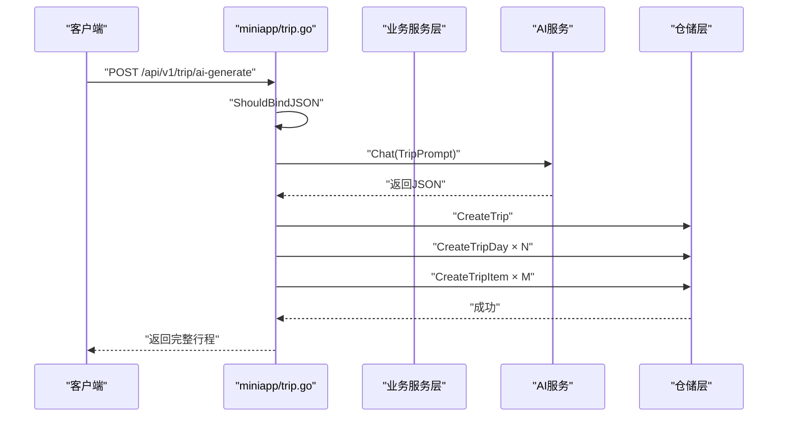
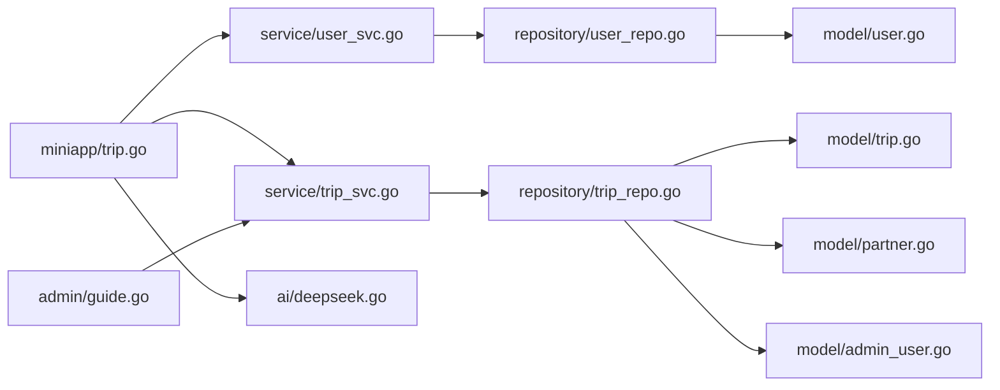

# 业务服务层

<cite>
**本文引用的文件**
- [cmd/main.go](file://cmd/main.go)
- [internal/service/user_svc.go](file://internal/service/user_svc.go)
- [internal/service/trip_svc.go](file://internal/service/trip_svc.go)
- [internal/service/partner_svc.go](file://internal/service/partner_svc.go)
- [internal/service/admin_svc.go](file://internal/service/admin_svc.go)
- [internal/ai/deepseek.go](file://internal/ai/deepseek.go)
- [internal/handler/miniapp/trip.go](file://internal/handler/miniapp/trip.go)
- [internal/handler/admin/guide.go](file://internal/handler/admin/guide.go)
- [internal/repository/user_repo.go](file://internal/repository/user_repo.go)
- [internal/repository/trip_repo.go](file://internal/repository/trip_repo.go)
- [internal/model/user.go](file://internal/model/user.go)
- [internal/model/trip.go](file://internal/model/trip.go)
- [internal/model/partner.go](file://internal/model/partner.go)
- [internal/model/admin_user.go](file://internal/model/admin_user.go)
- [pkg/config/config.go](file://pkg/config/config.go)
</cite>

## 目录
1. [引言](#引言)
2. [项目结构](#项目结构)
3. [核心组件](#核心组件)
4. [架构总览](#架构总览)
5. [详细组件分析](#详细组件分析)
6. [依赖分析](#依赖分析)
7. [性能考虑](#性能考虑)
8. [故障排查指南](#故障排查指南)
9. [结论](#结论)
10. [附录](#附录)

## 引言
本文件聚焦于业务服务层的设计与实现，系统阐述服务层在整体架构中的定位与职责：封装业务规则、编排流程控制、协调仓储层持久化操作，并在需要时集成外部智能服务（如 DeepSeek AI）。文档覆盖核心业务服务（UserService、TripService、PartnerService、AdminService）以及它们与处理器层、仓储层、模型层之间的协作关系；同时给出典型业务流程图与用例说明，提供测试策略与 Mock 设计建议，并总结服务层的扩展性与可维护性设计要点。

## 项目结构
服务层位于 internal/service 目录，采用“按领域分层”的组织方式：每个服务模块负责单一业务域的规则与流程编排。服务层不直接处理 HTTP 请求，而是被处理器层调用，从而实现关注点分离与高内聚低耦合。

- 服务层文件
  - user_svc.go：用户域服务，处理微信登录态下的用户查询/创建
  - trip_svc.go：行程域服务，处理 WebSocket 编辑应用等业务逻辑
  - partner_svc.go：搭子域服务，处理申请审批与队伍成员变更
  - admin_svc.go：后台域服务，处理管理员登录校验

- AI 智能服务
  - deepseek.go：封装 DeepSeek Chat API，用于智能行程生成

- 处理器层与服务层交互
  - miniapp/trip.go：调用 AI 服务与仓储层，完成 AI 生成行程的完整流程
  - admin/guide.go：后台内容审核流程，调用仓储层完成状态更新

- 仓储层与模型层
  - repository 层：封装数据库访问，提供 CRUD 与复杂查询
  - model 层：定义用户、行程、搭子、管理员等核心实体

图表来源
- [cmd/main.go:46-143](file://cmd/main.go#L46-L143)
- [internal/handler/miniapp/trip.go:16-92](file://internal/handler/miniapp/trip.go#L16-L92)
- [internal/handler/admin/guide.go:12-61](file://internal/handler/admin/guide.go#L12-L61)
- [internal/service/user_svc.go:12-27](file://internal/service/user_svc.go#L12-L27)
- [internal/service/trip_svc.go:7-18](file://internal/service/trip_svc.go#L7-L18)
- [internal/service/partner_svc.go:9-32](file://internal/service/partner_svc.go#L9-L32)
- [internal/service/admin_svc.go:12-22](file://internal/service/admin_svc.go#L12-L22)
- [internal/ai/deepseek.go:18-52](file://internal/ai/deepseek.go#L18-L52)
- [internal/repository/user_repo.go:8-43](file://internal/repository/user_repo.go#L8-L43)
- [internal/repository/trip_repo.go:12-137](file://internal/repository/trip_repo.go#L12-L137)
- [internal/model/user.go:6-15](file://internal/model/user.go#L6-L15)
- [internal/model/trip.go:9-37](file://internal/model/trip.go#L9-L37)
- [internal/model/partner.go:5-29](file://internal/model/partner.go#L5-L29)
- [internal/model/admin_user.go:5-15](file://internal/model/admin_user.go#L5-L15)

章节来源
- [cmd/main.go:31-151](file://cmd/main.go#L31-L151)

## 核心组件
本节概述四大核心业务服务及其职责边界：

- UserService
  - 职责：基于微信 OpenID 查询或自动创建用户；作为登录态与用户资料的基础能力
  - 关键实现：GetOrCreateUser
  - 依赖：repository.user_repo.GetUserByOpenID、repository.user_repo.CreateUser

- TripService
  - 职责：处理 WebSocket 推送的行程编辑消息，执行安全字段过滤与更新
  - 关键实现：ApplyTripEdit
  - 依赖：repository.trip_repo.GetTripByID、repository.trip_repo.UpdateTrip

- PartnerService
  - 职责：处理搭子申请审批，更新申请状态与队伍成员计数
  - 关键实现：ApproveApplication
  - 依赖：repository.trip_repo.GetApplicationByID、repository.trip_repo.UpdateApplicationStatus、repository.trip_repo.GetPartnerByID、repository.trip_repo.UpdatePartner

- AdminService
  - 职责：后台用户登录校验，使用 bcrypt 对比密码哈希
  - 关键实现：AdminLogin
  - 依赖：repository.admin_repo.GetAdminUserByUsername（注：仓库层对应文件未在本次检索中出现，但服务层接口明确）

章节来源
- [internal/service/user_svc.go:12-27](file://internal/service/user_svc.go#L12-L27)
- [internal/service/trip_svc.go:7-18](file://internal/service/trip_svc.go#L7-L18)
- [internal/service/partner_svc.go:9-32](file://internal/service/partner_svc.go#L9-L32)
- [internal/service/admin_svc.go:12-22](file://internal/service/admin_svc.go#L12-L22)

## 架构总览
服务层在整体架构中承担“业务编排”角色：接收来自处理器层的请求参数，执行业务规则与流程控制，调用仓储层完成数据持久化，并返回标准化结果。AI 智能服务以独立模块存在，通过显式函数调用接入业务流程。

图表来源
- [internal/handler/miniapp/trip.go:23-91](file://internal/handler/miniapp/trip.go#L23-L91)
- [internal/ai/deepseek.go:18-52](file://internal/ai/deepseek.go#L18-L52)
- [internal/repository/trip_repo.go:12-106](file://internal/repository/trip_repo.go#L12-L106)

## 详细组件分析

### 用户服务（UserService）
- 业务规则
  - 登录即注册：若根据 OpenID 未找到用户，则自动创建新用户
  - 错误处理：区分记录不存在与数据库错误，分别走注册或返回错误
- 流程控制
  - 先查后创：避免重复创建
  - 返回用户对象，供上层继续使用
- 依赖关系
  - 依赖 repository.user_repo.GetUserByOpenID 与 repository.user_repo.CreateUser

图表来源
- [internal/service/user_svc.go:12-27](file://internal/service/user_svc.go#L12-L27)
- [internal/repository/user_repo.go:8-21](file://internal/repository/user_repo.go#L8-L21)

章节来源
- [internal/service/user_svc.go:12-27](file://internal/service/user_svc.go#L12-L27)
- [internal/repository/user_repo.go:8-21](file://internal/repository/user_repo.go#L8-L21)

### 行程服务（TripService）
- 业务规则
  - WebSocket 编辑应用：先校验行程存在性，再过滤不可更新字段，最后写入数据库
- 流程控制
  - 输入校验与字段白名单过滤
  - 事务性更新（由仓储层保证）
- 依赖关系
  - 依赖 repository.trip_repo.GetTripByID 与 repository.trip_repo.UpdateTrip

图表来源
- [internal/service/trip_svc.go:7-18](file://internal/service/trip_svc.go#L7-L18)
- [internal/repository/trip_repo.go:17-32](file://internal/repository/trip_repo.go#L17-L32)

章节来源
- [internal/service/trip_svc.go:7-18](file://internal/service/trip_svc.go#L7-L18)
- [internal/repository/trip_repo.go:17-32](file://internal/repository/trip_repo.go#L17-L32)

### 搭子服务（PartnerService）
- 业务规则
  - 申请状态校验：仅处理未处理的申请
  - 成功审批后增加队伍当前成员数，且不超过最大成员限制
- 流程控制
  - 两步更新：先更新申请状态，再原子性更新队伍成员数
- 依赖关系
  - 依赖 repository.trip_repo.GetApplicationByID、UpdateApplicationStatus、GetPartnerByID、UpdatePartner

图表来源
- [internal/service/partner_svc.go:9-32](file://internal/service/partner_svc.go#L9-L32)
- [internal/repository/trip_repo.go:123-136](file://internal/repository/trip_repo.go#L123-L136)

章节来源
- [internal/service/partner_svc.go:9-32](file://internal/service/partner_svc.go#L9-L32)
- [internal/repository/trip_repo.go:123-136](file://internal/repository/trip_repo.go#L123-L136)

### 后台服务（AdminService）
- 业务规则
  - 使用 bcrypt 校验密码哈希，匹配则返回管理员用户信息
- 流程控制
  - 参数绑定与错误统一返回
- 依赖关系
  - 依赖 repository.admin_repo.GetAdminUserByUsername（仓库层接口在服务层声明）

图表来源
- [internal/service/admin_svc.go:12-22](file://internal/service/admin_svc.go#L12-L22)

章节来源
- [internal/service/admin_svc.go:12-22](file://internal/service/admin_svc.go#L12-L22)

### AI 智能服务集成（DeepSeek）
- 集成目标
  - 为行程生成提供智能提示词与 JSON 输出解析
- 关键实现
  - Chat：向 DeepSeek 发送消息，返回模型回复内容
  - TripPrompt：行程生成提示词模板
- 配置来源
  - 通过 pkg/config/config.go 读取 DEEPSEEK_API_KEY

图表来源
- [internal/ai/deepseek.go:18-52](file://internal/ai/deepseek.go#L18-L52)
- [pkg/config/config.go:95-96](file://pkg/config/config.go#L95-L96)

章节来源
- [internal/ai/deepseek.go:18-52](file://internal/ai/deepseek.go#L18-L52)
- [pkg/config/config.go:95-96](file://pkg/config/config.go#L95-L96)

### 处理器层与服务层协作示例（AI生成行程）
- 典型流程
  - 绑定请求参数 → 构造提示词 → 调用 AI Chat → 解析 JSON → 仓储层批量创建行程/行程日/行程项 → 返回完整行程
- 权限与安全
  - 处理器层在路由层已通过 JWT 中间件注入 userID
  - 服务层对字段进行白名单过滤，避免越权更新

图表来源
- [internal/handler/miniapp/trip.go:23-91](file://internal/handler/miniapp/trip.go#L23-L91)
- [internal/ai/deepseek.go:18-52](file://internal/ai/deepseek.go#L18-L52)
- [internal/repository/trip_repo.go:12-106](file://internal/repository/trip_repo.go#L12-L106)

章节来源
- [internal/handler/miniapp/trip.go:23-91](file://internal/handler/miniapp/trip.go#L23-L91)
- [internal/repository/trip_repo.go:12-106](file://internal/repository/trip_repo.go#L12-L106)

## 依赖分析
- 服务层与仓储层
  - 低耦合：服务层仅依赖仓储层提供的方法签名，不关心具体 SQL 或 ORM 实现细节
  - 可替换性：仓储层可替换为其他存储（如缓存、搜索引擎），不影响服务层
- 服务层与处理器层
  - 单向依赖：处理器层调用服务层，服务层不反向依赖处理器层
  - 职责清晰：处理器层负责输入输出与中间件，服务层专注业务规则
- 外部依赖
  - AI 服务：通过显式函数调用，便于替换与测试
  - 配置中心：集中管理第三方密钥与开关

图表来源
- [internal/handler/miniapp/trip.go:16-92](file://internal/handler/miniapp/trip.go#L16-L92)
- [internal/handler/admin/guide.go:12-61](file://internal/handler/admin/guide.go#L12-L61)
- [internal/service/user_svc.go:12-27](file://internal/service/user_svc.go#L12-L27)
- [internal/service/trip_svc.go:7-18](file://internal/service/trip_svc.go#L7-L18)
- [internal/ai/deepseek.go:18-52](file://internal/ai/deepseek.go#L18-L52)
- [internal/repository/user_repo.go:8-43](file://internal/repository/user_repo.go#L8-L43)
- [internal/repository/trip_repo.go:12-137](file://internal/repository/trip_repo.go#L12-L137)
- [internal/model/user.go:6-15](file://internal/model/user.go#L6-L15)
- [internal/model/trip.go:9-37](file://internal/model/trip.go#L9-L37)
- [internal/model/partner.go:5-29](file://internal/model/partner.go#L5-L29)
- [internal/model/admin_user.go:5-15](file://internal/model/admin_user.go#L5-L15)

章节来源
- [internal/service/user_svc.go:12-27](file://internal/service/user_svc.go#L12-L27)
- [internal/service/trip_svc.go:7-18](file://internal/service/trip_svc.go#L7-L18)
- [internal/service/partner_svc.go:9-32](file://internal/service/partner_svc.go#L9-L32)
- [internal/service/admin_svc.go:12-22](file://internal/service/admin_svc.go#L12-L22)
- [internal/repository/user_repo.go:8-43](file://internal/repository/user_repo.go#L8-L43)
- [internal/repository/trip_repo.go:12-137](file://internal/repository/trip_repo.go#L12-L137)

## 性能考虑
- 仓储层优化
  - 预加载与排序：GetTripByID 使用 Preload 并指定排序，减少 N+1 查询风险
  - 事务封装：DeleteTripDay 与 ReorderTripItems 在单事务中执行，确保一致性
- 服务层优化
  - 字段白名单：ApplyTripEdit 过滤不可更新字段，降低写放大
  - 批量插入：BatchCreateTripItems 提供批量写入能力
- AI 调用
  - 异步化建议：在高并发场景下，将 AI 调用异步化并引入队列，避免阻塞主流程
  - 缓存策略：对热门目的地的行程模板进行缓存，减少重复计算

## 故障排查指南
- 用户服务
  - 症状：登录后无法创建用户
  - 排查：确认 GetUserByOpenID 是否返回记录不存在错误；检查 CreateUser 是否抛出唯一约束冲突
- 行程服务
  - 症状：WebSocket 编辑不生效
  - 排查：确认 ApplyTripEdit 的字段过滤是否正确；检查仓储层 UpdateTrip 是否返回错误
- 搭子服务
  - 症状：审批后队伍人数不变
  - 排查：确认申请状态是否为待处理；检查队伍当前人数与最大人数比较逻辑
- 后台服务
  - 症状：登录失败
  - 排查：确认用户名存在且密码哈希匹配；检查 bcrypt 对比过程
- AI 集成
  - 症状：AI 生成失败或返回格式异常
  - 排查：检查 DEEPSEEK_API_KEY 是否配置；验证 Chat 返回内容是否为有效 JSON；确认提示词模板格式

章节来源
- [internal/service/user_svc.go:12-27](file://internal/service/user_svc.go#L12-L27)
- [internal/service/trip_svc.go:7-18](file://internal/service/trip_svc.go#L7-L18)
- [internal/service/partner_svc.go:9-32](file://internal/service/partner_svc.go#L9-L32)
- [internal/service/admin_svc.go:12-22](file://internal/service/admin_svc.go#L12-L22)
- [internal/ai/deepseek.go:18-52](file://internal/ai/deepseek.go#L18-L52)
- [pkg/config/config.go:95-96](file://pkg/config/config.go#L95-L96)

## 结论
服务层通过清晰的职责划分与稳定的接口契约，实现了业务规则的集中化与可复用性。结合仓储层的事务与预加载能力，以及 AI 智能服务的可插拔特性，整体系统具备良好的扩展性与可维护性。建议在后续迭代中进一步引入异步化与缓存策略，以提升高并发场景下的吞吐与稳定性。

## 附录
- 用例说明
  - AI 生成行程
    - 参与者：小程序前端、处理器层、AI 服务、仓储层
    - 前置条件：用户已登录，拥有有效 JWT
    - 主要流程：提交目的地、天数、标签 → AI 生成 JSON → 仓储批量创建 → 返回完整行程
    - 备选流程：AI 返回格式异常 → 返回错误
  - 审核攻略
    - 参与者：后台管理员、处理器层、仓储层
    - 主要流程：管理员登录 → 列表获取 → 更新状态 → 保存
- 测试策略与 Mock
  - 单元测试
    - 为每个服务编写针对边界条件的测试：用户不存在/已存在、行程不存在、申请状态非法、密码错误等
  - Mock 设计
    - 使用接口隔离仓储层依赖，通过注入 Mock 仓储实现纯逻辑测试
    - 对 AI 服务进行 Mock，固定返回预期 JSON，验证解析与持久化链路
  - 集成测试
    - 路由到服务层的端到端测试，覆盖 AI 生成与审核流程的关键路径