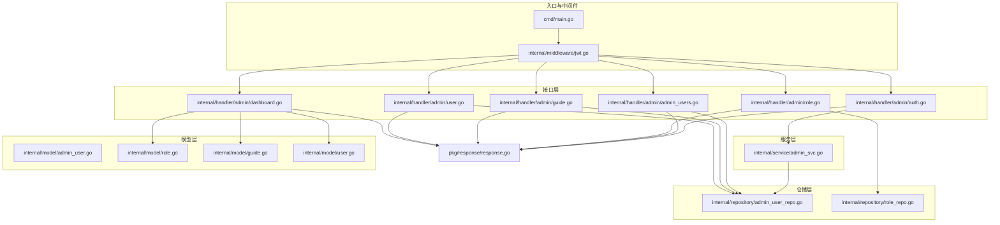
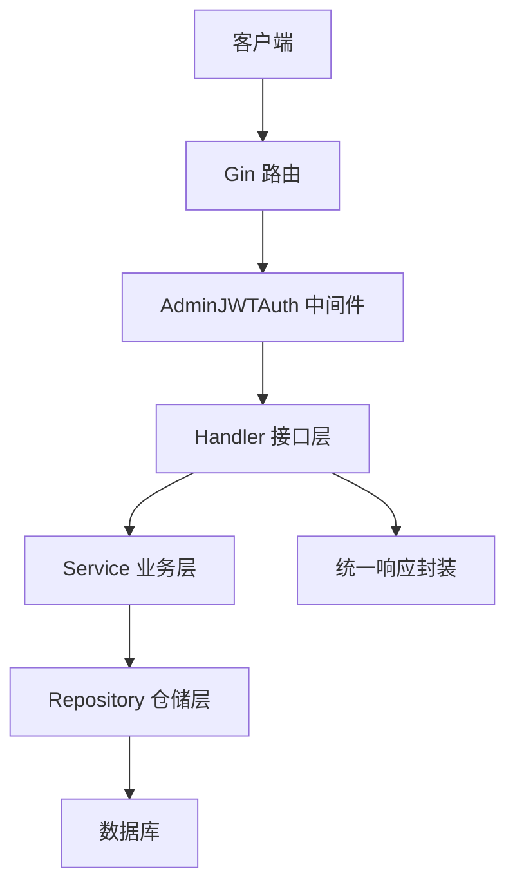
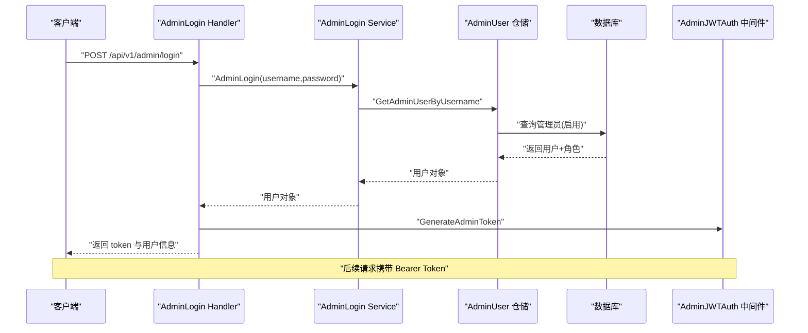
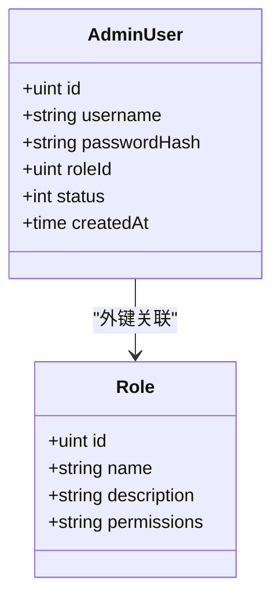
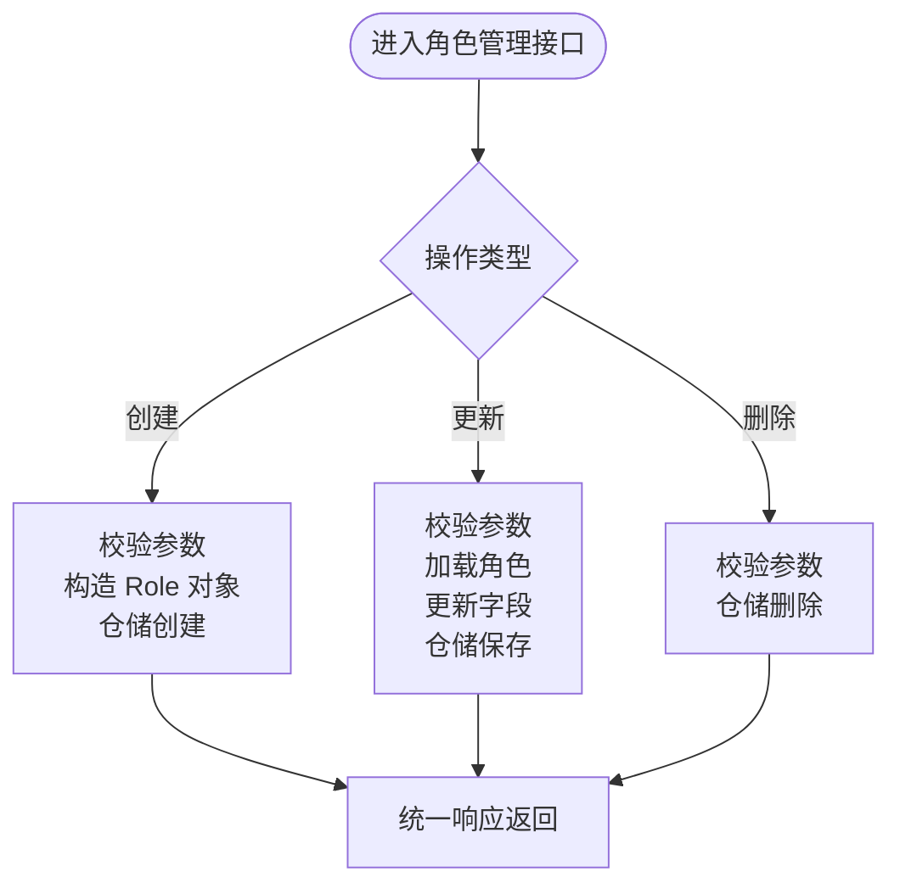
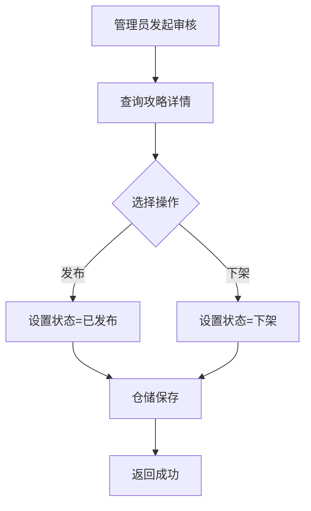
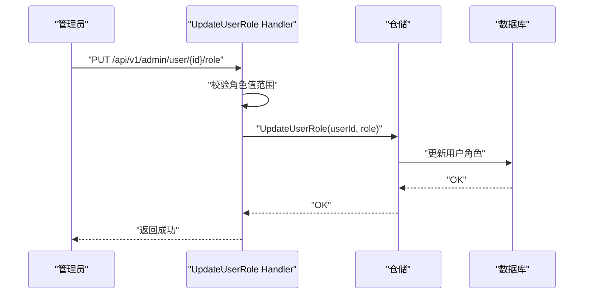
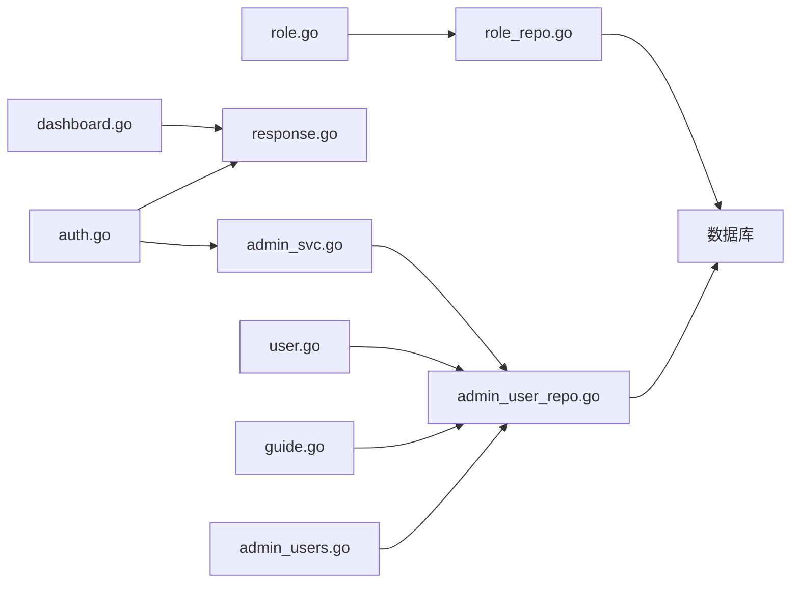
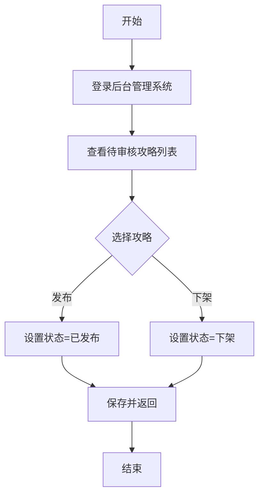

# 后台管理服务

<cite>
**本文档引用的文件**
- [cmd/main.go](file://cmd/main.go)
- [internal/service/admin_svc.go](file://internal/service/admin_svc.go)
- [internal/handler/admin/auth.go](file://internal/handler/admin/auth.go)
- [internal/handler/admin/admin_users.go](file://internal/handler/admin/admin_users.go)
- [internal/handler/admin/role.go](file://internal/handler/admin/role.go)
- [internal/handler/admin/guide.go](file://internal/handler/admin/guide.go)
- [internal/handler/admin/user.go](file://internal/handler/admin/user.go)
- [internal/handler/admin/dashboard.go](file://internal/handler/admin/dashboard.go)
- [internal/middleware/jwt.go](file://internal/middleware/jwt.go)
- [internal/model/admin_user.go](file://internal/model/admin_user.go)
- [internal/model/role.go](file://internal/model/role.go)
- [internal/model/guide.go](file://internal/model/guide.go)
- [internal/model/user.go](file://internal/model/user.go)
- [internal/repository/admin_user_repo.go](file://internal/repository/admin_user_repo.go)
- [internal/repository/role_repo.go](file://internal/repository/role_repo.go)
- [pkg/response/response.go](file://pkg/response/response.go)
</cite>

## 目录
1. [简介](#简介)
2. [项目结构](#项目结构)
3. [核心组件](#核心组件)
4. [架构总览](#架构总览)
5. [详细组件分析](#详细组件分析)
6. [依赖分析](#依赖分析)
7. [性能考虑](#性能考虑)
8. [故障排查指南](#故障排查指南)
9. [结论](#结论)
10. [附录](#附录)

## 简介
本文件为后台管理服务的权威技术文档，聚焦于 AdminService 的管理能力与实现细节，覆盖用户管理、内容审核、权限控制与系统配置等模块；阐明管理员权限体系与角色管理机制；梳理内容审核流程（攻略审核、用户角色变更）；给出操作流程图与权限矩阵；说明批量操作、数据导出与统计报表能力现状；并总结安全与审计、监控与日志建议。

## 项目结构
后台管理相关代码采用“Handler-Service-Repository-Model”分层组织，配合 Gin 路由与 JWT 中间件完成鉴权与授权。核心目录与职责如下：
- cmd/main.go：应用入口，注册路由与中间件
- internal/handler/admin/*：后台管理接口层，定义 REST API 与 Swagger 注解
- internal/service/*：业务服务层，封装后台登录与校验逻辑
- internal/middleware/jwt.go：JWT 认证与授权中间件，区分小程序与后台管理员
- internal/repository/*：仓储层，封装数据库访问
- internal/model/*：数据模型，描述后台用户、角色、内容等实体
- pkg/response/response.go：统一响应体封装

图表来源
- [cmd/main.go](file://cmd/main.go)
- [internal/middleware/jwt.go](file://internal/middleware/jwt.go)
- [internal/handler/admin/auth.go](file://internal/handler/admin/auth.go)
- [internal/handler/admin/admin_users.go](file://internal/handler/admin/admin_users.go)
- [internal/handler/admin/role.go](file://internal/handler/admin/role.go)
- [internal/handler/admin/guide.go](file://internal/handler/admin/guide.go)
- [internal/handler/admin/user.go](file://internal/handler/admin/user.go)
- [internal/handler/admin/dashboard.go](file://internal/handler/admin/dashboard.go)
- [internal/service/admin_svc.go](file://internal/service/admin_svc.go)
- [internal/repository/admin_user_repo.go](file://internal/repository/admin_user_repo.go)
- [internal/repository/role_repo.go](file://internal/repository/role_repo.go)
- [pkg/response/response.go](file://pkg/response/response.go)

章节来源
- [cmd/main.go](file://cmd/main.go)
- [internal/middleware/jwt.go](file://internal/middleware/jwt.go)
- [internal/handler/admin/auth.go](file://internal/handler/admin/auth.go)
- [internal/handler/admin/admin_users.go](file://internal/handler/admin/admin_users.go)
- [internal/handler/admin/role.go](file://internal/handler/admin/role.go)
- [internal/handler/admin/guide.go](file://internal/handler/admin/guide.go)
- [internal/handler/admin/user.go](file://internal/handler/admin/user.go)
- [internal/handler/admin/dashboard.go](file://internal/handler/admin/dashboard.go)
- [internal/service/admin_svc.go](file://internal/service/admin_svc.go)
- [internal/repository/admin_user_repo.go](file://internal/repository/admin_user_repo.go)
- [internal/repository/role_repo.go](file://internal/repository/role_repo.go)
- [pkg/response/response.go](file://pkg/response/response.go)

## 核心组件
- 管理员登录与鉴权
  - 登录：接收用户名/密码，校验后签发后台专用 JWT
  - 鉴权：AdminJWTAuth 中间件解析 JWT，注入管理员上下文并校验状态
- 管理员用户管理
  - 列表、创建、更新（角色、状态、密码）、删除
- 角色与权限管理
  - 角色列表、创建、更新、删除；角色绑定权限字符串
- 内容审核
  - 攻略列表与状态更新（发布/下架）
- 用户角色管理
  - 用户角色变更（普通/领队/管理员）
- 统计看板
  - 用户、攻略、合作方数量统计

章节来源
- [internal/handler/admin/auth.go](file://internal/handler/admin/auth.go)
- [internal/middleware/jwt.go](file://internal/middleware/jwt.go)
- [internal/handler/admin/admin_users.go](file://internal/handler/admin/admin_users.go)
- [internal/handler/admin/role.go](file://internal/handler/admin/role.go)
- [internal/handler/admin/guide.go](file://internal/handler/admin/guide.go)
- [internal/handler/admin/user.go](file://internal/handler/admin/user.go)
- [internal/handler/admin/dashboard.go](file://internal/handler/admin/dashboard.go)

## 架构总览
后台管理采用“接口-服务-仓储-模型-响应”的清晰分层，配合独立的后台 JWT 密钥与中间件，确保后台会话与小程序会话隔离。

图表来源
- [internal/middleware/jwt.go](file://internal/middleware/jwt.go)
- [internal/handler/admin/auth.go](file://internal/handler/admin/auth.go)
- [internal/service/admin_svc.go](file://internal/service/admin_svc.go)
- [internal/repository/admin_user_repo.go](file://internal/repository/admin_user_repo.go)
- [pkg/response/response.go](file://pkg/response/response.go)

## 详细组件分析

### 管理员登录与鉴权
- 登录流程
  - Handler 接收用户名/密码，调用 Service 进行校验
  - Service 通过仓储按用户名查询管理员并比对密码哈希
  - 成功后由中间件签发后台专用 JWT
- 鉴权流程
  - AdminJWTAuth 解析并验证后台 JWT
  - 校验管理员存在且启用，注入 adminUserID 与角色到上下文

图表来源
- [internal/handler/admin/auth.go](file://internal/handler/admin/auth.go)
- [internal/service/admin_svc.go](file://internal/service/admin_svc.go)
- [internal/repository/admin_user_repo.go](file://internal/repository/admin_user_repo.go)
- [internal/middleware/jwt.go](file://internal/middleware/jwt.go)

章节来源
- [internal/handler/admin/auth.go](file://internal/handler/admin/auth.go)
- [internal/service/admin_svc.go](file://internal/service/admin_svc.go)
- [internal/repository/admin_user_repo.go](file://internal/repository/admin_user_repo.go)
- [internal/middleware/jwt.go](file://internal/middleware/jwt.go)

### 管理员用户管理
- 功能点
  - 分页列出后台管理员，支持排序与筛选（可扩展）
  - 创建管理员（自动哈希密码），默认启用
  - 更新管理员（可改角色、状态、密码）
  - 删除管理员
- 数据模型
  - AdminUser 关联 Role，包含状态字段

图表来源
- [internal/model/admin_user.go](file://internal/model/admin_user.go)
- [internal/model/role.go](file://internal/model/role.go)

章节来源
- [internal/handler/admin/admin_users.go](file://internal/handler/admin/admin_users.go)
- [internal/repository/admin_user_repo.go](file://internal/repository/admin_user_repo.go)
- [internal/model/admin_user.go](file://internal/model/admin_user.go)
- [internal/model/role.go](file://internal/model/role.go)

### 角色与权限管理
- 功能点
  - 分页列出角色
  - 创建/更新/删除角色
  - 权限以 JSON 字符串存储在 Role.Permissions
- 权限使用
  - 当前中间件注入角色对象，但未在路由层进行细粒度权限校验（可扩展）

图表来源
- [internal/handler/admin/role.go](file://internal/handler/admin/role.go)
- [internal/repository/role_repo.go](file://internal/repository/role_repo.go)
- [internal/model/role.go](file://internal/model/role.go)

章节来源
- [internal/handler/admin/role.go](file://internal/handler/admin/role.go)
- [internal/repository/role_repo.go](file://internal/repository/role_repo.go)
- [internal/model/role.go](file://internal/model/role.go)

### 内容审核（攻略）
- 功能点
  - 攻略列表（含状态）
  - 审核状态更新（发布/下架）
- 状态语义
  - 0 草稿 / 1 已发布 / 2 下架

图表来源
- [internal/handler/admin/guide.go](file://internal/handler/admin/guide.go)
- [internal/model/guide.go](file://internal/model/guide.go)

章节来源
- [internal/handler/admin/guide.go](file://internal/handler/admin/guide.go)
- [internal/model/guide.go](file://internal/model/guide.go)

### 用户角色管理
- 功能点
  - 用户列表（分页）
  - 用户角色变更（普通/领队/管理员）
- 角色枚举
  - 0 普通 / 1 领队 / 2 管理员

图表来源
- [internal/handler/admin/user.go](file://internal/handler/admin/user.go)
- [internal/model/user.go](file://internal/model/user.go)

章节来源
- [internal/handler/admin/user.go](file://internal/handler/admin/user.go)
- [internal/model/user.go](file://internal/model/user.go)

### 统计看板
- 功能点
  - 统计用户、攻略、合作方数量
- 实现方式
  - 直接对模型执行计数查询

章节来源
- [internal/handler/admin/dashboard.go](file://internal/handler/admin/dashboard.go)
- [internal/model/user.go](file://internal/model/user.go)
- [internal/model/guide.go](file://internal/model/guide.go)

### 权限矩阵（基于现有实现）
- 登录与信息
  - 登录：任意管理员
  - 获取信息：已登录管理员
- 用户管理
  - 列表：需要登录
  - 创建/更新/删除：需要登录
- 角色管理
  - 列表：需要登录
  - 创建/更新/删除：需要登录
- 内容审核
  - 列表：需要登录
  - 审核：需要登录
- 用户角色
  - 列表：需要登录
  - 变更：需要登录
- 统计看板
  - 需要登录

章节来源
- [internal/handler/admin/auth.go](file://internal/handler/admin/auth.go)
- [internal/handler/admin/admin_users.go](file://internal/handler/admin/admin_users.go)
- [internal/handler/admin/role.go](file://internal/handler/admin/role.go)
- [internal/handler/admin/guide.go](file://internal/handler/admin/guide.go)
- [internal/handler/admin/user.go](file://internal/handler/admin/user.go)
- [internal/handler/admin/dashboard.go](file://internal/handler/admin/dashboard.go)

### 批量操作、数据导出与统计报表
- 现状
  - 未发现批量操作与数据导出接口
  - 未发现专门的统计报表接口
- 建议
  - 批量操作：在用户管理、角色管理、内容审核中增加批量状态切换与批量删除
  - 数据导出：提供 CSV/Excel 导出接口（用户、角色、内容）
  - 统计报表：按时间维度聚合用户增长、内容发布趋势、违规处理量等

章节来源
- [internal/handler/admin/admin_users.go](file://internal/handler/admin/admin_users.go)
- [internal/handler/admin/role.go](file://internal/handler/admin/role.go)
- [internal/handler/admin/guide.go](file://internal/handler/admin/guide.go)
- [internal/handler/admin/user.go](file://internal/handler/admin/user.go)

## 依赖分析
- 组件耦合
  - Handler 仅依赖 Service/Repository 与响应封装，低耦合
  - Service 仅依赖仓储与加密库，职责单一
  - 仓储依赖数据库连接，面向模型编程
- 关键依赖链
  - 登录 → Service → 仓储 → 数据库
  - 其他管理接口 → 仓储 → 数据库
- 安全边界
  - 后台 JWT 与小程序 JWT 密钥分离，避免会话混淆

图表来源
- [internal/handler/admin/auth.go](file://internal/handler/admin/auth.go)
- [internal/service/admin_svc.go](file://internal/service/admin_svc.go)
- [internal/handler/admin/admin_users.go](file://internal/handler/admin/admin_users.go)
- [internal/handler/admin/role.go](file://internal/handler/admin/role.go)
- [internal/handler/admin/guide.go](file://internal/handler/admin/guide.go)
- [internal/handler/admin/user.go](file://internal/handler/admin/user.go)
- [internal/handler/admin/dashboard.go](file://internal/handler/admin/dashboard.go)
- [internal/repository/admin_user_repo.go](file://internal/repository/admin_user_repo.go)
- [internal/repository/role_repo.go](file://internal/repository/role_repo.go)
- [pkg/response/response.go](file://pkg/response/response.go)

章节来源
- [internal/handler/admin/auth.go](file://internal/handler/admin/auth.go)
- [internal/service/admin_svc.go](file://internal/service/admin_svc.go)
- [internal/handler/admin/admin_users.go](file://internal/handler/admin/admin_users.go)
- [internal/handler/admin/role.go](file://internal/handler/admin/role.go)
- [internal/handler/admin/guide.go](file://internal/handler/admin/guide.go)
- [internal/handler/admin/user.go](file://internal/handler/admin/user.go)
- [internal/handler/admin/dashboard.go](file://internal/handler/admin/dashboard.go)
- [internal/repository/admin_user_repo.go](file://internal/repository/admin_user_repo.go)
- [internal/repository/role_repo.go](file://internal/repository/role_repo.go)
- [pkg/response/response.go](file://pkg/response/response.go)

## 性能考虑
- 分页与索引
  - 列表接口均采用分页，建议为常用查询字段建立索引（如管理员用户名、角色名、内容状态）
- 缓存策略
  - 对高频读取的统计结果可引入缓存（如 Redis）
- 并发与锁
  - 批量操作建议使用事务与行级锁，避免并发写冲突
- 日志与追踪
  - 为关键操作添加请求 ID 与审计日志，便于定位性能瓶颈

## 故障排查指南
- 登录失败
  - 检查用户名是否存在且状态为启用
  - 核对密码哈希是否正确
- 鉴权失败
  - 确认请求头 Authorization 是否为 Bearer Token
  - 校验后台 JWT 密钥与签名算法一致
- 数据异常
  - 核对仓储查询条件与模型字段映射
  - 检查软删除与状态字段影响

章节来源
- [internal/handler/admin/auth.go](file://internal/handler/admin/auth.go)
- [internal/middleware/jwt.go](file://internal/middleware/jwt.go)
- [internal/repository/admin_user_repo.go](file://internal/repository/admin_user_repo.go)

## 结论
后台管理服务以清晰的分层架构实现了管理员登录、用户与角色管理、内容审核与统计看板等核心能力。当前实现具备良好的可维护性与扩展性，建议后续补充批量操作、数据导出与统计报表接口，并完善细粒度权限校验与审计日志体系。

## 附录

### 操作流程图（内容审核）

图表来源
- [internal/handler/admin/guide.go](file://internal/handler/admin/guide.go)

### 权限矩阵（建议增强）
- 当前：基于登录态的粗粒度保护
- 建议：在中间件层增加权限白名单校验，结合角色权限字符串进行细粒度控制

章节来源
- [internal/middleware/jwt.go](file://internal/middleware/jwt.go)
- [internal/model/role.go](file://internal/model/role.go)