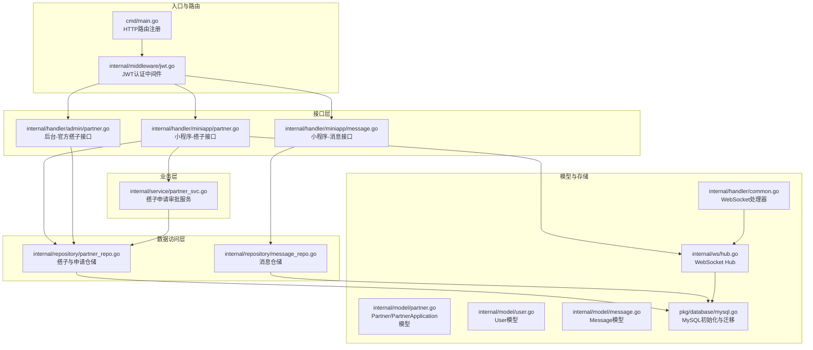
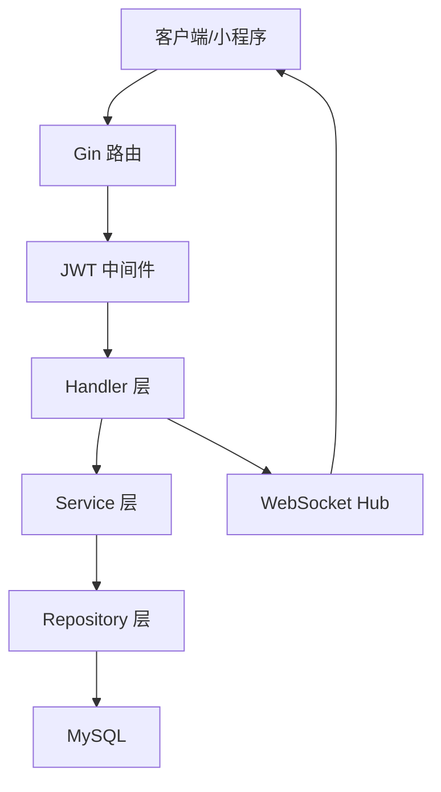
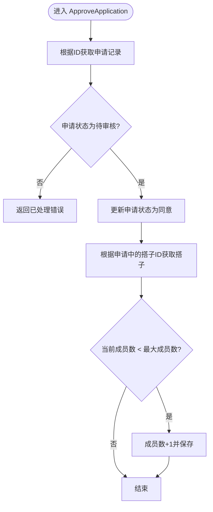
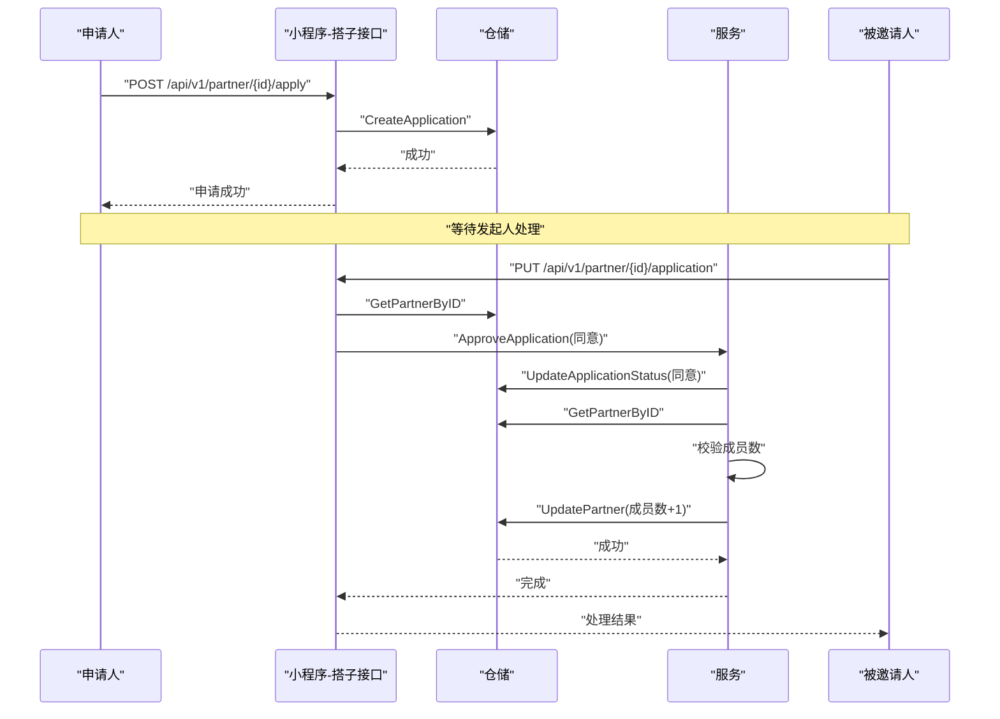
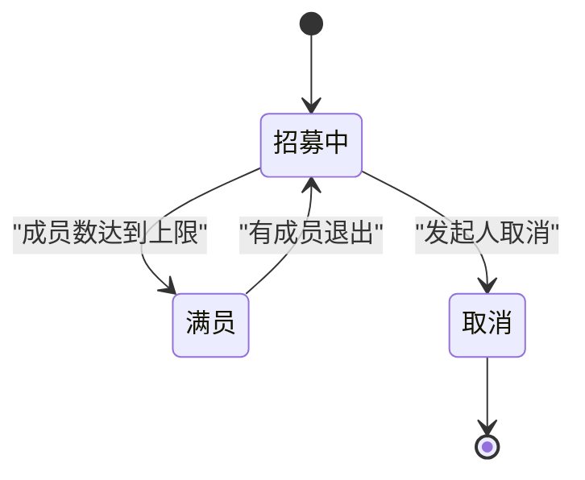
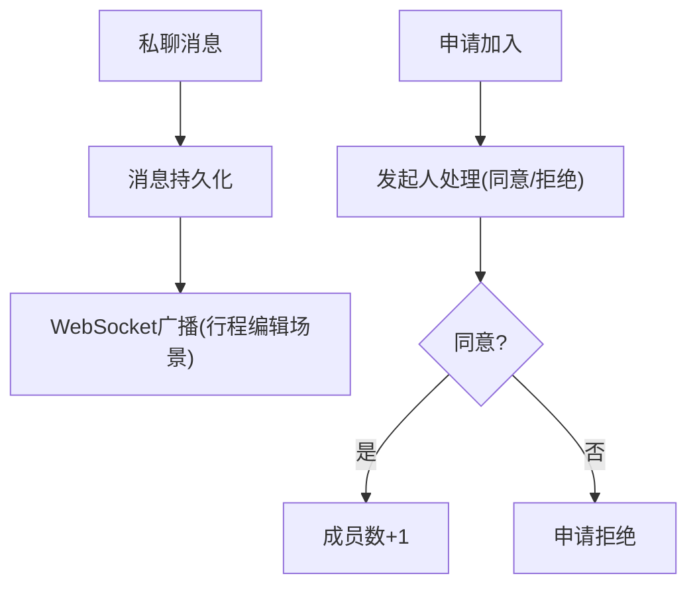
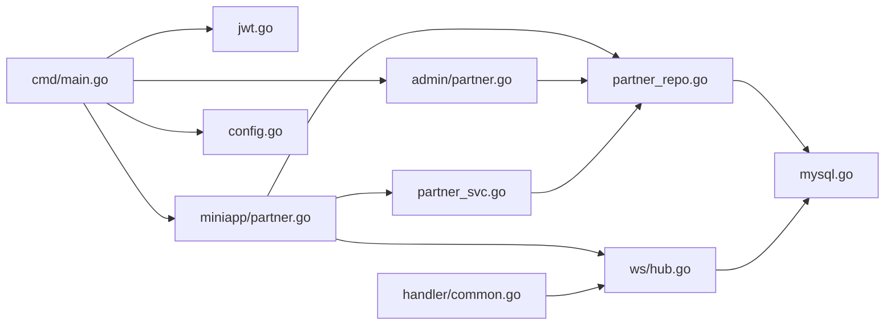

# 搭子匹配服务

<cite>
**本文引用的文件**
- [cmd/main.go](file://cmd/main.go)
- [internal/service/partner_svc.go](file://internal/service/partner_svc.go)
- [internal/handler/miniapp/partner.go](file://internal/handler/miniapp/partner.go)
- [internal/handler/admin/partner.go](file://internal/handler/admin/partner.go)
- [internal/repository/partner_repo.go](file://internal/repository/partner_repo.go)
- [internal/model/partner.go](file://internal/model/partner.go)
- [internal/model/user.go](file://internal/model/user.go)
- [internal/model/message.go](file://internal/model/message.go)
- [internal/handler/miniapp/message.go](file://internal/handler/miniapp/message.go)
- [internal/repository/message_repo.go](file://internal/repository/message_repo.go)
- [internal/ws/hub.go](file://internal/ws/hub.go)
- [internal/handler/common.go](file://internal/handler/common.go)
- [internal/middleware/jwt.go](file://internal/middleware/jwt.go)
- [pkg/database/mysql.go](file://pkg/database/mysql.go)
- [pkg/config/config.go](file://pkg/config/config.go)
</cite>

## 目录
1. [简介](#简介)
2. [项目结构](#项目结构)
3. [核心组件](#核心组件)
4. [架构总览](#架构总览)
5. [详细组件分析](#详细组件分析)
6. [依赖分析](#依赖分析)
7. [性能考虑](#性能考虑)
8. [故障排查指南](#故障排查指南)
9. [结论](#结论)
10. [附录](#附录)

## 简介
本文件面向“搭子匹配服务”的使用者与维护者，系统性梳理服务的业务功能、数据模型、处理流程与扩展优化策略。重点覆盖以下方面：
- 同行者搜索、邀请发送、申请管理与匹配算法现状与建议
- 搭子筛选条件与推荐机制
- 邀请流程全生命周期（从发起邀请到接受申请的状态转换）
- 搭子关系管理业务流程（好友关系、同行关系与黑名单管理）
- 消息通知机制与状态同步策略
- 安全验证与隐私保护措施
- 服务扩展性与性能优化策略

## 项目结构
项目采用分层架构：入口在 cmd/main.go，路由在 handler 层，业务逻辑在 service 层，数据访问在 repository 层，模型定义在 model 层，WebSocket 广播在 ws 层，配置与数据库初始化在 pkg 下。

图表来源
- [cmd/main.go:1-152](file://cmd/main.go#L1-L152)
- [internal/middleware/jwt.go:1-123](file://internal/middleware/jwt.go#L1-L123)
- [internal/service/partner_svc.go:1-33](file://internal/service/partner_svc.go#L1-L33)
- [internal/handler/miniapp/partner.go:1-140](file://internal/handler/miniapp/partner.go#L1-L140)
- [internal/handler/admin/partner.go:1-58](file://internal/handler/admin/partner.go#L1-L58)
- [internal/repository/partner_repo.go:1-64](file://internal/repository/partner_repo.go#L1-L64)
- [internal/repository/message_repo.go:1-20](file://internal/repository/message_repo.go#L1-L20)
- [internal/model/partner.go:1-30](file://internal/model/partner.go#L1-L30)
- [internal/model/user.go:1-16](file://internal/model/user.go#L1-L16)
- [internal/model/message.go:1-15](file://internal/model/message.go#L1-L15)
- [pkg/database/mysql.go:1-91](file://pkg/database/mysql.go#L1-L91)
- [internal/ws/hub.go:1-56](file://internal/ws/hub.go#L1-L56)
- [internal/handler/common.go:1-92](file://internal/handler/common.go#L1-L92)

章节来源
- [cmd/main.go:1-152](file://cmd/main.go#L1-L152)
- [pkg/database/mysql.go:19-91](file://pkg/database/mysql.go#L19-L91)

## 核心组件
- Partner/PartnerApplication 数据模型：描述搭子组队信息与申请记录，含状态字段用于流程控制。
- Partner 仓储：提供发布、查询、更新、分页等能力；官方搭子查询仅针对 type=1 的记录。
- Partner 服务：提供申请审批逻辑，校验申请状态并更新搭子成员数。
- 小程序-搭子接口：发布、列表、申请、处理申请等。
- 后台-官方搭子接口：发布官方搭子与分页查询。
- 消息与WebSocket：私聊消息与实时广播（当前用于行程协同编辑）。

章节来源
- [internal/model/partner.go:1-30](file://internal/model/partner.go#L1-L30)
- [internal/repository/partner_repo.go:1-64](file://internal/repository/partner_repo.go#L1-L64)
- [internal/service/partner_svc.go:1-33](file://internal/service/partner_svc.go#L1-L33)
- [internal/handler/miniapp/partner.go:14-140](file://internal/handler/miniapp/partner.go#L14-L140)
- [internal/handler/admin/partner.go:13-58](file://internal/handler/admin/partner.go#L13-L58)
- [internal/model/message.go:1-15](file://internal/model/message.go#L1-L15)
- [internal/repository/message_repo.go:1-20](file://internal/repository/message_repo.go#L1-L20)

## 架构总览
系统通过 Gin 路由分组与 JWT 中间件实现鉴权，业务请求经 handler 调用 service，再由 repository 操作数据库。WebSocket 用于实时场景（当前用于行程协同编辑），消息持久化存储于数据库。

图表来源
- [cmd/main.go:46-147](file://cmd/main.go#L46-L147)
- [internal/middleware/jwt.go:48-65](file://internal/middleware/jwt.go#L48-L65)
- [internal/ws/hub.go:10-56](file://internal/ws/hub.go#L10-L56)

## 详细组件分析

### PartnerService 业务功能
- 申请审批：ApproveApplication 校验申请状态为待审核，更新为同意，并增加搭子当前成员数（不超过最大成员数）。
- 与仓储协作：通过仓库方法获取申请、更新申请状态、查询/更新搭子信息。
- 错误处理：对重复处理、查询异常等情况进行返回。

图表来源
- [internal/service/partner_svc.go:9-32](file://internal/service/partner_svc.go#L9-L32)
- [internal/repository/partner_repo.go:40-50](file://internal/repository/partner_repo.go#L40-L50)
- [internal/repository/partner_repo.go:23-33](file://internal/repository/partner_repo.go#L23-L33)

章节来源
- [internal/service/partner_svc.go:1-33](file://internal/service/partner_svc.go#L1-L33)

### 同行者搜索与筛选
- 列表接口：GetPartnerList 支持分页，按创建时间倒序返回招募中的搭子。
- 筛选条件：当前仓库实现未对目的地、日期、人数等进行过滤；可在 handler 或 repository 扩展查询条件。
- 官方搭子：后台接口仅查询 type=1 的官方活动。

章节来源
- [internal/handler/miniapp/partner.go:37-53](file://internal/handler/miniapp/partner.go#L37-L53)
- [internal/repository/partner_repo.go:13-21](file://internal/repository/partner_repo.go#L13-L21)
- [internal/handler/admin/partner.go:35-57](file://internal/handler/admin/partner.go#L35-L57)
- [internal/repository/partner_repo.go:52-63](file://internal/repository/partner_repo.go#L52-L63)

### 邀请发送与申请管理
- 发起邀请：小程序接口提供发布搭子与申请加入的能力。
- 处理申请：仅搭子发起人可处理申请，支持同意/拒绝两种状态。
- 成员上限控制：同意申请时检查当前成员数与最大成员数。

图表来源
- [internal/handler/miniapp/partner.go:55-139](file://internal/handler/miniapp/partner.go#L55-L139)
- [internal/service/partner_svc.go:10-32](file://internal/service/partner_svc.go#L10-L32)
- [internal/repository/partner_repo.go:35-50](file://internal/repository/partner_repo.go#L35-L50)
- [internal/repository/partner_repo.go:23-33](file://internal/repository/partner_repo.go#L23-L33)

章节来源
- [internal/handler/miniapp/partner.go:55-139](file://internal/handler/miniapp/partner.go#L55-L139)

### 匹配算法现状与建议
- 现状：当前仓库未实现基于需求、偏好、地理位置等的智能匹配算法。
- 建议：
  - 在 handler 层扩展筛选条件（如目的地、出发日期、性别、年龄、标签等）。
  - 在 repository 层增加多条件查询方法。
  - 可引入评分/相似度计算（如基于标签向量余弦相似度）与排序策略。
  - 对热门目的地与官方活动优先展示。

章节来源
- [internal/handler/miniapp/partner.go:37-53](file://internal/handler/miniapp/partner.go#L37-L53)
- [internal/repository/partner_repo.go:13-21](file://internal/repository/partner_repo.go#L13-L21)

### 邀请流程生命周期（状态机）

图表来源
- [internal/model/partner.go:17](file://internal/model/partner.go#L17)

章节来源
- [internal/model/partner.go:17](file://internal/model/partner.go#L17)

### 搭子关系管理业务流程
- 好友关系：可通过私聊消息与共同行程建立联系，消息模型支持私聊类型。
- 同行关系：通过申请加入与成员上限控制形成稳定关系。
- 黑名单管理：当前未见黑名单字段或接口，可在 User 模型扩展屏蔽字段并在 handler 中增加拉黑/解除拉黑接口。

图表来源
- [internal/handler/miniapp/message.go:40-67](file://internal/handler/miniapp/message.go#L40-L67)
- [internal/repository/message_repo.go:8-19](file://internal/repository/message_repo.go#L8-L19)
- [internal/handler/miniapp/partner.go:88-139](file://internal/handler/miniapp/partner.go#L88-L139)
- [internal/service/partner_svc.go:27-30](file://internal/service/partner_svc.go#L27-L30)

章节来源
- [internal/model/message.go:1-15](file://internal/model/message.go#L1-L15)
- [internal/handler/miniapp/message.go:13-67](file://internal/handler/miniapp/message.go#L13-L67)
- [internal/repository/message_repo.go:1-20](file://internal/repository/message_repo.go#L1-L20)

### 消息通知机制与状态同步
- 私聊消息：发送后持久化，接口可查询双方历史消息。
- WebSocket：当前用于行程协同编辑，支持房间加入与消息广播；可扩展用于实时通知（如申请状态变更）。
- 状态同步：建议在 WebSocket 房间中推送申请状态变更事件，前端订阅并刷新 UI。

章节来源
- [internal/handler/miniapp/message.go:13-67](file://internal/handler/miniapp/message.go#L13-L67)
- [internal/repository/message_repo.go:13-19](file://internal/repository/message_repo.go#L13-L19)
- [internal/ws/hub.go:23-55](file://internal/ws/hub.go#L23-L55)
- [internal/handler/common.go:48-91](file://internal/handler/common.go#L48-L91)

### 安全验证与隐私保护
- JWT 认证：小程序用户与后台管理员分别使用独立密钥与 Claims 结构，中间件负责解析与注入用户信息。
- 权限控制：处理申请仅允许搭子发起人操作；后台接口需要管理员权限。
- 数据最小化：消息与用户信息遵循模型定义，避免泄露无关字段。

章节来源
- [internal/middleware/jwt.go:20-65](file://internal/middleware/jwt.go#L20-L65)
- [internal/middleware/jwt.go:67-122](file://internal/middleware/jwt.go#L67-L122)
- [internal/handler/miniapp/partner.go:115-124](file://internal/handler/miniapp/partner.go#L115-L124)
- [internal/handler/admin/partner.go:13-58](file://internal/handler/admin/partner.go#L13-L58)

## 依赖分析
- Handler 依赖 Service 与 Repository；Service 依赖 Repository；Repository 依赖数据库初始化模块。
- WebSocket Hub 与 Handler 共享用户身份解析逻辑。
- 配置通过 pkg/config 加载，数据库初始化在 pkg/database 中完成。

图表来源
- [cmd/main.go:46-147](file://cmd/main.go#L46-L147)
- [internal/middleware/jwt.go:1-123](file://internal/middleware/jwt.go#L1-L123)
- [internal/service/partner_svc.go:1-33](file://internal/service/partner_svc.go#L1-L33)
- [internal/repository/partner_repo.go:1-64](file://internal/repository/partner_repo.go#L1-L64)
- [internal/ws/hub.go:1-56](file://internal/ws/hub.go#L1-L56)
- [internal/handler/common.go:1-92](file://internal/handler/common.go#L1-L92)
- [pkg/database/mysql.go:1-91](file://pkg/database/mysql.go#L1-L91)
- [pkg/config/config.go:1-129](file://pkg/config/config.go#L1-L129)

章节来源
- [cmd/main.go:1-152](file://cmd/main.go#L1-L152)
- [pkg/database/mysql.go:19-91](file://pkg/database/mysql.go#L19-L91)

## 性能考虑
- 数据库连接与迁移：初始化阶段自动迁移，生产环境建议预迁移并监控表结构变更。
- 分页查询：列表接口使用 offset/limit，建议结合索引与覆盖查询优化。
- 缓存策略：热门目的地与官方搭子列表可引入 Redis 缓存；申请状态变更可使用消息队列异步通知。
- WebSocket：房间规模增长时注意连接数与广播开销，必要时拆分房间或引入房间池。
- 并发控制：申请审批涉及状态校验与成员数更新，建议在仓储层使用事务或悲观锁保证一致性。

章节来源
- [internal/repository/partner_repo.go:13-21](file://internal/repository/partner_repo.go#L13-L21)
- [internal/service/partner_svc.go:10-32](file://internal/service/partner_svc.go#L10-L32)
- [internal/ws/hub.go:23-55](file://internal/ws/hub.go#L23-L55)
- [pkg/database/mysql.go:19-91](file://pkg/database/mysql.go#L19-L91)

## 故障排查指南
- JWT 无效：确认 Authorization 头格式为 Bearer Token，密钥与签发方一致。
- 无权限处理申请：确保当前用户为搭子发起人。
- 申请状态异常：重复处理或状态不合法会返回错误，需检查申请状态与业务逻辑。
- 数据库连接失败：查看初始化日志与环境变量配置，确认重试机制生效。
- WebSocket 连接失败：检查 token 解析与 upgrader 配置。

章节来源
- [internal/middleware/jwt.go:48-65](file://internal/middleware/jwt.go#L48-L65)
- [internal/handler/miniapp/partner.go:115-124](file://internal/handler/miniapp/partner.go#L115-L124)
- [internal/service/partner_svc.go:10-17](file://internal/service/partner_svc.go#L10-L17)
- [pkg/database/mysql.go:20-38](file://pkg/database/mysql.go#L20-L38)
- [internal/handler/common.go:48-60](file://internal/handler/common.go#L48-L60)

## 结论
当前搭子匹配服务提供了基础的发布、申请、审批与列表能力，具备良好的分层结构与鉴权体系。建议后续增强：
- 智能匹配算法与筛选条件
- 黑名单与好友关系管理
- 申请状态变更的实时通知与状态同步
- 性能优化与缓存策略
- 安全审计与日志追踪

## 附录
- 配置项：数据库、Redis、微信小程序、第三方服务 Key 等均通过环境变量加载。
- 默认角色与管理员：初始化时自动创建角色与默认管理员账号。

章节来源
- [pkg/config/config.go:1-129](file://pkg/config/config.go#L1-L129)
- [pkg/database/mysql.go:64-89](file://pkg/database/mysql.go#L64-L89)