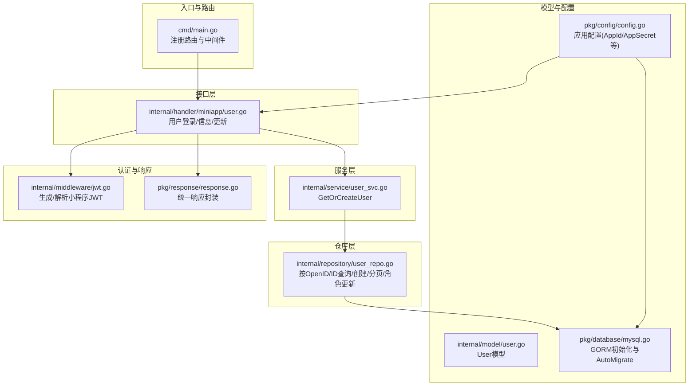
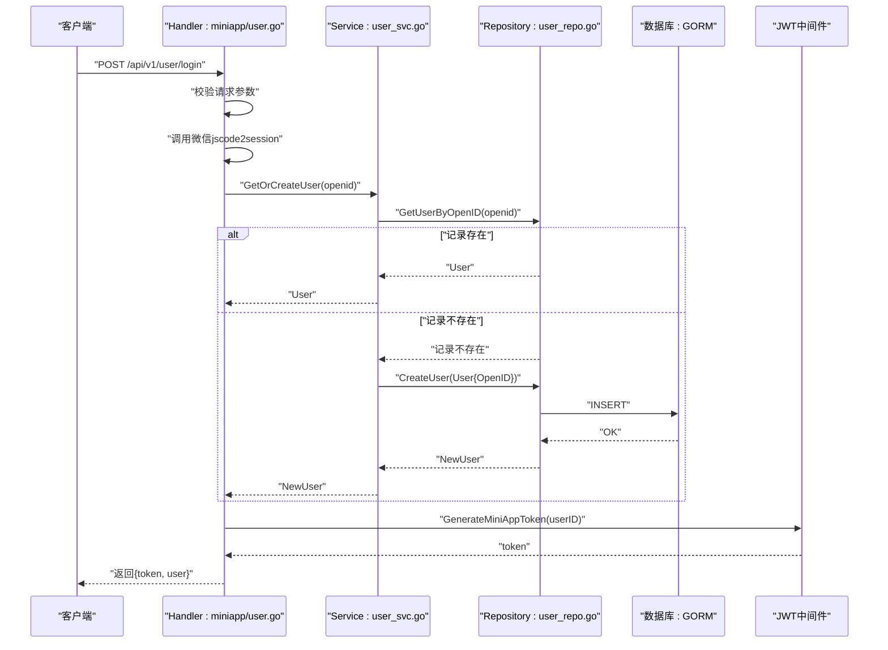
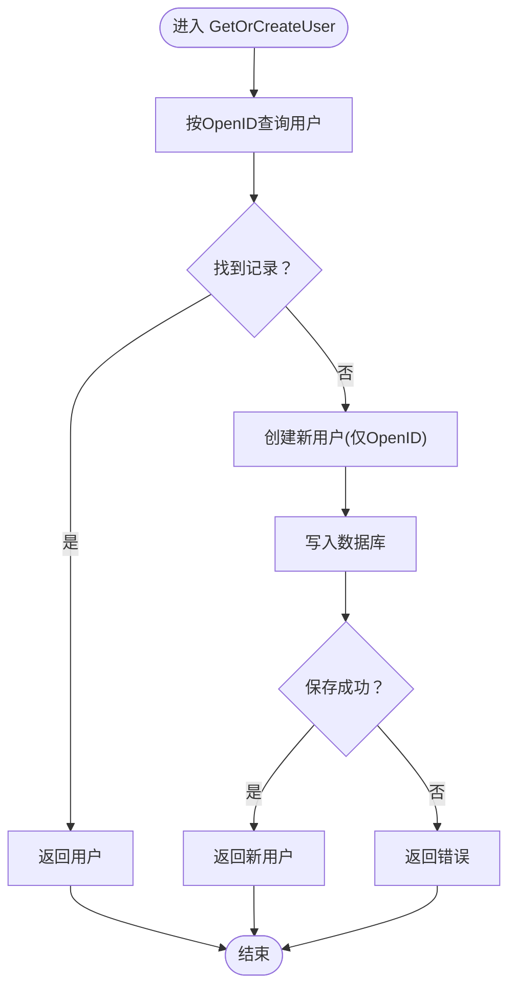
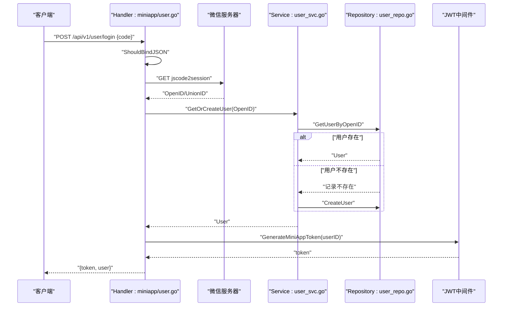
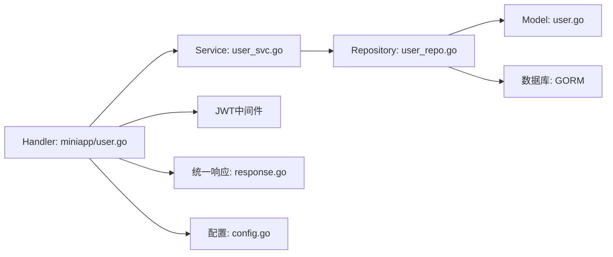
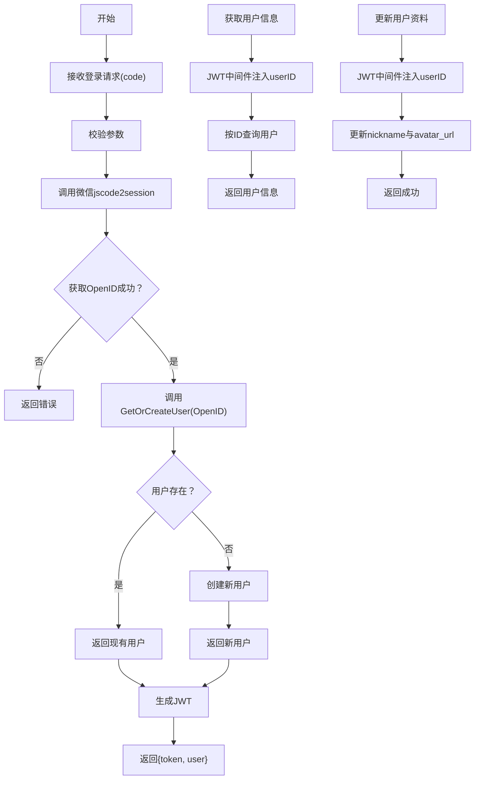

# 用户服务

<cite>
**本文引用的文件**
- [cmd/main.go](file://cmd/main.go)
- [internal/service/user_svc.go](file://internal/service/user_svc.go)
- [internal/repository/user_repo.go](file://internal/repository/user_repo.go)
- [internal/model/user.go](file://internal/model/user.go)
- [internal/handler/miniapp/user.go](file://internal/handler/miniapp/user.go)
- [internal/middleware/jwt.go](file://internal/middleware/jwt.go)
- [pkg/config/config.go](file://pkg/config/config.go)
- [pkg/database/mysql.go](file://pkg/database/mysql.go)
- [pkg/response/response.go](file://pkg/response/response.go)
</cite>

## 目录
1. [简介](#简介)
2. [项目结构](#项目结构)
3. [核心组件](#核心组件)
4. [架构总览](#架构总览)
5. [详细组件分析](#详细组件分析)
6. [依赖分析](#依赖分析)
7. [性能考虑](#性能考虑)
8. [故障排查指南](#故障排查指南)
9. [结论](#结论)
10. [附录](#附录)

## 简介
本文件面向“用户服务”的完整技术文档，聚焦以下目标：
- 解释微信登录场景下的用户查询与创建逻辑（GetOrCreateUser）
- 说明用户状态管理、权限控制与用户信息更新机制
- 描述用户服务与 Repository 层的数据访问模式及与 Handler 的交互
- 给出用户注册、登录、信息更新的完整流程图
- 总结错误处理策略与异常场景
- 说明扩展点与可配置项

## 项目结构
用户服务位于三层架构中的 Service 层，配合 Repository 层进行数据持久化，通过 Handler 层对外提供 HTTP 接口；认证采用 JWT 中间件，配置来自全局配置模块，数据库通过 GORM 初始化并自动迁移。

图表来源
- [cmd/main.go:46-143](file://cmd/main.go#L46-L143)
- [internal/handler/miniapp/user.go:19-115](file://internal/handler/miniapp/user.go#L19-L115)
- [internal/service/user_svc.go:12-27](file://internal/service/user_svc.go#L12-L27)
- [internal/repository/user_repo.go:8-43](file://internal/repository/user_repo.go#L8-L43)
- [internal/model/user.go:6-15](file://internal/model/user.go#L6-L15)
- [pkg/config/config.go:39-96](file://pkg/config/config.go#L39-L96)
- [pkg/database/mysql.go:19-90](file://pkg/database/mysql.go#L19-L90)
- [internal/middleware/jwt.go:26-65](file://internal/middleware/jwt.go#L26-L65)
- [pkg/response/response.go:10-25](file://pkg/response/response.go#L10-L25)

章节来源
- [cmd/main.go:46-143](file://cmd/main.go#L46-L143)
- [internal/handler/miniapp/user.go:19-115](file://internal/handler/miniapp/user.go#L19-L115)

## 核心组件
- 用户服务（Service）：提供微信登录时的“查询或创建”能力，封装用户生命周期关键路径
- 用户仓库（Repository）：封装数据库访问，提供按 OpenID/ID 查询、创建、分页、角色更新等方法
- 用户模型（Model）：定义用户表结构，含 OpenID、UnionID、昵称、头像、角色等字段
- Handler（小程序用户接口）：暴露登录、获取信息、更新资料等接口，调用服务层与仓库层
- JWT 中间件：为小程序用户签发与校验 JWT，注入 userID 到上下文
- 配置模块：提供微信 AppId/AppSecret 等运行时配置
- 数据库初始化：GORM 初始化、自动迁移、默认角色与管理员初始化

章节来源
- [internal/service/user_svc.go:12-27](file://internal/service/user_svc.go#L12-L27)
- [internal/repository/user_repo.go:8-43](file://internal/repository/user_repo.go#L8-L43)
- [internal/model/user.go:6-15](file://internal/model/user.go#L6-L15)
- [internal/handler/miniapp/user.go:19-115](file://internal/handler/miniapp/user.go#L19-L115)
- [internal/middleware/jwt.go:26-65](file://internal/middleware/jwt.go#L26-L65)
- [pkg/config/config.go:39-96](file://pkg/config/config.go#L39-L96)
- [pkg/database/mysql.go:19-90](file://pkg/database/mysql.go#L19-L90)

## 架构总览
用户服务在整体系统中承担“身份识别与用户数据存取”的职责，通过 Handler 接收请求，Service 决策是否需要创建新用户，Repository 执行数据库操作，JWT 提供会话态认证，Response 统一输出格式。

图表来源
- [internal/handler/miniapp/user.go:28-51](file://internal/handler/miniapp/user.go#L28-L51)
- [internal/service/user_svc.go:13-26](file://internal/service/user_svc.go#L13-L26)
- [internal/repository/user_repo.go:9-21](file://internal/repository/user_repo.go#L9-L21)
- [internal/middleware/jwt.go:26-36](file://internal/middleware/jwt.go#L26-L36)

## 详细组件分析

### 用户服务（Service）
- 核心方法：GetOrCreateUser(openid)
  - 若根据 OpenID 查询到用户则直接返回
  - 若记录不存在，则自动创建新用户并返回
  - 对于其他错误（非记录不存在）直接透传
- 错误处理策略：
  - 使用 GORM 错误类型判断“记录不存在”，避免泛化错误导致误判
  - 其他错误原样返回，交由上层 Handler 统一处理
- 复杂度分析：
  - 查询与创建均为单条记录操作，时间复杂度 O(1)，空间复杂度 O(1)

图表来源
- [internal/service/user_svc.go:13-26](file://internal/service/user_svc.go#L13-L26)

章节来源
- [internal/service/user_svc.go:12-27](file://internal/service/user_svc.go#L12-L27)

### 用户仓库（Repository）
- 方法概览：
  - GetUserByOpenID：按 OpenID 查询用户
  - CreateUser：创建用户
  - GetUserByID：按 ID 查询用户
  - ListUsers：分页查询用户列表
  - UpdateUserRole：更新用户角色
- 设计要点：
  - 使用 GORM 原生查询与更新，保持与模型一致的字段映射
  - 分页采用 offset/limit，总数通过 Model().Count 查询
- 复杂度分析：
  - 单条查询/更新为 O(1)
  - 分页查询为 O(n)，n 为页面大小

章节来源
- [internal/repository/user_repo.go:8-43](file://internal/repository/user_repo.go#L8-L43)

### 用户模型（Model）
- 字段说明：
  - ID：主键
  - OpenID：唯一索引，微信 openid
  - UnionID：微信 unionid
  - Nickname：昵称
  - AvatarURL：头像链接
  - Role：角色，默认 0（普通用户），1（领队），2（管理员）
  - CreatedAt：创建时间
- 设计要点：
  - 角色字段用于区分普通用户与管理员，便于后续权限控制扩展
  - OpenID 唯一索引保证微信登录幂等性

章节来源
- [internal/model/user.go:6-15](file://internal/model/user.go#L6-L15)

### Handler（小程序用户接口）
- 登录接口（UserLogin）
  - 参数：code（微信临时登录凭证）
  - 流程：校验参数 -> 调用微信 jscode2session -> 调用服务层 GetOrCreateUser -> 生成 JWT -> 返回 token 与用户信息
  - 错误处理：参数错误、微信登录失败、服务内部错误均通过统一响应返回
- 获取用户信息（GetUserInfo）
  - 通过 JWT 中间件注入的 userID 查询用户详情
- 更新用户资料（UpdateProfile）
  - 通过 JWT 中间件注入的 userID 更新 nickname 与 avatar_url
  - 使用 GORM Updates 执行字段级更新

图表来源
- [internal/handler/miniapp/user.go:28-51](file://internal/handler/miniapp/user.go#L28-L51)
- [internal/service/user_svc.go:13-26](file://internal/service/user_svc.go#L13-L26)
- [internal/repository/user_repo.go:9-21](file://internal/repository/user_repo.go#L9-L21)
- [internal/middleware/jwt.go:26-36](file://internal/middleware/jwt.go#L26-L36)

章节来源
- [internal/handler/miniapp/user.go:19-115](file://internal/handler/miniapp/user.go#L19-L115)

### 权限控制与状态管理
- 用户状态管理：
  - 用户模型包含角色字段（0 普通、1 领队、2 管理员），可通过仓库层 UpdateUserRole 更新
  - 当前 Handler 未直接暴露用户角色更新接口，可在 Admin 接口层进行管理
- 权限控制：
  - JWT 中间件为小程序用户签发 token，注入 userID
  - 后台管理用户有独立的 AdminClaims 与 AdminJWTAuth 中间件，用于后台权限控制
- 安全建议：
  - 可在用户侧增加状态字段（如启用/禁用），在 JWT 中间件中校验用户状态
  - 对敏感字段（如角色）的修改建议通过 Admin 接口并进行权限校验

章节来源
- [internal/repository/user_repo.go:40-43](file://internal/repository/user_repo.go#L40-L43)
- [internal/model/user.go:13](file://internal/model/user.go#L13)
- [internal/middleware/jwt.go:48-65](file://internal/middleware/jwt.go#L48-L65)
- [internal/middleware/jwt.go:95-122](file://internal/middleware/jwt.go#L95-L122)

### 与 Repository 层的数据访问模式
- Service 调用 Repository 的方法进行数据访问，Repository 通过 GORM 操作数据库
- Repository 对外暴露清晰的方法边界，便于单元测试与替换实现
- 数据库初始化在启动阶段完成，包含 AutoMigrate 与默认角色/管理员初始化

章节来源
- [internal/service/user_svc.go:13-26](file://internal/service/user_svc.go#L13-L26)
- [internal/repository/user_repo.go:8-43](file://internal/repository/user_repo.go#L8-L43)
- [pkg/database/mysql.go:19-90](file://pkg/database/mysql.go#L19-L90)

## 依赖分析
- 组件耦合：
  - Handler 依赖 Service 与 JWT 中间件
  - Service 依赖 Repository
  - Repository 依赖数据库初始化与模型
  - Handler 依赖统一响应封装
- 外部依赖：
  - 微信 jscode2session 接口用于换取 openid
  - GORM 作为 ORM 框架
  - Gin 作为 HTTP 框架
  - JWT 用于小程序用户认证

图表来源
- [internal/handler/miniapp/user.go:19-115](file://internal/handler/miniapp/user.go#L19-L115)
- [internal/service/user_svc.go:12-27](file://internal/service/user_svc.go#L12-L27)
- [internal/repository/user_repo.go:8-43](file://internal/repository/user_repo.go#L8-L43)
- [internal/model/user.go:6-15](file://internal/model/user.go#L6-L15)
- [internal/middleware/jwt.go:26-65](file://internal/middleware/jwt.go#L26-L65)
- [pkg/response/response.go:10-25](file://pkg/response/response.go#L10-L25)
- [pkg/config/config.go:39-96](file://pkg/config/config.go#L39-L96)
- [pkg/database/mysql.go:19-90](file://pkg/database/mysql.go#L19-L90)

## 性能考虑
- 查询与创建路径：
  - GetOrCreateUser 为单条记录操作，数据库层面使用唯一索引（OpenID）优化查询
- 分页与批量：
  - ListUsers 使用 offset/limit，建议结合合适的索引与分页策略，避免大偏移量带来的性能问题
- JWT 与网络：
  - 登录流程涉及微信服务器调用，建议增加超时与重试策略
- 数据库初始化：
  - AutoMigrate 在启动时执行，建议在生产环境谨慎使用，确保迁移脚本可控

[本节为通用性能建议，不直接分析具体文件]

## 故障排查指南
- 常见错误与处理：
  - 参数错误：Handler 对请求参数进行绑定校验，返回统一错误响应
  - 微信登录失败：jscode2session 返回错误码或错误信息，Handler 返回统一错误响应
  - 服务器内部错误：GetOrCreateUser 或 CreateUser 失败，返回统一错误响应
  - 记录不存在：Repository 查询返回记录不存在错误，Service 区分处理并创建新用户
- 日志与可观测性：
  - 数据库连接失败会进行多次重试并记录日志
  - WebSocket 场景下升级失败会记录错误
- 建议：
  - 对外部依赖（微信）增加超时与熔断
  - 对关键路径增加埋点与链路追踪

章节来源
- [internal/handler/miniapp/user.go:32-46](file://internal/handler/miniapp/user.go#L32-L46)
- [internal/service/user_svc.go:15-24](file://internal/service/user_svc.go#L15-L24)
- [pkg/database/mysql.go:25-37](file://pkg/database/mysql.go#L25-L37)
- [internal/handler/common.go:48-91](file://internal/handler/common.go#L48-L91)

## 结论
用户服务以简洁的“查询或创建”为核心，结合 JWT 认证与统一响应，实现了微信登录与用户信息管理的基础能力。通过清晰的分层与依赖关系，具备良好的可维护性与扩展性。后续可在用户状态、角色权限、以及对外部依赖的健壮性方面进一步增强。

[本节为总结性内容，不直接分析具体文件]

## 附录

### 用户注册/登录/信息更新流程图

图表来源
- [internal/handler/miniapp/user.go:28-51](file://internal/handler/miniapp/user.go#L28-L51)
- [internal/handler/miniapp/user.go:83-115](file://internal/handler/miniapp/user.go#L83-L115)
- [internal/service/user_svc.go:13-26](file://internal/service/user_svc.go#L13-L26)

### 扩展点与自定义配置
- 扩展点：
  - 用户状态字段：可在模型中增加状态字段并在 JWT 中间件中校验
  - 用户角色扩展：通过 UpdateUserRole 与 Admin 接口进行角色管理
  - 外部依赖增强：对微信登录增加超时、重试、熔断策略
- 自定义配置：
  - 微信 AppId/AppSecret：通过配置模块加载
  - 数据库连接参数：主机、端口、用户名、密码、库名
  - 服务端口与环境：服务器监听端口与运行环境
  - 其他第三方服务 Key：如高德地图、DeepSeek 等（与用户服务无直接关联）

章节来源
- [pkg/config/config.go:39-96](file://pkg/config/config.go#L39-L96)
- [pkg/database/mysql.go:19-90](file://pkg/database/mysql.go#L19-L90)
- [internal/repository/user_repo.go:40-43](file://internal/repository/user_repo.go#L40-L43)