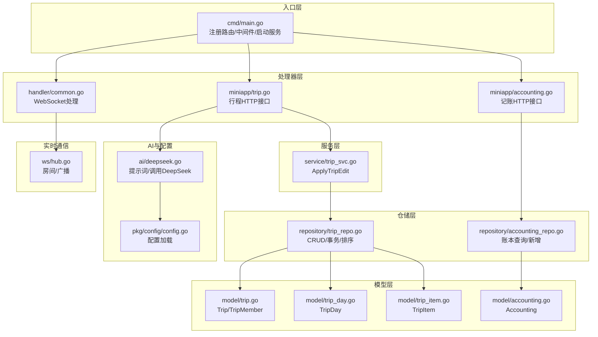
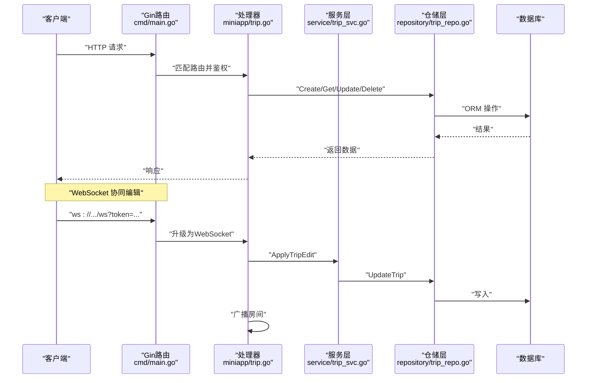
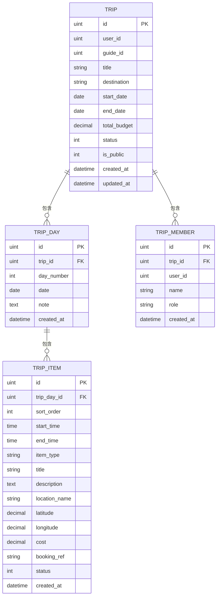
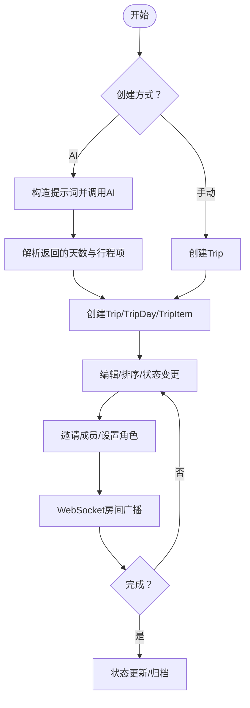
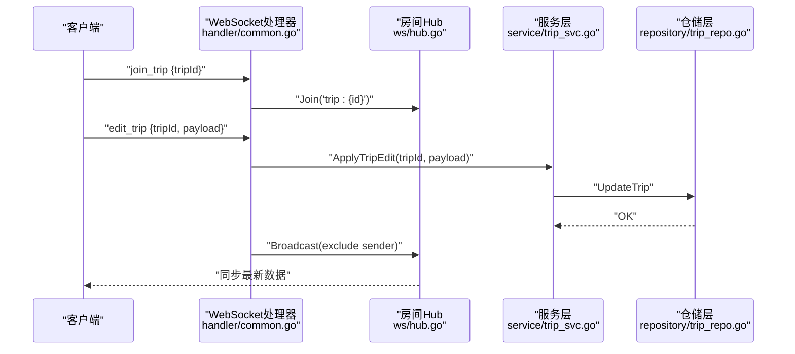
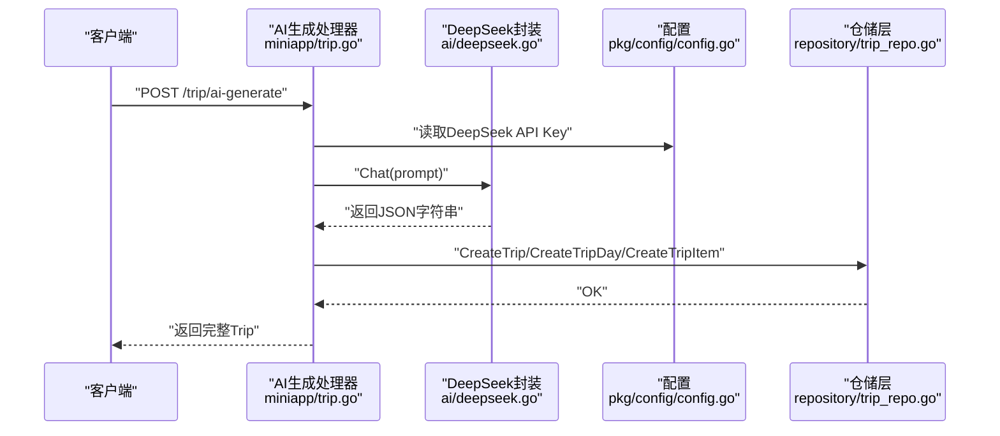
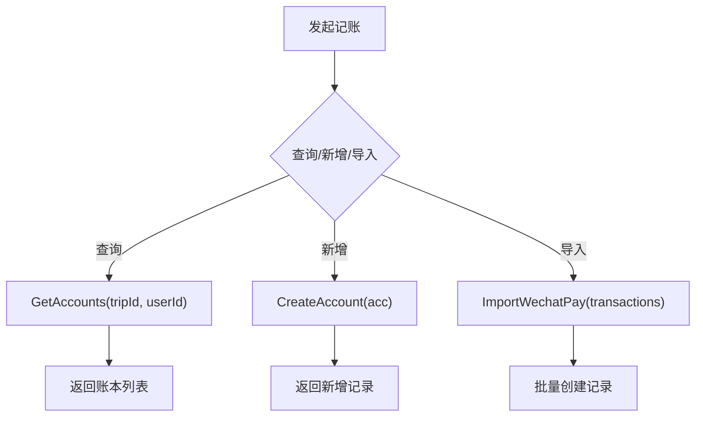
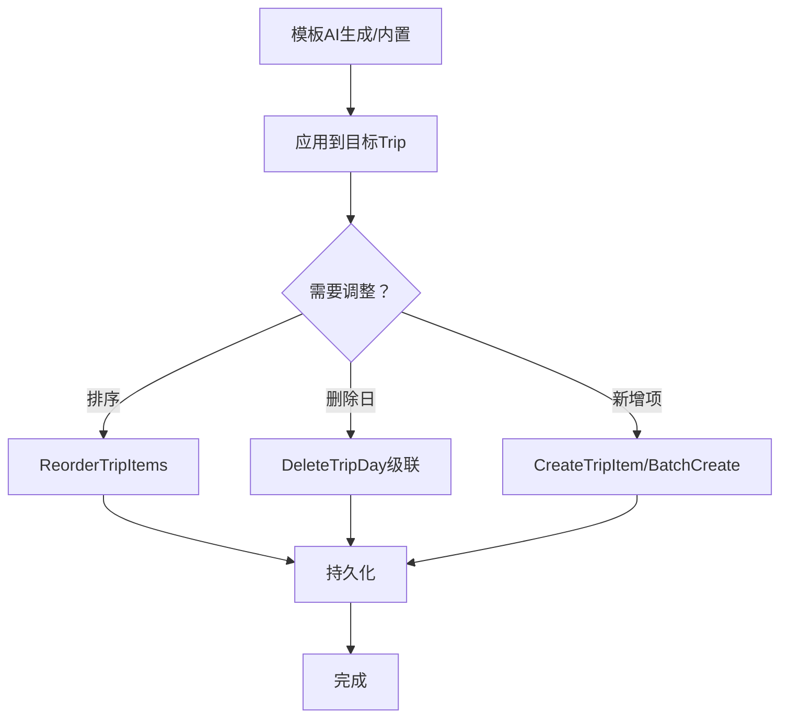
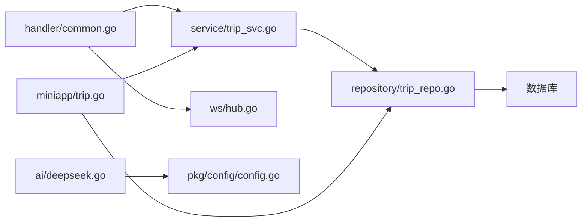

# 行程服务

<cite>
**本文引用的文件**
- [main.go](file://cmd/main.go)
- [trip.go](file://internal/handler/miniapp/trip.go)
- [common.go](file://internal/handler/common.go)
- [trip_svc.go](file://internal/service/trip_svc.go)
- [trip_repo.go](file://internal/repository/trip_repo.go)
- [trip.go](file://internal/model/trip.go)
- [trip_day.go](file://internal/model/trip_day.go)
- [trip_item.go](file://internal/model/trip_item.go)
- [accounting.go](file://internal/model/accounting.go)
- [accounting_repo.go](file://internal/repository/accounting_repo.go)
- [accounting.go](file://internal/handler/miniapp/accounting.go)
- [deepseek.go](file://internal/ai/deepseek.go)
- [config.go](file://pkg/config/config.go)
- [hub.go](file://internal/ws/hub.go)
</cite>

## 目录
1. [简介](#简介)
2. [项目结构](#项目结构)
3. [核心组件](#核心组件)
4. [架构总览](#架构总览)
5. [详细组件分析](#详细组件分析)
6. [依赖分析](#依赖分析)
7. [性能考虑](#性能考虑)
8. [故障排查指南](#故障排查指南)
9. [结论](#结论)
10. [附录](#附录)

## 简介
本文件系统性梳理“行程服务”的设计与实现，覆盖以下主题：
- 行程全生命周期：创建、编辑、协作、管理
- 智能行程生成：基于AI的提示词工程与调用流程
- 行程模板与动态调整：通过日程与行程项的层级结构实现灵活编排
- 数据模型关系：Trip → TripDay → TripItem 的树形结构与成员关系
- 协作编辑与实时同步：WebSocket 房间与广播机制
- 预算管理与记账：费用分摊与账本查询
- AI智能推荐：结合目的地、天数与标签生成行程

## 项目结构
后端采用分层架构：入口层负责路由注册；处理器层对接业务；服务层封装业务规则；仓储层抽象数据库访问；模型层定义数据结构；AI与WS模块提供外部能力与实时通信。

图表来源
- [main.go:46-146](file://cmd/main.go#L46-L146)
- [trip.go:16-92](file://internal/handler/miniapp/trip.go#L16-L92)
- [accounting.go:14-55](file://internal/handler/miniapp/accounting.go#L14-L55)
- [common.go:48-91](file://internal/handler/common.go#L48-L91)
- [trip_svc.go:7-18](file://internal/service/trip_svc.go#L7-L18)
- [trip_repo.go:12-137](file://internal/repository/trip_repo.go#L12-L137)
- [trip.go:10-37](file://internal/model/trip.go#L10-L37)
- [trip_day.go:5-15](file://internal/model/trip_day.go#L5-L15)
- [trip_item.go:5-22](file://internal/model/trip_item.go#L5-L22)
- [accounting.go:5-16](file://internal/model/accounting.go#L5-L16)
- [deepseek.go:13-52](file://internal/ai/deepseek.go#L13-L52)
- [config.go:61-100](file://pkg/config/config.go#L61-L100)
- [hub.go:10-56](file://internal/ws/hub.go#L10-L56)

章节来源
- [main.go:31-151](file://cmd/main.go#L31-L151)

## 核心组件
- 行程模型与关系
  - Trip：行程主体，包含创建者、目的地、起止日期、预算、状态、公开性以及一对多关联的 TripDay 和 TripMember
  - TripDay：按天组织的行程片段，包含日期与备注，并包含多条 TripItem
  - TripItem：最小执行单元，包含时间、类型、地点、成本、状态等
- 仓储与服务
  - 仓储提供 CRUD、批量创建、重排序、事务删除等能力
  - 服务层封装 ApplyTripEdit，用于持久化 WebSocket 编辑消息
- 处理器与路由
  - 提供手动创建、AI生成、详情查询、更新、删除日/项、邀请/移除成员等接口
  - WebSocket 路由支持加入房间与编辑广播
- 记账模块
  - 提供账本查询、新增、微信支付导入接口
- AI 与配置
  - DeepSeek 提示词模板与调用；配置从环境变量加载

章节来源
- [trip.go:10-37](file://internal/model/trip.go#L10-L37)
- [trip_day.go:5-15](file://internal/model/trip_day.go#L5-L15)
- [trip_item.go:5-22](file://internal/model/trip_item.go#L5-L22)
- [trip_repo.go:12-137](file://internal/repository/trip_repo.go#L12-L137)
- [trip_svc.go:7-18](file://internal/service/trip_svc.go#L7-L18)
- [trip.go:16-328](file://internal/handler/miniapp/trip.go#L16-L328)
- [accounting.go:14-85](file://internal/handler/miniapp/accounting.go#L14-L85)
- [deepseek.go:13-52](file://internal/ai/deepseek.go#L13-L52)
- [config.go:61-100](file://pkg/config/config.go#L61-L100)

## 架构总览
下图展示从客户端到数据库的端到端流程，涵盖 HTTP 请求、WebSocket 协同编辑、AI 生成与仓储持久化。

图表来源
- [main.go:46-146](file://cmd/main.go#L46-L146)
- [trip.go:16-328](file://internal/handler/miniapp/trip.go#L16-L328)
- [trip_svc.go:7-18](file://internal/service/trip_svc.go#L7-L18)
- [trip_repo.go:12-37](file://internal/repository/trip_repo.go#L12-L37)
- [common.go:48-91](file://internal/handler/common.go#L48-L91)

## 详细组件分析

### 数据模型与关系
- 模型关系图
  - Trip 与 TripDay：一对多（Trip → Days）
  - TripDay 与 TripItem：一对多（TripDay → Items）
  - Trip 与 TripMember：一对多（Trip → Members）

图表来源
- [trip.go:10-37](file://internal/model/trip.go#L10-L37)
- [trip_day.go:5-15](file://internal/model/trip_day.go#L5-L15)
- [trip_item.go:5-22](file://internal/model/trip_item.go#L5-L22)

章节来源
- [trip.go:10-37](file://internal/model/trip.go#L10-L37)
- [trip_day.go:5-15](file://internal/model/trip_day.go#L5-L15)
- [trip_item.go:5-22](file://internal/model/trip_item.go#L5-L22)

### 行程生命周期管理
- 生命周期阶段
  - 创建：手动创建或AI生成
  - 编辑：逐日/逐项编辑，支持排序与状态变更
  - 协作：邀请成员，房间内实时同步
  - 管理：成员角色控制、公开性管理
  - 完成：状态流转与归档
- 关键流程
  - AI生成：构造提示词 → 调用DeepSeek → 解析返回 → 创建Trip/TripDay/TripItem → 返回完整数据
  - 手动创建：校验参数 → 写入Trip → 返回结果
  - 协同编辑：加入房间 → 接收编辑消息 → 服务层持久化 → 广播给房间内其他连接

图表来源
- [trip.go:16-92](file://internal/handler/miniapp/trip.go#L16-L92)
- [trip_repo.go:12-119](file://internal/repository/trip_repo.go#L12-L119)
- [trip_svc.go:7-18](file://internal/service/trip_svc.go#L7-L18)
- [common.go:74-88](file://internal/handler/common.go#L74-L88)

章节来源
- [trip.go:16-92](file://internal/handler/miniapp/trip.go#L16-L92)
- [trip_repo.go:12-119](file://internal/repository/trip_repo.go#L12-L119)
- [trip_svc.go:7-18](file://internal/service/trip_svc.go#L7-L18)
- [common.go:74-88](file://internal/handler/common.go#L74-L88)

### 协作编辑、实时同步与冲突处理
- 房间模型
  - 使用 Hub 维护 “trip:<id>” 房间，存储连接集合
  - 支持加入/离开/广播，可选择排除发送者
- 协作流程
  - 客户端通过 ws://.../ws?token=... 连接
  - 发送 join_trip 加入房间
  - 发送 edit_trip 持久化并广播
  - 服务层 ApplyTripEdit 过滤敏感字段后更新
- 冲突处理建议
  - 基于服务层统一更新策略（过滤字段）降低并发写入风险
  - 前端可引入乐观锁版本号或时间戳以检测冲突
  - 广播最新状态，客户端局部回滚/合并

图表来源
- [common.go:74-88](file://internal/handler/common.go#L74-L88)
- [hub.go:23-55](file://internal/ws/hub.go#L23-L55)
- [trip_svc.go:7-18](file://internal/service/trip_svc.go#L7-L18)
- [trip_repo.go:29-32](file://internal/repository/trip_repo.go#L29-L32)

章节来源
- [common.go:48-91](file://internal/handler/common.go#L48-L91)
- [hub.go:10-56](file://internal/ws/hub.go#L10-L56)
- [trip_svc.go:7-18](file://internal/service/trip_svc.go#L7-L18)

### 智能行程生成与模板系统
- 提示词模板
  - 模板包含目的地、天数、偏好标签，约束输出严格JSON结构
- 调用流程
  - 构造提示词 → 读取配置中的DeepSeek API Key → 发送HTTP请求 → 解析返回 → 创建Trip/TripDay/TripItem → 返回完整行程
- 模板系统
  - 可扩展提示词模板，支持不同目的地风格、预算区间、活动类型偏好
  - 返回的天数与行程项结构可映射到 TripDay/TripItem 的字段

图表来源
- [trip.go:23-92](file://internal/handler/miniapp/trip.go#L23-L92)
- [deepseek.go:13-52](file://internal/ai/deepseek.go#L13-L52)
- [config.go:95-96](file://pkg/config/config.go#L95-L96)
- [trip_repo.go:12-101](file://internal/repository/trip_repo.go#L12-L101)

章节来源
- [trip.go:23-92](file://internal/handler/miniapp/trip.go#L23-L92)
- [deepseek.go:13-52](file://internal/ai/deepseek.go#L13-L52)
- [config.go:95-96](file://pkg/config/config.go#L95-L96)

### 预算管理、费用分摊与记账
- 数据模型
  - Accounting：记录分类、金额、备注、交易单号、消费时间等
- 功能接口
  - 获取账本：按行程与用户维度查询
  - 新增记账：创建一条记账条目
  - 导入微信支付：批量创建记账条目（示例）
- 费用分摊建议
  - 可在模型中增加分摊比例字段，或通过独立分摊表实现
  - 记账与行程预算联动：统计行程总支出与剩余预算

图表来源
- [accounting.go:14-85](file://internal/handler/miniapp/accounting.go#L14-L85)
- [accounting_repo.go:8-18](file://internal/repository/accounting_repo.go#L8-L18)
- [accounting.go:5-16](file://internal/model/accounting.go#L5-L16)

章节来源
- [accounting.go:14-85](file://internal/handler/miniapp/accounting.go#L14-L85)
- [accounting_repo.go:8-18](file://internal/repository/accounting_repo.go#L8-L18)
- [accounting.go:5-16](file://internal/model/accounting.go#L5-L16)

### 行程模板与动态调整机制
- 模板系统
  - 基于AI生成的天数与行程项作为模板，可直接复用
  - 可扩展“热门模板”库，按目的地/类型预设
- 动态调整
  - 支持批量创建行程项、按ID序列重排序
  - 支持删除行程日（级联删除行程项），保障数据一致性
- 权限控制
  - 行程更新仅允许创建者操作
  - 成员邀请/移除与角色变更由仓储层提供

图表来源
- [trip_repo.go:103-119](file://internal/repository/trip_repo.go#L103-L119)
- [trip_repo.go:76-84](file://internal/repository/trip_repo.go#L76-L84)
- [trip_repo.go:88-101](file://internal/repository/trip_repo.go#L88-L101)
- [trip.go:140-169](file://internal/handler/miniapp/trip.go#L140-L169)

章节来源
- [trip_repo.go:103-119](file://internal/repository/trip_repo.go#L103-L119)
- [trip_repo.go:76-84](file://internal/repository/trip_repo.go#L76-L84)
- [trip_repo.go:88-101](file://internal/repository/trip_repo.go#L88-L101)
- [trip.go:140-169](file://internal/handler/miniapp/trip.go#L140-L169)

## 依赖分析
- 组件耦合
  - 处理器依赖服务层与仓储层，保持业务与数据分离
  - 服务层仅依赖仓储接口，便于替换实现
  - WebSocket 依赖 Hub 与服务层，解耦通信与业务
- 外部依赖
  - AI：DeepSeek Chat API
  - 配置：环境变量注入
  - 数据库：GORM ORM
  - 实时通信：gorilla/websocket

图表来源
- [trip.go:16-328](file://internal/handler/miniapp/trip.go#L16-L328)
- [trip_svc.go:7-18](file://internal/service/trip_svc.go#L7-L18)
- [trip_repo.go:12-137](file://internal/repository/trip_repo.go#L12-L137)
- [common.go:48-91](file://internal/handler/common.go#L48-L91)
- [hub.go:10-56](file://internal/ws/hub.go#L10-L56)
- [deepseek.go:18-52](file://internal/ai/deepseek.go#L18-L52)
- [config.go:61-100](file://pkg/config/config.go#L61-L100)

章节来源
- [trip.go:16-328](file://internal/handler/miniapp/trip.go#L16-L328)
- [trip_svc.go:7-18](file://internal/service/trip_svc.go#L7-L18)
- [trip_repo.go:12-137](file://internal/repository/trip_repo.go#L12-L137)
- [common.go:48-91](file://internal/handler/common.go#L48-L91)
- [hub.go:10-56](file://internal/ws/hub.go#L10-L56)
- [deepseek.go:18-52](file://internal/ai/deepseek.go#L18-L52)
- [config.go:61-100](file://pkg/config/config.go#L61-L100)

## 性能考虑
- 预加载策略
  - 获取行程详情时预加载 Days 与 Members，并对 Items 按排序字段升序排列，减少N+1查询
- 事务与批量操作
  - 删除行程日使用事务先删子项再删日，保证一致性
  - 批量创建行程项减少多次往返
- 广播优化
  - 广播时可排除发送者，避免重复渲染
- 缓存与索引
  - 对 DeletedAt 建立索引，软删除查询更高效
  - 可在高频查询字段上建立索引（如 Trip.UserID、TripDay.TripID）

章节来源
- [trip_repo.go:17-27](file://internal/repository/trip_repo.go#L17-L27)
- [trip_repo.go:76-84](file://internal/repository/trip_repo.go#L76-L84)
- [trip_repo.go:103-106](file://internal/repository/trip_repo.go#L103-L106)
- [trip.go:25-26](file://internal/model/trip.go#L25-L26)

## 故障排查指南
- WebSocket 连接失败
  - 检查 token 是否有效，确认 JWT 中包含必要字段
  - 确认 ws 升级是否成功，查看服务端日志
- 协同编辑未生效
  - 确认已加入房间（join_trip）
  - 检查 edit_trip 消息格式与 tripId
  - 服务层 ApplyTripEdit 已过滤 id、user_id、created_at 字段，避免误更新
- AI 生成失败
  - 检查 DEEPSEEK_API_KEY 是否正确配置
  - 确认返回 JSON 结构符合预期
- 记账导入异常
  - 确认请求体包含 tripId 与 transactions 数组
  - 检查数据库连接与权限

章节来源
- [common.go:50-55](file://internal/handler/common.go#L50-L55)
- [common.go:74-88](file://internal/handler/common.go#L74-L88)
- [trip_svc.go:13-17](file://internal/service/trip_svc.go#L13-L17)
- [config.go:95-96](file://pkg/config/config.go#L95-L96)
- [accounting.go:64-84](file://internal/handler/miniapp/accounting.go#L64-L84)

## 结论
本行程服务以清晰的分层架构实现了从创建、编辑、协作到管理的完整闭环。通过 GORM 的预加载与事务机制保障数据一致性，借助 WebSocket 实现多人实时协同，利用 AI 提示词模板实现智能行程生成。记账模块提供了基础的费用记录与导入能力。未来可在冲突解决、模板复用、预算分摊等方面进一步增强。

## 附录
- 关键接口概览（节选）
  - 行程：创建、AI生成、详情、更新、删除日/项、邀请/移除成员
  - 记账：查询账本、新增、导入微信支付
  - WebSocket：加入房间、编辑广播
- 配置项（关键）
  - DEEPSEEK_API_KEY：AI调用密钥
  - AMAP_KEY：高德天气API密钥
  - SERVER_PORT：服务监听端口

章节来源
- [trip.go:16-328](file://internal/handler/miniapp/trip.go#L16-L328)
- [accounting.go:14-85](file://internal/handler/miniapp/accounting.go#L14-L85)
- [common.go:48-91](file://internal/handler/common.go#L48-L91)
- [config.go:95-96](file://pkg/config/config.go#L95-L96)