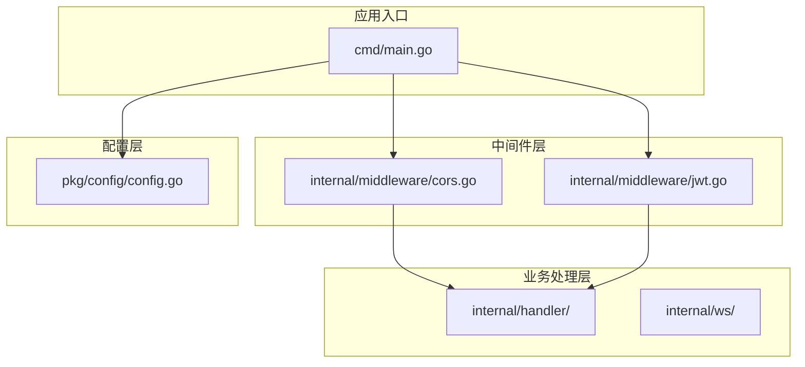
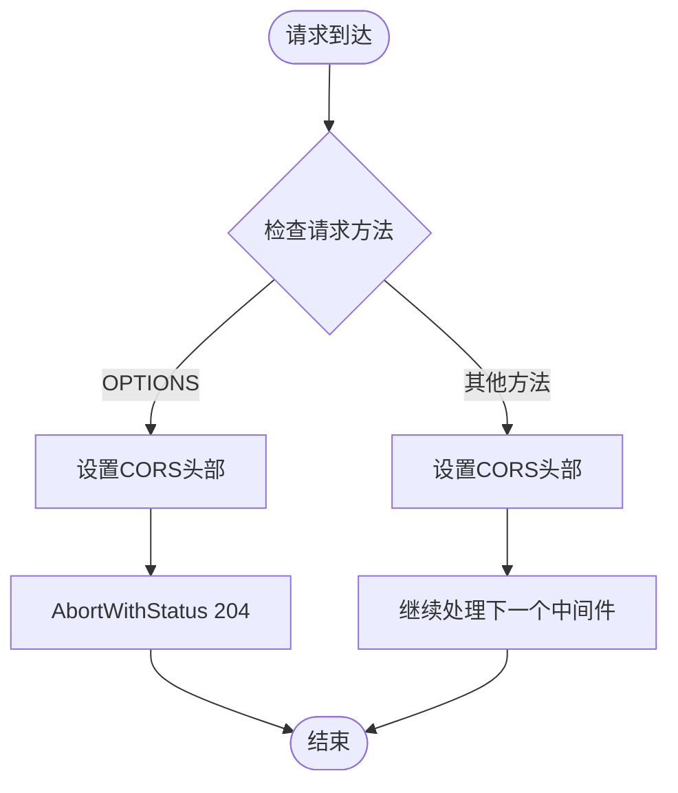
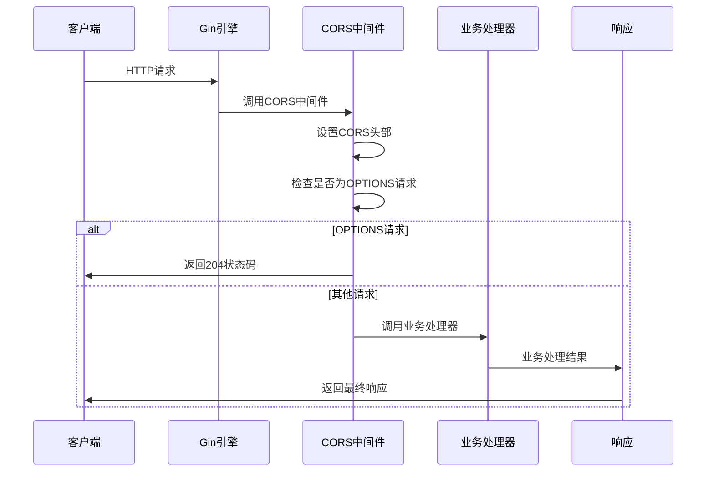
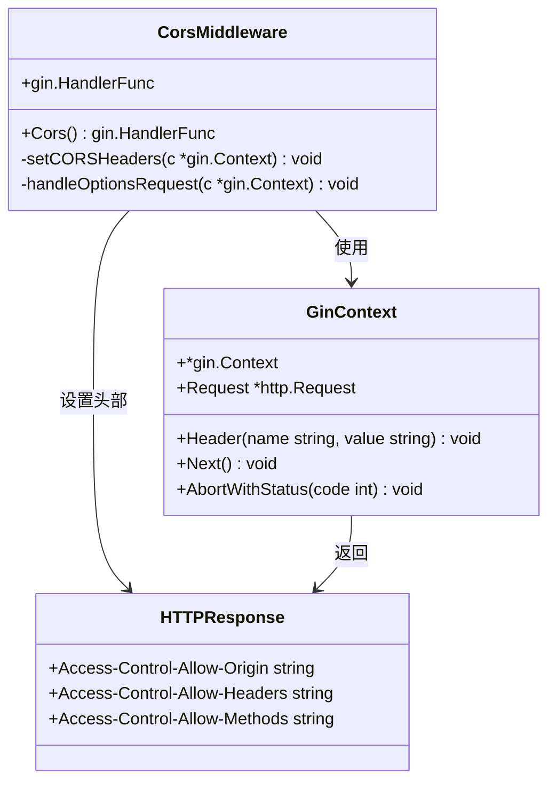
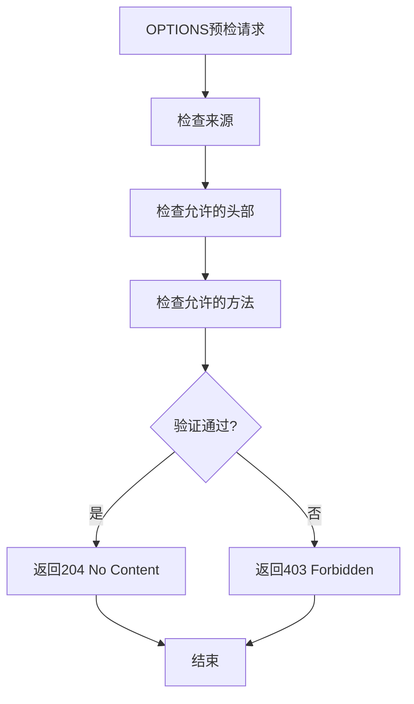
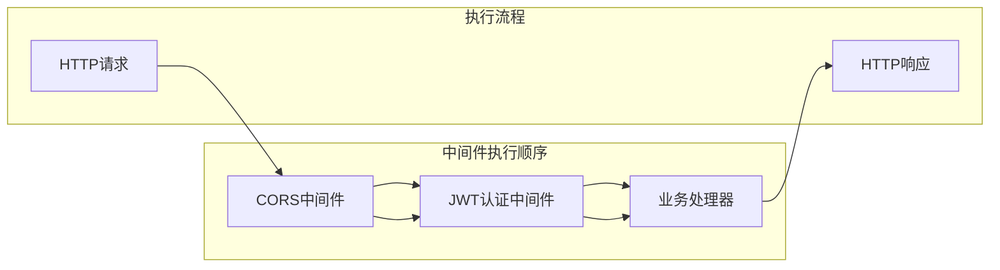
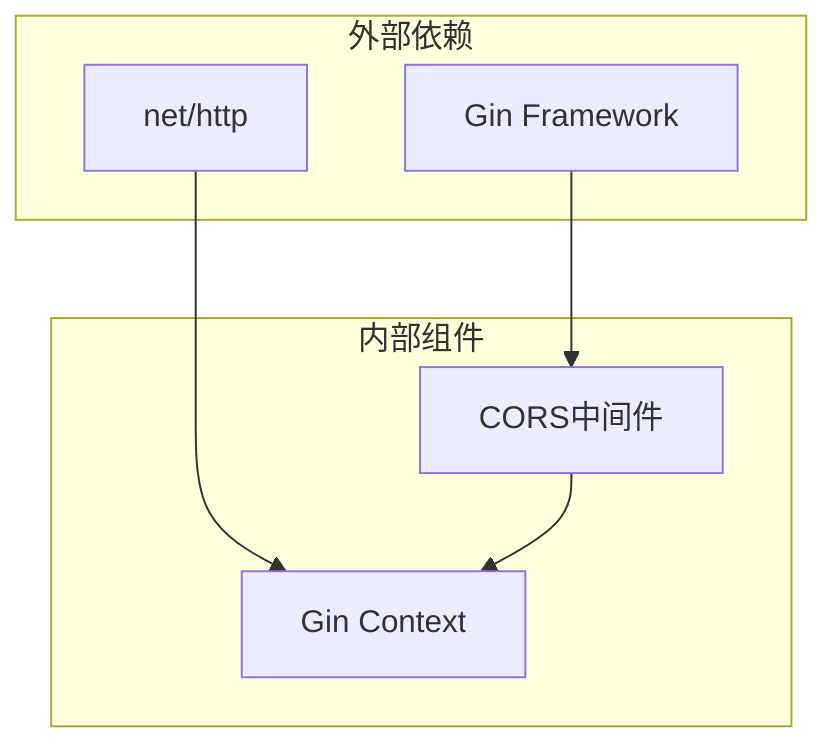

# CORS跨域中间件

<cite>
**本文档引用的文件**
- [cors.go](file://internal/middleware/cors.go)
- [main.go](file://cmd/main.go)
- [config.go](file://pkg/config/config.go)
- [jwt.go](file://internal/middleware/jwt.go)
- [common.go](file://internal/handler/common.go)
- [README.md](file://README.md)
</cite>

## 目录
1. [简介](#简介)
2. [项目结构](#项目结构)
3. [核心组件](#核心组件)
4. [架构概览](#架构概览)
5. [详细组件分析](#详细组件分析)
6. [依赖关系分析](#依赖关系分析)
7. [性能考虑](#性能考虑)
8. [故障排除指南](#故障排除指南)
9. [结论](#结论)

## 简介

CORS（跨域资源共享）是现代Web应用中不可或缺的安全机制。本文档深入解析该Go项目的CORS跨域中间件实现，涵盖浏览器同源策略、CORS工作机制、中间件实现原理以及最佳实践。

### 浏览器同源策略

浏览器出于安全考虑实施了严格的同源策略，要求协议、域名和端口完全相同才被视为同源。当不同源的资源进行交互时，浏览器会触发CORS机制来控制跨域访问。

### CORS基本概念

CORS通过HTTP响应头来控制跨域访问权限，主要涉及以下关键头部：
- `Access-Control-Allow-Origin`: 指定允许访问的源
- `Access-Control-Allow-Headers`: 指定允许的请求头
- `Access-Control-Allow-Methods`: 指定允许的HTTP方法
- `Access-Control-Max-Age`: 预检请求缓存时间

## 项目结构

该项目采用典型的Go微服务架构，CORS中间件位于`internal/middleware/`目录下，与业务逻辑分离，体现了良好的模块化设计。

**图表来源**
- [main.go:31-42](file://cmd/main.go#L31-L42)
- [cors.go:10-22](file://internal/middleware/cors.go#L10-L22)
- [config.go:57-100](file://pkg/config/config.go#L57-L100)

**章节来源**
- [main.go:1-152](file://cmd/main.go#L1-152)
- [cors.go:1-23](file://internal/middleware/cors.go#L1-L23)
- [config.go:1-129](file://pkg/config/config.go#L1-L129)

## 核心组件

### CORS中间件实现

该CORS中间件采用全局注册的方式，为整个应用提供跨域支持。其核心功能包括：

#### 主要特性
1. **全局生效**: 在应用启动时注册，对所有路由生效
2. **灵活配置**: 支持自定义允许的源、方法和头部
3. **预检处理**: 正确处理OPTIONS预检请求
4. **简洁高效**: 最小化实现，避免不必要的性能开销

#### 关键实现细节

**图表来源**
- [cors.go:11-22](file://internal/middleware/cors.go#L11-L22)

**章节来源**
- [cors.go:10-22](file://internal/middleware/cors.go#L10-L22)

## 架构概览

该系统的CORS架构体现了中间件模式的最佳实践，通过统一的中间件层处理横切关注点。

**图表来源**
- [main.go:40-42](file://cmd/main.go#L40-L42)
- [cors.go:11-22](file://internal/middleware/cors.go#L11-L22)

## 详细组件分析

### CORS中间件类图

**图表来源**
- [cors.go:10-22](file://internal/middleware/cors.go#L10-L22)

### CORS头部详解

#### Access-Control-Allow-Origin
- **作用**: 指定允许访问的源
- **当前实现**: 使用通配符"*"允许所有源访问
- **安全考虑**: 生产环境中建议指定具体域名

#### Access-Control-Allow-Headers  
- **作用**: 指定允许的请求头
- **当前实现**: 允许"Content-Type, Authorization"头部
- **扩展建议**: 根据实际业务需要添加自定义头部

#### Access-Control-Allow-Methods
- **作用**: 指定允许的HTTP方法
- **当前实现**: 允许GET, POST, PUT, DELETE, OPTIONS
- **最佳实践**: 仅允许实际使用的HTTP方法

#### OPTIONS预检请求处理

**图表来源**
- [cors.go:16-19](file://internal/middleware/cors.go#L16-L19)

**章节来源**
- [cors.go:10-22](file://internal/middleware/cors.go#L10-L22)

### 与其他中间件的关系

CORS中间件与JWT认证中间件共同构成了应用的安全基础设施：

**图表来源**
- [main.go:40-42](file://cmd/main.go#L40-L42)
- [jwt.go:48-65](file://internal/middleware/jwt.go#L48-L65)

**章节来源**
- [main.go:40-42](file://cmd/main.go#L40-L42)
- [jwt.go:48-65](file://internal/middleware/jwt.go#L48-L65)

## 依赖关系分析

### 外部依赖

该CORS中间件依赖于Gin框架提供的中间件机制：

**图表来源**
- [cors.go:4-8](file://internal/middleware/cors.go#L4-L8)

### 内部耦合度

CORS中间件与业务层解耦，通过Gin的中间件机制实现：

- **低耦合**: 不依赖特定业务逻辑
- **高内聚**: 专注于跨域处理
- **可复用**: 可在多个项目中重复使用

**章节来源**
- [cors.go:4-8](file://internal/middleware/cors.go#L4-L8)

## 性能考虑

### 中间件性能影响

CORS中间件作为全局中间件，对每个请求都有轻微的性能开销：

1. **内存开销**: 每个请求都会设置HTTP头部
2. **CPU开销**: 简单的字符串比较和头部设置操作
3. **网络开销**: 增加少量HTTP响应头大小

### 优化建议

1. **避免不必要的头部设置**: 确保只在必要时设置头部
2. **合理使用通配符**: 生产环境中避免使用"*"通配符
3. **预检请求缓存**: 利用`Access-Control-Max-Age`减少预检频率

## 故障排除指南

### 常见CORS问题及解决方案

#### 1. 预检请求失败

**症状**: 浏览器发送OPTIONS预检请求但返回404或405

**原因分析**:
- 路由未正确配置OPTIONS方法
- CORS中间件未正确处理预检请求

**解决方案**:
- 确保CORS中间件在路由注册之前调用
- 检查路由配置是否包含OPTIONS方法

#### 2. 认证头部被拒绝

**症状**: Authorization头部在CORS中被拒绝

**原因分析**:
- `Access-Control-Allow-Headers`未包含Authorization
- 预检请求未正确处理

**解决方案**:
- 在CORS中间件中添加Authorization头部支持
- 确保预检请求能够正确通过

#### 3. 生产环境跨域问题

**症状**: 生产环境中跨域访问失败

**原因分析**:
- 使用了通配符"*"但实际需要指定具体域名
- 未正确配置允许的来源

**解决方案**:
- 将通配符替换为具体的域名
- 根据实际部署环境动态配置

### 调试技巧

1. **浏览器开发者工具**: 查看Network标签中的CORS相关请求
2. **服务器日志**: 检查CORS中间件的执行情况
3. **预检请求测试**: 使用curl测试OPTIONS预检请求

**章节来源**
- [cors.go:16-19](file://internal/middleware/cors.go#L16-L19)

## 结论

该CORS跨域中间件实现了简洁而有效的跨域支持，通过全局注册的方式为整个应用提供统一的跨域处理能力。虽然当前实现较为简单，但为后续的功能扩展奠定了良好的基础。

### 最佳实践建议

1. **生产环境安全配置**: 避免使用通配符，指定具体的允许域名
2. **最小权限原则**: 仅允许必要的HTTP方法和请求头
3. **预检请求优化**: 合理设置缓存时间，减少预检请求频率
4. **监控和日志**: 添加CORS相关的监控和日志记录

### 扩展方向

1. **动态配置**: 支持从配置文件或环境变量动态配置CORS参数
2. **白名单机制**: 实现更精细的来源控制
3. **安全增强**: 添加更多的安全检查和防护措施
4. **性能优化**: 实现更高效的头部设置和预检请求处理

该中间件为Go微服务架构中的CORS处理提供了清晰的实现范例，既满足了开发阶段的需求，也为生产环境的安全配置预留了扩展空间。