# JWT认证中间件

<cite>
**本文档引用的文件**
- [jwt.go](file://internal/middleware/jwt.go)
- [main.go](file://cmd/main.go)
- [auth.go](file://internal/handler/admin/auth.go)
- [admin_user.go](file://internal/model/admin_user.go)
- [role.go](file://internal/model/role.go)
- [admin_user_repo.go](file://internal/repository/admin_user_repo.go)
- [role_repo.go](file://internal/repository/role_repo.go)
- [config.go](file://pkg/config/config.go)
- [user.go](file://internal/handler/miniapp/user.go)
</cite>

## 目录
1. [简介](#简介)
2. [项目结构](#项目结构)
3. [核心组件](#核心组件)
4. [架构概览](#架构概览)
5. [详细组件分析](#详细组件分析)
6. [依赖关系分析](#依赖关系分析)
7. [性能考虑](#性能考虑)
8. [故障排除指南](#故障排除指南)
9. [结论](#结论)

## 简介

本文件详细介绍了旅行社交平台项目的JWT认证中间件实现。该系统采用双令牌策略，分别为小程序用户和后台管理员提供独立的认证机制。JWT（JSON Web Token）是一种开放标准（RFC 7519），用于在各方之间安全地传输声明（claims）信息。

JWT认证机制的核心优势包括：
- 无状态：服务器不需要存储会话信息
- 可扩展：支持分布式部署
- 跨域：可以在不同域名间共享
- 移动友好：适合移动端应用

## 项目结构

JWT认证中间件位于`internal/middleware/jwt.go`文件中，与路由配置紧密集成。项目采用分层架构设计，JWT中间件作为基础设施层为业务层提供认证服务。

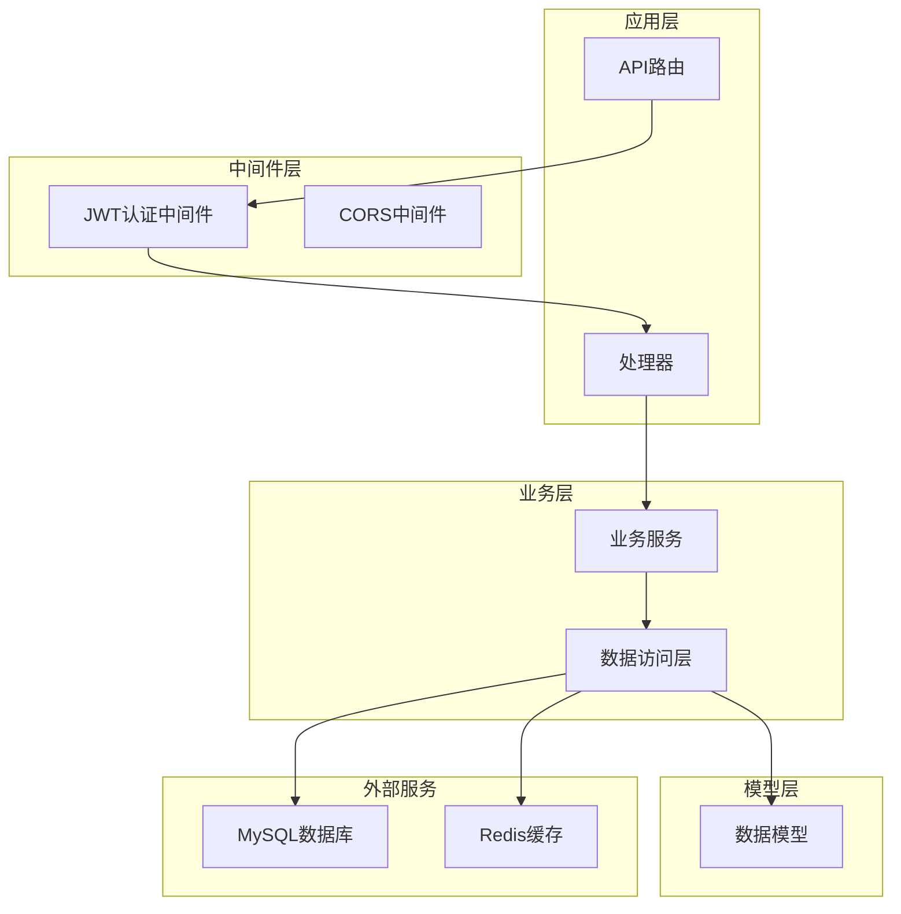

**图表来源**
- [jwt.go:1-123](file://internal/middleware/jwt.go#L1-L123)
- [main.go:46-143](file://cmd/main.go#L46-L143)

**章节来源**
- [jwt.go:1-123](file://internal/middleware/jwt.go#L1-L123)
- [main.go:1-152](file://cmd/main.go#L1-L152)

## 核心组件

### JWT中间件架构

系统实现了两个独立的JWT认证中间件，分别服务于不同的用户群体：

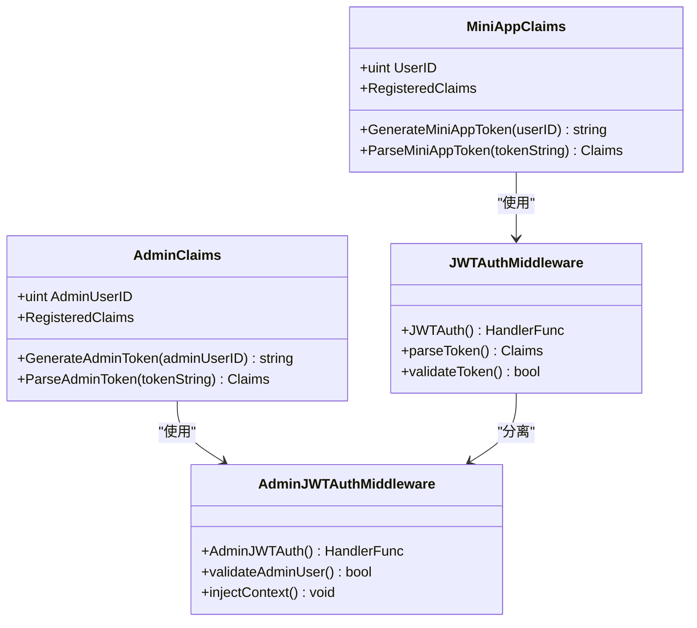

**图表来源**
- [jwt.go:20-122](file://internal/middleware/jwt.go#L20-L122)

### 数据模型设计

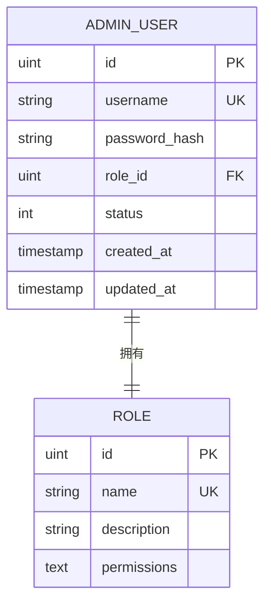

**图表来源**
- [admin_user.go:5-15](file://internal/model/admin_user.go#L5-L15)
- [role.go:3-9](file://internal/model/role.go#L3-L9)

**章节来源**
- [jwt.go:20-122](file://internal/middleware/jwt.go#L20-L122)
- [admin_user.go:5-15](file://internal/model/admin_user.go#L5-L15)
- [role.go:3-9](file://internal/model/role.go#L3-L9)

## 架构概览

JWT认证系统采用分层架构，确保了良好的关注点分离和可维护性。

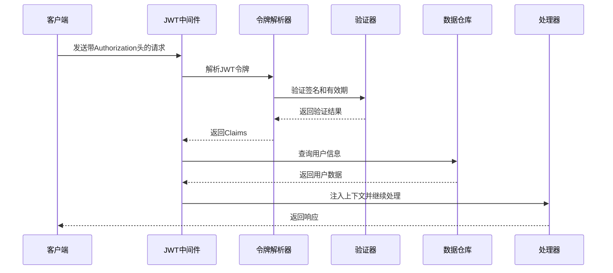

**图表来源**
- [jwt.go:48-122](file://internal/middleware/jwt.go#L48-L122)
- [main.go:46-143](file://cmd/main.go#L46-L143)

## 详细组件分析

### ParseToken函数实现

ParseToken函数是JWT认证的核心，负责令牌的完整验证流程：

#### 小程序用户令牌解析

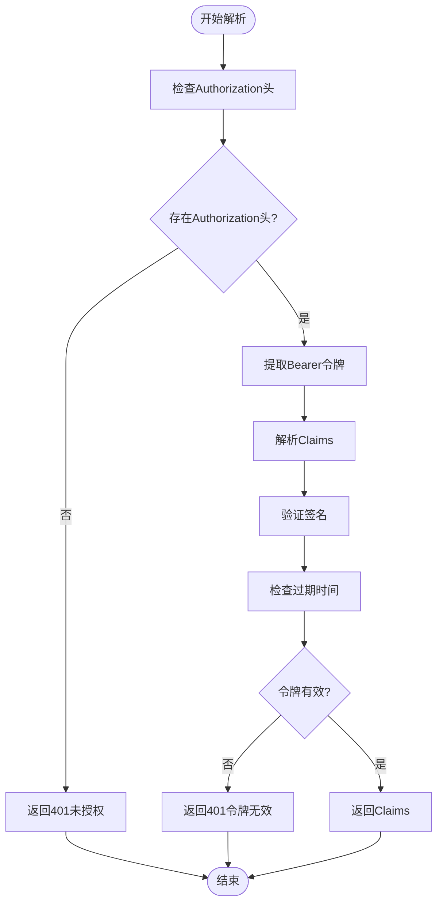

**图表来源**
- [jwt.go:38-46](file://internal/middleware/jwt.go#L38-L46)

#### 后台管理员令牌解析

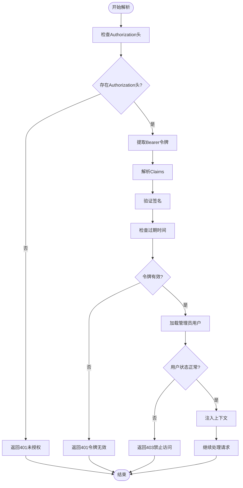

**图表来源**
- [jwt.go:85-93](file://internal/middleware/jwt.go#L85-L93)

**章节来源**
- [jwt.go:38-93](file://internal/middleware/jwt.go#L38-L93)

### 用户信息提取和上下文传递

JWT中间件成功验证令牌后，会将用户信息注入到Gin的上下文中：

#### 上下文注入机制

| 用户类型 | 注入键名 | 注入内容 | 用途 |
|---------|---------|---------|------|
| 小程序用户 | `userID` | 用户ID | 识别当前登录用户 |
| 后台管理员 | `adminUserID` | 管理员ID | 识别管理员身份 |
| 后台管理员 | `adminRole` | 角色对象 | 权限检查 |

#### 上下文传递流程

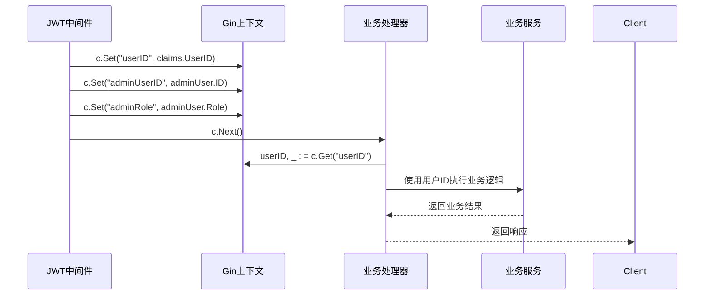

**图表来源**
- [jwt.go:62-120](file://internal/middleware/jwt.go#L62-L120)

**章节来源**
- [jwt.go:48-122](file://internal/middleware/jwt.go#L48-L122)

### 权限验证流程和角色检查逻辑

系统实现了基于角色的权限控制机制：

#### 角色权限模型

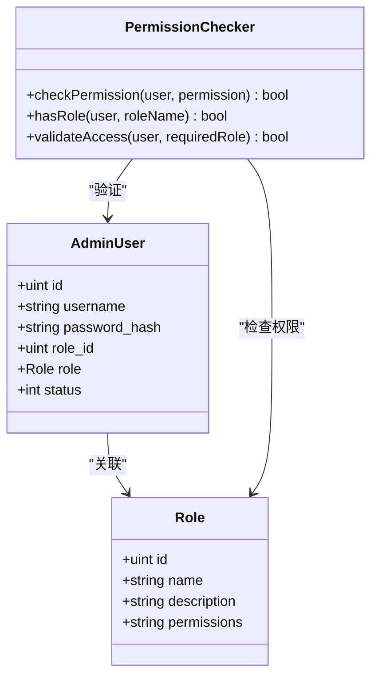

**图表来源**
- [admin_user.go:6-14](file://internal/model/admin_user.go#L6-L14)
- [role.go:4-9](file://internal/model/role.go#L4-L9)

#### 权限验证流程

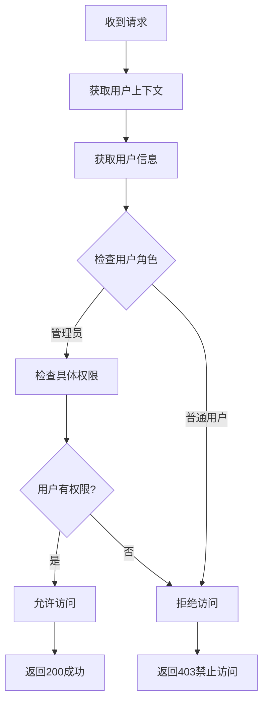

**图表来源**
- [jwt.go:110-120](file://internal/middleware/jwt.go#L110-L120)

**章节来源**
- [admin_user.go:6-14](file://internal/model/admin_user.go#L6-L14)
- [role.go:4-9](file://internal/model/role.go#L4-L9)
- [jwt.go:95-122](file://internal/middleware/jwt.go#L95-L122)

### JWT令牌生成、刷新和失效处理策略

#### 令牌生成策略

系统实现了两种不同的令牌生成策略：

| 令牌类型 | 有效期 | 签发者 | 密钥 | 用途 |
|---------|--------|-------|------|------|
| 小程序用户令牌 | 7天 | travel-miniapp | miniapp-secret-key | 小程序用户认证 |
| 后台管理员令牌 | 7天 | travel-admin | admin-secret-key | 后台管理员认证 |

#### 刷新和失效处理

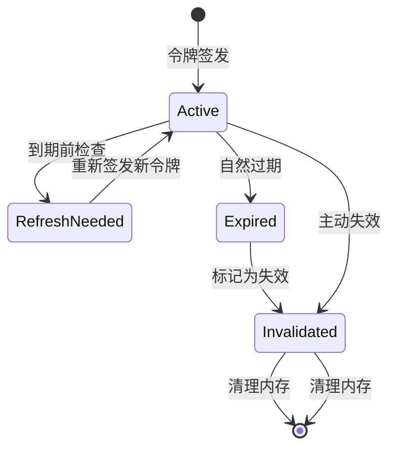

**图表来源**
- [jwt.go:26-36](file://internal/middleware/jwt.go#L26-L36)
- [jwt.go:73-83](file://internal/middleware/jwt.go#L73-L83)

**章节来源**
- [jwt.go:26-83](file://internal/middleware/jwt.go#L26-L83)

### 错误处理和响应格式

JWT中间件提供了统一的错误处理机制：

#### 错误响应格式

| 错误类型 | HTTP状态码 | 响应内容 | 说明 |
|---------|-----------|---------|------|
| 未登录 | 401 | {"msg": "未登录"} | 缺少Authorization头 |
| 令牌无效 | 401 | {"msg": "token无效"} | 令牌格式错误或验证失败 |
| 用户被禁用 | 403 | {"msg": "用户已被禁用或不存在"} | 用户状态异常 |
| 服务器错误 | 500 | {"msg": "服务器错误"} | 系统内部错误 |

#### 错误处理流程

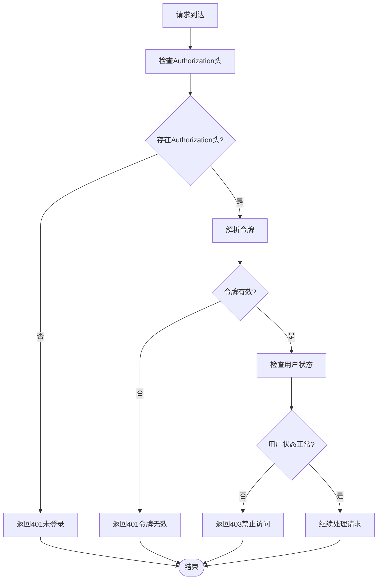

**图表来源**
- [jwt.go:48-122](file://internal/middleware/jwt.go#L48-L122)

**章节来源**
- [jwt.go:48-122](file://internal/middleware/jwt.go#L48-L122)

## 依赖关系分析

JWT中间件的依赖关系相对简单，主要依赖于Gin框架和JWT库：

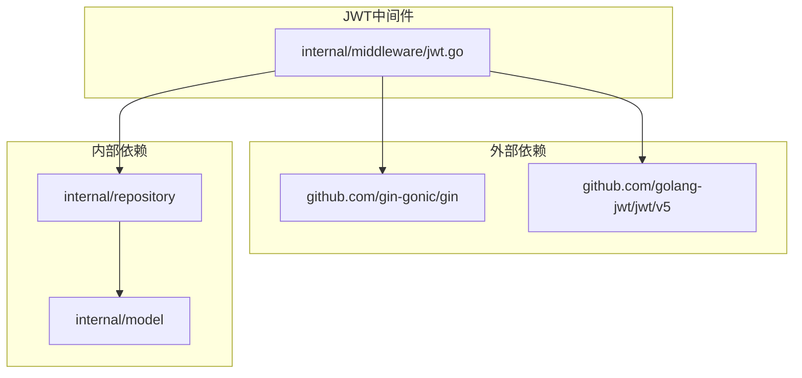

**图表来源**
- [jwt.go:3-12](file://internal/middleware/jwt.go#L3-L12)

**章节来源**
- [jwt.go:3-12](file://internal/middleware/jwt.go#L3-L12)

## 性能考虑

### 缓存策略

当前实现中，JWT中间件没有内置缓存机制。建议采用以下缓存策略：

#### Redis缓存方案

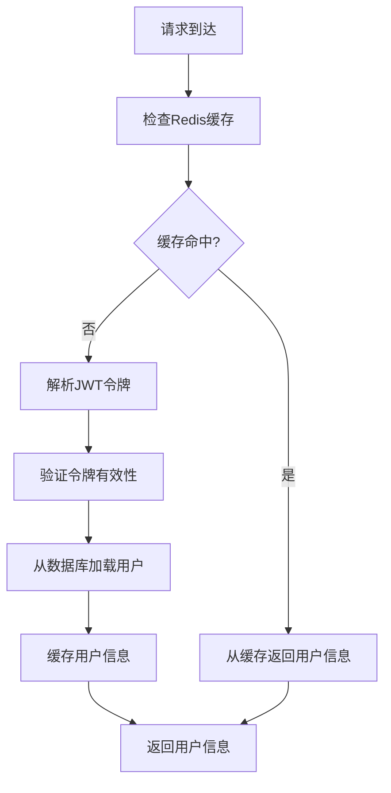

#### 缓存键设计

| 缓存键格式 | 说明 | 过期时间 |
|-----------|------|----------|
| `jwt:user:{userID}` | 小程序用户缓存 | 5分钟 |
| `jwt:admin:{adminUserID}` | 管理员用户缓存 | 5分钟 |
| `jwt:token:{tokenID}` | 令牌黑名单缓存 | 7天 |

### 性能优化建议

1. **令牌预验证**：在解析前进行基本格式验证
2. **批量查询**：对于需要频繁访问的用户信息，使用批量查询减少数据库压力
3. **连接池优化**：合理配置数据库连接池大小
4. **日志优化**：避免在生产环境中记录敏感信息

## 故障排除指南

### 常见问题诊断

#### 令牌验证失败

**症状**：客户端收到401状态码
**可能原因**：
- Authorization头格式不正确
- 令牌已过期
- 签名验证失败
- 密钥不匹配

**解决方案**：
1. 检查Authorization头是否以"Bear "开头
2. 验证令牌有效期
3. 确认使用正确的密钥
4. 检查服务器时间同步

#### 用户状态异常

**症状**：客户端收到403状态码
**可能原因**：
- 用户被禁用
- 用户不存在
- 数据库连接异常

**解决方案**：
1. 检查用户状态字段
2. 验证用户是否存在
3. 确认数据库连接正常

#### 路由配置问题

**症状**：中间件不生效
**可能原因**：
- 路由组配置错误
- 中间件注册顺序问题

**解决方案**：
1. 检查路由分组配置
2. 确认中间件注册顺序
3. 验证路由路径匹配

**章节来源**
- [jwt.go:48-122](file://internal/middleware/jwt.go#L48-L122)
- [main.go:46-143](file://cmd/main.go#L46-L143)

## 结论

JWT认证中间件为旅行社交平台提供了安全、可靠的用户认证机制。系统采用双令牌策略，分别服务于小程序用户和后台管理员，确保了不同用户群体的安全需求。

### 主要优势

1. **安全性**：采用HS256签名算法，支持7天有效期
2. **可扩展性**：无状态设计支持水平扩展
3. **易用性**：简洁的API接口，易于集成
4. **灵活性**：支持自定义Claims和权限检查

### 改进建议

1. **添加令牌刷新机制**：实现短期访问令牌和长期刷新令牌
2. **集成Redis缓存**：提高用户信息查询性能
3. **增强安全配置**：支持动态密钥管理和轮换
4. **完善监控告警**：添加详细的审计日志和异常监控

该JWT中间件为整个系统的安全架构奠定了坚实基础，通过合理的配置和持续优化，可以满足旅行社交平台的安全需求。