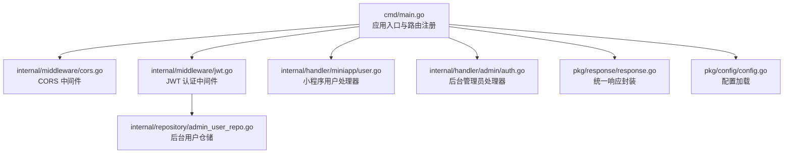
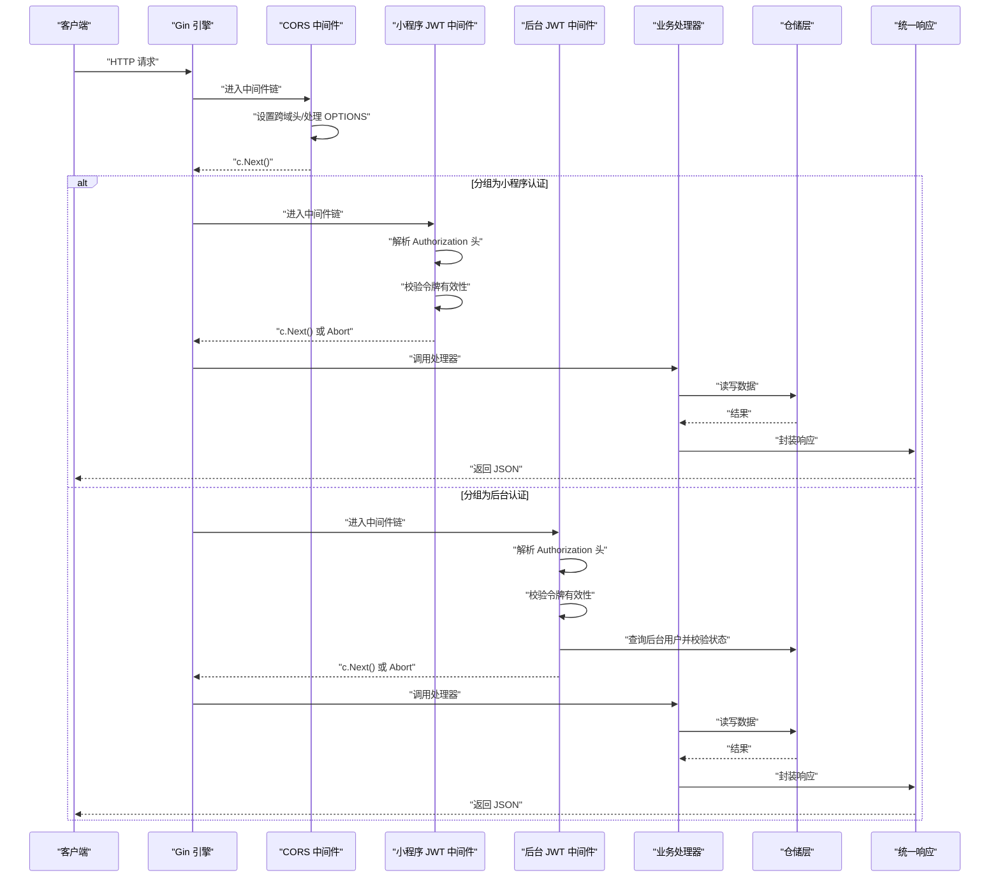
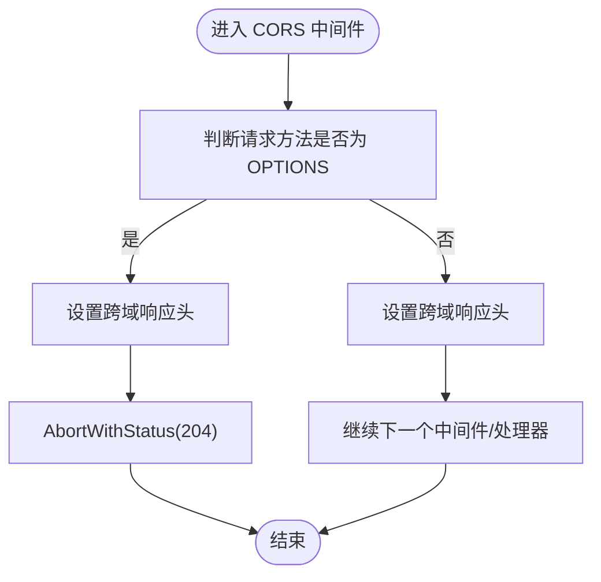
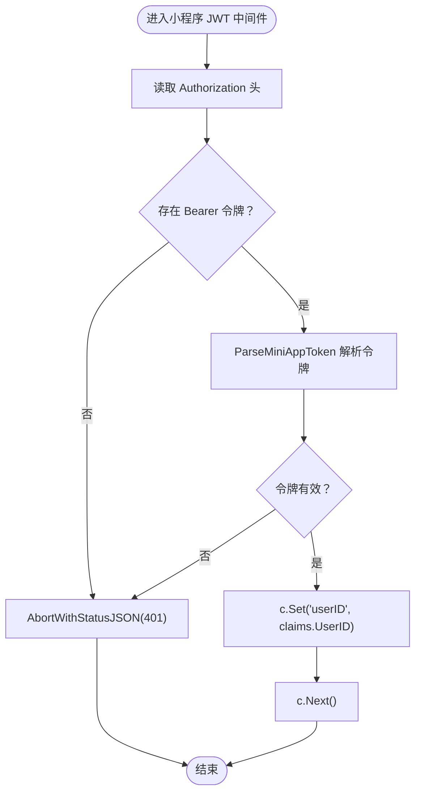
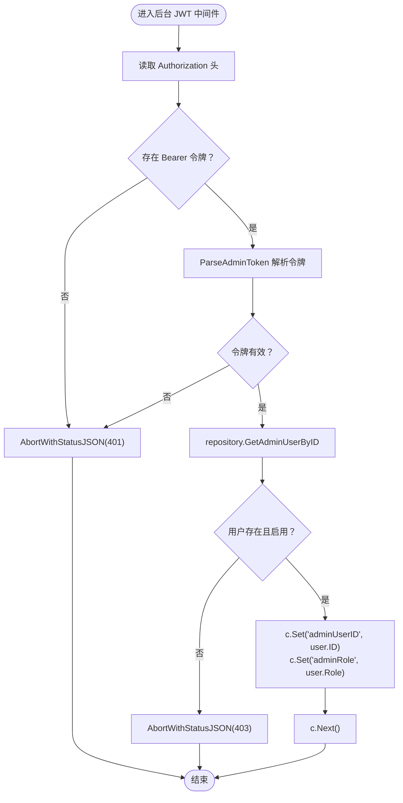
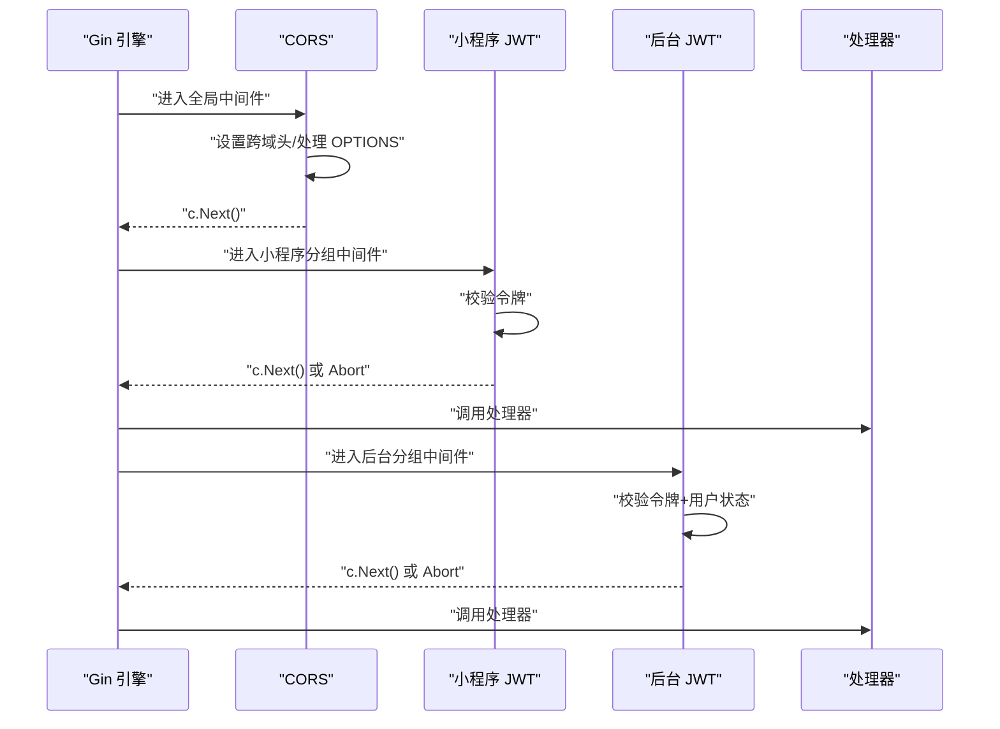
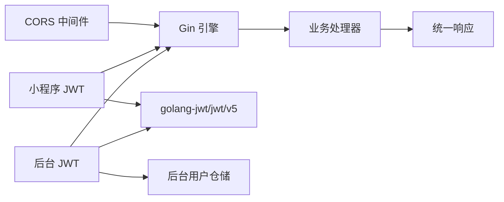

# 中间件系统

<cite>
**本文引用的文件**
- [cmd/main.go](file://cmd/main.go)
- [internal/middleware/cors.go](file://internal/middleware/cors.go)
- [internal/middleware/jwt.go](file://internal/middleware/jwt.go)
- [internal/handler/miniapp/user.go](file://internal/handler/miniapp/user.go)
- [internal/handler/admin/auth.go](file://internal/handler/admin/auth.go)
- [internal/repository/admin_user_repo.go](file://internal/repository/admin_user_repo.go)
- [pkg/response/response.go](file://pkg/response/response.go)
- [pkg/config/config.go](file://pkg/config/config.go)
</cite>

## 目录
1. [简介](#简介)
2. [项目结构](#项目结构)
3. [核心组件](#核心组件)
4. [架构总览](#架构总览)
5. [详细组件分析](#详细组件分析)
6. [依赖关系分析](#依赖关系分析)
7. [性能考量](#性能考量)
8. [故障排查指南](#故障排查指南)
9. [结论](#结论)
10. [附录](#附录)

## 简介
本文件系统性梳理旅行服务器项目中的中间件体系，重点覆盖：
- Gin 中间件的作用与执行顺序（请求生命周期）
- CORS 跨域中间件的实现与预检请求处理
- JWT 认证中间件的工作原理（令牌解析、用户信息注入、权限校验）
- 中间件链式调用机制与错误处理策略
- 自定义中间件的开发指南与最佳实践
- 性能优化与安全建议
- 测试策略与调试方法

## 项目结构
中间件相关代码集中在 internal/middleware 目录，配合 cmd/main.go 的全局与分组注册，以及各处理器对中间件注入上下文的使用。

图表来源
- [cmd/main.go:31-151](file://cmd/main.go#L31-L151)
- [internal/middleware/cors.go:10-22](file://internal/middleware/cors.go#L10-L22)
- [internal/middleware/jwt.go:48-122](file://internal/middleware/jwt.go#L48-L122)
- [internal/handler/miniapp/user.go:28-51](file://internal/handler/miniapp/user.go#L28-L51)
- [internal/handler/admin/auth.go:23-53](file://internal/handler/admin/auth.go#L23-L53)
- [internal/repository/admin_user_repo.go:17-21](file://internal/repository/admin_user_repo.go#L17-L21)
- [pkg/response/response.go:17-25](file://pkg/response/response.go#L17-L25)
- [pkg/config/config.go:61-100](file://pkg/config/config.go#L61-L100)

章节来源
- [cmd/main.go:31-151](file://cmd/main.go#L31-L151)

## 核心组件
- CORS 中间件：负责设置跨域响应头，拦截 OPTIONS 预检请求并快速返回。
- JWT 认证中间件（小程序）：从 Authorization 头解析 Bearer 令牌，校验有效性并将用户标识注入上下文。
- 管理员 JWT 中间件：除校验令牌外，还查询后台用户并校验状态，注入 adminUserID 与角色信息。

章节来源
- [internal/middleware/cors.go:10-22](file://internal/middleware/cors.go#L10-L22)
- [internal/middleware/jwt.go:48-122](file://internal/middleware/jwt.go#L48-L122)

## 架构总览
下图展示请求从进入 Gin 引擎到路由处理的整体流程，以及中间件在其中的位置与调用顺序。

图表来源
- [cmd/main.go:40-151](file://cmd/main.go#L40-L151)
- [internal/middleware/cors.go:10-22](file://internal/middleware/cors.go#L10-L22)
- [internal/middleware/jwt.go:48-122](file://internal/middleware/jwt.go#L48-L122)
- [internal/handler/miniapp/user.go:77-91](file://internal/handler/miniapp/user.go#L77-L91)
- [internal/handler/admin/auth.go:56-79](file://internal/handler/admin/auth.go#L56-L79)
- [internal/repository/admin_user_repo.go:17-21](file://internal/repository/admin_user_repo.go#L17-L21)
- [pkg/response/response.go:17-25](file://pkg/response/response.go#L17-L25)

## 详细组件分析

### CORS 跨域中间件
- 作用：为所有请求设置允许跨域的响应头；对 OPTIONS 预检请求直接返回无内容状态，避免后续处理。
- 安全策略：当前实现对来源、头部、方法采用宽松通配策略，便于开发阶段调试；生产环境建议按需收紧。
- 预检请求处理：当请求方法为 OPTIONS 时，立即中止并返回状态码，不进入后续处理器。

图表来源
- [internal/middleware/cors.go:10-22](file://internal/middleware/cors.go#L10-L22)

章节来源
- [internal/middleware/cors.go:10-22](file://internal/middleware/cors.go#L10-L22)

### JWT 认证中间件（小程序）
- 令牌来源：从请求头 Authorization 中提取 Bearer 令牌字符串。
- 解析与校验：使用 HS256 算法与固定密钥解析 MiniAppClaims，校验签名与有效期。
- 上下文注入：校验通过后将 userID 写入上下文，供后续处理器读取。
- 错误处理：未携带或无效令牌时，以 JSON 形式返回未授权状态。

图表来源
- [internal/middleware/jwt.go:48-65](file://internal/middleware/jwt.go#L48-L65)

章节来源
- [internal/middleware/jwt.go:48-65](file://internal/middleware/jwt.go#L48-L65)
- [internal/handler/miniapp/user.go:77-91](file://internal/handler/miniapp/user.go#L77-L91)

### 管理员 JWT 中间件
- 令牌来源与解析：与小程序 JWT 相同，但使用独立密钥与 Claims 结构。
- 用户状态校验：解析成功后查询后台用户，要求用户状态为启用，否则拒绝访问。
- 上下文注入：将 adminUserID 与角色信息注入上下文，供后台处理器使用。

图表来源
- [internal/middleware/jwt.go:95-122](file://internal/middleware/jwt.go#L95-L122)
- [internal/repository/admin_user_repo.go:17-21](file://internal/repository/admin_user_repo.go#L17-L21)

章节来源
- [internal/middleware/jwt.go:95-122](file://internal/middleware/jwt.go#L95-L122)
- [internal/handler/admin/auth.go:56-79](file://internal/handler/admin/auth.go#L56-L79)
- [internal/repository/admin_user_repo.go:17-21](file://internal/repository/admin_user_repo.go#L17-L21)

### 中间件链式调用与执行顺序
- 全局中间件：在引擎上注册的 CORS 中间件对所有路由生效。
- 分组中间件：通过 Group 方式为特定路由组挂载认证中间件，形成“先全局，后分组”的执行顺序。
- 控制流：中间件内部调用 c.Next() 继续链式执行；若发生 Abort，则提前终止并返回错误响应。

图表来源
- [cmd/main.go:40-151](file://cmd/main.go#L40-L151)
- [internal/middleware/cors.go:10-22](file://internal/middleware/cors.go#L10-L22)
- [internal/middleware/jwt.go:48-122](file://internal/middleware/jwt.go#L48-L122)

章节来源
- [cmd/main.go:40-151](file://cmd/main.go#L40-L151)

## 依赖关系分析
- 中间件依赖：
  - CORS：仅依赖 Gin。
  - JWT：依赖 Gin 与 golang-jwt/jwt/v5；后台 JWT 还依赖仓储层查询用户。
- 路由与中间件绑定：
  - 公开接口无需中间件。
  - 小程序接口组挂载小程序 JWT 中间件。
  - 后台接口组挂载后台 JWT 中间件。
- 统一响应：
  - 处理器通过统一响应封装返回标准 JSON 结构，简化前端对接。

图表来源
- [internal/middleware/cors.go:10-22](file://internal/middleware/cors.go#L10-L22)
- [internal/middleware/jwt.go:48-122](file://internal/middleware/jwt.go#L48-L122)
- [pkg/response/response.go:17-25](file://pkg/response/response.go#L17-L25)

章节来源
- [pkg/response/response.go:17-25](file://pkg/response/response.go#L17-L25)

## 性能考量
- 中间件顺序优化：将轻量中间件（如 CORS）置于前部，减少不必要的后续处理。
- 令牌解析缓存：对于高频访问的公开接口，可考虑对已解析的令牌进行短期缓存（注意安全风险）。
- 仓储查询优化：后台 JWT 中间件会查询用户状态，建议在仓储层使用索引与预加载，降低查询延迟。
- 响应封装：统一响应结构减少重复逻辑，提升一致性与可维护性。

## 故障排查指南
- CORS 问题
  - 现象：浏览器报跨域错误或预检请求失败。
  - 排查：确认中间件是否正确设置允许来源、方法与头部；生产环境需按需收紧。
- 令牌无效
  - 现象：返回未授权状态。
  - 排查：确认 Authorization 头格式为 Bearer；核对令牌签名与过期时间；检查密钥是否一致。
- 后台用户被禁用
  - 现象：返回禁止访问状态。
  - 排查：确认用户状态字段；检查仓储查询条件。
- 统一响应
  - 现象：接口返回结构不一致。
  - 排查：确保处理器使用统一响应封装函数。

章节来源
- [internal/middleware/cors.go:10-22](file://internal/middleware/cors.go#L10-L22)
- [internal/middleware/jwt.go:48-122](file://internal/middleware/jwt.go#L48-L122)
- [pkg/response/response.go:17-25](file://pkg/response/response.go#L17-L25)

## 结论
本项目中间件体系简洁清晰：CORS 提供跨域支持，JWT 中间件分别服务于小程序与后台两大场景。通过全局与分组中间件的组合，实现了灵活而可控的请求处理链。建议在生产环境中进一步收紧 CORS 策略、强化令牌安全与仓储查询性能，并完善测试与监控。

## 附录

### 自定义中间件开发指南与最佳实践
- 设计原则
  - 单一职责：每个中间件只做一件事。
  - 快速失败：尽早校验与错误处理，避免无效计算。
  - 明确边界：在中间件内明确设置上下文键值，避免命名冲突。
- 开发步骤
  - 定义 gin.HandlerFunc，读取请求上下文信息。
  - 执行前置逻辑（鉴权、限流、日志等）。
  - 调用 c.Next() 进入后续链路。
  - 在中间件末尾处理后置逻辑（记录耗时、清理资源等）。
- 安全建议
  - 严格校验输入与令牌。
  - 限制 CORS 来源与方法。
  - 对敏感操作增加二次校验或审计日志。
- 性能建议
  - 缓存热点数据（谨慎使用）。
  - 减少不必要的数据库查询。
  - 使用异步处理非关键路径任务。

### 测试策略与调试方法
- 单元测试
  - 对中间件函数进行输入输出断言，覆盖正常与异常分支。
  - 使用伪造的 gin.Context 与最小依赖环境。
- 集成测试
  - 通过构造 HTTP 请求验证中间件链的执行顺序与效果。
  - 验证 CORS 预检请求、令牌校验、用户状态校验等关键路径。
- 调试技巧
  - 在中间件中打印关键信息（如请求方法、令牌摘要、用户ID）。
  - 使用 Gin 的 Debug 模式观察中间件链与路由匹配过程。
  - 利用统一响应结构快速定位业务错误。