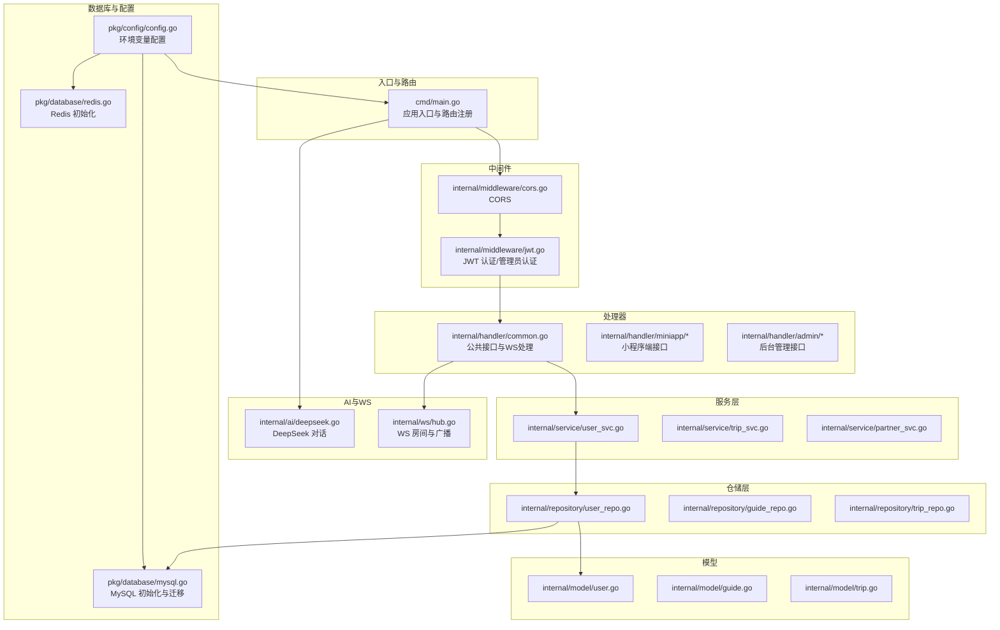
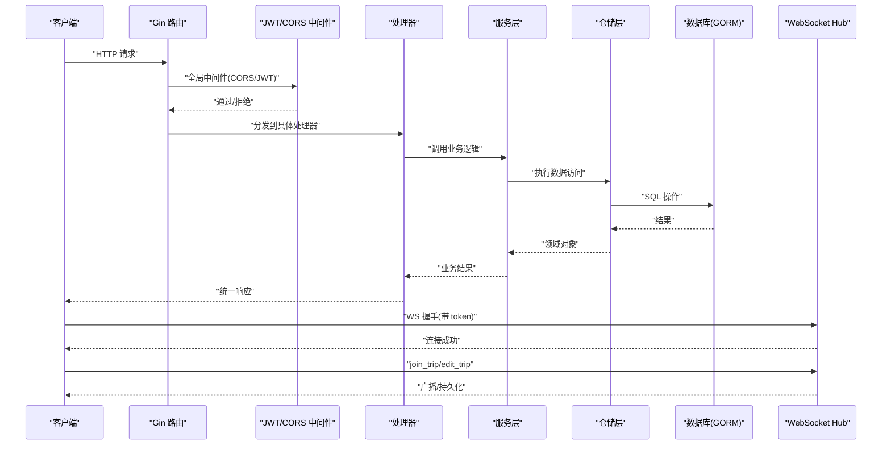
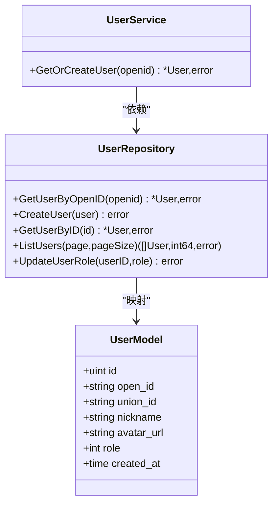
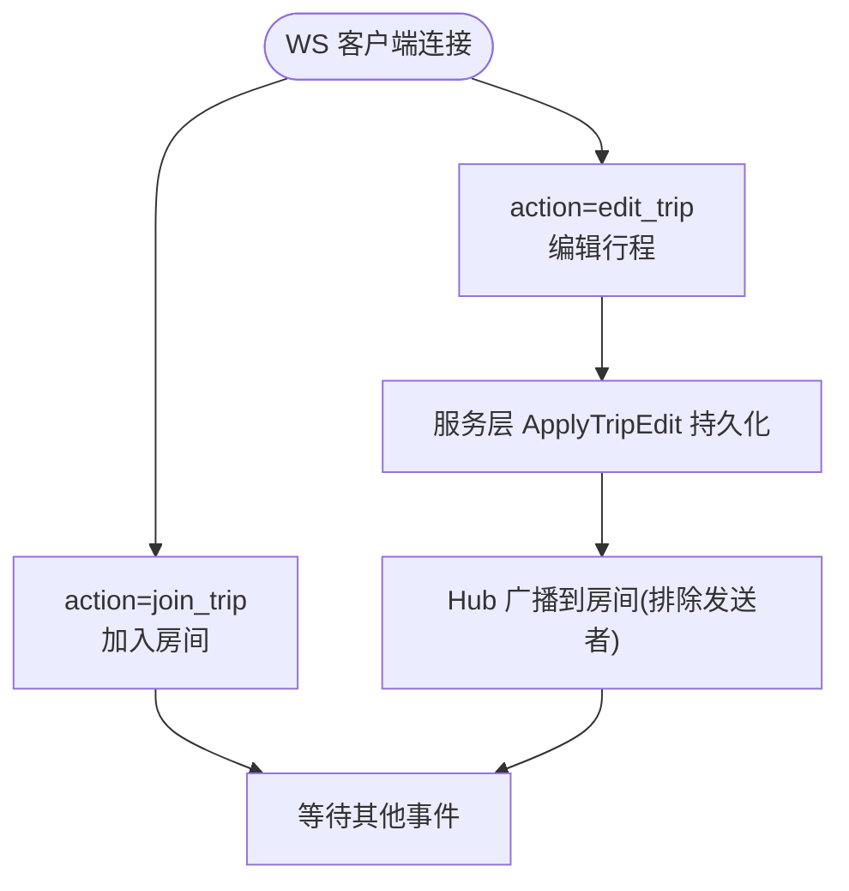
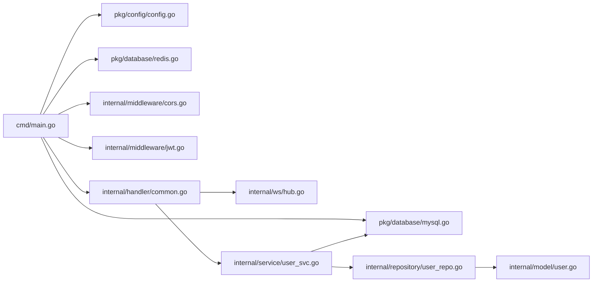

# 开发指南

<cite>
**本文引用的文件**
- [cmd/main.go](file://cmd/main.go)
- [.air.toml](file://.air.toml)
- [go.mod](file://go.mod)
- [README.md](file://README.md)
- [pkg/config/config.go](file://pkg/config/config.go)
- [pkg/database/mysql.go](file://pkg/database/mysql.go)
- [pkg/database/redis.go](file://pkg/database/redis.go)
- [internal/middleware/cors.go](file://internal/middleware/cors.go)
- [internal/middleware/jwt.go](file://internal/middleware/jwt.go)
- [internal/handler/common.go](file://internal/handler/common.go)
- [internal/ai/deepseek.go](file://internal/ai/deepseek.go)
- [internal/ws/hub.go](file://internal/ws/hub.go)
- [internal/model/user.go](file://internal/model/user.go)
- [internal/repository/user_repo.go](file://internal/repository/user_repo.go)
- [internal/service/user_svc.go](file://internal/service/user_svc.go)
</cite>

## 目录
1. [简介](#简介)
2. [项目结构](#项目结构)
3. [核心组件](#核心组件)
4. [架构总览](#架构总览)
5. [详细组件分析](#详细组件分析)
6. [依赖分析](#依赖分析)
7. [性能考虑](#性能考虑)
8. [故障排除指南](#故障排除指南)
9. [结论](#结论)
10. [附录](#附录)

## 简介
本开发指南面向参与“旅行搭子”小程序后端服务的开发者，目标是帮助你在最短时间内理解并高效开发该 Go 项目。内容涵盖：
- Go 编码规范与命名约定
- 代码组织原则与模块划分
- 开发环境搭建（含.air.toml 热重载与 IDE 建议）
- 路由与中间件、认证与鉴权、WebSocket 协同编辑
- 数据模型、仓储层与服务层职责
- 测试编写指南（单元与集成）
- Git 工作流与代码评审标准
- 依赖管理与版本控制最佳实践
- 调试技巧与性能分析方法
- 常见问题与排障

## 项目结构
项目采用分层清晰的内部包结构，遵循“入口-中间件-处理器-服务-仓储-模型-数据库”的分层设计，配合 pkg 包提供通用能力（配置、数据库、响应封装），便于维护与扩展。

图表来源
- [cmd/main.go:1-152](file://cmd/main.go#L1-L152)
- [internal/middleware/cors.go:1-23](file://internal/middleware/cors.go#L1-L23)
- [internal/middleware/jwt.go:1-123](file://internal/middleware/jwt.go#L1-L123)
- [internal/handler/common.go:1-92](file://internal/handler/common.go#L1-L92)
- [internal/service/user_svc.go:1-28](file://internal/service/user_svc.go#L1-L28)
- [internal/repository/user_repo.go:1-44](file://internal/repository/user_repo.go#L1-L44)
- [internal/model/user.go:1-16](file://internal/model/user.go#L1-L16)
- [pkg/config/config.go:1-129](file://pkg/config/config.go#L1-L129)
- [pkg/database/mysql.go:1-91](file://pkg/database/mysql.go#L1-L91)
- [pkg/database/redis.go:1-32](file://pkg/database/redis.go#L1-L32)
- [internal/ai/deepseek.go:1-53](file://internal/ai/deepseek.go#L1-L53)
- [internal/ws/hub.go:1-56](file://internal/ws/hub.go#L1-L56)

章节来源
- [README.md:39-87](file://README.md#L39-L87)
- [cmd/main.go:31-151](file://cmd/main.go#L31-L151)

## 核心组件
- 应用入口与路由：集中于入口文件，完成配置加载、数据库与缓存初始化、全局中间件注册、路由分组与 WS 路由挂载。
- 中间件：CORS 跨域与 JWT 认证（小程序用户与管理员两套密钥与 Claims）。
- 处理器：公共接口（天气、WS）、小程序端与后台管理接口。
- 服务层：封装业务规则（如微信登录时的“查或创”）。
- 仓储层：基于 GORM 的数据访问，统一错误处理。
- 数据库与配置：MySQL 自动迁移与默认角色/管理员初始化；Redis 连接；环境变量驱动的配置加载。
- AI 与 WS：DeepSeek 对话调用；WebSocket 房间与广播。

章节来源
- [cmd/main.go:31-151](file://cmd/main.go#L31-L151)
- [internal/middleware/jwt.go:14-123](file://internal/middleware/jwt.go#L14-L123)
- [internal/handler/common.go:19-92](file://internal/handler/common.go#L19-L92)
- [internal/service/user_svc.go:12-28](file://internal/service/user_svc.go#L12-L28)
- [internal/repository/user_repo.go:8-44](file://internal/repository/user_repo.go#L8-L44)
- [pkg/database/mysql.go:19-91](file://pkg/database/mysql.go#L19-L91)
- [pkg/database/redis.go:15-32](file://pkg/database/redis.go#L15-L32)
- [internal/ai/deepseek.go:13-53](file://internal/ai/deepseek.go#L13-L53)
- [internal/ws/hub.go:10-56](file://internal/ws/hub.go#L10-L56)

## 架构总览
下图展示了请求从 Gin 路由到服务层、仓储层与数据库的典型链路，以及 WS 的协同编辑流程。

图表来源
- [cmd/main.go:47-147](file://cmd/main.go#L47-L147)
- [internal/middleware/jwt.go:48-122](file://internal/middleware/jwt.go#L48-L122)
- [internal/handler/common.go:48-91](file://internal/handler/common.go#L48-L91)
- [internal/service/user_svc.go:12-28](file://internal/service/user_svc.go#L12-L28)
- [internal/repository/user_repo.go:8-28](file://internal/repository/user_repo.go#L8-L28)
- [pkg/database/mysql.go:19-63](file://pkg/database/mysql.go#L19-L63)
- [internal/ws/hub.go:23-55](file://internal/ws/hub.go#L23-L55)

## 详细组件分析

### 路由与中间件
- 入口文件负责：
  - 加载配置与初始化数据库/缓存
  - 注册全局 CORS 中间件
  - 挂载 Swagger UI
  - 分组 API 路由（公开、小程序登录后、后台管理）
  - 注册 WS 路由
- CORS 中间件允许跨域与预检请求处理
- JWT 中间件：
  - 小程序用户与管理员分别使用独立密钥与 Claims 结构
  - 小程序 JWT 注入 userID，管理员 JWT 注入 adminUserID 与角色并校验状态

章节来源
- [cmd/main.go:31-151](file://cmd/main.go#L31-L151)
- [internal/middleware/cors.go:10-23](file://internal/middleware/cors.go#L10-L23)
- [internal/middleware/jwt.go:14-123](file://internal/middleware/jwt.go#L14-L123)

### 处理器与统一响应
- 公共接口：
  - 天气查询：调用高德天气 API，返回统一响应
  - WebSocket：基于 gorilla/websocket 升级，按 action 分派 join/edit，交由服务层持久化与 Hub 广播
- 统一响应：在 pkg/response 中封装，处理器仅负责调用

章节来源
- [internal/handler/common.go:19-92](file://internal/handler/common.go#L19-L92)

### 服务层与仓储层
- 服务层职责：
  - 微信登录场景下的“查或创”用户，避免重复注册
- 仓储层职责：
  - 基于 GORM 的 CRUD 与分页查询
  - 错误处理与返回值规范化

图表来源
- [internal/service/user_svc.go:12-28](file://internal/service/user_svc.go#L12-L28)
- [internal/repository/user_repo.go:8-44](file://internal/repository/user_repo.go#L8-L44)
- [internal/model/user.go:6-16](file://internal/model/user.go#L6-L16)

章节来源
- [internal/service/user_svc.go:12-28](file://internal/service/user_svc.go#L12-L28)
- [internal/repository/user_repo.go:8-44](file://internal/repository/user_repo.go#L8-L44)
- [internal/model/user.go:6-16](file://internal/model/user.go#L6-L16)

### 数据库与配置
- MySQL：
  - 通过 DSN 连接，重试机制保障容器启动顺序
  - AutoMigrate 自动迁移模型，初始化默认角色与管理员
- Redis：
  - 读取配置并 Ping 校验连通性
- 配置：
  - 以环境变量为主，提供默认值与类型转换工具函数

章节来源
- [pkg/database/mysql.go:19-91](file://pkg/database/mysql.go#L19-L91)
- [pkg/database/redis.go:15-32](file://pkg/database/redis.go#L15-L32)
- [pkg/config/config.go:60-129](file://pkg/config/config.go#L60-L129)

### AI 与 WebSocket
- AI：
  - DeepSeek Chat API 调用，严格 JSON 输出约束
- WebSocket：
  - Hub 维护房间与连接集合，支持加入、离开与广播
  - 处理器在 edit_trip 时持久化并广播

图表来源
- [internal/handler/common.go:48-91](file://internal/handler/common.go#L48-L91)
- [internal/ws/hub.go:23-55](file://internal/ws/hub.go#L23-L55)
- [internal/ai/deepseek.go:13-53](file://internal/ai/deepseek.go#L13-L53)

章节来源
- [internal/ai/deepseek.go:13-53](file://internal/ai/deepseek.go#L13-L53)
- [internal/ws/hub.go:10-56](file://internal/ws/hub.go#L10-L56)
- [internal/handler/common.go:48-91](file://internal/handler/common.go#L48-L91)

## 依赖分析
- 框架与库：
  - Web：gin
  - ORM：gorm + mysql 驱动
  - 缓存：go-redis
  - 认证：golang-jwt
  - 实时通信：gorilla/websocket
  - 文档：swaggo/gin-swagger
- 版本与兼容性：
  - go.mod 指定 Go 版本与依赖版本，建议保持 tidy 与最小化升级策略

图表来源
- [go.mod:1-67](file://go.mod#L1-L67)
- [cmd/main.go:14-21](file://cmd/main.go#L14-L21)

章节来源
- [go.mod:1-67](file://go.mod#L1-L67)

## 性能考虑
- 数据库连接与迁移：
  - MySQL 连接具备重试机制，适合容器编排场景
  - AutoMigrate 在启动时执行，建议在生产中谨慎使用，优先采用迁移脚本
- 缓存：
  - Redis 初始化后可用于热点数据与会话存储，注意键空间与过期策略
- 中间件：
  - CORS 与 JWT 解析为每请求开销，建议在网关层或反向代理处做静态资源与预检优化
- WebSocket：
  - Hub 使用互斥锁保护房间集合，广播时逐连接写入，建议评估连接规模与消息频率
- AI 调用：
  - DeepSeek API 为外部依赖，建议增加超时、重试与熔断策略

章节来源
- [pkg/database/mysql.go:25-37](file://pkg/database/mysql.go#L25-L37)
- [internal/ws/hub.go:12-14](file://internal/ws/hub.go#L12-L14)
- [internal/ai/deepseek.go:28-36](file://internal/ai/deepseek.go#L28-L36)

## 故障排除指南
- 无法连接数据库
  - 检查环境变量与 DSN 参数，确认重试日志与最终失败原因
  - 确认容器网络与端口映射
- Redis 连接失败
  - 校验主机、端口、密码与 DB 索引
- JWT 未登录/无效
  - 确认请求头 Authorization 是否为 Bearer Token
  - 确认小程序与管理员密钥是否正确
- Swagger 文档未生成
  - 确保 swag 初始化命令执行并指向正确入口文件
- 热重载不生效
  - 检查 .air.toml 的构建命令与目录排除配置
- WebSocket 无法握手
  - 确认 token 有效且 WS 路径正确

章节来源
- [pkg/database/mysql.go:25-37](file://pkg/database/mysql.go#L25-L37)
- [pkg/database/redis.go:23-31](file://pkg/database/redis.go#L23-L31)
- [internal/middleware/jwt.go:48-65](file://internal/middleware/jwt.go#L48-L65)
- [.air.toml:4-12](file://.air.toml#L4-L12)
- [internal/handler/common.go:48-59](file://internal/handler/common.go#L48-L59)

## 结论
本项目采用清晰的分层架构与模块化设计，结合 Gin、GORM、Redis、JWT、WebSocket 与 Swagger，形成一套可扩展、易维护的后端服务骨架。建议在后续迭代中：
- 将 AutoMigrate 替换为迁移脚本，提升生产安全
- 引入统一的错误码与日志规范
- 增加限流、熔断与可观测性
- 规范测试覆盖与 CI/CD 流水线

## 附录

### 开发环境搭建与热重载
- 环境变量
  - 参考 README 的环境变量模板，设置数据库、Redis、微信、高德、DeepSeek 等关键参数
- 依赖安装与文档生成
  - 执行 go mod tidy 与 swag 初始化
- 热重载
  - 使用 air 配置自动编译与重启，入口构建路径指向 cmd 目录
- Docker 开发模式
  - 使用 docker-compose.dev.yml 启动开发环境，支持日志追踪与容器交互

章节来源
- [README.md:91-142](file://README.md#L91-L142)
- [.air.toml:4-12](file://.air.toml#L4-L12)
- [README.md:262-318](file://README.md#L262-L318)

### Go 编码规范与命名约定
- 包与目录
  - 按功能分层组织：internal/{handler,service,repository,model,middleware,ws}/pkg/{config,database,response}
  - 入口位于 cmd/main.go
- 命名
  - 结构体与字段使用驼峰，首字母大写导出
  - 函数与方法以动词开头，简洁明确
  - 包名短小、语义化，避免复数与缩写
- 文件与注释
  - 每个包顶部添加注释说明用途
  - 公开接口使用 godoc 注解，便于生成文档
- 错误处理
  - 明确错误传播与包装，避免丢弃错误上下文
- 日志
  - 使用标准库 log 或结构化日志库，避免打印敏感信息

### 代码组织原则
- 分层清晰：handler → service → repository → model
- 单一职责：每个包/文件聚焦一个领域或关注点
- 依赖倒置：上层依赖抽象（接口/服务），下层实现细节对上层透明
- 配置外置：通过环境变量与配置模块集中管理

### 单元测试与集成测试
- 单元测试
  - 针对 service 层进行隔离测试，使用内存数据库或模拟仓储
  - 验证边界条件与错误分支
- 集成测试
  - 使用测试数据库实例，覆盖 handler → service → repository → DB 的完整链路
  - 包含 JWT 鉴权、WS 事件、AI 调用等关键路径
- 测试覆盖率
  - 逐步提升关键路径覆盖率，确保回归稳定

### Git 工作流与代码评审标准
- 分支策略
  - 主干保护：master/main 仅接受通过 MR/PR 的变更
  - 功能分支：feature/*、hotfix/*、chore/*
- 提交规范
  - 标题简明，正文说明动机与影响
  - 遵循 Conventional Commits 风格
- 代码评审
  - 至少一名 reviewer，关注安全性、可维护性与一致性
  - 关联测试与变更范围，避免引入回归

### 依赖管理与版本控制最佳实践
- go.mod
  - 使用 go mod tidy 维持整洁依赖树
  - 优先使用语义化版本，必要时锁定次要版本
- 第三方服务
  - 将 API Key、证书等敏感信息纳入环境变量与密管系统
- 版本升级
  - 通过 PR 逐步升级，先在 dev 环境验证，再合并至主干

### 调试技巧与性能分析
- 调试
  - Gin 默认日志输出，结合结构化日志增强可观测性
  - 使用断点与轻量测试定位问题
- 性能分析
  - 使用 pprof 分析 CPU/内存热点
  - 关注慢查询、阻塞 IO 与并发瓶颈