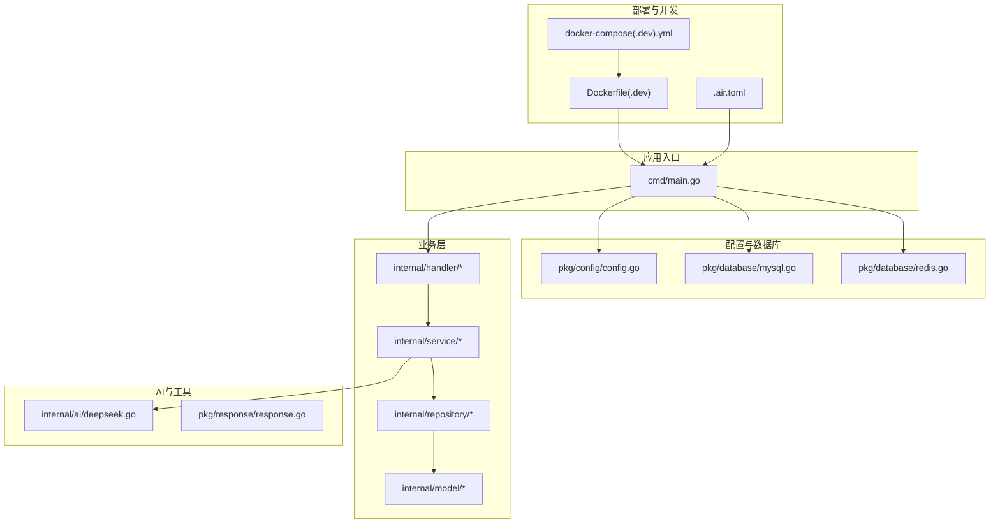
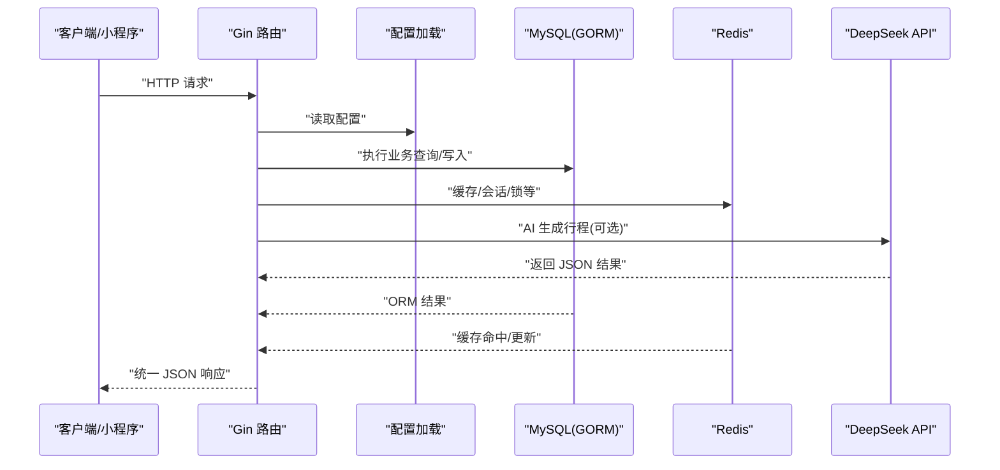
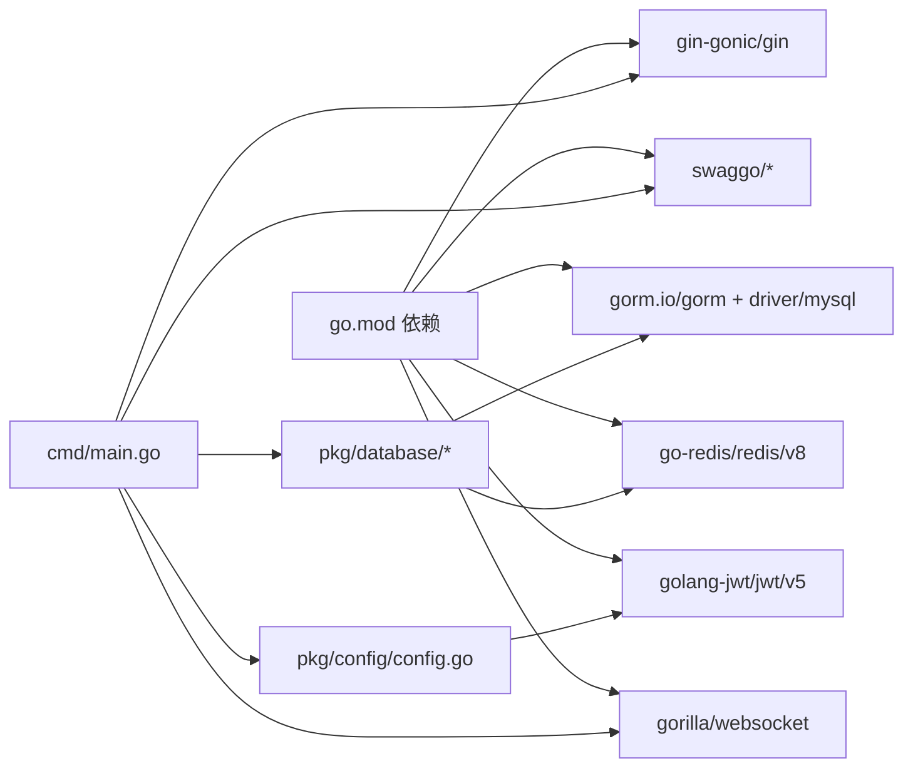

# 快速开始

<cite>
**本文引用的文件**
- [README.md](file://README.md)
- [go.mod](file://go.mod)
- [cmd/main.go](file://cmd/main.go)
- [pkg/config/config.go](file://pkg/config/config.go)
- [.air.toml](file://.air.toml)
- [Dockerfile](file://Dockerfile)
- [Dockerfile.dev](file://Dockerfile.dev)
- [docker-compose.yml](file://docker-compose.yml)
- [docker-compose.dev.yml](file://docker-compose.dev.yml)
- [pkg/database/mysql.go](file://pkg/database/mysql.go)
- [pkg/database/redis.go](file://pkg/database/redis.go)
- [internal/ai/deepseek.go](file://internal/ai/deepseek.go)
</cite>

## 目录
1. [简介](#简介)
2. [项目结构](#项目结构)
3. [核心组件](#核心组件)
4. [架构总览](#架构总览)
5. [详细组件解析](#详细组件解析)
6. [依赖关系分析](#依赖关系分析)
7. [性能注意事项](#性能注意事项)
8. [故障排查指南](#故障排查指南)
9. [结论](#结论)
10. [附录](#附录)

## 简介
本指南面向新手开发者，帮助你在最短时间内完成旅行社交平台后端服务的本地开发与首次运行。内容涵盖环境准备（Go、MySQL、Redis）、项目克隆与依赖安装、环境变量配置、本地开发与热重载、容器化部署、首次运行验证以及常见问题排查。

## 项目结构
该仓库采用模块化组织方式，核心入口位于 cmd/main.go，配置加载在 pkg/config，数据库连接在 pkg/database，业务路由在 internal/handler，AI集成在 internal/ai，统一响应封装在 pkg/response。Dockerfile 和 docker-compose 提供容器化部署能力，.air.toml 支持热重载开发。

图表来源
- [cmd/main.go:31-151](file://cmd/main.go#L31-L151)
- [pkg/config/config.go:61-100](file://pkg/config/config.go#L61-L100)
- [pkg/database/mysql.go:19-90](file://pkg/database/mysql.go#L19-L90)
- [pkg/database/redis.go:15-31](file://pkg/database/redis.go#L15-L31)
- [internal/ai/deepseek.go:18-52](file://internal/ai/deepseek.go#L18-L52)
- [Dockerfile:1-29](file://Dockerfile#L1-L29)
- [docker-compose.yml:35-53](file://docker-compose.yml#L35-L53)
- [.air.toml:4-12](file://.air.toml#L4-L12)

章节来源
- [README.md:39-87](file://README.md#L39-L87)
- [cmd/main.go:31-151](file://cmd/main.go#L31-L151)

## 核心组件
- 配置加载：从环境变量读取数据库、Redis、第三方服务等配置，支持默认值与类型转换。
- 数据库初始化：通过 GORM 连接 MySQL，自动迁移模型并初始化默认角色与管理员。
- Redis 初始化：根据配置建立连接并进行 Ping 校验。
- 路由注册：基于 Gin 注册公开与鉴权接口，含 Swagger 文档与 WebSocket。
- AI 集成：调用 DeepSeek Chat API 生成智能行程。
- 开发与部署：Air 热重载、Docker 构建与 Compose 编排。

章节来源
- [pkg/config/config.go:61-100](file://pkg/config/config.go#L61-L100)
- [pkg/database/mysql.go:19-90](file://pkg/database/mysql.go#L19-L90)
- [pkg/database/redis.go:15-31](file://pkg/database/redis.go#L15-L31)
- [cmd/main.go:31-151](file://cmd/main.go#L31-L151)
- [internal/ai/deepseek.go:18-52](file://internal/ai/deepseek.go#L18-L52)

## 架构总览
下图展示了从请求到数据库与第三方服务的整体交互路径，以及开发与生产的差异点。

图表来源
- [cmd/main.go:47-146](file://cmd/main.go#L47-L146)
- [pkg/config/config.go:61-100](file://pkg/config/config.go#L61-L100)
- [pkg/database/mysql.go:19-63](file://pkg/database/mysql.go#L19-L63)
- [pkg/database/redis.go:15-31](file://pkg/database/redis.go#L15-L31)
- [internal/ai/deepseek.go:18-52](file://internal/ai/deepseek.go#L18-L52)

## 详细组件解析

### 环境准备与安装
- Go 版本要求：项目模块声明使用 Go 1.26.3，建议本地也保持一致或更高版本以避免兼容性问题。
- 数据库与缓存：MySQL 8.0+ 与 Redis 7.0+，容器化部署时将自动创建 travel 数据库并暴露端口。
- 第三方服务：微信小程序 AppID/AppSecret、高德地图 Web API Key、DeepSeek API Key。
- Swagger 文档：首次运行前需生成文档，命令已在 README 中给出。

章节来源
- [go.mod:3](file://go.mod#L3)
- [README.md:93-101](file://README.md#L93-L101)
- [README.md:127-140](file://README.md#L127-L140)

### 项目克隆与依赖安装
- 克隆仓库后，进入项目根目录执行依赖整理与文档生成。
- 若未安装 swag，请先安装 swag CLI 工具，随后生成 Swagger 文档并启动服务。

章节来源
- [README.md:127-140](file://README.md#L127-L140)
- [Dockerfile:6-15](file://Dockerfile#L6-L15)

### 环境变量配置
- 复制示例文件并填入真实值，或在系统中导出对应环境变量。
- 关键配置项包括：数据库连接参数、Redis 连接参数、微信小程序 AppID/AppSecret、高德地图 Key、DeepSeek Key、服务端口等。
- 配置加载函数会读取这些变量并提供默认值，便于本地快速启动。

章节来源
- [README.md:102-125](file://README.md#L102-L125)
- [pkg/config/config.go:61-100](file://pkg/config/config.go#L61-L100)

### 本地开发环境搭建
- 方式一：传统本地运行
  - 安装依赖并生成文档后，直接运行入口文件启动服务。
  - 默认监听端口可在配置中调整，Swagger 文档访问路径见 README。
- 方式二：热重载开发（Air）
  - 使用 .air.toml 配置自动编译与重启，适合频繁修改代码场景。
  - 编译目标指向 cmd 目录下的入口，输出到 tmp 目录，排除特定目录与文件类型。
- 方式三：容器化开发（Docker Compose Dev）
  - 使用 docker-compose.dev.yml 启动 MySQL、Redis 与后端服务。
  - 后端镜像基于 Dockerfile.dev 构建，挂载项目目录实现代码同步与热更新。
  - 可通过日志命令查看实时日志，支持重启与停止容器。

章节来源
- [README.md:127-140](file://README.md#L127-L140)
- [.air.toml:4-12](file://.air.toml#L4-L12)
- [README.md:262-318](file://README.md#L262-L318)
- [docker-compose.dev.yml:3-59](file://docker-compose.dev.yml#L3-L59)
- [Dockerfile.dev](file://Dockerfile.dev)

### 容器化部署
- 生产镜像构建
  - 基于多阶段构建，先安装 swag 并生成文档，再编译二进制，最终使用精简基础镜像运行。
  - 暴露 8080 端口，可通过 env-file 挂载 .env.prod。
- Compose 编排
  - 后端服务依赖数据库与缓存健康检查，确保服务启动顺序与稳定性。
  - 端口映射与持久化卷配置便于本地调试与数据保留。

章节来源
- [Dockerfile:1-29](file://Dockerfile#L1-L29)
- [docker-compose.yml:35-53](file://docker-compose.yml#L35-L53)
- [README.md:237-259](file://README.md#L237-L259)

### 首次运行与验证
- 启动服务
  - 本地运行：执行入口文件启动服务，默认监听端口见 README。
  - 容器运行：构建镜像并运行容器，或使用 Compose 启动。
- 访问 Swagger
  - 浏览器打开 Swagger UI 地址进行接口调试。
- 验证数据库与缓存
  - 后端启动时会自动迁移表结构并初始化默认角色与管理员账户，可据此验证数据库连通性。
  - Redis 连接会在初始化阶段进行 Ping 校验，失败会直接终止进程以便快速发现配置问题。

章节来源
- [README.md:144-150](file://README.md#L144-L150)
- [cmd/main.go:31-44](file://cmd/main.go#L31-L44)
- [pkg/database/mysql.go:19-90](file://pkg/database/mysql.go#L19-L90)
- [pkg/database/redis.go:15-31](file://pkg/database/redis.go#L15-L31)

### WebSocket 与 AI 集成
- WebSocket
  - 连接地址与鉴权方式见 README，用于协同编辑与实时消息。
- AI 行程生成
  - 通过 DeepSeek Chat API 生成 JSON 格式的行程，需正确配置 API Key。

章节来源
- [README.md:208-234](file://README.md#L208-L234)
- [internal/ai/deepseek.go:18-52](file://internal/ai/deepseek.go#L18-L52)

## 依赖关系分析
- 模块与外部库
  - Web 框架：Gin
  - ORM：GORM + MySQL 驱动
  - 缓存：Redis 客户端
  - 认证：JWT
  - 文档：Swag + gin-swagger
  - WebSocket：gorilla/websocket
  - 加密：bcrypt
- 项目内部依赖
  - 入口依赖配置与数据库初始化，路由层依赖中间件与处理器，业务层依赖仓储与模型，AI 层依赖配置中的 Key。

图表来源
- [go.mod:5-16](file://go.mod#L5-L16)
- [cmd/main.go:7-21](file://cmd/main.go#L7-L21)
- [pkg/database/mysql.go:4-15](file://pkg/database/mysql.go#L4-L15)
- [pkg/database/redis.go:3-11](file://pkg/database/redis.go#L3-L11)
- [pkg/config/config.go:4-7](file://pkg/config/config.go#L4-L7)

章节来源
- [go.mod:5-16](file://go.mod#L5-L16)
- [cmd/main.go:7-21](file://cmd/main.go#L7-L21)

## 性能注意事项
- 数据库连接重试与自动迁移：初始化阶段对数据库连接进行多次重试，确保容器编排时的启动顺序与可用性。
- Redis 连接校验：启动即 Ping，失败立即报错，避免后续运行期异常。
- Swagger 文档生成：构建阶段完成，减少运行时开销。
- 热重载开发：Air 仅在开发阶段使用，生产环境建议直接运行二进制。

章节来源
- [pkg/database/mysql.go:26-37](file://pkg/database/mysql.go#L26-L37)
- [pkg/database/redis.go:28-31](file://pkg/database/redis.go#L28-L31)
- [Dockerfile:14-15](file://Dockerfile#L14-L15)
- [.air.toml:4-12](file://.air.toml#L4-L12)

## 故障排查指南
- 端口占用
  - 默认端口可在配置中调整，若与系统占用冲突，修改后重启服务。
- 数据库无法连接
  - 检查数据库容器健康状态与网络连通性；确认 DSN 参数与数据库凭据。
  - 如使用 Compose，确保 db 服务 healthy 后再启动 backend。
- Redis 连接失败
  - 校验 Redis 主机、端口、密码与数据库编号；确认容器已就绪。
- Swagger 文档空白
  - 确保已执行文档生成命令后再启动服务。
- 热重载无效
  - 确认 Air 配置的编译命令与输出路径正确；检查排除目录与延迟设置。
- 容器启动失败
  - 查看容器日志定位错误；确认 .env.prod/.env.dev 文件存在且配置正确。
- AI 生成失败
  - 检查 DeepSeek API Key 是否正确；确认网络可达与请求头设置。

章节来源
- [README.md:144-150](file://README.md#L144-L150)
- [pkg/database/mysql.go:26-37](file://pkg/database/mysql.go#L26-L37)
- [pkg/database/redis.go:28-31](file://pkg/database/redis.go#L28-L31)
- [docker-compose.yml:49-53](file://docker-compose.yml#L49-L53)
- [.air.toml:4-12](file://.air.toml#L4-L12)
- [internal/ai/deepseek.go:28-36](file://internal/ai/deepseek.go#L28-L36)

## 结论
通过本指南，你可以完成从环境准备到首次运行的全流程。建议优先使用容器化开发（Compose Dev）以获得稳定的依赖环境与热重载体验；生产部署可参考 Dockerfile 与 Compose 生产配置。遇到问题时，结合日志与本指南的排查步骤通常能快速定位原因。

## 附录

### 快速操作清单
- 环境要求与依赖安装：参见 README 的“快速开始”部分。
- 生成 Swagger 文档：参见 README 的“快速开始”部分。
- 本地运行：参见 README 的“快速开始”部分。
- 热重载开发：参见 README 的“开发模式（热重载 + 实时日志）”部分。
- 容器化部署：参见 README 的“部署”部分。

章节来源
- [README.md:91-150](file://README.md#L91-L150)
- [README.md:237-318](file://README.md#L237-L318)