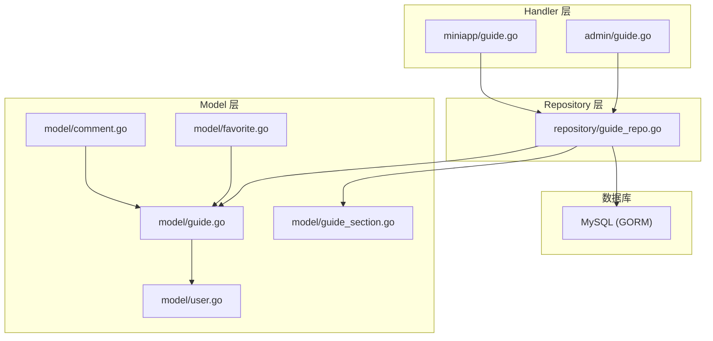
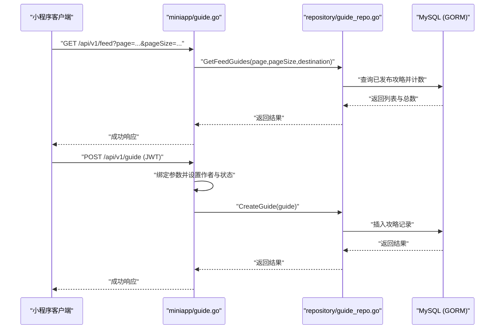
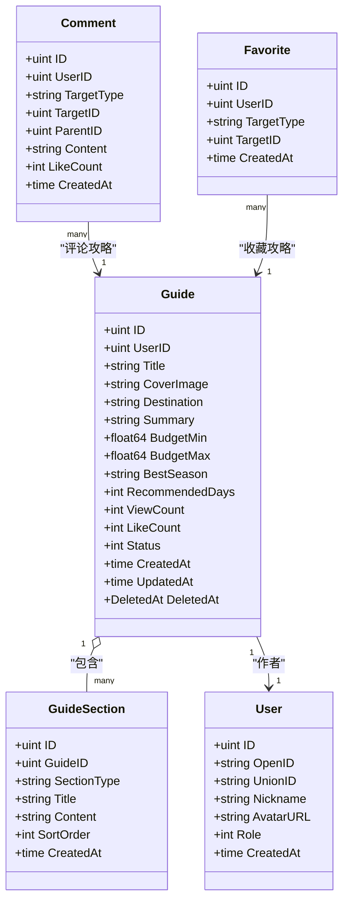

# 攻略模型(Guide)

<cite>
**本文引用的文件**
- [internal/model/guide.go](file://internal/model/guide.go)
- [internal/model/guide_section.go](file://internal/model/guide_section.go)
- [internal/repository/guide_repo.go](file://internal/repository/guide_repo.go)
- [internal/handler/miniapp/guide.go](file://internal/handler/miniapp/guide.go)
- [internal/handler/admin/guide.go](file://internal/handler/admin/guide.go)
- [internal/model/user.go](file://internal/model/user.go)
- [internal/model/comment.go](file://internal/model/comment.go)
- [internal/model/favorite.go](file://internal/model/favorite.go)
- [pkg/database/mysql.go](file://pkg/database/mysql.go)
- [README.md](file://README.md)
</cite>

## 目录
1. [简介](#简介)
2. [项目结构](#项目结构)
3. [核心组件](#核心组件)
4. [架构概览](#架构概览)
5. [详细组件分析](#详细组件分析)
6. [依赖分析](#依赖分析)
7. [性能考虑](#性能考虑)
8. [故障排查指南](#故障排查指南)
9. [结论](#结论)
10. [附录](#附录)

## 简介
本文件围绕“攻略模型”进行系统化技术文档整理，重点覆盖以下方面：
- Guide 结构体字段定义与约束
- 攻略内容分段结构 GuideSection 及其嵌套关系
- 审核状态、发布状态与权限控制机制
- 数据验证规则（长度、格式等）
- 查询优化策略与索引设计建议
- 与其他模型（用户、评论、收藏）的关系

## 项目结构
本项目采用分层架构：handler 层负责 API 入口与鉴权，repository 层封装数据库操作，model 层定义数据结构，middleware 提供 JWT 与权限校验。攻略模块位于 miniapp 与 admin 两个 handler 下，分别面向前端用户与后台管理。

图表来源
- [internal/handler/miniapp/guide.go:1-101](file://internal/handler/miniapp/guide.go#L1-L101)
- [internal/handler/admin/guide.go:1-62](file://internal/handler/admin/guide.go#L1-L62)
- [internal/repository/guide_repo.go:1-104](file://internal/repository/guide_repo.go#L1-L104)
- [internal/model/guide.go:1-28](file://internal/model/guide.go#L1-L28)
- [internal/model/guide_section.go:1-28](file://internal/model/guide_section.go#L1-L28)
- [internal/model/user.go:1-16](file://internal/model/user.go#L1-L16)
- [internal/model/comment.go:1-16](file://internal/model/comment.go#L1-L16)
- [internal/model/favorite.go:1-13](file://internal/model/favorite.go#L1-L13)

章节来源
- [internal/handler/miniapp/guide.go:1-101](file://internal/handler/miniapp/guide.go#L1-L101)
- [internal/handler/admin/guide.go:1-62](file://internal/handler/admin/guide.go#L1-L62)
- [internal/repository/guide_repo.go:1-104](file://internal/repository/guide_repo.go#L1-L104)
- [internal/model/guide.go:1-28](file://internal/model/guide.go#L1-L28)
- [internal/model/guide_section.go:1-28](file://internal/model/guide_section.go#L1-L28)
- [internal/model/user.go:1-16](file://internal/model/user.go#L1-L16)
- [internal/model/comment.go:1-16](file://internal/model/comment.go#L1-L16)
- [internal/model/favorite.go:1-13](file://internal/model/favorite.go#L1-L13)
- [pkg/database/mysql.go:1-91](file://pkg/database/mysql.go#L1-L91)

## 核心组件
- Guide 攻略主表：包含标题、封面、目的地、摘要、预算区间、最佳季节、建议天数、浏览量、点赞数、状态、软删除等字段。
- GuideSection 攻略板块：按板块类型组织内容，支持排序与批量创建。
- Repository 层：提供瀑布流查询、详情查询、状态变更、浏览量递增、板块 CRUD 与重排等方法。
- Handler 层：小程序端提供瀑布流、发布、详情（含板块）、新增板块；后台提供列表与审核状态变更。

章节来源
- [internal/model/guide.go:9-27](file://internal/model/guide.go#L9-L27)
- [internal/model/guide_section.go:18-27](file://internal/model/guide_section.go#L18-L27)
- [internal/repository/guide_repo.go:10-104](file://internal/repository/guide_repo.go#L10-L104)
- [internal/handler/miniapp/guide.go:13-101](file://internal/handler/miniapp/guide.go#L13-L101)
- [internal/handler/admin/guide.go:12-62](file://internal/handler/admin/guide.go#L12-L62)

## 架构概览
下图展示了“攻略”从请求到持久化的整体流程，以及与用户、评论、收藏的关联。

图表来源
- [internal/handler/miniapp/guide.go:13-53](file://internal/handler/miniapp/guide.go#L13-L53)
- [internal/repository/guide_repo.go:12-29](file://internal/repository/guide_repo.go#L12-L29)

章节来源
- [internal/handler/miniapp/guide.go:13-53](file://internal/handler/miniapp/guide.go#L13-L53)
- [internal/repository/guide_repo.go:12-29](file://internal/repository/guide_repo.go#L12-L29)

## 详细组件分析

### Guide 结构体字段定义与约束
- 主键与时间戳：ID、CreatedAt、UpdatedAt、DeletedAt（软删除）
- 作者：UserID 关联用户
- 基础信息：Title、CoverImage、Destination、Summary
- 预算与季节：BudgetMin/BudgetMax（decimal），BestSeason
- 建议天数：RecommendedDays
- 统计指标：ViewCount、LikeCount
- 状态：Status（0草稿/1已发布/2下架）
- 约束与索引：Title/CoverImage/Destination/Summary/BestSeason 等字段通过 GORM 注解限制长度；DeletedAt 带索引

章节来源
- [internal/model/guide.go:9-27](file://internal/model/guide.go#L9-L27)

### GuideSection 分段结构与内容组织
- 板块类型常量：overview、transport、hotel、food、attraction、itinerary、budget、tips、custom
- 字段：GuideID（所属攻略）、SectionType、Title、Content（text）、SortOrder、CreatedAt
- 关系：一个 Guide 可包含多个 GuideSection，按 SortOrder 升序排列
- 操作：创建、更新、删除、批量创建、重排

章节来源
- [internal/model/guide_section.go:5-16](file://internal/model/guide_section.go#L5-L16)
- [internal/model/guide_section.go:18-27](file://internal/model/guide_section.go#L18-L27)
- [internal/repository/guide_repo.go:64-103](file://internal/repository/guide_repo.go#L64-L103)

### 审核状态、发布状态与权限控制
- 状态枚举：0 草稿、1 已发布、2 下架
- 小程序端发布：默认状态为草稿，由作者创建
- 后台审核：管理员通过接口更新状态为“已发布”或“下架”
- 权限控制：后台接口均需管理员 JWT 认证

章节来源
- [internal/handler/miniapp/guide.go:33-53](file://internal/handler/miniapp/guide.go#L33-L53)
- [internal/handler/admin/guide.go:31-62](file://internal/handler/admin/guide.go#L31-L62)
- [internal/model/guide.go:23](file://internal/model/guide.go#L23)

### 数据验证规则
- 字段长度限制：通过 GORM 注解对字符串字段长度进行约束
- 参数绑定：Handler 层使用 ShouldBindJSON 对请求体进行绑定与错误处理
- 状态范围：后台审核仅允许 1（已发布）与 2（下架）

章节来源
- [internal/model/guide.go:13-19](file://internal/model/guide.go#L13-L19)
- [internal/handler/miniapp/guide.go:42-44](file://internal/handler/miniapp/guide.go#L42-L44)
- [internal/handler/admin/guide.go:48-54](file://internal/handler/admin/guide.go#L48-L54)

### 查询优化策略与索引设计
- 已有索引：DeletedAt 字段带索引（软删除）
- 建议索引：
  - status：用于按状态过滤（如瀑布流只取已发布）
  - destination：用于按目的地筛选
  - user_id：用于按作者查询
  - created_at：用于按时间倒序分页
- 分页与排序：Repository 已实现 offset/limit 与 order by created_at desc
- 计数与分页：先 Count 再查询，避免一次性加载全部数据

章节来源
- [internal/model/guide.go:26](file://internal/model/guide.go#L26)
- [internal/repository/guide_repo.go:13-24](file://internal/repository/guide_repo.go#L13-L24)
- [internal/repository/guide_repo.go:42-49](file://internal/repository/guide_repo.go#L42-L49)

### 与其他模型的关系
- 与用户（User）：Guide.UserID 关联作者；详情页若非作者则增加浏览量
- 与评论（Comment）：目标类型为 guide，评论与攻略形成一对多
- 与收藏（Favorite）：目标类型为 guide，收藏与攻略形成一对多

章节来源
- [internal/handler/miniapp/guide.go:74-78](file://internal/handler/miniapp/guide.go#L74-L78)
- [internal/model/comment.go:9](file://internal/model/comment.go#L9)
- [internal/model/favorite.go:9](file://internal/model/favorite.go#L9)

## 依赖分析
- Handler 依赖 Repository
- Repository 依赖 GORM 持久化
- Model 依赖 GORM 注解与标签
- 数据库初始化在 mysql.go 中完成，包含 Guide 与 GuideSection 的自动迁移

图表来源
- [internal/model/guide.go:9-27](file://internal/model/guide.go#L9-L27)
- [internal/model/guide_section.go:18-27](file://internal/model/guide_section.go#L18-L27)
- [internal/model/user.go:6-15](file://internal/model/user.go#L6-L15)
- [internal/model/comment.go:5-15](file://internal/model/comment.go#L5-L15)
- [internal/model/favorite.go:5-12](file://internal/model/favorite.go#L5-L12)

章节来源
- [internal/model/guide.go:9-27](file://internal/model/guide.go#L9-L27)
- [internal/model/guide_section.go:18-27](file://internal/model/guide_section.go#L18-L27)
- [internal/model/user.go:6-15](file://internal/model/user.go#L6-L15)
- [internal/model/comment.go:5-15](file://internal/model/comment.go#L5-L15)
- [internal/model/favorite.go:5-12](file://internal/model/favorite.go#L5-L12)

## 性能考虑
- 分页查询：Repository 已实现 offset/limit，建议结合索引提升性能
- 瀑布流场景：按 created_at desc 排序，建议 destination 与 status 建立复合索引
- 浏览量更新：使用表达式递增，避免并发竞争带来的数据不一致
- 批量操作：支持批量创建板块，减少多次往返

章节来源
- [internal/repository/guide_repo.go:13-24](file://internal/repository/guide_repo.go#L13-L24)
- [internal/repository/guide_repo.go:56-60](file://internal/repository/guide_repo.go#L56-L60)
- [internal/repository/guide_repo.go:88-90](file://internal/repository/guide_repo.go#L88-L90)

## 故障排查指南
- 参数绑定失败：检查请求体 JSON 是否符合 Guide/GuideSection 结构
- 未授权访问：确认后台接口是否携带有效 JWT
- 状态非法：后台审核仅允许 1（已发布）与 2（下架）
- 数据库连接失败：检查环境变量与数据库初始化日志

章节来源
- [internal/handler/miniapp/guide.go:42-44](file://internal/handler/miniapp/guide.go#L42-L44)
- [internal/handler/admin/guide.go:48-54](file://internal/handler/admin/guide.go#L48-L54)
- [pkg/database/mysql.go:20-37](file://pkg/database/mysql.go#L20-L37)

## 结论
攻略模型以清晰的字段定义与分段结构支撑了“决策参考型内容”的组织与呈现。配合后台审核与权限控制，实现了从草稿到发布的完整生命周期管理。建议在生产环境中补充必要的复合索引与缓存策略，进一步提升查询与写入性能。

## 附录
- API 概览与认证方式可参考项目 README 的 API 概览与后台管理接口部分

章节来源
- [README.md:154-205](file://README.md#L154-L205)