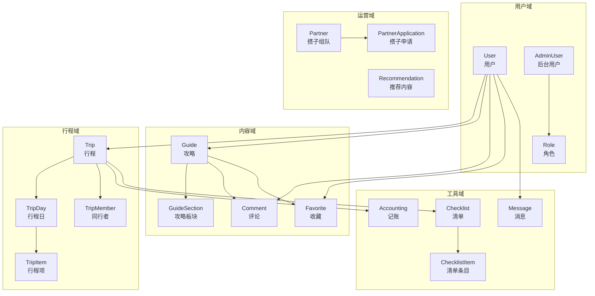
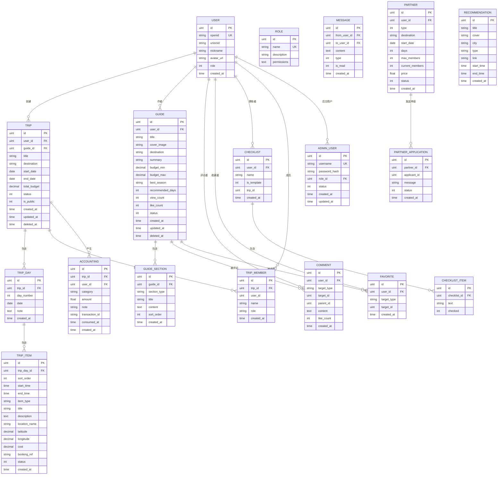
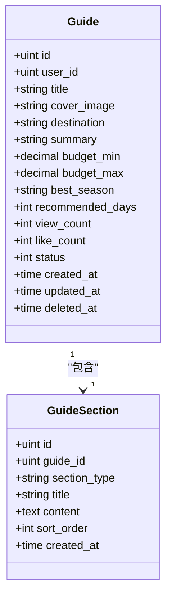
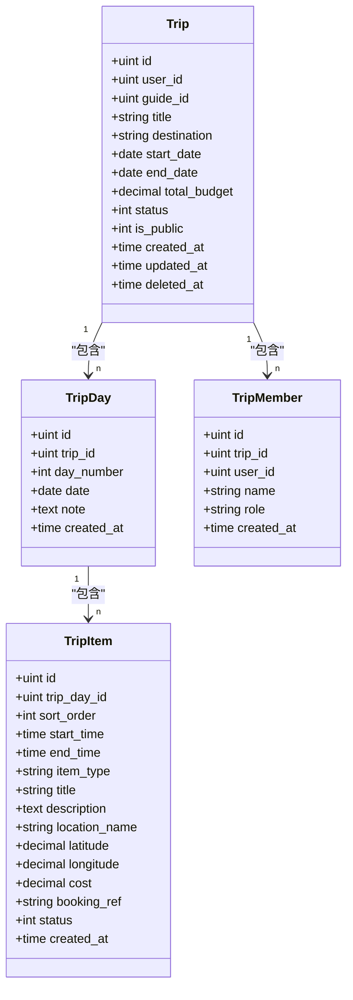

# 数据模型设计

<cite>
**本文引用的文件**
- [internal/model/user.go](file://internal/model/user.go)
- [internal/model/guide.go](file://internal/model/guide.go)
- [internal/model/guide_section.go](file://internal/model/guide_section.go)
- [internal/model/trip.go](file://internal/model/trip.go)
- [internal/model/trip_day.go](file://internal/model/trip_day.go)
- [internal/model/trip_item.go](file://internal/model/trip_item.go)
- [internal/model/comment.go](file://internal/model/comment.go)
- [internal/model/favorite.go](file://internal/model/favorite.go)
- [internal/model/checklist.go](file://internal/model/checklist.go)
- [internal/model/accounting.go](file://internal/model/accounting.go)
- [internal/model/message.go](file://internal/model/message.go)
- [internal/model/partner.go](file://internal/model/partner.go)
- [internal/model/recommendation.go](file://internal/model/recommendation.go)
- [internal/model/admin_user.go](file://internal/model/admin_user.go)
- [internal/model/role.go](file://internal/model/role.go)
</cite>

## 目录
1. [简介](#简介)
2. [项目结构](#项目结构)
3. [核心组件](#核心组件)
4. [架构总览](#架构总览)
5. [详细组件分析](#详细组件分析)
6. [依赖分析](#依赖分析)
7. [性能考虑](#性能考虑)
8. [故障排查指南](#故障排查指南)
9. [结论](#结论)
10. [附录](#附录)

## 简介
本文件面向旅行社交平台的数据模型设计，聚焦于核心实体与关联关系，明确字段的数据类型、约束与业务含义，并给出索引策略、性能优化建议、ER 图与迁移/版本管理策略。本文以 GORM 注解为依据，结合模型间的外键与关联映射，构建从用户到行程、攻略、评论、收藏、记账、消息、搭子等全链路数据视图。

## 项目结构
- 模型层位于 internal/model，采用按功能域分层的文件组织，便于维护与扩展。
- 关键模型围绕“用户”“攻略”“行程”“评论/收藏”“记账/清单”“消息/搭子/推荐/后台管理”展开。
- 外键与关联通过 GORM 的 foreignKey 标签声明，形成清晰的一对多/一对一关系。



图表来源
- [internal/model/user.go:6-15](file://internal/model/user.go#L6-L15)
- [internal/model/admin_user.go:5-15](file://internal/model/admin_user.go#L5-L15)
- [internal/model/role.go:3-9](file://internal/model/role.go#L3-L9)
- [internal/model/guide.go:9-27](file://internal/model/guide.go#L9-L27)
- [internal/model/guide_section.go:18-27](file://internal/model/guide_section.go#L18-L27)
- [internal/model/comment.go:5-15](file://internal/model/comment.go#L5-L15)
- [internal/model/favorite.go:5-12](file://internal/model/favorite.go#L5-L12)
- [internal/model/trip.go:9-37](file://internal/model/trip.go#L9-L37)
- [internal/model/trip_day.go:5-15](file://internal/model/trip_day.go#L5-L15)
- [internal/model/trip_item.go:5-22](file://internal/model/trip_item.go#L5-L22)
- [internal/model/accounting.go:5-16](file://internal/model/accounting.go#L5-L16)
- [internal/model/checklist.go:5-22](file://internal/model/checklist.go#L5-L22)
- [internal/model/message.go:5-14](file://internal/model/message.go#L5-L14)
- [internal/model/partner.go:5-29](file://internal/model/partner.go#L5-L29)
- [internal/model/recommendation.go:5-16](file://internal/model/recommendation.go#L5-L16)

章节来源
- [internal/model/user.go:1-16](file://internal/model/user.go#L1-L16)
- [internal/model/guide.go:1-28](file://internal/model/guide.go#L1-L28)
- [internal/model/trip.go:1-38](file://internal/model/trip.go#L1-L38)

## 核心组件
本节对关键实体进行字段级说明，包括数据类型、约束与业务含义。

- User（用户）
  - 字段与约束：主键、唯一索引 OpenID、可空 UnionID、昵称长度限制、头像 URL 长度限制、角色默认值、时间戳。
  - 业务含义：平台用户主体，微信授权登录，角色区分普通用户、领队、管理员。
  - 参考路径：[internal/model/user.go:6-15](file://internal/model/user.go#L6-L15)

- Guide（攻略）
  - 字段与约束：主键、作者外键、标题/封面/目的地/摘要长度限制、预算 decimal(10,2)、最佳季节长度限制、浏览/点赞计数默认 0、状态枚举、软删除索引。
  - 业务含义：目的地综合参考内容，支持草稿/发布/下架状态流转。
  - 参考路径：[internal/model/guide.go:9-27](file://internal/model/guide.go#L9-L27)

- GuideSection（攻略板块）
  - 字段与约束：主键、所属攻略外键、板块类型枚举集合、标题/内容长度限制、排序序号。
  - 业务含义：将攻略拆分为概览、交通、住宿、美食、景点、日程、预算、避坑、自定义等板块。
  - 参考路径：[internal/model/guide_section.go:18-27](file://internal/model/guide_section.go#L18-L27)

- Trip（行程）
  - 字段与约束：主键、创建者外键、可空关联攻略、标题/目的地长度限制、日期列 date、总预算 decimal(10,2)、状态枚举、公开性、软删除索引；关联 Days 与 Members。
  - 业务含义：按时间线组织的执行计划，支持计划中/进行中/已完成状态。
  - 参考路径：[internal/model/trip.go:9-37](file://internal/model/trip.go#L9-L37)

- TripDay（行程日）
  - 字段与约束：主键、所属行程外键、第几天、日期列 date、备注 text、关联 TripItem。
  - 业务含义：行程的时间切片，承载当日安排。
  - 参考路径：[internal/model/trip_day.go:5-15](file://internal/model/trip_day.go#L5-L15)

- TripItem（行程项）
  - 字段与约束：主键、所属行程日外键、排序序号、时间列 time、类型枚举、标题/地点长度限制、经纬度 decimal(10,7)、预算 decimal(10,2)、预订单号长度限制、状态枚举。
  - 业务含义：行程的最小执行单元，涵盖交通/景点/用餐/住宿/自由活动等。
  - 参考路径：[internal/model/trip_item.go:5-22](file://internal/model/trip_item.go#L5-L22)

- Comment（评论）
  - 字段与约束：主键、评论者外键、目标类型枚举（guide/trip）、目标 ID、父评论 ID（支持回复）、内容 text、点赞数默认 0。
  - 业务含义：对攻略/行程的评论与回复体系。
  - 参考路径：[internal/model/comment.go:5-15](file://internal/model/comment.go#L5-L15)

- Favorite（收藏）
  - 字段与约束：主键、用户外键、联合唯一索引（用户+目标类型+目标 ID）。
  - 业务含义：用户对攻略/行程的收藏去重。
  - 参考路径：[internal/model/favorite.go:5-12](file://internal/model/favorite.go#L5-L12)

- Checklist（清单）
  - 字段与约束：主键、用户外键、清单名长度限制、是否模板、关联 Trip、关联 ChecklistItem。
  - 业务含义：行程前准备清单，支持模板化。
  - 参考路径：[internal/model/checklist.go:5-22](file://internal/model/checklist.go#L5-L22)

- ChecklistItem（清单条目）
  - 字段与约束：主键、所属清单外键、条目文本长度限制、勾选状态。
  - 业务含义：清单的具体条目。
  - 参考路径：[internal/model/checklist.go:16-22](file://internal/model/checklist.go#L16-L22)

- Accounting（记账）
  - 字段与约束：主键、关联行程与用户、分类枚举、金额、备注长度限制、微信交易单号长度限制、消费时间。
  - 业务含义：行程内费用分摊与记录。
  - 参考路径：[internal/model/accounting.go:5-16](file://internal/model/accounting.go#L5-L16)

- Message（消息）
  - 字段与约束：主键、发送者/接收者外键、内容 text、消息类型枚举、已读状态默认 0。
  - 业务含义：私聊与系统通知。
  - 参考路径：[internal/model/message.go:5-14](file://internal/model/message.go#L5-L14)

- Partner / PartnerApplication（搭子）
  - 字段与约束：主键、发起人/活动类型、目的地/天数/人数/价格、要求 text、状态枚举；申请记录含状态与留言。
  - 业务含义：用户自发或官方发起的结伴出行招募与审核。
  - 参考路径：[internal/model/partner.go:5-29](file://internal/model/partner.go#L5-L29)

- Recommendation（推荐内容）
  - 字段与约束：主键、标题/封面/城市/类型/跳转链接、展示起止时间。
  - 业务含义：后台投放的运营推荐位。
  - 参考路径：[internal/model/recommendation.go:5-16](file://internal/model/recommendation.go#L5-L16)

- AdminUser / Role（后台管理）
  - 字段与约束：主键、用户名唯一索引、密码哈希、角色外键、角色名唯一索引、权限 JSON 文本、状态枚举。
  - 业务含义：后台用户与权限控制。
  - 参考路径：[internal/model/admin_user.go:5-15](file://internal/model/admin_user.go#L5-L15)
  - 参考路径：[internal/model/role.go:3-9](file://internal/model/role.go#L3-L9)

章节来源
- [internal/model/user.go:6-15](file://internal/model/user.go#L6-L15)
- [internal/model/guide.go:9-27](file://internal/model/guide.go#L9-L27)
- [internal/model/guide_section.go:18-27](file://internal/model/guide_section.go#L18-L27)
- [internal/model/trip.go:9-37](file://internal/model/trip.go#L9-L37)
- [internal/model/trip_day.go:5-15](file://internal/model/trip_day.go#L5-L15)
- [internal/model/trip_item.go:5-22](file://internal/model/trip_item.go#L5-L22)
- [internal/model/comment.go:5-15](file://internal/model/comment.go#L5-L15)
- [internal/model/favorite.go:5-12](file://internal/model/favorite.go#L5-L12)
- [internal/model/checklist.go:5-22](file://internal/model/checklist.go#L5-L22)
- [internal/model/accounting.go:5-16](file://internal/model/accounting.go#L5-L16)
- [internal/model/message.go:5-14](file://internal/model/message.go#L5-L14)
- [internal/model/partner.go:5-29](file://internal/model/partner.go#L5-L29)
- [internal/model/recommendation.go:5-16](file://internal/model/recommendation.go#L5-L16)
- [internal/model/admin_user.go:5-15](file://internal/model/admin_user.go#L5-L15)
- [internal/model/role.go:3-9](file://internal/model/role.go#L3-L9)

## 架构总览
以下 ER 图展示核心实体与外键关系，标注参照完整性与典型基数：



图表来源
- [internal/model/user.go:6-15](file://internal/model/user.go#L6-L15)
- [internal/model/admin_user.go:5-15](file://internal/model/admin_user.go#L5-L15)
- [internal/model/role.go:3-9](file://internal/model/role.go#L3-L9)
- [internal/model/guide.go:9-27](file://internal/model/guide.go#L9-L27)
- [internal/model/guide_section.go:18-27](file://internal/model/guide_section.go#L18-L27)
- [internal/model/trip.go:9-37](file://internal/model/trip.go#L9-L37)
- [internal/model/trip_day.go:5-15](file://internal/model/trip_day.go#L5-L15)
- [internal/model/trip_item.go:5-22](file://internal/model/trip_item.go#L5-L22)
- [internal/model/comment.go:5-15](file://internal/model/comment.go#L5-L15)
- [internal/model/favorite.go:5-12](file://internal/model/favorite.go#L5-L12)
- [internal/model/checklist.go:5-22](file://internal/model/checklist.go#L5-L22)
- [internal/model/accounting.go:5-16](file://internal/model/accounting.go#L5-L16)
- [internal/model/message.go:5-14](file://internal/model/message.go#L5-L14)
- [internal/model/partner.go:5-29](file://internal/model/partner.go#L5-L29)

## 详细组件分析

### 用户与后台管理
- User 与 AdminUser/Role
  - 关系：一对一（AdminUser.RoleID -> Role.ID），用户可拥有后台账号。
  - 约束：用户名唯一索引；角色权限以 JSON 存储，便于灵活扩展。
  - 参考路径：[internal/model/admin_user.go:5-15](file://internal/model/admin_user.go#L5-L15)
  - 参考路径：[internal/model/role.go:3-9](file://internal/model/role.go#L3-L9)

```mermaid
classDiagram
class User {
+uint id
+string openid
+string unionid
+string nickname
+string avatar_url
+int role
+time created_at
}
class AdminUser {
+uint id
+string username
+string password_hash
+uint role_id
+int status
+time created_at
+time updated_at
}
class Role {
+uint id
+string name
+string description
+text permissions
}
AdminUser --> Role : "外键"
User ||--o{ AdminUser : "拥有"
```

图表来源
- [internal/model/user.go:6-15](file://internal/model/user.go#L6-L15)
- [internal/model/admin_user.go:5-15](file://internal/model/admin_user.go#L5-L15)
- [internal/model/role.go:3-9](file://internal/model/role.go#L3-L9)

章节来源
- [internal/model/user.go:6-15](file://internal/model/user.go#L6-L15)
- [internal/model/admin_user.go:5-15](file://internal/model/admin_user.go#L5-L15)
- [internal/model/role.go:3-9](file://internal/model/role.go#L3-L9)

### 攻略与板块
- Guide 与 GuideSection
  - 关系：一对多（Guide -> GuideSection），按 SortOrder 排序。
  - 约束：板块类型枚举限定，内容支持富文本/Markdown。
  - 参考路径：[internal/model/guide.go:9-27](file://internal/model/guide.go#L9-L27)
  - 参考路径：[internal/model/guide_section.go:18-27](file://internal/model/guide_section.go#L18-L27)



图表来源
- [internal/model/guide.go:9-27](file://internal/model/guide.go#L9-L27)
- [internal/model/guide_section.go:18-27](file://internal/model/guide_section.go#L18-L27)

章节来源
- [internal/model/guide.go:9-27](file://internal/model/guide.go#L9-L27)
- [internal/model/guide_section.go:18-27](file://internal/model/guide_section.go#L18-L27)

### 行程、行程日与行程项
- Trip -> TripDay -> TripItem（一对多层级）
- TripMember（同行者）与 Trip（一对多）
- 关系要点：Trip 可关联 Guide；TripMember.UserID 可为空，支持非注册用户参与。
- 参考路径：[internal/model/trip.go:9-37](file://internal/model/trip.go#L9-L37)
- 参考路径：[internal/model/trip_day.go:5-15](file://internal/model/trip_day.go#L5-L15)
- 参考路径：[internal/model/trip_item.go:5-22](file://internal/model/trip_item.go#L5-L22)



图表来源
- [internal/model/trip.go:9-37](file://internal/model/trip.go#L9-L37)
- [internal/model/trip_day.go:5-15](file://internal/model/trip_day.go#L5-L15)
- [internal/model/trip_item.go:5-22](file://internal/model/trip_item.go#L5-L22)

章节来源
- [internal/model/trip.go:9-37](file://internal/model/trip.go#L9-L37)
- [internal/model/trip_day.go:5-15](file://internal/model/trip_day.go#L5-L15)
- [internal/model/trip_item.go:5-22](file://internal/model/trip_item.go#L5-L22)

### 评论与收藏
- Comment：支持对 Guide/Trip 的评论与回复（ParentID）。
- Favorite：联合唯一索引保证用户对同一目标仅收藏一次。
- 参考路径：[internal/model/comment.go:5-15](file://internal/model/comment.go#L5-L15)
- 参考路径：[internal/model/favorite.go:5-12](file://internal/model/favorite.go#L5-L12)

```mermaid
classDiagram
class Comment {
+uint id
+uint user_id
+string target_type
+uint target_id
+uint parent_id
+text content
+int like_count
+time created_at
}
class Favorite {
+uint id
+uint user_id
+string target_type
+uint target_id
+time created_at
}
User ||--o{ Comment : "评论者"
User ||--o{ Favorite : "收藏者"
Guide ||--o{ Comment : "被评论"
Trip ||--o{ Comment : "被评论"
Guide ||--o{ Favorite : "被收藏"
Trip ||--o{ Favorite : "被收藏"
```

图表来源
- [internal/model/comment.go:5-15](file://internal/model/comment.go#L5-L15)
- [internal/model/favorite.go:5-12](file://internal/model/favorite.go#L5-L12)

章节来源
- [internal/model/comment.go:5-15](file://internal/model/comment.go#L5-L15)
- [internal/model/favorite.go:5-12](file://internal/model/favorite.go#L5-L12)

### 记账、清单与消息
- Accounting：按行程维度记录费用，支持与用户关联。
- Checklist/ChecklistItem：行程前准备清单，支持模板化。
- Message：私聊与系统通知，含已读状态。
- 参考路径：[internal/model/accounting.go:5-16](file://internal/model/accounting.go#L5-L16)
- 参考路径：[internal/model/checklist.go:5-22](file://internal/model/checklist.go#L5-L22)
- 参考路径：[internal/model/message.go:5-14](file://internal/model/message.go#L5-L14)

```mermaid
classDiagram
class Accounting {
+uint id
+uint trip_id
+uint user_id
+string category
+float amount
+string note
+string transaction_id
+time consumed_at
+time created_at
}
class Checklist {
+uint id
+uint user_id
+string name
+int is_template
+uint trip_id
+time created_at
}
class ChecklistItem {
+uint id
+uint checklist_id
+string text
+int checked
}
class Message {
+uint id
+uint from_user_id
+uint to_user_id
+text content
+int type
+int is_read
+time created_at
}
Trip ||--o{ Accounting : "产生"
User ||--o{ Checklist : "拥有"
Checklist ||--o{ ChecklistItem : "包含"
User ||--o{ Message : "发送/接收"
```

图表来源
- [internal/model/accounting.go:5-16](file://internal/model/accounting.go#L5-L16)
- [internal/model/checklist.go:5-22](file://internal/model/checklist.go#L5-L22)
- [internal/model/message.go:5-14](file://internal/model/message.go#L5-L14)

章节来源
- [internal/model/accounting.go:5-16](file://internal/model/accounting.go#L5-L16)
- [internal/model/checklist.go:5-22](file://internal/model/checklist.go#L5-L22)
- [internal/model/message.go:5-14](file://internal/model/message.go#L5-L14)

### 搭子与推荐
- Partner：用户自发或官方发起的结伴招募，含最大人数、当前人数、价格与状态。
- PartnerApplication：申请记录，含状态与留言。
- Recommendation：后台推荐内容，含城市、类型、展示时间窗。
- 参考路径：[internal/model/partner.go:5-29](file://internal/model/partner.go#L5-L29)
- 参考路径：[internal/model/recommendation.go:5-16](file://internal/model/recommendation.go#L5-L16)

```mermaid
classDiagram
class Partner {
+uint id
+uint user_id
+int type
+string destination
+date start_date
+int days
+int max_members
+int current_members
+float price
+int status
+time created_at
}
class PartnerApplication {
+uint id
+uint partner_id
+uint applicant_id
+string message
+int status
+time created_at
}
class Recommendation {
+uint id
+string title
+string cover
+string city
+string type
+string link
+time start_time
+time end_time
+time created_at
}
Partner ||--o{ PartnerApplication : "发起申请"
```

图表来源
- [internal/model/partner.go:5-29](file://internal/model/partner.go#L5-L29)
- [internal/model/recommendation.go:5-16](file://internal/model/recommendation.go#L5-L16)

章节来源
- [internal/model/partner.go:5-29](file://internal/model/partner.go#L5-L29)
- [internal/model/recommendation.go:5-16](file://internal/model/recommendation.go#L5-L16)

## 依赖分析
- 外键与关联
  - User 与 Trip/Guide/Comment/Favorite/Checklist/Message/AdminUser 形成一对多或多对一。
  - Guide 与 GuideSection/Comment/Favorite 形成一对多。
  - Trip 与 TripDay/TripMember/Accounting 形成一对多。
  - TripDay 与 TripItem 形成一对多。
  - Checklist 与 ChecklistItem 形成一对多。
  - Partner 与 PartnerApplication 形成一对多。
- 软删除
  - Guide/Trip 使用 DeletedAt 索引实现软删除，避免物理删除带来的数据不可追溯。
- 关联加载
  - GORM 的 foreignKey 标签用于声明关系，便于查询时按需关联加载，降低 N+1 查询风险。

章节来源
- [internal/model/guide.go:26](file://internal/model/guide.go#L26)
- [internal/model/trip.go:23](file://internal/model/trip.go#L23)
- [internal/model/trip.go:25-26](file://internal/model/trip.go#L25-L26)
- [internal/model/trip_day.go:14](file://internal/model/trip_day.go#L14)

## 性能考虑
- 索引策略
  - 唯一索引：User.OpenID、AdminUser.Username、Favorite（用户+目标类型+目标 ID）联合唯一。
  - 软删除：Guide/Trip 的 DeletedAt 建有索引，便于按状态筛选与恢复。
  - 时间范围：Recommendation 的 startTime/end_time 适合建立复合索引以加速运营位展示。
  - 地理位置：Footprint 的 City/Province/Lat/Lng 可按查询模式建立组合索引（如城市+省/经纬度范围）。
- 查询优化
  - 关系查询使用 Preload/Joins，避免 N+1。
  - 对高频过滤字段（状态、类型、日期）建立合适索引。
- 写入优化
  - 批量插入 ChecklistItem、TripItem 时按 SortOrder/DayNumber 顺序写入，减少回表。
  - 记账与行程预算统计可异步聚合，避免强一致写放大。
- 缓存策略
  - 热门攻略/行程详情可缓存，结合版本号或 TTL 控制一致性。
- 分页与排序
  - 按 CreatedAt 或 SortOrder 分页，避免大偏移量导致的慢查询。

## 故障排查指南
- 常见问题
  - 重复收藏：检查 Favorite 的联合唯一索引是否生效，确保前端去重后再提交。
  - 软删除误删：确认 DeletedAt 查询逻辑，避免误查硬删除数据。
  - 行程项排序错乱：校验 SortOrder 更新流程，必要时批量重排。
  - 非注册用户参与：TripMember.UserID 可为空，注意空值处理与权限判定。
- 排查步骤
  - 核对 GORM 外键与标签是否匹配实际表结构。
  - 使用 EXPLAIN 分析慢查询，补充缺失索引。
  - 校验业务状态机（如 Status 枚举）转换是否符合预期。
- 参考路径
  - [internal/model/favorite.go:9-11](file://internal/model/favorite.go#L9-L11)
  - [internal/model/guide.go:26](file://internal/model/guide.go#L26)
  - [internal/model/trip.go:23](file://internal/model/trip.go#L23)

章节来源
- [internal/model/favorite.go:9-11](file://internal/model/favorite.go#L9-L11)
- [internal/model/guide.go:26](file://internal/model/guide.go#L26)
- [internal/model/trip.go:23](file://internal/model/trip.go#L23)

## 结论
本数据模型以 GORM 注解为契约，围绕用户、攻略、行程、评论/收藏、记账/清单、消息/搭子/推荐、后台管理构建了完整的旅行社交数据骨架。通过外键与软删除保障参照完整性和可恢复性，配合合理的索引与查询策略，满足高并发场景下的可用性与一致性需求。后续可在运营位、地理检索与统计聚合方面进一步细化索引与缓存策略。

## 附录
- 数据验证与业务规则（模型层面）
  - 枚举与默认值：角色、状态、类型等字段在模型层即有默认值与取值范围约束，减少业务层重复校验。
  - 长度与精度：标题/摘要/地址等字段设置合理长度；预算/经纬度等使用 decimal 保证精度。
  - 软删除：通过 DeletedAt 实现逻辑删除，避免数据丢失。
  - 关联完整性：foreignKey 标签明确外键关系，配合数据库外键约束（如存在）确保参照完整性。
- 数据迁移与版本管理策略
  - 版本化迁移：采用数据库迁移工具（如 goose/phinx）按版本推进，每次变更记录在案。
  - 回滚策略：针对结构变更与索引变更制定回滚脚本，保留数据安全。
  - 灰度发布：新字段与索引先灰度，逐步开放至全量，监控性能与稳定性。
  - 兼容性：新增字段尽量可空或提供默认值，避免影响存量数据。
- 参考路径
  - [internal/model/trip.go:18](file://internal/model/trip.go#L18)
  - [internal/model/trip_item.go:16-17](file://internal/model/trip_item.go#L16-L17)
  - [internal/model/guide.go:17-18](file://internal/model/guide.go#L17-L18)