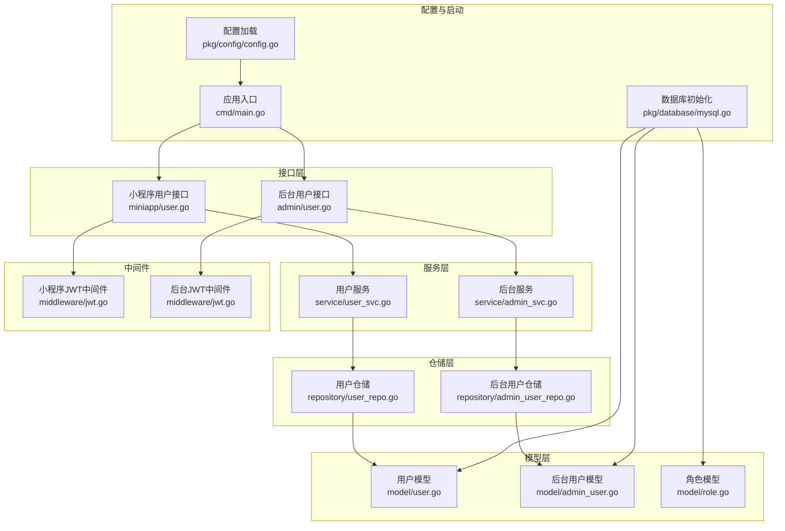
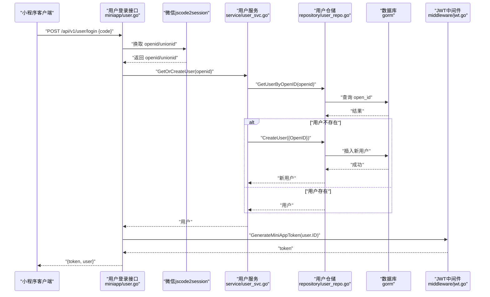
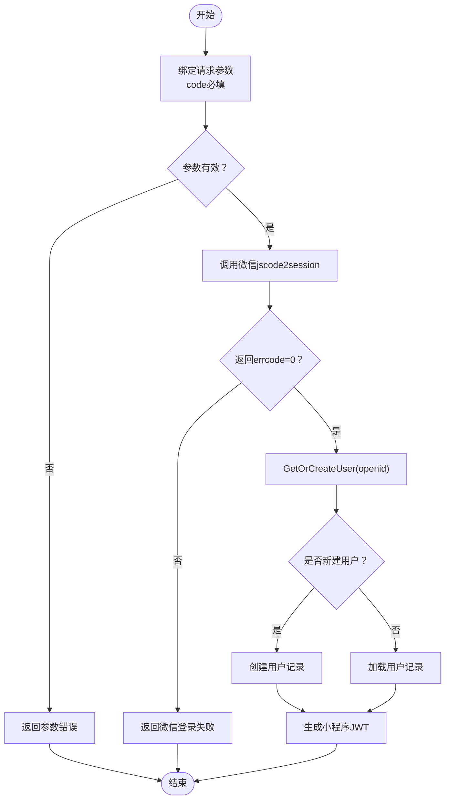
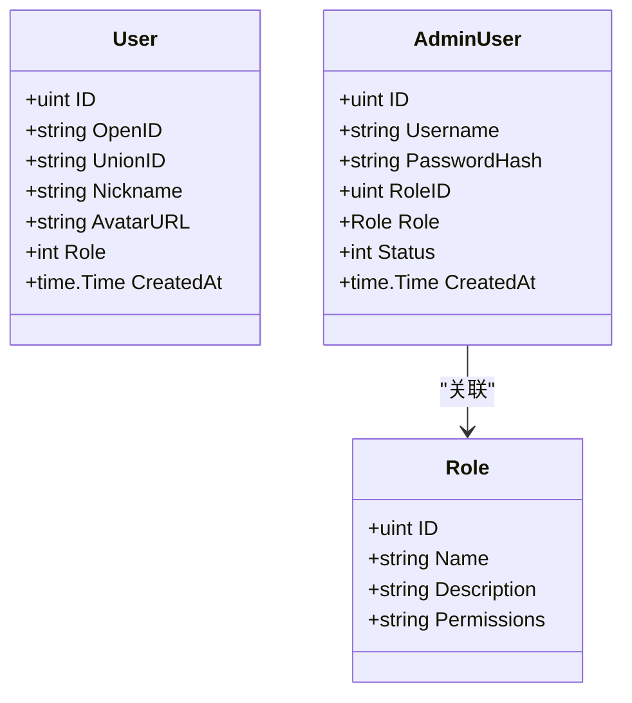
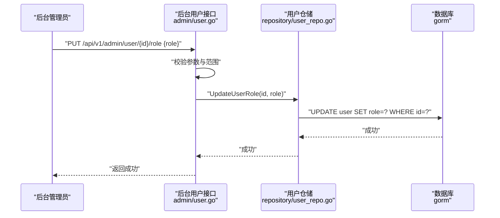
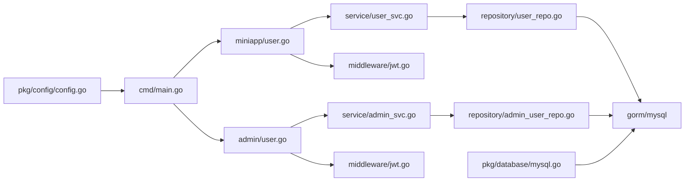

# 用户模型(User)

<cite>
**本文档引用的文件**
- [internal/model/user.go](file://internal/model/user.go)
- [internal/repository/user_repo.go](file://internal/repository/user_repo.go)
- [internal/service/user_svc.go](file://internal/service/user_svc.go)
- [internal/handler/miniapp/user.go](file://internal/handler/miniapp/user.go)
- [internal/handler/admin/user.go](file://internal/handler/admin/user.go)
- [internal/repository/admin_user_repo.go](file://internal/repository/admin_user_repo.go)
- [internal/service/admin_svc.go](file://internal/service/admin_svc.go)
- [internal/middleware/jwt.go](file://internal/middleware/jwt.go)
- [pkg/database/mysql.go](file://pkg/database/mysql.go)
- [pkg/config/config.go](file://pkg/config/config.go)
- [cmd/main.go](file://cmd/main.go)
</cite>

## 目录
1. [简介](#简介)
2. [项目结构](#项目结构)
3. [核心组件](#核心组件)
4. [架构总览](#架构总览)
5. [详细组件分析](#详细组件分析)
6. [依赖关系分析](#依赖关系分析)
7. [性能考虑](#性能考虑)
8. [故障排查指南](#故障排查指南)
9. [结论](#结论)
10. [附录](#附录)

## 简介
本文件围绕用户模型(User)进行系统化梳理，覆盖以下主题：
- User 结构体字段定义与约束：ID、OpenID、UnionID、Nickname、AvatarURL、Role 等字段的数据类型、长度限制与业务含义。
- 微信登录集成机制：通过临时 code 换取 openid 的流程、OpenID 与 UnionID 的区别及使用场景。
- 角色权限系统：普通用户、领队、管理员三层角色的权限差异与后台角色管理。
- 用户数据验证规则与业务约束：参数校验、角色范围校验、唯一性约束等。
- 用户模型 CRUD 操作示例与最佳实践：登录注册、查询、更新资料、后台角色变更。

## 项目结构
用户相关能力在以下层次组织：
- 模型层：定义 User 数据结构与数据库映射。
- 仓储层：封装数据库访问（查询、创建、分页、更新）。
- 服务层：编排业务逻辑（微信登录时的“查询或创建”）。
- 接口层：提供小程序端与后台管理端的 HTTP 接口。
- 中间件：小程序 JWT 认证与后台管理 JWT 认证。
- 配置与启动：加载配置、初始化数据库与路由注册。

**图表来源**
- [internal/handler/miniapp/user.go:1-116](file://internal/handler/miniapp/user.go#L1-L116)
- [internal/handler/admin/user.go:1-63](file://internal/handler/admin/user.go#L1-L63)
- [internal/service/user_svc.go:1-28](file://internal/service/user_svc.go#L1-L28)
- [internal/service/admin_svc.go:1-23](file://internal/service/admin_svc.go#L1-L23)
- [internal/repository/user_repo.go:1-44](file://internal/repository/user_repo.go#L1-L44)
- [internal/repository/admin_user_repo.go:1-43](file://internal/repository/admin_user_repo.go#L1-L43)
- [internal/model/user.go:1-16](file://internal/model/user.go#L1-L16)
- [internal/model/admin_user.go:1-16](file://internal/model/admin_user.go#L1-L16)
- [internal/model/role.go:1-10](file://internal/model/role.go#L1-L10)
- [internal/middleware/jwt.go:1-123](file://internal/middleware/jwt.go#L1-L123)
- [pkg/config/config.go:1-129](file://pkg/config/config.go#L1-L129)
- [pkg/database/mysql.go:1-91](file://pkg/database/mysql.go#L1-L91)
- [cmd/main.go:1-152](file://cmd/main.go#L1-L152)

**章节来源**
- [cmd/main.go:46-143](file://cmd/main.go#L46-L143)
- [pkg/database/mysql.go:39-60](file://pkg/database/mysql.go#L39-L60)

## 核心组件
本节聚焦用户模型的字段定义、微信登录集成、角色权限体系与数据验证规则。

- 字段定义与约束
  - ID：无符号整型主键，自增。
  - OpenID：字符串，长度上限 64，唯一索引；用于微信小程序登录标识。
  - UnionID：字符串，长度上限 64；用于微信多应用/公众号统一用户标识。
  - Nickname：字符串，长度上限 50；用户昵称。
  - AvatarURL：字符串，长度上限 500；用户头像链接。
  - Role：整型，默认 0；0 普通用户、1 领队、2 管理员。
  - CreatedAt：时间戳，记录创建时间。
- 微信登录集成
  - 客户端以临时 code 调用登录接口，服务端调用微信 jscode2session 接口换取 openid（以及可选的 unionid）。
  - 若用户不存在则自动注册（仅保存 openid），后续可通过更新资料完善信息。
- 角色权限系统
  - 小程序端角色：0 普通用户、1 领队、2 管理员（由后台接口更新）。
  - 后台角色：独立于小程序用户的角色模型，包含名称、描述与权限列表（JSON 字符串）。
- 数据验证规则
  - 登录请求：必须提供 code。
  - 更新用户角色：role 必须在 0~2 范围内。
  - 更新资料：昵称与头像链接为可选项，按需更新。
  - 微信 session 返回：errcode 非 0 或解析失败视为登录失败。

**章节来源**
- [internal/model/user.go:6-15](file://internal/model/user.go#L6-L15)
- [internal/handler/miniapp/user.go:19-75](file://internal/handler/miniapp/user.go#L19-L75)
- [internal/service/user_svc.go:12-27](file://internal/service/user_svc.go#L12-L27)
- [internal/handler/admin/user.go:32-62](file://internal/handler/admin/user.go#L32-L62)
- [internal/model/admin_user.go:5-15](file://internal/model/admin_user.go#L5-L15)
- [internal/model/role.go:3-9](file://internal/model/role.go#L3-L9)

## 架构总览
下图展示从客户端到数据库的完整调用链路，涵盖微信登录、用户查询/创建、JWT 颁发与后台角色更新。

**图表来源**
- [internal/handler/miniapp/user.go:28-51](file://internal/handler/miniapp/user.go#L28-L51)
- [internal/service/user_svc.go:13-26](file://internal/service/user_svc.go#L13-L26)
- [internal/repository/user_repo.go:9-21](file://internal/repository/user_repo.go#L9-L21)
- [internal/middleware/jwt.go:26-36](file://internal/middleware/jwt.go#L26-L36)

## 详细组件分析

### 用户模型字段详解
- ID：数据库主键，GORM 标注为主键，JSON 输出字段名为 id。
- OpenID：微信小程序登录标识，GORM 声明唯一索引与长度限制；作为用户登录的关键凭证。
- UnionID：微信多平台统一用户标识，长度限制与 OpenID 相同；可用于跨应用/公众号识别同一用户。
- Nickname：用户昵称，长度限制 50；用于展示与交互。
- AvatarURL：头像链接，长度限制 500；支持外链图片地址。
- Role：角色枚举，0 普通用户、1 领队、2 管理员；默认 0。
- CreatedAt：自动记录创建时间。

字段约束与业务含义总结：
- 唯一性：OpenID 唯一索引，确保一个小程序 openid 对应一个用户记录。
- 可空性：UnionID 可空；昵称与头像链接可空，允许后续完善资料。
- 默认值：Role 默认 0，表示普通用户。
- 长度限制：严格遵循 GORM size 约束，避免超长数据写入数据库。

**章节来源**
- [internal/model/user.go:7-14](file://internal/model/user.go#L7-L14)

### 微信登录集成机制
- 登录流程
  - 客户端提交 code 到 /api/v1/user/login。
  - 服务端调用微信官方接口换取 openid（以及可选 unionid）。
  - 若用户不存在，则自动创建用户（仅保存 openid）；若存在则直接返回用户信息。
  - 生成小程序 JWT 并返回给客户端。
- OpenID 与 UnionID 的区别与使用
  - OpenID：每个小程序/公众号的唯一标识，不同应用下同一用户 OpenID 不同。
  - UnionID：同一主体（同一微信开发者账号下的多个应用/公众号）下的统一标识。
  - 使用建议：若系统仅覆盖单一小程序，可用 OpenID；若需要跨应用/公众号统一用户，建议同时存储并使用 UnionID。

**图表来源**
- [internal/handler/miniapp/user.go:28-51](file://internal/handler/miniapp/user.go#L28-L51)
- [internal/service/user_svc.go:13-26](file://internal/service/user_svc.go#L13-L26)

**章节来源**
- [internal/handler/miniapp/user.go:19-75](file://internal/handler/miniapp/user.go#L19-L75)
- [internal/service/user_svc.go:12-27](file://internal/service/user_svc.go#L12-L27)

### 角色权限系统
- 小程序端角色
  - 0 普通用户：基础功能使用权限。
  - 1 领队：具备组织与管理行程的部分权限。
  - 2 管理员：最高权限，通常通过后台接口授予。
- 后台角色
  - 独立的角色模型，包含名称、描述与权限列表（JSON 字符串）。
  - 默认初始化两个角色：超级管理员（拥有全部权限）、内容编辑（部分运营权限）。
- 后台接口
  - 提供角色列表、创建、更新、删除。
  - 提供用户角色更新接口，限定 role 在 0~2 范围内。

**图表来源**
- [internal/model/user.go:7-14](file://internal/model/user.go#L7-L14)
- [internal/model/admin_user.go:6-14](file://internal/model/admin_user.go#L6-L14)
- [internal/model/role.go:4-9](file://internal/model/role.go#L4-L9)

**章节来源**
- [internal/handler/admin/user.go:32-62](file://internal/handler/admin/user.go#L32-L62)
- [internal/repository/admin_user_repo.go:8-20](file://internal/repository/admin_user_repo.go#L8-L20)
- [pkg/database/mysql.go:64-89](file://pkg/database/mysql.go#L64-L89)

### 用户数据验证规则与业务约束
- 登录接口
  - 请求体必须包含 code 字段，否则返回参数错误。
  - 微信返回 errcode 非 0 或解析失败，返回微信登录失败。
- 更新用户角色
  - 参数 role 必须在 0~2 范围内，否则返回无效角色值。
  - 仅允许管理员通过后台接口修改用户角色。
- 更新用户资料
  - 支持昵称与头像链接的可选更新，按需传参。
- 数据库约束
  - OpenID 唯一索引，防止重复注册。
  - 字段长度严格遵循 GORM size 约束。

**章节来源**
- [internal/handler/miniapp/user.go:28-51](file://internal/handler/miniapp/user.go#L28-L51)
- [internal/handler/admin/user.go:40-62](file://internal/handler/admin/user.go#L40-L62)
- [internal/repository/user_repo.go:9-16](file://internal/repository/user_repo.go#L9-L16)

### 用户模型 CRUD 操作示例与最佳实践
- 登录/注册（小程序）
  - 接口：POST /api/v1/user/login
  - 流程：校验 code → 调用微信接口 → 查询或创建用户 → 生成 JWT → 返回 token 与用户信息。
  - 最佳实践：对微信返回 errcode 做显式判断；对创建失败做幂等处理（避免并发重复创建）。
- 获取用户信息
  - 接口：GET /api/v1/user/info（需携带小程序 JWT）
  - 流程：JWT 解析 userID → 查询用户 → 返回用户信息。
- 更新用户资料
  - 接口：PUT /api/v1/user/profile（需携带小程序 JWT）
  - 流程：校验参数 → 更新 nickname 与 avatar_url → 返回成功。
- 后台更新用户角色
  - 接口：PUT /api/v1/admin/user/{id}/role
  - 流程：校验参数（id、role）→ 校验 role 范围 → 更新数据库 → 返回成功。
- 分页获取用户列表（后台）
  - 接口：GET /api/v1/admin/users?page=&pageSize=
  - 流程：分页参数解析 → 查询用户列表与总数 → 返回结果。

**图表来源**
- [internal/handler/admin/user.go:40-62](file://internal/handler/admin/user.go#L40-L62)
- [internal/repository/user_repo.go:40-43](file://internal/repository/user_repo.go#L40-L43)

**章节来源**
- [internal/handler/miniapp/user.go:77-115](file://internal/handler/miniapp/user.go#L77-L115)
- [internal/handler/admin/user.go:13-30](file://internal/handler/admin/user.go#L13-L30)
- [internal/repository/user_repo.go:30-38](file://internal/repository/user_repo.go#L30-L38)

## 依赖关系分析
- 组件耦合
  - 接口层依赖服务层；服务层依赖仓储层；仓储层依赖 GORM 与数据库。
  - JWT 中间件贯穿接口层，分别用于小程序用户与后台管理员鉴权。
- 外部依赖
  - 微信官方接口：jscode2session 用于换取 openid/unionid。
  - GORM：负责模型映射与数据库迁移。
  - Gin：HTTP 路由与控制器。
- 潜在循环依赖
  - 当前模块划分清晰，未发现循环依赖迹象。

**图表来源**
- [internal/handler/miniapp/user.go:1-116](file://internal/handler/miniapp/user.go#L1-L116)
- [internal/handler/admin/user.go:1-63](file://internal/handler/admin/user.go#L1-L63)
- [internal/service/user_svc.go:1-28](file://internal/service/user_svc.go#L1-L28)
- [internal/service/admin_svc.go:1-23](file://internal/service/admin_svc.go#L1-L23)
- [internal/repository/user_repo.go:1-44](file://internal/repository/user_repo.go#L1-L44)
- [internal/repository/admin_user_repo.go:1-43](file://internal/repository/admin_user_repo.go#L1-L43)
- [internal/middleware/jwt.go:1-123](file://internal/middleware/jwt.go#L1-L123)
- [pkg/database/mysql.go:1-91](file://pkg/database/mysql.go#L1-L91)
- [pkg/config/config.go:1-129](file://pkg/config/config.go#L1-L129)
- [cmd/main.go:1-152](file://cmd/main.go#L1-L152)

**章节来源**
- [cmd/main.go:46-143](file://cmd/main.go#L46-L143)
- [pkg/database/mysql.go:39-60](file://pkg/database/mysql.go#L39-L60)

## 性能考虑
- 数据库索引
  - OpenID 唯一索引，保证登录查询高效且去重。
  - 建议在高并发场景下对 OpenID 查询加缓存（如 Redis）以降低数据库压力。
- 查询优化
  - 用户列表分页查询使用 offset/limit，注意大数据量时的性能问题；可考虑基于游标或索引优化。
- JWT 令牌
  - 小程序 JWT 有效期一周，合理设置过期时间与刷新策略。
- 微信接口调用
  - jscode2session 属于外部依赖，建议增加超时与重试策略，并记录失败日志以便排查。

## 故障排查指南
- 登录失败
  - 检查 code 是否过期或非法；确认微信 AppId/AppSecret 配置正确；关注微信返回的 errcode。
- 用户不存在
  - 确认 OpenID 是否正确传入；检查数据库中是否已存在该 OpenID；避免并发重复创建。
- JWT 无效
  - 检查 Authorization 头格式（Bearer token）；确认密钥一致且未被篡改；核对 token 是否过期。
- 角色更新失败
  - 确认 role 值在 0~2 范围内；检查目标用户是否存在；查看数据库更新语句执行结果。
- 数据库迁移
  - 若表结构异常，检查 AutoMigrate 是否成功；确认 User/Role/AdminUser 表已创建。

**章节来源**
- [internal/handler/miniapp/user.go:37-50](file://internal/handler/miniapp/user.go#L37-L50)
- [internal/handler/admin/user.go:53-56](file://internal/handler/admin/user.go#L53-L56)
- [internal/middleware/jwt.go:48-65](file://internal/middleware/jwt.go#L48-L65)
- [pkg/database/mysql.go:39-60](file://pkg/database/mysql.go#L39-L60)

## 结论
本文档系统梳理了用户模型的字段定义、微信登录集成、角色权限体系与数据验证规则，并提供了 CRUD 操作示例与最佳实践。通过明确 OpenID/UnionID 的使用场景、严格的参数校验与合理的数据库设计，能够支撑小程序端的用户登录与资料管理，以及后台的角色与用户管理需求。建议在生产环境中结合缓存、监控与日志进一步提升稳定性与可观测性。

## 附录
- 配置项参考
  - 微信小程序 AppId 与 AppSecret：用于 jscode2session 调用。
  - 数据库连接：用于 GORM 初始化与 AutoMigrate。
- 路由注册参考
  - 小程序登录与用户相关接口在 main.go 中注册，均受相应 JWT 中间件保护。

**章节来源**
- [pkg/config/config.go:39-85](file://pkg/config/config.go#L39-L85)
- [cmd/main.go:46-143](file://cmd/main.go#L46-L143)