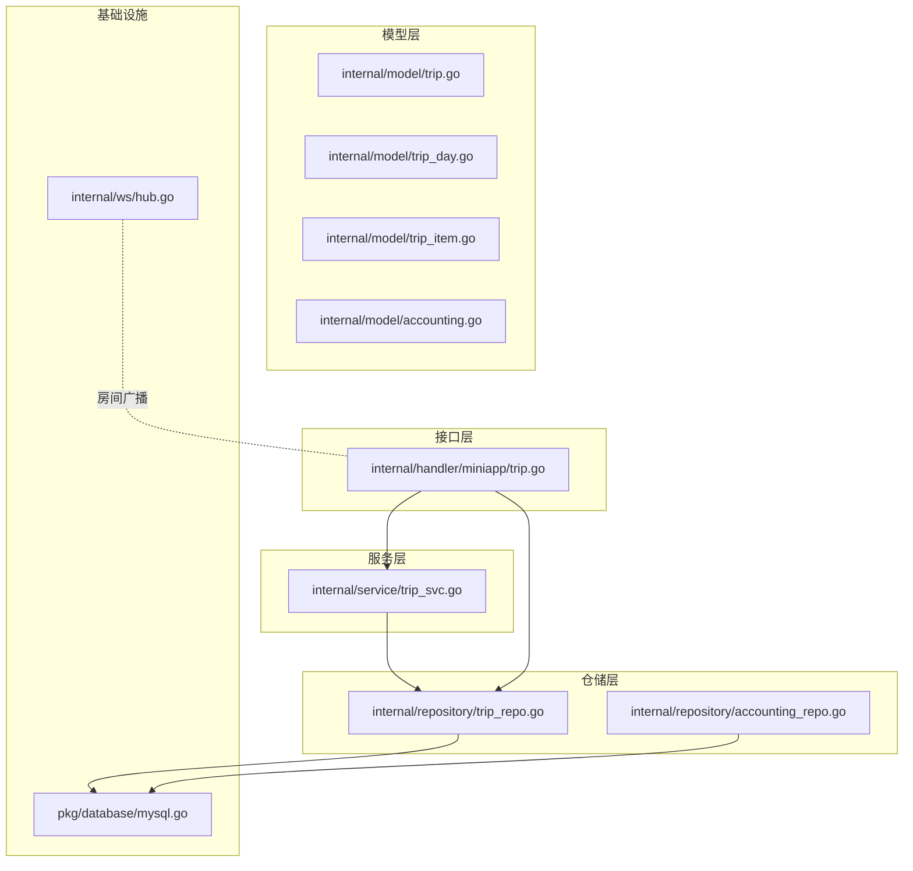
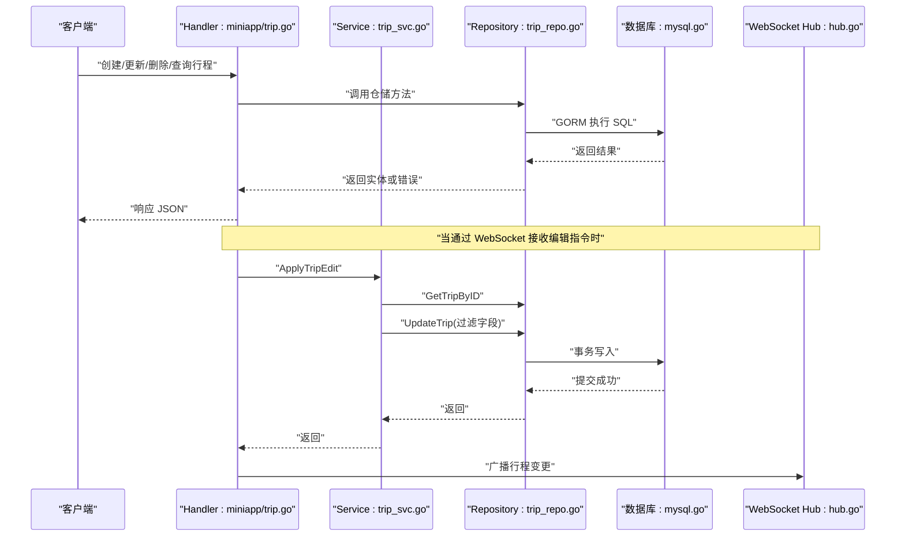
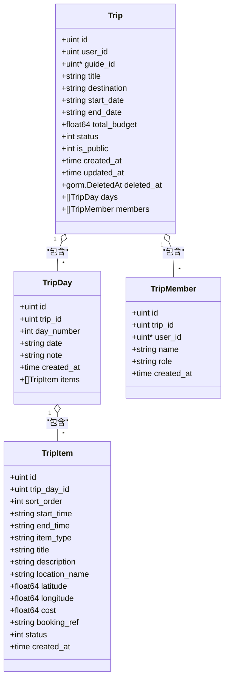
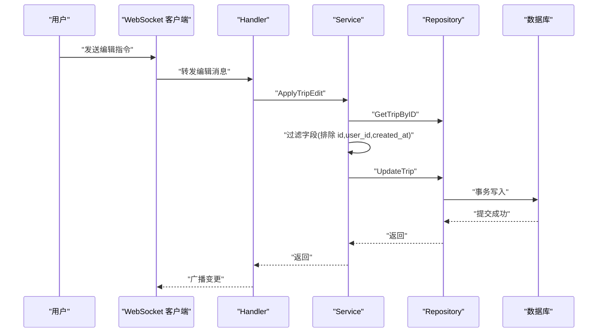
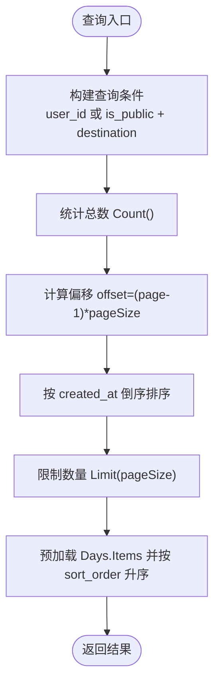
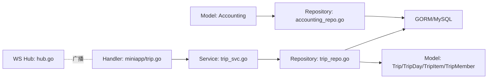

# 行程模型(Trip)

<cite>
**本文引用的文件**
- [trip.go](file://internal/model/trip.go)
- [trip_day.go](file://internal/model/trip_day.go)
- [trip_item.go](file://internal/model/trip_item.go)
- [trip_repo.go](file://internal/repository/trip_repo.go)
- [trip_svc.go](file://internal/service/trip_svc.go)
- [trip.go](file://internal/handler/miniapp/trip.go)
- [hub.go](file://internal/ws/hub.go)
- [mysql.go](file://pkg/database/mysql.go)
- [accounting.go](file://internal/model/accounting.go)
- [accounting_repo.go](file://internal/repository/accounting_repo.go)
</cite>

## 目录
1. [简介](#简介)
2. [项目结构](#项目结构)
3. [核心组件](#核心组件)
4. [架构总览](#架构总览)
5. [详细组件分析](#详细组件分析)
6. [依赖关系分析](#依赖关系分析)
7. [性能考虑](#性能考虑)
8. [故障排查指南](#故障排查指南)
9. [结论](#结论)
10. [附录](#附录)

## 简介
本文件系统性阐述“行程模型(Trip)”的设计与实现，覆盖以下关键主题：
- Trip 主模型字段定义与业务含义
- TripDay 与 TripItem 的嵌套关系与日程建模
- 协作编辑机制与权限管理
- 业务规则（时间冲突检查、预算控制等）现状与建议
- 查询优化与分页策略
- 与其他功能模块（记账、攻略、WebSocket）的集成关系

## 项目结构
行程模型位于 internal/model，配套仓储层在 internal/repository，服务层在 internal/service，HTTP 层在 internal/handler/miniapp，数据库初始化在 pkg/database，WebSocket 广播在 internal/ws。

图表来源
- [trip.go:1-38](file://internal/model/trip.go#L1-L38)
- [trip_day.go:1-16](file://internal/model/trip_day.go#L1-L16)
- [trip_item.go:1-23](file://internal/model/trip_item.go#L1-L23)
- [trip_repo.go:1-137](file://internal/repository/trip_repo.go#L1-L137)
- [trip_svc.go:1-19](file://internal/service/trip_svc.go#L1-L19)
- [trip.go:1-328](file://internal/handler/miniapp/trip.go#L1-L328)
- [mysql.go:1-91](file://pkg/database/mysql.go#L1-L91)
- [accounting.go:1-17](file://internal/model/accounting.go#L1-L17)
- [accounting_repo.go:1-18](file://internal/repository/accounting_repo.go#L1-L18)
- [hub.go:1-56](file://internal/ws/hub.go#L1-L56)

章节来源
- [trip.go:1-38](file://internal/model/trip.go#L1-L38)
- [trip_day.go:1-16](file://internal/model/trip_day.go#L1-L16)
- [trip_item.go:1-23](file://internal/model/trip_item.go#L1-L23)
- [trip_repo.go:1-137](file://internal/repository/trip_repo.go#L1-L137)
- [trip_svc.go:1-19](file://internal/service/trip_svc.go#L1-L19)
- [trip.go:1-328](file://internal/handler/miniapp/trip.go#L1-L328)
- [mysql.go:1-91](file://pkg/database/mysql.go#L1-L91)
- [accounting.go:1-17](file://internal/model/accounting.go#L1-L17)
- [accounting_repo.go:1-18](file://internal/repository/accounting_repo.go#L1-L18)
- [hub.go:1-56](file://internal/ws/hub.go#L1-L56)

## 核心组件
- Trip 主模型：承载行程基本信息（标题、目的地、日期、预算、状态、是否公开），以及一对多关联的行程日与同行者。
- TripDay 子模型：按天组织行程，包含日期、备注，并包含对 TripItem 的一对多关联。
- TripItem 子模型：行程的最小执行单元，包含时间窗口、类型、地点、成本、状态等。
- TripMember：同行者，支持角色（拥有者/编辑者/查看者）与非注册用户绑定。

章节来源
- [trip.go:9-37](file://internal/model/trip.go#L9-L37)
- [trip_day.go:5-15](file://internal/model/trip_day.go#L5-L15)
- [trip_item.go:5-22](file://internal/model/trip_item.go#L5-L22)

## 架构总览
下图展示从 HTTP 请求到数据库持久化与 WebSocket 广播的整体流程。

图表来源
- [trip.go:1-328](file://internal/handler/miniapp/trip.go#L1-L328)
- [trip_svc.go:7-18](file://internal/service/trip_svc.go#L7-L18)
- [trip_repo.go:12-37](file://internal/repository/trip_repo.go#L12-L37)
- [mysql.go:19-63](file://pkg/database/mysql.go#L19-L63)
- [hub.go:23-55](file://internal/ws/hub.go#L23-L55)

## 详细组件分析

### Trip 主模型字段定义
- 标识与归属
  - id：自增主键
  - user_id：行程创建者
  - guide_id：关联攻略（可空）
- 基本信息
  - title：标题，长度限制
  - destination：目的地，长度限制
  - start_date/end_date：出发与结束日期
  - total_budget：总预算，货币类型
  - status：状态枚举（计划中/进行中/已完成）
  - is_public：是否公开
- 时间戳与软删除
  - created_at/updated_at：自动维护
  - deleted_at：软删除索引
- 关联关系
  - days：一对多，行程日集合
  - members：一对多，同行者集合

章节来源
- [trip.go:10-27](file://internal/model/trip.go#L10-L27)

### TripDay 日程建模
- 标识与归属
  - id：自增主键
  - trip_id：所属行程
- 日程信息
  - day_number：第几天（1,2,3…）
  - date：具体日期
  - note：当天备注
- 关联关系
  - items：TripItem 的有序集合（按 sort_order）

章节来源
- [trip_day.go:6-14](file://internal/model/trip_day.go#L6-L14)

### TripItem 最小执行单元
- 标识与归属
  - id：自增主键
  - trip_day_id：所属行程日
- 排序与时间
  - sort_order：排序序号
  - start_time/end_time：开始/结束时间
- 类型与描述
  - item_type：类型枚举（交通/景点/餐食/住宿/自由）
  - title/description：标题与描述
- 地点与坐标
  - location_name：地点名称
  - latitude/longitude：地理坐标
- 成本与状态
  - cost：预估花费
  - booking_ref：预订单号
  - status：状态枚举（待确认/已确认/已完成）
- 时间戳
  - created_at：自动维护

章节来源
- [trip_item.go:6-22](file://internal/model/trip_item.go#L6-L22)

### 数据模型类图

图表来源
- [trip.go:9-37](file://internal/model/trip.go#L9-L37)
- [trip_day.go:5-15](file://internal/model/trip_day.go#L5-L15)
- [trip_item.go:5-22](file://internal/model/trip_item.go#L5-L22)

### 协作编辑机制与权限管理
- 权限控制
  - 行程更新接口对创建者进行权限校验；非创建者禁止修改。
- 协作编辑
  - 通过 WebSocket Hub 维护房间，向房间内连接广播行程变更。
  - 服务层 ApplyTripEdit 接收编辑消息，过滤敏感字段后更新数据库。
- 同行者角色
  - 支持为成员设置角色（拥有者/编辑者/查看者），便于扩展更细粒度权限。

图表来源
- [trip.go:140-169](file://internal/handler/miniapp/trip.go#L140-L169)
- [trip_svc.go:7-18](file://internal/service/trip_svc.go#L7-L18)
- [trip_repo.go:17-32](file://internal/repository/trip_repo.go#L17-L32)
- [hub.go:23-55](file://internal/ws/hub.go#L23-L55)

章节来源
- [trip.go:140-169](file://internal/handler/miniapp/trip.go#L140-L169)
- [trip_svc.go:7-18](file://internal/service/trip_svc.go#L7-L18)
- [trip_repo.go:17-32](file://internal/repository/trip_repo.go#L17-L32)
- [hub.go:10-55](file://internal/ws/hub.go#L10-L55)

### 业务规则现状与建议
- 时间冲突检查
  - 现状：未见显式的时间冲突校验逻辑。
  - 建议：在创建/更新 TripItem 时，按 TripDayID 与时间段进行交叉检查，避免同一日内的时间重叠。
- 预算控制
  - 现状：行程有 total_budget 字段，但未见自动汇总与校验逻辑。
  - 建议：在记账模块中统计行程实际花费并与 total_budget 对比，提供预警与上限控制。
- 状态流转
  - 现状：Trip.status 与 TripItem.status 均为简单枚举。
  - 建议：引入状态机以约束合法流转路径，确保业务一致性。
- 公开与隐私
  - 现状：is_public 控制公开可见性。
  - 建议：结合成员角色与权限策略，细化访问控制。

章节来源
- [trip.go:18-19](file://internal/model/trip.go#L18-L19)
- [trip_item.go:19-20](file://internal/model/trip_item.go#L19-L20)

### 查询优化与分页策略
- 分页
  - 用户行程列表：按 user_id 过滤，倒序分页。
  - 公开行程列表：按 is_public 过滤，可选目的地模糊匹配，倒序分页。
- 预加载
  - GetTripByID 使用 Preload 预加载 Days 与 Items，并按 sort_order 升序排列，减少 N+1 查询。
- 建议
  - 为 Trip.user_id、Trip.is_public、Trip.destination 建立索引以提升查询性能。
  - 在高频查询场景下，考虑缓存热门行程详情。

图表来源
- [trip_repo.go:39-62](file://internal/repository/trip_repo.go#L39-L62)
- [trip_repo.go:17-27](file://internal/repository/trip_repo.go#L17-L27)

章节来源
- [trip_repo.go:39-62](file://internal/repository/trip_repo.go#L39-L62)
- [trip_repo.go:17-27](file://internal/repository/trip_repo.go#L17-L27)

### 与其他功能模块的集成
- 记账模块
  - 行程与记账通过 Trip.id 与 Accounting.trip_id 关联。
  - 可基于此统计行程总花费，辅助预算控制。
- 攻略模块
  - Trip.guide_id 关联攻略，用于智能生成行程或复用推荐。
- WebSocket 广播
  - 通过 Hub 维护房间，向参与行程的所有用户实时推送变更。

章节来源
- [accounting.go:6-15](file://internal/model/accounting.go#L6-L15)
- [accounting_repo.go:8-13](file://internal/repository/accounting_repo.go#L8-L13)
- [trip.go:12-13](file://internal/model/trip.go#L12-L13)
- [hub.go:10-55](file://internal/ws/hub.go#L10-L55)

## 依赖关系分析
- 模型层
  - Trip 依赖 TripDay 与 TripMember
  - TripDay 依赖 TripItem
- 仓储层
  - 提供 CRUD 与批量操作，包含事务与排序重排
- 服务层
  - ApplyTripEdit 作为 WebSocket 编辑入口，负责字段过滤与更新
- 接口层
  - Handler 对外暴露 REST API，进行权限校验与参数绑定
- 基础设施
  - GORM 自动迁移 Trip/TripDay/TripItem/TripMember/Accounting 等模型

图表来源
- [trip.go:1-328](file://internal/handler/miniapp/trip.go#L1-L328)
- [trip_svc.go:1-19](file://internal/service/trip_svc.go#L1-L19)
- [trip_repo.go:1-137](file://internal/repository/trip_repo.go#L1-L137)
- [accounting_repo.go:1-18](file://internal/repository/accounting_repo.go#L1-L18)
- [accounting.go:1-17](file://internal/model/accounting.go#L1-L17)
- [mysql.go:39-60](file://pkg/database/mysql.go#L39-L60)
- [hub.go:1-56](file://internal/ws/hub.go#L1-L56)

章节来源
- [trip.go:1-328](file://internal/handler/miniapp/trip.go#L1-L328)
- [trip_svc.go:1-19](file://internal/service/trip_svc.go#L1-L19)
- [trip_repo.go:1-137](file://internal/repository/trip_repo.go#L1-L137)
- [accounting_repo.go:1-18](file://internal/repository/accounting_repo.go#L1-L18)
- [accounting.go:1-17](file://internal/model/accounting.go#L1-L17)
- [mysql.go:39-60](file://pkg/database/mysql.go#L39-L60)
- [hub.go:1-56](file://internal/ws/hub.go#L1-L56)

## 性能考虑
- 预加载与排序
  - GetTripByID 已使用 Preload 与排序，避免 N+1 查询与额外排序开销
- 分页与索引
  - 建议为 user_id、is_public、destination 建立索引，提升分页与筛选性能
- 批量操作
  - BatchCreateTripItems 支持批量插入，降低网络往返与事务开销
- 事务边界
  - 删除 TripDay 时先删除其下 TripItem，使用事务保证一致性

章节来源
- [trip_repo.go:17-27](file://internal/repository/trip_repo.go#L17-L27)
- [trip_repo.go:76-84](file://internal/repository/trip_repo.go#L76-L84)
- [trip_repo.go:103-106](file://internal/repository/trip_repo.go#L103-L106)

## 故障排查指南
- 权限错误
  - 症状：更新行程返回无权限
  - 排查：确认当前用户是否为行程创建者
- 字段过滤
  - 症状：请求成功但部分字段未更新
  - 排查：确认是否误传 id、user_id、created_at 等受保护字段
- 时间冲突
  - 症状：行程项保存失败或显示异常
  - 排查：检查同一日内的 start_time/end_time 是否重叠
- 预算超支
  - 症状：记账后预算不足
  - 排查：核对 total_budget 与实际记账合计
- WebSocket 不生效
  - 症状：编辑后未收到广播
  - 排查：确认房间加入与广播逻辑是否正确

章节来源
- [trip.go:147-152](file://internal/handler/miniapp/trip.go#L147-L152)
- [trip_svc.go:13-17](file://internal/service/trip_svc.go#L13-L17)
- [trip_repo.go:76-84](file://internal/repository/trip_repo.go#L76-L84)
- [accounting_repo.go:8-13](file://internal/repository/accounting_repo.go#L8-L13)
- [hub.go:23-55](file://internal/ws/hub.go#L23-L55)

## 结论
本行程模型采用清晰的一对多层级设计，Trip 作为顶层容器，TripDay 与 TripItem 构成可执行的日程与活动单元。权限控制与 WebSocket 广播提供了基础的协作能力。建议后续补充时间冲突与预算控制等业务规则，并完善索引与缓存策略以提升性能与稳定性。

## 附录
- 数据库初始化会自动迁移 Trip/TripDay/TripItem/TripMember/Accounting 等模型，确保表结构一致。
- 记账模块与行程强关联，可用于预算控制与成本归集。

章节来源
- [mysql.go:39-60](file://pkg/database/mysql.go#L39-L60)
- [accounting.go:6-15](file://internal/model/accounting.go#L6-L15)