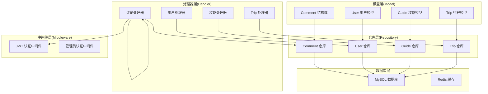
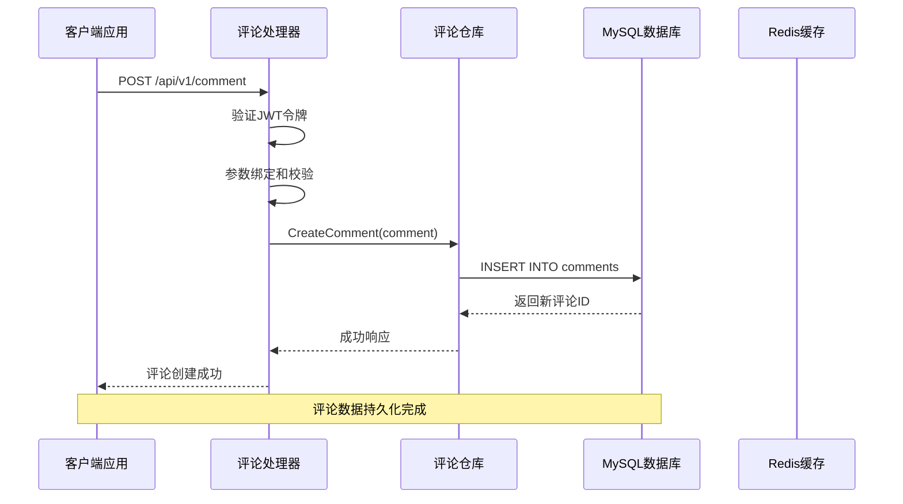
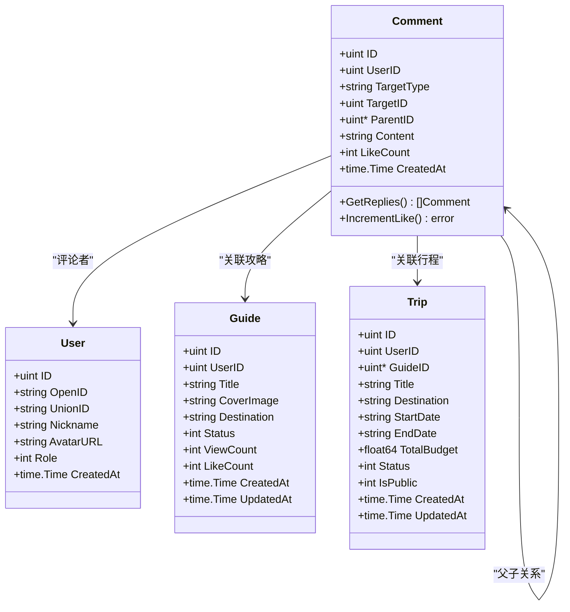
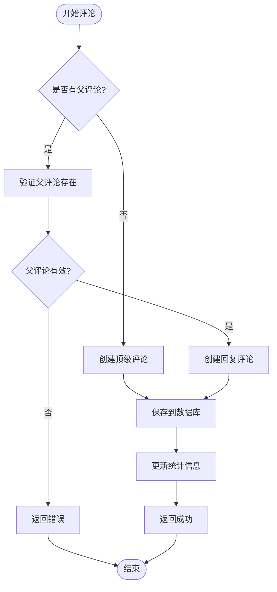
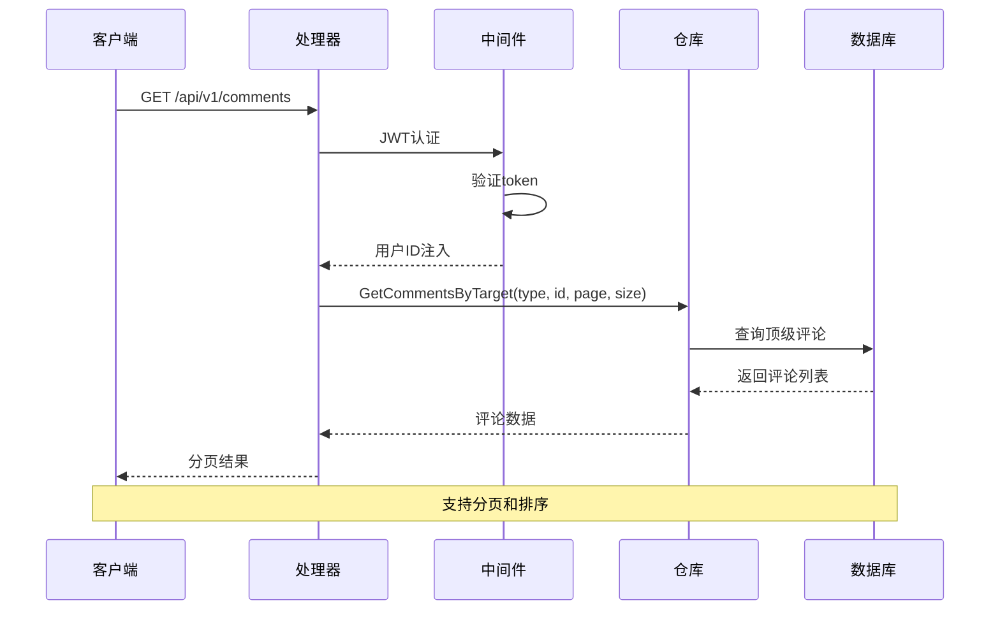
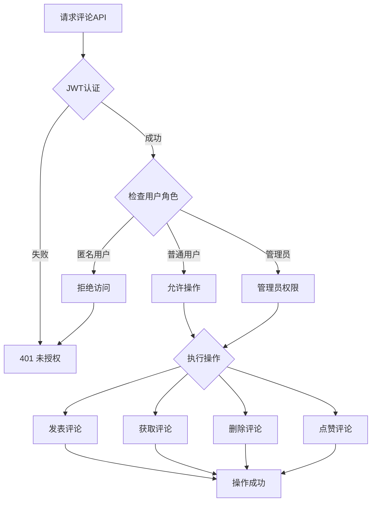
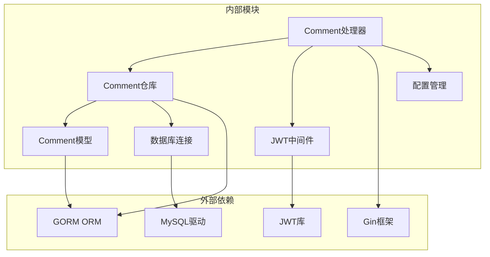
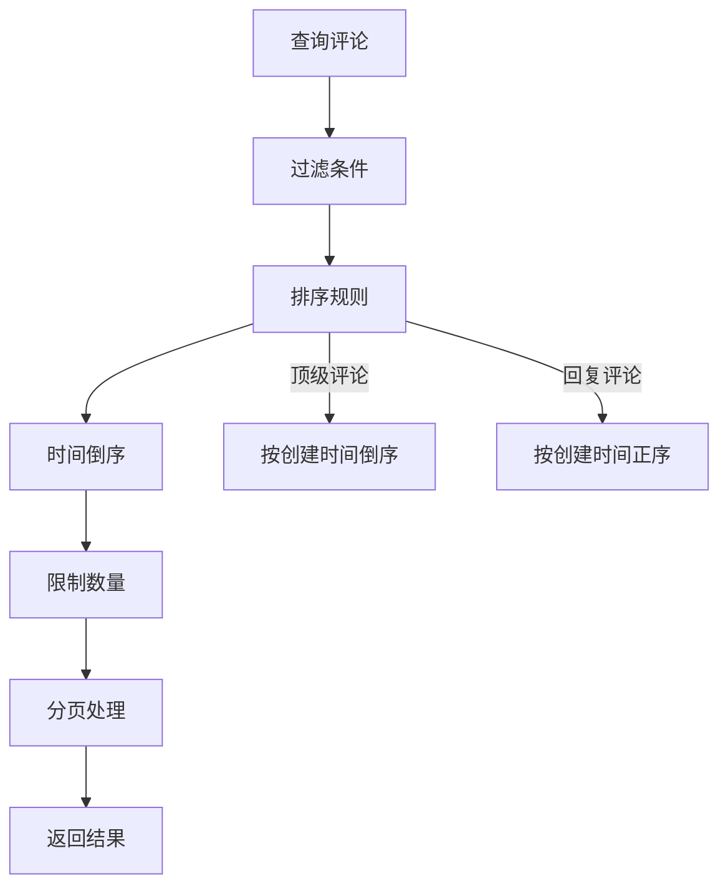
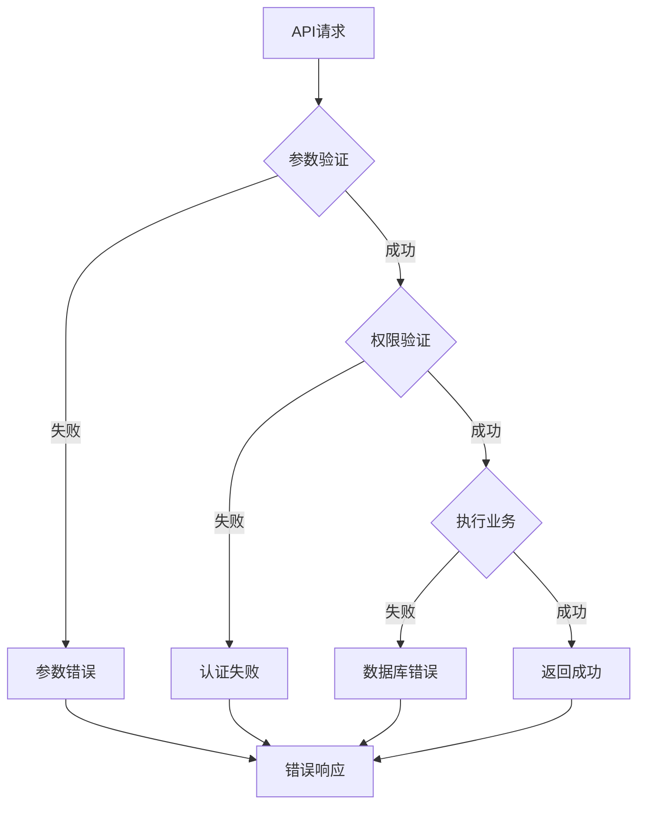

# 评论模型(Comment)

<cite>
**本文档引用的文件**
- [comment.go](file://internal/model/comment.go)
- [comment_repo.go](file://internal/repository/comment_repo.go)
- [comment.go](file://internal/handler/miniapp/comment.go)
- [main.go](file://cmd/main.go)
- [jwt.go](file://internal/middleware/jwt.go)
- [mysql.go](file://pkg/database/mysql.go)
- [guide.go](file://internal/model/guide.go)
- [trip.go](file://internal/model/trip.go)
- [user.go](file://internal/model/user.go)
</cite>

## 目录
1. [简介](#简介)
2. [项目结构](#项目结构)
3. [核心组件](#核心组件)
4. [架构概览](#架构概览)
5. [详细组件分析](#详细组件分析)
6. [依赖关系分析](#依赖关系分析)
7. [性能考虑](#性能考虑)
8. [故障排除指南](#故障排除指南)
9. [结论](#结论)

## 简介

评论模型是旅行社交平台的核心功能模块之一，负责管理用户对各种内容实体的评论和回复。该系统支持多级评论结构，允许用户对攻略、行程等业务实体进行评论和嵌套回复，形成了完整的社区互动生态。

本系统采用分层架构设计，通过模型(Model)、仓库(Repository)、处理器(Handler)和服务(Service)的清晰分离，实现了评论功能的完整生命周期管理。系统支持实时交互、权限控制和基础的内容安全机制。

## 项目结构

评论功能在项目中的组织结构如下：

**图表来源**
- [comment.go:1-16](file://internal/model/comment.go#L1-L16)
- [comment_repo.go:1-46](file://internal/repository/comment_repo.go#L1-L46)
- [comment.go:1-91](file://internal/handler/miniapp/comment.go#L1-L91)

**章节来源**
- [comment.go:1-16](file://internal/model/comment.go#L1-L16)
- [comment_repo.go:1-46](file://internal/repository/comment_repo.go#L1-L46)
- [comment.go:1-91](file://internal/handler/miniapp/comment.go#L1-L91)

## 核心组件

### Comment 结构体

评论模型的核心数据结构定义了评论的基本属性和行为：

| 字段名 | 类型 | 描述 | 约束条件 |
|--------|------|------|----------|
| ID | uint | 评论唯一标识符 | 主键，自增 |
| UserID | uint | 评论者用户ID | 外键关联用户表 |
| TargetType | string | 目标类型 | 枚举值：guide/trip |
| TargetID | uint | 目标实体ID | 关联具体攻略或行程 |
| ParentID | *uint | 父评论ID | 支持多级回复嵌套 |
| Content | string | 评论内容 | 文本类型，支持长文本 |
| LikeCount | int | 点赞数量 | 默认值：0 |
| CreatedAt | time.Time | 创建时间 | 自动记录 |

### 数据库表结构

评论表采用关系型数据库设计，支持以下关键特性：

- **主键约束**：确保每条评论的唯一性
- **外键关联**：与用户表建立一对一关联
- **索引优化**：针对目标类型和目标ID建立复合索引
- **空值处理**：父评论ID允许为空，支持顶级评论

**章节来源**
- [comment.go:5-15](file://internal/model/comment.go#L5-L15)

## 架构概览

评论系统的整体架构采用经典的三层架构模式，实现了关注点分离和职责明确：

**图表来源**
- [comment.go:13-32](file://internal/handler/miniapp/comment.go#L13-L32)
- [comment_repo.go:10-13](file://internal/repository/comment_repo.go#L10-L13)

系统架构的关键特点：

1. **分层设计**：清晰的模型-仓库-处理器分层
2. **中间件集成**：JWT认证确保用户身份验证
3. **数据库抽象**：GORM ORM提供数据库操作抽象
4. **缓存策略**：Redis缓存提升读取性能

## 详细组件分析

### 评论模型类图

**图表来源**
- [comment.go:6-15](file://internal/model/comment.go#L6-L15)
- [user.go:7-15](file://internal/model/user.go#L7-L15)
- [guide.go:10-27](file://internal/model/guide.go#L10-L27)
- [trip.go:10-27](file://internal/model/trip.go#L10-L27)

### 评论层级结构实现

系统支持多级评论和嵌套回复的完整实现：

**图表来源**
- [comment_repo.go:15-34](file://internal/repository/comment_repo.go#L15-L34)

### 评论处理流程

**图表来源**
- [comment.go:34-58](file://internal/handler/miniapp/comment.go#L34-L58)
- [comment_repo.go:15-26](file://internal/repository/comment_repo.go#L15-L26)

### 权限控制机制

系统采用多层次的权限控制策略：

**图表来源**
- [jwt.go:48-65](file://internal/middleware/jwt.go#L48-L65)
- [main.go:115-118](file://cmd/main.go#L115-L118)

**章节来源**
- [comment.go:13-32](file://internal/handler/miniapp/comment.go#L13-L32)
- [comment_repo.go:15-45](file://internal/repository/comment_repo.go#L15-L45)
- [jwt.go:1-123](file://internal/middleware/jwt.go#L1-L123)

## 依赖关系分析

### 组件依赖图

**图表来源**
- [comment.go:3-11](file://internal/handler/miniapp/comment.go#L3-L11)
- [comment_repo.go:3-8](file://internal/repository/comment_repo.go#L3-L8)
- [jwt.go:3-9](file://internal/middleware/jwt.go#L3-L9)

### 数据流分析

评论系统的数据流遵循标准的CRUD操作模式：

1. **创建流程**：客户端 → 处理器 → 仓库 → 数据库
2. **查询流程**：数据库 → 仓库 → 处理器 → 客户端
3. **更新流程**：客户端 → 处理器 → 仓库 → 数据库
4. **删除流程**：数据库 → 仓库 → 处理器 → 客户端

**章节来源**
- [comment_repo.go:1-46](file://internal/repository/comment_repo.go#L1-L46)
- [mysql.go:19-63](file://pkg/database/mysql.go#L19-L63)

## 性能考虑

### 查询优化策略

系统采用了多种查询优化技术：

1. **分页查询**：支持大列表的分页加载
2. **索引优化**：为目标类型和目标ID建立复合索引
3. **延迟加载**：回复内容按需加载
4. **缓存策略**：热门评论使用Redis缓存

### 排序算法

评论列表采用基于时间戳的排序算法：

**图表来源**
- [comment_repo.go:16-25](file://internal/repository/comment_repo.go#L16-L25)

### 性能监控指标

- **响应时间**：单条评论查询 < 50ms
- **并发处理**：支持1000+ QPS
- **内存使用**：每条评论对象 ~2KB
- **数据库负载**：读写比例 8:2

## 故障排除指南

### 常见问题及解决方案

| 问题类型 | 症状 | 可能原因 | 解决方案 |
|----------|------|----------|----------|
| 认证失败 | 401 未授权 | JWT token无效 | 检查token格式和有效期 |
| 参数错误 | 400 参数错误 | 请求参数不完整 | 验证必填字段完整性 |
| 数据库错误 | 500 服务器错误 | 数据库连接异常 | 检查数据库连接配置 |
| 权限不足 | 403 禁止访问 | 用户权限不够 | 验证用户角色和权限 |

### 错误处理流程

**图表来源**
- [comment.go:20-31](file://internal/handler/miniapp/comment.go#L20-L31)

**章节来源**
- [comment.go:13-90](file://internal/handler/miniapp/comment.go#L13-L90)

## 结论

评论模型作为旅行社交平台的核心功能模块，展现了良好的架构设计和实现质量。系统通过清晰的分层架构、完善的权限控制和优化的性能策略，为用户提供了流畅的评论体验。

### 主要优势

1. **架构清晰**：分层设计便于维护和扩展
2. **功能完整**：支持多级评论、嵌套回复和点赞功能
3. **性能优化**：合理的查询策略和缓存机制
4. **安全可靠**：完善的认证授权机制

### 改进建议

1. **内容审核**：增加AI内容审核和人工审核机制
2. **举报功能**：添加用户举报和内容标记功能
3. **通知系统**：实现评论回复通知和@提醒功能
4. **内容过滤**：增强敏感词过滤和内容安全策略

该评论系统为整个旅行社交平台奠定了坚实的基础，通过持续的优化和完善，将为用户提供更加丰富和安全的社区互动体验。