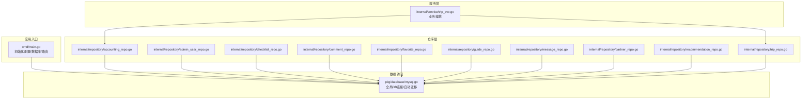
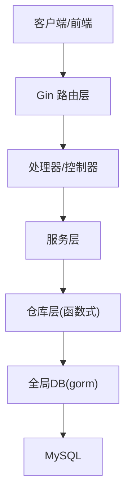
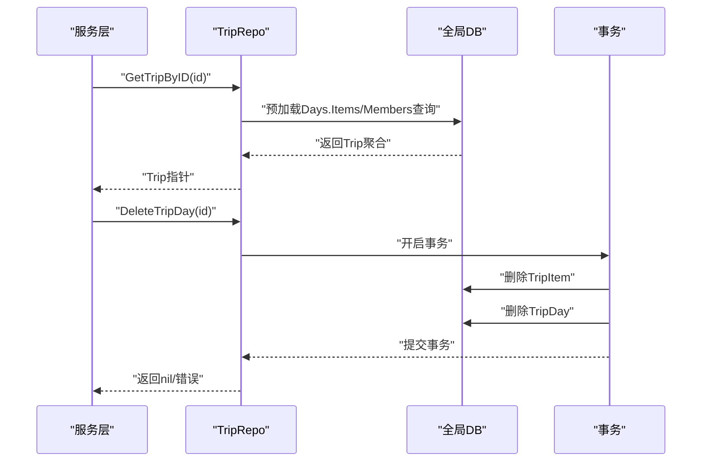
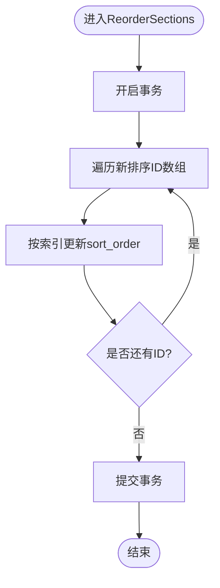
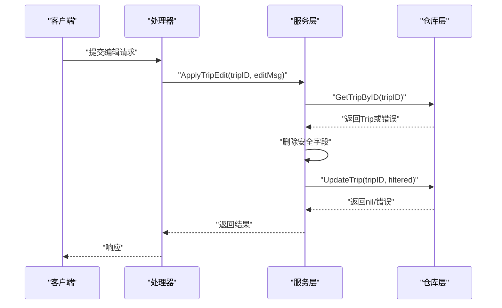
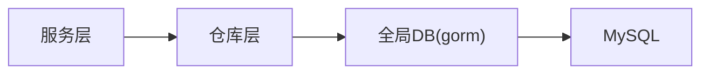

# 仓库模式设计

<cite>
**本文引用的文件**
- [cmd/main.go](file://cmd/main.go)
- [pkg/database/mysql.go](file://pkg/database/mysql.go)
- [internal/repository/accounting_repo.go](file://internal/repository/accounting_repo.go)
- [internal/repository/admin_user_repo.go](file://internal/repository/admin_user_repo.go)
- [internal/repository/checklist_repo.go](file://internal/repository/checklist_repo.go)
- [internal/repository/comment_repo.go](file://internal/repository/comment_repo.go)
- [internal/repository/favorite_repo.go](file://internal/repository/favorite_repo.go)
- [internal/repository/guide_repo.go](file://internal/repository/guide_repo.go)
- [internal/repository/message_repo.go](file://internal/repository/message_repo.go)
- [internal/repository/partner_repo.go](file://internal/repository/partner_repo.go)
- [internal/repository/recommendation_repo.go](file://internal/repository/recommendation_repo.go)
- [internal/repository/trip_repo.go](file://internal/repository/trip_repo.go)
- [internal/service/trip_svc.go](file://internal/service/trip_svc.go)
- [internal/model/trip.go](file://internal/model/trip.go)
- [internal/model/user.go](file://internal/model/user.go)
</cite>

## 目录
1. [引言](#引言)
2. [项目结构](#项目结构)
3. [核心组件](#核心组件)
4. [架构总览](#架构总览)
5. [详细组件分析](#详细组件分析)
6. [依赖关系分析](#依赖关系分析)
7. [性能考量](#性能考量)
8. [故障排查指南](#故障排查指南)
9. [结论](#结论)
10. [附录](#附录)

## 引言
本文件系统性阐述本项目中“仓库模式”的实现与设计思想，覆盖接口抽象、数据访问封装、依赖注入与解耦策略，并结合实际仓库实现总结最佳实践与常见陷阱。仓库层通过统一的数据访问接口屏蔽底层ORM细节，向上为服务层提供稳定契约，向下隔离数据库操作与业务逻辑。

## 项目结构
仓库层位于 internal/repository，每个领域模块对应一组函数式仓库方法，直接依赖 pkg/database 中的全局数据库连接实例，完成增删改查与复杂事务处理。服务层通过调用仓库函数实现业务编排；应用入口负责初始化数据库与Redis等基础设施。

图表来源
- [cmd/main.go:31-37](file://cmd/main.go#L31-L37)
- [pkg/database/mysql.go:17](file://pkg/database/mysql.go#L17)
- [internal/repository/trip_repo.go:17](file://internal/repository/trip_repo.go#L17)
- [internal/service/trip_svc.go:8](file://internal/service/trip_svc.go#L8)

章节来源
- [cmd/main.go:31-37](file://cmd/main.go#L31-L37)
- [pkg/database/mysql.go:17](file://pkg/database/mysql.go#L17)

## 核心组件
- 数据库连接与初始化：全局 gorm.DB 实例在 pkg/database/mysql.go 中初始化并执行自动迁移，确保表结构与模型一致。
- 仓库函数：以领域模型为中心，提供 CRUD 与聚合查询方法，如 GetAccountsByTrip、GetAdminUserByUsername、GetFeedGuides、GetTripByID 等。
- 服务层编排：服务层调用仓库函数，进行参数过滤、权限校验与错误传播，例如 ApplyTripEdit 对输入字段进行安全裁剪后再写入。
- 应用入口：cmd/main.go 负责加载配置、初始化数据库与Redis、注册路由，形成完整的运行时环境。

章节来源
- [pkg/database/mysql.go:17](file://pkg/database/mysql.go#L17)
- [internal/service/trip_svc.go:8](file://internal/service/trip_svc.go#L8)
- [cmd/main.go:31-37](file://cmd/main.go#L31-L37)

## 架构总览
仓库层采用“函数式仓库”风格：每个领域一个仓库文件，暴露若干函数，内部直接使用全局DB连接。该设计降低抽象成本，便于快速迭代；同时通过服务层统一编排，避免业务逻辑渗透到仓库。

图表来源
- [cmd/main.go:46-143](file://cmd/main.go#L46-L143)
- [internal/repository/trip_repo.go:17](file://internal/repository/trip_repo.go#L17)
- [pkg/database/mysql.go:17](file://pkg/database/mysql.go#L17)

## 详细组件分析

### 仓库层职责边界与封装
- 单一职责：每个仓库函数聚焦于单一实体或聚合的读写，避免跨领域耦合。
- 封装ORM：仓库内部封装 Where/Preload/Transaction 等细节，上层仅关心领域语义。
- 返回约定：错误通过 error 返回，成功返回实体或切片；部分布尔判断函数返回布尔值。
- 预加载与关联：对需要关联数据的查询，使用 Preload 或子查询，保证调用方拿到完整上下文。
- 事务边界：涉及多步写入或一致性要求的操作，使用 Transaction 包裹，如 ReorderSections、DeleteTripDay。

章节来源
- [internal/repository/guide_repo.go:94-103](file://internal/repository/guide_repo.go#L94-L103)
- [internal/repository/trip_repo.go:78-84](file://internal/repository/trip_repo.go#L78-L84)

### 接口设计原则与命名规范
- 方法命名：采用动词短语，如 CreateXxx、GetXxxByID、ListXxx、UpdateXxxStatus 等，清晰表达意图。
- 参数设计：优先使用领域ID或必要条件组合，避免传递过多上下文；分页场景统一使用 page/pageSize。
- 返回值：成功返回实体/切片/计数；失败返回 error；布尔判断函数返回 bool。
- 条件查询：支持可选过滤（如 destination、target_type），通过条件拼接实现灵活查询。

章节来源
- [internal/repository/guide_repo.go:13](file://internal/repository/guide_repo.go#L13)
- [internal/repository/trip_repo.go:40](file://internal/repository/trip_repo.go#L40)
- [internal/repository/comment_repo.go:16](file://internal/repository/comment_repo.go#L16)

### 依赖注入与松耦合
- 当前实现：仓库直接依赖全局 DB 实例，未显式注入接口，耦合度较低但扩展性有限。
- 改进建议：引入仓储接口与实现分离，通过构造函数注入或工厂模式替换全局DB，便于单元测试与多数据源切换。

章节来源
- [pkg/database/mysql.go:17](file://pkg/database/mysql.go#L17)

### 代表性仓库实现剖析

#### 行程仓库（TripRepo）
- 聚合查询：GetTripByID 使用 Preload 展开 Days.Items 与 Members，并按 sort_order 排序，保证序列化一致性。
- 分页与过滤：ListUserTrips/ListPublicTrips 支持目的地模糊匹配与分页统计。
- 事务处理：DeleteTripDay 先删除子项再删除父日，ReorderTripItems 在事务内批量更新排序。
- 批量写入：BatchCreateTripItems 提供高效批量插入。

图表来源
- [internal/repository/trip_repo.go:17](file://internal/repository/trip_repo.go#L17)
- [internal/repository/trip_repo.go:78-84](file://internal/repository/trip_repo.go#L78-L84)

章节来源
- [internal/repository/trip_repo.go:17](file://internal/repository/trip_repo.go#L17)
- [internal/repository/trip_repo.go:40](file://internal/repository/trip_repo.go#L40)
- [internal/repository/trip_repo.go:78-84](file://internal/repository/trip_repo.go#L78-L84)
- [internal/repository/trip_repo.go:104](file://internal/repository/trip_repo.go#L104)

#### 攻略仓库（GuideRepo）
- 瀑布流与后台列表：GetFeedGuides 支持目的地过滤与总数统计；ListGuides 获取全部状态列表。
- 审核与浏览：UpdateGuideStatus 修改状态；IncrementGuideViewCount 原子自增。
- 板块管理：CreateSection/UpdateSection/DeleteSection/BatchCreateSections/ReorderSections，ReorderSections 使用事务维护排序一致性。

图表来源
- [internal/repository/guide_repo.go:94](file://internal/repository/guide_repo.go#L94)
- [internal/repository/guide_repo.go:96](file://internal/repository/guide_repo.go#L96)
- [internal/repository/guide_repo.go:102](file://internal/repository/guide_repo.go#L102)

章节来源
- [internal/repository/guide_repo.go:13](file://internal/repository/guide_repo.go#L13)
- [internal/repository/guide_repo.go:42](file://internal/repository/guide_repo.go#L42)
- [internal/repository/guide_repo.go:52](file://internal/repository/guide_repo.go#L52)
- [internal/repository/guide_repo.go:94](file://internal/repository/guide_repo.go#L94)

#### 管理员用户仓库（AdminUserRepo）
- 登录/查询：GetAdminUserByUsername（带角色预加载）与 GetAdminUserByID。
- 列表分页：ListAdminUsers 统计总数并分页查询，支持角色预加载。
- CRUD：CreateAdminUser/UpdateAdminUser/DeleteAdminUser。

章节来源
- [internal/repository/admin_user_repo.go:8](file://internal/repository/admin_user_repo.go#L8)
- [internal/repository/admin_user_repo.go:23](file://internal/repository/admin_user_repo.go#L23)
- [internal/repository/admin_user_repo.go:32](file://internal/repository/admin_user_repo.go#L32)

#### 记账仓库（AccountingRepo）
- 查询：GetAccountsByTrip 按行程与用户过滤。
- 新增：CreateAccount 写入一条记账记录。

章节来源
- [internal/repository/accounting_repo.go:8](file://internal/repository/accounting_repo.go#L8)
- [internal/repository/accounting_repo.go:15](file://internal/repository/accounting_repo.go#L15)

#### 备忘清单仓库（ChecklistRepo）
- 查询：GetChecklistsByUser 支持预加载清单项。
- 新增：CreateChecklist。
- 更新：UpdateChecklistItem 原子更新勾选状态。

章节来源
- [internal/repository/checklist_repo.go:8](file://internal/repository/checklist_repo.go#L8)
- [internal/repository/checklist_repo.go:15](file://internal/repository/checklist_repo.go#L15)
- [internal/repository/checklist_repo.go:21](file://internal/repository/checklist_repo.go#L21)

#### 评论仓库（CommentRepo）
- 新增：CreateComment。
- 查询：GetCommentsByTarget 支持分页与总数统计；GetRepliesByParentID 获取子回复。
- 删除：DeleteComment。
- 点赞：IncrementCommentLikeCount 原子自增。

章节来源
- [internal/repository/comment_repo.go:10](file://internal/repository/comment_repo.go#L10)
- [internal/repository/comment_repo.go:15](file://internal/repository/comment_repo.go#L15)
- [internal/repository/comment_repo.go:28](file://internal/repository/comment_repo.go#L28)
- [internal/repository/comment_repo.go:42](file://internal/repository/comment_repo.go#L42)

#### 收藏仓库（FavoriteRepo）
- 新增：AddFavorite。
- 删除：RemoveFavorite。
- 判断：IsFavorited。
- 列表：ListUserFavorites 支持按类型过滤与分页。

章节来源
- [internal/repository/favorite_repo.go:8](file://internal/repository/favorite_repo.go#L8)
- [internal/repository/favorite_repo.go:13](file://internal/repository/favorite_repo.go#L13)
- [internal/repository/favorite_repo.go:19](file://internal/repository/favorite_repo.go#L19)
- [internal/repository/favorite_repo.go:28](file://internal/repository/favorite_repo.go#L28)

#### 消息仓库（MessageRepo）
- 新增：CreateMessage。
- 查询：GetMessagesBetweenUsers 支持双向会话查询。

章节来源
- [internal/repository/message_repo.go:8](file://internal/repository/message_repo.go#L8)
- [internal/repository/message_repo.go:13](file://internal/repository/message_repo.go#L13)

#### 搭子仓库（PartnerRepo）
- 新增：CreatePartner。
- 列表：GetPartnerList/ListPartners。
- 查询：GetPartnerByID。
- 更新：UpdatePartner。
- 申请：CreateApplication/GetApplicationByID/UpdateApplicationStatus。

章节来源
- [internal/repository/partner_repo.go:8](file://internal/repository/partner_repo.go#L8)
- [internal/repository/partner_repo.go:13](file://internal/repository/partner_repo.go#L13)
- [internal/repository/partner_repo.go:23](file://internal/repository/partner_repo.go#L23)
- [internal/repository/partner_repo.go:35](file://internal/repository/partner_repo.go#L35)
- [internal/repository/partner_repo.go:47](file://internal/repository/partner_repo.go#L47)

#### 推荐仓库（RecommendationRepo）
- 新增：CreateRecommendation。
- 查询：GetRecommendations 支持城市过滤。

章节来源
- [internal/repository/recommendation_repo.go:8](file://internal/repository/recommendation_repo.go#L8)
- [internal/repository/recommendation_repo.go:13](file://internal/repository/recommendation_repo.go#L13)

### 服务层与仓库交互示例
服务层在调用仓库前进行参数清洗与安全过滤，避免非法字段写入数据库。

图表来源
- [internal/service/trip_svc.go:8](file://internal/service/trip_svc.go#L8)
- [internal/repository/trip_repo.go:17](file://internal/repository/trip_repo.go#L17)
- [internal/repository/trip_repo.go:29](file://internal/repository/trip_repo.go#L29)

章节来源
- [internal/service/trip_svc.go:8](file://internal/service/trip_svc.go#L8)

## 依赖关系分析
- 低耦合：仓库直接依赖全局DB，减少接口抽象带来的样板代码。
- 单向依赖：服务层 → 仓库层 → 数据库层，符合整洁架构方向。
- 可能风险：全局DB使单元测试难以替换存储；多数据源场景扩展困难。

图表来源
- [pkg/database/mysql.go:17](file://pkg/database/mysql.go#L17)
- [internal/repository/trip_repo.go:17](file://internal/repository/trip_repo.go#L17)

章节来源
- [pkg/database/mysql.go:17](file://pkg/database/mysql.go#L17)

## 性能考量
- 预加载策略：对需要关联数据的查询使用 Preload，避免 N+1 查询；注意仅加载必要字段与层级。
- 分页与统计：先 Count 再 Limit/Offset，避免全表扫描；合理设置索引（如用户ID、目标类型、创建时间）。
- 原子更新：使用 UpdateColumn 或表达式自增，减少读取-计算-写回的竞态。
- 事务批处理：批量更新排序或批量插入使用事务，保证一致性与性能平衡。
- 连接池与超时：确保数据库连接池配置合理，避免长事务占用资源。

## 故障排查指南
- 连接失败重试：数据库初始化包含多次重试机制，若仍失败检查环境变量与网络连通性。
- 迁移失败：AutoMigrate 失败通常由字段冲突或约束问题导致，检查模型定义与历史表结构差异。
- 查询异常：确认 Where 条件与参数绑定正确；分页 offset 计算是否越界。
- 事务回滚：涉及多表写入的流程需检查事务包裹范围与错误传播路径。
- 错误返回：仓库统一返回 error，服务层应记录上下文并进行幂等处理。

章节来源
- [pkg/database/mysql.go:27](file://pkg/database/mysql.go#L27)
- [pkg/database/mysql.go:60](file://pkg/database/mysql.go#L60)

## 结论
本项目采用“函数式仓库”实现仓库模式，以全局DB为核心，简化了数据访问层的复杂度，提升了开发效率。建议在保持现有简洁性的基础上，逐步引入仓储接口与依赖注入，增强单元测试能力与多数据源适配能力，进一步提升系统的可维护性与可演进性。

## 附录

### 依赖注入与接口抽象建议
- 定义仓储接口：为常用查询/写入方法定义接口，如 TripRepository、GuideRepository 等。
- 实现分离：当前全局DB作为默认实现，测试时可用内存存储或Fake实现替换。
- 构造注入：在服务层通过构造函数注入所需仓储接口，便于替换与测试。
- 工厂/容器：可引入简单工厂或轻量容器，集中管理仓储实现与生命周期。

### 单元测试中的Mock策略
- Mock接口：针对仓储接口编写Mock实现，控制返回值与行为，验证服务层逻辑。
- Fake存储：使用内存Map或轻量存储模拟数据库，避免真实IO。
- 事务隔离：对涉及事务的方法，使用Mock事务对象验证提交/回滚路径。
- 边界测试：覆盖空结果、分页边界、并发写入等场景。