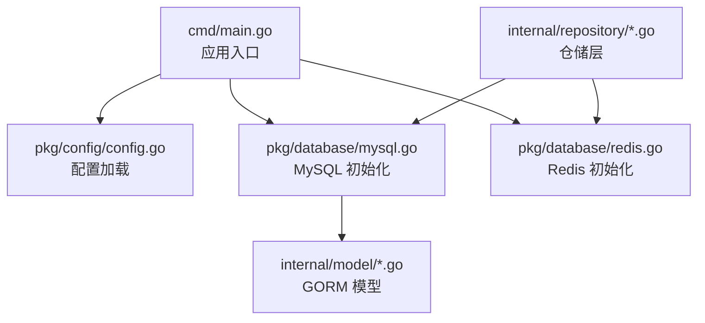
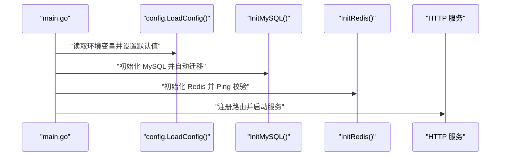
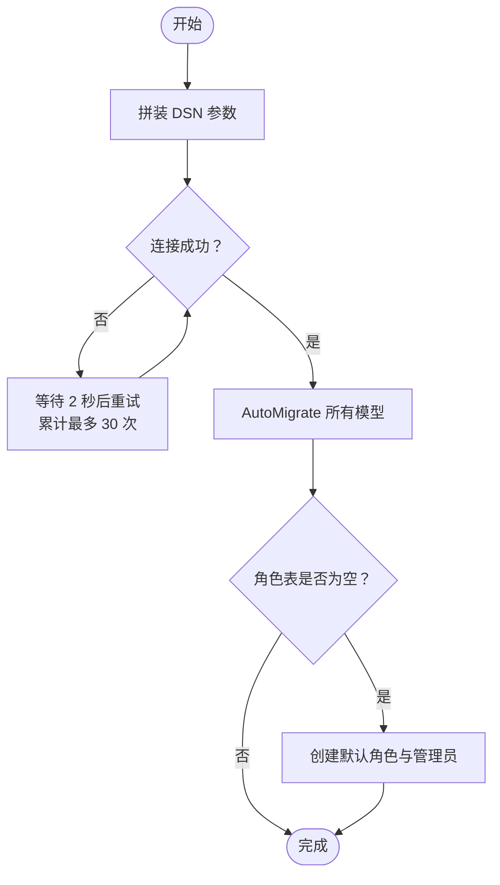
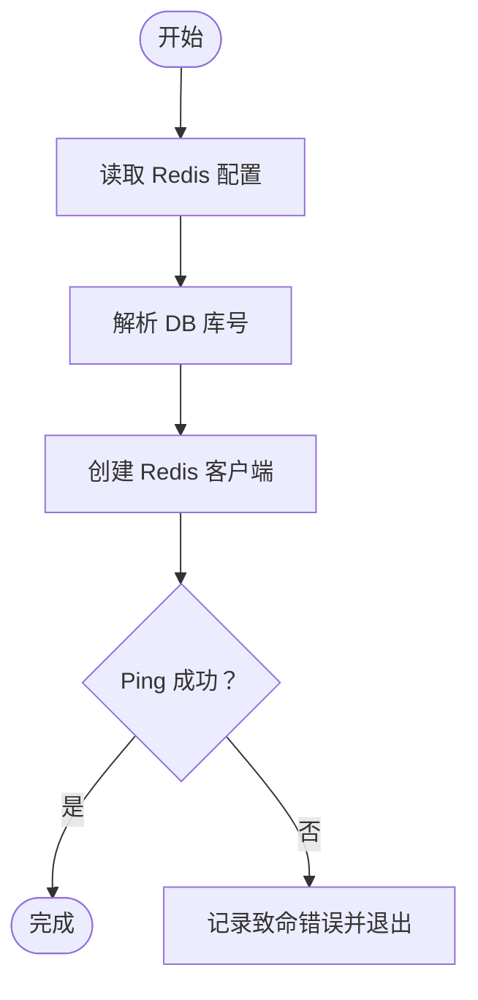
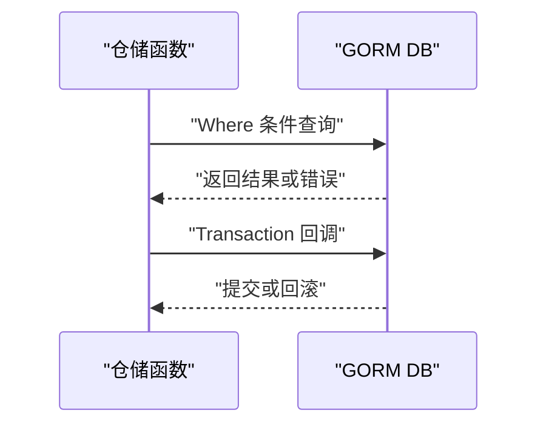
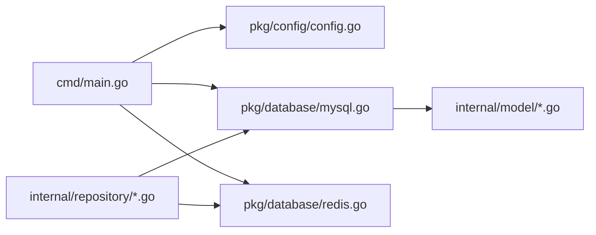

# 数据库操作

<cite>
**本文引用的文件**
- [cmd/main.go](file://cmd/main.go)
- [pkg/config/config.go](file://pkg/config/config.go)
- [pkg/database/mysql.go](file://pkg/database/mysql.go)
- [pkg/database/redis.go](file://pkg/database/redis.go)
- [internal/model/user.go](file://internal/model/user.go)
- [internal/model/trip.go](file://internal/model/trip.go)
- [internal/model/partner.go](file://internal/model/partner.go)
- [internal/model/guide.go](file://internal/model/guide.go)
- [internal/model/checklist.go](file://internal/model/checklist.go)
- [internal/model/accounting.go](file://internal/model/accounting.go)
- [internal/repository/user_repo.go](file://internal/repository/user_repo.go)
- [internal/repository/trip_repo.go](file://internal/repository/trip_repo.go)
- [go.mod](file://go.mod)
- [docker-compose.yml](file://docker-compose.yml)
</cite>

## 目录
1. [简介](#简介)
2. [项目结构](#项目结构)
3. [核心组件](#核心组件)
4. [架构总览](#架构总览)
5. [详细组件分析](#详细组件分析)
6. [依赖分析](#依赖分析)
7. [性能考虑](#性能考虑)
8. [故障排查指南](#故障排查指南)
9. [结论](#结论)
10. [附录](#附录)

## 简介
本文件系统性梳理旅行服务器项目中的数据库操作实现，覆盖以下主题：
- MySQL 与 Redis 的配置与初始化流程
- GORM ORM 的核心能力：模型定义、关联关系、查询构建器、事务处理
- 连接池管理、连接超时与连接复用策略现状与建议
- SQL 查询优化技巧：索引使用、查询计划分析、批量操作
- 数据模型设计原则与字段约束
- 数据库迁移与版本管理策略
- 数据备份恢复与性能监控方案

## 项目结构
项目采用“配置—数据库—模型—仓储—处理器”的分层组织，数据库相关能力集中在 pkg/database，配置集中在 pkg/config，数据模型位于 internal/model，数据访问位于 internal/repository。

图表来源
- [cmd/main.go:31-37](file://cmd/main.go#L31-L37)
- [pkg/config/config.go:61-100](file://pkg/config/config.go#L61-L100)
- [pkg/database/mysql.go:19-63](file://pkg/database/mysql.go#L19-L63)
- [pkg/database/redis.go:15-31](file://pkg/database/redis.go#L15-L31)

章节来源
- [cmd/main.go:31-37](file://cmd/main.go#L31-L37)
- [pkg/config/config.go:61-100](file://pkg/config/config.go#L61-L100)
- [pkg/database/mysql.go:19-63](file://pkg/database/mysql.go#L19-L63)
- [pkg/database/redis.go:15-31](file://pkg/database/redis.go#L15-L31)

## 核心组件
- 配置加载：从环境变量读取 MySQL/Redis/服务等配置，提供默认值。
- MySQL 初始化：基于 GORM 进行连接、自动迁移、默认数据初始化。
- Redis 初始化：基于 go-redis 客户端建立连接并健康检查。
- 仓储层：封装常用 CRUD 与分页查询，统一错误处理。
- 模型层：通过 GORM Tag 定义主键、索引、默认值、软删除、关联关系等。

章节来源
- [pkg/config/config.go:61-100](file://pkg/config/config.go#L61-L100)
- [pkg/database/mysql.go:19-90](file://pkg/database/mysql.go#L19-L90)
- [pkg/database/redis.go:15-31](file://pkg/database/redis.go#L15-L31)
- [internal/repository/user_repo.go:8-43](file://internal/repository/user_repo.go#L8-L43)

## 架构总览
应用启动时，先加载配置，再初始化 MySQL 与 Redis；随后注册路由并运行服务。仓储层通过全局 GORM 实例执行数据库操作，Redis 用于缓存与会话等场景。

图表来源
- [cmd/main.go:31-37](file://cmd/main.go#L31-L37)
- [pkg/database/mysql.go:19-63](file://pkg/database/mysql.go#L19-L63)
- [pkg/database/redis.go:15-31](file://pkg/database/redis.go#L15-L31)

## 详细组件分析

### MySQL 初始化与自动迁移
- 连接参数：从配置读取主机、端口、用户名、密码、数据库名，拼装 DSN。
- 连接重试：最多重试 30 次，每次间隔 2 秒，失败则终止进程。
- 自动迁移：对全部模型执行 AutoMigrate，确保表结构与模型一致。
- 默认数据：若角色表为空，则创建默认角色与初始管理员账号。

图表来源
- [pkg/database/mysql.go:19-90](file://pkg/database/mysql.go#L19-L90)

章节来源
- [pkg/database/mysql.go:19-90](file://pkg/database/mysql.go#L19-L90)

### Redis 初始化与健康检查
- 读取配置：主机、端口、密码、DB 库号（字符串转整数）。
- 建立连接：使用 go-redis 客户端初始化。
- 健康检查：Ping 成功才算初始化完成。

图表来源
- [pkg/database/redis.go:15-31](file://pkg/database/redis.go#L15-L31)

章节来源
- [pkg/database/redis.go:15-31](file://pkg/database/redis.go#L15-L31)

### GORM 模型与关联关系
- 主键与索引：通过 Tag 定义主键、唯一索引、普通索引等。
- 软删除：使用 DeletedAt 字段与索引，便于级联清理与审计。
- 关联：一对多/多对多通过 GORM Tag 声明外键，支持嵌套序列化。
- 字段约束：长度限制、默认值、数值精度、枚举状态等。

示例模型要点
- 用户模型：OpenID 唯一索引，昵称/头像长度限制，角色默认值。
- 行程模型：软删除、与行程日、同行者的一对多关联。
- 搭子模型：状态枚举、最大人数、当前人数等。
- 攻略模型：浏览量/点赞数默认值、状态枚举、软删除。
- 清单模型：模板标记、与清单项的一对多。
- 记账模型：分类枚举、金额精度、交易单号等。

章节来源
- [internal/model/user.go:6-15](file://internal/model/user.go#L6-L15)
- [internal/model/trip.go:9-37](file://internal/model/trip.go#L9-L37)
- [internal/model/partner.go:5-29](file://internal/model/partner.go#L5-L29)
- [internal/model/guide.go:9-27](file://internal/model/guide.go#L9-L27)
- [internal/model/checklist.go:5-22](file://internal/model/checklist.go#L5-L22)
- [internal/model/accounting.go:5-16](file://internal/model/accounting.go#L5-L16)

### 仓储层与查询构建器
- 常用方法：按 OpenID 查询、按 ID 查询、分页查询、更新角色等。
- 查询构建器：Where/First/Offset/Limit/Find/Model/Update/Updates/Delete 等。
- 事务处理：在需要一致性保证的场景使用 Transaction 包裹，如批量重排行程项。

图表来源
- [internal/repository/user_repo.go:8-43](file://internal/repository/user_repo.go#L8-L43)
- [internal/repository/trip_repo.go:109-118](file://internal/repository/trip_repo.go#L109-L118)

章节来源
- [internal/repository/user_repo.go:8-43](file://internal/repository/user_repo.go#L8-L43)
- [internal/repository/trip_repo.go:109-118](file://internal/repository/trip_repo.go#L109-L118)

### 连接池管理、超时与复用策略
- MySQL 连接池：当前实现未显式设置连接池参数（最大连接数、空闲数、生命周期），默认行为取决于驱动与底层库。
- 连接超时：未设置连接超时与读写超时，建议结合生产环境需求进行配置。
- 连接复用：通过全局 GORM 实例复用连接，避免频繁创建销毁。

建议
- 在生产环境显式设置连接池参数，以提升并发与稳定性。
- 配置连接超时与读写超时，防止慢查询阻塞。
- 使用连接池监控工具观察活跃/空闲连接数，动态调整。

章节来源
- [pkg/database/mysql.go:19-37](file://pkg/database/mysql.go#L19-L37)
- [go.mod:14-15](file://go.mod#L14-L15)

### SQL 查询优化技巧
- 索引使用
  - 唯一索引：OpenID 等唯一标识字段。
  - 普通索引：常用于过滤与排序的字段（如行程状态、用户 ID、创建时间）。
  - 联合索引：针对复合条件查询（如用户+状态、目的地+状态）。
- 查询计划分析
  - 使用 EXPLAIN 分析复杂查询，关注是否走索引、扫描行数、是否临时表/文件排序。
  - 避免 SELECT *，仅选择必要列。
- 批量操作
  - 批量插入：使用 Create(&[]Model) 提升吞吐。
  - 批量更新/删除：尽量使用条件批量，减少往返。
- 分页与排序
  - 使用索引覆盖排序字段，避免大偏移分页。
  - 对高频分页字段建立合适索引。

章节来源
- [internal/model/user.go:8-10](file://internal/model/user.go#L8-L10)
- [internal/model/trip.go:12-23](file://internal/model/trip.go#L12-L23)
- [internal/model/partner.go:7-18](file://internal/model/partner.go#L7-L18)
- [internal/model/guide.go:11-26](file://internal/model/guide.go#L11-L26)
- [internal/repository/user_repo.go:31-38](file://internal/repository/user_repo.go#L31-L38)

### 数据模型设计原则与字段约束
- 唯一性：OpenID 等外部标识使用唯一索引，避免重复。
- 默认值：状态、计数、模板标记等使用默认值，降低业务侧判断成本。
- 数值精度：预算/金额使用 decimal，保留小数精度。
- 软删除：DeletedAt 字段配合索引，支持逻辑删除与审计。
- 关联清晰：外键命名规范，JSON 序列化时控制输出。

章节来源
- [internal/model/user.go:8-14](file://internal/model/user.go#L8-L14)
- [internal/model/trip.go:10-26](file://internal/model/trip.go#L10-L26)
- [internal/model/partner.go:6-18](file://internal/model/partner.go#L6-L18)
- [internal/model/guide.go:10-26](file://internal/model/guide.go#L10-L26)
- [internal/model/checklist.go:6-13](file://internal/model/checklist.go#L6-L13)
- [internal/model/accounting.go:6-15](file://internal/model/accounting.go#L6-L15)

### 数据库迁移与版本管理策略
- 自动迁移：启动时对全部模型执行 AutoMigrate，确保表结构与模型一致。
- 版本管理：当前未引入专用迁移工具（如 goose/phinx），建议在生产环境引入迁移脚本与版本号管理，避免破坏性变更。
- 回滚策略：对涉及数据结构的重大变更，准备逆向迁移脚本与数据备份。

章节来源
- [pkg/database/mysql.go:39-63](file://pkg/database/mysql.go#L39-L63)

### 数据备份恢复与性能监控方案
- 备份
  - MySQL：使用逻辑备份（mysqldump）与物理备份（Percona XtraBackup）相结合，定期全备+增量备份。
  - Redis：启用 RDB/AOF，定期快照与同步。
- 恢复
  - 制定恢复演练计划，验证备份完整性与恢复时间目标（RTO/RPO）。
- 监控
  - MySQL：连接数、慢查询、锁等待、缓冲池命中率、复制延迟。
  - Redis：内存使用、命令耗时、连接数、过期淘汰率。
  - 应用：数据库请求延迟分布、错误率、重试次数。

章节来源
- [docker-compose.yml:4-33](file://docker-compose.yml#L4-L33)

## 依赖分析
- 外部依赖
  - GORM v1 与 MySQL 驱动 v1：用于 ORM 与连接。
  - go-redis v8：用于 Redis 客户端。
  - Gin：Web 框架。
- 内部依赖
  - main 依赖 config 与 database。
  - database 依赖 config 与 internal/model。
  - repository 依赖 database 与 internal/model。

图表来源
- [cmd/main.go:31-37](file://cmd/main.go#L31-L37)
- [pkg/database/mysql.go:13-15](file://pkg/database/mysql.go#L13-L15)
- [pkg/database/redis.go:10](file://pkg/database/redis.go#L10)

章节来源
- [go.mod:5-16](file://go.mod#L5-L16)
- [cmd/main.go:31-37](file://cmd/main.go#L31-L37)

## 性能考虑
- 连接池：建议显式设置最大打开连接数、最大空闲连接数、连接生命周期。
- 超时：为连接与读写设置合理超时，避免长时间阻塞。
- 查询：优先使用索引，避免全表扫描；对热点查询建立复合索引。
- 批量：批量插入/更新，减少网络往返。
- 缓存：利用 Redis 缓存热点数据，降低数据库压力。

## 故障排查指南
- MySQL 连接失败
  - 检查 DSN 参数（主机、端口、用户名、密码、数据库名）。
  - 查看重试日志，确认是否超过最大重试次数。
  - 核对容器健康状态与网络连通性。
- Redis 连接失败
  - 检查地址、密码、DB 库号。
  - 使用 Ping 校验，确认服务可达。
- 自动迁移失败
  - 检查模型字段与数据库现有结构差异，修正冲突。
  - 确认数据库权限与字符集设置。
- 事务异常
  - 确保 Transaction 回调内错误被正确返回，触发回滚。
  - 避免在事务中执行耗时操作，缩短事务持有时间。

章节来源
- [pkg/database/mysql.go:25-37](file://pkg/database/mysql.go#L25-L37)
- [pkg/database/redis.go:23-30](file://pkg/database/redis.go#L23-L30)
- [internal/repository/trip_repo.go:109-118](file://internal/repository/trip_repo.go#L109-L118)

## 结论
本项目通过 GORM 与 go-redis 实现了简洁高效的数据库与缓存接入，自动迁移机制降低了部署成本。建议在生产环境中补充连接池参数、超时配置、索引策略与迁移版本管理，以进一步提升稳定性与可维护性。

## 附录
- 环境变量与默认值
  - MySQL：DB_HOST、DB_PORT、DB_USER、DB_PASSWORD、DB_NAME，默认本地 3306 与 root 密码。
  - Redis：REDIS_HOST、REDIS_PORT、REDIS_PASSWORD、REDIS_DB，默认本地 6379 与 DB0。
- Docker Compose
  - 提供 MySQL 与 Redis 的容器化服务，包含健康检查与数据卷持久化。

章节来源
- [pkg/config/config.go:61-100](file://pkg/config/config.go#L61-L100)
- [docker-compose.yml:4-33](file://docker-compose.yml#L4-L33)