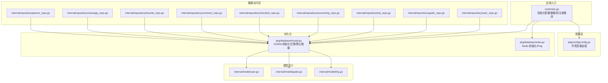
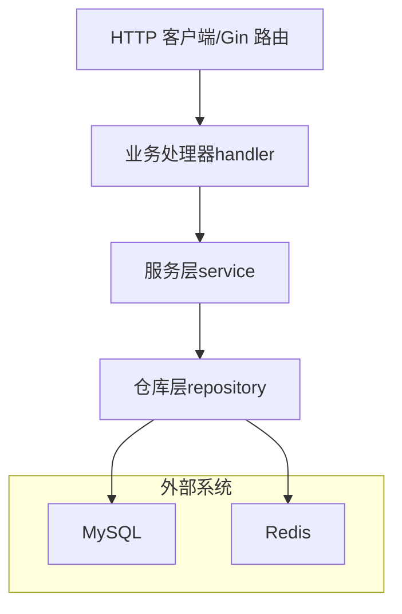
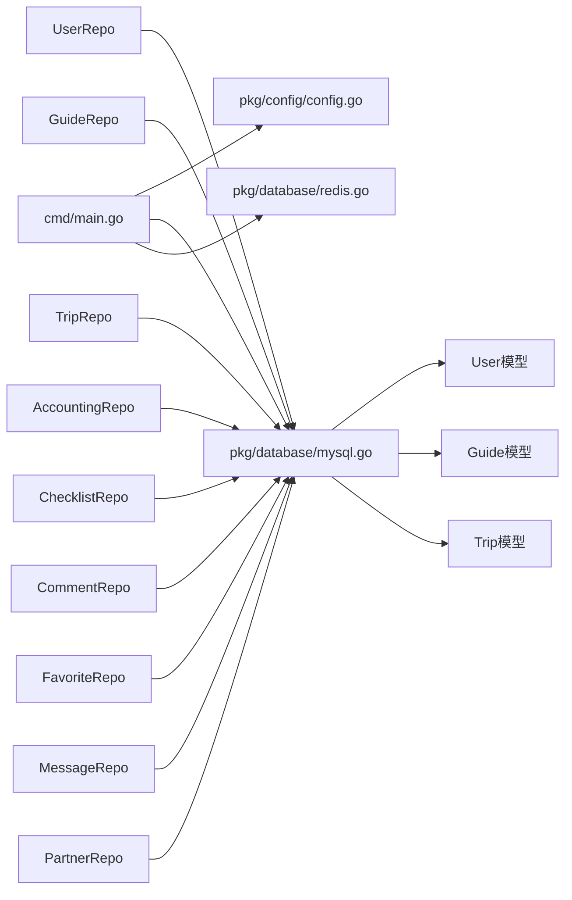

# 数据访问层

<cite>
**本文引用的文件**
- [cmd/main.go](file://cmd/main.go)
- [pkg/config/config.go](file://pkg/config/config.go)
- [pkg/database/mysql.go](file://pkg/database/mysql.go)
- [pkg/database/redis.go](file://pkg/database/redis.go)
- [internal/repository/user_repo.go](file://internal/repository/user_repo.go)
- [internal/repository/guide_repo.go](file://internal/repository/guide_repo.go)
- [internal/repository/trip_repo.go](file://internal/repository/trip_repo.go)
- [internal/repository/accounting_repo.go](file://internal/repository/accounting_repo.go)
- [internal/repository/checklist_repo.go](file://internal/repository/checklist_repo.go)
- [internal/repository/comment_repo.go](file://internal/repository/comment_repo.go)
- [internal/repository/favorite_repo.go](file://internal/repository/favorite_repo.go)
- [internal/repository/message_repo.go](file://internal/repository/message_repo.go)
- [internal/repository/partner_repo.go](file://internal/repository/partner_repo.go)
- [internal/model/user.go](file://internal/model/user.go)
- [internal/model/guide.go](file://internal/model/guide.go)
- [internal/model/trip.go](file://internal/model/trip.go)
</cite>

## 目录
1. [简介](#简介)
2. [项目结构](#项目结构)
3. [核心组件](#核心组件)
4. [架构总览](#架构总览)
5. [详细组件分析](#详细组件分析)
6. [依赖关系分析](#依赖关系分析)
7. [性能考量](#性能考量)
8. [故障排查指南](#故障排查指南)
9. [结论](#结论)
10. [附录](#附录)

## 简介
本文件系统性梳理旅行服务器项目的数据访问层（Repository Layer），重点覆盖以下方面：
- 仓库模式的实现与职责划分：UserRepo、GuideRepo、TripRepo 等核心数据访问对象的设计与边界。
- GORM ORM 的使用方式：模型关联、查询构建、事务处理与软删除。
- 数据库连接管理与 Redis 缓存策略：连接初始化、重试机制、Ping 校验。
- SQL 查询示例与性能优化建议：分页、条件过滤、预加载与表达式更新。
- 测试策略与 Mock 实现：如何隔离数据访问层进行单元测试。
- 数据一致性与并发控制：事务、乐观锁与缓存一致性策略。

## 项目结构
数据访问层位于 internal/repository 目录，围绕各业务模型提供 CRUD 与组合查询能力；数据库连接与 Redis 初始化位于 pkg/database，全局配置通过 pkg/config 提供。

图表来源
- [cmd/main.go:31-44](file://cmd/main.go#L31-L44)
- [pkg/config/config.go:61-100](file://pkg/config/config.go#L61-L100)
- [pkg/database/mysql.go:19-63](file://pkg/database/mysql.go#L19-L63)
- [pkg/database/redis.go:15-31](file://pkg/database/redis.go#L15-L31)
- [internal/repository/user_repo.go:1-44](file://internal/repository/user_repo.go#L1-L44)
- [internal/repository/guide_repo.go:1-104](file://internal/repository/guide_repo.go#L1-L104)
- [internal/repository/trip_repo.go:1-137](file://internal/repository/trip_repo.go#L1-L137)
- [internal/model/user.go:1-16](file://internal/model/user.go#L1-L16)
- [internal/model/guide.go:1-28](file://internal/model/guide.go#L1-L28)
- [internal/model/trip.go:1-38](file://internal/model/trip.go#L1-L38)

章节来源
- [cmd/main.go:31-44](file://cmd/main.go#L31-L44)
- [pkg/config/config.go:61-100](file://pkg/config/config.go#L61-L100)
- [pkg/database/mysql.go:19-63](file://pkg/database/mysql.go#L19-L63)
- [pkg/database/redis.go:15-31](file://pkg/database/redis.go#L15-L31)

## 核心组件
- 配置加载器：从环境变量读取数据库、Redis、第三方服务等配置，并提供默认值。
- 数据库初始化：基于 GORM 的 MySQL 连接、自动迁移、默认角色与管理员初始化。
- Redis 初始化：建立连接并进行 Ping 校验，确保可用性。
- 仓库实现：围绕业务模型提供查询、写入、更新、删除与事务操作，统一通过全局 DB 句柄访问。

章节来源
- [pkg/config/config.go:61-100](file://pkg/config/config.go#L61-L100)
- [pkg/database/mysql.go:19-63](file://pkg/database/mysql.go#L19-L63)
- [pkg/database/redis.go:15-31](file://pkg/database/redis.go#L15-L31)

## 架构总览
数据访问层采用“单 DB 句柄 + 多仓库”的轻量架构，所有仓库共享同一 GORM 实例，避免连接池竞争；Redis 作为独立缓存层，用于热点数据与会话缓存。

图表来源
- [cmd/main.go:31-44](file://cmd/main.go#L31-L44)
- [pkg/database/mysql.go:19-63](file://pkg/database/mysql.go#L19-L63)
- [pkg/database/redis.go:15-31](file://pkg/database/redis.go#L15-L31)

## 详细组件分析

### 仓库模式与职责划分
- 统一接口风格：每个仓库以函数形式暴露 CRUD 与组合查询，参数明确、错误返回一致。
- 职责边界清晰：按业务实体拆分仓库，避免交叉耦合；复杂关系通过预加载或事务处理。
- 事务封装：对需要强一致性的批量更新或级联删除，使用 GORM 事务包裹。

章节来源
- [internal/repository/user_repo.go:1-44](file://internal/repository/user_repo.go#L1-L44)
- [internal/repository/guide_repo.go:1-104](file://internal/repository/guide_repo.go#L1-L104)
- [internal/repository/trip_repo.go:1-137](file://internal/repository/trip_repo.go#L1-L137)
- [internal/repository/accounting_repo.go:1-19](file://internal/repository/accounting_repo.go#L1-L19)
- [internal/repository/checklist_repo.go:1-24](file://internal/repository/checklist_repo.go#L1-L24)
- [internal/repository/comment_repo.go:1-46](file://internal/repository/comment_repo.go#L1-L46)
- [internal/repository/favorite_repo.go:1-41](file://internal/repository/favorite_repo.go#L1-L41)
- [internal/repository/message_repo.go:1-20](file://internal/repository/message_repo.go#L1-L20)
- [internal/repository/partner_repo.go:1-64](file://internal/repository/partner_repo.go#L1-L64)

### UserRepo（用户）
- 核心职责：根据 OpenID/ID 查询用户、分页列出用户、创建用户、更新用户角色。
- 关键点：使用 First/Where/Model/Count/Offset/Limit 组合实现分页与条件查询；Update 使用指定字段更新，避免全量覆盖。

章节来源
- [internal/repository/user_repo.go:8-43](file://internal/repository/user_repo.go#L8-L43)
- [internal/model/user.go:1-16](file://internal/model/user.go#L1-L16)

### GuideRepo（攻略）
- 核心职责：瀑布流分页查询（按目的地模糊过滤）、创建攻略、详情查询（含板块）、后台列表、审核状态更新、浏览量自增、板块 CRUD 与批量重排。
- 关键点：条件拼接（destination LIKE）、排序（created_at DESC）、表达式更新（view_count + 1）、事务内批量更新 sort_order。

章节来源
- [internal/repository/guide_repo.go:12-103](file://internal/repository/guide_repo.go#L12-L103)
- [internal/model/guide.go:1-28](file://internal/model/guide.go#L1-L28)

### TripRepo（行程）
- 核心职责：行程 CRUD、详情预加载（Days.Items 按序号升序、Members）、用户行程列表、公开行程列表、行程日 CRUD、行程项 CRUD、批量创建与重排、添加/移除/更新同行者。
- 关键点：预加载策略减少 N+1 查询；事务级联删除行程日并清理行程项；表达式更新 sort_order。

章节来源
- [internal/repository/trip_repo.go:17-136](file://internal/repository/trip_repo.go#L17-L136)
- [internal/model/trip.go:1-38](file://internal/model/trip.go#L1-L38)

### 其他仓库（记账、清单、评论、收藏、消息、搭子）
- AccountingRepo：按行程与用户查询记账、新增记账。
- ChecklistRepo：查询用户清单并预加载条目、创建清单、更新条目勾选状态。
- CommentRepo：评论列表（含父节点过滤）、子回复查询、删除评论、点赞计数自增。
- FavoriteRepo：添加/取消收藏、判断是否已收藏、用户收藏列表。
- MessageRepo：发送消息、查询两人私聊记录。
- PartnerRepo：发布/更新/查询搭子、创建/处理申请、公开列表。

章节来源
- [internal/repository/accounting_repo.go:8-18](file://internal/repository/accounting_repo.go#L8-L18)
- [internal/repository/checklist_repo.go:8-23](file://internal/repository/checklist_repo.go#L8-L23)
- [internal/repository/comment_repo.go:10-45](file://internal/repository/comment_repo.go#L10-L45)
- [internal/repository/favorite_repo.go:8-40](file://internal/repository/favorite_repo.go#L8-L40)
- [internal/repository/message_repo.go:8-19](file://internal/repository/message_repo.go#L8-L19)
- [internal/repository/partner_repo.go:8-63](file://internal/repository/partner_repo.go#L8-L63)

### GORM 使用方式与模型关联
- 查询构建：Where/Order/Count/Offset/Limit/Find/First/Model/Preload/Updates/Delete/Create/Save 等方法组合。
- 表达式更新：使用 UpdateColumn 或 gorm.Expr 实现原子自增。
- 软删除：DeletedAt 字段配合 gorm.DeletedAt 实现逻辑删除。
- 预加载：Preload 嵌套关联，控制排序与筛选。
- 事务：Transaction 回调内执行多步写入，失败回滚。

章节来源
- [internal/repository/guide_repo.go:57-60](file://internal/repository/guide_repo.go#L57-L60)
- [internal/repository/trip_repo.go:20-26](file://internal/repository/trip_repo.go#L20-L26)
- [internal/repository/trip_repo.go:78-84](file://internal/repository/trip_repo.go#L78-L84)
- [internal/repository/trip_repo.go:110-119](file://internal/repository/trip_repo.go#L110-L119)
- [internal/model/guide.go:26](file://internal/model/guide.go#L26)
- [internal/model/trip.go:23](file://internal/model/trip.go#L23)

### 数据库连接管理与 Redis 缓存策略
- MySQL 连接：DSN 拼装、30 次重试、AutoMigrate 自动建表、默认角色与管理员初始化。
- Redis 连接：解析 REDIS_DB 字符串为整数、Ping 校验连通性。
- 缓存策略：当前仓库层未直接使用 Redis；可在服务层引入缓存读写与失效策略，如热点攻略/行程详情、用户信息、排行榜等。

章节来源
- [pkg/database/mysql.go:19-90](file://pkg/database/mysql.go#L19-L90)
- [pkg/database/redis.go:15-31](file://pkg/database/redis.go#L15-L31)
- [pkg/config/config.go:61-100](file://pkg/config/config.go#L61-L100)

### SQL 查询示例与性能优化
- 分页查询（通用模板）
  - 条件：WHERE + COUNT -> OFFSET + LIMIT -> ORDER BY
  - 示例路径：[internal/repository/guide_repo.go:12-24](file://internal/repository/guide_repo.go#L12-L24)、[internal/repository/trip_repo.go:40-48](file://internal/repository/trip_repo.go#L40-L48)
- 动态过滤（模糊匹配）
  - 示例路径：[internal/repository/guide_repo.go:18-20](file://internal/repository/guide_repo.go#L18-L20)、[internal/repository/trip_repo.go:56-58](file://internal/repository/trip_repo.go#L56-L58)
- 预加载与排序
  - 示例路径：[internal/repository/trip_repo.go:20-26](file://internal/repository/trip_repo.go#L20-L26)
- 表达式更新（原子自增）
  - 示例路径：[internal/repository/guide_repo.go:58-60](file://internal/repository/guide_repo.go#L58-L60)、[internal/repository/comment_repo.go:43-45](file://internal/repository/comment_repo.go#L43-L45)
- 事务批量更新
  - 示例路径：[internal/repository/guide_repo.go:94-103](file://internal/repository/guide_repo.go#L94-L103)、[internal/repository/trip_repo.go:110-119](file://internal/repository/trip_repo.go#L110-L119)

性能优化建议
- 为高频过滤字段（如 destination、user_id、status）建立索引。
- 对分页场景使用“延迟游标”或“基于主键范围”的分页，降低 OFFSET 深度带来的扫描成本。
- 合理使用预加载，避免 N+1；必要时拆分查询或使用 JOIN。
- 对热点数据引入 Redis 缓存，结合 TTL 与失效策略，减少数据库压力。

章节来源
- [internal/repository/guide_repo.go:12-24](file://internal/repository/guide_repo.go#L12-L24)
- [internal/repository/trip_repo.go:40-48](file://internal/repository/trip_repo.go#L40-L48)
- [internal/repository/guide_repo.go:18-20](file://internal/repository/guide_repo.go#L18-L20)
- [internal/repository/trip_repo.go:56-58](file://internal/repository/trip_repo.go#L56-L58)
- [internal/repository/trip_repo.go:20-26](file://internal/repository/trip_repo.go#L20-L26)
- [internal/repository/guide_repo.go:58-60](file://internal/repository/guide_repo.go#L58-L60)
- [internal/repository/comment_repo.go:43-45](file://internal/repository/comment_repo.go#L43-L45)
- [internal/repository/guide_repo.go:94-103](file://internal/repository/guide_repo.go#L94-L103)
- [internal/repository/trip_repo.go:110-119](file://internal/repository/trip_repo.go#L110-L119)

### 测试策略与 Mock 实现
- 单元测试：针对仓库函数构造最小依赖，使用内存数据库或 SQLite 进行集成测试。
- Mock 方案：使用接口抽象 DB 句柄，注入 Fake 实现；对 Redis 可替换为内存客户端或 No-op。
- 事务测试：对涉及事务的函数（如批量重排）编写正反例，验证回滚与提交行为。
- 基准测试：对热点查询（分页、预加载）进行基准测试，评估索引与查询计划。

（本节为通用实践指导，不直接分析具体文件）

### 数据一致性与并发控制
- 事务：对多步写入与级联删除使用事务，确保原子性。
- 并发写入：对自增字段使用表达式更新，避免读写竞争导致的覆盖。
- 软删除：通过 DeletedAt 字段实现逻辑删除，避免物理删除造成的数据不可追溯。
- 缓存一致性：若引入 Redis，需在写入成功后再更新缓存，或采用失效策略。

章节来源
- [internal/repository/guide_repo.go:94-103](file://internal/repository/guide_repo.go#L94-L103)
- [internal/repository/trip_repo.go:78-84](file://internal/repository/trip_repo.go#L78-L84)
- [internal/repository/guide_repo.go:58-60](file://internal/repository/guide_repo.go#L58-L60)
- [internal/model/guide.go:26](file://internal/model/guide.go#L26)
- [internal/model/trip.go:23](file://internal/model/trip.go#L23)

## 依赖关系分析
仓库层依赖全局 DB 句柄与模型定义；配置层提供数据源参数；入口负责初始化与路由注册。

图表来源
- [cmd/main.go:31-44](file://cmd/main.go#L31-L44)
- [pkg/config/config.go:61-100](file://pkg/config/config.go#L61-L100)
- [pkg/database/mysql.go:19-63](file://pkg/database/mysql.go#L19-L63)
- [internal/repository/user_repo.go:1-44](file://internal/repository/user_repo.go#L1-L44)
- [internal/repository/guide_repo.go:1-104](file://internal/repository/guide_repo.go#L1-L104)
- [internal/repository/trip_repo.go:1-137](file://internal/repository/trip_repo.go#L1-L137)
- [internal/model/user.go:1-16](file://internal/model/user.go#L1-L16)
- [internal/model/guide.go:1-28](file://internal/model/guide.go#L1-L28)
- [internal/model/trip.go:1-38](file://internal/model/trip.go#L1-L38)

章节来源
- [cmd/main.go:31-44](file://cmd/main.go#L31-L44)
- [pkg/config/config.go:61-100](file://pkg/config/config.go#L61-L100)
- [pkg/database/mysql.go:19-63](file://pkg/database/mysql.go#L19-L63)

## 性能考量
- 索引设计：为过滤与排序字段建立复合索引，如 (user_id, created_at)、(status, destination)。
- 分页优化：避免深度 OFFSET，优先使用基于主键的游标分页。
- 预加载策略：仅加载必要字段与层级，减少网络与序列化开销。
- 事务批处理：合并多次更新为单事务，减少锁竞争与往返次数。
- 缓存策略：热点数据缓存 + 失效策略，写后失效或延迟双删，避免脏读。

（本节为通用指导，不直接分析具体文件）

## 故障排查指南
- 数据库连接失败：检查 DSN 参数与重试逻辑，确认主机、端口、用户名、密码正确。
- 迁移失败：查看 AutoMigrate 报错，确认模型标签与字段类型兼容。
- Redis 连接失败：检查地址、端口、密码与 DB 索引转换。
- 查询异常：核对 WHERE 条件、排序与分页参数，必要时打印生成的 SQL 进行诊断。

章节来源
- [pkg/database/mysql.go:27-37](file://pkg/database/mysql.go#L27-L37)
- [pkg/database/mysql.go:61-63](file://pkg/database/mysql.go#L61-L63)
- [pkg/database/redis.go:23-30](file://pkg/database/redis.go#L23-L30)

## 结论
本项目的数据访问层以 GORM 为核心，采用轻量仓库模式，职责清晰、扩展性强。通过合理的查询构建、事务封装与软删除机制，满足了攻略、行程、用户等核心业务的数据需求。建议后续在服务层引入 Redis 缓存与更完善的索引策略，持续提升查询性能与系统稳定性。

## 附录
- 入口初始化流程：加载配置 → 初始化 MySQL → 初始化 Redis → 注册路由。
- 配置项来源：DB/Redis/第三方服务等均来自环境变量，具备默认值保障本地开发体验。

章节来源
- [cmd/main.go:31-44](file://cmd/main.go#L31-L44)
- [pkg/config/config.go:61-100](file://pkg/config/config.go#L61-L100)