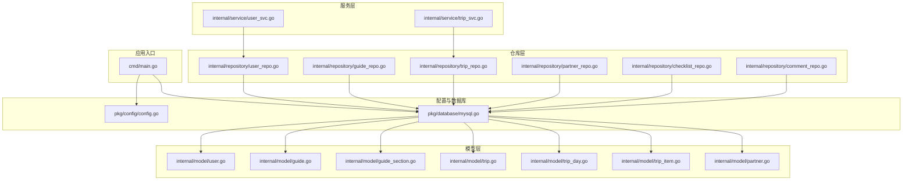
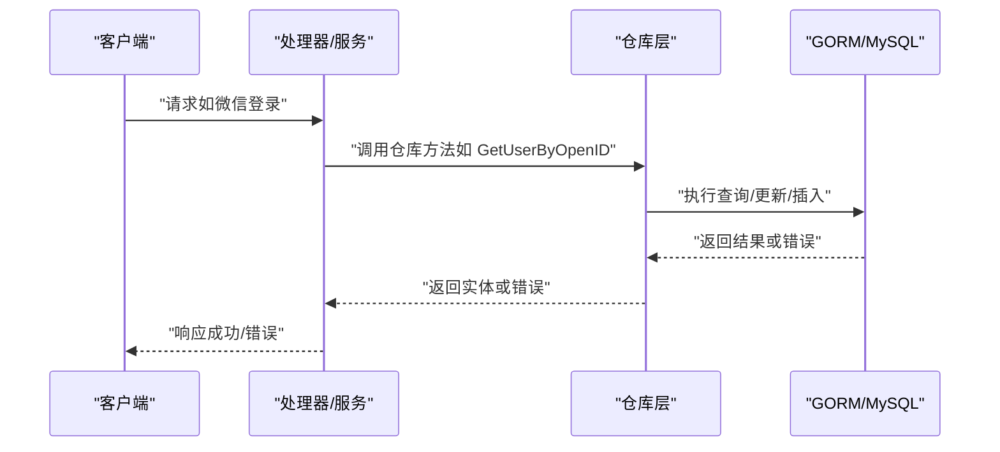
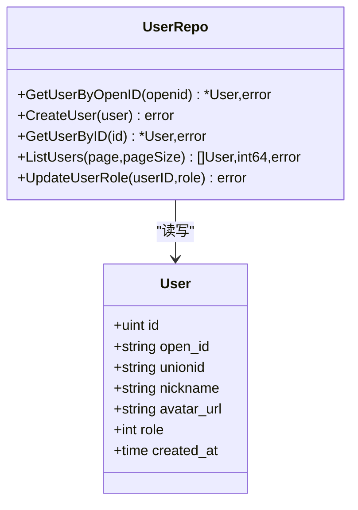
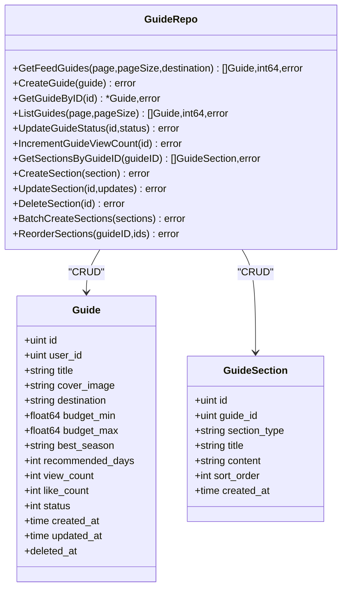
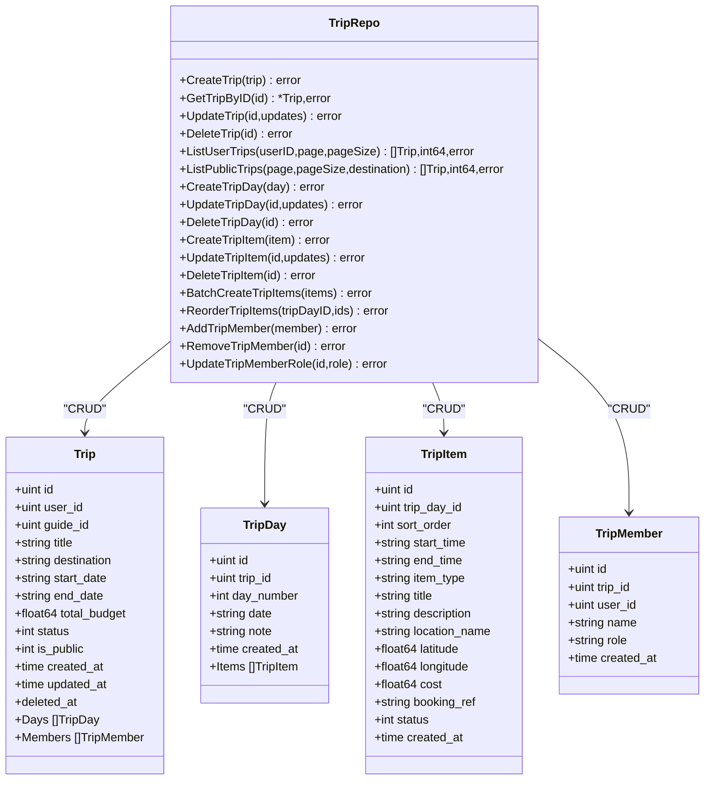
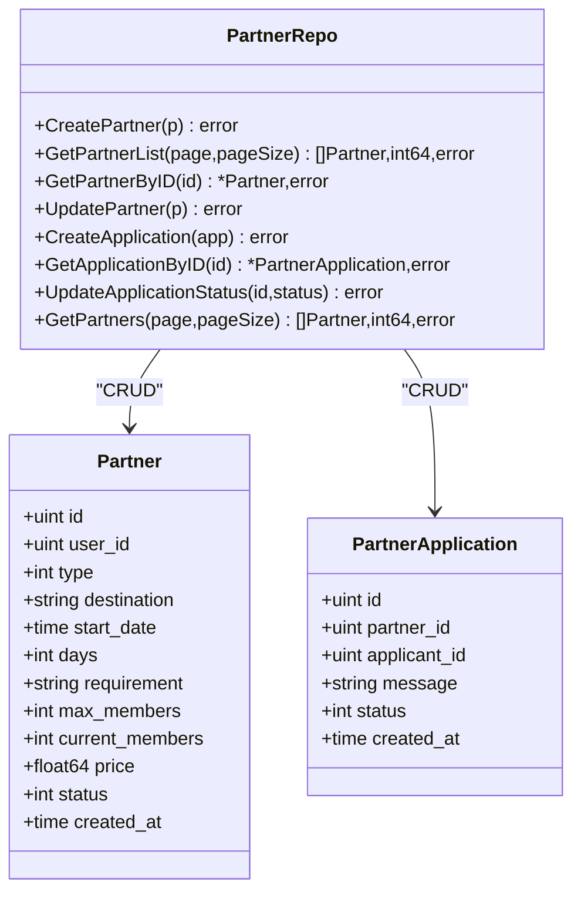
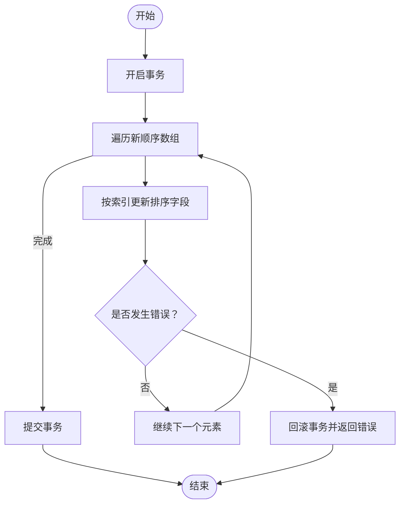
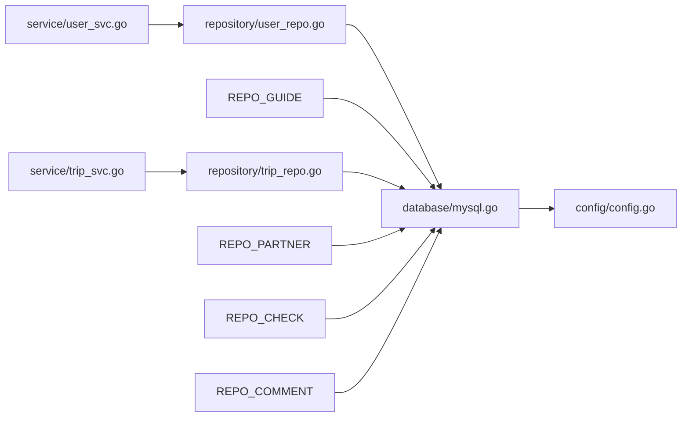

# 核心仓库实现

<cite>
**本文引用的文件**
- [cmd/main.go](file://cmd/main.go)
- [internal/repository/user_repo.go](file://internal/repository/user_repo.go)
- [internal/repository/guide_repo.go](file://internal/repository/guide_repo.go)
- [internal/repository/trip_repo.go](file://internal/repository/trip_repo.go)
- [internal/repository/partner_repo.go](file://internal/repository/partner_repo.go)
- [internal/repository/checklist_repo.go](file://internal/repository/checklist_repo.go)
- [internal/repository/comment_repo.go](file://internal/repository/comment_repo.go)
- [internal/model/user.go](file://internal/model/user.go)
- [internal/model/guide.go](file://internal/model/guide.go)
- [internal/model/guide_section.go](file://internal/model/guide_section.go)
- [internal/model/trip.go](file://internal/model/trip.go)
- [internal/model/trip_day.go](file://internal/model/trip_day.go)
- [internal/model/trip_item.go](file://internal/model/trip_item.go)
- [internal/model/partner.go](file://internal/model/partner.go)
- [pkg/database/mysql.go](file://pkg/database/mysql.go)
- [pkg/config/config.go](file://pkg/config/config.go)
- [internal/service/user_svc.go](file://internal/service/user_svc.go)
- [internal/service/trip_svc.go](file://internal/service/trip_svc.go)
</cite>

## 目录
1. [简介](#简介)
2. [项目结构](#项目结构)
3. [核心组件](#核心组件)
4. [架构总览](#架构总览)
5. [详细组件分析](#详细组件分析)
6. [依赖分析](#依赖分析)
7. [性能考虑](#性能考虑)
8. [故障排查指南](#故障排查指南)
9. [结论](#结论)
10. [附录](#附录)

## 简介
本文件聚焦于旅行服务器项目中的核心业务仓库（Repository）实现，系统性解析以下仓库的设计与职责边界：
- UserRepo：用户域的增删改查、角色管理与分页查询
- GuideRepo：攻略与攻略板块的全生命周期管理，含排序与批量操作
- TripRepo：行程、行程日、行程项与同行者的多层级数据管理，含预加载与事务
- PartnerRepo：搭子发布、申请与状态管理
同时覆盖：
- 仓库间协作模式与边界划分
- GORM 使用范式与最佳实践（事务、预加载、表达式更新）
- 查询优化与索引策略建议
- 错误处理与事务管理
- 缓存策略在仓库层的应用建议

## 项目结构
仓库层位于 internal/repository，围绕 internal/model 的数据模型进行 CRUD 与复杂查询封装；数据库连接与迁移由 pkg/database/mysql.go 提供；配置通过 pkg/config/config.go 注入。

图表来源
- [cmd/main.go](file://cmd/main.go)
- [pkg/config/config.go](file://pkg/config/config.go)
- [pkg/database/mysql.go](file://pkg/database/mysql.go)
- [internal/model/user.go](file://internal/model/user.go)
- [internal/model/guide.go](file://internal/model/guide.go)
- [internal/model/guide_section.go](file://internal/model/guide_section.go)
- [internal/model/trip.go](file://internal/model/trip.go)
- [internal/model/trip_day.go](file://internal/model/trip_day.go)
- [internal/model/trip_item.go](file://internal/model/trip_item.go)
- [internal/model/partner.go](file://internal/model/partner.go)
- [internal/repository/user_repo.go](file://internal/repository/user_repo.go)
- [internal/repository/guide_repo.go](file://internal/repository/guide_repo.go)
- [internal/repository/trip_repo.go](file://internal/repository/trip_repo.go)
- [internal/repository/partner_repo.go](file://internal/repository/partner_repo.go)
- [internal/repository/checklist_repo.go](file://internal/repository/checklist_repo.go)
- [internal/repository/comment_repo.go](file://internal/repository/comment_repo.go)
- [internal/service/user_svc.go](file://internal/service/user_svc.go)
- [internal/service/trip_svc.go](file://internal/service/trip_svc.go)

章节来源
- [pkg/database/mysql.go:19-91](file://pkg/database/mysql.go#L19-L91)
- [pkg/config/config.go:60-100](file://pkg/config/config.go#L60-L100)

## 核心组件
本节对各仓库的职责、CRUD 与复杂查询进行梳理，并给出 GORM 使用示例路径与最佳实践要点。

- UserRepo（用户）
  - 职责：根据 OpenID 查询用户、创建用户、按 ID 查询、分页列表、更新用户角色
  - 关键方法与示例路径：
    - [GetUserByOpenID:8-16](file://internal/repository/user_repo.go#L8-L16)
    - [CreateUser:18-21](file://internal/repository/user_repo.go#L18-L21)
    - [GetUserByID:23-28](file://internal/repository/user_repo.go#L23-L28)
    - [ListUsers:30-38](file://internal/repository/user_repo.go#L30-L38)
    - [UpdateUserRole:40-43](file://internal/repository/user_repo.go#L40-L43)
  - 数据模型：[User:6-15](file://internal/model/user.go#L6-L15)
  - 事务与错误处理：无显式事务，错误透传；建议在服务层统一处理
  - 缓存策略：可在仓库层对热点用户信息做只读缓存（如按 OpenID）

- GuideRepo（攻略）
  - 职责：攻略的瀑布流分页、后台列表、审核、浏览量自增；攻略板块的增删改、批量创建、排序重排
  - 关键方法与示例路径：
    - [GetFeedGuides:12-24](file://internal/repository/guide_repo.go#L12-L24)
    - [CreateGuide:26-29](file://internal/repository/guide_repo.go#L26-L29)
    - [GetGuideByID:31-39](file://internal/repository/guide_repo.go#L31-L39)
    - [ListGuides:41-49](file://internal/repository/guide_repo.go#L41-L49)
    - [UpdateGuideStatus:51-54](file://internal/repository/guide_repo.go#L51-L54)
    - [IncrementGuideViewCount:56-60](file://internal/repository/guide_repo.go#L56-L60)
    - [GetSectionsByGuideID:64-70](file://internal/repository/guide_repo.go#L64-L70)
    - [CreateSection:72-75](file://internal/repository/guide_repo.go#L72-L75)
    - [UpdateSection:77-80](file://internal/repository/guide_repo.go#L77-L80)
    - [DeleteSection:82-85](file://internal/repository/guide_repo.go#L82-L85)
    - [BatchCreateSections:87-90](file://internal/repository/guide_repo.go#L87-L90)
    - [ReorderSections:92-103](file://internal/repository/guide_repo.go#L92-L103)
  - 数据模型：[Guide:9-27](file://internal/model/guide.go#L9-L27)、[GuideSection:18-27](file://internal/model/guide_section.go#L18-L27)
  - 事务与错误处理：重排板块使用事务保证一致性
  - 缓存策略：攻略详情与板块可做只读缓存；浏览量可用数据库表达式原子更新

- TripRepo（行程）
  - 职责：行程的创建、详情（含行程日、行程项、同行者）、更新、软删除；用户行程列表、公开行程列表；行程日与行程项的增删改、批量创建、排序重排；同行者添加、移除、角色更新
  - 关键方法与示例路径：
    - [CreateTrip:12-15](file://internal/repository/trip_repo.go#L12-L15)
    - [GetTripByID:17-27](file://internal/repository/trip_repo.go#L17-L27)
    - [UpdateTrip:29-32](file://internal/repository/trip_repo.go#L29-L32)
    - [DeleteTrip:34-37](file://internal/repository/trip_repo.go#L34-L37)
    - [ListUserTrips:39-48](file://internal/repository/trip_repo.go#L39-L48)
    - [ListPublicTrips:50-62](file://internal/repository/trip_repo.go#L50-L62)
    - [CreateTripDay:66-69](file://internal/repository/trip_repo.go#L66-L69)
    - [UpdateTripDay:71-74](file://internal/repository/trip_repo.go#L71-L74)
    - [DeleteTripDay:76-84](file://internal/repository/trip_repo.go#L76-L84)
    - [CreateTripItem:88-91](file://internal/repository/trip_repo.go#L88-L91)
    - [UpdateTripItem:93-96](file://internal/repository/trip_repo.go#L93-L96)
    - [DeleteTripItem:98-101](file://internal/repository/trip_repo.go#L98-L101)
    - [BatchCreateTripItems:103-106](file://internal/repository/trip_repo.go#L103-L106)
    - [ReorderTripItems:108-119](file://internal/repository/trip_repo.go#L108-L119)
    - [AddTripMember:123-126](file://internal/repository/trip_repo.go#L123-L126)
    - [RemoveTripMember:128-131](file://internal/repository/trip_repo.go#L128-L131)
    - [UpdateTripMemberRole:133-136](file://internal/repository/trip_repo.go#L133-L136)
  - 数据模型：[Trip:9-27](file://internal/model/trip.go#L9-L27)、[TripDay:5-15](file://internal/model/trip_day.go#L5-L15)、[TripItem:5-22](file://internal/model/trip_item.go#L5-L22)
  - 事务与错误处理：删除行程日使用事务先删行程项再删日；重排行程项使用事务
  - 缓存策略：行程详情可做只读缓存；成员变更需失效对应行程缓存

- PartnerRepo（搭子）
  - 职责：发布搭子、获取列表、按 ID 查询、更新信息；创建申请、按 ID 查询、修改申请状态；用户发起与官方活动两类搭子列表
  - 关键方法与示例路径：
    - [CreatePartner:8-11](file://internal/repository/partner_repo.go#L8-L11)
    - [GetPartnerList:13-21](file://internal/repository/partner_repo.go#L13-L21)
    - [GetPartnerByID:23-28](file://internal/repository/partner_repo.go#L23-L28)
    - [UpdatePartner:30-33](file://internal/repository/partner_repo.go#L30-L33)
    - [CreateApplication:35-38](file://internal/repository/partner_repo.go#L35-L38)
    - [GetApplicationByID:40-45](file://internal/repository/partner_repo.go#L40-L45)
    - [UpdateApplicationStatus:47-50](file://internal/repository/partner_repo.go#L47-L50)
    - [GetPartners:52-63](file://internal/repository/partner_repo.go#L52-L63)
  - 数据模型：[Partner:5-19](file://internal/model/partner.go#L5-L19)、[PartnerApplication:21-29](file://internal/model/partner.go#L21-L29)
  - 事务与错误处理：无显式事务，错误透传
  - 缓存策略：搭子列表可做分页缓存；申请状态变更需失效相关缓存

- ChecklistRepo（备忘清单）与 CommentRepo（评论）
  - 作为补充仓库，体现仓库层通用模式：条件查询、分页统计、表达式更新、预加载关联
  - 示例路径：
    - [GetChecklistsByUser:8-13](file://internal/repository/checklist_repo.go#L8-L13)
    - [CreateChecklist:15-18](file://internal/repository/checklist_repo.go#L15-L18)
    - [UpdateChecklistItem:20-23](file://internal/repository/checklist_repo.go#L20-L23)
    - [GetCommentsByTarget:15-26](file://internal/repository/comment_repo.go#L15-L26)
    - [GetRepliesByParentID:28-34](file://internal/repository/comment_repo.go#L28-L34)
    - [DeleteComment:36-40](file://internal/repository/comment_repo.go#L36-L40)
    - [IncrementCommentLikeCount:41-45](file://internal/repository/comment_repo.go#L41-L45)

章节来源
- [internal/repository/user_repo.go:1-44](file://internal/repository/user_repo.go#L1-L44)
- [internal/repository/guide_repo.go:1-104](file://internal/repository/guide_repo.go#L1-L104)
- [internal/repository/trip_repo.go:1-137](file://internal/repository/trip_repo.go#L1-L137)
- [internal/repository/partner_repo.go:1-64](file://internal/repository/partner_repo.go#L1-L64)
- [internal/repository/checklist_repo.go:1-24](file://internal/repository/checklist_repo.go#L1-L24)
- [internal/repository/comment_repo.go:1-46](file://internal/repository/comment_repo.go#L1-L46)
- [internal/model/user.go:6-15](file://internal/model/user.go#L6-L15)
- [internal/model/guide.go:9-27](file://internal/model/guide.go#L9-L27)
- [internal/model/guide_section.go:18-27](file://internal/model/guide_section.go#L18-L27)
- [internal/model/trip.go:9-27](file://internal/model/trip.go#L9-L27)
- [internal/model/trip_day.go:5-15](file://internal/model/trip_day.go#L5-L15)
- [internal/model/trip_item.go:5-22](file://internal/model/trip_item.go#L5-L22)
- [internal/model/partner.go:5-29](file://internal/model/partner.go#L5-L29)

## 架构总览
仓库层通过 GORM 对接数据库，服务层调用仓库完成业务编排。数据库初始化在应用启动阶段完成，自动迁移模型并初始化默认角色与管理员账户。

图表来源
- [internal/service/user_svc.go:12-27](file://internal/service/user_svc.go#L12-L27)
- [internal/repository/user_repo.go:8-16](file://internal/repository/user_repo.go#L8-L16)
- [pkg/database/mysql.go:19-91](file://pkg/database/mysql.go#L19-L91)

章节来源
- [pkg/database/mysql.go:19-91](file://pkg/database/mysql.go#L19-L91)
- [internal/service/user_svc.go:12-27](file://internal/service/user_svc.go#L12-L27)

## 详细组件分析

### UserRepo（用户）分析
- 设计要点
  - 单一职责：用户域 CRUD 与角色管理
  - 分页与条件查询：基于 Offset/Limit 与 Where 条件
  - 错误处理：直接透传 GORM 错误，服务层统一处理
- 代码级关系示意

图表来源
- [internal/repository/user_repo.go:8-43](file://internal/repository/user_repo.go#L8-L43)
- [internal/model/user.go:6-15](file://internal/model/user.go#L6-L15)

章节来源
- [internal/repository/user_repo.go:1-44](file://internal/repository/user_repo.go#L1-L44)
- [internal/model/user.go:6-15](file://internal/model/user.go#L6-L15)

### GuideRepo（攻略）分析
- 设计要点
  - 双模型：Guide 与 GuideSection
  - 复杂查询：带条件过滤、排序、分页统计
  - 事务：板块重排保证顺序一致性
  - 原子更新：浏览量使用表达式更新
- 代码级关系示意

图表来源
- [internal/repository/guide_repo.go:12-103](file://internal/repository/guide_repo.go#L12-L103)
- [internal/model/guide.go:9-27](file://internal/model/guide.go#L9-L27)
- [internal/model/guide_section.go:18-27](file://internal/model/guide_section.go#L18-L27)

章节来源
- [internal/repository/guide_repo.go:1-104](file://internal/repository/guide_repo.go#L1-L104)
- [internal/model/guide.go:9-27](file://internal/model/guide.go#L9-L27)
- [internal/model/guide_section.go:18-27](file://internal/model/guide_section.go#L18-L27)

### TripRepo（行程）分析
- 设计要点
  - 多层级模型：Trip → TripDay → TripItem，以及 TripMember
  - 预加载：GetTripByID 预加载 Days.Items 与 Members 并排序
  - 事务：删除行程日先删除其行程项，再删除日
  - 排序：支持板块/行程项的重排
- 代码级关系示意

图表来源
- [internal/repository/trip_repo.go:17-136](file://internal/repository/trip_repo.go#L17-L136)
- [internal/model/trip.go:9-27](file://internal/model/trip.go#L9-L27)
- [internal/model/trip_day.go:5-15](file://internal/model/trip_day.go#L5-L15)
- [internal/model/trip_item.go:5-22](file://internal/model/trip_item.go#L5-L22)

章节来源
- [internal/repository/trip_repo.go:1-137](file://internal/repository/trip_repo.go#L1-L137)
- [internal/model/trip.go:9-27](file://internal/model/trip.go#L9-L27)
- [internal/model/trip_day.go:5-15](file://internal/model/trip_day.go#L5-L15)
- [internal/model/trip_item.go:5-22](file://internal/model/trip_item.go#L5-L22)

### PartnerRepo（搭子）分析
- 设计要点
  - 两类搭子：用户发起与官方活动
  - 申请流程：创建申请、按 ID 查询、修改状态
  - 列表分页：按创建时间倒序
- 代码级关系示意

图表来源
- [internal/repository/partner_repo.go:8-63](file://internal/repository/partner_repo.go#L8-L63)
- [internal/model/partner.go:5-29](file://internal/model/partner.go#L5-L29)

章节来源
- [internal/repository/partner_repo.go:1-64](file://internal/repository/partner_repo.go#L1-L64)
- [internal/model/partner.go:5-29](file://internal/model/partner.go#L5-L29)

### 复杂流程示例：重排板块与行程项（事务）

图表来源
- [internal/repository/guide_repo.go:92-103](file://internal/repository/guide_repo.go#L92-L103)
- [internal/repository/trip_repo.go:108-119](file://internal/repository/trip_repo.go#L108-L119)

## 依赖分析
- 仓库依赖
  - 所有仓库依赖 pkg/database/mysql.go 中的全局 DB 实例
  - 仓库依赖 internal/model 下的数据模型
- 服务依赖
  - 服务层通过仓库暴露的接口完成业务编排
- 外部依赖
  - GORM、MySQL 驱动、配置加载

图表来源
- [internal/service/user_svc.go:12-27](file://internal/service/user_svc.go#L12-L27)
- [internal/service/trip_svc.go:7-18](file://internal/service/trip_svc.go#L7-L18)
- [internal/repository/user_repo.go:8-43](file://internal/repository/user_repo.go#L8-L43)
- [internal/repository/guide_repo.go:12-103](file://internal/repository/guide_repo.go#L12-L103)
- [internal/repository/trip_repo.go:17-136](file://internal/repository/trip_repo.go#L17-L136)
- [internal/repository/partner_repo.go:8-63](file://internal/repository/partner_repo.go#L8-L63)
- [internal/repository/checklist_repo.go:8-23](file://internal/repository/checklist_repo.go#L8-L23)
- [internal/repository/comment_repo.go:15-45](file://internal/repository/comment_repo.go#L15-L45)
- [pkg/database/mysql.go:19-91](file://pkg/database/mysql.go#L19-L91)
- [pkg/config/config.go:60-100](file://pkg/config/config.go#L60-L100)

章节来源
- [internal/service/user_svc.go:12-27](file://internal/service/user_svc.go#L12-L27)
- [internal/service/trip_svc.go:7-18](file://internal/service/trip_svc.go#L7-L18)
- [internal/repository/user_repo.go:8-43](file://internal/repository/user_repo.go#L8-L43)
- [internal/repository/guide_repo.go:12-103](file://internal/repository/guide_repo.go#L12-L103)
- [internal/repository/trip_repo.go:17-136](file://internal/repository/trip_repo.go#L17-L136)
- [internal/repository/partner_repo.go:8-63](file://internal/repository/partner_repo.go#L8-L63)
- [internal/repository/checklist_repo.go:8-23](file://internal/repository/checklist_repo.go#L8-L23)
- [internal/repository/comment_repo.go:15-45](file://internal/repository/comment_repo.go#L15-L45)
- [pkg/database/mysql.go:19-91](file://pkg/database/mysql.go#L19-L91)
- [pkg/config/config.go:60-100](file://pkg/config/config.go#L60-L100)

## 性能考虑
- 查询优化
  - 分页：使用 Count + Offset + Limit，避免一次性加载大量数据
  - 条件过滤：对常用过滤字段（如 destination、status、user_id）建立索引
  - 排序：对排序字段（如 created_at、sort_order）建立索引
- 索引策略建议
  - 用户：open_id 唯一索引（已存在），可考虑 unionid 索引
  - 攻略：destination 模糊匹配建议建立前缀索引或全文索引；status 建立索引
  - 行程：user_id、is_public、destination 建立复合索引；排序字段 sort_order 建索引
  - 搭子：destination、type、status 建立复合索引
- 原子更新
  - 浏览量与点赞数使用表达式更新，减少锁竞争
- 预加载与 N+1
  - 通过 Preload 一次性加载关联数据，避免 N+1 查询
- 缓存策略
  - 读多写少场景：对攻略详情、行程详情、公开行程列表做只读缓存
  - 写后失效：对成员变更、板块重排、排序调整后的数据进行缓存失效
  - 缓存键设计：包含版本号或时间戳，避免脏读

## 故障排查指南
- 常见错误类型
  - 记录不存在：GORM ErrRecordNotFound，服务层应区分处理
  - 唯一约束冲突：如 OpenID 唯一索引冲突，需捕获并提示
  - 外键约束：删除行程日时需先删除行程项，避免外键错误
- 事务与并发
  - 重排操作必须使用事务，确保排序一致性
  - 原子更新表达式用于高并发场景
- 日志与监控
  - 数据库连接失败会重试多次，检查环境变量与网络
  - 迁移失败需检查模型定义与权限

章节来源
- [internal/service/user_svc.go:12-27](file://internal/service/user_svc.go#L12-L27)
- [internal/repository/guide_repo.go:92-103](file://internal/repository/guide_repo.go#L92-L103)
- [internal/repository/trip_repo.go:76-84](file://internal/repository/trip_repo.go#L76-L84)
- [pkg/database/mysql.go:27-37](file://pkg/database/mysql.go#L27-L37)
- [pkg/database/mysql.go:60-63](file://pkg/database/mysql.go#L60-L63)

## 结论
- 仓库层以 GORM 为核心，围绕模型进行清晰的 CRUD 与复杂查询封装
- 通过事务保障关键一致性（板块/行程项重排）
- 采用表达式更新与预加载提升性能
- 建议在仓库层引入缓存策略与索引优化，配合服务层统一错误处理

## 附录
- 启动流程要点
  - 加载配置：[LoadConfig:60-100](file://pkg/config/config.go#L60-L100)
  - 初始化数据库：[InitMySQL:19-91](file://pkg/database/mysql.go#L19-L91)
  - 在 main 中调用上述函数完成初始化

章节来源
- [pkg/config/config.go:60-100](file://pkg/config/config.go#L60-L100)
- [pkg/database/mysql.go:19-91](file://pkg/database/mysql.go#L19-L91)
- [cmd/main.go](file://cmd/main.go)