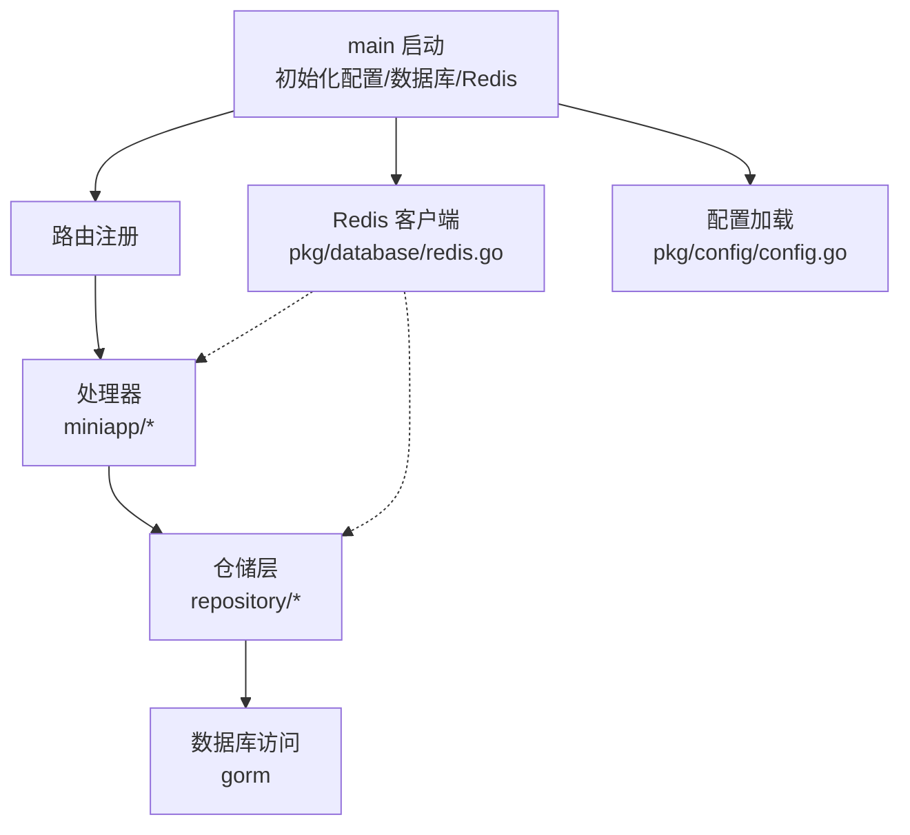
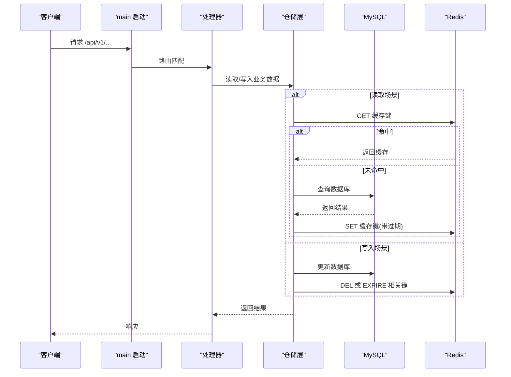
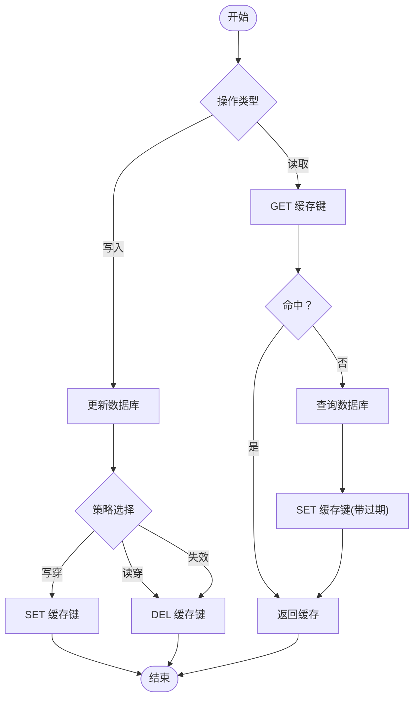
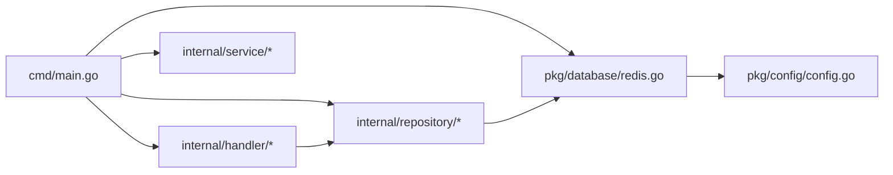

# 缓存策略

<cite>
**本文引用的文件**
- [cmd/main.go](file://cmd/main.go)
- [pkg/config/config.go](file://pkg/config/config.go)
- [pkg/database/redis.go](file://pkg/database/redis.go)
- [internal/handler/miniapp/nearby.go](file://internal/handler/miniapp/nearby.go)
- [internal/handler/miniapp/trip.go](file://internal/handler/miniapp/trip.go)
- [internal/handler/miniapp/user.go](file://internal/handler/miniapp/user.go)
- [internal/repository/trip_repo.go](file://internal/repository/trip_repo.go)
- [internal/repository/user_repo.go](file://internal/repository/user_repo.go)
- [internal/repository/recommendation_repo.go](file://internal/repository/recommendation_repo.go)
- [internal/model/recommendation.go](file://internal/model/recommendation.go)
- [go.mod](file://go.mod)
</cite>

## 目录
1. [引言](#引言)
2. [项目结构](#项目结构)
3. [核心组件](#核心组件)
4. [架构总览](#架构总览)
5. [详细组件分析](#详细组件分析)
6. [依赖分析](#依赖分析)
7. [性能考虑](#性能考虑)
8. [故障排查指南](#故障排查指南)
9. [结论](#结论)
10. [附录](#附录)

## 引言
本文件系统化梳理项目中 Redis 缓存策略的设计与落地，覆盖以下主题：
- 缓存键设计原则（命名规范、过期时间、作用域）
- 缓存更新策略（写穿、读穿、失效）
- 缓存安全三防（穿透、击穿、雪崩）
- 典型数据结构操作示例（字符串、哈希、列表、集合）
- 性能监控与调优
- 数据一致性与分布式锁
- 双写一致性与最终一致方案

说明：当前仓库中 Redis 客户端初始化已完成，但未发现显式的缓存读写封装或统一缓存中间件；因此本文在“实现现状”基础上，提供可直接落地的工程化建议与最佳实践。

## 项目结构
- 服务入口在 main 中初始化配置、数据库与 Redis，并注册路由。
- Redis 客户端在 pkg/database/redis.go 中全局暴露，供各层使用。
- 配置来自 pkg/config/config.go，支持从环境变量加载。
- 处理器位于 internal/handler 下，业务逻辑位于 internal/service 与 internal/repository 中。
- go.mod 显示项目使用 go-redis v8 客户端。

图表来源
- [cmd/main.go:31-37](file://cmd/main.go#L31-L37)
- [pkg/database/redis.go:15-31](file://pkg/database/redis.go#L15-L31)
- [pkg/config/config.go:60-100](file://pkg/config/config.go#L60-L100)

章节来源
- [cmd/main.go:31-37](file://cmd/main.go#L31-L37)
- [pkg/database/redis.go:15-31](file://pkg/database/redis.go#L15-L31)
- [pkg/config/config.go:60-100](file://pkg/config/config.go#L60-L100)

## 核心组件
- Redis 客户端初始化与连接池
  - 在 pkg/database/redis.go 中，根据配置构造 redis.Client 并执行 Ping 校验。
  - 配置来源于 pkg/config/config.go 的 AppConfig，包含 REDIS_HOST、REDIS_PORT、REDIS_PASSWORD、REDIS_DB。
- 服务启动流程
  - main 在启动时调用 InitRedis 完成 Redis 初始化，随后注册路由。
- 处理器与仓储
  - 处理器内部可直接使用 Redis 客户端进行缓存读写。
  - 仓储层负责数据库访问，可作为缓存更新策略的边界层。

章节来源
- [pkg/database/redis.go:15-31](file://pkg/database/redis.go#L15-L31)
- [pkg/config/config.go:60-100](file://pkg/config/config.go#L60-L100)
- [cmd/main.go:31-37](file://cmd/main.go#L31-L37)

## 架构总览
下图展示服务启动、路由处理与缓存交互的整体流程：

图表来源
- [cmd/main.go:47-143](file://cmd/main.go#L47-L143)
- [pkg/database/redis.go:15-31](file://pkg/database/redis.go#L15-L31)
- [internal/repository/trip_repo.go:17-27](file://internal/repository/trip_repo.go#L17-L27)

## 详细组件分析

### Redis 客户端初始化与配置
- 初始化步骤
  - 从配置读取主机、端口、密码、DB 索引。
  - 将 REDIS_DB 字符串转换为整数，若解析失败则回退为 0。
  - 使用 redis.NewClient 创建客户端并执行 Ping 校验。
- 配置来源
  - REDIS_* 环境变量通过 LoadConfig 注入 AppConfig。
- 使用建议
  - 在应用启动阶段集中初始化，避免并发初始化竞争。
  - 对外暴露全局 RedisClient，便于各层直接使用。

章节来源
- [pkg/database/redis.go:15-31](file://pkg/database/redis.go#L15-L31)
- [pkg/config/config.go:60-100](file://pkg/config/config.go#L60-L100)

### 缓存键设计原则
- 命名规范
  - 建议采用“模块:实体:标识”的层级命名，例如：trip:detail:{tripId}、user:profile:{userId}。
  - 对于列表/聚合键，使用“模块:list:{条件}:{排序}”，例如：trip:list:user:{userId}:desc。
- 过期时间
  - 热点数据：短 TTL（如 30-120 秒），结合异步刷新。
  - 常规数据：中 TTL（如 5-15 分钟），结合 LRU 淘汰。
  - 不变/弱变数据：较长 TTL（如 1-7 天），或使用版本号前缀实现“软失效”。
- 作用域管理
  - 多租户/多环境：在键前加入租户/环境标识，避免键冲突。
  - 用户维度：在键中嵌入 userId，便于清理用户相关缓存。
  - 城市/区域：对推荐类数据按 city 维度拆分键空间。

### 缓存更新策略
- 写穿（Write-Through）
  - 写数据库成功后再写缓存，确保缓存与数据库一致。
  - 适用于强一致要求的场景（如用户资料变更）。
- 读穿（Read-Through）
  - 读缓存未命中时，先查数据库再写缓存，最后返回。
  - 适用于冷数据热化与懒加载。
- 失效（Lazy Expiration）
  - 写数据库后主动删除缓存键，下次读取触发读穿。
  - 适用于热点数据的快速失效与重算。

图表来源
- [pkg/database/redis.go:15-31](file://pkg/database/redis.go#L15-L31)
- [internal/repository/trip_repo.go:17-27](file://internal/repository/trip_repo.go#L17-L27)

### 缓存安全三防
- 缓存穿透（查询不存在的数据）
  - 方案：空结果也缓存，设置短 TTL；或使用布隆过滤器预筛。
- 缓存击穿（热点 Key 过期）
  - 方案：热点 Key 永不过期，后台异步刷新；或互斥锁（单飞）保护。
- 缓存雪崩（大面积过期）
  - 方案：TTL 加随机抖动；多级缓存（本地缓存+Redis）；热点 Key 多副本。

### 典型数据结构操作示例
说明：以下为操作思路与键设计示例，不直接展示代码内容。

- 字符串（String）
  - 场景：用户资料、计数器、开关控制。
  - 示例键：user:profile:{userId}、trip:like:{tripId}。
  - 操作：GET/SET/EXPIRE/INCR。
- 哈希（Hash）
  - 场景：用户资料对象、商品属性。
  - 示例键：user:profile:{userId}。
  - 操作：HGETALL/HMGET/HSET/HDEL。
- 列表（List）
  - 场景：最近浏览、最新动态。
  - 示例键：user:recent:{userId}:browse。
  - 操作：LPUSH/RPUSH/LTRIM/LRANGE。
- 集合（Set）
  - 场景：标签集合、关注集合。
  - 示例键：user:tags:{userId}、trip:members:{tripId}。
  - 操作：SADD/SMEMBERS/SREM/SINTER/SUNION。

### 性能监控与调优
- 指标采集
  - 命中率：(命中次数)/(命中+未命中)。
  - 延迟分布：P50/P95/P99 GET/SET。
  - 内存使用：used_memory、fragmentation_ratio。
  - 过期与淘汰：expired_keys、evicted_keys。
- 调优方向
  - 合理设置 TTL 与内存淘汰策略。
  - 对大对象使用压缩或分片。
  - 控制热点 Key 的并发访问（互斥锁/队列去重）。
  - 使用 Pipeline 批量命令降低 RTT。

### 数据一致性与分布式锁
- 分布式锁
  - 场景：防止缓存击穿的互斥刷新。
  - 实现：SET key value NX EX ttl。
  - 注意：加锁与解锁必须成对，value 使用唯一标识。
- 双写一致性
  - 写策略：先写数据库，再写缓存或删除缓存。
  - 读策略：读缓存未命中时读数据库并回填缓存。
  - 异常补偿：基于消息队列或定时任务兜底。

### 缓存与数据库的双写一致性
- 问题背景
  - 写数据库成功但缓存未更新或删除，导致读取脏数据。
- 解决方案
  - Cache-Aside（旁路缓存）：写后删除缓存，读时补热。
  - Write-Through：写后同步更新缓存。
  - Read-Through：读未命中时回源并写缓存。
  - 版本号/时间戳：键中携带版本，缓存命中后校验是否过期。

## 依赖分析
- go-redis v8 客户端
  - 项目使用 github.com/go-redis/redis/v8，具备连接池、Pipeline、事务等能力。
- 项目启动与缓存集成
  - main 在启动时调用 InitRedis，随后注册路由；处理器与仓储可直接使用全局 RedisClient。

图表来源
- [cmd/main.go:31-37](file://cmd/main.go#L31-L37)
- [pkg/database/redis.go:15-31](file://pkg/database/redis.go#L15-L31)
- [pkg/config/config.go:60-100](file://pkg/config/config.go#L60-L100)

章节来源
- [go.mod:7](file://go.mod#L7)
- [cmd/main.go:31-37](file://cmd/main.go#L31-L37)
- [pkg/database/redis.go:15-31](file://pkg/database/redis.go#L15-L31)

## 性能考虑
- 命中率优化
  - 对高频读取的键设置合理 TTL，避免频繁重建。
  - 对冷数据采用惰性淘汰与延迟加载。
- 延迟与吞吐
  - 使用 Pipeline 合并命令，减少网络往返。
  - 对批量读写使用 MGET/MSET。
- 内存与持久化
  - 控制键数量与大小，避免碎片化。
  - 合理设置 maxmemory 与淘汰策略。

## 故障排查指南
- Redis 连接失败
  - 现象：InitRedis 执行 Ping 报错。
  - 排查：确认 REDIS_HOST/PORT/PASSWORD/DB 是否正确，网络连通性。
- 缓存未命中
  - 现象：读取缓存返回空。
  - 排查：核对键命名是否一致、TTL 是否过期、是否被删除。
- 缓存击穿
  - 现象：热点 Key 频繁回源数据库。
  - 排查：是否开启互斥锁保护；TTL 是否过短。
- 缓存雪崩
  - 现象：大量 Key 同时过期，数据库压力骤增。
  - 排查：是否为同一时间点过期；是否加入随机抖动。

章节来源
- [pkg/database/redis.go:28-30](file://pkg/database/redis.go#L28-L30)

## 结论
- 当前项目已完成 Redis 客户端初始化与配置加载，为后续缓存策略落地提供了基础设施。
- 建议尽快引入统一的缓存中间件与键命名规范，明确缓存更新策略与三防机制。
- 在热点路径上优先采用“读穿+互斥锁”与“失效+异步刷新”，兼顾一致性与性能。
- 通过指标监控与压测验证，持续优化 TTL、Pipeline 与内存策略。

## 附录

### 处理器与仓储中的缓存机会
- 用户登录与资料
  - 处理器：miniapp/user.go 中登录后可缓存用户信息，设置短 TTL。
  - 仓储：user_repo.go 提供用户查询接口，可在其上封装缓存读写。
- 行程详情
  - 处理器：miniapp/trip.go 中获取行程详情，可缓存 trip:detail:{id}。
  - 仓储：trip_repo.go 提供 GetTripByID，适合实现读穿策略。
- 周边推荐
  - 处理器：miniapp/nearby.go 中推荐列表，可缓存 trip:recommend:{city}。
  - 仓储：recommendation_repo.go 提供推荐查询，适合实现写后失效。

章节来源
- [internal/handler/miniapp/user.go:28-51](file://internal/handler/miniapp/user.go#L28-L51)
- [internal/handler/miniapp/trip.go:122-129](file://internal/handler/miniapp/trip.go#L122-L129)
- [internal/handler/miniapp/nearby.go:51-58](file://internal/handler/miniapp/nearby.go#L51-L58)
- [internal/repository/user_repo.go:23-28](file://internal/repository/user_repo.go#L23-L28)
- [internal/repository/trip_repo.go:17-27](file://internal/repository/trip_repo.go#L17-L27)
- [internal/repository/recommendation_repo.go:13-22](file://internal/repository/recommendation_repo.go#L13-L22)
- [internal/model/recommendation.go:5-16](file://internal/model/recommendation.go#L5-L16)