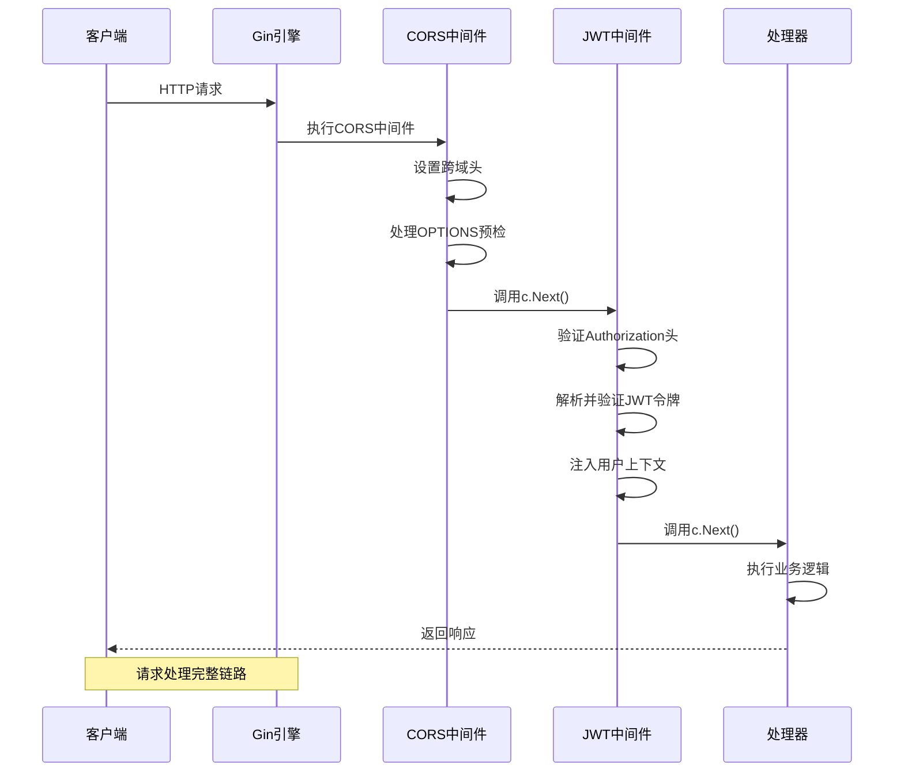
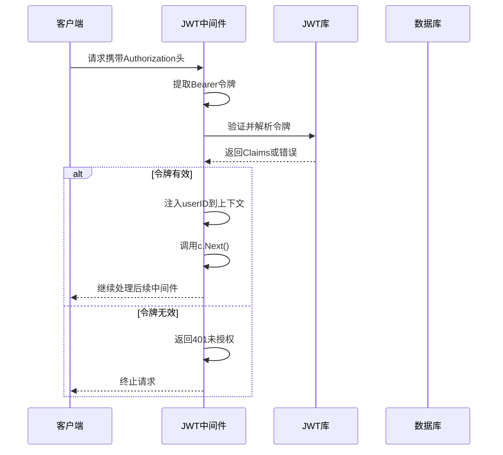
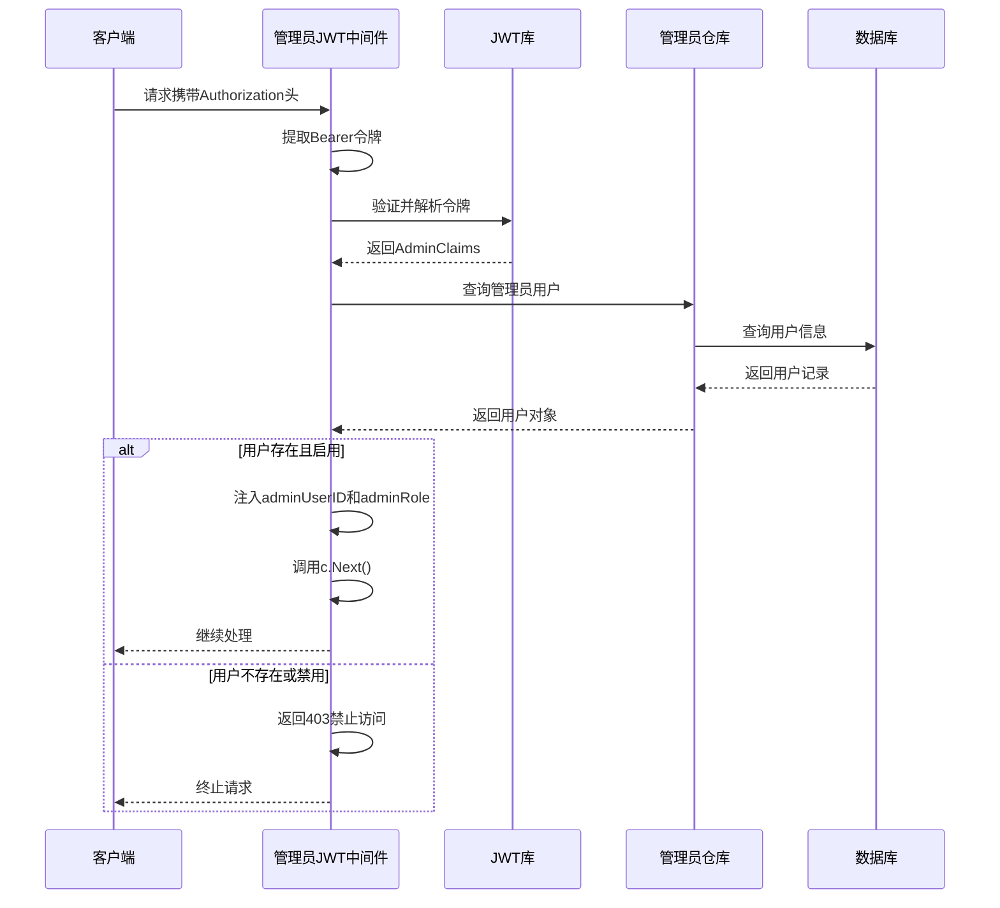
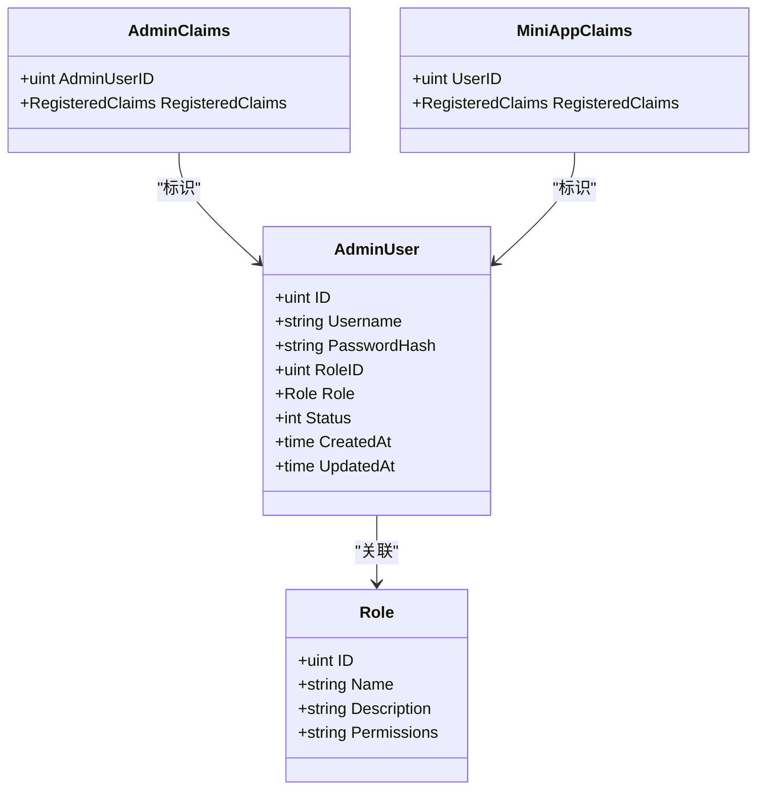
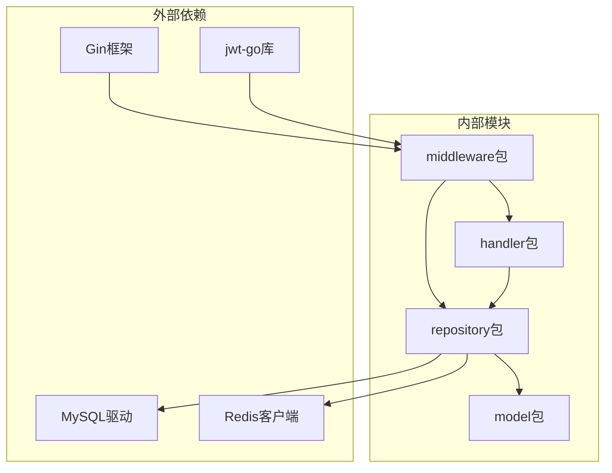
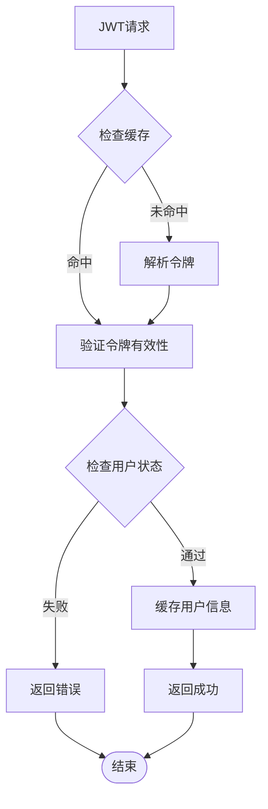

# 中间件系统架构

<cite>
**本文档引用的文件**
- [cmd/main.go](file://cmd/main.go)
- [internal/middleware/cors.go](file://internal/middleware/cors.go)
- [internal/middleware/jwt.go](file://internal/middleware/jwt.go)
- [internal/handler/admin/auth.go](file://internal/handler/admin/auth.go)
- [internal/repository/admin_user_repo.go](file://internal/repository/admin_user_repo.go)
- [internal/model/admin_user.go](file://internal/model/admin_user.go)
- [internal/model/role.go](file://internal/model/role.go)
</cite>

## 目录
1. [简介](#简介)
2. [项目结构](#项目结构)
3. [核心组件](#核心组件)
4. [架构概览](#架构概览)
5. [详细组件分析](#详细组件分析)
6. [依赖关系分析](#依赖关系分析)
7. [性能考虑](#性能考虑)
8. [故障排除指南](#故障排除指南)
9. [结论](#结论)

## 简介

本文件详细阐述旅行社交平台的中间件系统架构，重点分析以下方面：
- 中间件的执行顺序和链式调用机制
- CORS跨域中间件的配置和处理逻辑，包括预检请求处理和安全头设置
- JWT认证中间件的工作原理，包括令牌解析、用户验证和权限检查
- 管理员权限中间件的实现，包括角色验证和访问控制
- 中间件的注册和使用示例，展示如何在不同路由组中应用不同的中间件组合

该系统基于Gin框架构建，采用中间件链式调用模式，通过路由分组实现灵活的权限控制。

## 项目结构

中间件系统位于`internal/middleware`目录下，包含两个核心中间件：
- CORS跨域处理中间件
- JWT认证中间件（支持小程序用户和管理员两种类型）

```mermaid
graph TB
subgraph "中间件层"
CORS[CORS跨域中间件<br/>Cors()]
JWT[JWT认证中间件<br/>JWTAuth(), AdminJWTAuth()]
end
subgraph "路由层"
Public[公开接口<br/>无需登录]
MiniAuth[小程序认证接口<br/>JWTAuth中间件]
AdminAuth[管理员认证接口<br/>AdminJWTAuth中间件]
end
subgraph "业务层"
MiniAppHandlers[小程序处理器]
AdminHandlers[管理员处理器]
end
CORS --> Public
CORS --> MiniAuth
CORS --> AdminAuth
JWT --> MiniAuth
JWT --> AdminAuth
MiniAuth --> MiniAppHandlers
AdminAuth --> AdminHandlers
```

**图表来源**
- [cmd/main.go:40-42](file://cmd/main.go#L40-L42)
- [cmd/main.go:60](file://cmd/main.go#L60)
- [cmd/main.go:121](file://cmd/main.go#L121)

**章节来源**
- [cmd/main.go:46-143](file://cmd/main.go#L46-L143)

## 核心组件

### CORS跨域中间件

CORS中间件负责处理跨域请求，提供统一的跨域策略配置。

**主要特性：**
- 设置允许的源为通配符（*），便于开发和测试
- 配置允许的HTTP方法：GET、POST、PUT、DELETE、OPTIONS
- 配置允许的请求头：Content-Type、Authorization
- 特殊处理OPTIONS预检请求，直接返回204状态码

**执行流程：**
1. 设置Access-Control-Allow-Origin头部为*
2. 设置Access-Control-Allow-Headers为Content-Type, Authorization
3. 设置Access-Control-Allow-Methods为GET, POST, PUT, DELETE, OPTIONS
4. 检查请求方法是否为OPTIONS
5. 如果是OPTIONS请求，直接终止请求并返回204状态码
6. 调用c.Next()继续处理后续中间件和处理器

**章节来源**
- [internal/middleware/cors.go:10-22](file://internal/middleware/cors.go#L10-L22)

### JWT认证中间件

JWT中间件提供两种认证类型：小程序用户认证和管理员认证。

#### 小程序用户JWT中间件

**数据模型：**
- Claims结构：包含用户ID和标准JWT声明
- 密钥：miniapp-secret-key
- 有效期：7天
- 发行者：travel-miniapp

**认证流程：**
1. 从Authorization头部提取Bearer令牌
2. 使用HS256算法解析并验证令牌
3. 验证通过后将用户ID注入到请求上下文中
4. 继续处理后续中间件和处理器

#### 管理员JWT中间件

**数据模型：**
- Claims结构：包含管理员用户ID和标准JWT声明
- 密钥：admin-secret-key
- 有效期：7天
- 发行者：travel-admin

**认证流程：**
1. 从Authorization头部提取Bearer令牌
2. 使用HS256算法解析并验证令牌
3. 验证通过后查询管理员用户信息
4. 检查用户状态必须为启用（status=1）
5. 将管理员ID和角色信息注入到请求上下文中
6. 继续处理后续中间件和处理器

**章节来源**
- [internal/middleware/jwt.go:20-46](file://internal/middleware/jwt.go#L20-L46)
- [internal/middleware/jwt.go:67-93](file://internal/middleware/jwt.go#L67-L93)
- [internal/middleware/jwt.go:48-65](file://internal/middleware/jwt.go#L48-L65)
- [internal/middleware/jwt.go:95-122](file://internal/middleware/jwt.go#L95-L122)

## 架构概览

中间件系统采用Gin框架的标准中间件链式调用模式，通过路由分组实现层次化的权限控制。



**图表来源**
- [cmd/main.go:40-42](file://cmd/main.go#L40-L42)
- [cmd/main.go:60](file://cmd/main.go#L60)
- [cmd/main.go:121](file://cmd/main.go#L121)

## 详细组件分析

### CORS跨域中间件实现

CORS中间件实现了标准的跨域资源共享策略，确保前端应用能够正常访问API。

```mermaid
flowchart TD
Start([请求进入]) --> SetHeaders[设置跨域响应头]
SetHeaders --> CheckMethod{检查请求方法}
CheckMethod --> |OPTIONS| Abort[终止请求<br/>返回204状态码]
CheckMethod --> |其他| Next[调用c.Next()<br/>继续处理]
Abort --> End([结束])
Next --> End
```

**图表来源**
- [internal/middleware/cors.go:11-22](file://internal/middleware/cors.go#L11-L22)

**实现要点：**
- 使用通配符(*)允许任意源访问，便于开发环境调试
- 明确允许的HTTP方法集合，避免复杂场景下的跨域问题
- 配置必要的请求头，特别是Authorization头用于JWT认证
- 对预检请求进行特殊处理，直接返回204状态码

**章节来源**
- [internal/middleware/cors.go:10-22](file://internal/middleware/cors.go#L10-L22)

### JWT认证中间件工作原理

JWT中间件采用标准的Bearer Token认证模式，支持两种不同的用户类型。

#### 小程序用户认证流程



**图表来源**
- [internal/middleware/jwt.go:48-65](file://internal/middleware/jwt.go#L48-L65)

#### 管理员认证流程



**图表来源**
- [internal/middleware/jwt.go:95-122](file://internal/middleware/jwt.go#L95-L122)

**章节来源**
- [internal/middleware/jwt.go:48-65](file://internal/middleware/jwt.go#L48-L65)
- [internal/middleware/jwt.go:95-122](file://internal/middleware/jwt.go#L95-L122)

### 管理员权限模型

系统采用基于角色的权限控制模型，管理员用户与角色关联。



**图表来源**
- [internal/model/admin_user.go:5-15](file://internal/model/admin_user.go#L5-L15)
- [internal/model/role.go:3-9](file://internal/model/role.go#L3-L9)
- [internal/middleware/jwt.go:20-24](file://internal/middleware/jwt.go#L20-L24)
- [internal/middleware/jwt.go:67-71](file://internal/middleware/jwt.go#L67-L71)

**权限控制实现：**
- 管理员用户状态检查：仅启用状态的用户可访问
- 角色信息注入：将管理员角色对象注入到请求上下文
- 后续处理器可通过`c.Get("adminRole")`获取角色权限信息

**章节来源**
- [internal/model/admin_user.go:5-15](file://internal/model/admin_user.go#L5-L15)
- [internal/model/role.go:3-9](file://internal/model/role.go#L3-L9)
- [internal/middleware/jwt.go:117-120](file://internal/middleware/jwt.go#L117-L120)

## 依赖关系分析

中间件系统与其他模块的依赖关系如下：



**图表来源**
- [cmd/main.go:7-21](file://cmd/main.go#L7-L21)
- [internal/middleware/jwt.go:3-12](file://internal/middleware/jwt.go#L3-L12)

**依赖关系特点：**
- 中间件层对业务层保持松耦合，仅依赖Gin框架和jwt-go库
- 管理员JWT中间件需要访问数据库进行用户状态验证
- 所有中间件都遵循Gin中间件的标准接口模式

**章节来源**
- [cmd/main.go:7-21](file://cmd/main.go#L7-L21)
- [internal/middleware/jwt.go:3-12](file://internal/middleware/jwt.go#L3-L12)

## 性能考虑

### 中间件执行效率

1. **CORS中间件优化**
   - 使用简单的字符串匹配和条件判断
   - 预检请求快速路径，避免不必要的数据库查询
   - 固定的响应头设置，无动态计算开销

2. **JWT中间件优化**
   - 令牌解析采用内存操作，避免网络I/O
   - 管理员JWT中间件仅在需要时进行数据库查询
   - Claims结构设计简洁，减少序列化开销

### 缓存策略建议



**潜在优化点：**
- 管理员用户信息可以考虑短期缓存
- 令牌黑名单可以使用Redis实现快速查询
- 大量并发请求时可考虑令牌预热机制

## 故障排除指南

### 常见问题及解决方案

#### CORS相关问题

**问题：浏览器报跨域错误**
- 检查CORS中间件是否正确注册
- 确认客户端请求头是否包含Authorization
- 验证服务器响应头是否正确设置

**问题：预检请求失败**
- 确认OPTIONS方法被正确处理
- 检查Access-Control-Allow-Methods配置
- 验证预检请求的响应时间限制

#### JWT认证问题

**问题：401未授权错误**
- 检查Authorization头格式是否正确（Bearer前缀）
- 验证令牌签名密钥是否匹配
- 确认令牌未过期且格式正确

**问题：403禁止访问错误**
- 检查管理员用户状态是否为启用
- 验证管理员角色权限配置
- 确认用户ID在数据库中存在

#### 中间件链问题

**问题：中间件执行顺序异常**
- 检查路由分组的嵌套层级
- 确认全局中间件和局部中间件的注册顺序
- 验证中间件的调用链是否完整

**章节来源**
- [internal/middleware/cors.go:16-19](file://internal/middleware/cors.go#L16-L19)
- [internal/middleware/jwt.go:52-61](file://internal/middleware/jwt.go#L52-L61)
- [internal/middleware/jwt.go:110-115](file://internal/middleware/jwt.go#L110-L115)

## 结论

旅行社交平台的中间件系统设计合理，具有以下特点：

1. **清晰的职责分离**：CORS中间件专注于跨域处理，JWT中间件专注于身份认证，职责明确且相互独立。

2. **灵活的链式调用**：通过Gin的中间件机制，实现了可组合的中间件链，支持不同路由组应用不同的中间件组合。

3. **完善的权限控制**：实现了基于角色的权限控制模型，支持小程序用户和管理员两种认证类型。

4. **良好的扩展性**：中间件接口简单明了，易于添加新的中间件或修改现有中间件的行为。

5. **性能考虑周全**：中间件实现简洁高效，避免了不必要的性能开销。

建议在未来版本中考虑添加：
- 更细粒度的权限控制机制
- 中间件执行监控和日志记录
- 令牌刷新和撤销机制
- 更严格的CORS配置选项