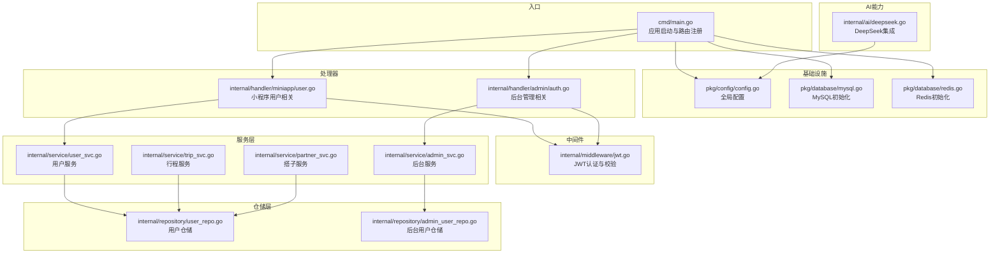
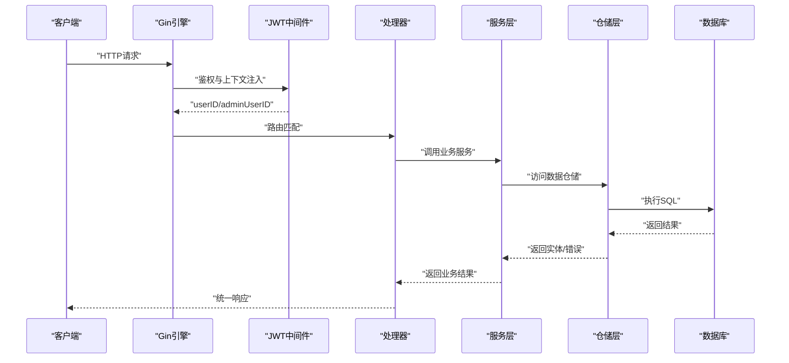
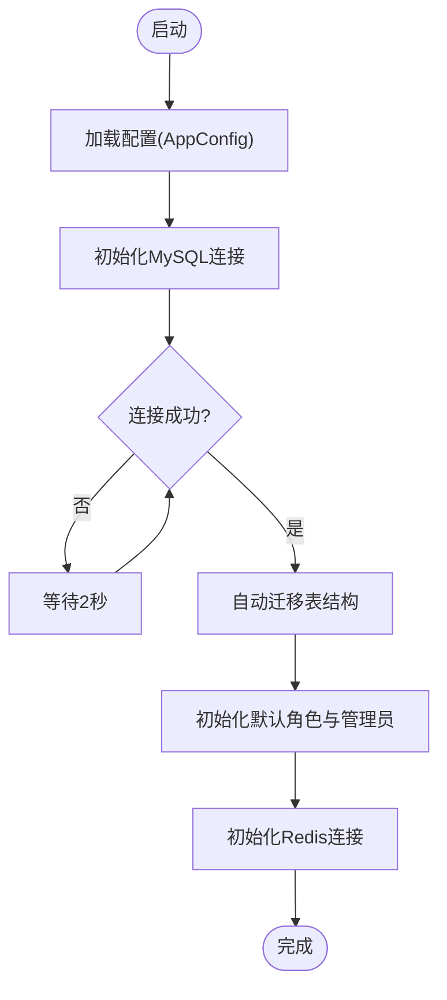
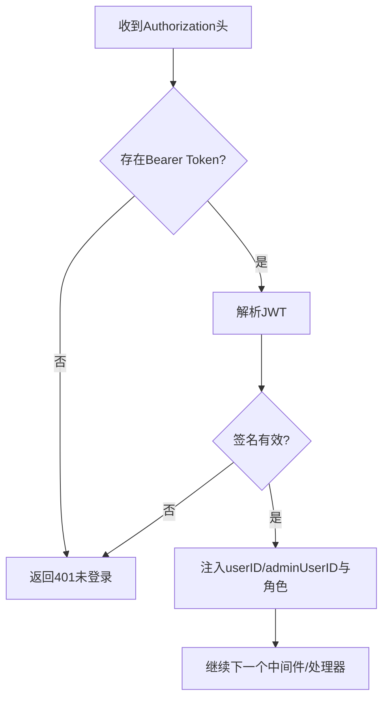
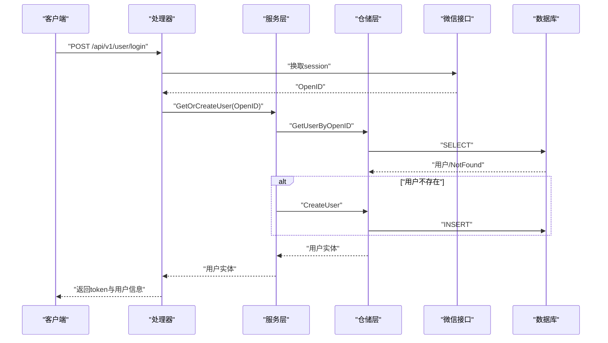
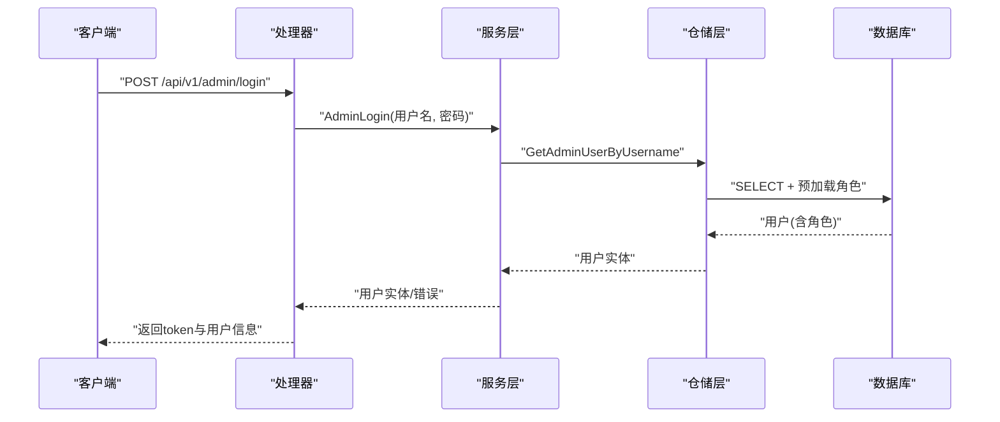
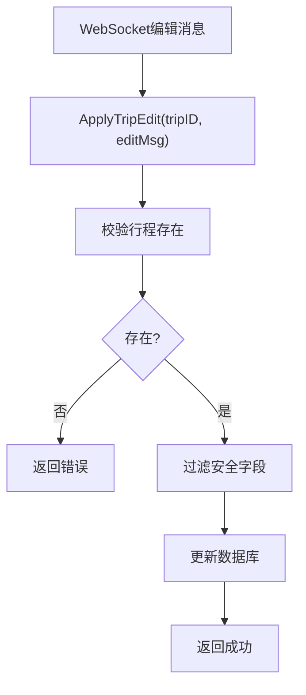
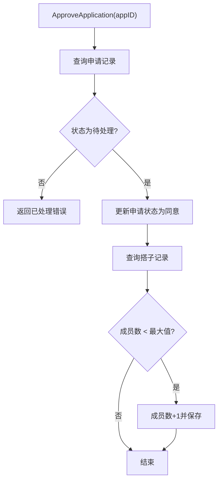
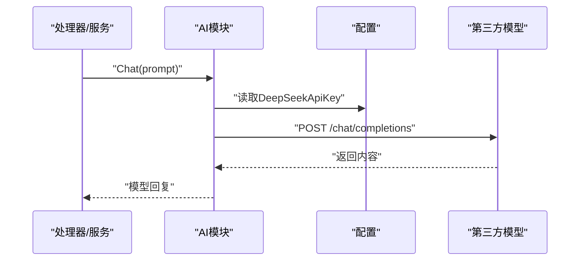
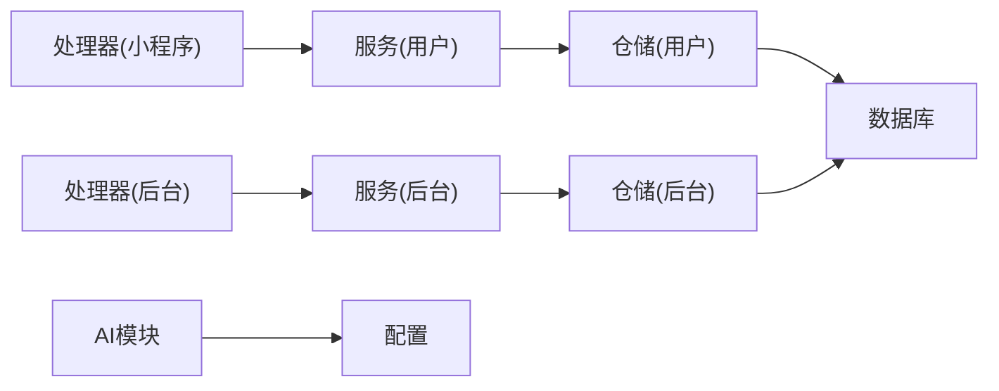

# 依赖注入与服务组合

<cite>
**本文档引用的文件**
- [cmd/main.go](file://cmd/main.go)
- [pkg/config/config.go](file://pkg/config/config.go)
- [pkg/database/mysql.go](file://pkg/database/mysql.go)
- [pkg/database/redis.go](file://pkg/database/redis.go)
- [internal/middleware/jwt.go](file://internal/middleware/jwt.go)
- [internal/handler/miniapp/user.go](file://internal/handler/miniapp/user.go)
- [internal/handler/admin/auth.go](file://internal/handler/admin/auth.go)
- [internal/service/user_svc.go](file://internal/service/user_svc.go)
- [internal/service/admin_svc.go](file://internal/service/admin_svc.go)
- [internal/service/trip_svc.go](file://internal/service/trip_svc.go)
- [internal/service/partner_svc.go](file://internal/service/partner_svc.go)
- [internal/repository/user_repo.go](file://internal/repository/user_repo.go)
- [internal/repository/admin_user_repo.go](file://internal/repository/admin_user_repo.go)
- [internal/ai/deepseek.go](file://internal/ai/deepseek.go)
- [internal/model/user.go](file://internal/model/user.go)
- [go.mod](file://go.mod)
</cite>

## 目录
1. [引言](#引言)
2. [项目结构](#项目结构)
3. [核心组件](#核心组件)
4. [架构总览](#架构总览)
5. [详细组件分析](#详细组件分析)
6. [依赖关系分析](#依赖关系分析)
7. [性能考量](#性能考量)
8. [故障排查指南](#故障排查指南)
9. [结论](#结论)

## 引言
本项目采用“全局单例 + 包级导入”的轻量级依赖管理模式：在应用启动阶段集中初始化配置与数据库连接，随后通过包级导入在各层之间共享这些全局资源。该模式避免了复杂的依赖注入容器引入，同时保持了清晰的职责边界与良好的可测试性。

- 构造函数注入：当前代码未显式使用构造函数注入，但可通过“工厂函数 + 参数传递”模拟实现。
- 全局服务注册：配置、数据库连接以全局变量形式暴露，供各层按需导入使用。
- 接口抽象与松耦合：服务层直接依赖仓库层，仓库层依赖全局数据库句柄，形成自上而下的依赖链；通过统一的包级导入实现解耦。
- 服务组合：在处理器中组合多个服务与仓库方法，协调复杂业务流程（如用户登录、行程编辑、搭子申请审批）。

## 项目结构
项目采用按层次与功能混合的组织方式：
- cmd：应用入口，负责初始化配置、数据库、注册路由并启动服务。
- internal：核心业务逻辑
  - handler：HTTP 请求入口，调用服务层并返回响应。
  - service：业务服务层，编排仓库与第三方能力。
  - repository：数据访问层，封装数据库操作。
  - middleware：中间件，提供认证与跨域等横切能力。
  - model：数据模型定义。
  - ai：集成第三方 AI 能力。
- pkg：基础设施与通用工具
  - config：配置加载。
  - database：数据库连接初始化与迁移。
  - response：统一响应封装。

图表来源
- [cmd/main.go:31-151](file://cmd/main.go#L31-L151)
- [pkg/config/config.go:60-100](file://pkg/config/config.go#L60-L100)
- [pkg/database/mysql.go:19-90](file://pkg/database/mysql.go#L19-L90)
- [pkg/database/redis.go:15-31](file://pkg/database/redis.go#L15-L31)
- [internal/middleware/jwt.go:48-122](file://internal/middleware/jwt.go#L48-L122)
- [internal/handler/miniapp/user.go:28-51](file://internal/handler/miniapp/user.go#L28-L51)
- [internal/handler/admin/auth.go:23-53](file://internal/handler/admin/auth.go#L23-L53)
- [internal/service/user_svc.go:12-27](file://internal/service/user_svc.go#L12-L27)
- [internal/service/admin_svc.go:12-22](file://internal/service/admin_svc.go#L12-L22)
- [internal/service/trip_svc.go:7-18](file://internal/service/trip_svc.go#L7-L18)
- [internal/service/partner_svc.go:9-32](file://internal/service/partner_svc.go#L9-L32)
- [internal/repository/user_repo.go:8-21](file://internal/repository/user_repo.go#L8-L21)
- [internal/repository/admin_user_repo.go:8-15](file://internal/repository/admin_user_repo.go#L8-L15)
- [internal/ai/deepseek.go:18-52](file://internal/ai/deepseek.go#L18-L52)

章节来源
- [cmd/main.go:31-151](file://cmd/main.go#L31-L151)
- [go.mod:1-67](file://go.mod#L1-67)

## 核心组件
- 全局配置与数据库
  - 配置加载：在启动时读取环境变量并初始化全局配置对象，供其他模块使用。
  - 数据库初始化：建立 MySQL 连接并执行自动迁移；Redis 初始化用于缓存与会话。
- 中间件
  - JWT 认证：区分小程序用户与后台管理员两种令牌，分别解析并注入用户上下文。
  - CORS：全局跨域中间件。
- 处理器
  - 小程序用户：登录、获取信息、更新资料等。
  - 后台管理：登录、获取管理员信息等。
- 服务层
  - 用户服务：微信登录时的“查询或创建”逻辑。
  - 后台服务：管理员登录校验。
  - 行程服务：WS 编辑应用到数据库。
  - 搭子服务：申请审批与成员数更新。
- 仓储层
  - 用户与后台用户仓储：提供基础 CRUD 与预加载。
- AI 能力
  - DeepSeek 集成：基于配置中的 API Key 调用第三方模型。

章节来源
- [pkg/config/config.go:60-100](file://pkg/config/config.go#L60-L100)
- [pkg/database/mysql.go:19-90](file://pkg/database/mysql.go#L19-L90)
- [pkg/database/redis.go:15-31](file://pkg/database/redis.go#L15-L31)
- [internal/middleware/jwt.go:48-122](file://internal/middleware/jwt.go#L48-L122)
- [internal/handler/miniapp/user.go:28-51](file://internal/handler/miniapp/user.go#L28-L51)
- [internal/handler/admin/auth.go:23-53](file://internal/handler/admin/auth.go#L23-L53)
- [internal/service/user_svc.go:12-27](file://internal/service/user_svc.go#L12-L27)
- [internal/service/admin_svc.go:12-22](file://internal/service/admin_svc.go#L12-L22)
- [internal/service/trip_svc.go:7-18](file://internal/service/trip_svc.go#L7-L18)
- [internal/service/partner_svc.go:9-32](file://internal/service/partner_svc.go#L9-L32)
- [internal/repository/user_repo.go:8-21](file://internal/repository/user_repo.go#L8-L21)
- [internal/repository/admin_user_repo.go:8-15](file://internal/repository/admin_user_repo.go#L8-L15)
- [internal/ai/deepseek.go:18-52](file://internal/ai/deepseek.go#L18-L52)

## 架构总览
系统采用“入口 -> 中间件 -> 处理器 -> 服务 -> 仓储 -> 数据库/外部服务”的线性调用链，配合全局配置与数据库单例实现松耦合与低侵入的依赖管理。

图表来源
- [cmd/main.go:46-146](file://cmd/main.go#L46-L146)
- [internal/middleware/jwt.go:48-122](file://internal/middleware/jwt.go#L48-L122)
- [internal/handler/miniapp/user.go:28-51](file://internal/handler/miniapp/user.go#L28-L51)
- [internal/service/user_svc.go:12-27](file://internal/service/user_svc.go#L12-L27)
- [internal/repository/user_repo.go:8-21](file://internal/repository/user_repo.go#L8-L21)
- [pkg/database/mysql.go:19-90](file://pkg/database/mysql.go#L19-L90)

## 详细组件分析

### 组件A：全局配置与数据库初始化
- 全局配置
  - 通过环境变量加载数据库、Redis、第三方服务等配置，提供统一访问入口。
- 数据库初始化
  - MySQL：构建 DSN，循环重试连接，成功后执行自动迁移并初始化默认角色与管理员。
  - Redis：解析 DB 索引，创建客户端并 Ping 校验连通性。

图表来源
- [pkg/config/config.go:60-100](file://pkg/config/config.go#L60-L100)
- [pkg/database/mysql.go:19-90](file://pkg/database/mysql.go#L19-L90)
- [pkg/database/redis.go:15-31](file://pkg/database/redis.go#L15-L31)

章节来源
- [pkg/config/config.go:60-100](file://pkg/config/config.go#L60-L100)
- [pkg/database/mysql.go:19-90](file://pkg/database/mysql.go#L19-L90)
- [pkg/database/redis.go:15-31](file://pkg/database/redis.go#L15-L31)

### 组件B：JWT 认证中间件
- 小程序用户与后台管理员分别使用独立密钥与 Claims 结构。
- 解析令牌后注入 userID 或 adminUserID 与角色信息，供后续处理器使用。

图表来源
- [internal/middleware/jwt.go:48-122](file://internal/middleware/jwt.go#L48-L122)

章节来源
- [internal/middleware/jwt.go:48-122](file://internal/middleware/jwt.go#L48-L122)

### 组件C：用户登录流程（处理器 -> 服务 -> 仓储）
- 处理器接收前端 code，调用微信接口获取 session，然后调用服务层“查询或创建”用户。
- 服务层调用仓储查询用户，不存在则创建新用户。
- 仓储层通过全局数据库句柄执行 SQL。

图表来源
- [internal/handler/miniapp/user.go:28-51](file://internal/handler/miniapp/user.go#L28-L51)
- [internal/service/user_svc.go:12-27](file://internal/service/user_svc.go#L12-L27)
- [internal/repository/user_repo.go:8-21](file://internal/repository/user_repo.go#L8-L21)
- [pkg/database/mysql.go:19-90](file://pkg/database/mysql.go#L19-L90)

章节来源
- [internal/handler/miniapp/user.go:28-51](file://internal/handler/miniapp/user.go#L28-L51)
- [internal/service/user_svc.go:12-27](file://internal/service/user_svc.go#L12-L27)
- [internal/repository/user_repo.go:8-21](file://internal/repository/user_repo.go#L8-L21)

### 组件D：后台登录流程（处理器 -> 服务 -> 仓储）
- 处理器接收用户名与密码，调用服务层进行校验。
- 服务层查询后台用户并比对哈希，成功后生成管理员 Token 返回。

图表来源
- [internal/handler/admin/auth.go:23-53](file://internal/handler/admin/auth.go#L23-L53)
- [internal/service/admin_svc.go:12-22](file://internal/service/admin_svc.go#L12-L22)
- [internal/repository/admin_user_repo.go:8-15](file://internal/repository/admin_user_repo.go#L8-L15)
- [pkg/database/mysql.go:19-90](file://pkg/database/mysql.go#L19-L90)

章节来源
- [internal/handler/admin/auth.go:23-53](file://internal/handler/admin/auth.go#L23-L53)
- [internal/service/admin_svc.go:12-22](file://internal/service/admin_svc.go#L12-L22)
- [internal/repository/admin_user_repo.go:8-15](file://internal/repository/admin_user_repo.go#L8-L15)

### 组件E：服务组合模式示例（行程编辑）
- WS 推送编辑消息到服务层，服务层先校验行程存在性，再过滤敏感字段后更新数据库。
- 该流程体现了“多步骤编排 + 安全过滤”的服务组合思想。

图表来源
- [internal/service/trip_svc.go:7-18](file://internal/service/trip_svc.go#L7-L18)

章节来源
- [internal/service/trip_svc.go:7-18](file://internal/service/trip_svc.go#L7-L18)

### 组件F：服务组合模式示例（搭子申请审批）
- 服务层先查询申请状态，若未处理则更新为同意，并增加搭子当前成员数。
- 该流程展示了“条件判断 + 事务性更新”的组合策略。

图表来源
- [internal/service/partner_svc.go:9-32](file://internal/service/partner_svc.go#L9-L32)

章节来源
- [internal/service/partner_svc.go:9-32](file://internal/service/partner_svc.go#L9-L32)

### 组件G：AI 能力集成
- 在服务层或处理器中调用 AI 模块，通过配置中的 API Key 访问第三方模型。
- 该模式便于替换与扩展不同 AI 提供商。

图表来源
- [internal/ai/deepseek.go:18-52](file://internal/ai/deepseek.go#L18-L52)
- [pkg/config/config.go:95-96](file://pkg/config/config.go#L95-L96)

章节来源
- [internal/ai/deepseek.go:18-52](file://internal/ai/deepseek.go#L18-L52)
- [pkg/config/config.go:95-96](file://pkg/config/config.go#L95-L96)

## 依赖关系分析
- 包级导入与全局单例
  - 处理器、服务、仓储均通过包级导入使用全局配置与数据库句柄，避免了构造函数注入的样板代码。
- 层次化依赖
  - 处理器依赖服务；服务依赖仓储；仓储依赖数据库；AI 依赖配置。
- 松耦合设计
  - 通过统一的包级导入实现解耦；服务层不关心具体存储实现细节。
- 可扩展性
  - 新增服务只需在服务层新增函数并在处理器中组合调用；仓储层可替换为其他实现（如缓存 + 数据库双写）。

图表来源
- [internal/handler/miniapp/user.go:13-16](file://internal/handler/miniapp/user.go#L13-L16)
- [internal/handler/admin/auth.go:10-11](file://internal/handler/admin/auth.go#L10-L11)
- [internal/service/user_svc.go:9](file://internal/service/user_svc.go#L9)
- [internal/service/admin_svc.go:9](file://internal/service/admin_svc.go#L9)
- [internal/repository/user_repo.go:5](file://internal/repository/user_repo.go#L5)
- [internal/repository/admin_user_repo.go:5](file://internal/repository/admin_user_repo.go#L5)
- [pkg/database/mysql.go:17](file://pkg/database/mysql.go#L17)
- [internal/ai/deepseek.go:10](file://internal/ai/deepseek.go#L10)
- [pkg/config/config.go:58](file://pkg/config/config.go#L58)

章节来源
- [internal/handler/miniapp/user.go:13-16](file://internal/handler/miniapp/user.go#L13-L16)
- [internal/handler/admin/auth.go:10-11](file://internal/handler/admin/auth.go#L10-L11)
- [internal/service/user_svc.go:9](file://internal/service/user_svc.go#L9)
- [internal/service/admin_svc.go:9](file://internal/service/admin_svc.go#L9)
- [internal/repository/user_repo.go:5](file://internal/repository/user_repo.go#L5)
- [internal/repository/admin_user_repo.go:5](file://internal/repository/admin_user_repo.go#L5)
- [pkg/database/mysql.go:17](file://pkg/database/mysql.go#L17)
- [internal/ai/deepseek.go:10](file://internal/ai/deepseek.go#L10)
- [pkg/config/config.go:58](file://pkg/config/config.go#L58)

## 性能考量
- 数据库连接池与重试
  - MySQL 初始化包含多次重试机制，有助于在容器编排环境下提升启动稳定性。
- 自动迁移成本
  - 启动时执行自动迁移可能带来冷启动延迟，建议在生产环境通过离线迁移降低影响。
- Redis 缓存
  - Redis 初始化后可用于热点数据缓存与会话存储，减少数据库压力。
- JWT 解析
  - 中间件对每请求进行令牌解析，建议在网关层或边缘缓存短生命周期的令牌校验结果。

## 故障排查指南
- 登录失败
  - 检查微信接口返回与服务层错误信息；确认配置中的 AppId/AppSecret 是否正确。
- 数据库连接失败
  - 查看重试日志与最终失败原因；核对环境变量与网络连通性。
- Redis 连接失败
  - 核对地址、端口、密码与 DB 索引；确保 Redis 服务可用。
- 权限不足或被禁用
  - 后台管理员登录后状态检查失败会导致 403；确认用户状态与角色权限。
- AI 调用异常
  - 检查 DeepSeek API Key 是否配置；查看第三方接口返回内容。

章节来源
- [internal/handler/miniapp/user.go:37-47](file://internal/handler/miniapp/user.go#L37-L47)
- [pkg/database/mysql.go:25-37](file://pkg/database/mysql.go#L25-L37)
- [pkg/database/redis.go:23-31](file://pkg/database/redis.go#L23-L31)
- [internal/middleware/jwt.go:110-115](file://internal/middleware/jwt.go#L110-L115)
- [internal/ai/deepseek.go:28-36](file://internal/ai/deepseek.go#L28-L36)

## 结论
本项目通过“全局配置与数据库单例 + 包级导入”的轻量级依赖管理模式，在保证清晰职责边界的同时实现了良好的可测试性与可扩展性。服务层通过组合多个仓储与第三方能力，支撑起复杂的业务流程；中间件统一处理认证与跨域等横切关注点。未来可在不影响现有架构的前提下，逐步引入更完善的依赖注入框架或工厂模式，进一步增强模块间的解耦与测试便利性。