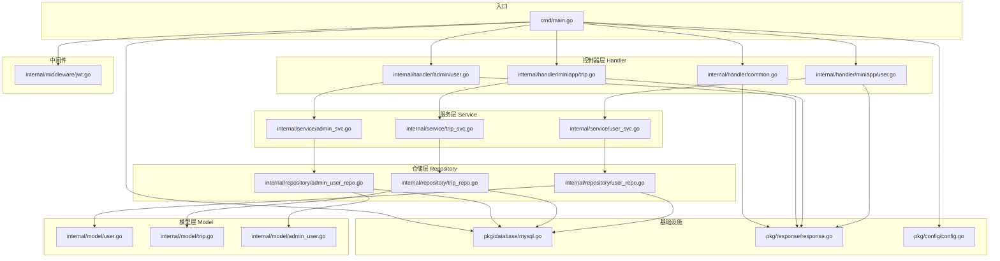
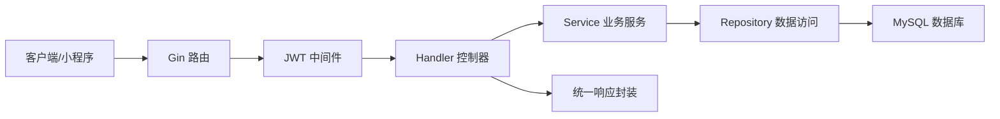
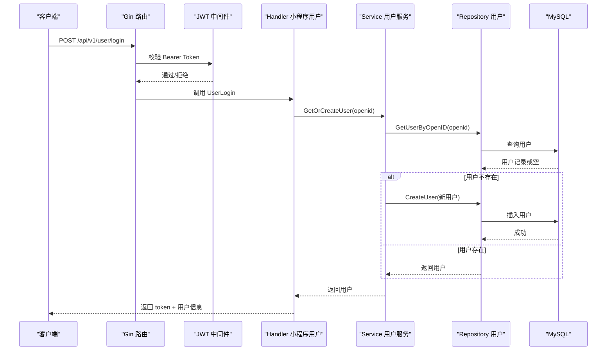
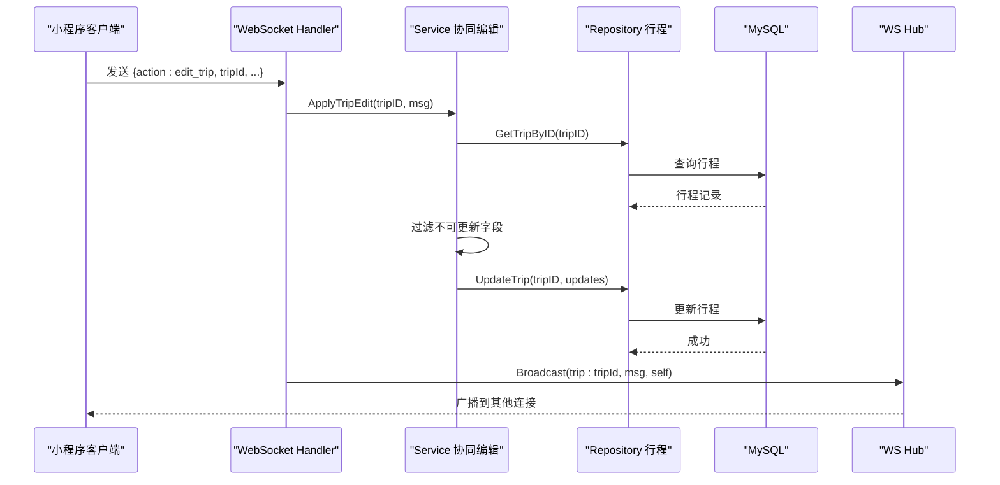
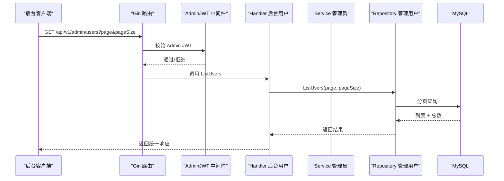
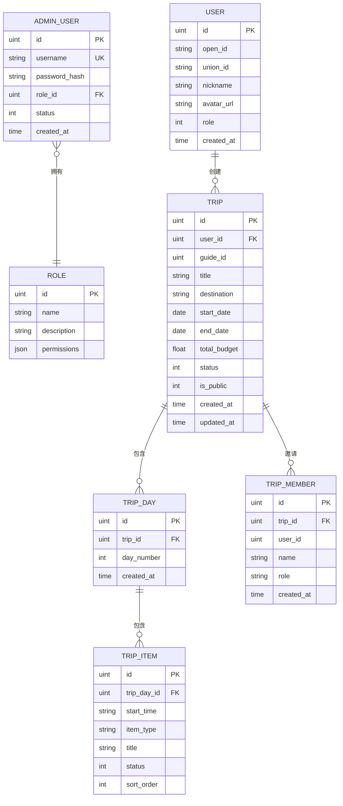
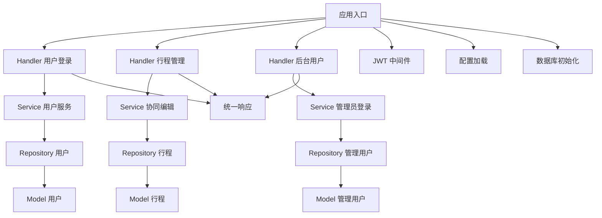

# 分层架构设计

<cite>
**本文档引用的文件**
- [main.go](file://cmd/main.go)
- [user.go](file://internal/model/user.go)
- [trip.go](file://internal/model/trip.go)
- [admin_user.go](file://internal/model/admin_user.go)
- [user_repo.go](file://internal/repository/user_repo.go)
- [trip_repo.go](file://internal/repository/trip_repo.go)
- [admin_user_repo.go](file://internal/repository/admin_user_repo.go)
- [user_svc.go](file://internal/service/user_svc.go)
- [trip_svc.go](file://internal/service/trip_svc.go)
- [admin_svc.go](file://internal/service/admin_svc.go)
- [common.go](file://internal/handler/common.go)
- [user.go](file://internal/handler/miniapp/user.go)
- [trip.go](file://internal/handler/miniapp/trip.go)
- [user.go](file://internal/handler/admin/user.go)
- [jwt.go](file://internal/middleware/jwt.go)
- [mysql.go](file://pkg/database/mysql.go)
- [response.go](file://pkg/response/response.go)
- [config.go](file://pkg/config/config.go)
</cite>

## 目录
1. [简介](#简介)
2. [项目结构](#项目结构)
3. [核心组件](#核心组件)
4. [架构总览](#架构总览)
5. [详细组件分析](#详细组件分析)
6. [依赖分析](#依赖分析)
7. [性能考虑](#性能考虑)
8. [故障排除指南](#故障排除指南)
9. [结论](#结论)

## 简介
本项目是一个旅行社交平台的后端服务，采用清晰的分层架构设计，包含 Model-Repository-Service-Handler 四层。该架构实现了职责分离、可测试性和可维护性，便于扩展与团队协作。Handler 层负责 HTTP 请求处理与响应封装；Service 层封装业务逻辑；Repository 层负责数据持久化；Model 层描述数据结构。

## 项目结构
项目采用按功能模块划分的目录结构，配合分层架构，使各层职责明确、边界清晰：
- cmd：应用入口，初始化配置、数据库、注册路由并启动服务
- internal：核心业务代码
  - model：数据模型定义
  - repository：数据访问层，封装数据库操作
  - service：业务服务层，编排领域逻辑
  - handler：HTTP 控制器层，处理请求与响应
  - middleware：中间件，如 JWT 认证
  - ws：WebSocket 服务
- pkg：通用工具与基础设施
  - config：配置加载
  - database：数据库连接与迁移
  - response：统一响应格式

图表来源
- [main.go:31-151](file://cmd/main.go#L31-L151)
- [jwt.go:48-65](file://internal/middleware/jwt.go#L48-L65)
- [user.go:28-51](file://internal/handler/miniapp/user.go#L28-L51)
- [trip.go:16-92](file://internal/handler/miniapp/trip.go#L16-L92)
- [user.go:13-27](file://internal/handler/admin/user.go#L13-L30)
- [user_svc.go:12-27](file://internal/service/user_svc.go#L12-L27)
- [trip_svc.go:7-18](file://internal/service/trip_svc.go#L7-L18)
- [admin_svc.go:12-22](file://internal/service/admin_svc.go#L12-L22)
- [user_repo.go:8-43](file://internal/repository/user_repo.go#L8-L43)
- [trip_repo.go:12-136](file://internal/repository/trip_repo.go#L12-L136)
- [admin_user_repo.go:8-42](file://internal/repository/admin_user_repo.go#L8-L42)
- [user.go:6-15](file://internal/model/user.go#L6-L15)
- [trip.go:9-37](file://internal/model/trip.go#L9-L37)
- [admin_user.go:5-15](file://internal/model/admin_user.go#L5-L15)
- [mysql.go:19-90](file://pkg/database/mysql.go#L19-L90)
- [response.go:10-25](file://pkg/response/response.go#L10-L25)
- [config.go:60-100](file://pkg/config/config.go#L60-L100)

章节来源
- [main.go:31-151](file://cmd/main.go#L31-L151)
- [config.go:60-100](file://pkg/config/config.go#L60-L100)

## 核心组件
- Model 层：定义数据结构与关系，如用户、行程、管理员等实体，用于映射数据库表结构。
- Repository 层：封装数据库操作，提供面向业务的查询与更新方法，屏蔽底层 ORM 细节。
- Service 层：编排业务流程，处理输入校验、权限控制、事务与复杂逻辑，协调多个 Repository。
- Handler 层：接收 HTTP 请求，解析参数，调用 Service，组装统一响应，处理鉴权中间件。
- 中间件：JWT 认证与授权，分别针对小程序用户与后台管理员。
- 基础设施：配置加载、数据库连接与迁移、统一响应格式。

章节来源
- [user.go:6-15](file://internal/model/user.go#L6-L15)
- [trip.go:9-37](file://internal/model/trip.go#L9-L37)
- [admin_user.go:5-15](file://internal/model/admin_user.go#L5-L15)
- [user_repo.go:8-43](file://internal/repository/user_repo.go#L8-L43)
- [trip_repo.go:12-136](file://internal/repository/trip_repo.go#L12-L136)
- [admin_user_repo.go:8-42](file://internal/repository/admin_user_repo.go#L8-L42)
- [user_svc.go:12-27](file://internal/service/user_svc.go#L12-L27)
- [trip_svc.go:7-18](file://internal/service/trip_svc.go#L7-L18)
- [admin_svc.go:12-22](file://internal/service/admin_svc.go#L12-L22)
- [common.go:25-42](file://internal/handler/common.go#L25-L42)
- [user.go:28-51](file://internal/handler/miniapp/user.go#L28-L51)
- [trip.go:16-92](file://internal/handler/miniapp/trip.go#L16-L92)
- [user.go:13-30](file://internal/handler/admin/user.go#L13-L30)
- [jwt.go:48-122](file://internal/middleware/jwt.go#L48-L122)
- [mysql.go:19-90](file://pkg/database/mysql.go#L19-L90)
- [response.go:10-25](file://pkg/response/response.go#L10-L25)

## 架构总览
下图展示了典型的 MVC 在本项目中的落地方式：
- 视图层（Handler）：处理 HTTP 请求与响应，调用 Service 层执行业务逻辑
- 模型层（Service）：封装业务规则，协调多个 Repository 完成数据处理
- 数据访问层（Repository）：基于 GORM 的 CRUD 操作，提供稳定的接口
- 数据模型（Model）：定义实体与关联关系，支撑上层业务

图表来源
- [main.go:47-143](file://cmd/main.go#L47-L143)
- [jwt.go:48-65](file://internal/middleware/jwt.go#L48-L65)
- [user.go:28-51](file://internal/handler/miniapp/user.go#L28-L51)
- [trip.go:16-92](file://internal/handler/miniapp/trip.go#L16-L92)
- [user.go:13-30](file://internal/handler/admin/user.go#L13-L30)
- [user_svc.go:12-27](file://internal/service/user_svc.go#L12-L27)
- [trip_svc.go:7-18](file://internal/service/trip_svc.go#L7-L18)
- [admin_svc.go:12-22](file://internal/service/admin_svc.go#L12-L22)
- [user_repo.go:8-43](file://internal/repository/user_repo.go#L8-L43)
- [trip_repo.go:12-136](file://internal/repository/trip_repo.go#L12-L136)
- [admin_user_repo.go:8-42](file://internal/repository/admin_user_repo.go#L8-L42)
- [mysql.go:19-90](file://pkg/database/mysql.go#L19-L90)
- [response.go:10-25](file://pkg/response/response.go#L10-L25)

## 详细组件分析

### 登录流程（Handler-Service-Repository）
该流程体现了 Handler 调用 Service，Service 再调用 Repository 的典型链路，同时结合 JWT 中间件进行身份验证。

图表来源
- [main.go:50-51](file://cmd/main.go#L50-L51)
- [jwt.go:48-65](file://internal/middleware/jwt.go#L48-L65)
- [user.go:28-51](file://internal/handler/miniapp/user.go#L28-L51)
- [user_svc.go:12-27](file://internal/service/user_svc.go#L12-L27)
- [user_repo.go:8-21](file://internal/repository/user_repo.go#L8-L21)
- [mysql.go:19-90](file://pkg/database/mysql.go#L19-L90)

章节来源
- [user.go:28-51](file://internal/handler/miniapp/user.go#L28-L51)
- [user_svc.go:12-27](file://internal/service/user_svc.go#L12-L27)
- [user_repo.go:8-21](file://internal/repository/user_repo.go#L8-L21)

### 行程编辑协同（WebSocket + Service-Repository）
WebSocket 连接建立后，Handler 接收编辑消息，Service 校验与过滤字段，Repository 执行更新，最终广播给其他连接。

图表来源
- [common.go:48-91](file://internal/handler/common.go#L48-L91)
- [trip_svc.go:7-18](file://internal/service/trip_svc.go#L7-L18)
- [trip_repo.go:17-32](file://internal/repository/trip_repo.go#L17-L32)
- [mysql.go:19-90](file://pkg/database/mysql.go#L19-L90)

章节来源
- [common.go:48-91](file://internal/handler/common.go#L48-L91)
- [trip_svc.go:7-18](file://internal/service/trip_svc.go#L7-L18)
- [trip_repo.go:17-32](file://internal/repository/trip_repo.go#L17-L32)

### 后台用户管理（Handler-Service-Repository）
后台管理接口通过 AdminJWTAuth 中间件进行鉴权，Handler 调用 Service/Repository 完成用户列表与角色更新。

图表来源
- [main.go:121-142](file://cmd/main.go#L121-L142)
- [jwt.go:95-122](file://internal/middleware/jwt.go#L95-L122)
- [user.go:13-30](file://internal/handler/admin/user.go#L13-L30)
- [admin_user_repo.go:23-30](file://internal/repository/admin_user_repo.go#L23-L30)
- [mysql.go:19-90](file://pkg/database/mysql.go#L19-L90)

章节来源
- [user.go:13-30](file://internal/handler/admin/user.go#L13-L30)
- [admin_user_repo.go:23-30](file://internal/repository/admin_user_repo.go#L23-L30)

### 数据模型与关系
以下 ER 图展示了核心模型之间的关系，体现分层架构中 Model 层的数据结构支撑。

图表来源
- [user.go:6-15](file://internal/model/user.go#L6-L15)
- [admin_user.go:5-15](file://internal/model/admin_user.go#L5-L15)
- [trip.go:9-37](file://internal/model/trip.go#L9-L37)

章节来源
- [user.go:6-15](file://internal/model/user.go#L6-L15)
- [admin_user.go:5-15](file://internal/model/admin_user.go#L5-L15)
- [trip.go:9-37](file://internal/model/trip.go#L9-L37)

## 依赖分析
- Handler 对 Service 的依赖：Handler 仅依赖 Service 接口，不直接访问数据库，保证了职责分离与可测试性
- Service 对 Repository 的依赖：Service 调用 Repository 提供的稳定接口，集中处理业务规则
- Repository 对 Model 的依赖：Repository 使用 GORM 模型进行数据库操作，保持数据结构一致性
- Handler 对中间件的依赖：JWT 中间件在进入业务逻辑前完成身份验证与上下文注入
- 基础设施对配置与数据库的依赖：配置加载与数据库初始化在应用启动阶段完成

图表来源
- [main.go:31-151](file://cmd/main.go#L31-L151)
- [jwt.go:48-122](file://internal/middleware/jwt.go#L48-L122)
- [user.go:28-51](file://internal/handler/miniapp/user.go#L28-L51)
- [trip.go:16-92](file://internal/handler/miniapp/trip.go#L16-L92)
- [user.go:13-30](file://internal/handler/admin/user.go#L13-L30)
- [user_svc.go:12-27](file://internal/service/user_svc.go#L12-L27)
- [trip_svc.go:7-18](file://internal/service/trip_svc.go#L7-L18)
- [admin_svc.go:12-22](file://internal/service/admin_svc.go#L12-L22)
- [user_repo.go:8-43](file://internal/repository/user_repo.go#L8-L43)
- [trip_repo.go:12-136](file://internal/repository/trip_repo.go#L12-L136)
- [admin_user_repo.go:8-42](file://internal/repository/admin_user_repo.go#L8-L42)
- [response.go:10-25](file://pkg/response/response.go#L10-L25)
- [config.go:60-100](file://pkg/config/config.go#L60-L100)
- [mysql.go:19-90](file://pkg/database/mysql.go#L19-L90)

章节来源
- [main.go:31-151](file://cmd/main.go#L31-L151)
- [jwt.go:48-122](file://internal/middleware/jwt.go#L48-L122)
- [response.go:10-25](file://pkg/response/response.go#L10-L25)

## 性能考虑
- 数据库连接与迁移：应用启动时进行数据库连接与自动迁移，确保表结构一致，减少运行时错误
- 预加载与关联查询：Repository 层使用预加载策略，避免 N+1 查询问题，提升读取性能
- 统一响应格式：统一的响应结构简化前端处理，减少重复开发
- JWT 中间件：轻量的身份验证机制，避免频繁数据库查询用户状态
- WebSocket 广播：通过 Hub 进行房间内广播，降低消息处理复杂度

## 故障排除指南
- 登录失败：检查 Handler 参数绑定与微信会话接口调用，确认 Service 层用户创建逻辑是否正常
- 权限不足：检查 JWT 中间件是否正确注入 userID 或 adminUserID，以及 Service 层权限判断
- 数据库连接失败：查看数据库初始化日志与重试机制，确认配置项是否正确
- 响应格式异常：确认统一响应封装是否被正确调用，避免直接返回原始错误

章节来源
- [user.go:28-51](file://internal/handler/miniapp/user.go#L28-L51)
- [jwt.go:48-65](file://internal/middleware/jwt.go#L48-L65)
- [mysql.go:19-90](file://pkg/database/mysql.go#L19-L90)
- [response.go:10-25](file://pkg/response/response.go#L10-L25)

## 结论
本项目的分层架构清晰地实现了 Model-Repository-Service-Handler 的职责分离，Handler 专注于请求处理与响应封装，Service 负责业务编排，Repository 屏蔽数据访问细节，Model 提供稳定的领域模型。该架构具备良好的可测试性与可维护性，适合持续演进与团队协作。通过 JWT 中间件与统一响应封装，系统在安全性与易用性方面也得到保障。