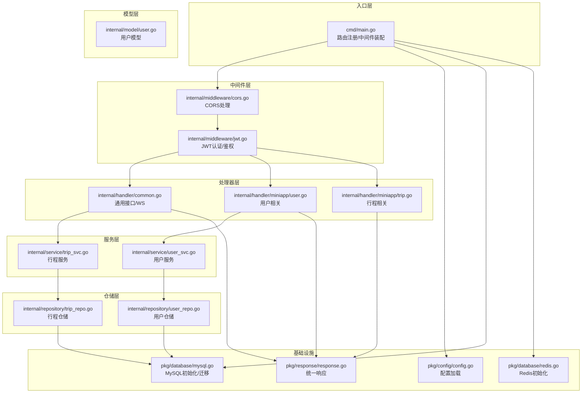
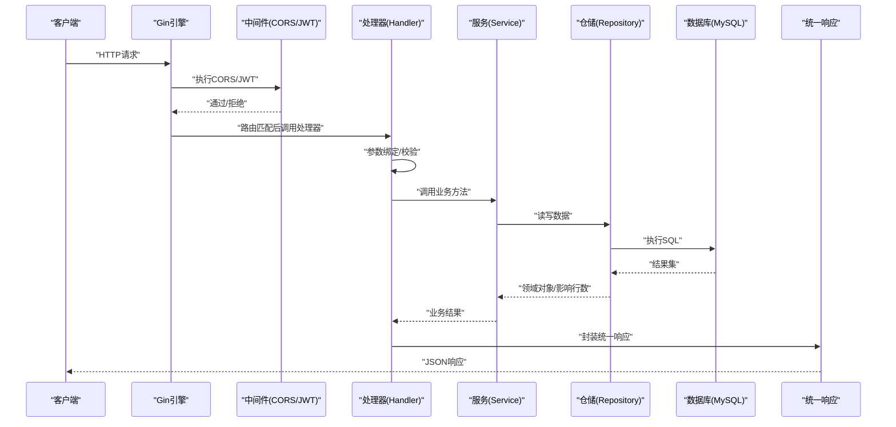
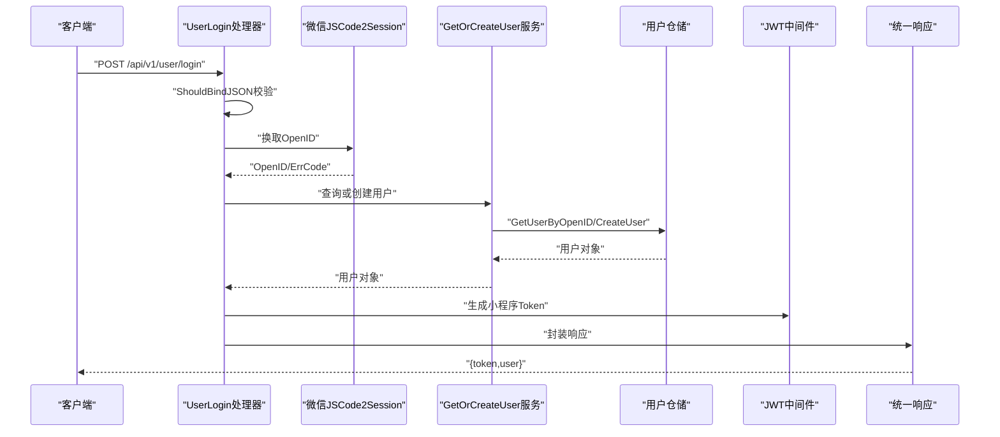
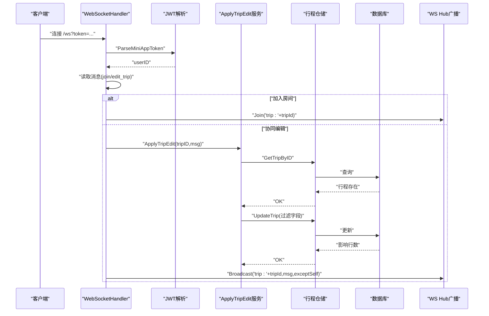
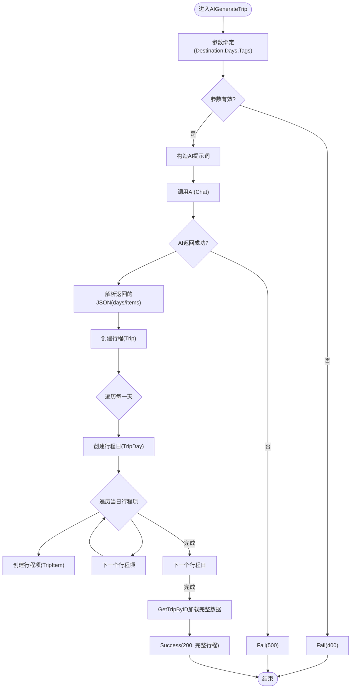
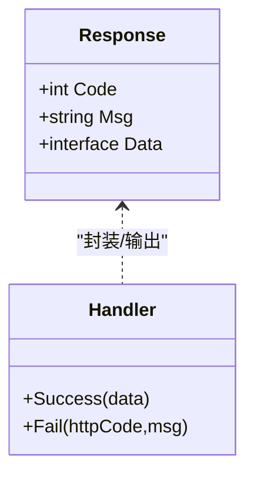
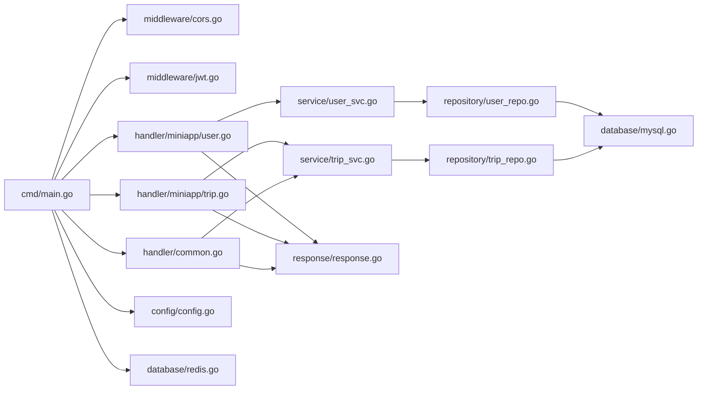

# 数据流架构设计

<cite>
**本文档引用的文件**
- [cmd/main.go](file://cmd/main.go)
- [pkg/config/config.go](file://pkg/config/config.go)
- [pkg/database/mysql.go](file://pkg/database/mysql.go)
- [pkg/database/redis.go](file://pkg/database/redis.go)
- [internal/middleware/cors.go](file://internal/middleware/cors.go)
- [internal/middleware/jwt.go](file://internal/middleware/jwt.go)
- [pkg/response/response.go](file://pkg/response/response.go)
- [internal/handler/common.go](file://internal/handler/common.go)
- [internal/handler/miniapp/user.go](file://internal/handler/miniapp/user.go)
- [internal/handler/miniapp/trip.go](file://internal/handler/miniapp/trip.go)
- [internal/service/user_svc.go](file://internal/service/user_svc.go)
- [internal/service/trip_svc.go](file://internal/service/trip_svc.go)
- [internal/repository/user_repo.go](file://internal/repository/user_repo.go)
- [internal/repository/trip_repo.go](file://internal/repository/trip_repo.go)
- [internal/model/user.go](file://internal/model/user.go)
</cite>

## 目录
1. [引言](#引言)
2. [项目结构](#项目结构)
3. [核心组件](#核心组件)
4. [架构总览](#架构总览)
5. [详细组件分析](#详细组件分析)
6. [依赖分析](#依赖分析)
7. [性能考虑](#性能考虑)
8. [故障排查指南](#故障排查指南)
9. [结论](#结论)
10. [附录](#附录)

## 引言
本设计文档面向旅行社交平台后端，系统性阐述从HTTP请求到数据库操作的完整数据流路径，覆盖路由匹配、参数校验、业务处理、数据持久化与响应构建等环节；同时说明统一响应格式的设计理念与实现方式，以及错误处理与异常传播机制。文档还提供典型业务场景（用户登录、攻略创建、行程编辑）的数据流图与性能优化建议。

## 项目结构
后端采用分层架构：入口层负责路由注册与中间件装配；处理器层承接HTTP请求，进行参数绑定与调用服务层；服务层封装业务规则；仓储层负责数据访问；模型层定义数据结构；配置与数据库层提供基础设施。

图表来源
- [cmd/main.go:31-151](file://cmd/main.go#L31-L151)
- [internal/middleware/cors.go:10-22](file://internal/middleware/cors.go#L10-L22)
- [internal/middleware/jwt.go:48-122](file://internal/middleware/jwt.go#L48-L122)
- [internal/handler/common.go:19-91](file://internal/handler/common.go#L19-L91)
- [internal/handler/miniapp/user.go:19-115](file://internal/handler/miniapp/user.go#L19-L115)
- [internal/handler/miniapp/trip.go:16-327](file://internal/handler/miniapp/trip.go#L16-L327)
- [internal/service/user_svc.go:12-27](file://internal/service/user_svc.go#L12-L27)
- [internal/service/trip_svc.go:7-18](file://internal/service/trip_svc.go#L7-L18)
- [internal/repository/user_repo.go:8-28](file://internal/repository/user_repo.go#L8-L28)
- [internal/repository/trip_repo.go:12-136](file://internal/repository/trip_repo.go#L12-L136)
- [internal/model/user.go:6-15](file://internal/model/user.go#L6-L15)
- [pkg/config/config.go:60-100](file://pkg/config/config.go#L60-L100)
- [pkg/database/mysql.go:19-90](file://pkg/database/mysql.go#L19-L90)
- [pkg/database/redis.go:15-31](file://pkg/database/redis.go#L15-L31)
- [pkg/response/response.go:10-25](file://pkg/response/response.go#L10-L25)

章节来源
- [cmd/main.go:31-151](file://cmd/main.go#L31-L151)
- [pkg/config/config.go:60-100](file://pkg/config/config.go#L60-L100)
- [pkg/database/mysql.go:19-90](file://pkg/database/mysql.go#L19-L90)
- [pkg/database/redis.go:15-31](file://pkg/database/redis.go#L15-L31)

## 核心组件
- 统一响应格式：以固定结构返回code/msg/data，便于前端统一处理与状态判断。
- JWT认证：区分小程序用户与后台管理员两类令牌，分别注入用户标识与角色信息。
- CORS中间件：允许跨域请求，简化前端调试与部署。
- 配置中心：集中加载数据库、缓存、第三方服务等配置。
- 数据库初始化：自动迁移与默认角色/管理员初始化。
- Redis初始化：提供会话、缓存能力。
- 处理器层：按功能模块组织，包含用户、行程、消息、足迹、收藏等接口。
- 服务层：封装业务逻辑，协调仓储与外部服务。
- 仓储层：基于GORM实现CRUD与复杂查询。
- 模型层：定义表结构与字段约束。

章节来源
- [pkg/response/response.go:10-25](file://pkg/response/response.go#L10-L25)
- [internal/middleware/jwt.go:14-122](file://internal/middleware/jwt.go#L14-L122)
- [internal/middleware/cors.go:10-22](file://internal/middleware/cors.go#L10-L22)
- [pkg/config/config.go:60-100](file://pkg/config/config.go#L60-L100)
- [pkg/database/mysql.go:19-90](file://pkg/database/mysql.go#L19-L90)
- [pkg/database/redis.go:15-31](file://pkg/database/redis.go#L15-L31)

## 架构总览
下图展示一次典型HTTP请求在系统中的流转过程：路由匹配 → 中间件链 → 参数绑定 → 业务处理 → 数据持久化 → 统一响应。

图表来源
- [cmd/main.go:47-143](file://cmd/main.go#L47-L143)
- [internal/middleware/cors.go:10-22](file://internal/middleware/cors.go#L10-L22)
- [internal/middleware/jwt.go:48-122](file://internal/middleware/jwt.go#L48-L122)
- [internal/handler/miniapp/user.go:28-51](file://internal/handler/miniapp/user.go#L28-L51)
- [internal/service/user_svc.go:12-27](file://internal/service/user_svc.go#L12-L27)
- [internal/repository/user_repo.go:8-28](file://internal/repository/user_repo.go#L8-L28)
- [pkg/response/response.go:17-25](file://pkg/response/response.go#L17-L25)

## 详细组件分析

### 组件A：用户登录流程
用户登录是典型的“参数校验 → 外部服务调用 → 业务处理 → 数据持久化 → 统一响应”闭环。

图表来源
- [internal/handler/miniapp/user.go:28-51](file://internal/handler/miniapp/user.go#L28-L51)
- [internal/service/user_svc.go:12-27](file://internal/service/user_svc.go#L12-L27)
- [internal/repository/user_repo.go:8-21](file://internal/repository/user_repo.go#L8-L21)
- [internal/middleware/jwt.go:26-46](file://internal/middleware/jwt.go#L26-L46)
- [pkg/response/response.go:17-25](file://pkg/response/response.go#L17-L25)

章节来源
- [internal/handler/miniapp/user.go:19-75](file://internal/handler/miniapp/user.go#L19-L75)
- [internal/service/user_svc.go:12-27](file://internal/service/user_svc.go#L12-L27)
- [internal/repository/user_repo.go:8-21](file://internal/repository/user_repo.go#L8-L21)
- [internal/middleware/jwt.go:26-46](file://internal/middleware/jwt.go#L26-L46)

### 组件B：行程编辑（WebSocket协同）
WebSocket用于实时协同编辑，处理器解析消息后调用服务层应用变更并广播给房间内其他连接。

图表来源
- [internal/handler/common.go:48-91](file://internal/handler/common.go#L48-L91)
- [internal/middleware/jwt.go:38-46](file://internal/middleware/jwt.go#L38-L46)
- [internal/service/trip_svc.go:7-18](file://internal/service/trip_svc.go#L7-L18)
- [internal/repository/trip_repo.go:12-37](file://internal/repository/trip_repo.go#L12-L37)

章节来源
- [internal/handler/common.go:48-91](file://internal/handler/common.go#L48-L91)
- [internal/service/trip_svc.go:7-18](file://internal/service/trip_svc.go#L7-L18)
- [internal/repository/trip_repo.go:12-37](file://internal/repository/trip_repo.go#L12-L37)

### 组件C：行程创建（AI生成）
该流程结合AI服务生成行程骨架，随后批量创建行程日与行程项并返回完整数据。

图表来源
- [internal/handler/miniapp/trip.go:23-92](file://internal/handler/miniapp/trip.go#L23-L92)
- [internal/repository/trip_repo.go:12-136](file://internal/repository/trip_repo.go#L12-L136)

章节来源
- [internal/handler/miniapp/trip.go:16-92](file://internal/handler/miniapp/trip.go#L16-L92)
- [internal/repository/trip_repo.go:12-136](file://internal/repository/trip_repo.go#L12-L136)

### 组件D：统一响应格式与错误传播
统一响应结构包含code/msg/data三要素，成功场景code=0，错误场景code=1；处理器在各阶段捕获错误并调用Fail输出标准格式。

图表来源
- [pkg/response/response.go:10-25](file://pkg/response/response.go#L10-L25)

章节来源
- [pkg/response/response.go:10-25](file://pkg/response/response.go#L10-L25)
- [internal/handler/miniapp/user.go:32-46](file://internal/handler/miniapp/user.go#L32-L46)
- [internal/handler/miniapp/trip.go:29-67](file://internal/handler/miniapp/trip.go#L29-L67)

## 依赖分析
- 路由与中间件：入口文件注册全局CORS与JWT中间件，按模块分组注册公开/私有/后台接口。
- 处理器依赖：处理器依赖服务层与统一响应；部分接口依赖配置与外部服务（微信、高德、AI）。
- 服务层依赖：服务层依赖仓储层与配置；WebSocket编辑场景依赖服务层应用变更。
- 仓储层依赖：仓储层依赖GORM与数据库连接；部分方法使用事务保证一致性。
- 配置与数据库：配置中心集中加载；数据库初始化包含迁移与默认数据；Redis提供缓存支持。

图表来源
- [cmd/main.go:31-151](file://cmd/main.go#L31-L151)
- [internal/middleware/cors.go:10-22](file://internal/middleware/cors.go#L10-L22)
- [internal/middleware/jwt.go:48-122](file://internal/middleware/jwt.go#L48-L122)
- [internal/handler/miniapp/user.go:19-115](file://internal/handler/miniapp/user.go#L19-L115)
- [internal/handler/miniapp/trip.go:16-327](file://internal/handler/miniapp/trip.go#L16-L327)
- [internal/handler/common.go:19-91](file://internal/handler/common.go#L19-L91)
- [internal/service/user_svc.go:12-27](file://internal/service/user_svc.go#L12-L27)
- [internal/service/trip_svc.go:7-18](file://internal/service/trip_svc.go#L7-L18)
- [internal/repository/user_repo.go:8-28](file://internal/repository/user_repo.go#L8-L28)
- [internal/repository/trip_repo.go:12-136](file://internal/repository/trip_repo.go#L12-L136)
- [pkg/config/config.go:60-100](file://pkg/config/config.go#L60-L100)
- [pkg/database/mysql.go:19-90](file://pkg/database/mysql.go#L19-L90)
- [pkg/database/redis.go:15-31](file://pkg/database/redis.go#L15-L31)
- [pkg/response/response.go:10-25](file://pkg/response/response.go#L10-L25)

章节来源
- [cmd/main.go:47-143](file://cmd/main.go#L47-L143)
- [internal/repository/trip_repo.go:76-84](file://internal/repository/trip_repo.go#L76-L84)

## 性能考虑
- 连接池与重试：数据库连接初始化包含多次重试，提升启动稳定性。
- 预加载策略：行程详情查询使用预加载关联日与行程项，减少N+1查询。
- 事务边界：删除行程日时先删除其下属行程项再删除日本身，确保级联一致性。
- 缓存与异步：Redis可用于热点数据缓存与会话存储；WebSocket广播可替换为消息队列以削峰。
- 参数校验前置：在处理器层尽早校验参数，避免无效请求进入业务流程。
- 错误快速失败：对缺失参数与无效令牌立即返回，降低资源消耗。

章节来源
- [pkg/database/mysql.go:26-34](file://pkg/database/mysql.go#L26-L34)
- [internal/repository/trip_repo.go:20-26](file://internal/repository/trip_repo.go#L20-L26)
- [internal/repository/trip_repo.go:76-84](file://internal/repository/trip_repo.go#L76-L84)
- [internal/handler/miniapp/user.go:32-34](file://internal/handler/miniapp/user.go#L32-L34)
- [internal/middleware/jwt.go:56-64](file://internal/middleware/jwt.go#L56-L64)

## 故障排查指南
- 登录失败
  - 现象：返回“微信登录失败”或“服务器错误”
  - 排查：确认微信AppId/AppSecret配置正确；检查网络连通性；查看微信接口返回码
  - 参考路径：[internal/handler/miniapp/user.go:37-46](file://internal/handler/miniapp/user.go#L37-L46)
- 未登录/Token无效
  - 现象：返回“未登录/未授权”
  - 排查：确认请求头携带Bearer Token；核对密钥与签发方；检查过期时间
  - 参考路径：[internal/middleware/jwt.go:52-64](file://internal/middleware/jwt.go#L52-L64)
- 行程不存在/无权限
  - 现象：返回“行程不存在/无编辑权限”
  - 排查：确认行程ID有效；确认当前用户为行程创建者
  - 参考路径：[internal/handler/miniapp/trip.go:142-152](file://internal/handler/miniapp/trip.go#L142-L152)
- 数据库连接失败
  - 现象：启动时报错“数据库连接失败”
  - 排查：检查DBHost/DBPort/DBUser/DBPassword；确认容器/主机网络；查看重试日志
  - 参考路径：[pkg/database/mysql.go:26-36](file://pkg/database/mysql.go#L26-L36)
- Redis连接失败
  - 现象：启动时报错“Redis连接失败”
  - 排查：检查Redis地址与端口；确认密码与DB索引
  - 参考路径：[pkg/database/redis.go:23-30](file://pkg/database/redis.go#L23-L30)

章节来源
- [internal/handler/miniapp/user.go:37-46](file://internal/handler/miniapp/user.go#L37-L46)
- [internal/middleware/jwt.go:52-64](file://internal/middleware/jwt.go#L52-L64)
- [internal/handler/miniapp/trip.go:142-152](file://internal/handler/miniapp/trip.go#L142-L152)
- [pkg/database/mysql.go:26-36](file://pkg/database/mysql.go#L26-L36)
- [pkg/database/redis.go:23-30](file://pkg/database/redis.go#L23-L30)

## 结论
本系统通过清晰的分层与中间件机制实现了稳定的请求处理管道；统一响应格式提升了前后端协作效率；JWT认证与CORS中间件保障了安全性与易用性；仓储层的预加载与事务使用有效平衡了性能与一致性。建议后续引入缓存与消息队列以进一步提升吞吐与削峰能力，并完善统一错误码与日志埋点体系。

## 附录
- 典型业务场景数据流图已在前述章节中给出，涵盖用户登录、WebSocket协同编辑与AI生成行程等。
- 监控建议：接入指标采集（QPS/延迟/P95）、日志聚合（请求ID串联）、告警阈值（数据库连接失败率、AI调用超时）。