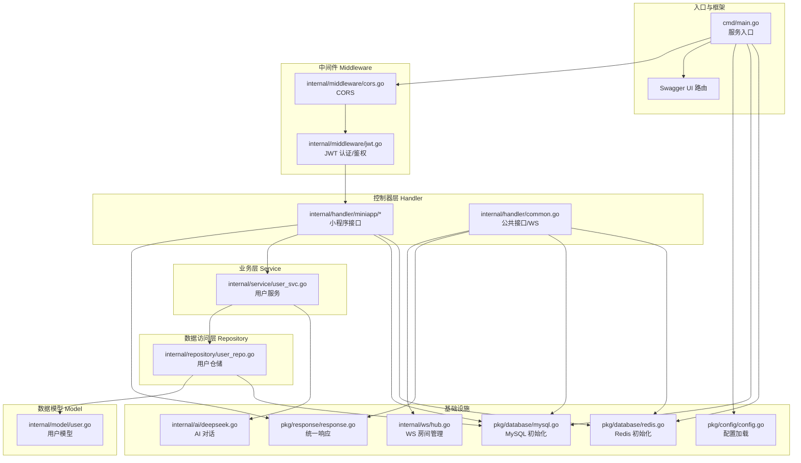
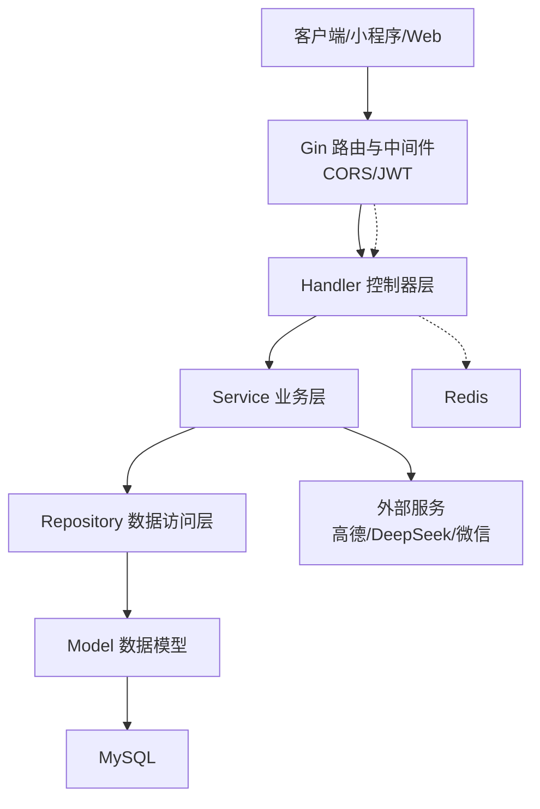
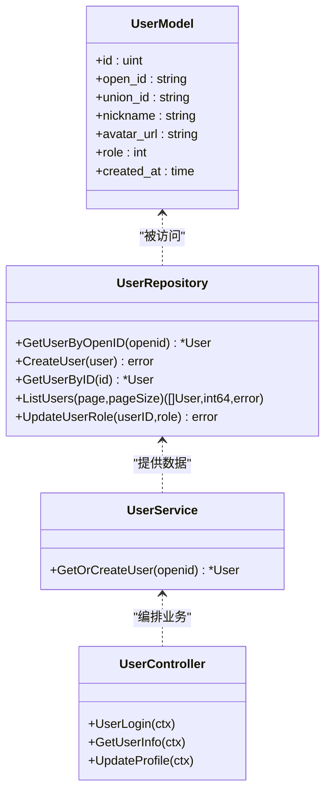
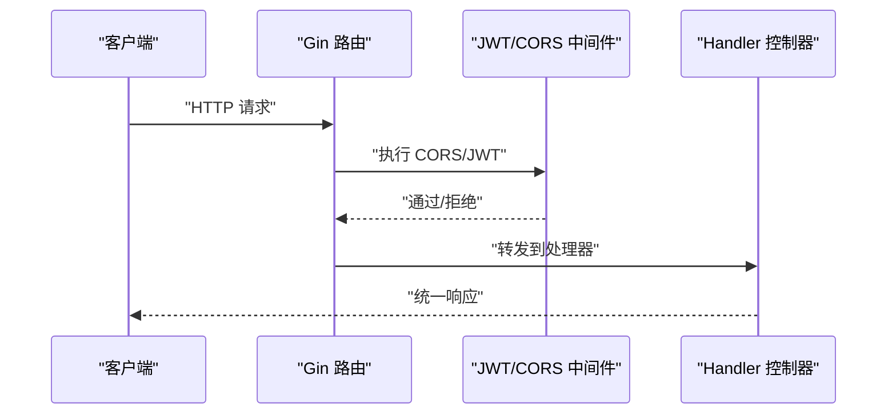
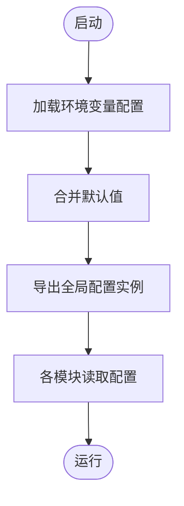
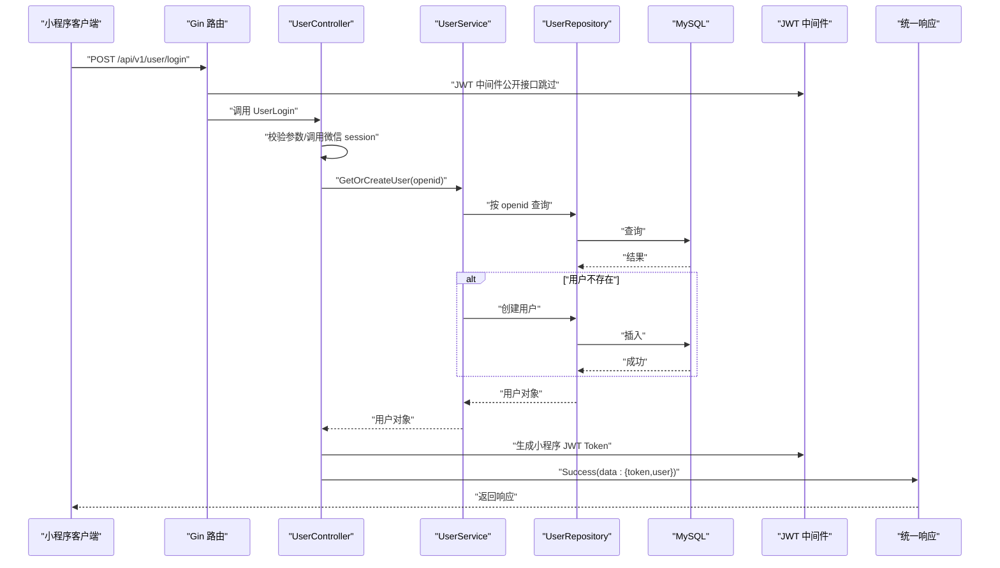
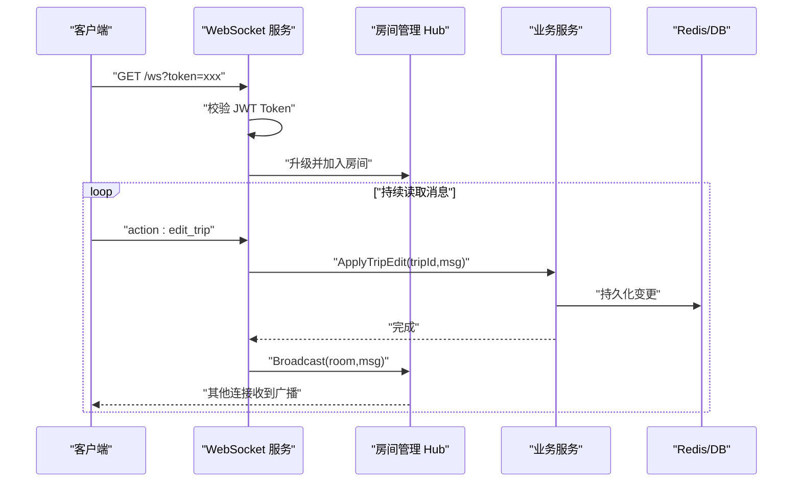
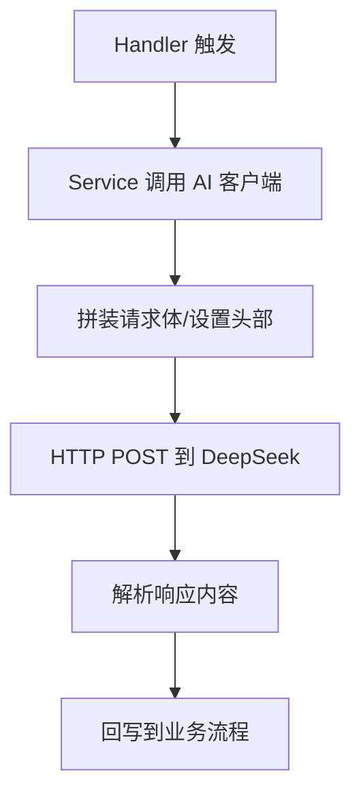
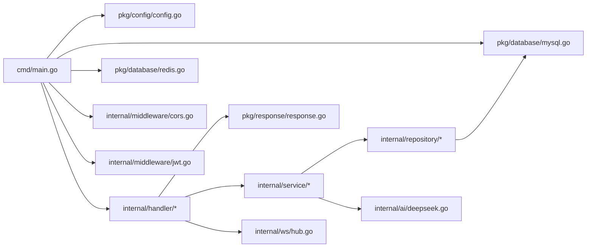

# 系统架构

<cite>
**本文引用的文件**
- [cmd/main.go](file://cmd/main.go)
- [pkg/config/config.go](file://pkg/config/config.go)
- [pkg/database/mysql.go](file://pkg/database/mysql.go)
- [pkg/database/redis.go](file://pkg/database/redis.go)
- [internal/middleware/cors.go](file://internal/middleware/cors.go)
- [internal/middleware/jwt.go](file://internal/middleware/jwt.go)
- [internal/model/user.go](file://internal/model/user.go)
- [internal/repository/user_repo.go](file://internal/repository/user_repo.go)
- [internal/service/user_svc.go](file://internal/service/user_svc.go)
- [internal/handler/miniapp/user.go](file://internal/handler/miniapp/user.go)
- [internal/handler/common.go](file://internal/handler/common.go)
- [pkg/response/response.go](file://pkg/response/response.go)
- [internal/ws/hub.go](file://internal/ws/hub.go)
- [internal/ai/deepseek.go](file://internal/ai/deepseek.go)
- [README.md](file://README.md)
</cite>

## 目录
1. [引言](#引言)
2. [项目结构](#项目结构)
3. [核心组件](#核心组件)
4. [架构总览](#架构总览)
5. [详细组件分析](#详细组件分析)
6. [依赖分析](#依赖分析)
7. [性能考虑](#性能考虑)
8. [故障排查指南](#故障排查指南)
9. [结论](#结论)
10. [附录](#附录)

## 引言
本系统为旅行社交平台后端，围绕“小程序端 + 后台管理 + 实时协同编辑”的场景设计，采用分层架构（Model-Repository-Service-Handler），结合 Gin Web 框架、GORM ORM、MySQL、Redis、JWT 认证、WebSocket 实时通信以及外部 AI/地图服务，提供攻略分享、行程规划、搭子组队、记账备忘、足迹海报等能力。本文档聚焦于整体架构设计、MVC 在项目中的落地方式、中间件体系、配置管理、数据流与组件交互，并给出可视化图示与最佳实践建议。

## 项目结构
项目采用按功能域分层的组织方式：
- cmd：服务入口，负责初始化配置、数据库、注册路由并启动 HTTP 服务
- internal：核心业务域
  - ai：集成第三方 AI 服务（DeepSeek）
  - handler：HTTP 控制器层，按 miniapp/admin 维度组织
  - middleware：HTTP 中间件（CORS、JWT）
  - model：GORM 数据模型
  - repository：数据访问层（DAO）
  - service：业务逻辑层
  - ws：WebSocket 房间与广播
- pkg：通用基础设施
  - config：环境变量配置加载
  - database：数据库连接与初始化
  - response：统一响应封装

图表来源
- [cmd/main.go:31-151](file://cmd/main.go#L31-L151)
- [internal/handler/miniapp/user.go:19-116](file://internal/handler/miniapp/user.go#L19-L116)
- [internal/handler/common.go:19-92](file://internal/handler/common.go#L19-L92)
- [internal/middleware/cors.go:10-22](file://internal/middleware/cors.go#L10-L22)
- [internal/middleware/jwt.go:48-122](file://internal/middleware/jwt.go#L48-L122)
- [internal/service/user_svc.go:12-27](file://internal/service/user_svc.go#L12-L27)
- [internal/repository/user_repo.go:8-44](file://internal/repository/user_repo.go#L8-L44)
- [internal/model/user.go:6-15](file://internal/model/user.go#L6-L15)
- [pkg/response/response.go:10-25](file://pkg/response/response.go#L10-L25)
- [pkg/config/config.go:61-100](file://pkg/config/config.go#L61-L100)
- [pkg/database/mysql.go:19-91](file://pkg/database/mysql.go#L19-L91)
- [pkg/database/redis.go:15-32](file://pkg/database/redis.go#L15-L32)
- [internal/ws/hub.go:10-56](file://internal/ws/hub.go#L10-L56)
- [internal/ai/deepseek.go:13-53](file://internal/ai/deepseek.go#L13-L53)

章节来源
- [README.md:39-87](file://README.md#L39-L87)
- [cmd/main.go:31-151](file://cmd/main.go#L31-L151)

## 核心组件
- 配置管理：集中从环境变量加载配置，提供默认值与类型转换，全局共享
- 数据库层：MySQL 初始化与自动迁移，Redis 初始化与健康检查
- 中间件：CORS 全局跨域，JWT 小程序用户与后台管理员双令牌体系
- 控制器层：按模块组织接口，统一响应封装
- 业务层：封装领域逻辑，协调仓储与外部服务
- 数据访问层：面向模型的 CRUD 封装
- 实时通信：WebSocket 协同编辑，房间广播
- AI 集成：DeepSeek 对话接口，用于智能行程生成

章节来源
- [pkg/config/config.go:61-100](file://pkg/config/config.go#L61-L100)
- [pkg/database/mysql.go:19-91](file://pkg/database/mysql.go#L19-L91)
- [pkg/database/redis.go:15-32](file://pkg/database/redis.go#L15-L32)
- [internal/middleware/cors.go:10-22](file://internal/middleware/cors.go#L10-L22)
- [internal/middleware/jwt.go:48-122](file://internal/middleware/jwt.go#L48-L122)
- [pkg/response/response.go:10-25](file://pkg/response/response.go#L10-L25)
- [internal/ai/deepseek.go:13-53](file://internal/ai/deepseek.go#L13-L53)
- [internal/ws/hub.go:10-56](file://internal/ws/hub.go#L10-L56)

## 架构总览
系统采用清晰的分层架构与 MVC 思想在项目中的落地：
- Model：GORM 模型定义，承载数据结构与约束
- Repository：对数据库的访问封装，屏蔽底层细节
- Service：业务规则与流程编排，协调仓储与外部服务
- Handler：HTTP 控制器，处理请求、参数校验、调用服务、输出统一响应
- Middleware：横切关注点（跨域、认证、鉴权）
- Infrastructure：数据库、缓存、第三方服务集成

图表来源
- [cmd/main.go:31-151](file://cmd/main.go#L31-L151)
- [internal/handler/miniapp/user.go:19-116](file://internal/handler/miniapp/user.go#L19-L116)
- [internal/service/user_svc.go:12-27](file://internal/service/user_svc.go#L12-L27)
- [internal/repository/user_repo.go:8-44](file://internal/repository/user_repo.go#L8-L44)
- [internal/model/user.go:6-15](file://internal/model/user.go#L6-L15)
- [pkg/database/mysql.go:19-91](file://pkg/database/mysql.go#L19-L91)
- [pkg/database/redis.go:15-32](file://pkg/database/redis.go#L15-L32)
- [internal/ai/deepseek.go:13-53](file://internal/ai/deepseek.go#L13-L53)

## 详细组件分析

### 分层架构与 MVC 落地
- Model 层：以 GORM 模型为核心，定义字段、索引与默认值，保证数据一致性
- Repository 层：提供按领域方法的数据库访问，如按 OpenID 查询用户、分页列表等
- Service 层：封装业务规则，如“微信登录即注册”、“行程协同编辑持久化”
- Handler 层：负责路由、参数绑定、调用服务、返回统一响应
- Middleware 层：全局跨域与认证中间件，按需注入用户上下文
- Infrastructure 层：数据库、缓存、第三方 API 集成

图表来源
- [internal/model/user.go:6-15](file://internal/model/user.go#L6-L15)
- [internal/repository/user_repo.go:8-44](file://internal/repository/user_repo.go#L8-L44)
- [internal/service/user_svc.go:12-27](file://internal/service/user_svc.go#L12-L27)
- [internal/handler/miniapp/user.go:19-116](file://internal/handler/miniapp/user.go#L19-L116)

章节来源
- [internal/model/user.go:6-15](file://internal/model/user.go#L6-L15)
- [internal/repository/user_repo.go:8-44](file://internal/repository/user_repo.go#L8-L44)
- [internal/service/user_svc.go:12-27](file://internal/service/user_svc.go#L12-L27)
- [internal/handler/miniapp/user.go:19-116](file://internal/handler/miniapp/user.go#L19-L116)

### 中间件系统：CORS 与 JWT
- CORS 中间件：设置允许的源、头部与方法，预检请求直接返回
- JWT 中间件：
  - 小程序用户：解析 Bearer Token，注入 userID 到上下文
  - 后台管理员：解析管理员 Token，查询管理员状态并注入 adminUserID 与角色
- 中间件在路由层面生效，Handler 可通过上下文读取用户信息

图表来源
- [internal/middleware/cors.go:10-22](file://internal/middleware/cors.go#L10-L22)
- [internal/middleware/jwt.go:48-122](file://internal/middleware/jwt.go#L48-L122)
- [internal/handler/miniapp/user.go:77-116](file://internal/handler/miniapp/user.go#L77-L116)

章节来源
- [internal/middleware/cors.go:10-22](file://internal/middleware/cors.go#L10-L22)
- [internal/middleware/jwt.go:48-122](file://internal/middleware/jwt.go#L48-L122)

### 配置管理架构
- 集中式配置加载：从环境变量读取，未设置则使用默认值
- 类型安全：字符串/整型/浮点型分别提供解析函数
- 全局共享：通过全局指针暴露，供各模块使用

图表来源
- [pkg/config/config.go:61-100](file://pkg/config/config.go#L61-L100)

章节来源
- [pkg/config/config.go:61-100](file://pkg/config/config.go#L61-L100)

### 数据流与组件交互（以用户登录为例）

图表来源
- [internal/handler/miniapp/user.go:19-116](file://internal/handler/miniapp/user.go#L19-L116)
- [internal/service/user_svc.go:12-27](file://internal/service/user_svc.go#L12-L27)
- [internal/repository/user_repo.go:8-44](file://internal/repository/user_repo.go#L8-L44)
- [pkg/database/mysql.go:19-91](file://pkg/database/mysql.go#L19-L91)
- [internal/middleware/jwt.go:26-46](file://internal/middleware/jwt.go#L26-L46)
- [pkg/response/response.go:17-25](file://pkg/response/response.go#L17-L25)

章节来源
- [internal/handler/miniapp/user.go:19-116](file://internal/handler/miniapp/user.go#L19-L116)
- [internal/service/user_svc.go:12-27](file://internal/service/user_svc.go#L12-L27)
- [internal/repository/user_repo.go:8-44](file://internal/repository/user_repo.go#L8-L44)
- [pkg/database/mysql.go:19-91](file://pkg/database/mysql.go#L19-L91)
- [internal/middleware/jwt.go:26-46](file://internal/middleware/jwt.go#L26-L46)
- [pkg/response/response.go:17-25](file://pkg/response/response.go#L17-L25)

### WebSocket 协同编辑流程

图表来源
- [internal/handler/common.go:48-92](file://internal/handler/common.go#L48-L92)
- [internal/ws/hub.go:10-56](file://internal/ws/hub.go#L10-L56)
- [pkg/database/redis.go:15-32](file://pkg/database/redis.go#L15-L32)

章节来源
- [internal/handler/common.go:48-92](file://internal/handler/common.go#L48-L92)
- [internal/ws/hub.go:10-56](file://internal/ws/hub.go#L10-L56)

### AI 智能行程生成
- Handler 触发 Service 调用 AI 客户端
- AI 客户端拼装 DeepSeek 请求，返回模型内容
- Service 解析并回写到业务流程（如行程）

图表来源
- [internal/ai/deepseek.go:13-53](file://internal/ai/deepseek.go#L13-L53)

章节来源
- [internal/ai/deepseek.go:13-53](file://internal/ai/deepseek.go#L13-L53)

## 依赖分析
- 入口依赖：Gin、Swagger、配置、数据库初始化
- 控制器依赖：统一响应、配置、中间件、仓储、服务
- 服务依赖：仓储、AI 客户端
- 仓储依赖：GORM、数据库
- 中间件依赖：JWT 解析、仓库（后台鉴权）
- 基础设施依赖：MySQL、Redis、第三方 API

图表来源
- [cmd/main.go:31-151](file://cmd/main.go#L31-L151)
- [pkg/config/config.go:61-100](file://pkg/config/config.go#L61-L100)
- [pkg/database/mysql.go:19-91](file://pkg/database/mysql.go#L19-L91)
- [pkg/database/redis.go:15-32](file://pkg/database/redis.go#L15-L32)
- [internal/middleware/cors.go:10-22](file://internal/middleware/cors.go#L10-L22)
- [internal/middleware/jwt.go:48-122](file://internal/middleware/jwt.go#L48-L122)
- [internal/handler/miniapp/user.go:19-116](file://internal/handler/miniapp/user.go#L19-L116)
- [pkg/response/response.go:10-25](file://pkg/response/response.go#L10-L25)
- [internal/ai/deepseek.go:13-53](file://internal/ai/deepseek.go#L13-L53)
- [internal/ws/hub.go:10-56](file://internal/ws/hub.go#L10-L56)

章节来源
- [cmd/main.go:31-151](file://cmd/main.go#L31-L151)

## 性能考虑
- 数据库连接与迁移：初始化阶段进行自动迁移与默认数据填充，建议在生产环境配合迁移脚本与灰度策略
- 连接重试：MySQL 初始化具备重试机制，提升启动稳定性
- Redis Ping：初始化阶段进行连通性检查，避免运行期异常
- JWT：轻量无状态认证，减少服务端会话存储压力
- WebSocket：房间内广播采用并发安全结构，注意消息体积与频率控制
- 外部 API：高德天气、DeepSeek 等均在网络抖动下可能失败，建议引入超时与熔断策略

## 故障排查指南
- 路由无法访问
  - 检查是否正确注册在 /api/v1 分组下
  - 确认中间件顺序与作用范围
- 跨域失败
  - 检查 CORS 中间件是否全局启用
  - 确认前端请求头与方法是否在允许范围内
- 认证失败
  - 小程序接口：确认 Authorization 头是否为 Bearer Token
  - 后台接口：确认管理员 Token 是否有效且用户状态正常
- 数据库连接失败
  - 检查环境变量与主机可达性
  - 关注初始化重试日志
- Redis 连接失败
  - 检查地址、端口、密码与 DB 索引
- WebSocket 无法升级
  - 检查 token 校验与 upgrader 配置
  - 关注连接关闭与读取消息异常日志

章节来源
- [internal/middleware/cors.go:10-22](file://internal/middleware/cors.go#L10-L22)
- [internal/middleware/jwt.go:48-122](file://internal/middleware/jwt.go#L48-L122)
- [pkg/database/mysql.go:19-91](file://pkg/database/mysql.go#L19-L91)
- [pkg/database/redis.go:15-32](file://pkg/database/redis.go#L15-L32)
- [internal/handler/common.go:48-92](file://internal/handler/common.go#L48-L92)

## 结论
本系统以清晰的分层架构与 MVC 落地方式，结合 Gin 的中间件生态、GORM 的数据建模能力、Redis 的高性能缓存与 JWT 的无状态认证，构建了可扩展、易维护的旅行社交平台后端。通过统一响应、集中配置与模块化的业务编排，既满足了小程序端的高频交互需求，也为后台管理与实时协同编辑提供了稳定支撑。后续可在外部依赖的超时与熔断、连接池优化、日志与指标采集等方面进一步增强。

## 附录
- 技术选型与架构考量
  - Gin：简洁高效，适合 API 服务
  - GORM：开发者友好，自动迁移与关联映射
  - MySQL：成熟稳定的关系型数据库
  - Redis：会话、缓存与计数等场景
  - JWT：移动端无状态认证
  - WebSocket：低延迟实时协作
  - Swagger：自动生成 API 文档，便于联调
  - DeepSeek：大模型能力用于智能行程生成
- 设计权衡
  - 代码与数据解耦：通过 Repository 与 Service 解耦，利于测试与演进
  - 中间件统一：CORS 与 JWT 在入口集中处理，降低重复与遗漏
  - 配置集中：环境变量驱动，便于多环境部署与 CI/CD
  - 外部依赖：通过独立模块隔离，降低耦合度

章节来源
- [README.md:23-36](file://README.md#L23-L36)
- [cmd/main.go:31-151](file://cmd/main.go#L31-L151)