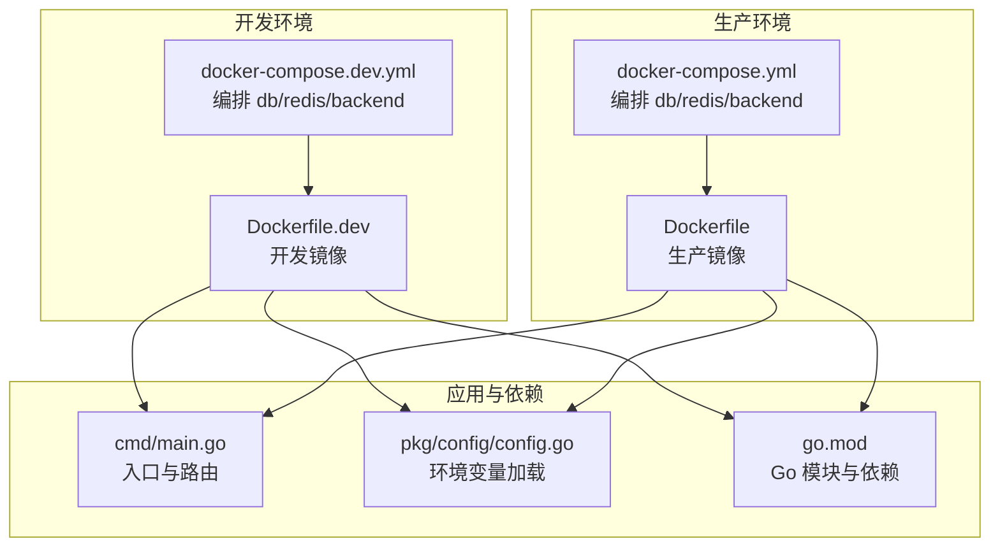
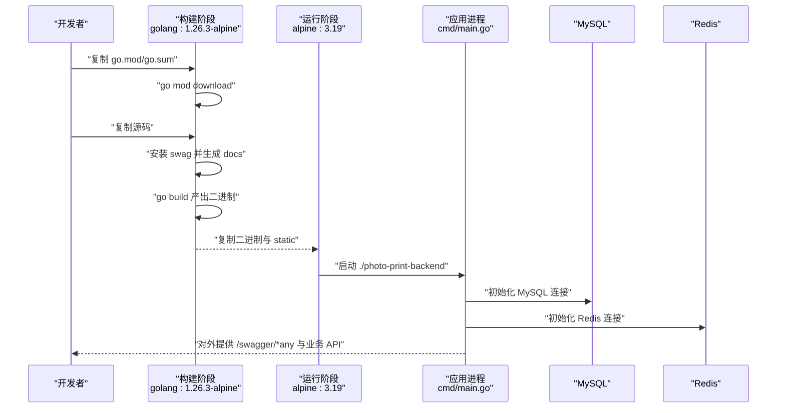
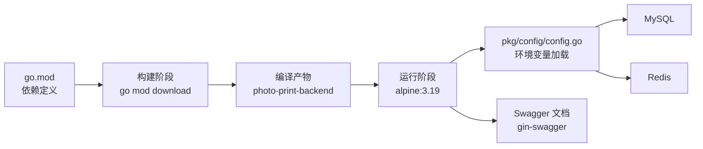

# 容器化部署

<cite>
**本文引用的文件**
- [Dockerfile](file://Dockerfile)
- [Dockerfile.dev](file://Dockerfile.dev)
- [docker-compose.yml](file://docker-compose.yml)
- [docker-compose.dev.yml](file://docker-compose.dev.yml)
- [go.mod](file://go.mod)
- [cmd/main.go](file://cmd/main.go)
- [pkg/config/config.go](file://pkg/config/config.go)
- [.air.toml](file://.air.toml)
- [.gitignore](file://.gitignore)
- [README.md](file://README.md)
</cite>

## 目录
1. [简介](#简介)
2. [项目结构](#项目结构)
3. [核心组件](#核心组件)
4. [架构总览](#架构总览)
5. [详细组件分析](#详细组件分析)
6. [依赖关系分析](#依赖关系分析)
7. [性能考量](#性能考量)
8. [故障排查指南](#故障排查指南)
9. [结论](#结论)
10. [附录](#附录)

## 简介
本文件面向容器化部署场景，系统性说明旅行服务器项目的多阶段构建、Go 模块依赖管理、Swagger 文档生成的容器化流程，以及生产与开发环境 Dockerfile 的差异与优化策略。重点解释 Alpine Linux 基础镜像选择的原因与安全注意事项，涵盖静态文件复制、端口暴露与命令执行等关键配置，并给出最佳实践与性能优化建议。

## 项目结构
该仓库采用多阶段 Dockerfile 构建，配合 docker-compose 在本地快速编排数据库与缓存服务，便于前后端联调。生产镜像与开发镜像分别对应不同的构建目标与运行方式。

图表来源
- [Dockerfile.dev:1-17](file://Dockerfile.dev#L1-L17)
- [docker-compose.dev.yml:1-59](file://docker-compose.dev.yml#L1-L59)
- [Dockerfile:1-29](file://Dockerfile#L1-L29)
- [docker-compose.yml:1-59](file://docker-compose.yml#L1-L59)
- [cmd/main.go:1-152](file://cmd/main.go#L1-L152)
- [pkg/config/config.go:1-129](file://pkg/config/config.go#L1-L129)
- [go.mod:1-67](file://go.mod#L1-L67)

章节来源
- [Dockerfile:1-29](file://Dockerfile#L1-L29)
- [Dockerfile.dev:1-17](file://Dockerfile.dev#L1-L17)
- [docker-compose.yml:1-59](file://docker-compose.yml#L1-L59)
- [docker-compose.dev.yml:1-59](file://docker-compose.dev.yml#L1-L59)
- [cmd/main.go:1-152](file://cmd/main.go#L1-L152)
- [pkg/config/config.go:1-129](file://pkg/config/config.go#L1-L129)
- [go.mod:1-67](file://go.mod#L1-L67)

## 核心组件
- 多阶段构建
  - 构建阶段：使用 golang:1.26.3-alpine 作为基础镜像，安装 swag 工具，下载 Go 模块，复制源码，生成 Swagger 文档，编译出二进制可执行文件。
  - 运行阶段：使用固定版本的 Alpine Linux 3.19，仅复制编译产物与静态资源，最小化运行时镜像体积与攻击面。
- Go 模块与依赖管理
  - go.mod 明确 Go 版本与依赖，构建阶段通过 go mod download 完成依赖解析与缓存。
- Swagger 文档生成
  - 构建阶段通过 swag init 生成 docs 目录；运行阶段通过 Gin-Swagger 中间件提供 /swagger/*any 路由。
- 环境变量与配置
  - 通过 pkg/config 加载环境变量，统一管理数据库、Redis、服务端口、第三方密钥等配置。
- 开发与生产差异化
  - 开发镜像安装 air 实现热重载，挂载源码目录实现“边改边跑”；生产镜像仅包含编译产物与静态资源，不包含开发工具链。

章节来源
- [Dockerfile:1-29](file://Dockerfile#L1-L29)
- [Dockerfile.dev:1-17](file://Dockerfile.dev#L1-L17)
- [go.mod:1-67](file://go.mod#L1-L67)
- [cmd/main.go:1-152](file://cmd/main.go#L1-L152)
- [pkg/config/config.go:1-129](file://pkg/config/config.go#L1-L129)

## 架构总览
下图展示了生产与开发两种镜像的构建与运行流程，以及与数据库、缓存、Swagger 文档的关系。

图表来源
- [Dockerfile:1-29](file://Dockerfile#L1-L29)
- [cmd/main.go:1-152](file://cmd/main.go#L1-L152)
- [pkg/config/config.go:1-129](file://pkg/config/config.go#L1-L129)

## 详细组件分析

### 生产镜像 Dockerfile 分析
- 多阶段构建
  - 构建阶段：以 golang:1.26.3-alpine 为基础，安装 swag，下载依赖，复制源码，生成 docs，编译二进制。
  - 运行阶段：以 alpine:3.19 为基础，复制二进制与 static 目录，暴露 8080 端口，使用 CMD 启动。
- 关键点
  - 固定 Alpine 版本（3.19），避免镜像层漂移与不可重复构建。
  - 显式复制 static 目录，保证运行时静态资源可用。
  - 通过 swag init 在构建期生成文档，减少运行时开销。
- 端口与命令
  - EXPOSE 8080；CMD 使用相对路径 ./photo-print-backend 启动。

章节来源
- [Dockerfile:1-29](file://Dockerfile#L1-L29)

### 开发镜像 Dockerfile 分析
- 开发镜像特点
  - 安装 air 与 swag，复制依赖与源码，通过 sh -c 同时执行 swag init 与 air 启动热重载。
  - docker-compose.dev.yml 将宿主机代码挂载到 /app，结合 air 实现“改即启”，无需重建镜像。
- 端口与调试
  - 暴露 8080（服务端口）与 2345（调试端口），便于本地调试与日志追踪。
- 与生产镜像差异
  - 包含开发工具链与热重载机制；不进行多阶段精简，便于快速迭代。

章节来源
- [Dockerfile.dev:1-17](file://Dockerfile.dev#L1-L17)
- [docker-compose.dev.yml:1-59](file://docker-compose.dev.yml#L1-L59)
- [.air.toml:1-15](file://.air.toml#L1-L15)

### Swagger 文档生成与容器化流程
- 构建期生成
  - 构建阶段安装 swag 并执行 swag init -g 指向 cmd/main.go，生成 docs 目录供运行时使用。
- 运行期提供
  - 应用启动后注册 /swagger/*any 路由，通过 gin-swagger 提供交互式文档界面。
- 容器化要点
  - 构建阶段生成的 docs 必须随二进制一起复制到运行镜像，否则 Swagger UI 将无法访问。
  - 若使用卷挂载覆盖，需确保 docs 目录在构建阶段已生成。

章节来源
- [Dockerfile:14-15](file://Dockerfile#L14-L15)
- [cmd/main.go:43-44](file://cmd/main.go#L43-L44)
- [go.mod:10-12](file://go.mod#L10-L12)

### 环境变量与配置加载
- 配置来源
  - 通过 pkg/config 加载环境变量，包含数据库、Redis、服务端口、第三方密钥等。
- 端口绑定
  - 服务默认监听 8080（由配置驱动），docker-compose 将其映射到宿主机端口。
- 安全建议
  - 生产环境使用 env_file 或机密管理工具注入敏感变量，避免硬编码。

章节来源
- [pkg/config/config.go:1-129](file://pkg/config/config.go#L1-L129)
- [docker-compose.yml:44-45](file://docker-compose.yml#L44-L45)
- [cmd/main.go:149](file://cmd/main.go#L149)

### 静态文件复制与端口暴露
- 静态文件
  - 构建阶段复制 static 目录至运行镜像，确保前端静态资源或生成的静态文件在容器内可用。
- 端口暴露
  - 生产镜像 EXPOSE 8080；compose 将其映射到宿主机端口，便于外部访问。
- 命令执行
  - 生产镜像使用 CMD ./photo-print-backend 启动；开发镜像使用 CMD sh -c "swag init ... && air"。

章节来源
- [Dockerfile:25-28](file://Dockerfile#L25-L28)
- [docker-compose.yml:41-43](file://docker-compose.yml#L41-L43)
- [Dockerfile.dev:17](file://Dockerfile.dev#L17)

### 生产与开发 Dockerfile 的区别与优化策略
- 区别
  - 生产：多阶段精简、固定 Alpine 版本、仅复制二进制与静态资源、无开发工具链。
  - 开发：安装 air 与 swag、挂载源码、热重载、暴露调试端口。
- 优化策略
  - 生产：启用只读根文件系统、非 root 用户运行、最小化依赖、健康检查、资源限制。
  - 开发：合理排除临时目录与日志，避免不必要的文件进入镜像层；使用 .dockerignore 控制构建上下文。
- 安全加固
  - 使用只读文件系统与最小权限；定期更新基础镜像与依赖；扫描镜像漏洞。

章节来源
- [Dockerfile:1-29](file://Dockerfile#L1-L29)
- [Dockerfile.dev:1-17](file://Dockerfile.dev#L1-L17)
- [.gitignore:67-89](file://.gitignore#L67-L89)

### Alpine Linux 基础镜像选择与安全考虑
- 选择原因
  - 体积小、启动快、更新频率高；适合容器化运行时。
- 安全考虑
  - 固定 Alpine 版本（如 3.19），避免 latest 的不确定性；定期扫描与更新。
  - 结合只读文件系统、非 root 用户、最小权限原则降低风险。

章节来源
- [Dockerfile:21](file://Dockerfile#L21)
- [Dockerfile.dev:1](file://Dockerfile.dev#L1)

## 依赖关系分析
- 构建依赖
  - go.mod 定义了项目依赖；构建阶段通过 go mod download 缓存依赖，提升构建稳定性。
- 运行依赖
  - 应用通过 pkg/config 读取环境变量，连接 MySQL 与 Redis；Swagger 文档由 gin-swagger 提供。
- Compose 编排
  - docker-compose.yml 与 docker-compose.dev.yml 分别编排 db、redis、backend 服务，设置端口映射、卷与健康检查。

图表来源
- [go.mod:1-67](file://go.mod#L1-L67)
- [Dockerfile:9-18](file://Dockerfile#L9-L18)
- [Dockerfile:21-28](file://Dockerfile#L21-L28)
- [pkg/config/config.go:1-129](file://pkg/config/config.go#L1-L129)
- [cmd/main.go:43-44](file://cmd/main.go#L43-L44)

章节来源
- [go.mod:1-67](file://go.mod#L1-L67)
- [docker-compose.yml:1-59](file://docker-compose.yml#L1-L59)
- [docker-compose.dev.yml:1-59](file://docker-compose.dev.yml#L1-L59)

## 性能考量
- 构建性能
  - 利用 go mod download 的缓存层，减少网络依赖；多阶段构建避免将开发工具带入运行镜像。
- 运行性能
  - Alpine 镜像体积小，启动快；建议开启只读根文件系统与最小权限；为 CPU/内存设置合理的限制与请求。
- 网络与 I/O
  - 将静态资源与二进制分离，利用只读层缓存；数据库与缓存使用独立容器，避免阻塞。
- 可观测性
  - 健康检查与日志采集；生产环境建议使用集中式日志与指标监控。

## 故障排查指南
- Swagger 文档不可见
  - 确认构建阶段已生成 docs；确认运行镜像复制了 docs 与 static；确认 /swagger/*any 路由已注册。
- 端口冲突或映射错误
  - 检查 compose 文件中的端口映射；确认宿主机端口未被占用。
- 环境变量未生效
  - 确认 env_file 路径正确；检查变量名称与默认值；验证配置加载顺序。
- 热重载无效（开发）
  - 确认 air 已安装；确认源码挂载路径正确；检查 .air.toml 的构建命令与排除目录。

章节来源
- [Dockerfile:14-15](file://Dockerfile#L14-L15)
- [Dockerfile:25-28](file://Dockerfile#L25-L28)
- [docker-compose.yml:41-45](file://docker-compose.yml#L41-L45)
- [pkg/config/config.go:61-100](file://pkg/config/config.go#L61-L100)
- [.air.toml:4-12](file://.air.toml#L4-L12)

## 结论
本项目通过多阶段 Dockerfile 实现了“构建期生成 Swagger 文档与编译二进制、运行期最小化镜像”的容器化方案；配合 docker-compose 编排数据库与缓存，既满足开发热重载需求，又保证生产环境的安全与稳定。建议在生产环境中进一步强化安全基线与可观测性，持续优化镜像与运行时性能。

## 附录
- 快速开始与参考
  - 参考项目 README 中关于 Docker 部署与开发模式的说明，了解端到端使用流程与示例命令。

章节来源
- [README.md:237-318](file://README.md#L237-L318)