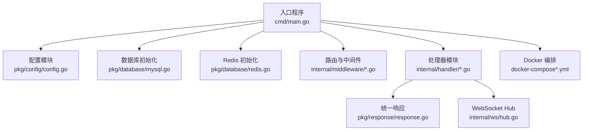
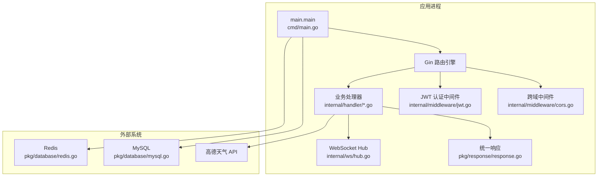
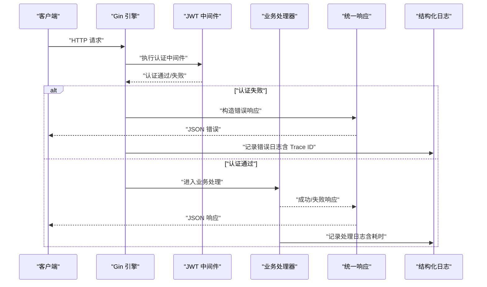
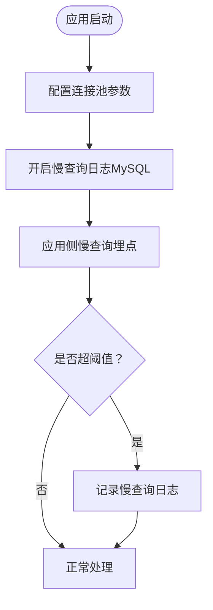
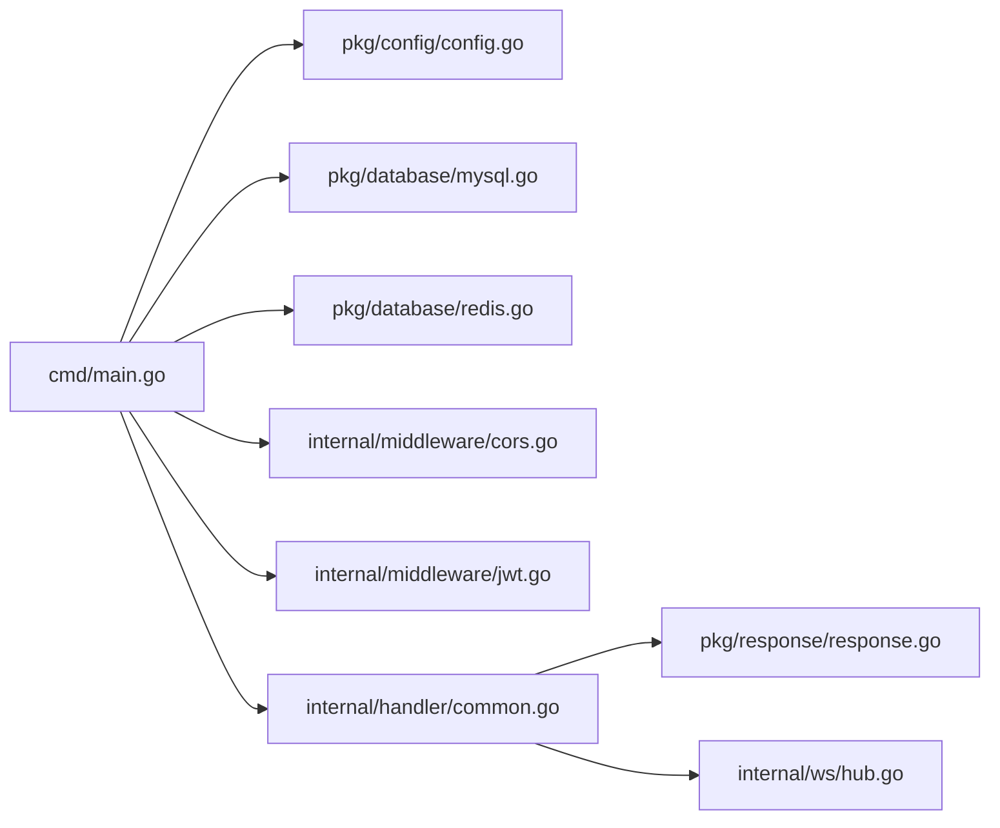

# 监控日志

<cite>
**本文引用的文件**
- [cmd/main.go](file://cmd/main.go)
- [pkg/config/config.go](file://pkg/config/config.go)
- [pkg/database/mysql.go](file://pkg/database/mysql.go)
- [pkg/database/redis.go](file://pkg/database/redis.go)
- [internal/middleware/cors.go](file://internal/middleware/cors.go)
- [internal/middleware/jwt.go](file://internal/middleware/jwt.go)
- [internal/handler/common.go](file://internal/handler/common.go)
- [pkg/response/response.go](file://pkg/response/response.go)
- [internal/ws/hub.go](file://internal/ws/hub.go)
- [docker-compose.yml](file://docker-compose.yml)
- [docker-compose.dev.yml](file://docker-compose.dev.yml)
- [go.mod](file://go.mod)
- [go.sum](file://go.sum)
</cite>

## 目录
1. [简介](#简介)
2. [项目结构](#项目结构)
3. [核心组件](#核心组件)
4. [架构总览](#架构总览)
5. [详细组件分析](#详细组件分析)
6. [依赖分析](#依赖分析)
7. [性能考虑](#性能考虑)
8. [故障排查指南](#故障排查指南)
9. [结论](#结论)
10. [附录](#附录)

## 简介
本文件面向“旅行搭子”小程序后端服务，系统性梳理监控与日志体系的现状与扩展建议。当前仓库实现了基础的日志输出、统一响应格式、数据库与缓存连接初始化、跨域与鉴权中间件等能力；但尚未内置完善的日志级别管理、错误追踪与异常处理机制、性能指标采集与上报、数据库连接池监控、慢查询日志配置、系统资源监控（CPU/内存/磁盘）、告警规则与通知机制、日志聚合与分析工具集成以及监控仪表板可视化。

本文在不改变现有实现的前提下，提出可落地的增强方案，帮助团队逐步完善生产级监控与日志体系。

## 项目结构
项目采用分层组织方式：入口程序负责初始化配置与路由注册；中间件提供通用横切能力；处理器模块承载业务接口；数据访问层通过 GORM 与 Redis 客户端完成数据库与缓存交互；配置模块集中管理环境变量；响应模块提供统一 JSON 输出。

**图示来源**
- [cmd/main.go:31-151](file://cmd/main.go#L31-L151)
- [pkg/config/config.go:61-100](file://pkg/config/config.go#L61-L100)
- [pkg/database/mysql.go:19-90](file://pkg/database/mysql.go#L19-L90)
- [pkg/database/redis.go:15-31](file://pkg/database/redis.go#L15-L31)
- [internal/middleware/cors.go:10-22](file://internal/middleware/cors.go#L10-L22)
- [internal/middleware/jwt.go:48-122](file://internal/middleware/jwt.go#L48-L122)
- [internal/handler/common.go:25-91](file://internal/handler/common.go#L25-L91)
- [pkg/response/response.go:17-25](file://pkg/response/response.go#L17-L25)
- [internal/ws/hub.go:10-55](file://internal/ws/hub.go#L10-L55)
- [docker-compose.yml:35-53](file://docker-compose.yml#L35-L53)
- [docker-compose.dev.yml:35-53](file://docker-compose.dev.yml#L35-L53)

**章节来源**
- [cmd/main.go:31-151](file://cmd/main.go#L31-L151)
- [pkg/config/config.go:61-100](file://pkg/config/config.go#L61-L100)
- [pkg/database/mysql.go:19-90](file://pkg/database/mysql.go#L19-L90)
- [pkg/database/redis.go:15-31](file://pkg/database/redis.go#L15-L31)
- [internal/middleware/cors.go:10-22](file://internal/middleware/cors.go#L10-L22)
- [internal/middleware/jwt.go:48-122](file://internal/middleware/jwt.go#L48-L122)
- [internal/handler/common.go:25-91](file://internal/handler/common.go#L25-L91)
- [pkg/response/response.go:17-25](file://pkg/response/response.go#L17-L25)
- [internal/ws/hub.go:10-55](file://internal/ws/hub.go#L10-L55)
- [docker-compose.yml:35-53](file://docker-compose.yml#L35-L53)
- [docker-compose.dev.yml:35-53](file://docker-compose.dev.yml#L35-L53)

## 核心组件
- 入口与路由：初始化配置、数据库与缓存、注册路由与中间件，启动 HTTP 服务。
- 配置中心：从环境变量加载数据库、Redis、第三方服务等配置。
- 数据访问：GORM 初始化与自动迁移；Redis 客户端初始化。
- 中间件：跨域处理；小程序与后台管理 JWT 认证。
- 处理器：统一响应封装；天气查询；WebSocket 协议升级与房间广播。
- WebSocket Hub：维护房间与连接映射，支持广播。

**章节来源**
- [cmd/main.go:31-151](file://cmd/main.go#L31-L151)
- [pkg/config/config.go:61-100](file://pkg/config/config.go#L61-L100)
- [pkg/database/mysql.go:19-90](file://pkg/database/mysql.go#L19-L90)
- [pkg/database/redis.go:15-31](file://pkg/database/redis.go#L15-L31)
- [internal/middleware/cors.go:10-22](file://internal/middleware/cors.go#L10-L22)
- [internal/middleware/jwt.go:48-122](file://internal/middleware/jwt.go#L48-L122)
- [internal/handler/common.go:25-91](file://internal/handler/common.go#L25-L91)
- [pkg/response/response.go:17-25](file://pkg/response/response.go#L17-L25)
- [internal/ws/hub.go:10-55](file://internal/ws/hub.go#L10-L55)

## 架构总览
下图展示了应用启动到请求处理的关键路径，以及与外部组件（数据库、缓存、第三方服务）的交互。

**图示来源**
- [cmd/main.go:31-151](file://cmd/main.go#L31-L151)
- [internal/middleware/cors.go:10-22](file://internal/middleware/cors.go#L10-L22)
- [internal/middleware/jwt.go:48-122](file://internal/middleware/jwt.go#L48-L122)
- [internal/handler/common.go:25-91](file://internal/handler/common.go#L25-L91)
- [pkg/response/response.go:17-25](file://pkg/response/response.go#L17-L25)
- [internal/ws/hub.go:10-55](file://internal/ws/hub.go#L10-L55)
- [pkg/database/mysql.go:19-90](file://pkg/database/mysql.go#L19-L90)
- [pkg/database/redis.go:15-31](file://pkg/database/redis.go#L15-L31)

## 详细组件分析

### 日志记录与级别管理
- 现状
  - 使用标准库日志进行关键事件输出，如数据库连接重试、迁移失败、Redis 连接失败、WebSocket 升级错误等。
  - Gin 默认日志未显式配置，未见自定义日志级别（trace/debug/info/warn/error）分流策略。
- 建议
  - 引入结构化日志库（如 zap 或 slog），按环境区分日志级别（开发环境 debug，生产环境 info/warn/error）。
  - 将数据库连接、Redis 连接、HTTP 请求、业务处理等关键路径纳入结构化日志。
  - 为不同模块（数据库、缓存、中间件、处理器）设置独立的 logger 实例，便于定位问题。
  - 输出字段建议包含：时间戳、级别、模块、请求 ID、用户 ID、SQL/Redis 命令摘要、耗时、错误栈摘要等。

**章节来源**
- [pkg/database/mysql.go:27-36](file://pkg/database/mysql.go#L27-L36)
- [pkg/database/mysql.go:61-62](file://pkg/database/mysql.go#L61-L62)
- [pkg/database/redis.go:28-30](file://pkg/database/redis.go#L28-L30)
- [internal/handler/common.go:57-58](file://internal/handler/common.go#L57-L58)
- [cmd/main.go:148-149](file://cmd/main.go#L148-L149)

### 错误追踪与异常处理
- 现状
  - 统一响应封装了错误码与消息，但未记录错误堆栈与上下文。
  - 中间件对认证失败直接返回 JSON，未做统一错误拦截与日志记录。
- 建议
  - 在中间件层增加全局异常捕获，记录请求上下文（路径、方法、参数、用户 ID、Trace ID）与错误栈。
  - 对数据库与缓存操作增加重试与熔断策略，并记录失败原因与重试次数。
  - 对第三方服务（如高德天气）调用增加超时与降级处理，记录失败与耗时。

**图示来源**
- [internal/middleware/jwt.go:48-122](file://internal/middleware/jwt.go#L48-L122)
- [pkg/response/response.go:17-25](file://pkg/response/response.go#L17-L25)
- [internal/handler/common.go:25-42](file://internal/handler/common.go#L25-L42)

**章节来源**
- [internal/middleware/jwt.go:48-122](file://internal/middleware/jwt.go#L48-L122)
- [pkg/response/response.go:17-25](file://pkg/response/response.go#L17-L25)
- [internal/handler/common.go:25-42](file://internal/handler/common.go#L25-L42)

### 性能监控指标采集与上报
- 现状
  - 未发现内置指标采集与上报逻辑。
- 建议
  - 指标维度
    - HTTP 请求：QPS、成功率、P50/P90/P99 响应时间、错误分布。
    - 数据库：连接池活跃/空闲数、等待时间、慢查询计数、DDL/DML 次数。
    - 缓存：命中率、命令耗时、内存使用、连接数。
    - 业务：关键接口耗时、业务量（新增/更新/删除）。
  - 采集方式
    - 使用 Prometheus 客户端库在关键路径埋点（如 Gin 中间件统计请求耗时与状态码）。
    - 数据库与缓存可通过驱动/客户端提供的指标接口或自定义包装器采集。
  - 上报与存储
    - Prometheus 抓取指标，结合 Grafana 做可视化。
    - 可选：将指标导出至 OpenTelemetry Collector，统一接入可观测性平台。

**章节来源**
- [go.mod:5-16](file://go.mod#L5-L16)

### 数据库连接池监控与慢查询日志
- 现状
  - GORM 初始化时未显式配置连接池参数；未开启慢查询日志。
- 建议
  - 连接池参数（建议值，需结合压测调整）
    - 最大打开连接数：建议 2×CPU 或更高，视并发与延迟目标而定。
    - 最大空闲连接数：建议 25%~50% 最大打开连接数。
    - 连接最大生命周期：建议 5~10 分钟，避免长时间连接导致的连接泄漏。
    - 连接最大空闲时间：建议 1~3 分钟，定期回收空闲连接。
  - 慢查询日志
    - MySQL：设置 long_query_time（如 1s）与 slow_query_log=ON；结合 EXPLAIN 分析热点 SQL。
    - 应用侧：对超过阈值（如 500ms）的 SQL 记录慢查询日志，包含 SQL 摘要、参数、耗时、调用栈摘要。
  - 连接健康检查
    - 定期执行 PING/SELECT 1，失败则重建连接并报警。

**图示来源**
- [pkg/database/mysql.go:19-90](file://pkg/database/mysql.go#L19-L90)

**章节来源**
- [pkg/database/mysql.go:19-90](file://pkg/database/mysql.go#L19-L90)

### 系统资源监控（CPU、内存、磁盘）
- 现状
  - 未发现系统资源采集逻辑。
- 建议
  - CPU：采集使用率、负载、上下文切换速率。
  - 内存：采集物理内存使用、GC 统计、堆外内存（如网络缓冲）。
  - 磁盘：采集 IO 利用率、队列长度、吞吐、延迟。
  - 采集方式
    - Linux：Prometheus Node Exporter + 自定义脚本。
    - 容器：cAdvisor + kube-state-metrics（若部署于 Kubernetes）。
  - 告警阈值
    - CPU 使用率 > 80% 持续 5 分钟。
    - 内存使用率 > 85% 或 GC 频繁 Full GC。
    - 磁盘剩余空间 < 10% 或 IO 延迟 > 100ms。

**章节来源**
- [docker-compose.yml:35-53](file://docker-compose.yml#L35-L53)
- [docker-compose.dev.yml:35-53](file://docker-compose.dev.yml#L35-L53)

### 告警规则与通知机制
- 建议
  - 规则示例
    - 服务不可用：连续 3 次探活失败或 5xx 比例 > 5%。
    - 响应延迟：P95 > 阈值（如 2s）持续 3 个周期。
    - 数据库：慢查询占比 > 1% 或连接池等待时间 > 1s。
    - 缓存：命中率 < 80% 或延迟 > 50ms。
    - 系统：CPU/内存/磁盘异常。
  - 通知渠道
    - 邮件、企业微信、钉钉机器人、Slack、PagerDuty。
  - 告警收敛
    - 同类告警合并、静默窗口、抑制策略（如磁盘告警时抑制 CPU 告警）。

**章节来源**
- [docker-compose.yml:16-19](file://docker-compose.yml#L16-L19)
- [docker-compose.yml:29-33](file://docker-compose.yml#L29-L33)

### 日志聚合与分析工具集成
- 建议
  - 日志采集
    - 使用 Fluent Bit/Fluentd 收集容器 stdout/stderr 与应用日志文件。
  - 存储与检索
    - Elasticsearch/Opensearch 存储结构化日志；Kibana 进行检索与可视化。
  - 分析
    - 关键词检索、聚合分析（按接口、用户、错误类型、IP 等维度）。
    - 结合 Trace ID 做端到端链路追踪。
  - 与告警联动
    - 基于日志模式（如错误关键字、异常堆栈）触发告警。

**章节来源**
- [go.mod:5-16](file://go.mod#L5-L16)

### 监控仪表板配置与可视化
- 建议
  - Grafana
    - 数据源：Prometheus、Elasticsearch/Opensearch。
    - 面板：请求 QPS/成功率/延迟、错误分布、数据库连接池、慢查询、系统资源、业务指标。
  - Kibana
    - 日志检索与可视化：错误趋势、错误 TopN、用户行为分析。
  - 仪表板分层
    - 运维看板：服务可用性、资源使用、告警状态。
    - 业务看板：关键接口表现、用户行为、转化漏斗。

**章节来源**
- [go.mod:5-16](file://go.mod#L5-L16)

## 依赖分析
- 外部依赖概览
  - Web 框架：Gin
  - ORM：GORM + MySQL 驱动
  - 缓存：Redis 客户端
  - JWT：golang-jwt
  - Swagger：gin-swagger + swag
  - WebSocket：gorilla/websocket
  - 加密：bcrypt
- 潜在风险
  - 未引入专门的日志、指标、链路追踪库，需额外引入以满足生产监控需求。

**图示来源**
- [go.mod:5-16](file://go.mod#L5-L16)
- [cmd/main.go:31-151](file://cmd/main.go#L31-L151)
- [pkg/config/config.go:61-100](file://pkg/config/config.go#L61-L100)
- [pkg/database/mysql.go:19-90](file://pkg/database/mysql.go#L19-L90)
- [pkg/database/redis.go:15-31](file://pkg/database/redis.go#L15-L31)
- [internal/middleware/cors.go:10-22](file://internal/middleware/cors.go#L10-L22)
- [internal/middleware/jwt.go:48-122](file://internal/middleware/jwt.go#L48-L122)
- [internal/handler/common.go:25-91](file://internal/handler/common.go#L25-L91)
- [pkg/response/response.go:17-25](file://pkg/response/response.go#L17-L25)
- [internal/ws/hub.go:10-55](file://internal/ws/hub.go#L10-L55)

**章节来源**
- [go.mod:5-16](file://go.mod#L5-L16)
- [go.sum:16-30](file://go.sum#L16-L30)

## 性能考虑
- 连接池与超时
  - 明确数据库与缓存连接池参数，避免连接争用与泄漏。
  - 为外部服务调用设置合理超时与重试，防止级联故障。
- 日志与指标
  - 控制日志量级，避免 IO 成为瓶颈；对高频错误进行采样。
  - 指标埋点尽量轻量，避免影响主流程。
- 缓存策略
  - 合理设置过期时间与淘汰策略，降低缓存穿透与雪崩风险。
- WebSocket
  - 注意连接数量与广播频率，必要时限制房间规模与消息大小。

[本节为通用指导，不直接分析具体文件]

## 故障排查指南
- 启动阶段
  - 数据库连接失败：检查 DSN 参数、网络连通性、MySQL 健康检查。
  - Redis 连接失败：检查地址、密码、DB 索引与网络。
- 运行阶段
  - 认证失败：确认 Token 是否过期、签名密钥是否正确、用户状态是否有效。
  - WebSocket 升级失败：检查协议升级、Token 校验、跨域配置。
  - 天气接口异常：检查高德 Key 有效性与网络可达性。
- 日志定位
  - 使用统一 Trace ID 关联请求链路，结合日志检索快速定位问题。

**章节来源**
- [pkg/database/mysql.go:27-36](file://pkg/database/mysql.go#L27-L36)
- [pkg/database/mysql.go:61-62](file://pkg/database/mysql.go#L61-L62)
- [pkg/database/redis.go:28-30](file://pkg/database/redis.go#L28-L30)
- [internal/middleware/jwt.go:48-122](file://internal/middleware/jwt.go#L48-L122)
- [internal/handler/common.go:57-58](file://internal/handler/common.go#L57-L58)
- [internal/handler/common.go:31-41](file://internal/handler/common.go#L31-L41)

## 结论
当前项目具备良好的基础结构与中间件能力，但在监控与日志方面尚属空白。建议优先引入结构化日志、统一异常处理、关键指标埋点与告警规则，随后逐步完善数据库慢查询治理、系统资源监控、日志聚合与分析、以及可视化仪表板。通过循序渐进的方式，既能保障生产稳定性，又能平滑过渡到成熟的可观测性体系。

[本节为总结性内容，不直接分析具体文件]

## 附录
- Docker 编排
  - 生产与开发环境分别提供 compose 文件，包含数据库与缓存的健康检查与端口映射。
- 版本与依赖
  - 项目使用 Go Modules 管理依赖，包含 Gin、GORM、Redis、JWT、Swagger 等常用库。

**章节来源**
- [docker-compose.yml:35-53](file://docker-compose.yml#L35-L53)
- [docker-compose.dev.yml:35-53](file://docker-compose.dev.yml#L35-L53)
- [go.mod:5-16](file://go.mod#L5-L16)
- [go.sum:16-30](file://go.sum#L16-L30)