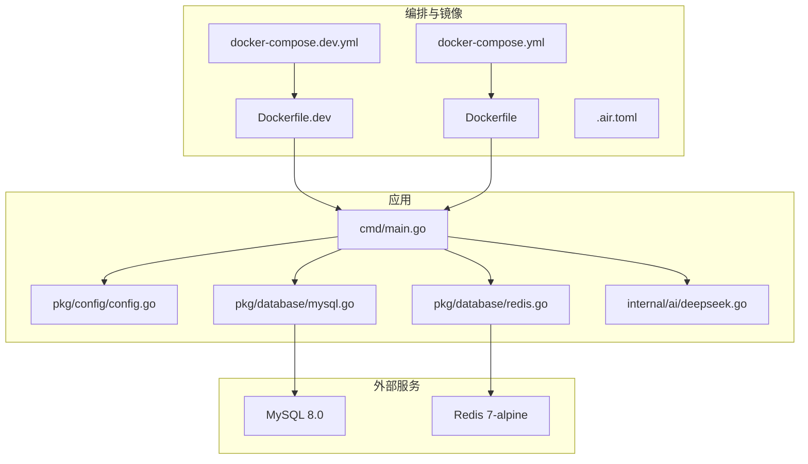
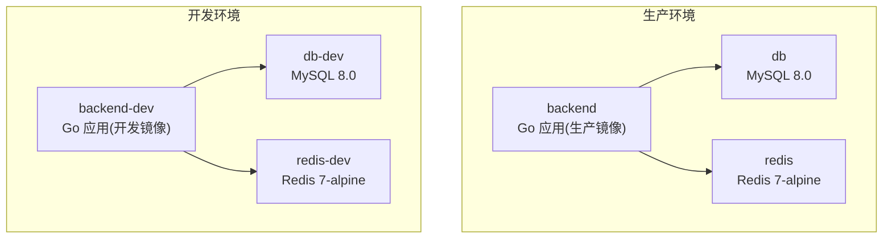
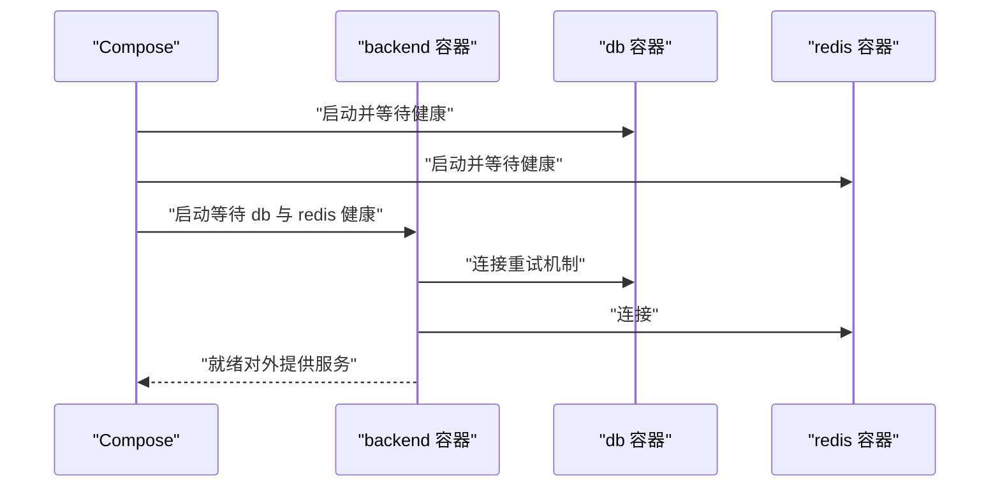
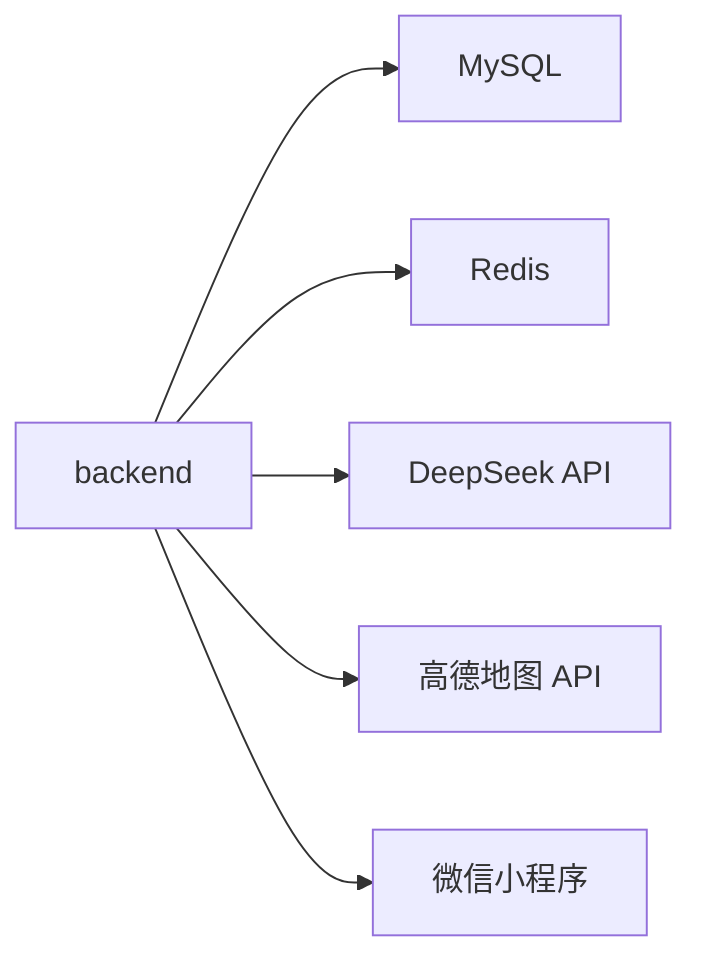

# 编排配置

<cite>
**本文引用的文件**
- [docker-compose.yml](file://docker-compose.yml)
- [docker-compose.dev.yml](file://docker-compose.dev.yml)
- [Dockerfile](file://Dockerfile)
- [Dockerfile.dev](file://Dockerfile.dev)
- [.air.toml](file://.air.toml)
- [pkg/config/config.go](file://pkg/config/config.go)
- [cmd/main.go](file://cmd/main.go)
- [pkg/database/mysql.go](file://pkg/database/mysql.go)
- [pkg/database/redis.go](file://pkg/database/redis.go)
- [internal/ai/deepseek.go](file://internal/ai/deepseek.go)
- [README.md](file://README.md)
</cite>

## 目录
1. [简介](#简介)
2. [项目结构](#项目结构)
3. [核心组件](#核心组件)
4. [架构总览](#架构总览)
5. [详细组件分析](#详细组件分析)
6. [依赖分析](#依赖分析)
7. [性能考虑](#性能考虑)
8. [故障排查指南](#故障排查指南)
9. [结论](#结论)
10. [附录](#附录)

## 简介
本文件系统性梳理旅行服务器项目的容器编排配置，覆盖生产环境与开发环境两套 Compose 方案，解释服务定义、网络与数据卷挂载、环境变量注入、健康检查与启动顺序，以及数据库、缓存与外部服务的集成方式。同时给出环境隔离、配置管理与服务发现的实践建议，以及维护与扩展指南。

## 项目结构
- 生产环境编排：docker-compose.yml
- 开发环境编排：docker-compose.dev.yml
- 构建镜像：
  - 生产镜像：Dockerfile
  - 开发镜像：Dockerfile.dev（内置热重载）
- 开发热重载：.air.toml
- 配置加载：pkg/config/config.go
- 应用入口：cmd/main.go
- 数据库与缓存初始化：pkg/database/mysql.go、pkg/database/redis.go
- AI 集成：internal/ai/deepseek.go
- 项目说明：README.md

图表来源
- [docker-compose.yml:1-59](file://docker-compose.yml#L1-L59)
- [docker-compose.dev.yml:1-59](file://docker-compose.dev.yml#L1-L59)
- [Dockerfile:1-29](file://Dockerfile#L1-L29)
- [Dockerfile.dev:1-17](file://Dockerfile.dev#L1-L17)
- [cmd/main.go:1-152](file://cmd/main.go#L1-L152)
- [pkg/config/config.go:1-129](file://pkg/config/config.go#L1-L129)
- [pkg/database/mysql.go:1-91](file://pkg/database/mysql.go#L1-L91)
- [pkg/database/redis.go:1-32](file://pkg/database/redis.go#L1-L32)
- [internal/ai/deepseek.go:1-53](file://internal/ai/deepseek.go#L1-L53)

章节来源
- [docker-compose.yml:1-59](file://docker-compose.yml#L1-L59)
- [docker-compose.dev.yml:1-59](file://docker-compose.dev.yml#L1-L59)
- [Dockerfile:1-29](file://Dockerfile#L1-L29)
- [Dockerfile.dev:1-17](file://Dockerfile.dev#L1-L17)
- [README.md:1-329](file://README.md#L1-L329)

## 核心组件
- 数据库服务（MySQL 8.0）
  - 容器名与端口映射、环境变量、健康检查、具名卷持久化
- 缓存服务（Redis 7-alpine）
  - 容器名与端口映射、健康检查、具名卷持久化
- 后端服务（Go 应用）
  - 生产镜像：Dockerfile，暴露 8080
  - 开发镜像：Dockerfile.dev，内置热重载与 Swagger 文档生成
  - 通过 env_file 注入环境变量，挂载源码目录以支持热重载
  - 依赖数据库与缓存健康后再启动

章节来源
- [docker-compose.yml:3-59](file://docker-compose.yml#L3-L59)
- [docker-compose.dev.yml:3-59](file://docker-compose.dev.yml#L3-L59)
- [Dockerfile:1-29](file://Dockerfile#L1-L29)
- [Dockerfile.dev:1-17](file://Dockerfile.dev#L1-L17)

## 架构总览
下图展示生产与开发两种编排方案的服务构成、依赖关系与数据流向。

图表来源
- [docker-compose.yml:3-59](file://docker-compose.yml#L3-L59)
- [docker-compose.dev.yml:3-59](file://docker-compose.dev.yml#L3-L59)

## 详细组件分析

### 生产环境编排（docker-compose.yml）
- 服务定义
  - db：MySQL 8.0，容器名 travel-db，端口映射 3307:3306，环境变量设置根密码与数据库名，挂载证书目录与数据卷，健康检查使用 mysqladmin ping
  - redis：Redis 7-alpine，容器名 travel-redis，端口映射 6379:6379，数据卷持久化，健康检查使用 redis-cli ping
  - backend：基于 Dockerfile 构建，容器名 travel-server，端口映射 8082:8080（HTTP）与 2346:2345（调试），env_file 指向 .env.prod，挂载源码目录与临时目录，依赖 db 与 redis 健康后启动
- 数据卷
  - mysql_data、redis_data 为顶级具名卷，用于持久化数据库与缓存数据
- 网络与端口
  - 通过端口映射对外暴露服务，便于本地联调与运维

章节来源
- [docker-compose.yml:3-59](file://docker-compose.yml#L3-L59)

### 开发环境编排（docker-compose.dev.yml）
- 服务定义
  - db-dev：MySQL 8.0，容器名 travel-db-dev，端口映射 3307:3306，环境变量与健康检查与生产一致，数据卷使用 mysql_data_dev
  - redis-dev：Redis 7-alpine，容器名 travel-redis-dev，端口映射 6379:6379，数据卷使用 redis_data_dev
  - backend-dev：基于 Dockerfile.dev 构建，容器名 travel-server-dev，端口映射 8082:8080 与 2346:2345，env_file 指向 .env.dev，挂载源码目录与临时目录，依赖 db-dev 与 redis-dev 健康后启动
- 热重载与调试
  - 开发镜像内置 air（热重载）与 swag（Swagger 文档生成），修改源码后自动编译与重启
- 数据隔离
  - 使用独立容器名与具名卷，避免与生产数据冲突

章节来源
- [docker-compose.dev.yml:3-59](file://docker-compose.dev.yml#L3-L59)
- [Dockerfile.dev:1-17](file://Dockerfile.dev#L1-L17)
- [.air.toml:1-15](file://.air.toml#L1-L15)

### 镜像构建与启动流程
- 生产镜像（Dockerfile）
  - 多阶段构建：先在 builder 阶段安装 swag、下载依赖、生成文档、编译二进制；再拷贝到 alpine 运行时基础镜像，暴露 8080，命令启动二进制
- 开发镜像（Dockerfile.dev）
  - 安装 air 与 swag，复制源码，启动时先生成文档再运行 air，实现热重载
- 启动顺序
  - backend 在 compose 层面通过 depends_on + service_healthy 等待 db 与 redis 就绪；应用内部也对数据库进行重试连接与自动迁移

图表来源
- [docker-compose.yml:35-53](file://docker-compose.yml#L35-L53)
- [docker-compose.dev.yml:35-53](file://docker-compose.dev.yml#L35-L53)
- [pkg/database/mysql.go:19-37](file://pkg/database/mysql.go#L19-L37)

章节来源
- [Dockerfile:1-29](file://Dockerfile#L1-L29)
- [Dockerfile.dev:1-17](file://Dockerfile.dev#L1-L17)
- [pkg/database/mysql.go:19-37](file://pkg/database/mysql.go#L19-L37)

### 配置管理与环境隔离
- 配置来源
  - 应用通过 pkg/config/config.go 从环境变量加载全部配置项，包含数据库、Redis、第三方服务密钥等
- 环境文件
  - 生产：.env.prod
  - 开发：.env.dev
- 环境隔离
  - 开发与生产使用不同容器名、不同数据卷、不同 env_file，避免相互污染
- 默认值与容错
  - 未设置的环境变量采用合理默认值，降低部署门槛

章节来源
- [pkg/config/config.go:60-100](file://pkg/config/config.go#L60-L100)
- [docker-compose.yml:44](file://docker-compose.yml#L44)
- [docker-compose.dev.yml:44](file://docker-compose.dev.yml#L44)

### 外部服务集成
- 数据库（MySQL）
  - 应用侧通过 GORM 连接，启动时进行重试与自动迁移，初始化默认角色与管理员账户
- 缓存（Redis）
  - 应用侧通过 go-redis 连接，启动时执行 PING 校验
- AI 服务（DeepSeek）
  - 通过 internal/ai/deepseek.go 调用 DeepSeek Chat API，使用配置中的 API Key

章节来源
- [pkg/database/mysql.go:19-90](file://pkg/database/mysql.go#L19-L90)
- [pkg/database/redis.go:15-31](file://pkg/database/redis.go#L15-L31)
- [internal/ai/deepseek.go:18-52](file://internal/ai/deepseek.go#L18-L52)

## 依赖分析
- 组件耦合
  - backend 对 db 与 redis 存在强依赖（compose 层健康检查 + 应用层重试连接）
- 外部依赖
  - MySQL、Redis、DeepSeek API、高德地图 API、微信小程序 AppID/AppSecret
- 数据流
  - 请求经 backend 到达数据库与缓存，必要时调用外部 AI 与地图服务

图表来源
- [pkg/database/mysql.go:19-90](file://pkg/database/mysql.go#L19-L90)
- [pkg/database/redis.go:15-31](file://pkg/database/redis.go#L15-L31)
- [internal/ai/deepseek.go:18-52](file://internal/ai/deepseek.go#L18-L52)
- [pkg/config/config.go:29-54](file://pkg/config/config.go#L29-L54)

## 性能考虑
- 端口映射
  - 生产与开发均映射 8082:8080，便于本地联调；如需多环境并行，建议调整映射端口避免冲突
- 健康检查
  - db 使用 mysqladmin ping，redis 使用 redis-cli ping，检查周期与超时参数可按环境调优
- 热重载
  - 开发镜像使用 air，编译与重启频繁，建议在低内存环境下谨慎开启或限制扫描目录
- 数据持久化
  - 使用具名卷避免数据丢失，定期备份重要数据卷

## 故障排查指南
- 启动顺序问题
  - 若 backend 提前启动导致连接失败，确认 db 与 redis 已健康；应用内部有重试机制，仍可能因外部服务不可用而失败
- 端口占用
  - 如 3307、6379、8082、2346 被占用，修改 docker-compose 映射端口或释放端口
- 环境变量缺失
  - 确认 .env.prod 或 .env.dev 中关键键值存在（如 DB_*、REDIS_*、APPID、APPSECRET、AMAP_KEY、DEEPSEEK_API_KEY）
- 数据卷权限
  - Linux 下若出现权限问题，检查宿主机目录权限与 SELinux 设置
- 热重载异常
  - 检查 .air.toml 的扫描规则与延迟设置，必要时排除大型目录

章节来源
- [docker-compose.yml:49-53](file://docker-compose.yml#L49-L53)
- [docker-compose.dev.yml:49-53](file://docker-compose.dev.yml#L49-L53)
- [pkg/config/config.go:60-100](file://pkg/config/config.go#L60-L100)
- [.air.toml:4-12](file://.air.toml#L4-L12)

## 结论
该编排方案通过两套 Compose 文件清晰分离生产与开发场景，结合环境文件与配置模块实现灵活的环境隔离与配置管理。应用层对数据库连接具备重试与迁移能力，配合健康检查与热重载，既满足生产稳定性的要求，又提升开发效率。建议在多环境并行部署时进一步规范化端口与命名策略，并完善外部服务的降级与熔断机制。

## 附录

### 环境变量清单（来自配置模块）
- 数据库相关：DB_HOST、DB_PORT、DB_USER、DB_PASSWORD、DB_NAME
- 服务相关：SERVER_PORT、SNOWFLAKE_MACHINE_ID、ENV
- 缓存相关：REDIS_HOST、REDIS_PORT、REDIS_PASSWORD、REDIS_DB
- 云存储与上传：QINIU_*（多个键）
- 微信小程序：APPID、APPSECRET
- 微信支付（可选）：WECHATPAYMCHID、WECHATAPIV3、WECHATPAYPRIVATEKEYPATH、WECHATPAYPRIVATECERT、PUBLICKEYPATH、PUBLICKEYSERIALNO、WECHATPAYNOTIFYURL
- 第三方服务 Key：AMAP_KEY、DEEPSEEK_API_KEY

章节来源
- [pkg/config/config.go:9-55](file://pkg/config/config.go#L9-L55)

### 启动与调试要点
- 生产启动
  - 使用 docker-compose.yml，确保 .env.prod 完整
- 开发启动
  - 使用 docker-compose.dev.yml，确保 .env.dev 完整；修改代码后自动热重载
- 日志与交互
  - 通过 docker logs 或 docker-compose logs -f 查看日志
  - Swagger 文档访问：http://localhost:8082/swagger/index.html

章节来源
- [README.md:260-318](file://README.md#L260-L318)