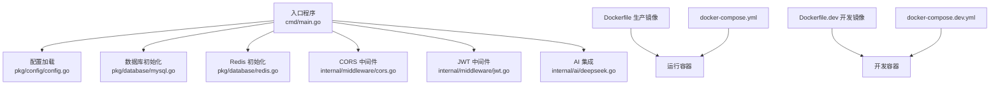
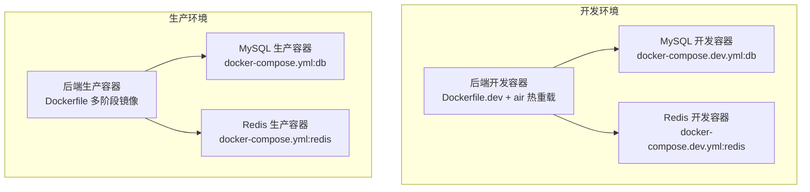
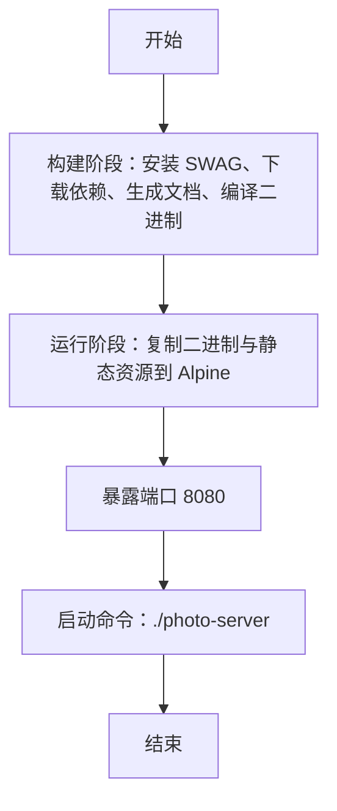
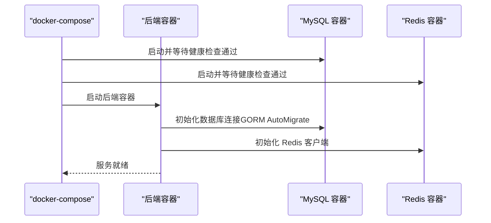
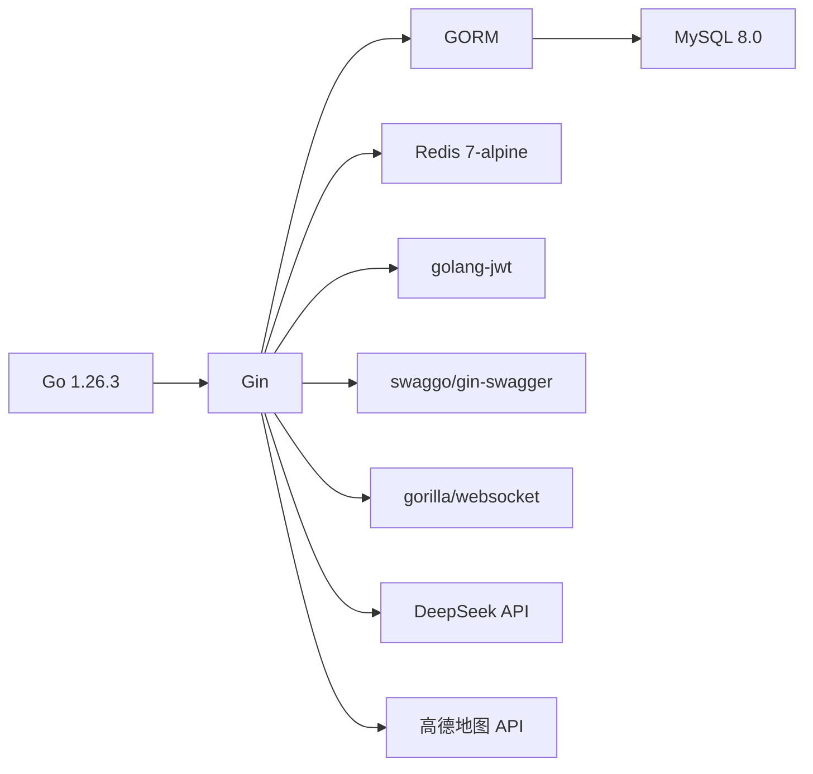

# 部署运维

<cite>
**本文引用的文件**
- [cmd/main.go](file://cmd/main.go)
- [pkg/config/config.go](file://pkg/config/config.go)
- [pkg/database/mysql.go](file://pkg/database/mysql.go)
- [pkg/database/redis.go](file://pkg/database/redis.go)
- [internal/middleware/jwt.go](file://internal/middleware/jwt.go)
- [internal/middleware/cors.go](file://internal/middleware/cors.go)
- [internal/ai/deepseek.go](file://internal/ai/deepseek.go)
- [Dockerfile](file://Dockerfile)
- [Dockerfile.dev](file://Dockerfile.dev)
- [docker-compose.yml](file://docker-compose.yml)
- [docker-compose.dev.yml](file://docker-compose.dev.yml)
- [go.mod](file://go.mod)
- [README.md](file://README.md)
</cite>

## 目录
1. [简介](#简介)
2. [项目结构](#项目结构)
3. [核心组件](#核心组件)
4. [架构总览](#架构总览)
5. [详细组件分析](#详细组件分析)
6. [依赖关系分析](#依赖关系分析)
7. [性能考虑](#性能考虑)
8. [故障排查指南](#故障排查指南)
9. [结论](#结论)
10. [附录](#附录)

## 简介
本文件面向部署与运维团队，系统性说明旅行服务器项目的容器化与编排部署方案，涵盖镜像构建（含多阶段优化）、docker-compose 服务编排（依赖、网络与数据卷）、开发与生产环境差异策略、Kubernetes 部署思路与云平台落地建议、监控与日志收集、性能优化与资源管理、备份恢复与灾备计划，以及故障排查与运维最佳实践。

## 项目结构
该仓库采用“入口程序 + 分层模块”的组织方式：
- 入口与路由：cmd/main.go
- 配置加载：pkg/config/config.go
- 数据库与缓存：pkg/database/mysql.go、pkg/database/redis.go
- 中间件：internal/middleware/cors.go、internal/middleware/jwt.go
- AI 服务集成：internal/ai/deepseek.go
- 容器化与编排：Dockerfile、Dockerfile.dev、docker-compose.yml、docker-compose.dev.yml
- 依赖声明：go.mod

图表来源
- [cmd/main.go:1-152](file://cmd/main.go#L1-L152)
- [pkg/config/config.go:1-129](file://pkg/config/config.go#L1-L129)
- [pkg/database/mysql.go:1-91](file://pkg/database/mysql.go#L1-L91)
- [pkg/database/redis.go:1-32](file://pkg/database/redis.go#L1-L32)
- [internal/middleware/cors.go:1-23](file://internal/middleware/cors.go#L1-L23)
- [internal/middleware/jwt.go:1-123](file://internal/middleware/jwt.go#L1-L123)
- [internal/ai/deepseek.go:1-53](file://internal/ai/deepseek.go#L1-L53)
- [Dockerfile:1-29](file://Dockerfile#L1-L29)
- [Dockerfile.dev:1-17](file://Dockerfile.dev#L1-L17)
- [docker-compose.yml:1-59](file://docker-compose.yml#L1-L59)
- [docker-compose.dev.yml:1-59](file://docker-compose.dev.yml#L1-L59)

章节来源
- [README.md:39-87](file://README.md#L39-L87)
- [go.mod:1-67](file://go.mod#L1-L67)

## 核心组件
- 配置系统：集中从环境变量加载数据库、Redis、服务端口、第三方密钥等配置，支持开发/生产环境切换。
- 数据库与缓存：GORM 初始化 MySQL 并自动迁移；Redis 客户端初始化；均通过配置驱动。
- 中间件：全局 CORS 与 JWT 认证，分别用于跨域与鉴权。
- AI 集成：调用 DeepSeek Chat API 生成智能行程，依赖配置中的 API Key。
- 容器化：生产镜像采用多阶段构建，仅拷贝二进制与静态资源；开发镜像启用热重载与 SWAG 文档生成。

章节来源
- [pkg/config/config.go:60-100](file://pkg/config/config.go#L60-L100)
- [pkg/database/mysql.go:19-91](file://pkg/database/mysql.go#L19-L91)
- [pkg/database/redis.go:15-32](file://pkg/database/redis.go#L15-L32)
- [internal/middleware/cors.go:10-22](file://internal/middleware/cors.go#L10-L22)
- [internal/middleware/jwt.go:48-122](file://internal/middleware/jwt.go#L48-L122)
- [internal/ai/deepseek.go:18-52](file://internal/ai/deepseek.go#L18-L52)
- [Dockerfile:1-29](file://Dockerfile#L1-L29)
- [Dockerfile.dev:1-17](file://Dockerfile.dev#L1-L17)

## 架构总览
下图展示了生产与开发两种部署形态下的容器编排关系、服务依赖与数据持久化要点。

图表来源
- [docker-compose.yml:3-59](file://docker-compose.yml#L3-L59)
- [docker-compose.dev.yml:3-59](file://docker-compose.dev.yml#L3-L59)
- [Dockerfile:1-29](file://Dockerfile#L1-L29)
- [Dockerfile.dev:1-17](file://Dockerfile.dev#L1-L17)

## 详细组件分析

### 容器镜像构建与多阶段优化
- 生产镜像（Dockerfile）
  - 多阶段构建：先以官方 Go 镜像为构建阶段，安装 SWAG 工具、下载依赖、生成 Swagger 文档、编译二进制；再以 Alpine 为基础镜像，仅拷贝二进制与静态资源，最终暴露 8080 端口。
  - 关键点：固定基础镜像版本，避免使用 latest；仅复制必要文件，减小镜像体积与攻击面。
- 开发镜像（Dockerfile.dev）
  - 安装 air 热重载与 SWAG 工具；复制源码并在容器内执行 swag init 与 air 启动，便于本地开发迭代。
- 运行参数
  - 生产容器 CMD 指向编译产物；开发容器 CMD 启动 air 热重载。

图表来源
- [Dockerfile:1-29](file://Dockerfile#L1-L29)
- [Dockerfile.dev:1-17](file://Dockerfile.dev#L1-L17)

章节来源
- [Dockerfile:1-29](file://Dockerfile#L1-L29)
- [Dockerfile.dev:1-17](file://Dockerfile.dev#L1-L17)

### docker-compose 编排配置
- 服务定义
  - db：MySQL 8.0，健康检查基于 ping；端口映射 3307:3306；持久化卷 mysql_data；挂载证书目录。
  - redis：Redis 7-alpine，健康检查基于 ping；端口映射 6379:6379；持久化卷 redis_data。
  - backend：后端服务，生产镜像或开发镜像，端口映射 8082:8080（生产）与 2346:2345（调试），依赖 db 与 redis 健康。
- 数据卷
  - mysql_data、redis_data 为具名卷，保证数据持久化。
- 环境文件
  - 生产使用 .env.prod，开发使用 .env.dev，分别注入数据库、Redis、第三方密钥等配置。
- 网络与依赖
  - 通过 depends_on + healthcheck 确保后端在数据库与缓存就绪后再启动，降低冷启动失败率。

图表来源
- [docker-compose.yml:35-53](file://docker-compose.yml#L35-L53)
- [pkg/database/mysql.go:19-63](file://pkg/database/mysql.go#L19-L63)
- [pkg/database/redis.go:15-31](file://pkg/database/redis.go#L15-L31)

章节来源
- [docker-compose.yml:1-59](file://docker-compose.yml#L1-L59)
- [docker-compose.dev.yml:1-59](file://docker-compose.dev.yml#L1-L59)

### 开发与生产环境差异策略
- 环境变量
  - 生产：.env.prod；开发：.env.dev；两者均通过 pkg/config/LoadConfig 读取并注入全局配置。
- 镜像与启动
  - 生产：Dockerfile，固定基础镜像版本，仅运行编译产物。
  - 开发：Dockerfile.dev，air 热重载 + SWAG 文档生成，便于本地快速迭代。
- 端口映射
  - 生产：8082:8080（HTTP），2346:2345（调试/远程调试端口）。
  - 开发：同上，便于本地联调。
- 健康检查
  - db 使用 mysqladmin ping；redis 使用 redis-cli ping，确保依赖可用。

章节来源
- [pkg/config/config.go:60-100](file://pkg/config/config.go#L60-L100)
- [docker-compose.yml:44-53](file://docker-compose.yml#L44-L53)
- [docker-compose.dev.yml:44-53](file://docker-compose.dev.yml#L44-L53)

### Kubernetes 部署配置示例与云平台部署指南
说明
- 以下为概念性指导，不对应具体 YAML 文件，请结合实际云平台进行落地。
- 建议使用 Deployment 管理后端 Pod，Service 暴露 8080 端口；StatefulSet 管理 MySQL，Service 管理 Redis。
- Secret 管理数据库凭据、Redis 密码、第三方 API Key（如 DeepSeek、高德地图）。
- ConfigMap 管理非敏感配置（如 SERVER_PORT、SNOWFLAKE_MACHINE_ID、ENV）。
- 健康检查：LivenessProbe/ReadinessProbe 可参考 docker-compose 的健康检查策略。
- 持久化：MySQL 使用 PVC；Redis 可使用 Redis Operator 或 StatefulSet + PVC。
- Ingress/ALB：对外暴露服务，开启 TLS。
- 日志与监控：采集 stdout/stderr，结合 Prometheus/Grafana 与日志聚合平台。

[本节为概念性说明，不直接分析具体文件，故无章节来源]

### 监控与日志收集方案
- 应用日志
  - 后端标准输出即应用日志；建议在容器编排中统一采集并写入日志平台。
- 数据库日志
  - MySQL：可通过卷挂载或专用日志采集器收集慢查询与错误日志。
  - Redis：通过容器日志与指标采集器收集运行指标。
- 系统监控
  - CPU/内存/磁盘/网络：Prometheus + Grafana；结合云平台监控能力。
  - 业务指标：在关键接口埋点，上报至指标平台。

[本节为通用指导，不直接分析具体文件，故无章节来源]

### 性能优化与资源管理策略
- 镜像与运行时
  - 固定基础镜像版本，减少不可控变更；多阶段构建最小化镜像体积。
- 连接与缓存
  - GORM 连接池与超时配置；Redis 连接池与超时配置；合理设置重试与熔断。
- 并发与协程
  - WebSocket 房间管理与消息广播需注意并发安全与内存占用。
- 第三方服务
  - AI 与地图 API 请求增加超时与重试策略，避免阻塞主流程。

[本节为通用指导，不直接分析具体文件，故无章节来源]

### 备份恢复与灾难恢复计划
- 数据备份
  - MySQL：定时快照或逻辑备份；保留多个时间点的备份。
  - Redis：RDB/AOF 或集群快照；确保持久化策略正确。
- 恢复演练
  - 定期进行恢复演练，验证备份完整性与恢复时效。
- 灾难恢复
  - 多可用区/多副本部署；跨区域备份与异地容灾；明确 RTO/RPO 指标。

[本节为通用指导，不直接分析具体文件，故无章节来源]

### 故障排查与运维最佳实践
- 启动失败
  - 检查数据库与 Redis 健康检查是否通过；确认 .env 文件配置正确。
- 连接异常
  - 核对 DB_HOST/DB_PORT/DB_USER/DB_PASSWORD 与 REDIS_* 配置；确认网络连通性。
- JWT 与权限
  - 确认 Authorization 头格式与签名密钥一致；检查后台用户状态。
- AI 与地图 API
  - 校验 DeepSeek API Key 与网络可达性；检查请求超时与重试策略。
- 日志定位
  - 通过 docker-compose logs -f 定位后端日志；结合数据库与 Redis 日志交叉分析。

章节来源
- [pkg/config/config.go:60-100](file://pkg/config/config.go#L60-L100)
- [pkg/database/mysql.go:25-37](file://pkg/database/mysql.go#L25-L37)
- [pkg/database/redis.go:23-31](file://pkg/database/redis.go#L23-L31)
- [internal/middleware/jwt.go:48-122](file://internal/middleware/jwt.go#L48-L122)
- [internal/ai/deepseek.go:28-52](file://internal/ai/deepseek.go#L28-L52)

## 依赖关系分析
- 语言与框架
  - Go 1.26.3；Web 框架 Gin；ORM GORM；Redis 客户端 go-redis；JWT golang-jwt；WebSocket gorilla/websocket；Swagger swaggo/gin-swagger。
- 运行时依赖
  - MySQL 8.0；Redis 7-alpine；第三方服务：DeepSeek、高德地图。
- 服务依赖链
  - 后端启动 → 初始化配置 → 连接数据库（GORM AutoMigrate）→ 连接 Redis → 注册路由与中间件 → 启动 HTTP 服务。

图表来源
- [go.mod:5-16](file://go.mod#L5-L16)
- [pkg/database/mysql.go:19-63](file://pkg/database/mysql.go#L19-L63)
- [pkg/database/redis.go:15-31](file://pkg/database/redis.go#L15-L31)
- [internal/middleware/jwt.go:48-122](file://internal/middleware/jwt.go#L48-L122)
- [internal/ai/deepseek.go:28-52](file://internal/ai/deepseek.go#L28-L52)

章节来源
- [go.mod:1-67](file://go.mod#L1-L67)

## 性能考虑
- 镜像体积与启动速度：多阶段构建 + 固定基础镜像版本，减少启动时间与资源占用。
- 数据库连接：GORM 默认配置外，建议结合业务场景调整连接池大小与超时；AutoMigrate 在启动阶段执行，建议在生产环境预迁移以缩短启动时间。
- Redis 连接：统一连接池配置与超时；对热点键进行缓存预热。
- WebSocket：房间管理与广播需关注内存与并发；必要时引入限流与心跳机制。
- 第三方 API：为 DeepSeek 与地图 API 设置合理的超时与重试；对响应做缓存与降级。

[本节为通用指导，不直接分析具体文件，故无章节来源]

## 故障排查指南
- 启动阶段
  - 数据库连接失败：检查 DB_HOST/DB_PORT/DB_USER/DB_PASSWORD/DB_NAME；查看 GORM 连接重试日志。
  - Redis 连接失败：检查 REDIS_HOST/REDIS_PORT/REDIS_PASSWORD/REDIS_DB；确认 Redis 健康检查。
- 运行阶段
  - JWT 无效：确认 Authorization 头格式与签名密钥；检查后台用户状态。
  - AI 请求失败：校验 DeepSeek API Key；检查网络连通性与超时设置。
- 日志定位
  - 使用 docker-compose logs -f backend 查看后端日志；结合数据库与 Redis 日志交叉分析。

章节来源
- [pkg/database/mysql.go:25-37](file://pkg/database/mysql.go#L25-L37)
- [pkg/database/redis.go:23-31](file://pkg/database/redis.go#L23-L31)
- [internal/middleware/jwt.go:48-122](file://internal/middleware/jwt.go#L48-L122)
- [internal/ai/deepseek.go:28-52](file://internal/ai/deepseek.go#L28-L52)

## 结论
本项目提供了完善的容器化与编排方案：生产镜像采用多阶段构建，开发镜像支持热重载与文档生成；docker-compose 明确了服务依赖、健康检查与数据持久化策略。结合云平台与 Kubernetes 的部署思路，可进一步提升弹性与可观测性。建议在生产环境中完善监控与日志体系、强化备份与灾备策略，并持续优化连接池与第三方服务调用的稳定性与性能。

## 附录
- 快速启动（开发）
  - 使用 docker-compose -f docker-compose.dev.yml up -d --build 启动开发环境；通过 docker-compose logs -f backend 实时查看日志。
- 快速启动（生产）
  - 使用 docker-compose up -d 启动生产环境；通过 docker-compose logs -f backend 查看日志。
- Swagger 文档
  - 启动后访问 http://localhost:8080/swagger/index.html。

章节来源
- [README.md:260-318](file://README.md#L260-L318)