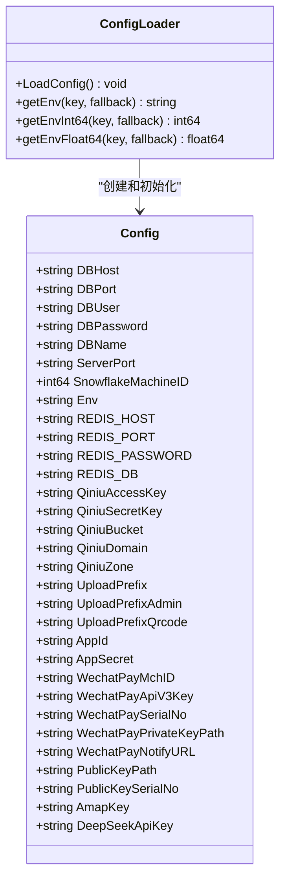
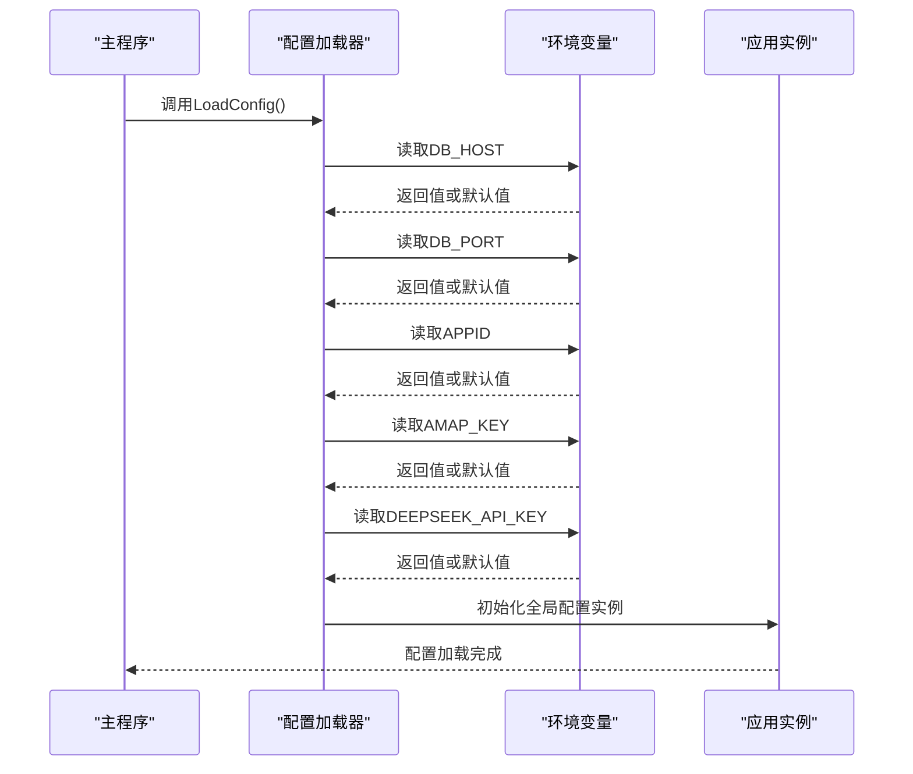
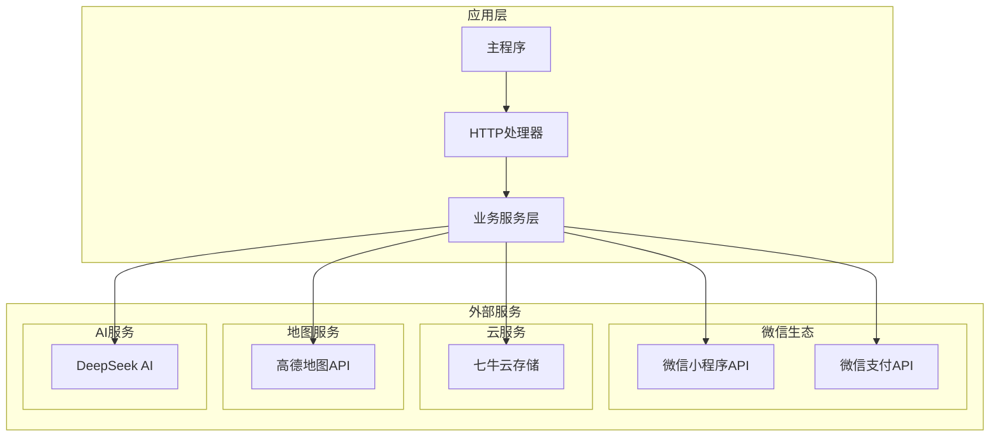
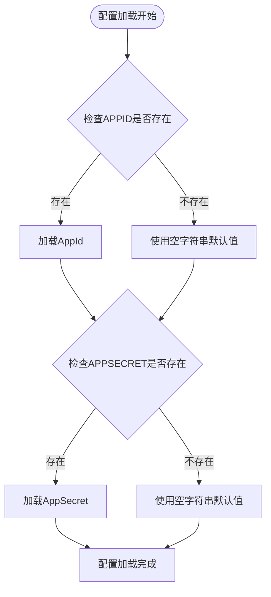
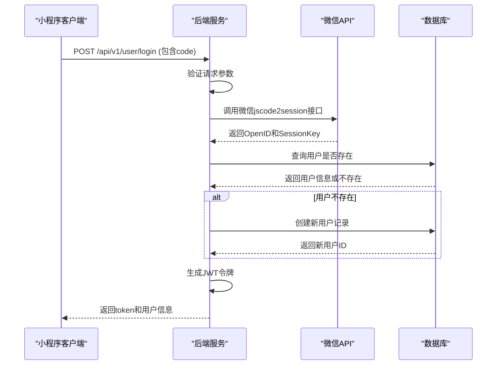
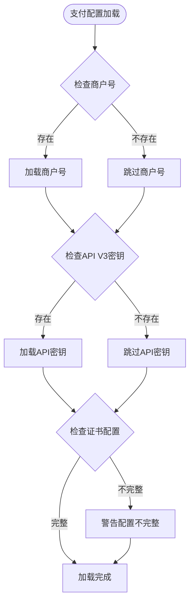
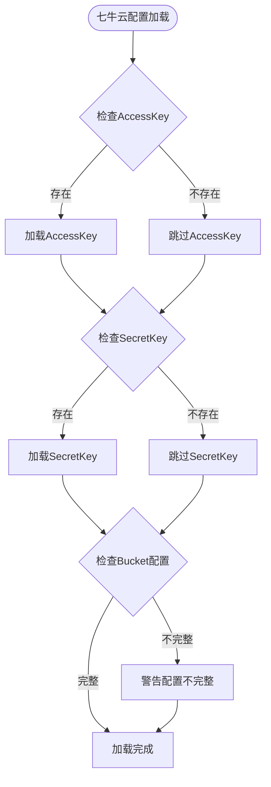
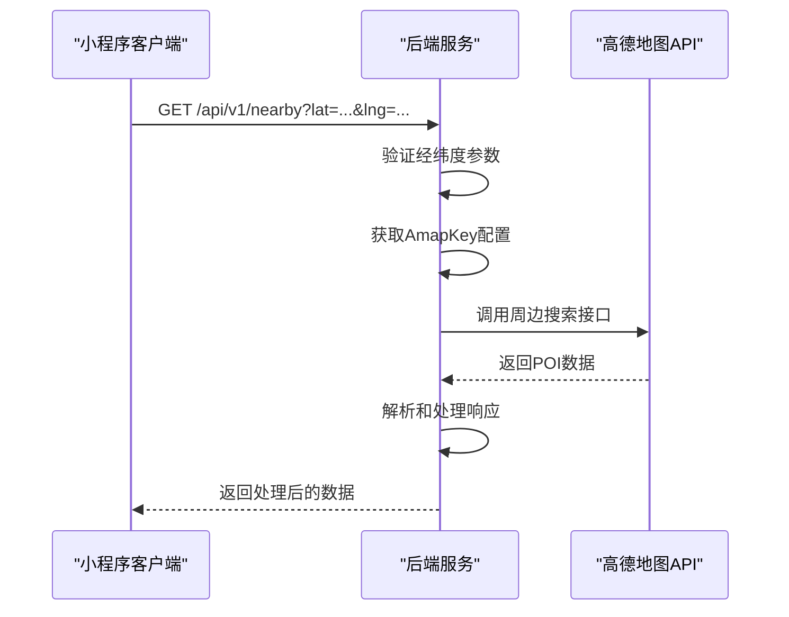
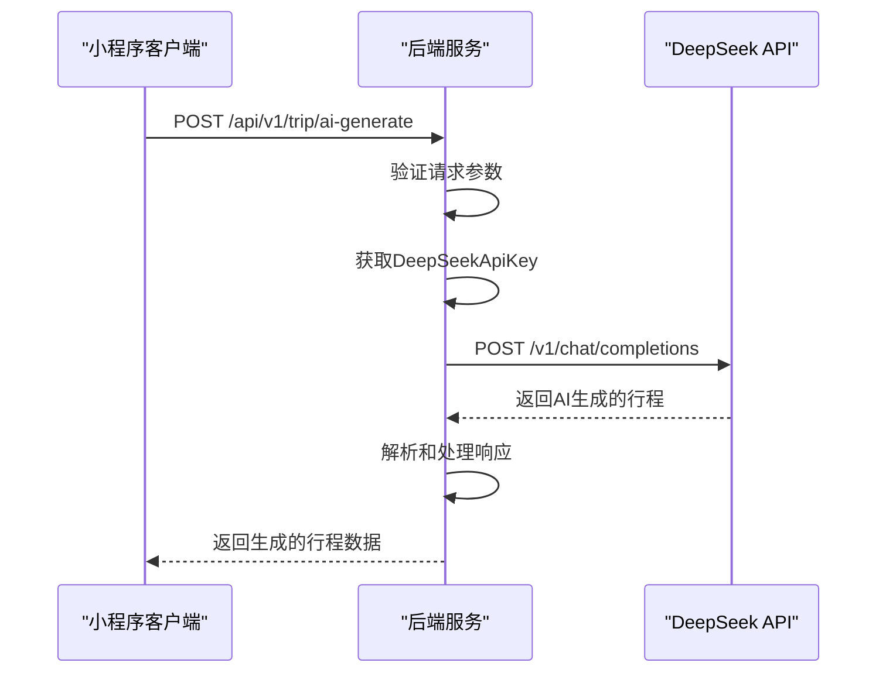
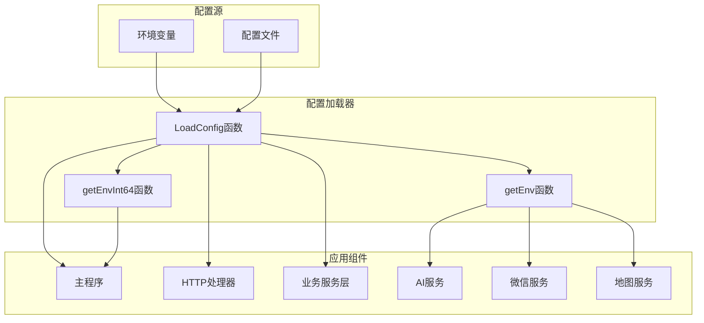

# 外部服务配置

<cite>
**本文档引用的文件**
- [config.go](file://pkg/config/config.go)
- [main.go](file://cmd/main.go)
- [deepseek.go](file://internal/ai/deepseek.go)
- [user.go](file://internal/handler/miniapp/user.go)
- [nearby.go](file://internal/handler/miniapp/nearby.go)
- [accounting.go](file://internal/handler/miniapp/accounting.go)
- [README.md](file://README.md)
- [docker-compose.yml](file://docker-compose.yml)
- [docker-compose.dev.yml](file://docker-compose.dev.yml)
</cite>

## 目录
1. [简介](#简介)
2. [项目结构](#项目结构)
3. [核心组件](#核心组件)
4. [架构概览](#架构概览)
5. [详细组件分析](#详细组件分析)
6. [依赖关系分析](#依赖关系分析)
7. [性能考虑](#性能考虑)
8. [故障排除指南](#故障排除指南)
9. [结论](#结论)

## 简介

本文档详细介绍了旅行搭子小程序后端服务中的外部服务配置，包括微信小程序API配置、微信支付配置、七牛云存储配置、高德地图API配置和DeepSeek AI配置。这些配置通过环境变量进行管理，确保了应用的安全性和灵活性。

项目采用Go语言开发，基于Gin框架构建RESTful API服务，集成了多种第三方服务来提供完整的旅游社交平台功能。

## 项目结构

项目采用模块化的目录结构，主要包含以下关键目录：

```mermaid
graph TB
subgraph "项目根目录"
CMD[cmd/] -- 主程序入口
INTERNAL[internal/] -- 核心业务逻辑
PKG[pkg/] -- 公共包
DOCS[docs/] -- Swagger文档
end
subgraph "内部模块"
AI[ai/] -- AI服务集成
HANDLER[handler/] -- HTTP处理器
MIDDLEWARE[middleware/] -- 中间件
MODEL[model/] -- 数据模型
REPOSITORY[repository/] -- 数据访问层
SERVICE[service/] -- 业务服务层
WS[ws/] -- WebSocket处理
end
subgraph "公共包"
CONFIG[config/] -- 配置管理
DATABASE[database/] -- 数据库连接
RESPONSE[response/] -- 响应处理
end
CMD --> MAIN[main.go]
INTERNAL --> AI
INTERNAL --> HANDLER
INTERNAL --> MIDDLEWARE
INTERNAL --> MODEL
INTERNAL --> REPOSITORY
INTERNAL --> SERVICE
INTERNAL --> WS
PKG --> CONFIG
PKG --> DATABASE
PKG --> RESPONSE
```

**图表来源**
- [main.go:1-152](file://cmd/main.go#L1-L152)
- [config.go:1-129](file://pkg/config/config.go#L1-L129)

**章节来源**
- [main.go:1-152](file://cmd/main.go#L1-L152)
- [config.go:1-129](file://pkg/config/config.go#L1-L129)

## 核心组件

### 配置管理架构

应用使用统一的配置管理机制，通过环境变量加载所有外部服务配置：



**图表来源**
- [config.go:9-55](file://pkg/config/config.go#L9-L55)
- [config.go:60-100](file://pkg/config/config.go#L60-L100)

### 配置加载流程

配置系统采用延迟初始化策略，在应用启动时通过`LoadConfig()`函数加载所有环境变量配置：



**图表来源**
- [config.go:60-100](file://pkg/config/config.go#L60-L100)
- [main.go:31-33](file://cmd/main.go#L31-L33)

**章节来源**
- [config.go:1-129](file://pkg/config/config.go#L1-L129)
- [main.go:31-33](file://cmd/main.go#L31-L33)

## 架构概览

应用的外部服务集成架构如下：



**图表来源**
- [user.go:61-75](file://internal/handler/miniapp/user.go#L61-L75)
- [nearby.go:31-33](file://internal/handler/miniapp/nearby.go#L31-L33)
- [deepseek.go:28-30](file://internal/ai/deepseek.go#L28-L30)

## 详细组件分析

### 微信小程序API配置

微信小程序API配置用于实现用户登录认证和会话管理功能。

#### 配置参数说明

| 参数名称 | 环境变量 | 必填 | 默认值 | 说明 |
|---------|----------|------|--------|------|
| AppId | APPID | 是 | 空字符串 | 微信小程序唯一标识符 |
| AppSecret | APPSECRET | 是 | 空字符串 | 微信小程序密钥 |

#### 配置加载实现



**图表来源**
- [config.go:84-85](file://pkg/config/config.go#L84-L85)
- [config.go:60-97](file://pkg/config/config.go#L60-L97)

#### 登录流程实现

微信小程序登录流程通过临时code换取openid，实现用户身份验证：



**图表来源**
- [user.go:28-51](file://internal/handler/miniapp/user.go#L28-L51)
- [user.go:61-75](file://internal/handler/miniapp/user.go#L61-L75)

**章节来源**
- [config.go:84-85](file://pkg/config/config.go#L84-L85)
- [user.go:28-75](file://internal/handler/miniapp/user.go#L28-L75)

### 微信支付配置

微信支付配置用于处理小程序端的支付功能，包括商户号、API密钥、证书路径等。

#### 配置参数说明

| 参数名称 | 环境变量 | 必填 | 默认值 | 说明 |
|---------|----------|------|--------|------|
| WechatPayMchID | WECHATPAYMCHID | 否 | 空字符串 | 微信支付商户号 |
| WechatPayApiV3Key | WECHATAPIV3 | 否 | 空字符串 | 微信支付API V3密钥 |
| WechatPayPrivateKeyPath | WECHATPAYPRIVATEKEYPATH | 否 | 空字符串 | 私钥文件路径 |
| WechatPaySerialNo | WECHATPAYPRIVATECERT | 否 | 空字符串 | 私钥序列号 |
| PublicKeyPath | PUBLICKEYPATH | 否 | 空字符串 | 公钥文件路径 |
| PublicKeySerialNo | PUBLICKEYSERIALNO | 否 | 空字符串 | 公钥序列号 |
| WechatPayNotifyURL | WECHATPAYNOTIFYURL | 否 | 空字符串 | 支付结果通知URL |

#### 支付配置加载

微信支付配置采用可选加载机制，未配置时不影响其他功能的正常使用：



**图表来源**
- [config.go:87-93](file://pkg/config/config.go#L87-L93)
- [config.go:60-97](file://pkg/config/config.go#L60-L97)

**章节来源**
- [config.go:87-93](file://pkg/config/config.go#L87-L93)

### 七牛云存储配置

七牛云存储配置用于图片和文件的云端存储，支持多前缀配置以区分不同类型的资源。

#### 配置参数说明

| 参数名称 | 环境变量 | 必填 | 默认值 | 说明 |
|---------|----------|------|--------|------|
| QiniuAccessKey | QINIU_ACCESS_KEY | 否 | 空字符串 | 七牛云访问密钥 |
| QiniuSecretKey | QINIU_SECRET_KEY | 否 | 空字符串 | 七牛云私密密钥 |
| QiniuBucket | QINIU_BUCKET | 否 | 空字符串 | 存储空间名称 |
| QiniuDomain | QINIU_DOMAIN | 否 | 空字符串 | 自定义域名 |
| QiniuZone | QINIU_ZONE | 否 | z0 | 存储区域 |
| UploadPrefix | UPLOAD_PREFIX | 否 | 空字符串 | 通用上传前缀 |
| UploadPrefixAdmin | UPLOAD_PREFIX_ADMIN | 否 | 空字符串 | 管理端上传前缀 |
| UploadPrefixQrcode | UPLOAD_PREFIX_QRCODE | 否 | 空字符串 | 二维码上传前缀 |

#### 存储配置加载

七牛云配置同样采用可选加载机制，支持灵活的存储策略配置：



**图表来源**
- [config.go:75-82](file://pkg/config/config.go#L75-L82)
- [config.go:60-97](file://pkg/config/config.go#L60-L97)

**章节来源**
- [config.go:75-82](file://pkg/config/config.go#L75-L82)

### 高德地图API配置

高德地图API配置用于提供周边推荐、位置搜索等地理信息服务。

#### 配置参数说明

| 参数名称 | 环境变量 | 必填 | 默认值 | 说明 |
|---------|----------|------|--------|------|
| AmapKey | AMAP_KEY | 否 | 空字符串 | 高德地图Web API Key |

#### API调用实现

高德地图API通过简单的GET请求调用，支持周边搜索和POI查询：



**图表来源**
- [nearby.go:24-43](file://internal/handler/miniapp/nearby.go#L24-L43)
- [config.go:95](file://pkg/config/config.go#L95)

**章节来源**
- [config.go:95](file://pkg/config/config.go#L95)
- [nearby.go:24-43](file://internal/handler/miniapp/nearby.go#L24-L43)

### DeepSeek AI配置

DeepSeek AI配置用于集成大语言模型服务，提供智能行程生成等功能。

#### 配置参数说明

| 参数名称 | 环境变量 | 必填 | 默认值 | 说明 |
|---------|----------|------|--------|------|
| DeepSeekApiKey | DEEPSEEK_API_KEY | 否 | 空字符串 | DeepSeek API Key |

#### AI服务集成

DeepSeek AI服务通过标准的HTTP请求与外部API交互：



**图表来源**
- [deepseek.go:18-52](file://internal/ai/deepseek.go#L18-L52)
- [config.go:96](file://pkg/config/config.go#L96)

**章节来源**
- [config.go:96](file://pkg/config/config.go#L96)
- [deepseek.go:18-52](file://internal/ai/deepseek.go#L18-L52)

## 依赖关系分析

### 配置依赖图



**图表来源**
- [config.go:60-100](file://pkg/config/config.go#L60-L100)
- [main.go:31-33](file://cmd/main.go#L31-L33)

### 组件耦合分析

系统采用松耦合设计，各外部服务通过配置注入的方式集成：

| 组件 | 依赖关系 | 耦合程度 | 备注 |
|------|----------|----------|------|
| 配置加载器 | 环境变量 | 低 | 仅依赖系统环境 |
| HTTP处理器 | 配置加载器 | 低 | 通过全局配置访问 |
| 业务服务层 | HTTP处理器 | 低 | 通过接口抽象解耦 |
| 微信服务 | 配置加载器 | 低 | 可选配置，不影响核心功能 |
| 地图服务 | 配置加载器 | 低 | 可选配置，不影响核心功能 |
| AI服务 | 配置加载器 | 低 | 可选配置，不影响核心功能 |

**章节来源**
- [config.go:60-100](file://pkg/config/config.go#L60-L100)
- [main.go:31-33](file://cmd/main.go#L31-L33)

## 性能考虑

### 配置加载优化

1. **延迟初始化**: 配置在应用启动时一次性加载，避免重复IO操作
2. **缓存机制**: 全局配置实例避免重复解析环境变量
3. **可选配置**: 外部服务配置采用可选加载，不影响核心功能性能

### 外部服务调用优化

1. **连接池**: 数据库和Redis连接采用连接池管理
2. **超时控制**: 外部API调用设置合理的超时时间
3. **错误重试**: 关键操作实现指数退避重试机制

## 故障排除指南

### 常见配置问题

#### 微信小程序配置问题

**问题**: 微信登录失败
**可能原因**:
- AppId或AppSecret配置错误
- 网络连接异常
- 微信API接口限制

**解决方案**:
1. 验证微信小程序后台配置与环境变量一致
2. 检查网络连通性和防火墙设置
3. 查看微信API返回的错误码和错误信息

#### 外部服务配置问题

**问题**: 高德地图API调用失败
**可能原因**:
- AmapKey配置错误或过期
- 请求频率超过限制
- 网络连接问题

**解决方案**:
1. 在高德开放平台验证API Key状态
2. 检查请求频率是否超出免费额度
3. 验证网络连接和代理设置

#### AI服务配置问题

**问题**: DeepSeek API调用失败
**可能原因**:
- DEEPSEEK_API_KEY配置错误
- API配额不足
- 网络连接异常

**解决方案**:
1. 在DeepSeek平台验证API Key有效性
2. 检查账户余额和配额使用情况
3. 验证网络连接和DNS解析

### 配置验证方法

1. **环境变量检查**: 使用`echo $环境变量名`验证配置正确性
2. **服务健康检查**: 通过Docker健康检查确认服务状态
3. **API测试**: 使用curl命令测试外部API接口

**章节来源**
- [config.go:102-118](file://pkg/config/config.go#L102-L118)

## 结论

本项目的外部服务配置系统采用了现代化的环境变量管理模式，具有以下特点：

1. **安全性**: 敏感配置通过环境变量管理，避免硬编码在代码中
2. **灵活性**: 支持可选配置，可根据需要启用特定功能
3. **可维护性**: 统一的配置加载机制简化了部署和维护工作
4. **可扩展性**: 新增外部服务时只需扩展配置结构和加载逻辑

建议在生产环境中：
- 使用专门的密钥管理服务存储敏感配置
- 实现配置变更的审计和回滚机制
- 建立完善的监控和告警系统
- 定期审查和更新外部服务的配置和凭据

通过合理的设计和最佳实践，该配置系统能够满足旅行搭子小程序后端服务对多种外部服务的集成需求，为用户提供稳定可靠的服务体验。