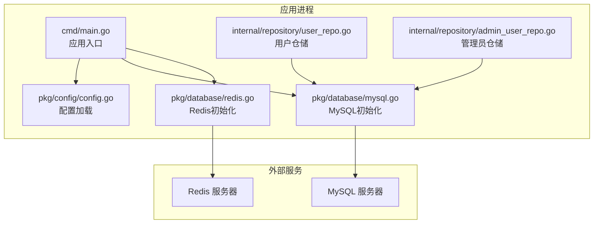
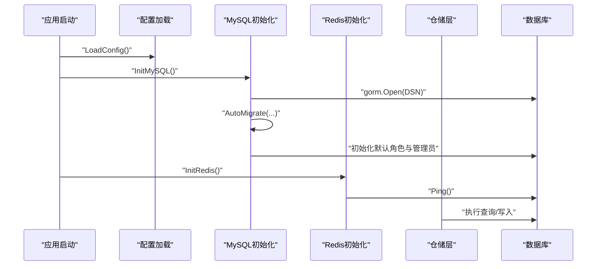
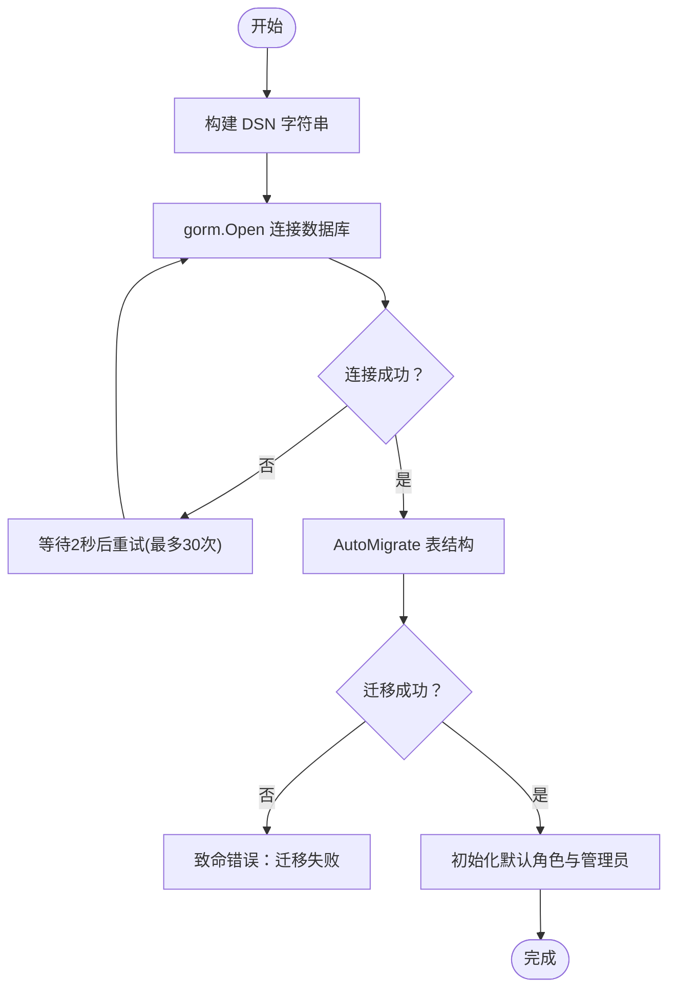
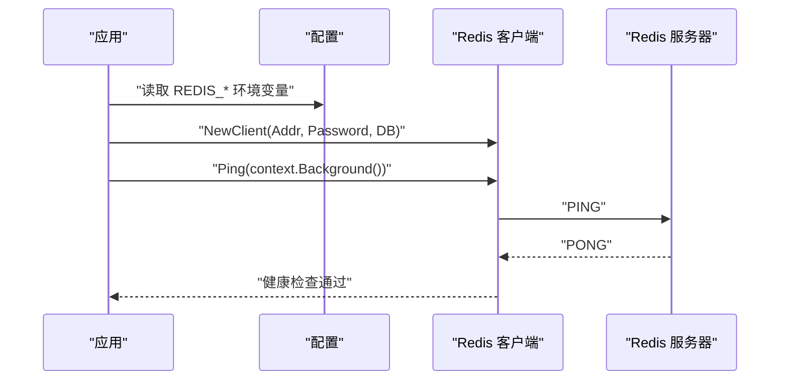
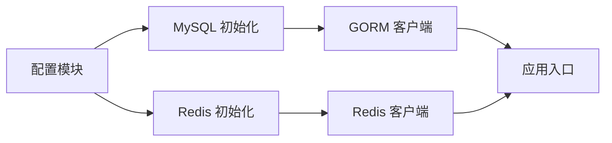

# 数据库配置

<cite>
**本文引用的文件**
- [cmd/main.go](file://cmd/main.go)
- [pkg/config/config.go](file://pkg/config/config.go)
- [pkg/database/mysql.go](file://pkg/database/mysql.go)
- [pkg/database/redis.go](file://pkg/database/redis.go)
- [docker-compose.yml](file://docker-compose.yml)
- [internal/repository/user_repo.go](file://internal/repository/user_repo.go)
- [internal/repository/admin_user_repo.go](file://internal/repository/admin_user_repo.go)
</cite>

## 目录
1. [简介](#简介)
2. [项目结构](#项目结构)
3. [核心组件](#核心组件)
4. [架构总览](#架构总览)
5. [详细组件分析](#详细组件分析)
6. [依赖关系分析](#依赖关系分析)
7. [性能考虑](#性能考虑)
8. [故障排除指南](#故障排除指南)
9. [结论](#结论)
10. [附录](#附录)

## 简介
本文件系统性梳理旅行社交平台后端的数据库配置与连接管理，重点覆盖：
- MySQL 连接参数、DSN 构造、连接池行为与健康检查
- Redis 连接参数、连接池大小与健康检查
- 连接生命周期管理与错误处理机制
- 性能优化建议与常见问题排查

## 项目结构
数据库相关代码主要分布在以下模块：
- 配置加载：从环境变量读取数据库参数
- 数据库初始化：MySQL 和 Redis 的连接建立与健康检查
- 业务仓库：通过全局 GORM 客户端执行数据库操作
- 编排文件：容器编排中定义了数据库健康检查策略

图表来源
- [cmd/main.go:31-37](file://cmd/main.go#L31-L37)
- [pkg/config/config.go:61-100](file://pkg/config/config.go#L61-L100)
- [pkg/database/mysql.go:19-37](file://pkg/database/mysql.go#L19-L37)
- [pkg/database/redis.go:15-31](file://pkg/database/redis.go#L15-L31)
- [internal/repository/user_repo.go:8-21](file://internal/repository/user_repo.go#L8-L21)
- [internal/repository/admin_user_repo.go:8-15](file://internal/repository/admin_user_repo.go#L8-L15)

章节来源
- [cmd/main.go:31-37](file://cmd/main.go#L31-L37)
- [pkg/config/config.go:61-100](file://pkg/config/config.go#L61-L100)

## 核心组件
- 配置结构体：集中定义 MySQL 与 Redis 的环境变量键名及默认值
- MySQL 初始化：构造 DSN、重试连接、自动迁移、默认数据初始化
- Redis 初始化：解析数据库编号、创建客户端、Ping 健康检查
- 仓库层：统一通过全局 GORM 客户端访问数据库

章节来源
- [pkg/config/config.go:9-55](file://pkg/config/config.go#L9-L55)
- [pkg/database/mysql.go:17-90](file://pkg/database/mysql.go#L17-L90)
- [pkg/database/redis.go:13-31](file://pkg/database/redis.go#L13-L31)
- [internal/repository/user_repo.go:8-21](file://internal/repository/user_repo.go#L8-L21)
- [internal/repository/admin_user_repo.go:8-15](file://internal/repository/admin_user_repo.go#L8-L15)

## 架构总览
应用启动时顺序执行：
1) 从环境变量加载配置
2) 初始化 MySQL 连接（含重试与自动迁移）
3) 初始化 Redis 连接（含 Ping 健康检查）
4) 注册路由并运行 HTTP 服务

图表来源
- [cmd/main.go:31-37](file://cmd/main.go#L31-L37)
- [pkg/database/mysql.go:19-37](file://pkg/database/mysql.go#L19-L37)
- [pkg/database/redis.go:15-31](file://pkg/database/redis.go#L15-L31)
- [internal/repository/user_repo.go:8-21](file://internal/repository/user_repo.go#L8-L21)

## 详细组件分析

### MySQL 配置与连接
- 连接参数
  - 主机地址：DB_HOST，默认 127.0.0.1
  - 端口：DB_PORT，默认 3306
  - 用户名：DB_USER，默认 root
  - 密码：DB_PASSWORD，默认 123456
  - 数据库名：DB_NAME，默认 travel
  - 字符集：在 DSN 中显式指定 utf8mb4
  - 时区：在 DSN 中指定 Local
  - 时间解析：在 DSN 中开启 parseTime
- 连接字符串格式
  - 采用标准 DSN 模板：用户名:密码@tcp(主机:端口)/数据库名?charset=...&parseTime=True&loc=Local
- 连接池与超时
  - 当前实现未显式设置连接池参数（最大连接数、空闲连接数、连接生命周期），默认遵循 GORM/驱动默认行为
- 健康检查
  - 应用启动阶段不进行主动健康检查；通过容器编排中的 healthcheck 实现服务级健康探测
- 生命周期管理
  - 应用启动时建立连接，常驻内存；未见显式的连接关闭逻辑
- 错误处理
  - 连接失败会重试最多 30 次，每次间隔 2 秒；全部失败则致命退出
  - 迁移失败直接致命退出
- 默认数据初始化
  - 若角色表为空，则创建“超级管理员”和“内容编辑”角色，并创建默认管理员账号（密码为明文“admin123”，实际存储为哈希）

图表来源
- [pkg/database/mysql.go:20-37](file://pkg/database/mysql.go#L20-L37)
- [pkg/database/mysql.go:39-63](file://pkg/database/mysql.go#L39-L63)
- [pkg/database/mysql.go:64-89](file://pkg/database/mysql.go#L64-L89)

章节来源
- [pkg/config/config.go:61-67](file://pkg/config/config.go#L61-L67)
- [pkg/database/mysql.go:20-23](file://pkg/database/mysql.go#L20-L23)
- [pkg/database/mysql.go:26-37](file://pkg/database/mysql.go#L26-L37)
- [pkg/database/mysql.go:39-63](file://pkg/database/mysql.go#L39-L63)
- [pkg/database/mysql.go:64-89](file://pkg/database/mysql.go#L64-L89)

### Redis 配置与连接
- 连接参数
  - 主机：REDIS_HOST，默认 127.0.0.1
  - 端口：REDIS_PORT，默认 6379
  - 密码：REDIS_PASSWORD，默认空
  - 数据库编号：REDIS_DB，默认 0（字符串转为整数）
- 连接池大小
  - 当前实现未显式设置连接池大小；默认遵循 go-redis 客户端默认行为
- 超时设置
  - 当前实现未显式设置超时；默认使用 go-redis 默认超时
- 健康检查
  - 应用启动阶段通过 Ping(context.Background()) 进行健康检查；失败则致命退出
- 生命周期管理
  - 应用启动时建立连接，常驻内存；未见显式的连接关闭逻辑
- 错误处理
  - Ping 失败直接致命退出

图表来源
- [pkg/config/config.go:70-73](file://pkg/config/config.go#L70-L73)
- [pkg/database/redis.go:15-31](file://pkg/database/redis.go#L15-L31)

章节来源
- [pkg/config/config.go:70-73](file://pkg/config/config.go#L70-L73)
- [pkg/database/redis.go:15-31](file://pkg/database/redis.go#L15-L31)

### 连接字符串与配置示例
- MySQL DSN 示例（基于当前实现的拼接规则）：
  - 用户名:密码@tcp(主机:端口)/数据库名?charset=utf8mb4&parseTime=True&loc=Local
- Redis 连接串示例（基于当前实现的拼接规则）：
  - 地址:端口（如 127.0.0.1:6379），密码可选，DB 可选
- 环境变量参考（默认值来自配置加载）：
  - DB_HOST=127.0.0.1
  - DB_PORT=3306
  - DB_USER=root
  - DB_PASSWORD=123456
  - DB_NAME=travel
  - REDIS_HOST=127.0.0.1
  - REDIS_PORT=6379
  - REDIS_PASSWORD=
  - REDIS_DB=0

章节来源
- [pkg/database/mysql.go:20-23](file://pkg/database/mysql.go#L20-L23)
- [pkg/database/redis.go:23-27](file://pkg/database/redis.go#L23-L27)
- [pkg/config/config.go:61-73](file://pkg/config/config.go#L61-L73)

### 连接生命周期与错误处理机制
- MySQL
  - 启动重试：最多 30 次，间隔 2 秒；全部失败致命退出
  - 迁移失败致命退出
  - 默认数据初始化仅在角色表为空时执行一次
- Redis
  - 启动 Ping 健康检查；失败致命退出
- 业务层使用
  - 仓储层通过全局 GORM 客户端执行 CRUD，未见显式事务或连接池参数设置

章节来源
- [pkg/database/mysql.go:26-37](file://pkg/database/mysql.go#L26-L37)
- [pkg/database/mysql.go:64-89](file://pkg/database/mysql.go#L64-L89)
- [pkg/database/redis.go:28-30](file://pkg/database/redis.go#L28-L30)
- [internal/repository/user_repo.go:8-21](file://internal/repository/user_repo.go#L8-L21)
- [internal/repository/admin_user_repo.go:8-15](file://internal/repository/admin_user_repo.go#L8-L15)

## 依赖关系分析
- 组件耦合
  - 配置模块被数据库初始化模块依赖
  - 数据库初始化模块被应用入口依赖
  - 仓储层依赖全局 GORM 客户端
- 外部依赖
  - MySQL 驱动：gorm.io/driver/mysql
  - ORM：gorm.io/gorm
  - Redis 客户端：github.com/go-redis/redis/v8
- 编排依赖
  - docker-compose.yml 中定义了 MySQL 与 Redis 的健康检查策略，并要求后端服务在数据库健康后再启动

图表来源
- [pkg/config/config.go:61-100](file://pkg/config/config.go#L61-L100)
- [pkg/database/mysql.go:19-37](file://pkg/database/mysql.go#L19-L37)
- [pkg/database/redis.go:15-31](file://pkg/database/redis.go#L15-L31)
- [cmd/main.go:31-37](file://cmd/main.go#L31-L37)

章节来源
- [pkg/config/config.go:61-100](file://pkg/config/config.go#L61-L100)
- [pkg/database/mysql.go:19-37](file://pkg/database/mysql.go#L19-L37)
- [pkg/database/redis.go:15-31](file://pkg/database/redis.go#L15-L31)
- [cmd/main.go:31-37](file://cmd/main.go#L31-L37)

## 性能考虑
- 连接池参数（建议）
  - MySQL：建议显式设置最大连接数、最大空闲连接数、连接生命周期，避免高并发下的连接争用
  - Redis：建议设置连接池大小与超时，避免阻塞导致请求堆积
- 连接复用
  - 当前通过全局 GORM 客户端复用连接，建议在高并发场景下配合连接池参数调优
- 查询优化
  - 仓储层使用 GORM 的预加载与条件查询，建议结合索引与分页策略提升性能
- 健康检查
  - 应用启动阶段仅做一次 Ping；建议在运行期增加周期性健康检查与熔断保护

[本节为通用性能建议，不直接分析具体文件]

## 故障排除指南
- MySQL 连接失败
  - 现象：启动日志出现多次“数据库连接失败(第N次重试)”并最终致命退出
  - 排查要点：
    - 检查 DB_HOST、DB_PORT、DB_USER、DB_PASSWORD、DB_NAME 是否正确
    - 确认数据库服务可达且监听端口开放
    - 如使用容器编排，确认数据库健康检查通过（depends_on: service_healthy）
- Redis 连接失败
  - 现象：启动日志出现“Redis连接失败”并致命退出
  - 排查要点：
    - 检查 REDIS_HOST、REDIS_PORT、REDIS_PASSWORD、REDIS_DB 是否正确
    - 确认 Redis 服务可达且无认证问题
- 迁移失败
  - 现象：启动日志出现“数据库迁移失败”并致命退出
  - 排查要点：
    - 检查模型定义与数据库版本兼容性
    - 确认数据库具备足够权限执行迁移
- 默认数据未初始化
  - 现象：后台角色与默认管理员未创建
  - 排查要点：
    - 确认角色表初始状态为空
    - 检查迁移是否成功执行

章节来源
- [pkg/database/mysql.go:26-37](file://pkg/database/mysql.go#L26-L37)
- [pkg/database/mysql.go:61-63](file://pkg/database/mysql.go#L61-L63)
- [pkg/database/redis.go:28-30](file://pkg/database/redis.go#L28-L30)
- [docker-compose.yml:49-53](file://docker-compose.yml#L49-L53)

## 结论
- 当前实现提供了简洁可靠的数据库连接初始化流程：MySQL 通过 DSN 构建与重试机制、自动迁移与默认数据初始化；Redis 通过 Ping 健康检查确保可用性
- 连接池与超时参数未显式配置，建议在生产环境中补充连接池大小、空闲连接数、连接生命周期与超时设置
- 建议在运行期增加健康检查与熔断保护，提升系统稳定性

[本节为总结性内容，不直接分析具体文件]

## 附录

### 环境变量一览（默认值来自配置加载）
- MySQL
  - DB_HOST：默认 127.0.0.1
  - DB_PORT：默认 3306
  - DB_USER：默认 root
  - DB_PASSWORD：默认 123456
  - DB_NAME：默认 travel
- Redis
  - REDIS_HOST：默认 127.0.0.1
  - REDIS_PORT：默认 6379
  - REDIS_PASSWORD：默认 空
  - REDIS_DB：默认 0

章节来源
- [pkg/config/config.go:61-73](file://pkg/config/config.go#L61-L73)

### 容器编排中的健康检查
- MySQL
  - 健康检查命令：mysqladmin ping -h localhost
  - 超时：10s，重试：5 次
- Redis
  - 健康检查命令：redis-cli ping
  - 间隔：5s，超时：3s，重试：5 次
- 后端服务依赖数据库健康后再启动

章节来源
- [docker-compose.yml:16-19](file://docker-compose.yml#L16-L19)
- [docker-compose.yml:29-33](file://docker-compose.yml#L29-L33)
- [docker-compose.yml:49-53](file://docker-compose.yml#L49-L53)