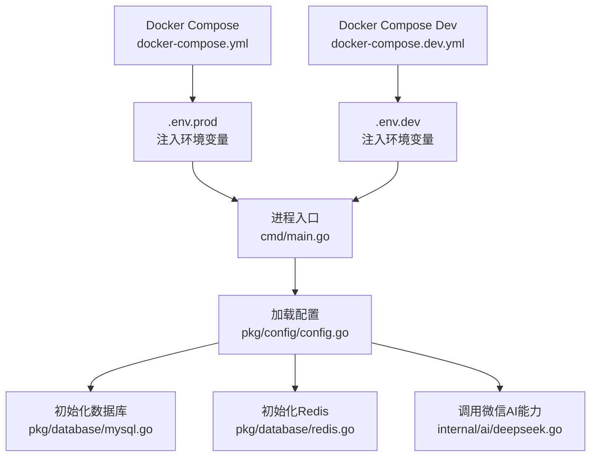
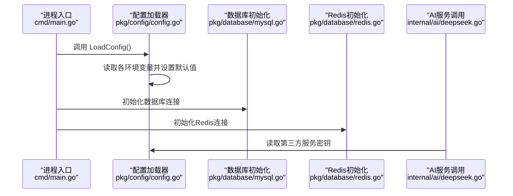
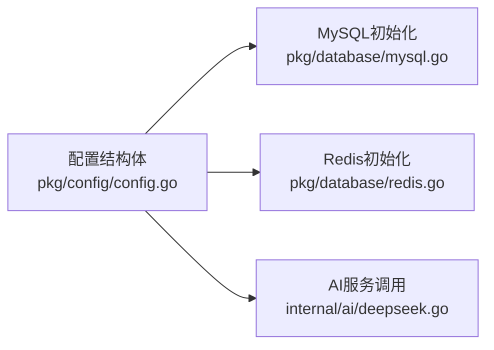
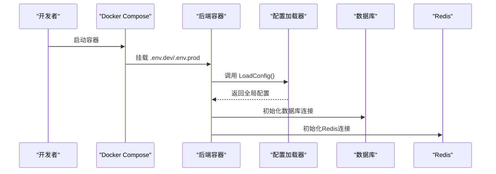

# 环境变量配置

<cite>
**本文引用的文件**
- [pkg/config/config.go](file://pkg/config/config.go)
- [cmd/main.go](file://cmd/main.go)
- [pkg/database/mysql.go](file://pkg/database/mysql.go)
- [pkg/database/redis.go](file://pkg/database/redis.go)
- [internal/ai/deepseek.go](file://internal/ai/deepseek.go)
- [docker-compose.yml](file://docker-compose.yml)
- [docker-compose.dev.yml](file://docker-compose.dev.yml)
- [Dockerfile](file://Dockerfile)
- [Dockerfile.dev](file://Dockerfile.dev)
</cite>

## 目录
1. [简介](#简介)
2. [项目结构](#项目结构)
3. [核心组件](#核心组件)
4. [架构总览](#架构总览)
5. [详细组件分析](#详细组件分析)
6. [依赖关系分析](#依赖关系分析)
7. [性能考虑](#性能考虑)
8. [故障排查指南](#故障排查指南)
9. [结论](#结论)
10. [附录](#附录)

## 简介
本文件系统性梳理项目中使用的全部环境变量，涵盖数据库、服务器、缓存、对象存储、微信小程序、微信支付、第三方服务密钥等模块。文档说明每个变量的作用、默认值、数据类型与配置要点，并提供多环境配置模板与最佳实践建议。

## 项目结构
- 配置加载入口位于 pkg/config/config.go，集中从环境变量读取并赋值全局配置实例。
- 业务模块通过全局配置访问所需参数，如数据库连接、Redis、云存储、微信小程序与支付、AI服务密钥等。
- Docker Compose 在生产与开发环境分别通过 .env 文件注入环境变量；容器内应用通过 pkg/config 读取。

图表来源
- [cmd/main.go:31-37](file://cmd/main.go#L31-L37)
- [pkg/config/config.go:60-100](file://pkg/config/config.go#L60-L100)
- [pkg/database/mysql.go:19-38](file://pkg/database/mysql.go#L19-L38)
- [pkg/database/redis.go:15-31](file://pkg/database/redis.go#L15-L31)
- [internal/ai/deepseek.go:18-30](file://internal/ai/deepseek.go#L18-L30)
- [docker-compose.yml:44](file://docker-compose.yml#L44)
- [docker-compose.dev.yml:44](file://docker-compose.dev.yml#L44)

章节来源
- [cmd/main.go:31-37](file://cmd/main.go#L31-L37)
- [pkg/config/config.go:60-100](file://pkg/config/config.go#L60-L100)
- [docker-compose.yml:44](file://docker-compose.yml#L44)
- [docker-compose.dev.yml:44](file://docker-compose.dev.yml#L44)

## 核心组件
- 配置结构体集中定义了所有支持的环境变量键名与默认值，统一由 LoadConfig() 从环境变量读取并赋值。
- 数据库与缓存模块直接消费全局配置，实现零散分散的配置读取点收敛到一处。
- AI 模块通过配置读取第三方服务密钥，用于外部 API 调用。

章节来源
- [pkg/config/config.go:9-55](file://pkg/config/config.go#L9-L55)
- [pkg/config/config.go:60-100](file://pkg/config/config.go#L60-L100)
- [pkg/database/mysql.go:19-38](file://pkg/database/mysql.go#L19-L38)
- [pkg/database/redis.go:15-31](file://pkg/database/redis.go#L15-L31)
- [internal/ai/deepseek.go:18-30](file://internal/ai/deepseek.go#L18-L30)

## 架构总览
下图展示环境变量在启动流程中的流向与使用位置：

图表来源
- [cmd/main.go:31-37](file://cmd/main.go#L31-L37)
- [pkg/config/config.go:60-100](file://pkg/config/config.go#L60-L100)
- [pkg/database/mysql.go:19-38](file://pkg/database/mysql.go#L19-L38)
- [pkg/database/redis.go:15-31](file://pkg/database/redis.go#L15-L31)
- [internal/ai/deepseek.go:18-30](file://internal/ai/deepseek.go#L18-L30)

## 详细组件分析

### 数据库连接配置
- 变量
  - DB_HOST：数据库主机地址，默认值：127.0.0.1
  - DB_PORT：数据库端口，默认值：3306
  - DB_USER：数据库用户名，默认值：root
  - DB_PASSWORD：数据库密码，默认值：123456
  - DB_NAME：数据库名，默认值：travel
- 作用
  - 组合生成 MySQL DSN，用于建立数据库连接。
- 数据类型
  - DB_HOST/DB_PORT/DB_USER/DB_PASSWORD/DB_NAME：字符串
- 默认值与示例
  - 开发环境示例：DB_HOST=127.0.0.1, DB_PORT=3306, DB_USER=root, DB_PASSWORD=123456, DB_NAME=travel
  - 生产环境示例：DB_HOST=prod-db-host, DB_PORT=3306, DB_USER=travel_app, DB_PASSWORD=secure_password, DB_NAME=travel_prod
- 最佳实践
  - 生产环境务必使用专用账号与强密码，避免使用默认值。
  - 端口与主机应与部署拓扑一致，确保网络连通。
  - 如使用 TLS 或自签名证书，需配合数据库驱动与容器挂载证书路径。

章节来源
- [pkg/config/config.go:62-67](file://pkg/config/config.go#L62-L67)
- [pkg/database/mysql.go:20-23](file://pkg/database/mysql.go#L20-L23)

### 服务器配置
- 变量
  - SERVER_PORT：HTTP 服务监听端口，默认值：8080
  - SNOWFLAKE_MACHINE_ID：雪花算法机器 ID，默认值：1
  - ENV：运行环境标识，默认值：development
- 作用
  - SERVER_PORT 决定服务暴露端口；ENV 控制日志与行为差异；SNOWFLAKE_MACHINE_ID 用于分布式唯一 ID 生成。
- 数据类型
  - SERVER_PORT/ENV：字符串；SNOWFLAKE_MACHINE_ID：整型（int64）
- 默认值与示例
  - 示例：SERVER_PORT=8080, SNOWFLAKE_MACHINE_ID=1, ENV=development
  - 生产示例：SERVER_PORT=8080, SNOWFLAKE_MACHINE_ID=2, ENV=production
- 最佳实践
  - 多实例部署时确保每实例的机器 ID 唯一。
  - 生产环境建议使用 production 并开启更严格的安全与日志策略。

章节来源
- [pkg/config/config.go:68](file://pkg/config/config.go#L68)
- [pkg/config/config.go:98-99](file://pkg/config/config.go#L98-L99)
- [cmd/main.go:149](file://cmd/main.go#L149)
- [Dockerfile:28](file://Dockerfile#L28)

### Redis 配置
- 变量
  - REDIS_HOST：Redis 主机，默认值：127.0.0.1
  - REDIS_PORT：Redis 端口，默认值：6379
  - REDIS_PASSWORD：Redis 密码，默认值：空
  - REDIS_DB：Redis 数据库编号，默认值：0
- 作用
  - 用于建立 Redis 连接，DB 编号会转换为整数。
- 数据类型
  - REDIS_HOST/REDIS_PORT/REDIS_DB：字符串；REDIS_PASSWORD：字符串
- 默认值与示例
  - 示例：REDIS_HOST=127.0.0.1, REDIS_PORT=6379, REDIS_PASSWORD=, REDIS_DB=0
  - 生产示例：REDIS_HOST=redis-prod, REDIS_PORT=6379, REDIS_PASSWORD=your_redis_password, REDIS_DB=1
- 最佳实践
  - 生产环境建议开启密码认证与防火墙限制。
  - REDIS_DB 建议使用数字字符串，确保能被正确解析为整数。

章节来源
- [pkg/config/config.go:70-73](file://pkg/config/config.go#L70-L73)
- [pkg/database/redis.go:17-27](file://pkg/database/redis.go#L17-L27)

### 云存储（七牛云）配置
- 变量
  - QINIU_ACCESS_KEY：访问密钥，默认值：空
  - QINIU_SECRET_KEY：私有密钥，默认值：空
  - QINIU_BUCKET：存储空间名称，默认值：空
  - QINIU_DOMAIN：加速域名，默认值：空
  - QINIU_ZONE：存储区域，默认值：z0
  - UPLOAD_PREFIX：通用上传前缀，默认值：空
  - UPLOAD_PREFIX_ADMIN：后台上传前缀，默认值：空
  - UPLOAD_PREFIX_QRCODE：二维码上传前缀，默认值：空
- 作用
  - 用于对象存储上传与访问控制，前缀用于区分不同业务场景的文件命名空间。
- 数据类型
  - 所有均为字符串
- 默认值与示例
  - 示例：QINIU_ACCESS_KEY=ak, QINIU_SECRET_KEY=sk, QINIU_BUCKET=bucket, QINIU_DOMAIN=example.com, QINIU_ZONE=z0, UPLOAD_PREFIX=, UPLOAD_PREFIX_ADMIN=, UPLOAD_PREFIX_QRCODE=
  - 生产示例：QINIU_ACCESS_KEY=prod_ak, QINIU_SECRET_KEY=prod_sk, QINIU_BUCKET=travel-prod, QINIU_DOMAIN=cdn.example.com, QINIU_ZONE=cn-east-1, UPLOAD_PREFIX=prod/, UPLOAD_PREFIX_ADMIN=admin/, UPLOAD_PREFIX_QRCODE=qrcode/
- 最佳实践
  - 建议为不同业务线设置独立前缀，便于隔离与清理。
  - 区域选择需与 Bucket 设置一致，避免跨区访问异常。

章节来源
- [pkg/config/config.go:75-82](file://pkg/config/config.go#L75-L82)

### 微信小程序配置
- 变量
  - APPID：小程序 AppID，默认值：空
  - APPSECRET：小程序 AppSecret，默认值：空
- 作用
  - 用于小程序登录与相关接口鉴权。
- 数据类型
  - 字符串
- 默认值与示例
  - 示例：APPID=your_app_id, APPSECRET=your_app_secret
- 最佳实践
  - 生产环境务必保密，避免硬编码在客户端或日志中。
  - 建议通过安全渠道下发与轮换密钥。

章节来源
- [pkg/config/config.go:84-85](file://pkg/config/config.go#L84-L85)

### 微信支付配置
- 变量
  - WECHATPAYMCHID：商户号，默认值：空
  - WECHATAPIV3：APIv3 密钥，默认值：空
  - WECHATPAYPRIVATEKEYPATH：商户证书路径，默认值：空
  - WECHATPAYPRIVATECERT：商户证书序列号，默认值：空
  - PUBLICKEYPATH：平台证书路径，默认值：空
  - PUBLICKEYSERIALNO：平台证书序列号，默认值：空
  - WECHATPAYNOTIFYURL：支付回调通知地址，默认值：空
- 作用
  - 用于微信支付统一下单、回调校验与证书管理。
- 数据类型
  - 字符串
- 默认值与示例
  - 示例：WECHATPAYMCHID=1900001xxx, WECHATAPIV3=your_api_v3_key, WECHATPAYPRIVATEKEYPATH=/path/to/apiclient_key.pem, WECHATPAYPRIVATECERT=serial_no, PUBLICKEYPATH=/path/to/platform_cert.pem, PUBLICKEYSERIALNO=platform_serial_no, WECHATPAYNOTIFYURL=https://your.domain/notify
- 最佳实践
  - 商户与平台证书必须与微信平台一致，序列号与路径需准确。
  - 回调地址需支持外网可达与 HTTPS，确保签名验证通过。

章节来源
- [pkg/config/config.go:87-93](file://pkg/config/config.go#L87-L93)

### 第三方服务密钥
- 变量
  - AMAP_KEY：高德地图 Web API Key，默认值：空
  - DEEPSEEK_API_KEY：DeepSeek API Key，默认值：空
- 作用
  - 高德地图用于地理信息服务；DeepSeek 用于智能行程生成。
- 数据类型
  - 字符串
- 默认值与示例
  - 示例：AMAP_KEY=amap_web_api_key, DEEPSEEK_API_KEY=deepseek_api_key
- 最佳实践
  - 两个密钥均需按平台要求申请与续期，避免过期导致功能不可用。
  - 建议为不同环境配置不同密钥，便于灰度与回滚。

章节来源
- [pkg/config/config.go:95-96](file://pkg/config/config.go#L95-L96)
- [internal/ai/deepseek.go:28-29](file://internal/ai/deepseek.go#L28-L29)

## 依赖关系分析
- 配置加载依赖于标准库 os 与 strconv，保证字符串与整型的解析容错。
- 数据库与缓存模块依赖全局配置实例，形成“配置中心”模式，降低耦合。
- AI 模块通过配置读取第三方密钥，实现对外部服务的解耦。

图表来源
- [pkg/config/config.go:9-55](file://pkg/config/config.go#L9-L55)
- [pkg/database/mysql.go:19-38](file://pkg/database/mysql.go#L19-L38)
- [pkg/database/redis.go:15-31](file://pkg/database/redis.go#L15-L31)
- [internal/ai/deepseek.go:18-30](file://internal/ai/deepseek.go#L18-L30)

章节来源
- [pkg/config/config.go:102-118](file://pkg/config/config.go#L102-L118)
- [pkg/database/mysql.go:19-38](file://pkg/database/mysql.go#L19-L38)
- [pkg/database/redis.go:15-31](file://pkg/database/redis.go#L15-L31)
- [internal/ai/deepseek.go:18-30](file://internal/ai/deepseek.go#L18-L30)

## 性能考虑
- 环境变量读取为常量时间操作，对启动性能影响极小。
- 数据库与 Redis 初始化包含重试机制，有助于容器编排初期的依赖就绪。
- 建议在生产环境为数据库与缓存设置合理的超时与连接池参数，以提升并发稳定性。

## 故障排查指南
- 数据库无法连接
  - 检查 DB_HOST/DB_PORT/DB_USER/DB_PASSWORD/DB_NAME 是否正确。
  - 确认容器网络与端口映射，参考 Docker Compose 的端口映射。
- Redis 连接失败
  - 检查 REDIS_HOST/REDIS_PORT/REDIS_PASSWORD/REDIS_DB 是否正确。
  - 确认 Redis 服务健康状态与防火墙策略。
- 微信支付回调失败
  - 检查 WECHATPAYNOTIFYURL 是否可外网访问，HTTPS 是否有效。
  - 确认证书路径与序列号与平台一致。
- AI 功能不可用
  - 检查 DEEPSEEK_API_KEY 是否正确配置，网络是否可达。
- 环境变量未生效
  - 确认 .env.prod/.env.dev 已正确挂载至容器，且键名大小写与配置一致。

章节来源
- [docker-compose.yml:44](file://docker-compose.yml#L44)
- [docker-compose.dev.yml:44](file://docker-compose.dev.yml#L44)
- [pkg/database/mysql.go:27-34](file://pkg/database/mysql.go#L27-L34)
- [pkg/database/redis.go:28-30](file://pkg/database/redis.go#L28-L30)
- [internal/ai/deepseek.go:28-30](file://internal/ai/deepseek.go#L28-L30)

## 结论
本项目通过集中式配置加载与明确的默认值设计，实现了环境变量的统一管理。建议在生产环境中严格区分密钥与敏感参数，结合容器编排与健康检查保障服务稳定可用。

## 附录

### 多环境配置模板
- 开发环境模板（.env.dev）
  - DB_HOST=127.0.0.1
  - DB_PORT=3306
  - DB_USER=root
  - DB_PASSWORD=123456
  - DB_NAME=travel
  - SERVER_PORT=8080
  - REDIS_HOST=127.0.0.1
  - REDIS_PORT=6379
  - REDIS_DB=0
  - ENV=development
  - APPID=your_miniapp_appid
  - APPSECRET=your_miniapp_appsecret
  - AMAP_KEY=your_amap_key
  - DEEPSEEK_API_KEY=your_deepseek_key
- 生产环境模板（.env.prod）
  - DB_HOST=prod-db-host
  - DB_PORT=3306
  - DB_USER=travel_app
  - DB_PASSWORD=secure_db_password
  - DB_NAME=travel_prod
  - SERVER_PORT=8080
  - REDIS_HOST=redis-prod-host
  - REDIS_PORT=6379
  - REDIS_DB=1
  - ENV=production
  - APPID=your_miniapp_appid
  - APPSECRET=your_miniapp_appsecret
  - QINIU_ACCESS_KEY=your_qiniu_ak
  - QINIU_SECRET_KEY=your_qiniu_sk
  - QINIU_BUCKET=your_bucket
  - QINIU_DOMAIN=your_domain
  - QINIU_ZONE=your_zone
  - WECHATPAYMCHID=your_mch_id
  - WECHATAPIV3=your_api_v3_key
  - WECHATPAYPRIVATEKEYPATH=/path/to/apiclient_key.pem
  - WECHATPAYPRIVATECERT=serial_no
  - PUBLICKEYPATH=/path/to/platform_cert.pem
  - PUBLICKEYSERIALNO=platform_serial_no
  - WECHATPAYNOTIFYURL=https://your.domain/notify
  - AMAP_KEY=your_amap_key
  - DEEPSEEK_API_KEY=your_deepseek_key

### 关键流程时序图（启动与配置加载）

图表来源
- [docker-compose.yml:44](file://docker-compose.yml#L44)
- [docker-compose.dev.yml:44](file://docker-compose.dev.yml#L44)
- [cmd/main.go:31-37](file://cmd/main.go#L31-L37)
- [pkg/config/config.go:60-100](file://pkg/config/config.go#L60-L100)
- [pkg/database/mysql.go:19-38](file://pkg/database/mysql.go#L19-L38)
- [pkg/database/redis.go:15-31](file://pkg/database/redis.go#L15-L31)