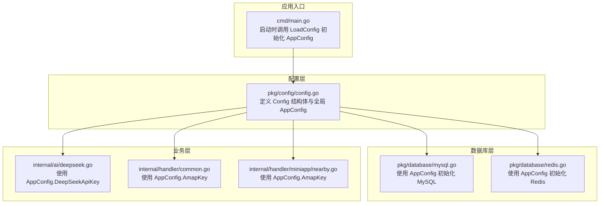
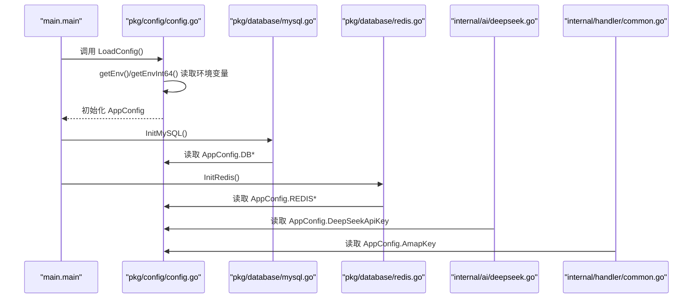
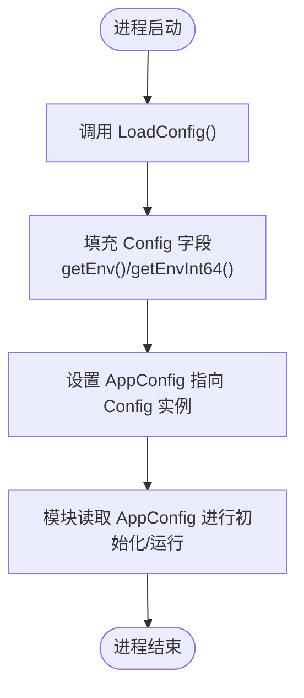
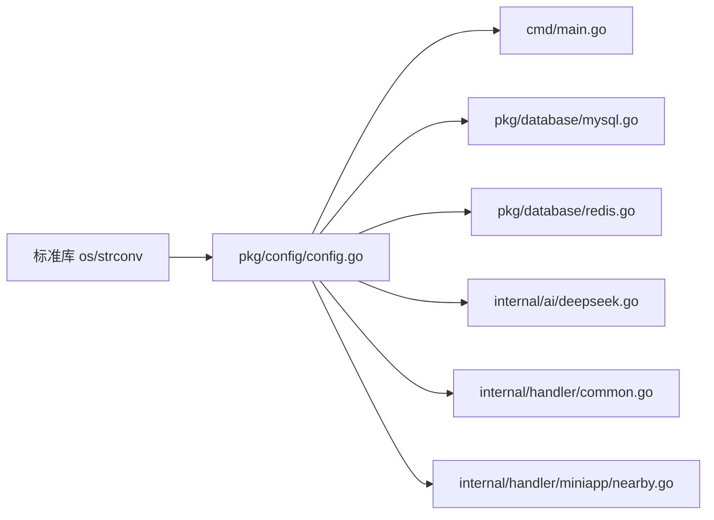

# 配置加载机制

<cite>
**本文档引用的文件**
- [pkg/config/config.go](file://pkg/config/config.go)
- [cmd/main.go](file://cmd/main.go)
- [pkg/database/mysql.go](file://pkg/database/mysql.go)
- [pkg/database/redis.go](file://pkg/database/redis.go)
- [internal/ai/deepseek.go](file://internal/ai/deepseek.go)
- [internal/handler/common.go](file://internal/handler/common.go)
- [internal/handler/miniapp/nearby.go](file://internal/handler/miniapp/nearby.go)
- [go.mod](file://go.mod)
- [README.md](file://README.md)
</cite>

## 目录
1. [简介](#简介)
2. [项目结构](#项目结构)
3. [核心组件](#核心组件)
4. [架构总览](#架构总览)
5. [详细组件分析](#详细组件分析)
6. [依赖分析](#依赖分析)
7. [性能考虑](#性能考虑)
8. [故障排除指南](#故障排除指南)
9. [结论](#结论)
10. [附录](#附录)

## 简介
本文件系统性阐述旅行搭子小程序后端服务的配置加载机制，重点覆盖以下方面：
- 配置加载流程与优先级规则（环境变量读取顺序、默认值处理、类型转换）
- LoadConfig 函数工作原理及 getEnv、getEnvInt64、getEnvFloat64 辅助函数的使用
- 全局配置实例 AppConfig 的初始化过程与生命周期管理
- 配置验证与错误处理机制
- 配置热重载与动态更新的实现方案建议
- 配置调试与故障排除方法

该机制采用“环境变量驱动”的纯配置管理模式，通过全局单例 AppConfig 在应用启动阶段一次性加载，随后在各模块中以只读方式使用。

## 项目结构
配置相关的核心文件与使用分布如下：
- 配置定义与加载：pkg/config/config.go
- 应用入口与初始化：cmd/main.go
- 数据库连接使用配置：pkg/database/mysql.go、pkg/database/redis.go
- 第三方服务使用配置：internal/ai/deepseek.go、internal/handler/common.go、internal/handler/miniapp/nearby.go
- 依赖声明：go.mod
- 快速开始与环境变量模板：README.md

图表来源
- [pkg/config/config.go:57-100](file://pkg/config/config.go#L57-L100)
- [cmd/main.go:31-33](file://cmd/main.go#L31-L33)
- [pkg/database/mysql.go:19-23](file://pkg/database/mysql.go#L19-L23)
- [pkg/database/redis.go:15-27](file://pkg/database/redis.go#L15-L27)
- [internal/ai/deepseek.go:28-29](file://internal/ai/deepseek.go#L28-L29)
- [internal/handler/common.go:30-31](file://internal/handler/common.go#L30-L31)
- [internal/handler/miniapp/nearby.go:30-31](file://internal/handler/miniapp/nearby.go#L30-L31)

章节来源
- [pkg/config/config.go:1-129](file://pkg/config/config.go#L1-L129)
- [cmd/main.go:1-152](file://cmd/main.go#L1-L152)

## 核心组件
- Config 结构体：集中定义所有运行所需配置项，涵盖数据库、服务、缓存、第三方服务密钥等。
- AppConfig 全局实例：在应用启动时初始化，作为唯一可信配置源。
- LoadConfig：从环境变量加载配置，未设置的变量使用默认值。
- getEnv/getEnvInt64/getEnvFloat64：类型安全的环境变量读取工具函数。

章节来源
- [pkg/config/config.go:9-55](file://pkg/config/config.go#L9-L55)
- [pkg/config/config.go:57-100](file://pkg/config/config.go#L57-L100)
- [pkg/config/config.go:102-128](file://pkg/config/config.go#L102-L128)

## 架构总览
配置加载的总体流程：
- 应用启动时，main.main 调用 LoadConfig
- LoadConfig 通过 getEnv/getEnvInt64 读取环境变量并填充 Config
- AppConfig 完成初始化，供后续模块只读使用
- 各模块在运行期仅读取 AppConfig，不写入

图表来源
- [cmd/main.go:31-33](file://cmd/main.go#L31-L33)
- [pkg/config/config.go:60-100](file://pkg/config/config.go#L60-L100)
- [pkg/database/mysql.go:19-23](file://pkg/database/mysql.go#L19-L23)
- [pkg/database/redis.go:15-27](file://pkg/database/redis.go#L15-L27)
- [internal/ai/deepseek.go:28-29](file://internal/ai/deepseek.go#L28-L29)
- [internal/handler/common.go:30-31](file://internal/handler/common.go#L30-L31)

## 详细组件分析

### 配置结构与字段分类
- 数据库配置：DBHost、DBPort、DBUser、DBPassword、DBName
- 服务配置：ServerPort、SnowflakeMachineID、Env
- 缓存配置：REDIS_HOST、REDIS_PORT、REDIS_PASSWORD、REDIS_DB
- 对象存储配置（可选）：QiniuAccessKey、QiniuSecretKey、QiniuBucket、QiniuDomain、QiniuZone、UploadPrefix、UploadPrefixAdmin、UploadPrefixQrcode
- 微信小程序配置：AppId、AppSecret
- 微信支付配置（可选）：WechatPayMchID、WechatPayApiV3Key、WechatPaySerialNo、WechatPayPrivateKeyPath、WechatPayNotifyURL、PublicKeyPath、PublicKeySerialNo
- 第三方服务 Key：AmapKey、DeepSeekApiKey

章节来源
- [pkg/config/config.go:10-55](file://pkg/config/config.go#L10-L55)

### LoadConfig 工作原理
- 初始化 AppConfig 指针指向新的 Config 实例
- 逐项读取环境变量，未设置则回退到内置默认值
- 特殊类型处理：
  - SnowflakeMachineID：通过 getEnvInt64 解析为 int64
  - Env：通过 getEnv 解析为字符串
- 返回后 AppConfig 可在全应用范围内使用

章节来源
- [pkg/config/config.go:60-100](file://pkg/config/config.go#L60-L100)

### 环境变量读取与类型转换
- getEnv(key, fallback string)：返回环境变量值或默认值
- getEnvInt64(key string, fallback int64)：解析为 int64，失败则回退
- getEnvFloat64(key string, fallback float64)：解析为 float64，失败则回退

章节来源
- [pkg/config/config.go:102-128](file://pkg/config/config.go#L102-L128)

### 全局配置实例 AppConfig 的生命周期
- 初始化时机：应用启动时在 main.main 中调用 LoadConfig 完成初始化
- 使用范围：数据库连接初始化、AI 服务调用、HTTP 处理器调用等
- 生命周期：随进程启动而创建，随进程退出而销毁，不进行动态更新

图表来源
- [cmd/main.go:31-33](file://cmd/main.go#L31-L33)
- [pkg/config/config.go:60-100](file://pkg/config/config.go#L60-L100)

章节来源
- [cmd/main.go:31-33](file://cmd/main.go#L31-L33)
- [pkg/config/config.go:57-100](file://pkg/config/config.go#L57-L100)

### 配置验证与错误处理机制
- 环境变量读取层面：
  - getEnvInt64/getEnvFloat64 在解析失败时回退到默认值，避免崩溃
  - Redis DB 数字解析失败时回退为 0
- 运行期错误处理：
  - MySQL 初始化失败时重试多次并最终致命错误退出
  - Redis Ping 失败时直接致命错误退出
- 建议增强点（当前实现未包含）：
  - 在 LoadConfig 中对关键配置进行显式校验（如端口范围、必填项存在性）
  - 对非法类型转换输出警告日志

章节来源
- [pkg/config/config.go:110-128](file://pkg/config/config.go#L110-L128)
- [pkg/database/mysql.go:25-37](file://pkg/database/mysql.go#L25-L37)
- [pkg/database/redis.go:17-30](file://pkg/database/redis.go#L17-L30)

### 配置热重载与动态更新实现方案
当前仓库未实现配置热重载。以下为可行的实现思路（概念性建议，非现有实现）：
- 方案一：信号触发重载
  - 监听 SIGHUP/SIGUSR1 信号
  - 触发时重新执行 LoadConfig，替换 AppConfig 指针
  - 通知数据库/缓存模块进行重建连接
- 方案二：定时轮询
  - 后台 goroutine 定期检查配置文件/环境变量变更
  - 变更时触发重载流程
- 方案三：外部配置中心集成
  - 通过 etcd/Consul/Nacos 等拉取最新配置
  - 提供配置变更回调，按需重建连接
- 注意事项：
  - 保证线程安全：替换 AppConfig 指针时避免竞态
  - 平滑切换：先建立新连接再关闭旧连接
  - 幂等性：重复触发不应产生副作用

[本节为概念性建议，不对应具体源码，故无章节来源]

## 依赖分析
- 配置层依赖：仅依赖标准库 os、strconv
- 应用入口依赖：pkg/config
- 数据库层依赖：pkg/config（读取配置）
- 业务层依赖：pkg/config（读取第三方服务密钥）

图表来源
- [pkg/config/config.go:4-7](file://pkg/config/config.go#L4-L7)
- [cmd/main.go:19](file://cmd/main.go#L19)
- [pkg/database/mysql.go:14](file://pkg/database/mysql.go#L14)
- [pkg/database/redis.go:10](file://pkg/database/redis.go#L10)
- [internal/ai/deepseek.go:10](file://internal/ai/deepseek.go#L10)
- [internal/handler/common.go:15](file://internal/handler/common.go#L15)
- [internal/handler/miniapp/nearby.go:13](file://internal/handler/miniapp/nearby.go#L13)

章节来源
- [go.mod:5-16](file://go.mod#L5-L16)

## 性能考虑
- 环境变量读取成本极低，且 AppConfig 仅初始化一次，对运行时性能影响可忽略
- 类型转换仅发生在启动阶段，不会成为热点路径
- 建议：
  - 避免在热路径中频繁读取环境变量（已在设计上规避）
  - 对于可能频繁使用的配置，可在模块内部缓存一份副本（需谨慎处理并发与一致性）

[本节提供一般性指导，不直接分析具体文件，故无章节来源]

## 故障排除指南
- 症状：数据库连接失败
  - 检查 DB_HOST/DB_PORT/DB_USER/DB_PASSWORD/DB_NAME 是否正确
  - 查看重试日志定位具体错误原因
  - 章节来源
    - [pkg/database/mysql.go:25-37](file://pkg/database/mysql.go#L25-L37)
- 症状：Redis 连接失败
  - 检查 REDIS_HOST/REDIS_PORT/REDIS_PASSWORD/REDIS_DB 是否正确
  - 章节来源
    - [pkg/database/redis.go:17-30](file://pkg/database/redis.go#L17-L30)
- 症状：高德地图/DeepSeek 请求失败
  - 检查 AMAP_KEY/DEEPSEEK_API_KEY 是否正确
  - 章节来源
    - [internal/handler/common.go:30-31](file://internal/handler/common.go#L30-L31)
    - [internal/ai/deepseek.go:28-29](file://internal/ai/deepseek.go#L28-L29)
- 症状：端口不可用
  - 检查 SERVER_PORT 是否被占用
  - 章节来源
    - [cmd/main.go:149-150](file://cmd/main.go#L149-L150)
- 症状：雪花算法机器 ID 异常
  - 检查 SNOWFLAKE_MACHINE_ID 是否为合法整数
  - 章节来源
    - [pkg/config/config.go:98](file://pkg/config/config.go#L98)
- 症状：配置未生效
  - 确认环境变量是否在进程启动前设置
  - 章节来源
    - [README.md:102-125](file://README.md#L102-L125)

## 结论
本项目采用“启动时一次性加载”的配置策略，通过全局单例 AppConfig 提供统一、稳定的配置源。其优势在于简单可靠、易于理解；不足在于缺乏热重载能力。建议在保持现有启动流程不变的前提下，引入信号或定时轮询机制实现配置热重载，并在 LoadConfig 中增加必要的配置校验，以提升健壮性和可观测性。

## 附录
- 环境变量模板与示例
  - 章节来源
    - [README.md:102-125](file://README.md#L102-L125)