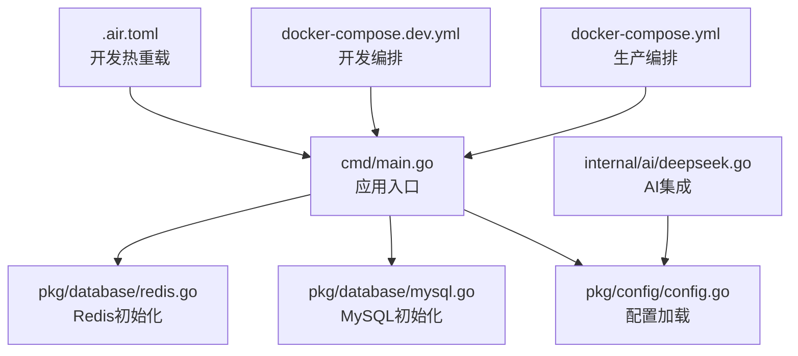
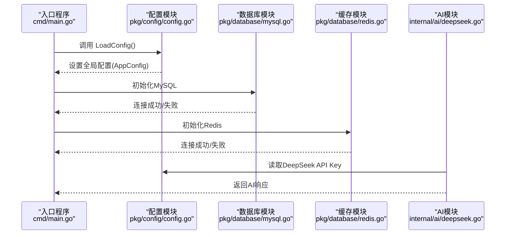
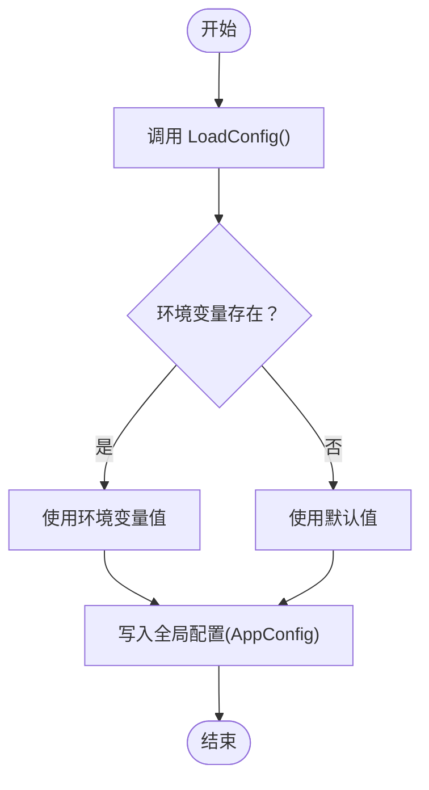
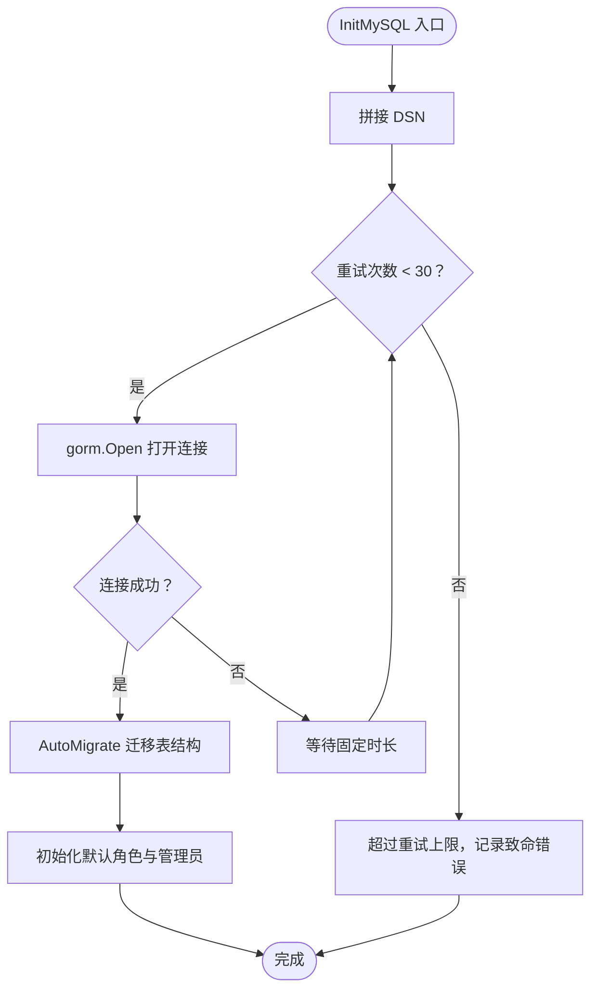
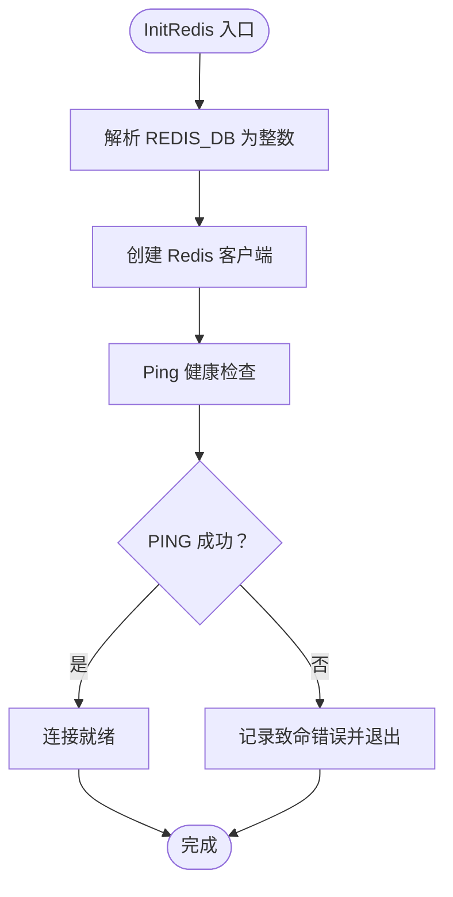
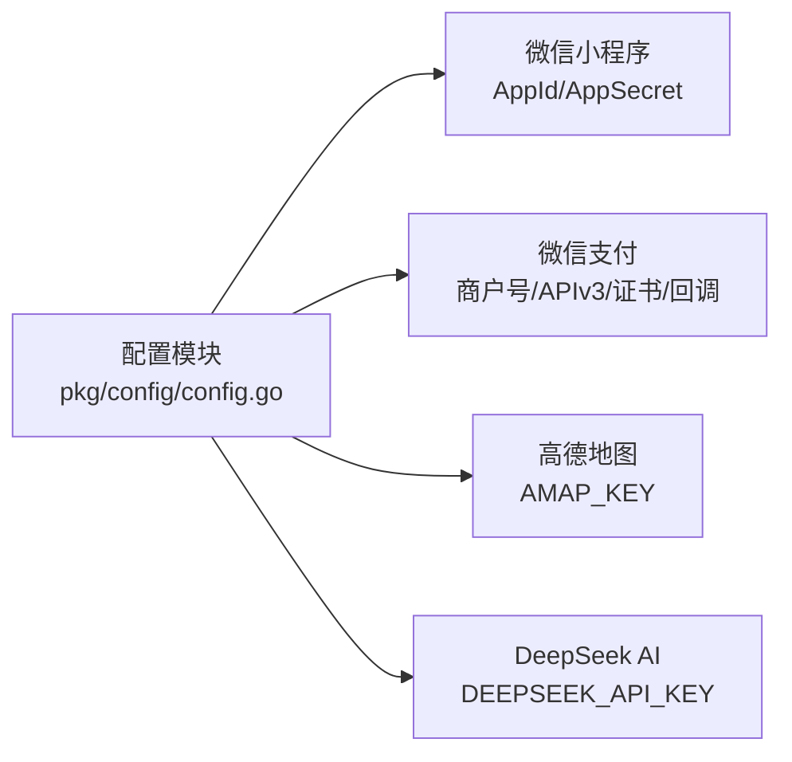
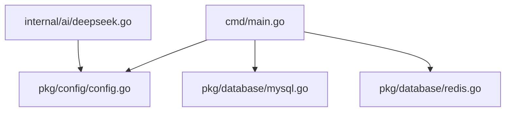

# 配置管理

<cite>
**本文引用的文件**
- [cmd/main.go](file://cmd/main.go)
- [pkg/config/config.go](file://pkg/config/config.go)
- [pkg/database/mysql.go](file://pkg/database/mysql.go)
- [pkg/database/redis.go](file://pkg/database/redis.go)
- [internal/ai/deepseek.go](file://internal/ai/deepseek.go)
- [docker-compose.yml](file://docker-compose.yml)
- [docker-compose.dev.yml](file://docker-compose.dev.yml)
- [.air.toml](file://.air.toml)
- [go.mod](file://go.mod)
</cite>

## 目录
1. [简介](#简介)
2. [项目结构](#项目结构)
3. [核心组件](#核心组件)
4. [架构总览](#架构总览)
5. [详细组件分析](#详细组件分析)
6. [依赖分析](#依赖分析)
7. [性能考虑](#性能考虑)
8. [故障排查指南](#故障排查指南)
9. [结论](#结论)
10. [附录](#附录)

## 简介
本文件系统性梳理旅行服务器项目的配置管理体系，覆盖环境变量、配置文件与运行时配置的加载与优先级；详述数据库（MySQL、Redis）连接参数、连接池与健康检查策略；说明外部服务集成（微信小程序、高德地图、DeepSeek AI）的配置要点；给出开发、测试、生产三类环境的配置示例；并讨论配置安全、敏感信息保护与加密存储建议，以及动态更新与热重载的可行方案。

## 项目结构
项目采用“入口程序 -> 配置模块 -> 数据库模块 -> 业务模块”的分层组织，配置模块集中于 pkg/config，数据库模块位于 pkg/database，入口程序在 cmd/main.go 中完成配置加载与服务初始化。

**图示来源**
- [cmd/main.go:31-37](file://cmd/main.go#L31-L37)
- [pkg/config/config.go:60-100](file://pkg/config/config.go#L60-L100)
- [pkg/database/mysql.go:19-37](file://pkg/database/mysql.go#L19-L37)
- [pkg/database/redis.go:15-31](file://pkg/database/redis.go#L15-L31)
- [internal/ai/deepseek.go:18-30](file://internal/ai/deepseek.go#L18-L30)
- [docker-compose.yml:35-53](file://docker-compose.yml#L35-L53)
- [docker-compose.dev.yml:35-53](file://docker-compose.dev.yml#L35-L53)
- [.air.toml:1-15](file://.air.toml#L1-L15)

**章节来源**
- [cmd/main.go:31-37](file://cmd/main.go#L31-L37)
- [pkg/config/config.go:60-100](file://pkg/config/config.go#L60-L100)
- [docker-compose.yml:35-53](file://docker-compose.yml#L35-L53)
- [docker-compose.dev.yml:35-53](file://docker-compose.dev.yml#L35-L53)
- [.air.toml:1-15](file://.air.toml#L1-L15)

## 核心组件
- 配置结构体：集中定义数据库、服务、缓存、对象存储、微信小程序与支付、第三方服务密钥等配置字段。
- 配置加载器：从环境变量读取配置，缺失时使用默认值；支持字符串与整型解析。
- 数据库初始化：MySQL通过 DSN 构造并重试连接；Redis通过选项构造并执行 PING 健康检查。
- 外部服务集成：AI服务通过配置中的 API Key 注入请求头进行调用。

**章节来源**
- [pkg/config/config.go:9-55](file://pkg/config/config.go#L9-L55)
- [pkg/config/config.go:60-100](file://pkg/config/config.go#L60-L100)
- [pkg/database/mysql.go:19-37](file://pkg/database/mysql.go#L19-L37)
- [pkg/database/redis.go:15-31](file://pkg/database/redis.go#L15-L31)
- [internal/ai/deepseek.go:18-30](file://internal/ai/deepseek.go#L18-L30)

## 架构总览
下图展示配置在系统中的流转路径：入口程序先加载配置，随后初始化数据库与缓存，业务模块按需读取全局配置。

**图示来源**
- [cmd/main.go:31-37](file://cmd/main.go#L31-L37)
- [pkg/config/config.go:60-100](file://pkg/config/config.go#L60-L100)
- [pkg/database/mysql.go:19-37](file://pkg/database/mysql.go#L19-L37)
- [pkg/database/redis.go:15-31](file://pkg/database/redis.go#L15-L31)
- [internal/ai/deepseek.go:18-30](file://internal/ai/deepseek.go#L18-L30)

## 详细组件分析

### 配置加载与优先级
- 加载时机：应用启动时由入口程序调用配置加载函数完成初始化。
- 优先级规则：当前实现仅从环境变量读取，未设置则使用默认值；未发现显式覆盖或文件优先级逻辑。
- 关键点：Snowflake 机器ID与运行环境字段分别以整型与字符串形式读取。

**图示来源**
- [pkg/config/config.go:60-100](file://pkg/config/config.go#L60-L100)
- [pkg/config/config.go:102-118](file://pkg/config/config.go#L102-L118)

**章节来源**
- [cmd/main.go:31-37](file://cmd/main.go#L31-L37)
- [pkg/config/config.go:60-100](file://pkg/config/config.go#L60-L100)

### 数据库连接配置（MySQL）
- 连接参数：主机、端口、用户名、密码、数据库名。
- 连接策略：循环重试最多 30 次，每次间隔固定时间；任一成功即终止重试。
- 结构迁移：启动时自动迁移模型表结构，初始化默认角色与管理员账户。
- 健康检查：通过容器编排的健康检查脚本验证服务可用性。

**图示来源**
- [pkg/database/mysql.go:19-37](file://pkg/database/mysql.go#L19-L37)
- [pkg/database/mysql.go:39-63](file://pkg/database/mysql.go#L39-L63)
- [docker-compose.yml:16-19](file://docker-compose.yml#L16-L19)

**章节来源**
- [pkg/database/mysql.go:19-37](file://pkg/database/mysql.go#L19-L37)
- [pkg/database/mysql.go:39-63](file://pkg/database/mysql.go#L39-L63)
- [docker-compose.yml:16-19](file://docker-compose.yml#L16-L19)

### 缓存连接配置（Redis）
- 连接参数：主机、端口、密码、DB索引。
- 连接策略：将 DB 索引字符串转换为整数，失败则回退为 0；连接后执行 PING 健康检查。
- 健康检查：通过容器编排的健康检查脚本验证服务可用性。

**图示来源**
- [pkg/database/redis.go:15-31](file://pkg/database/redis.go#L15-L31)
- [docker-compose.yml:29-33](file://docker-compose.yml#L29-L33)

**章节来源**
- [pkg/database/redis.go:15-31](file://pkg/database/redis.go#L15-L31)
- [docker-compose.yml:29-33](file://docker-compose.yml#L29-L33)

### 外部服务集成配置
- 微信小程序：AppId 与 AppSecret 用于登录与授权流程。
- 微信支付（可选）：商户号、APIv3 密钥、序列号、私钥路径、公钥路径、回调地址等。
- 高德地图：Web API Key 用于地图与天气等服务调用。
- DeepSeek AI：API Key 用于智能行程生成。

**图示来源**
- [pkg/config/config.go:39-54](file://pkg/config/config.go#L39-L54)
- [internal/ai/deepseek.go:18-30](file://internal/ai/deepseek.go#L18-L30)

**章节来源**
- [pkg/config/config.go:39-54](file://pkg/config/config.go#L39-L54)
- [internal/ai/deepseek.go:18-30](file://internal/ai/deepseek.go#L18-L30)

### 配置文件与环境变量
- Docker Compose：生产与开发环境分别通过 env_file 引入 .env.prod 与 .env.dev，作为环境变量源。
- 开发工具：.air.toml 提供热重载构建配置，便于本地迭代。

**章节来源**
- [docker-compose.yml:44-45](file://docker-compose.yml#L44-L45)
- [docker-compose.dev.yml:44-45](file://docker-compose.dev.yml#L44-L45)
- [.air.toml:1-15](file://.air.toml#L1-L15)

## 依赖分析
- 入口程序依赖配置模块与数据库模块；AI 模块依赖配置模块读取第三方密钥。
- 数据库模块依赖配置模块提供的连接参数；Redis 初始化对 DB 索引进行数值解析。
- 外部服务调用依赖配置模块中的 API Key。

**图示来源**
- [cmd/main.go:31-37](file://cmd/main.go#L31-L37)
- [pkg/config/config.go:60-100](file://pkg/config/config.go#L60-L100)
- [pkg/database/mysql.go:19-37](file://pkg/database/mysql.go#L19-L37)
- [pkg/database/redis.go:15-31](file://pkg/database/redis.go#L15-L31)
- [internal/ai/deepseek.go:18-30](file://internal/ai/deepseek.go#L18-L30)

**章节来源**
- [cmd/main.go:31-37](file://cmd/main.go#L31-L37)
- [pkg/config/config.go:60-100](file://pkg/config/config.go#L60-L100)
- [pkg/database/mysql.go:19-37](file://pkg/database/mysql.go#L19-L37)
- [pkg/database/redis.go:15-31](file://pkg/database/redis.go#L15-L31)
- [internal/ai/deepseek.go:18-30](file://internal/ai/deepseek.go#L18-L30)

## 性能考虑
- MySQL 连接重试：在启动阶段进行有限次数重试，避免瞬时依赖不可用导致启动失败，但会增加启动时间。
- Redis 连接：PING 健康检查确保连接可用，降低后续操作失败概率。
- 建议：生产环境可引入连接池参数（如最大空闲/活跃连接数、连接生命周期）以提升吞吐与稳定性；当前代码未体现显式的连接池配置。

[本节为通用建议，不直接分析具体文件]

## 故障排查指南
- MySQL 连接失败
  - 现象：启动日志出现多次连接失败与最终致命错误。
  - 排查：确认环境变量是否正确注入；检查容器健康状态；核对 DSN 参数与网络连通性。
- Redis 连接失败
  - 现象：启动日志记录 Redis 连接失败并退出。
  - 排查：确认主机、端口、密码与 DB 索引；检查容器健康状态。
- 外部服务调用异常
  - 现象：AI 请求返回错误或无响应。
  - 排查：确认 API Key 是否正确注入；检查网络访问与第三方服务可用性。

**章节来源**
- [pkg/database/mysql.go:26-37](file://pkg/database/mysql.go#L26-L37)
- [pkg/database/redis.go:28-30](file://pkg/database/redis.go#L28-L30)
- [internal/ai/deepseek.go:28-35](file://internal/ai/deepseek.go#L28-L35)

## 结论
本项目采用“环境变量 + 默认值”的配置加载模式，结构清晰、易于维护。数据库与缓存均具备基础的健康检查与启动期容错能力。外部服务集成通过统一配置中心进行密钥管理。建议在生产环境中补充连接池参数与配置热重载机制，进一步增强稳定性与运维效率。

[本节为总结性内容，不直接分析具体文件]

## 附录

### 配置项一览与默认值
- 数据库
  - 主机：DB_HOST，默认 127.0.0.1
  - 端口：DB_PORT，默认 3306
  - 用户：DB_USER，默认 root
  - 密码：DB_PASSWORD，默认 123456
  - 名称：DB_NAME，默认 travel
- 服务
  - 端口：SERVER_PORT，默认 8080
  - Snowflake 机器ID：SNOWFLAKE_MACHINE_ID，默认 1
  - 运行环境：ENV，默认 development
- 缓存
  - 主机：REDIS_HOST，默认 127.0.0.1
  - 端口：REDIS_PORT，默认 6379
  - 密码：REDIS_PASSWORD，默认 空
  - DB 索引：REDIS_DB，默认 0
- 对象存储（可选）
  - AccessKey：QINIU_ACCESS_KEY，默认 空
  - SecretKey：QINIU_SECRET_KEY，默认 空
  - Bucket：QINIU_BUCKET，默认 空
  - Domain：QINIU_DOMAIN，默认 空
  - Zone：QINIU_ZONE，默认 z0
  - 上传前缀：UPLOAD_PREFIX、UPLOAD_PREFIX_ADMIN、UPLOAD_PREFIX_QRCODE，默认 空
- 微信小程序
  - AppId：APPID，默认 空
  - AppSecret：APPSECRET，默认 空
- 微信支付（可选）
  - 商户号：WECHATPAYMCHID，默认 空
  - APIv3 密钥：WECHATAPIV3，默认 空
  - 私钥路径：WECHATPAYPRIVATEKEYPATH，默认 空
  - 私钥序列号：WECHATPAYPRIVATECERT，默认 空
  - 公钥路径：PUBLICKEYPATH，默认 空
  - 公钥序列号：PUBLICKEYSERIALNO，默认 空
  - 回调地址：WECHATPAYNOTIFYURL，默认 空
- 第三方服务
  - 高德地图 Key：AMAP_KEY，默认 空
  - DeepSeek Key：DEEPSEEK_API_KEY，默认 空

**章节来源**
- [pkg/config/config.go:60-99](file://pkg/config/config.go#L60-L99)

### 不同环境配置示例
- 开发环境（docker-compose.dev.yml）
  - 使用 .env.dev 作为环境变量源，映射端口 8082:8080，启用健康检查。
- 生产环境（docker-compose.yml）
  - 使用 .env.prod 作为环境变量源，映射端口 8082:8080，启用健康检查。
- 本地开发（.air.toml）
  - 配置热重载构建命令与轮询策略，便于快速迭代。

**章节来源**
- [docker-compose.dev.yml:44-45](file://docker-compose.dev.yml#L44-L45)
- [docker-compose.dev.yml:49-53](file://docker-compose.dev.yml#L49-L53)
- [docker-compose.yml:44-45](file://docker-compose.yml#L44-L45)
- [docker-compose.yml:49-53](file://docker-compose.yml#L49-L53)
- [.air.toml:4-12](file://.air.toml#L4-L12)

### 配置安全管理与加密存储
- 敏感信息保护
  - 将密钥与密码置于环境变量中，避免硬编码在代码或版本控制中。
  - 在容器编排中通过 env_file 或密钥管理服务注入敏感信息。
- 加密存储
  - 建议使用平台提供的密钥管理服务（如 KMS）对密文进行存储与解密。
  - 对于本地开发，可采用 .env 文件配合权限控制与加密工具进行保护。
- 动态更新与热重载
  - 当前实现未内置配置热重载机制；可在入口处增加信号监听与配置重载逻辑，或通过外部配置中心推送变更事件触发重启。
  - 建议结合容器编排的滚动更新策略，确保变更生效期间的服务连续性。

[本节为通用建议，不直接分析具体文件]