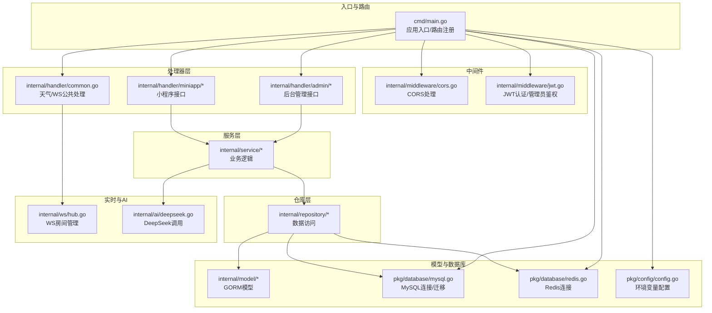
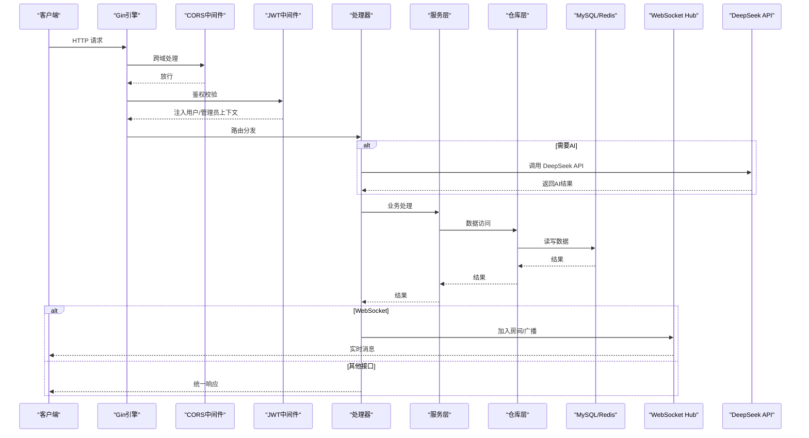
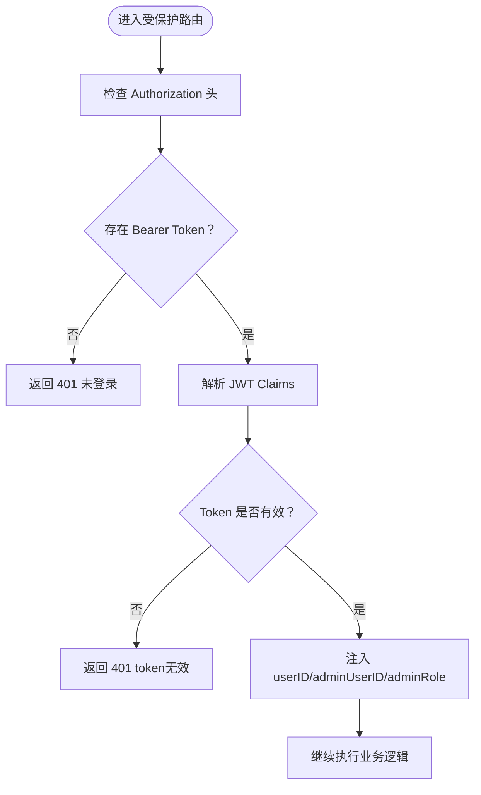
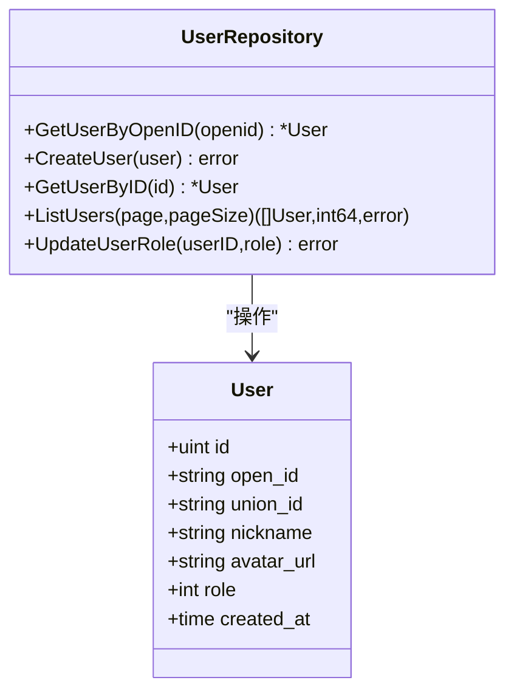
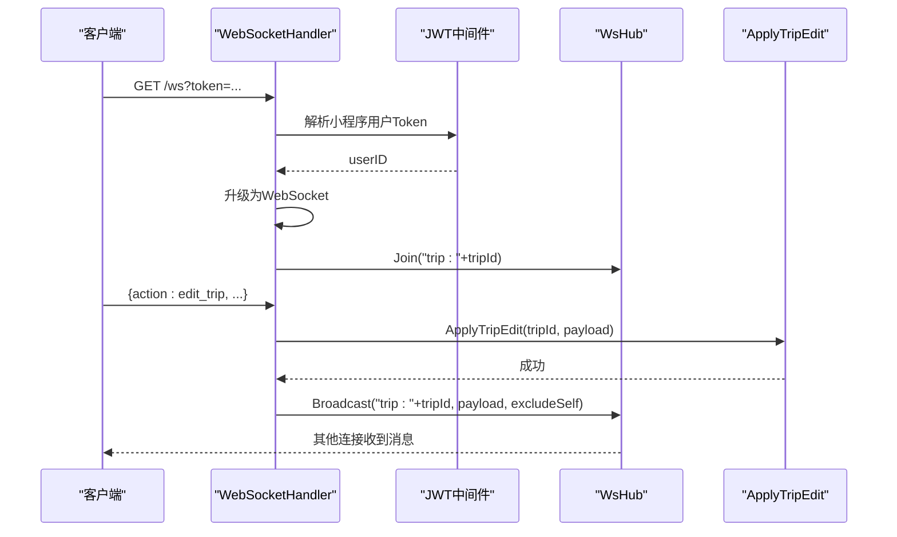
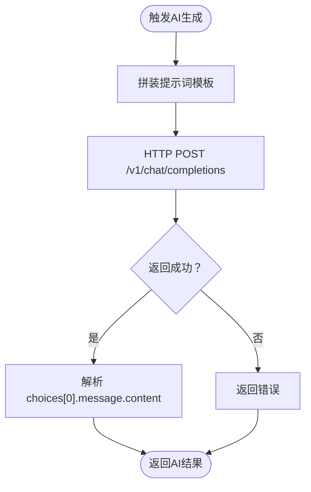
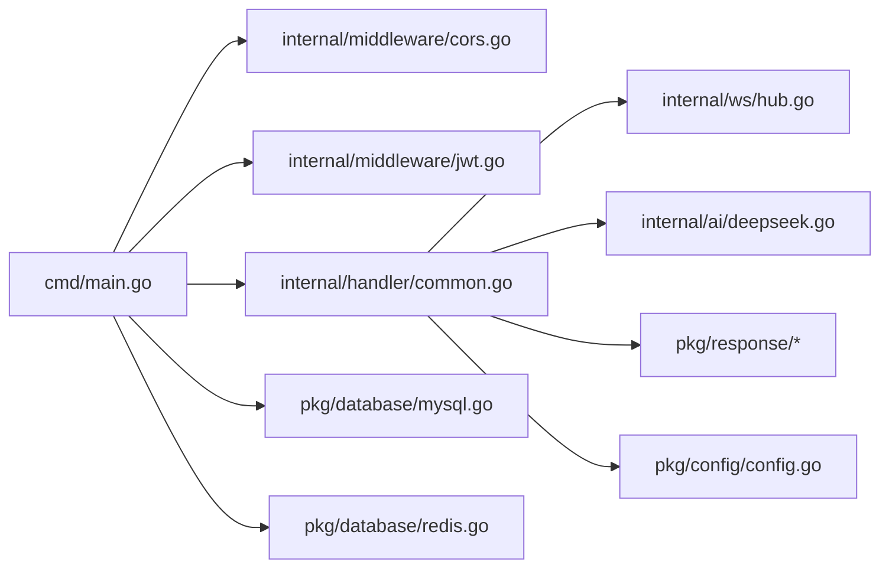

# 技术栈介绍

<cite>
**本文引用的文件**
- [cmd/main.go](file://cmd/main.go)
- [go.mod](file://go.mod)
- [pkg/config/config.go](file://pkg/config/config.go)
- [pkg/database/mysql.go](file://pkg/database/mysql.go)
- [pkg/database/redis.go](file://pkg/database/redis.go)
- [internal/middleware/jwt.go](file://internal/middleware/jwt.go)
- [internal/middleware/cors.go](file://internal/middleware/cors.go)
- [internal/handler/common.go](file://internal/handler/common.go)
- [internal/ws/hub.go](file://internal/ws/hub.go)
- [internal/ai/deepseek.go](file://internal/ai/deepseek.go)
- [internal/repository/user_repo.go](file://internal/repository/user_repo.go)
- [internal/model/user.go](file://internal/model/user.go)
- [README.md](file://README.md)
</cite>

## 目录
1. [引言](#引言)
2. [项目结构](#项目结构)
3. [核心组件](#核心组件)
4. [架构总览](#架构总览)
5. [详细组件分析](#详细组件分析)
6. [依赖关系分析](#依赖关系分析)
7. [性能考量](#性能考量)
8. [故障排查指南](#故障排查指南)
9. [结论](#结论)
10. [附录](#附录)

## 引言
本技术栈介绍面向旅行社交平台项目，系统性阐述后端采用的核心技术选型与协作机制，包括：
- Go 语言 1.20+ 的工程化优势与并发特性
- Gin 框架的高性能与生态适配
- MySQL + GORM 的数据持久化与自动迁移
- Redis 的缓存与会话支撑
- JWT 认证的安全保障
- WebSocket 的实时协同编辑
- DeepSeek AI 的智能行程生成
- Swagger 文档与统一响应封装

通过对入口、中间件、数据库、AI、WebSocket、模型与仓库层的逐层剖析，帮助开发者理解技术架构基础与各组件间的协同工作方式。

## 项目结构
项目采用“入口-中间件-处理器-服务-仓库-模型-数据库/配置”的清晰分层，配合 Swagger 文档与统一响应封装，形成可维护、可扩展的后端架构。

图表来源
- [cmd/main.go:31-151](file://cmd/main.go#L31-L151)
- [internal/middleware/cors.go:10-22](file://internal/middleware/cors.go#L10-L22)
- [internal/middleware/jwt.go:48-122](file://internal/middleware/jwt.go#L48-L122)
- [internal/handler/common.go:44-91](file://internal/handler/common.go#L44-L91)
- [pkg/database/mysql.go:19-90](file://pkg/database/mysql.go#L19-L90)
- [pkg/database/redis.go:15-31](file://pkg/database/redis.go#L15-L31)
- [internal/ws/hub.go:10-55](file://internal/ws/hub.go#L10-L55)
- [internal/ai/deepseek.go:18-52](file://internal/ai/deepseek.go#L18-L52)

章节来源
- [README.md:39-87](file://README.md#L39-L87)
- [cmd/main.go:31-151](file://cmd/main.go#L31-L151)

## 核心组件
- Go 语言 1.20+：提供高并发、低 GC 压力、模块化依赖管理与良好的工具链生态，适合构建高性能后端服务。
- Gin：轻量级 Web 框架，路由与中间件生态成熟，性能优异，便于快速搭建 RESTful API。
- GORM：现代化 ORM，支持自动迁移、事务、关联查询与多数据库驱动，降低数据库抽象成本。
- MySQL：关系型数据库，稳定可靠，适合存储用户、行程、攻略等结构化数据。
- Redis：高性能键值存储，用于缓存热点数据、会话与实时通信房间管理。
- JWT：无状态认证，支持小程序用户与后台管理员双令牌体系，简化鉴权流程。
- WebSocket：基于 Gorilla WebSocket，实现行程协同编辑与消息广播。
- DeepSeek AI：通过 Chat Completions API 提供智能行程生成，提升用户体验。
- Swagger：集成 swaggo 生态，自动生成 API 文档，便于联调与测试。

章节来源
- [go.mod:5-16](file://go.mod#L5-L16)
- [README.md:23-36](file://README.md#L23-L36)

## 架构总览
下图展示了从请求进入、中间件处理、路由分发、业务处理、数据持久化到实时通信的整体流程。

图表来源
- [cmd/main.go:47-146](file://cmd/main.go#L47-L146)
- [internal/middleware/jwt.go:48-122](file://internal/middleware/jwt.go#L48-L122)
- [internal/handler/common.go:48-91](file://internal/handler/common.go#L48-L91)
- [internal/ai/deepseek.go:18-52](file://internal/ai/deepseek.go#L18-L52)
- [pkg/database/mysql.go:19-90](file://pkg/database/mysql.go#L19-L90)
- [pkg/database/redis.go:15-31](file://pkg/database/redis.go#L15-L31)
- [internal/ws/hub.go:23-55](file://internal/ws/hub.go#L23-L55)

## 详细组件分析

### Go 语言与模块化
- 版本与模块：项目使用 Go 1.26.3，模块化依赖管理清晰，便于团队协作与版本控制。
- 并发模型：结合 Gin 的协程与 GORM 的连接池，满足高并发场景下的吞吐需求。
- 工具链：配合 swag 生成文档、go mod tidy 管理依赖，提升开发效率。

章节来源
- [go.mod:3](file://go.mod#L3)
- [README.md:91-142](file://README.md#L91-L142)

### Gin 框架与路由
- 路由分组：通过 API 版本分组与公开/登录/后台三类路由，清晰划分权限边界。
- 中间件：全局 CORS 与 JWT 中间件贯穿所有路由，保证跨域与鉴权一致性。
- Swagger：集成 gin-swagger，自动生成接口文档，便于前后端联调。

章节来源
- [cmd/main.go:47-146](file://cmd/main.go#L47-L146)
- [internal/middleware/cors.go:10-22](file://internal/middleware/cors.go#L10-L22)

### JWT 认证与权限控制
- 双令牌体系：小程序用户与后台管理员分别使用独立密钥与 Claims，避免混淆。
- 生命周期：默认 7 天有效期，支持签发与解析。
- 中间件：小程序用户 JWT 中间件校验 Authorization 头；后台管理员 JWT 中间件额外校验用户状态与角色。
- 仓库联动：后台鉴权中间件查询管理员用户并注入上下文。

图表来源
- [internal/middleware/jwt.go:48-122](file://internal/middleware/jwt.go#L48-L122)

章节来源
- [internal/middleware/jwt.go:14-122](file://internal/middleware/jwt.go#L14-L122)

### 数据持久化：MySQL + GORM
- 连接与重试：启动阶段循环重试连接，确保容器编排时数据库就绪。
- 自动迁移：启动时对多个模型执行 AutoMigrate，保证表结构一致。
- 默认数据：初始化默认角色与管理员账号，便于后台管理。
- 仓库层：通过 GORM Model 定义数据结构，仓库层封装查询与分页逻辑。

图表来源
- [internal/model/user.go:6-15](file://internal/model/user.go#L6-L15)
- [internal/repository/user_repo.go:8-43](file://internal/repository/user_repo.go#L8-L43)
- [pkg/database/mysql.go:39-89](file://pkg/database/mysql.go#L39-L89)

章节来源
- [pkg/database/mysql.go:19-90](file://pkg/database/mysql.go#L19-L90)
- [internal/repository/user_repo.go:8-43](file://internal/repository/user_repo.go#L8-L43)
- [internal/model/user.go:6-15](file://internal/model/user.go#L6-L15)

### 缓存与会话：Redis
- 连接初始化：从环境变量读取主机、端口、密码与 DB，Ping 成功后方可使用。
- 使用场景：可用于会话缓存、限流、分布式锁、计数器等，提升系统整体性能。

章节来源
- [pkg/database/redis.go:15-31](file://pkg/database/redis.go#L15-L31)
- [pkg/config/config.go:23-27](file://pkg/config/config.go#L23-L27)

### 实时通信：WebSocket 与 Hub
- 协议升级：基于 Gorilla WebSocket，允许任意来源，便于开发与测试。
- 房间管理：Hub 维护房间与连接映射，支持加入、离开与广播。
- 协同编辑：前端通过 WS 发送 join/edit 指令，服务端持久化并广播给房间内其他连接。

图表来源
- [internal/handler/common.go:48-91](file://internal/handler/common.go#L48-L91)
- [internal/ws/hub.go:23-55](file://internal/ws/hub.go#L23-L55)
- [internal/middleware/jwt.go:38-46](file://internal/middleware/jwt.go#L38-L46)

章节来源
- [internal/handler/common.go:44-91](file://internal/handler/common.go#L44-L91)
- [internal/ws/hub.go:10-55](file://internal/ws/hub.go#L10-L55)

### 智能辅助：DeepSeek AI
- 能力定位：通过 Chat Completions API 生成结构化 JSON 的智能行程，提升用户体验。
- 配置与调用：从环境变量读取 API Key，构造请求并解析返回内容。
- 适用场景：行程 AI 生成、内容创作辅助等。

图表来源
- [internal/ai/deepseek.go:13-52](file://internal/ai/deepseek.go#L13-L52)
- [pkg/config/config.go:52-54](file://pkg/config/config.go#L52-L54)

章节来源
- [internal/ai/deepseek.go:18-52](file://internal/ai/deepseek.go#L18-L52)
- [pkg/config/config.go:95-96](file://pkg/config/config.go#L95-L96)

### 配置管理：环境变量
- 集中式配置：统一从环境变量加载数据库、Redis、第三方服务 Key 等配置。
- 类型转换：提供字符串/整型/浮点型读取函数，增强健壮性。
- 安全性：敏感信息集中管理，避免硬编码。

章节来源
- [pkg/config/config.go:60-129](file://pkg/config/config.go#L60-L129)

### 统一响应与文档
- 统一响应：封装成功/失败响应结构，便于前端统一处理。
- Swagger：通过注解与 swag 工具生成在线文档，支持调试与联调。

章节来源
- [README.md:144-151](file://README.md#L144-L151)

## 依赖关系分析
- 模块依赖：go.mod 明确声明了 Gin、GORM、Redis、JWT、WebSocket、Swagger 等核心依赖。
- 组件耦合：入口仅负责装配与路由，中间件与处理器解耦，服务层通过仓库层访问数据库，降低耦合度。
- 外部依赖：MySQL、Redis、高德地图、DeepSeek API，均通过配置中心集中管理。

图表来源
- [go.mod:5-16](file://go.mod#L5-L16)
- [cmd/main.go:31-151](file://cmd/main.go#L31-L151)

章节来源
- [go.mod:5-16](file://go.mod#L5-L16)

## 性能考量
- 并发与吞吐：Gin 的高效路由与 Go 的 goroutine 并发模型，适合高并发请求场景。
- 数据库优化：GORM 连接池与自动迁移减少运维成本；建议在高频查询上增加索引与缓存。
- 缓存策略：Redis 作为热点数据缓存，可显著降低数据库压力；注意缓存失效与一致性。
- WebSocket：Hub 使用互斥锁保护房间映射，广播时遍历房间连接，建议在高并发房间场景评估连接上限与内存占用。
- AI 调用：DeepSeek API 为外部依赖，建议增加超时与重试策略，避免阻塞主流程。

## 故障排查指南
- 数据库连接失败：检查环境变量与网络连通性；查看启动日志中的重试次数与最终错误。
- Redis 连接失败：确认主机、端口、密码与 DB 数字转换是否正确。
- JWT 401：确认 Authorization 头格式为 Bearer Token，Token 是否过期或被篡改。
- WebSocket 升级失败：检查 token 是否有效，协议升级是否被拦截。
- Swagger 文档不可用：确认 swag 工具已生成文档并挂载到 /swagger/*any 路由。

章节来源
- [pkg/database/mysql.go:25-37](file://pkg/database/mysql.go#L25-L37)
- [pkg/database/redis.go:23-30](file://pkg/database/redis.go#L23-L30)
- [internal/middleware/jwt.go:50-64](file://internal/middleware/jwt.go#L50-L64)
- [internal/handler/common.go:56-60](file://internal/handler/common.go#L56-L60)

## 结论
该技术栈以 Go 为核心，结合 Gin 的高性能与生态、GORM 的现代化 ORM、MySQL 与 Redis 的组合、JWT 的无状态认证、WebSocket 的实时能力以及 DeepSeek 的智能辅助，形成了功能完备、易于扩展的旅行社交平台后端架构。通过清晰的分层设计与统一的配置管理，项目在开发效率、可维护性与性能之间取得了良好平衡。

## 附录
- 快速开始与环境变量配置参见项目 README。
- Docker 与开发环境配置参见 README 的部署与开发模式章节。

章节来源
- [README.md:91-151](file://README.md#L91-L151)
- [README.md:237-318](file://README.md#L237-L318)