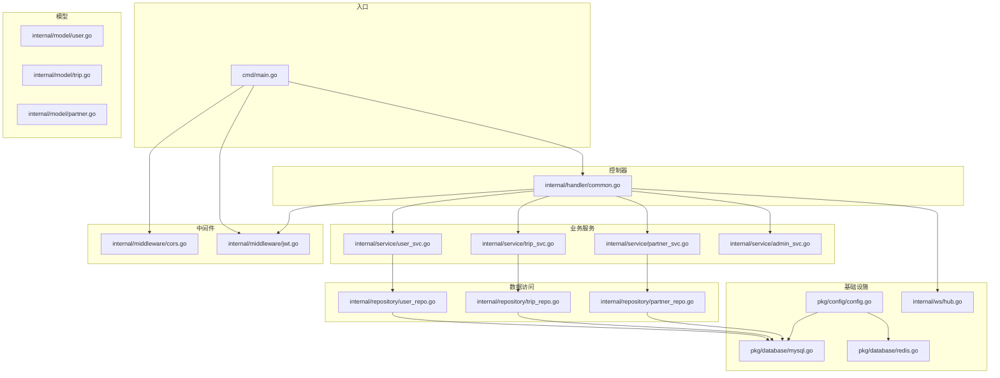
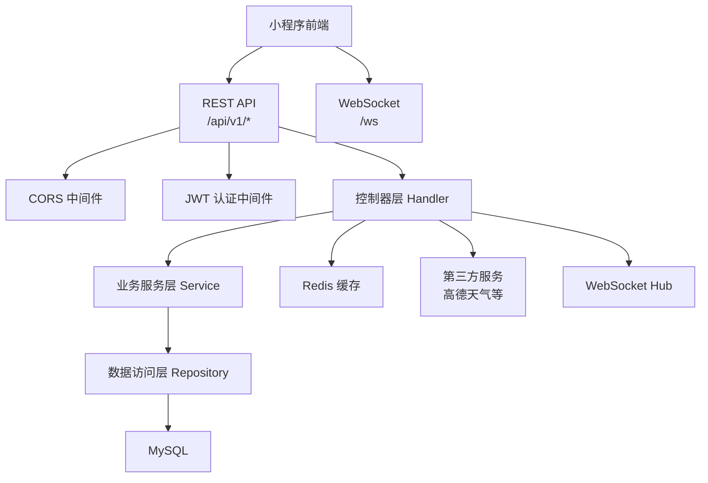
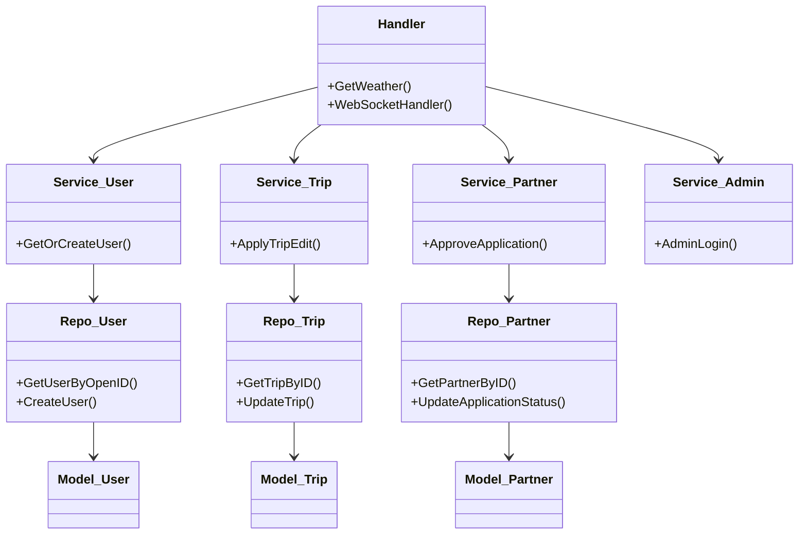
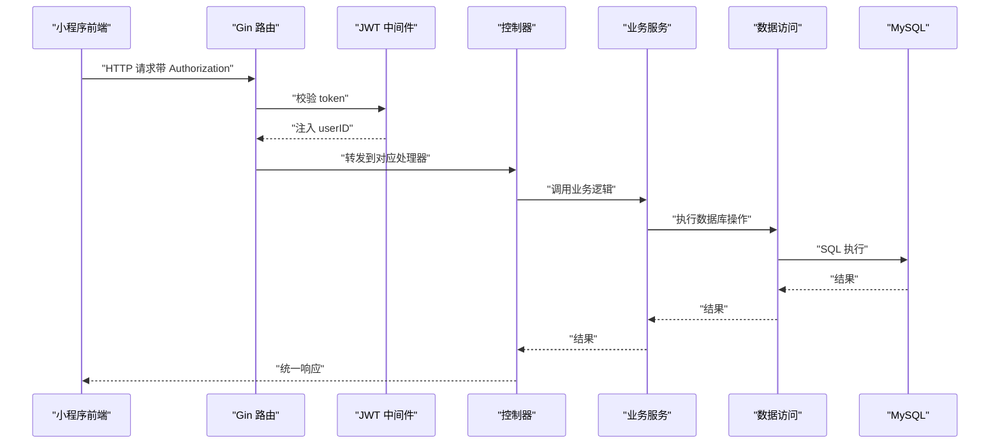
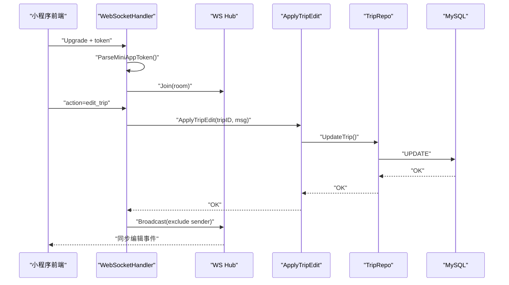
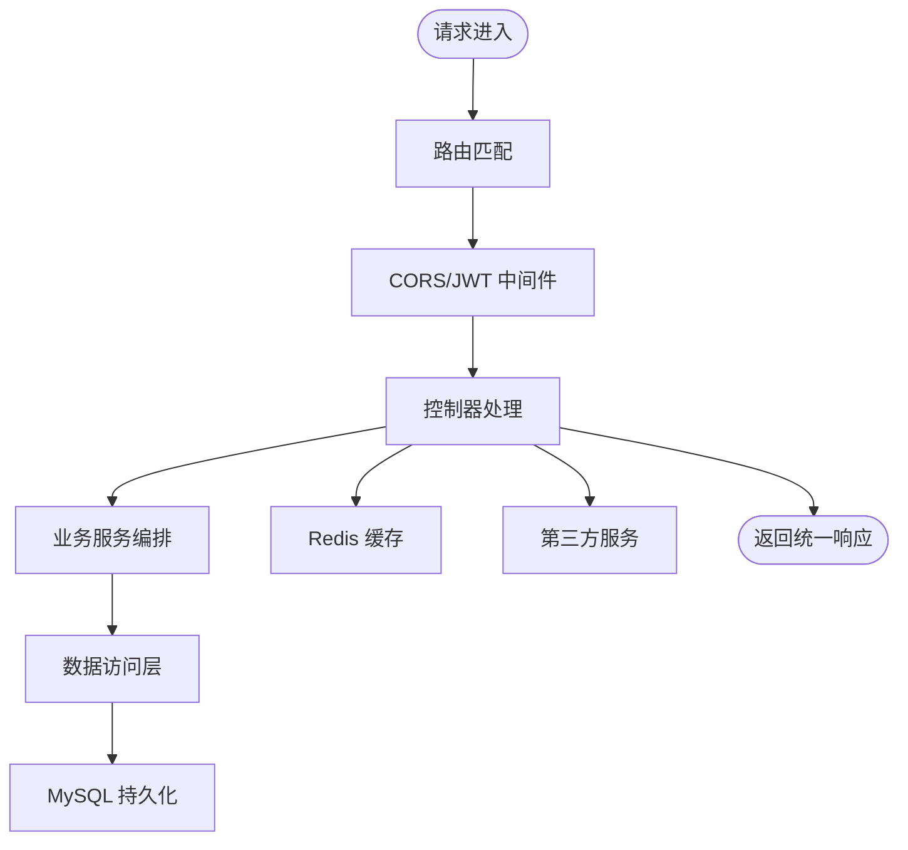
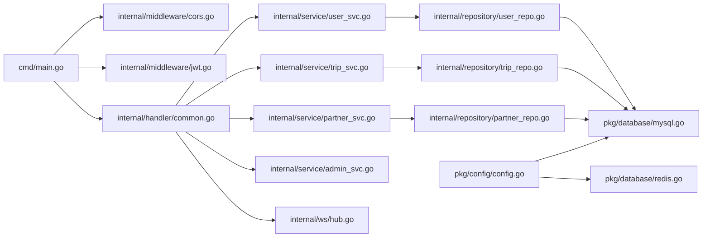

# 架构设计概览

<cite>
**本文引用的文件**
- [cmd/main.go](file://cmd/main.go)
- [internal/middleware/cors.go](file://internal/middleware/cors.go)
- [internal/middleware/jwt.go](file://internal/middleware/jwt.go)
- [pkg/config/config.go](file://pkg/config/config.go)
- [pkg/database/mysql.go](file://pkg/database/mysql.go)
- [pkg/database/redis.go](file://pkg/database/redis.go)
- [internal/ws/hub.go](file://internal/ws/hub.go)
- [internal/handler/common.go](file://internal/handler/common.go)
- [internal/service/user_svc.go](file://internal/service/user_svc.go)
- [internal/service/trip_svc.go](file://internal/service/trip_svc.go)
- [internal/service/partner_svc.go](file://internal/service/partner_svc.go)
- [internal/service/admin_svc.go](file://internal/service/admin_svc.go)
- [internal/repository/user_repo.go](file://internal/repository/user_repo.go)
- [internal/repository/trip_repo.go](file://internal/repository/trip_repo.go)
- [internal/repository/partner_repo.go](file://internal/repository/partner_repo.go)
- [internal/model/user.go](file://internal/model/user.go)
- [internal/model/trip.go](file://internal/model/trip.go)
- [internal/model/partner.go](file://internal/model/partner.go)
</cite>

## 目录
1. [引言](#引言)
2. [项目结构](#项目结构)
3. [核心组件](#核心组件)
4. [架构总览](#架构总览)
5. [详细组件分析](#详细组件分析)
6. [依赖关系分析](#依赖关系分析)
7. [性能考量](#性能考量)
8. [故障排查指南](#故障排查指南)
9. [结论](#结论)

## 引言
本项目是一个旅行社交平台后端服务，围绕“小程序前端 + Go 后端”的前后端分离架构设计，采用 MVC 分层与轻量微服务化思想，通过 Gin 框架提供 REST 接口，结合 JWT 认证、Redis 缓存、GORM 数据访问层以及 WebSocket 协同编辑能力，支撑攻略、行程、搭子、记账、足迹、收藏、评论等核心功能。

## 项目结构
项目采用按职责分层的目录组织方式：
- cmd：应用入口，负责初始化配置、数据库、注册路由并启动服务
- internal：核心业务代码
  - handler：HTTP 控制器层，负责路由与响应封装
  - middleware：中间件层，包含 CORS 与 JWT 认证
  - model：数据模型定义
  - repository：数据访问层（DAO），封装 GORM 操作
  - service：业务服务层，编排领域逻辑
  - ws：WebSocket 协同编辑中心
- pkg：通用基础设施
  - config：环境变量配置加载
  - database：数据库连接与初始化（MySQL、Redis）
  - response：统一响应封装

图表来源
- [cmd/main.go:31-151](file://cmd/main.go#L31-L151)
- [internal/middleware/cors.go:10-22](file://internal/middleware/cors.go#L10-L22)
- [internal/middleware/jwt.go:48-122](file://internal/middleware/jwt.go#L48-L122)
- [internal/handler/common.go:48-91](file://internal/handler/common.go#L48-L91)
- [internal/service/user_svc.go:12-27](file://internal/service/user_svc.go#L12-L27)
- [internal/service/trip_svc.go:7-18](file://internal/service/trip_svc.go#L7-L18)
- [internal/service/partner_svc.go:9-32](file://internal/service/partner_svc.go#L9-L32)
- [internal/service/admin_svc.go:12-22](file://internal/service/admin_svc.go#L12-L22)
- [internal/repository/user_repo.go:8-43](file://internal/repository/user_repo.go#L8-L43)
- [internal/repository/trip_repo.go:12-136](file://internal/repository/trip_repo.go#L12-L136)
- [internal/repository/partner_repo.go:8-63](file://internal/repository/partner_repo.go#L8-L63)
- [pkg/config/config.go:60-100](file://pkg/config/config.go#L60-L100)
- [pkg/database/mysql.go:19-90](file://pkg/database/mysql.go#L19-L90)
- [pkg/database/redis.go:15-31](file://pkg/database/redis.go#L15-L31)
- [internal/ws/hub.go:10-55](file://internal/ws/hub.go#L10-L55)

章节来源
- [cmd/main.go:31-151](file://cmd/main.go#L31-L151)
- [pkg/config/config.go:60-100](file://pkg/config/config.go#L60-L100)

## 核心组件
- 应用入口与路由
  - 初始化配置、数据库与 Redis，注册公开/小程序/后台三类路由组，挂载 CORS 与 JWT 中间件，暴露 Swagger 文档与 WebSocket 路由
- 中间件层
  - CORS：允许跨域请求头与方法，处理预检请求
  - JWT：小程序用户与后台管理员双令牌体系，解析并注入用户上下文
- 控制器层（Handler）
  - 统一响应封装，调用业务服务，集成第三方天气接口，处理 WebSocket 协同编辑
- 业务服务层（Service）
  - 用户登录注册、行程协同编辑落库、搭子申请审批、后台登录校验
- 数据访问层（Repository）
  - 基于 GORM 的 CRUD 与关联预加载，事务性操作（如行程日删除级联项）
- 数据模型（Model）
  - 用户、行程、行程日、行程项、同行者、搭子、申请等核心实体
- 基础设施
  - 配置加载、MySQL 自动迁移、Redis 连接与 Ping 校验、WebSocket Hub

章节来源
- [cmd/main.go:31-151](file://cmd/main.go#L31-L151)
- [internal/middleware/cors.go:10-22](file://internal/middleware/cors.go#L10-L22)
- [internal/middleware/jwt.go:48-122](file://internal/middleware/jwt.go#L48-L122)
- [internal/handler/common.go:48-91](file://internal/handler/common.go#L48-L91)
- [internal/service/user_svc.go:12-27](file://internal/service/user_svc.go#L12-L27)
- [internal/service/trip_svc.go:7-18](file://internal/service/trip_svc.go#L7-L18)
- [internal/service/partner_svc.go:9-32](file://internal/service/partner_svc.go#L9-L32)
- [internal/service/admin_svc.go:12-22](file://internal/service/admin_svc.go#L12-L22)
- [internal/repository/user_repo.go:8-43](file://internal/repository/user_repo.go#L8-L43)
- [internal/repository/trip_repo.go:12-136](file://internal/repository/trip_repo.go#L12-L136)
- [internal/repository/partner_repo.go:8-63](file://internal/repository/partner_repo.go#L8-L63)
- [pkg/database/mysql.go:19-90](file://pkg/database/mysql.go#L19-L90)
- [pkg/database/redis.go:15-31](file://pkg/database/redis.go#L15-L31)
- [internal/ws/hub.go:10-55](file://internal/ws/hub.go#L10-L55)

## 架构总览
系统采用前后端分离设计，小程序前端通过 HTTP 与 WebSocket 与后端交互；后端以 MVC 分层实现，配合 JWT 与 CORS，统一响应封装，数据持久化基于 GORM + MySQL，缓存使用 Redis。路由按“公开接口、小程序登录态接口、后台管理接口”三层组织，WebSocket 用于行程协同编辑场景。

图表来源
- [cmd/main.go:46-146](file://cmd/main.go#L46-L146)
- [internal/middleware/cors.go:10-22](file://internal/middleware/cors.go#L10-L22)
- [internal/middleware/jwt.go:48-122](file://internal/middleware/jwt.go#L48-L122)
- [internal/handler/common.go:48-91](file://internal/handler/common.go#L48-L91)
- [pkg/database/mysql.go:19-90](file://pkg/database/mysql.go#L19-L90)
- [pkg/database/redis.go:15-31](file://pkg/database/redis.go#L15-L31)
- [internal/ws/hub.go:10-55](file://internal/ws/hub.go#L10-L55)

## 详细组件分析

### MVC 架构在项目中的体现
- Model（模型）
  - 定义用户、行程、搭子等实体及关联关系，作为数据契约
- View（视图）
  - 本项目为 API 服务，不直接渲染页面，响应 JSON 作为“视图”
- Controller（控制器）
  - 路由入口与参数解析，调用服务层，封装统一响应
- Service（服务）
  - 组织业务流程，如微信登录注册、行程协同编辑、搭子审批
- Repository（仓储）
  - 封装数据库操作，提供领域内 CRUD 与复杂查询

图表来源
- [internal/handler/common.go:19-42](file://internal/handler/common.go#L19-L42)
- [internal/service/user_svc.go:12-27](file://internal/service/user_svc.go#L12-L27)
- [internal/service/trip_svc.go:7-18](file://internal/service/trip_svc.go#L7-L18)
- [internal/service/partner_svc.go:9-32](file://internal/service/partner_svc.go#L9-L32)
- [internal/service/admin_svc.go:12-22](file://internal/service/admin_svc.go#L12-L22)
- [internal/repository/user_repo.go:8-43](file://internal/repository/user_repo.go#L8-L43)
- [internal/repository/trip_repo.go:12-136](file://internal/repository/trip_repo.go#L12-L136)
- [internal/repository/partner_repo.go:8-63](file://internal/repository/partner_repo.go#L8-L63)
- [internal/model/user.go:6-15](file://internal/model/user.go#L6-L15)
- [internal/model/trip.go:9-37](file://internal/model/trip.go#L9-L37)
- [internal/model/partner.go:5-29](file://internal/model/partner.go#L5-L29)

章节来源
- [internal/handler/common.go:19-42](file://internal/handler/common.go#L19-L42)
- [internal/service/user_svc.go:12-27](file://internal/service/user_svc.go#L12-L27)
- [internal/service/trip_svc.go:7-18](file://internal/service/trip_svc.go#L7-L18)
- [internal/service/partner_svc.go:9-32](file://internal/service/partner_svc.go#L9-L32)
- [internal/service/admin_svc.go:12-22](file://internal/service/admin_svc.go#L12-L22)
- [internal/repository/user_repo.go:8-43](file://internal/repository/user_repo.go#L8-L43)
- [internal/repository/trip_repo.go:12-136](file://internal/repository/trip_repo.go#L12-L136)
- [internal/repository/partner_repo.go:8-63](file://internal/repository/partner_repo.go#L8-L63)
- [internal/model/user.go:6-15](file://internal/model/user.go#L6-L15)
- [internal/model/trip.go:9-37](file://internal/model/trip.go#L9-L37)
- [internal/model/partner.go:5-29](file://internal/model/partner.go#L5-L29)

### 前后端分离与交互方式
- 小程序前端通过 HTTP 与后端交互，使用 Bearer Token 进行登录态鉴权
- 公开接口无需登录，如登录、天气查询、附近推荐等
- 登录态接口在路由上绑定 JWT 中间件，自动注入 userID
- WebSocket 用于行程协同编辑，前端建立连接后发送 join_trip/edit_trip 指令，后端写库并广播

图表来源
- [cmd/main.go:46-146](file://cmd/main.go#L46-L146)
- [internal/middleware/jwt.go:48-122](file://internal/middleware/jwt.go#L48-L122)
- [internal/handler/common.go:48-91](file://internal/handler/common.go#L48-L91)
- [internal/service/trip_svc.go:7-18](file://internal/service/trip_svc.go#L7-L18)
- [internal/repository/trip_repo.go:12-136](file://internal/repository/trip_repo.go#L12-L136)
- [pkg/database/mysql.go:19-90](file://pkg/database/mysql.go#L19-L90)

章节来源
- [cmd/main.go:46-146](file://cmd/main.go#L46-L146)
- [internal/middleware/jwt.go:48-122](file://internal/middleware/jwt.go#L48-L122)
- [internal/handler/common.go:48-91](file://internal/handler/common.go#L48-L91)

### WebSocket 协同编辑流程
- 前端建立 WebSocket 连接并携带 token
- 解析 token 后升级连接，进入消息循环
- 支持加入行程房间与编辑指令，后端持久化编辑内容并广播给房间内其他连接

图表来源
- [internal/handler/common.go:48-91](file://internal/handler/common.go#L48-L91)
- [internal/ws/hub.go:10-55](file://internal/ws/hub.go#L10-L55)
- [internal/service/trip_svc.go:7-18](file://internal/service/trip_svc.go#L7-L18)
- [internal/repository/trip_repo.go:12-136](file://internal/repository/trip_repo.go#L12-L136)
- [pkg/database/mysql.go:19-90](file://pkg/database/mysql.go#L19-L90)

章节来源
- [internal/handler/common.go:48-91](file://internal/handler/common.go#L48-L91)
- [internal/ws/hub.go:10-55](file://internal/ws/hub.go#L10-L55)
- [internal/service/trip_svc.go:7-18](file://internal/service/trip_svc.go#L7-L18)
- [internal/repository/trip_repo.go:12-136](file://internal/repository/trip_repo.go#L12-L136)

### 数据流向与处理流程
- 请求接收：Gin 路由根据路径匹配到控制器
- 业务处理：控制器调用服务层，服务层编排仓库层与外部依赖
- 数据持久化：仓库层通过 GORM 写入 MySQL，必要时使用事务保证一致性
- 缓存策略：Redis 用于会话、限流、热点数据等（初始化连接，具体使用点见基础设施）

图表来源
- [cmd/main.go:46-146](file://cmd/main.go#L46-L146)
- [internal/handler/common.go:48-91](file://internal/handler/common.go#L48-L91)
- [pkg/database/mysql.go:19-90](file://pkg/database/mysql.go#L19-L90)
- [pkg/database/redis.go:15-31](file://pkg/database/redis.go#L15-L31)

章节来源
- [cmd/main.go:46-146](file://cmd/main.go#L46-L146)
- [internal/handler/common.go:48-91](file://internal/handler/common.go#L48-L91)
- [pkg/database/mysql.go:19-90](file://pkg/database/mysql.go#L19-L90)
- [pkg/database/redis.go:15-31](file://pkg/database/redis.go#L15-L31)

### 关键技术组件与定位
- WebSocket
  - 位置：路由层挂载 /ws，控制器升级连接，Hub 管理房间与广播
  - 作用：实现行程协同编辑的实时同步
- JWT 认证
  - 位置：中间件层，分别提供小程序用户与后台管理员双令牌解析
  - 作用：登录态校验与上下文注入
- 缓存策略
  - 位置：Redis 初始化与连接，可用于会话、限流、热点数据
  - 作用：降低数据库压力，提升响应速度
- Swagger 文档
  - 位置：路由层挂载 /swagger/*any
  - 作用：自动生成接口文档，便于联调与测试

章节来源
- [internal/ws/hub.go:10-55](file://internal/ws/hub.go#L10-L55)
- [internal/middleware/jwt.go:48-122](file://internal/middleware/jwt.go#L48-L122)
- [pkg/database/redis.go:15-31](file://pkg/database/redis.go#L15-L31)
- [cmd/main.go:43-44](file://cmd/main.go#L43-L44)

## 依赖关系分析
- 路由到中间件：全局 CORS，按组绑定 JWT
- 控制器到服务：统一调用业务服务
- 服务到仓库：封装领域操作
- 仓库到数据库：GORM 操作 MySQL
- 基础设施到配置：配置驱动数据库与 Redis 初始化

图表来源
- [cmd/main.go:31-151](file://cmd/main.go#L31-L151)
- [internal/middleware/cors.go:10-22](file://internal/middleware/cors.go#L10-L22)
- [internal/middleware/jwt.go:48-122](file://internal/middleware/jwt.go#L48-L122)
- [internal/handler/common.go:48-91](file://internal/handler/common.go#L48-L91)
- [internal/service/user_svc.go:12-27](file://internal/service/user_svc.go#L12-L27)
- [internal/service/trip_svc.go:7-18](file://internal/service/trip_svc.go#L7-L18)
- [internal/service/partner_svc.go:9-32](file://internal/service/partner_svc.go#L9-L32)
- [internal/service/admin_svc.go:12-22](file://internal/service/admin_svc.go#L12-L22)
- [internal/repository/user_repo.go:8-43](file://internal/repository/user_repo.go#L8-L43)
- [internal/repository/trip_repo.go:12-136](file://internal/repository/trip_repo.go#L12-L136)
- [internal/repository/partner_repo.go:8-63](file://internal/repository/partner_repo.go#L8-L63)
- [pkg/config/config.go:60-100](file://pkg/config/config.go#L60-L100)
- [pkg/database/mysql.go:19-90](file://pkg/database/mysql.go#L19-L90)
- [pkg/database/redis.go:15-31](file://pkg/database/redis.go#L15-L31)
- [internal/ws/hub.go:10-55](file://internal/ws/hub.go#L10-L55)

章节来源
- [cmd/main.go:31-151](file://cmd/main.go#L31-L151)
- [pkg/config/config.go:60-100](file://pkg/config/config.go#L60-L100)
- [pkg/database/mysql.go:19-90](file://pkg/database/mysql.go#L19-L90)
- [pkg/database/redis.go:15-31](file://pkg/database/redis.go#L15-L31)

## 性能考量
- 数据库连接与迁移
  - MySQL 初始化包含重试机制，AutoMigrate 在启动时完成表结构同步
- 缓存
  - Redis 初始化成功后可用于热点数据与会话存储，建议结合业务热点评估缓存命中率
- ORM 与预加载
  - 仓库层使用 Preload 与事务，注意在高并发下对关联查询的性能影响，建议对高频查询做索引优化
- WebSocket
  - Hub 使用互斥锁保护房间映射，广播时逐连接写入，建议在高并发房间场景评估连接数与广播频率

章节来源
- [pkg/database/mysql.go:19-90](file://pkg/database/mysql.go#L19-L90)
- [pkg/database/redis.go:15-31](file://pkg/database/redis.go#L15-L31)
- [internal/repository/trip_repo.go:17-27](file://internal/repository/trip_repo.go#L17-L27)
- [internal/ws/hub.go:10-55](file://internal/ws/hub.go#L10-L55)

## 故障排查指南
- 路由与中间件
  - CORS：确认请求头与方法是否在允许范围内，预检请求是否正确处理
  - JWT：检查 Authorization 头格式与 token 有效性，小程序与后台 token 独立密钥
- 数据库
  - 启动阶段重试连接，若持续失败检查主机、端口、账号与网络连通性
  - AutoMigrate 失败时检查模型定义与权限
- Redis
  - Ping 失败检查地址、端口、密码与网络
- WebSocket
  - 升级失败查看日志；房间加入与广播异常检查 Hub 状态与连接生命周期
- 第三方服务
  - 天气接口依赖高德 Key，确认 Key 配置与网络可达

章节来源
- [internal/middleware/cors.go:10-22](file://internal/middleware/cors.go#L10-L22)
- [internal/middleware/jwt.go:48-122](file://internal/middleware/jwt.go#L48-L122)
- [pkg/database/mysql.go:19-90](file://pkg/database/mysql.go#L19-L90)
- [pkg/database/redis.go:15-31](file://pkg/database/redis.go#L15-L31)
- [internal/handler/common.go:48-91](file://internal/handler/common.go#L48-L91)

## 结论
本项目以清晰的 MVC 分层与前后端分离为核心，结合 JWT、CORS、Redis、GORM 与 WebSocket 等关键技术，构建了可扩展、易维护的旅行社交平台后端骨架。通过路由分组与中间件统一治理，服务层专注业务编排，仓储层隔离数据细节，为后续微服务拆分与演进提供了良好基础。