# 核心功能特性

<cite>
**本文引用的文件**
- [cmd/main.go](file://cmd/main.go)
- [internal/ai/deepseek.go](file://internal/ai/deepseek.go)
- [internal/ws/hub.go](file://internal/ws/hub.go)
- [internal/model/user.go](file://internal/model/user.go)
- [internal/model/trip.go](file://internal/model/trip.go)
- [internal/model/trip_day.go](file://internal/model/trip_day.go)
- [internal/model/trip_item.go](file://internal/model/trip_item.go)
- [internal/model/guide.go](file://internal/model/guide.go)
- [internal/model/guide_section.go](file://internal/model/guide_section.go)
- [internal/model/partner.go](file://internal/model/partner.go)
- [internal/model/message.go](file://internal/model/message.go)
- [internal/model/accounting.go](file://internal/model/accounting.go)
- [internal/model/checklist.go](file://internal/model/checklist.go)
- [internal/model/footprint.go](file://internal/model/footprint.go)
- [internal/model/favorite.go](file://internal/model/favorite.go)
- [internal/model/comment.go](file://internal/model/comment.go)
</cite>

## 目录
1. [简介](#简介)
2. [项目结构](#项目结构)
3. [核心组件](#核心组件)
4. [架构总览](#架构总览)
5. [详细组件分析](#详细组件分析)
6. [依赖分析](#依赖分析)
7. [性能考虑](#性能考虑)
8. [故障排查指南](#故障排查指南)
9. [结论](#结论)
10. [附录](#附录)

## 简介
本文件面向旅行社交平台的使用者与开发者，系统性梳理平台的核心功能模块与交互关系，覆盖微信登录认证、瀑布流攻略系统、智能行程规划、实时协同编辑、周边推荐、搭子组队、消息中心、旅行记账、备忘清单、足迹系统等。重点阐述创新功能“AI智能行程生成”与“实时协作编辑”的实现原理与典型使用场景，并给出功能全景图与模块间的生态关联，帮助快速掌握平台的完整能力范围。

## 项目结构
后端采用 Go + Gin 框架，按领域与层次划分目录：
- cmd：应用入口，初始化配置、数据库、注册路由并启动服务
- internal/handler：HTTP 控制器层，按业务域分组（admin、miniapp）
- internal/service：业务服务层，封装领域逻辑
- internal/repository：数据访问层，对接数据库
- internal/model：数据模型与实体定义
- internal/ws：WebSocket 中枢，维护房间与广播
- internal/ai：集成第三方 AI 能力（DeepSeek）
- pkg：通用配置、数据库连接、统一响应封装

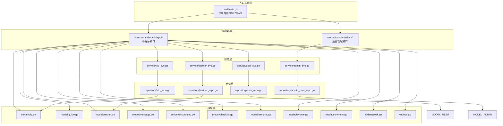

图表来源
- [cmd/main.go:46-146](file://cmd/main.go#L46-L146)
- [internal/ai/deepseek.go:13-53](file://internal/ai/deepseek.go#L13-L53)
- [internal/ws/hub.go:10-56](file://internal/ws/hub.go#L10-L56)
- [internal/model/trip.go:9-38](file://internal/model/trip.go#L9-L38)
- [internal/model/guide.go:9-28](file://internal/model/guide.go#L9-L28)
- [internal/model/partner.go:5-30](file://internal/model/partner.go#L5-L30)
- [internal/model/message.go:5-15](file://internal/model/message.go#L5-L15)
- [internal/model/accounting.go:5-17](file://internal/model/accounting.go#L5-L17)
- [internal/model/checklist.go:5-23](file://internal/model/checklist.go#L5-L23)
- [internal/model/footprint.go:5-15](file://internal/model/footprint.go#L5-L15)
- [internal/model/favorite.go:5-13](file://internal/model/favorite.go#L5-L13)
- [internal/model/comment.go:5-16](file://internal/model/comment.go#L5-L16)

章节来源
- [cmd/main.go:31-151](file://cmd/main.go#L31-L151)

## 核心组件
- 微信登录认证：通过公开接口完成用户登录与会话建立，后续接口均基于 JWT 鉴权
- 瀑布流攻略系统：提供攻略列表与详情浏览，支持收藏、评论与点赞
- 智能行程规划：基于 AI 提示词调用第三方模型，自动生成结构化行程
- 实时协同编辑：通过 WebSocket 房间机制，实现多人对同一行程的实时编辑与同步
- 周边推荐：提供周边地点与热门推荐，辅助行程决策
- 搭子组队：用户发起或参与组队活动，支持申请、审核与状态管理
- 消息中心：支持私聊与系统通知，提供消息列表与发送
- 旅行记账：按行程维度进行费用记录与导入
- 备忘清单：行程模板化清单与个人清单，支持勾选与同步
- 足迹系统：记录用户到访城市与经纬度，支持生成旅行海报

章节来源
- [cmd/main.go:49-146](file://cmd/main.go#L49-L146)

## 架构总览
平台采用“路由-控制器-服务-仓储-模型”的分层架构，结合 WebSocket 实现实时协作，结合 AI 能力提供智能行程生成。核心控制流如下：

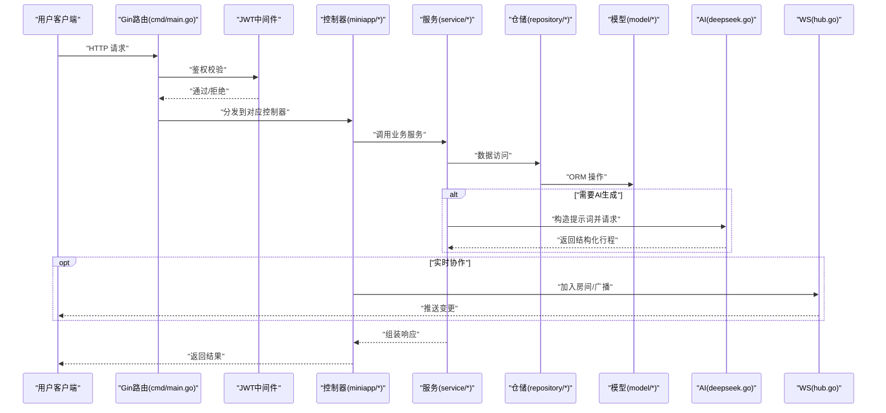

图表来源
- [cmd/main.go:46-146](file://cmd/main.go#L46-L146)
- [internal/ai/deepseek.go:18-52](file://internal/ai/deepseek.go#L18-L52)
- [internal/ws/hub.go:23-55](file://internal/ws/hub.go#L23-L55)

## 详细组件分析

### 微信登录认证
- 功能概述：提供公开登录接口，绑定微信 OpenID/UnionID，建立用户身份；后续接口通过 JWT 鉴权保护
- 数据模型：用户模型包含 OpenID、UnionID、昵称、头像、角色等字段
- 使用场景：首次进入小程序、切换账号、权限升级
- 安全要点：登录态有效期、敏感操作二次验证

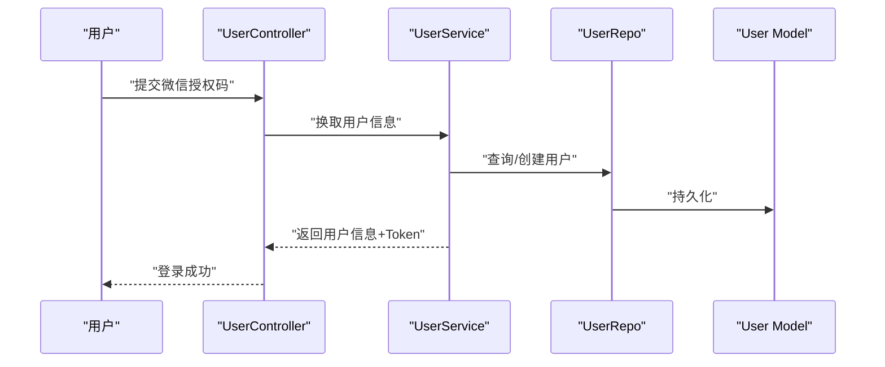

图表来源
- [cmd/main.go:50](file://cmd/main.go#L50)
- [internal/model/user.go:6-16](file://internal/model/user.go#L6-L16)

章节来源
- [cmd/main.go:49-64](file://cmd/main.go#L49-L64)
- [internal/model/user.go:6-16](file://internal/model/user.go#L6-L16)

### 瀑布流攻略系统
- 功能概述：攻略以板块形式组织（概览、交通、住宿、美食、景点、日程、预算、注意事项等），支持浏览、收藏、评论、点赞
- 数据模型：攻略主表与板块表，评论与收藏独立建模
- 使用场景：出行前参考、分享经验、社区互动
- 关联关系：攻略与行程可建立关联，行程可复用攻略中的板块内容

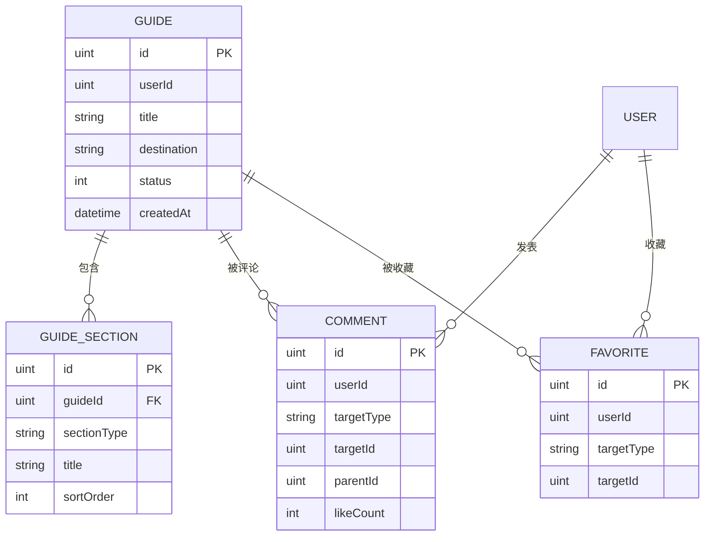

图表来源
- [internal/model/guide.go:9-28](file://internal/model/guide.go#L9-L28)
- [internal/model/guide_section.go:18-28](file://internal/model/guide_section.go#L18-L28)
- [internal/model/comment.go:5-16](file://internal/model/comment.go#L5-L16)
- [internal/model/favorite.go:5-13](file://internal/model/favorite.go#L5-L13)
- [internal/model/user.go:6-16](file://internal/model/user.go#L6-L16)

章节来源
- [cmd/main.go:52-57](file://cmd/main.go#L52-L57)
- [internal/model/guide.go:9-28](file://internal/model/guide.go#L9-L28)
- [internal/model/guide_section.go:5-28](file://internal/model/guide_section.go#L5-L28)
- [internal/model/comment.go:5-16](file://internal/model/comment.go#L5-L16)
- [internal/model/favorite.go:5-13](file://internal/model/favorite.go#L5-L13)

### 智能行程规划（AI智能行程生成）
- 功能概述：基于用户输入的目的地、天数、偏好，构造提示词调用第三方模型，返回结构化 JSON 的行程安排，供前端渲染与二次编辑
- 实现原理：在提示词中限定输出格式，确保返回严格 JSON；通过 HTTP 请求第三方模型 API 并解析响应
- 使用场景：快速生成初版行程、节省规划时间、作为行程模板
- 优化建议：缓存热门目的地的生成结果、对提示词进行版本化管理

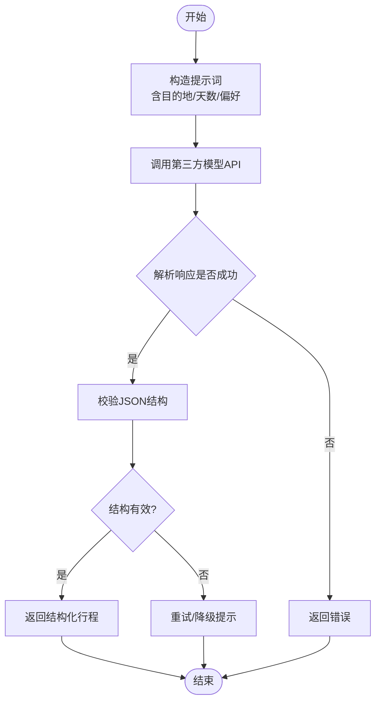

图表来源
- [internal/ai/deepseek.go:13-52](file://internal/ai/deepseek.go#L13-L52)

章节来源
- [cmd/main.go:73](file://cmd/main.go#L73)
- [internal/ai/deepseek.go:13-52](file://internal/ai/deepseek.go#L13-L52)

### 实时协同编辑
- 功能概述：多用户可同时编辑同一行程，通过 WebSocket 房间广播变更，保证编辑一致性
- 实现原理：Hub 维护房间与连接映射，提供加入、离开、广播方法；控制器在编辑事件触发时向房间广播最新数据
- 使用场景：拼团出行、结伴旅行、多人共创行程
- 优化建议：引入操作序号/冲突合并策略、离线重连与回放

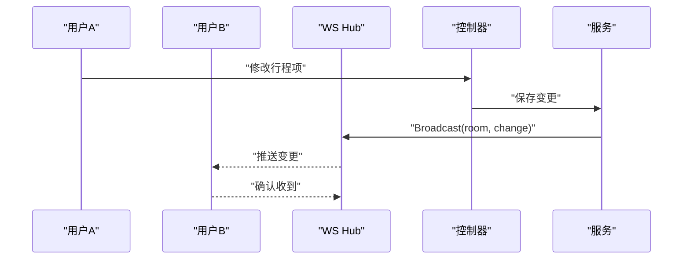

图表来源
- [internal/ws/hub.go:10-56](file://internal/ws/hub.go#L10-L56)
- [cmd/main.go:146](file://cmd/main.go#L146)

章节来源
- [cmd/main.go:72-84](file://cmd/main.go#L72-L84)
- [internal/ws/hub.go:10-56](file://internal/ws/hub.go#L10-L56)

### 周边推荐
- 功能概述：提供周边地点与热门推荐，辅助用户决策
- 数据模型：周边推荐独立建模，支持与行程/攻略联动
- 使用场景：临时调整路线、寻找附近餐厅/景点

章节来源
- [cmd/main.go:53-54](file://cmd/main.go#L53-L54)

### 搭子组队
- 功能概述：用户发起或参与组队活动，支持申请、审核与状态管理
- 数据模型：组队信息与申请记录，支持官方活动与用户自发活动
- 使用场景：结识同行伙伴、拼团优惠、社交拓展

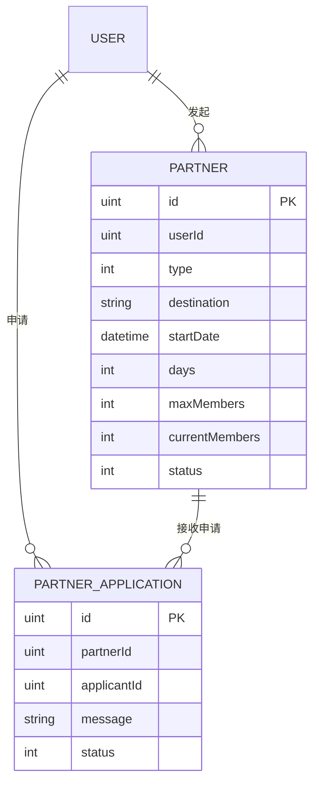

图表来源
- [internal/model/partner.go:5-30](file://internal/model/partner.go#L5-L30)

章节来源
- [cmd/main.go:85-90](file://cmd/main.go#L85-L90)
- [internal/model/partner.go:5-30](file://internal/model/partner.go#L5-L30)

### 消息中心
- 功能概述：支持私聊与系统通知，提供消息列表与发送
- 数据模型：消息表区分私聊与系统通知，支持已读标记
- 使用场景：组队沟通、系统公告、提醒通知

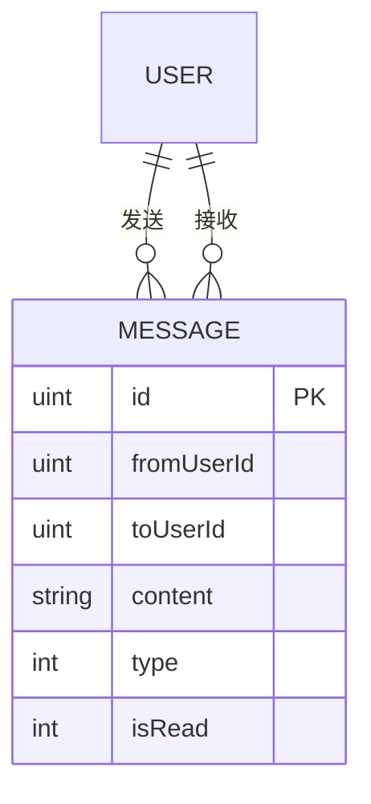

图表来源
- [internal/model/message.go:5-15](file://internal/model/message.go#L5-L15)

章节来源
- [cmd/main.go:91-94](file://cmd/main.go#L91-L94)
- [internal/model/message.go:5-15](file://internal/model/message.go#L5-L15)

### 旅行记账
- 功能概述：按行程维度进行费用记录与导入，支持分类、金额、备注与交易单号
- 使用场景：团队AA、预算控制、财务透明
- 关联关系：与行程强关联，便于按行程汇总统计

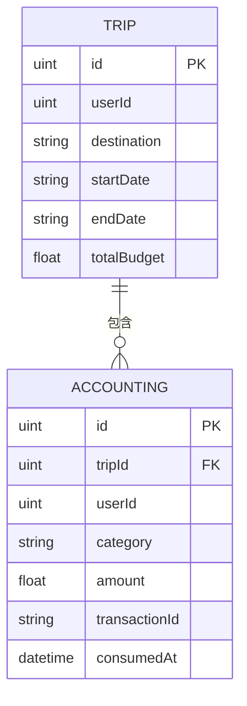

图表来源
- [internal/model/trip.go:9-38](file://internal/model/trip.go#L9-L38)
- [internal/model/accounting.go:5-17](file://internal/model/accounting.go#L5-L17)

章节来源
- [cmd/main.go:95-99](file://cmd/main.go#L95-L99)
- [internal/model/accounting.go:5-17](file://internal/model/accounting.go#L5-L17)

### 备忘清单
- 功能概述：支持个人清单与行程模板化清单，条目可勾选
- 使用场景：出行前准备、行程提醒、任务跟踪
- 关联关系：与行程绑定，形成“行程+清单”的完整执行清单

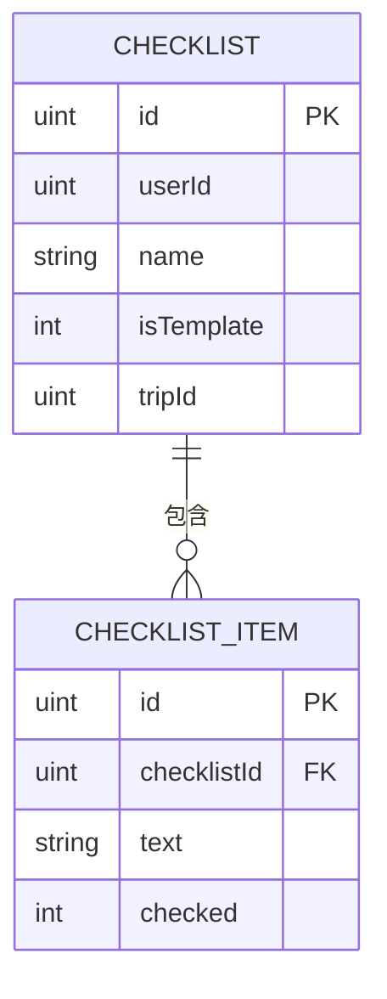

图表来源
- [internal/model/checklist.go:5-23](file://internal/model/checklist.go#L5-L23)

章节来源
- [cmd/main.go:100-104](file://cmd/main.go#L100-L104)
- [internal/model/checklist.go:5-23](file://internal/model/checklist.go#L5-L23)

### 足迹系统
- 功能概述：记录用户到访城市与经纬度，支持生成旅行海报
- 使用场景：旅行回顾、社交分享、地图可视化
- 关联关系：与用户绑定，形成个人旅行地图

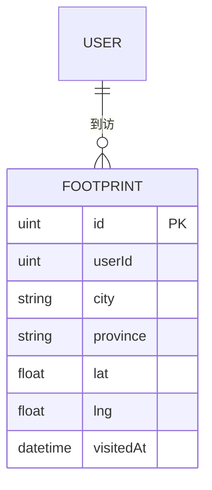

图表来源
- [internal/model/footprint.go:5-15](file://internal/model/footprint.go#L5-L15)

章节来源
- [cmd/main.go:105-109](file://cmd/main.go#L105-L109)
- [internal/model/footprint.go:5-15](file://internal/model/footprint.go#L5-L15)

### 行程数据模型与生态
- 行程主表：包含标题、目的地、日期、预算、公开状态、成员等
- 行程日：按天组织，支持备注
- 行程项：最小执行单元，包含类型、时间、地点、成本、状态等
- 成员：支持多种角色（拥有者/编辑者/查看者），实现权限控制

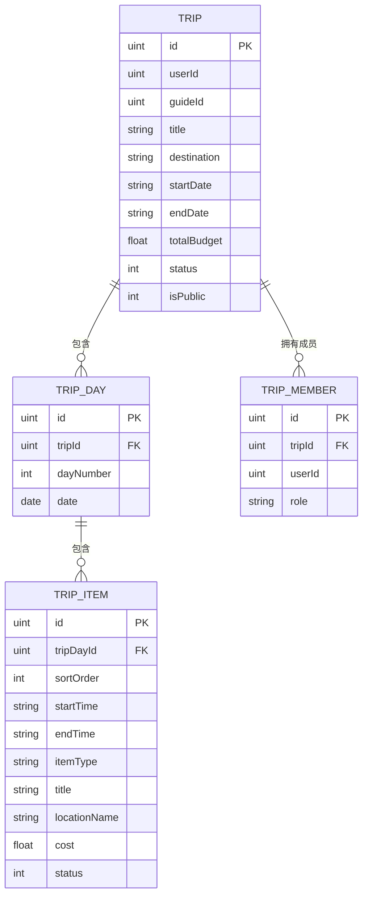

图表来源
- [internal/model/trip.go:9-38](file://internal/model/trip.go#L9-L38)
- [internal/model/trip_day.go:5-16](file://internal/model/trip_day.go#L5-L16)
- [internal/model/trip_item.go:5-23](file://internal/model/trip_item.go#L5-L23)

章节来源
- [cmd/main.go:71-84](file://cmd/main.go#L71-L84)
- [internal/model/trip.go:9-38](file://internal/model/trip.go#L9-L38)
- [internal/model/trip_day.go:5-16](file://internal/model/trip_day.go#L5-L16)
- [internal/model/trip_item.go:5-23](file://internal/model/trip_item.go#L5-L23)

## 依赖分析
- 路由依赖：入口文件集中注册公开接口、小程序受保护接口与后台管理接口，体现清晰的鉴权边界
- 服务依赖：控制器仅依赖服务接口，服务依赖仓储接口，降低耦合
- 外部依赖：AI 模块依赖第三方模型 API；WebSocket 模块依赖 gorilla/websocket
- 数据依赖：各模型之间通过外键建立一对多/一对一关系，支撑完整的业务闭环

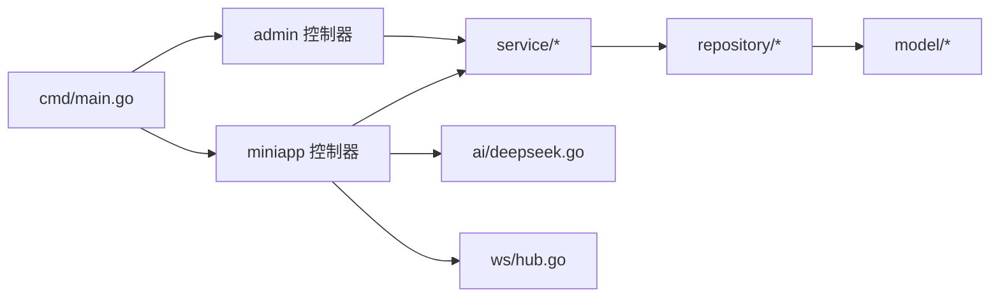

图表来源
- [cmd/main.go:46-146](file://cmd/main.go#L46-L146)
- [internal/ai/deepseek.go:18-52](file://internal/ai/deepseek.go#L18-L52)
- [internal/ws/hub.go:10-56](file://internal/ws/hub.go#L10-L56)

章节来源
- [cmd/main.go:46-146](file://cmd/main.go#L46-L146)

## 性能考虑
- 缓存策略：热门攻略、周边推荐、AI生成结果可引入缓存，减少重复计算与外部调用
- 分页与索引：瀑布流、消息列表、足迹列表应启用分页与必要索引，避免全表扫描
- 并发安全：WebSocket 广播需加锁，避免并发写导致的竞态条件
- 超时与重试：对外部 AI API 调用设置合理超时与指数退避重试
- 数据库优化：对常用查询字段（如用户ID、目标ID、状态）建立复合索引

## 故障排查指南
- 登录失败：检查微信授权码是否正确、OpenID/UnionID 是否唯一、JWT 密钥配置
- AI 生成异常：核对第三方 API Key、网络连通性、返回 JSON 格式是否符合预期
- 协同编辑不同步：确认房间号一致、连接未断开、广播未被过滤
- 记账导入失败：核对交易单号唯一性、金额与分类合法性、消费时间格式
- 足迹同步异常：检查经纬度范围、城市归属、重复打卡去重逻辑

章节来源
- [internal/ai/deepseek.go:18-52](file://internal/ai/deepseek.go#L18-L52)
- [internal/ws/hub.go:23-55](file://internal/ws/hub.go#L23-L55)
- [internal/model/accounting.go:5-17](file://internal/model/accounting.go#L5-L17)
- [internal/model/footprint.go:5-15](file://internal/model/footprint.go#L5-L15)

## 结论
该旅行社交平台围绕“行程+社交+工具”的生态构建了完整的能力矩阵：以微信登录为入口，通过瀑布流攻略与周边推荐提供决策支持，借助 AI 智能行程生成提升效率，配合实时协同编辑强化多人协作体验；辅以消息中心、记账、清单、足迹等工具链，形成从“计划—执行—记录—分享”的闭环。模块间职责清晰、耦合可控，具备良好的扩展性与可维护性。

## 附录
- 功能全景图（概念示意）

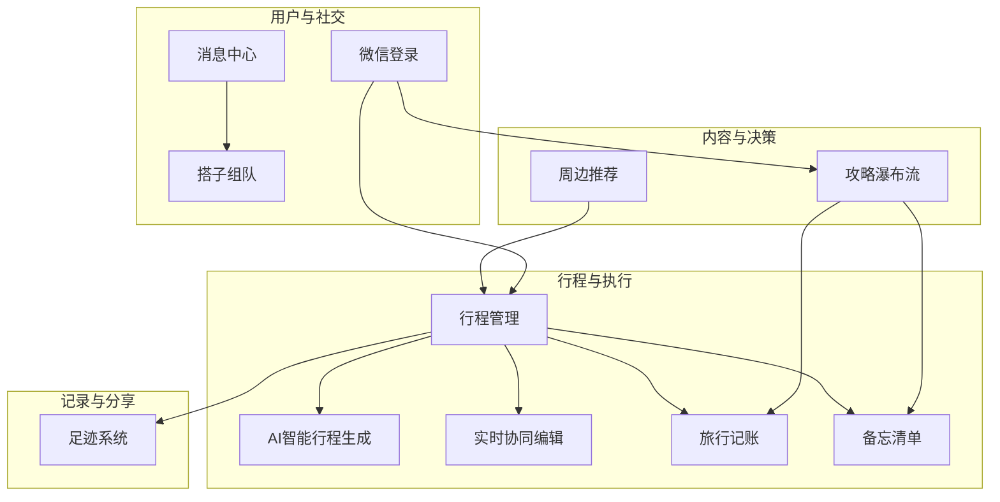