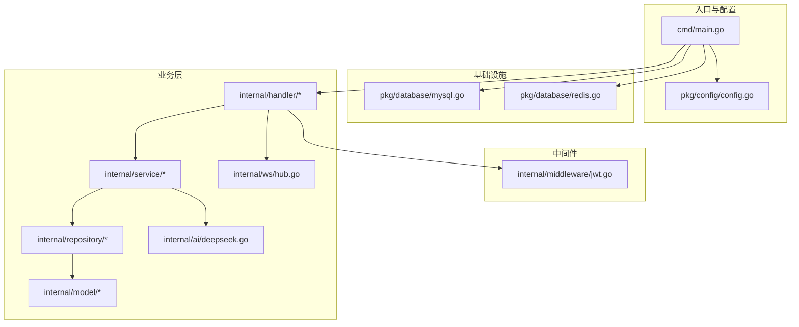
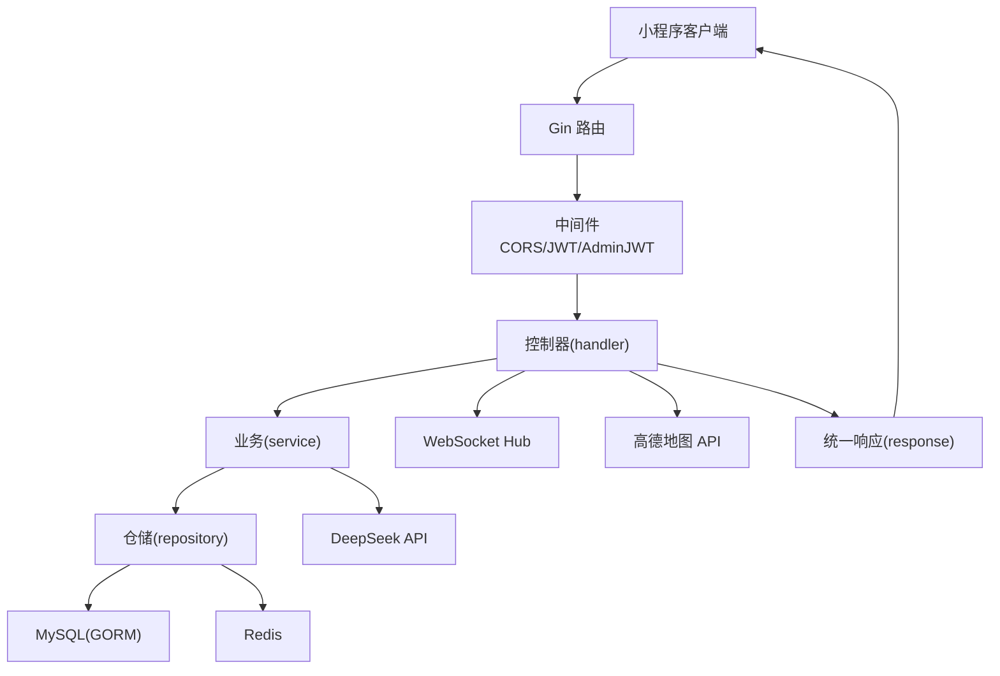
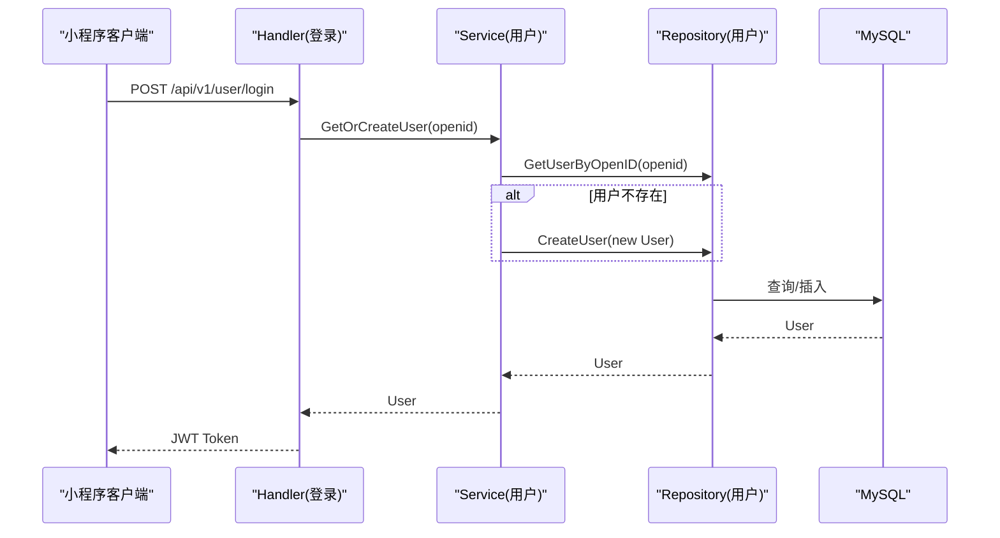
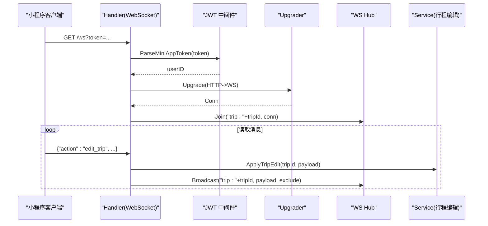
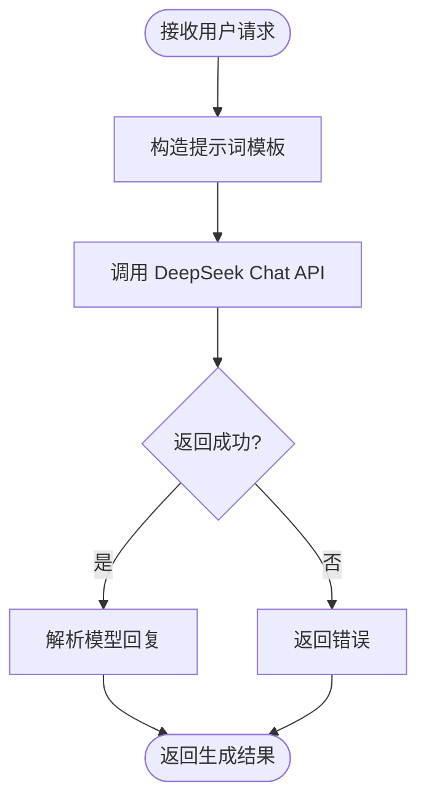
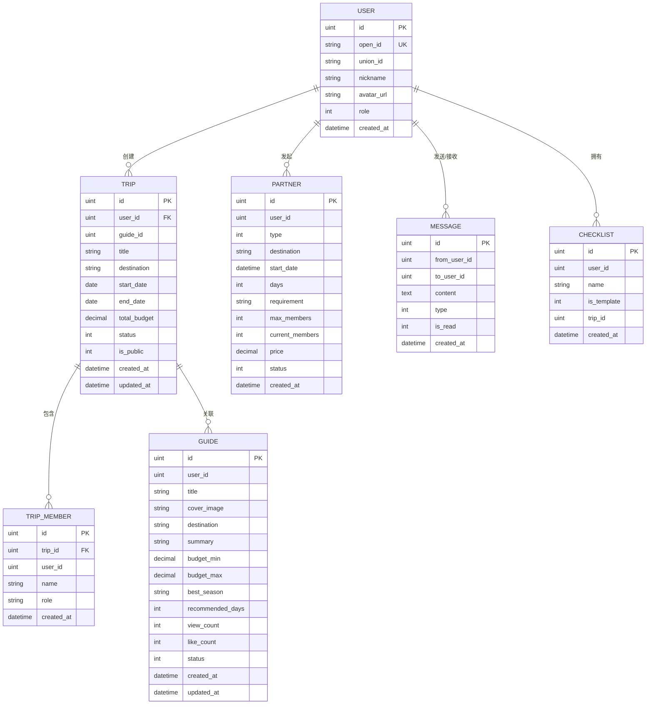
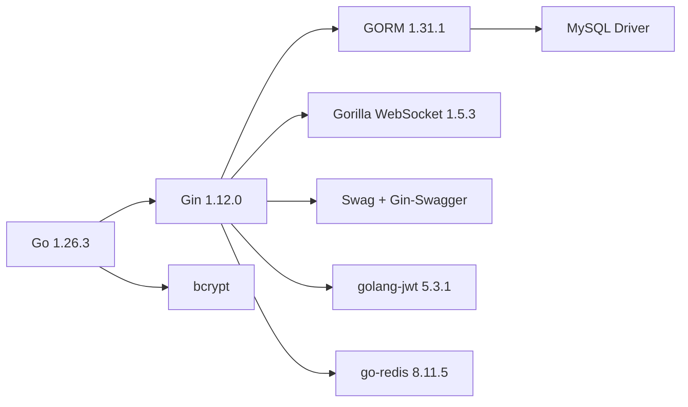

# 项目概述

<cite>
**本文引用的文件**
- [README.md](file://README.md)
- [main.go](file://cmd/main.go)
- [config.go](file://pkg/config/config.go)
- [mysql.go](file://pkg/database/mysql.go)
- [redis.go](file://pkg/database/redis.go)
- [jwt.go](file://internal/middleware/jwt.go)
- [common.go](file://internal/handler/common.go)
- [hub.go](file://internal/ws/hub.go)
- [deepseek.go](file://internal/ai/deepseek.go)
- [user.go](file://internal/model/user.go)
- [trip.go](file://internal/model/trip.go)
- [partner.go](file://internal/model/partner.go)
- [message.go](file://internal/model/message.go)
- [guide.go](file://internal/model/guide.go)
- [checklist.go](file://internal/model/checklist.go)
- [user_svc.go](file://internal/service/user_svc.go)
- [user_repo.go](file://internal/repository/user_repo.go)
- [go.mod](file://go.mod)
</cite>

## 目录
1. [引言](#引言)
2. [项目结构](#项目结构)
3. [核心组件](#核心组件)
4. [架构总览](#架构总览)
5. [详细组件分析](#详细组件分析)
6. [依赖分析](#依赖分析)
7. [性能考虑](#性能考虑)
8. [故障排查指南](#故障排查指南)
9. [结论](#结论)
10. [附录](#附录)

## 引言
本项目是面向微信小程序的旅行社交平台后端服务，围绕“攻略分享、行程规划、搭子匹配、实时消息通信”等核心能力构建，提供从用户认证、内容管理、AI智能行程生成到实时协作编辑的完整链路。项目采用 Go 语言与 Gin 框架实现高性能 HTTP 服务，结合 MySQL/GORM 与 Redis 提供稳定的数据持久化与缓存能力，通过 WebSocket 实现实时通信，借助 DeepSeek 大模型实现智能行程生成，配合高德地图 API 提供周边推荐与天气查询。

## 项目结构
项目遵循清晰的分层与模块化组织方式：
- cmd：应用入口，负责配置加载、数据库初始化、路由注册与服务启动
- internal：核心业务层，包含 handler（HTTP 控制器）、service（业务逻辑）、repository（数据访问）、model（数据模型）、ws（WebSocket）、ai（AI 集成）
- pkg：通用基础设施，包含配置管理、数据库连接与统一响应封装
- go.mod：依赖声明与版本约束

图表来源
- [main.go:31-151](file://cmd/main.go#L31-L151)
- [config.go:61-100](file://pkg/config/config.go#L61-L100)
- [mysql.go:19-90](file://pkg/database/mysql.go#L19-L90)
- [redis.go:15-31](file://pkg/database/redis.go#L15-L31)
- [jwt.go:48-122](file://internal/middleware/jwt.go#L48-L122)
- [hub.go:10-55](file://internal/ws/hub.go#L10-L55)
- [deepseek.go:18-52](file://internal/ai/deepseek.go#L18-L52)

章节来源
- [README.md:39-87](file://README.md#L39-L87)
- [main.go:31-151](file://cmd/main.go#L31-L151)
- [config.go:61-100](file://pkg/config/config.go#L61-L100)

## 核心组件
- 配置管理：集中从环境变量加载数据库、Redis、微信、高德、DeepSeek 等配置，支持开发/生产环境切换
- 认证与授权：小程序用户与后台管理员双令牌体系，分别签发与校验 JWT，中间件拦截并注入用户上下文
- 数据访问：GORM + MySQL 自动迁移，Redis 提供缓存与会话相关能力
- 业务逻辑：围绕用户、攻略、行程、搭子、消息、记账、清单、足迹等模型展开
- 实时通信：WebSocket 房间管理，支持协同编辑与消息推送
- AI 集成：DeepSeek Chat API，提供智能行程生成能力
- 统一响应：标准化 JSON 响应结构，便于前端消费

章节来源
- [config.go:9-55](file://pkg/config/config.go#L9-L55)
- [jwt.go:20-122](file://internal/middleware/jwt.go#L20-L122)
- [mysql.go:19-90](file://pkg/database/mysql.go#L19-L90)
- [redis.go:15-31](file://pkg/database/redis.go#L15-L31)
- [common.go:19-91](file://internal/handler/common.go#L19-L91)
- [deepseek.go:13-52](file://internal/ai/deepseek.go#L13-L52)

## 架构总览
系统采用 MVC 分层与领域模型驱动设计：
- Model：数据模型定义与关系映射
- Repository：数据访问层，封装 CRUD 与复杂查询
- Service：业务编排层，协调多个仓库与第三方服务
- Handler：HTTP 层，路由分组、参数解析、调用服务、返回响应
- Middleware：跨域、JWT 认证、管理员鉴权
- Infrastructure：数据库、缓存、AI、地图、WebSocket

图表来源
- [main.go:46-146](file://cmd/main.go#L46-L146)
- [jwt.go:48-122](file://internal/middleware/jwt.go#L48-L122)
- [mysql.go:19-90](file://pkg/database/mysql.go#L19-L90)
- [redis.go:15-31](file://pkg/database/redis.go#L15-L31)
- [common.go:48-91](file://internal/handler/common.go#L48-L91)
- [deepseek.go:18-52](file://internal/ai/deepseek.go#L18-L52)

## 详细组件分析

### 用户与认证流程
- 小程序登录：通过微信凭证换取用户 OpenID，若不存在则自动注册
- JWT 签发与校验：小程序用户与管理员分别使用不同密钥签发与校验
- 中间件注入：将用户 ID 注入上下文，后续业务按需读取

图表来源
- [user_svc.go:12-27](file://internal/service/user_svc.go#L12-L27)
- [user_repo.go:8-21](file://internal/repository/user_repo.go#L8-L21)
- [jwt.go:26-46](file://internal/middleware/jwt.go#L26-L46)

章节来源
- [user_svc.go:12-27](file://internal/service/user_svc.go#L12-L27)
- [user_repo.go:8-21](file://internal/repository/user_repo.go#L8-L21)
- [jwt.go:26-46](file://internal/middleware/jwt.go#L26-L46)

### WebSocket 协同编辑与消息
- 连接升级：基于查询参数 token 进行小程序 JWT 校验
- 房间管理：以行程 ID 为房间号，维护连接集合
- 广播机制：编辑事件持久化后向房间内其他连接广播

图表来源
- [common.go:48-91](file://internal/handler/common.go#L48-L91)
- [jwt.go:38-64](file://internal/middleware/jwt.go#L38-L64)
- [hub.go:23-55](file://internal/ws/hub.go#L23-L55)

章节来源
- [common.go:48-91](file://internal/handler/common.go#L48-L91)
- [hub.go:10-55](file://internal/ws/hub.go#L10-L55)

### AI 智能行程生成
- 提示词模板：面向旅行规划师的角色设定与输出约束
- 请求转发：将用户输入拼接为提示词，调用 DeepSeek Chat API
- 输出解析：提取模型回复内容，返回给上层业务

图表来源
- [deepseek.go:13-52](file://internal/ai/deepseek.go#L13-L52)

章节来源
- [deepseek.go:13-52](file://internal/ai/deepseek.go#L13-L52)

### 数据模型与关系
以下 ER 关系展示了核心实体及关联：

图表来源
- [user.go:6-15](file://internal/model/user.go#L6-L15)
- [trip.go:9-37](file://internal/model/trip.go#L9-L37)
- [partner.go:5-29](file://internal/model/partner.go#L5-L29)
- [message.go:5-14](file://internal/model/message.go#L5-L14)
- [guide.go:9-27](file://internal/model/guide.go#L9-L27)
- [checklist.go:5-22](file://internal/model/checklist.go#L5-L22)

章节来源
- [user.go:6-15](file://internal/model/user.go#L6-L15)
- [trip.go:9-37](file://internal/model/trip.go#L9-L37)
- [partner.go:5-29](file://internal/model/partner.go#L5-L29)
- [message.go:5-14](file://internal/model/message.go#L5-L14)
- [guide.go:9-27](file://internal/model/guide.go#L9-L27)
- [checklist.go:5-22](file://internal/model/checklist.go#L5-L22)

### 路由与权限控制
- 公开接口：登录、瀑布流、周边推荐、天气查询等
- 小程序登录接口：需要携带 Bearer Token 的 JWT
- 后台管理接口：独立 JWT 与角色校验，支持用户、攻略、搭子、推荐等管理

章节来源
- [main.go:46-146](file://cmd/main.go#L46-L146)
- [jwt.go:48-122](file://internal/middleware/jwt.go#L48-L122)

## 依赖分析
- 语言与框架：Go 1.26.3 + Gin 1.12.0，简洁高效
- ORM 与数据库：GORM 1.31.1 + MySQL 驱动，自动迁移与软删除
- 缓存：Redis 客户端 v8，提供高性能键值存储
- 实时通信：Gorilla WebSocket，标准协议适配
- 文档：Swag + Gin-Swagger，自动生成 API 文档
- 加解密：bcrypt 用于管理员密码哈希
- 依赖版本与兼容性：go.mod 明确各模块版本，避免冲突

图表来源
- [go.mod:5-16](file://go.mod#L5-L16)

章节来源
- [go.mod:5-16](file://go.mod#L5-L16)

## 性能考虑
- 路由与中间件：全局 CORS 中间件减少跨域问题；JWT 校验在进入业务前完成，降低重复校验成本
- 数据访问：GORM 自动迁移与索引字段（软删除、唯一索引）提升查询效率
- 缓存策略：Redis 可用于热点数据、会话与限流，建议结合业务场景扩展
- WebSocket：房间级广播，避免全量推送；建议引入心跳与断线重连策略
- AI 调用：DeepSeek API 为外部依赖，建议增加超时与重试、熔断与降级策略
- 日志与监控：建议集成指标采集与链路追踪，定位性能瓶颈

## 故障排查指南
- 数据库连接失败：检查环境变量与网络连通，确认重试机制是否生效
- Redis 连接失败：核对主机、端口、密码与 DB 索引
- JWT 校验失败：确认前端携带的 Bearer Token 与签发密钥一致
- WebSocket 连接异常：确认 token 参数与 upgrader 配置
- Swagger 文档不可用：确认 swag 初始化命令与路由注册

章节来源
- [mysql.go:25-37](file://pkg/database/mysql.go#L25-L37)
- [redis.go:23-31](file://pkg/database/redis.go#L23-L31)
- [jwt.go:56-64](file://internal/middleware/jwt.go#L56-L64)
- [common.go:56-60](file://internal/handler/common.go#L56-L60)

## 结论
本项目以清晰的分层架构与模块化设计，覆盖旅行社交的核心业务闭环。通过 Gin 的高性能与 GORM 的易用性，结合 Redis、WebSocket、AI 与地图服务，形成可扩展、可维护的后端能力基座。对于初学者，建议从路由与模型入手，逐步理解中间件与服务编排；对于有经验的开发者，可在缓存优化、实时通信稳定性与 AI 调用治理方面深入演进。

## 附录
- 快速开始与环境变量配置参见 README
- API 列表与 Swagger 在线调试参见 README
- Docker 与开发环境参见 README

章节来源
- [README.md:91-151](file://README.md#L91-L151)
- [README.md:154-205](file://README.md#L154-L205)
- [README.md:237-318](file://README.md#L237-L318)