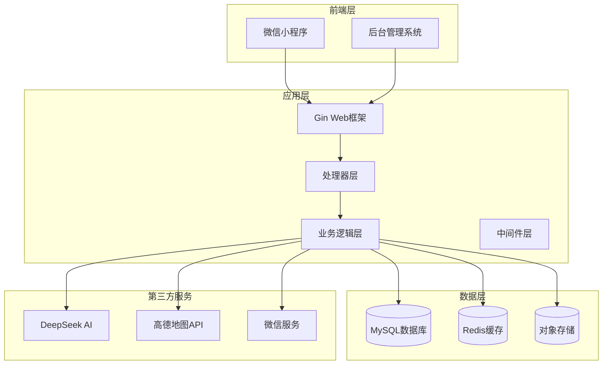
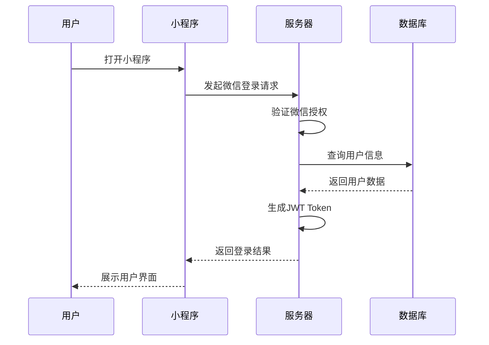
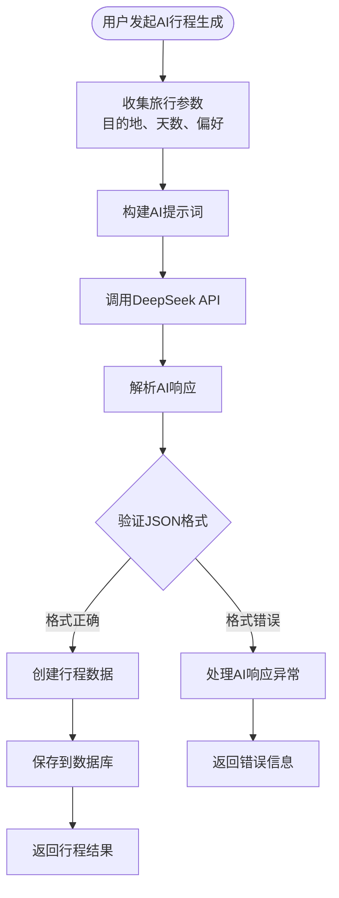
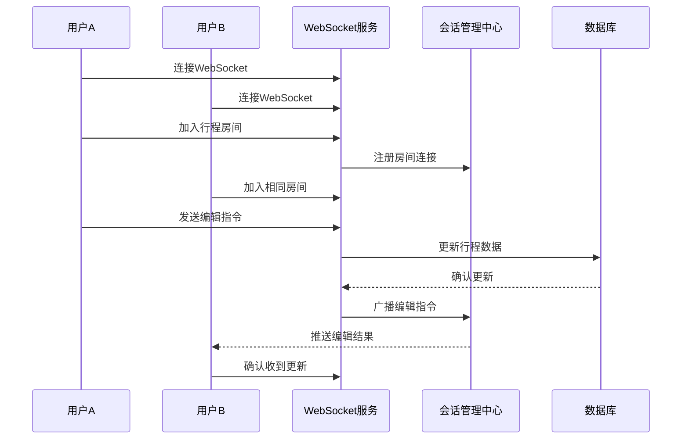
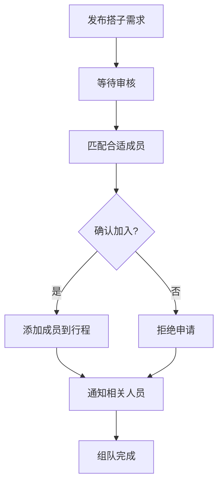
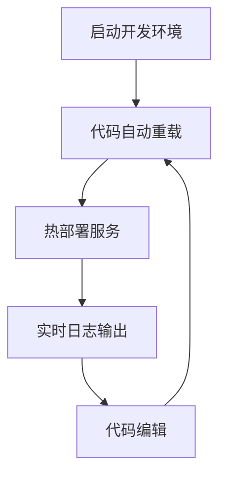

# 项目简介

<cite>
**本文档引用的文件**
- [README.md](file://README.md)
- [cmd/main.go](file://cmd/main.go)
- [pkg/config/config.go](file://pkg/config/config.go)
- [internal/ai/deepseek.go](file://internal/ai/deepseek.go)
- [internal/handler/miniapp/trip.go](file://internal/handler/miniapp/trip.go)
- [internal/handler/miniapp/partner.go](file://internal/handler/miniapp/partner.go)
- [internal/handler/common.go](file://internal/handler/common.go)
- [internal/ws/hub.go](file://internal/ws/hub.go)
- [internal/service/trip_svc.go](file://internal/service/trip_svc.go)
- [internal/model/user.go](file://internal/model/user.go)
- [internal/model/trip.go](file://internal/model/trip.go)
- [internal/model/partner.go](file://internal/model/partner.go)
- [internal/model/guide.go](file://internal/model/guide.go)
- [pkg/response/response.go](file://pkg/response/response.go)
</cite>

## 目录
1. [引言](#引言)
2. [项目概述](#项目概述)
3. [核心目标与愿景](#核心目标与愿景)
4. [技术架构](#技术架构)
5. [主要功能模块](#主要功能模块)
6. [创新点与差异化优势](#创新点与差异化优势)
7. [项目价值主张](#项目价值主张)
8. [应用场景与用户痛点](#应用场景与用户痛点)
9. [开发与部署指南](#开发与部署指南)
10. [结语](#结语)

## 引言

旅行社交平台项目是一个基于微信小程序的综合性旅行服务平台，旨在为用户提供从旅行规划到社交互动的一站式解决方案。该项目采用现代化的技术栈，结合人工智能、实时通信和云端存储，为旅行爱好者打造智能化、社交化的旅行体验。

## 项目概述

### 项目定位
这是一个专为微信小程序设计的旅行社交平台后端服务，提供包括攻略分享、行程规划、搭子组队、协同编辑、周边推荐、记账备忘、足迹海报等全方位旅行服务功能。

### 技术特色
- **全栈Go语言开发**：基于Go 1.20+，确保高性能和高并发处理能力
- **微服务架构**：采用分层架构设计，职责清晰，易于维护和扩展
- **AI智能集成**：深度集成DeepSeek大模型，提供智能行程生成服务
- **实时协作**：基于WebSocket实现多人实时协同编辑
- **云端部署**：支持Docker容器化部署，便于规模化运营

## 核心目标与愿景

### 核心目标
1. **解决旅行用户痛点**：针对攻略获取困难、行程规划复杂、同行伙伴难找等问题提供一站式解决方案
2. **提升旅行体验**：通过智能化工具和社交功能，让旅行变得更加便捷和有趣
3. **构建旅行社区**：建立活跃的旅行爱好者社区，促进用户间的交流和分享

### 发展愿景
成为国内领先的旅行社交平台，为千万旅行用户提供智能化、个性化的旅行服务，推动旅行行业的数字化转型。

## 技术架构

### 整体架构图



**架构图来源**
- [cmd/main.go:31-151](file://cmd/main.go#L31-L151)
- [pkg/config/config.go:61-100](file://pkg/config/config.go#L61-L100)

### 技术栈详解

| 技术类别 | 技术选型 | 用途 |
|---------|----------|------|
| 语言 | Go 1.20+ | 主要开发语言，提供高性能执行环境 |
| Web框架 | Gin | 轻量级Web框架，支持高并发处理 |
| 数据库 | MySQL + GORM | 关系型数据存储，ORM映射 |
| 缓存 | Redis | 高速缓存，支持会话管理和热点数据 |
| 认证 | JWT | 用户身份认证和授权管理 |
| 实时通信 | Gorilla WebSocket | 实现实时协作编辑功能 |
| AI集成 | DeepSeek Chat API | 智能行程生成和内容创作 |
| 地图服务 | 高德地图 Web API | 周边推荐和位置服务 |
| 配置管理 | 环境变量 | 灵活的配置管理方案 |

**章节来源**
- [README.md:23-35](file://README.md#L23-L35)
- [cmd/main.go:7-21](file://cmd/main.go#L7-L21)

## 主要功能模块

### 1. 用户认证与管理

系统采用微信静默授权机制，通过JWT实现用户身份认证和权限管理。



**图表来源**
- [internal/handler/miniapp/user.go](file://internal/handler/miniapp/user.go)
- [pkg/config/config.go:39-48](file://pkg/config/config.go#L39-L48)

### 2. 智能行程规划

集成DeepSeek AI大模型，为用户提供智能化的旅行行程规划服务。



**图表来源**
- [internal/ai/deepseek.go:18-52](file://internal/ai/deepseek.go#L18-L52)
- [internal/handler/miniapp/trip.go:16-92](file://internal/handler/miniapp/trip.go#L16-L92)

### 3. 实时协作编辑

基于WebSocket实现实时协同编辑功能，支持多用户同时编辑同一份行程。



**图表来源**
- [internal/ws/hub.go:23-55](file://internal/ws/hub.go#L23-L55)
- [internal/handler/common.go:48-91](file://internal/handler/common.go#L48-L91)

### 4. 搭子组队系统

提供灵活的搭子组队功能，支持用户发布旅行需求和寻找同行伙伴。



**图表来源**
- [internal/handler/miniapp/partner.go:14-139](file://internal/handler/miniapp/partner.go#L14-L139)
- [internal/model/partner.go:5-29](file://internal/model/partner.go#L5-L29)

**章节来源**
- [internal/model/user.go:6-15](file://internal/model/user.go#L6-L15)
- [internal/model/trip.go:9-37](file://internal/model/trip.go#L9-L37)

## 创新点与差异化优势

### 1. AI智能行程生成
- **个性化定制**：根据用户偏好和目的地特点生成专属行程
- **智能优化**：自动优化景点顺序和时间安排，避免重复和浪费
- **实时更新**：支持用户对AI生成的行程进行二次编辑和调整

### 2. 实时协作编辑
- **多人同步**：支持多个用户同时编辑同一份行程，实时同步变更
- **冲突解决**：采用乐观锁机制处理并发编辑冲突
- **版本管理**：自动记录编辑历史，支持回滚和版本对比

### 3. 智能周边推荐
- **位置感知**：基于用户当前位置提供精准的周边推荐
- **多维筛选**：支持景点、民宿、餐厅等多类型筛选
- **导航集成**：一键导航到推荐地点，提供实时交通信息

### 4. 社交化旅行体验
- **足迹系统**：自动记录旅行足迹，生成个性化足迹海报
- **攻略分享**：用户可以发布和分享旅行攻略，形成知识社区
- **搭子匹配**：智能匹配志同道合的旅行伙伴

**章节来源**
- [README.md:7-19](file://README.md#L7-L19)
- [internal/ai/deepseek.go:13-16](file://internal/ai/deepseek.go#L13-L16)

## 项目价值主张

### 对用户的价值
1. **一站式旅行服务**：从行程规划到社交互动的全流程覆盖
2. **智能化辅助**：AI智能助手帮助用户制定最优旅行方案
3. **社交化体验**：与志同道合的人一起旅行，分享美好时光
4. **个性化定制**：根据用户偏好提供专属的旅行建议和服务

### 对开发者的价值
1. **技术实践**：涵盖现代Web开发的主流技术和最佳实践
2. **学习资源**：完整的项目结构和代码注释，适合学习和参考
3. **扩展性强**：模块化设计便于功能扩展和二次开发
4. **部署友好**：支持Docker容器化部署，降低运维成本

### 对企业的发展价值
1. **市场机会**：抓住旅行行业数字化转型的市场机遇
2. **用户粘性**：通过丰富的功能和良好的用户体验提高用户留存
3. **商业变现**：通过会员服务、广告投放等方式实现商业化运营
4. **品牌建设**：打造专业、可靠的旅行服务平台品牌形象

## 应用场景与用户痛点

### 目标用户群体
1. **年轻旅行爱好者**：追求个性化、社交化的旅行体验
2. **家庭出行用户**：需要详细的行程规划和安全保障
3. **商务出差人员**：需要高效的行程管理和费用控制
4. **旅行内容创作者**：需要专业的旅行攻略分享和推广平台

### 核心用户痛点

#### 1. 攻略获取困难
- **问题**：难以找到高质量、实用性强的旅行攻略
- **解决方案**：建立权威的攻略分享平台，提供经过审核的内容质量保证

#### 2. 行程规划复杂
- **问题**：缺乏专业的行程规划工具，容易遗漏重要环节
- **解决方案**：提供AI智能行程生成和手动编辑相结合的规划工具

#### 3. 同行伙伴难找
- **问题**：独自旅行存在安全隐患，寻找同行伙伴困难重重
- **解决方案**：建立完善的搭子组队系统，提供智能匹配和安全保障

#### 4. 旅行记录不便
- **问题**：旅行过程中的照片、路线、花费等信息难以有效记录和整理
- **解决方案**：提供自动化的足迹记录、记账管理和海报生成功能

### 使用场景举例

#### 场景一：自由行规划
用户通过AI智能行程生成器，输入目的地、天数和偏好，系统自动生成详细的行程安排，用户可以根据需要进行调整和优化。

#### 场景二：团队旅行协作
多个朋友共同规划一次旅行，通过实时协作编辑功能，大家可以在同一份行程上进行讨论和修改，确保每个人的意见都得到体现。

#### 场景三：临时拼团
用户发布搭子需求，系统智能匹配符合条件的旅行伙伴，快速组建旅行团队，实现资源共享和风险分担。

**章节来源**
- [README.md:154-204](file://README.md#L154-L204)

## 开发与部署指南

### 环境要求
- **Go 1.20+**：主开发语言版本要求
- **MySQL 8.0+**：关系型数据库，已预创建数据库`travel`
- **Redis 7.0+**：缓存数据库，用于会话管理和热点数据缓存
- **微信小程序**：需要有效的AppID和AppSecret
- **第三方API**：高德地图Web API Key和DeepSeek API Key

### 配置步骤

#### 1. 环境变量配置
复制`.env.example`文件并修改为实际的配置值，或直接在系统中导出环境变量。

#### 2. 依赖安装
```bash
go mod tidy
swag init -g cmd/main.go -o docs --parseDependency --parseInternal
```

#### 3. 服务启动
```bash
go run cmd/main.go
```

### 开发模式
项目提供了专门的开发环境配置，支持代码修改自动重启，无需手动重新构建镜像。



**图表来源**
- [README.md:262-294](file://README.md#L262-L294)

**章节来源**
- [README.md:91-151](file://README.md#L91-L151)

## 结语

旅行社交平台项目通过技术创新和功能整合，为现代旅行者提供了一个智能化、社交化的旅行服务平台。项目不仅解决了用户在旅行过程中的实际痛点，还为开发者提供了学习和实践的优秀案例。

随着旅行行业的数字化转型不断深入，该项目具有广阔的发展前景和重要的社会价值。通过持续的功能优化和技术升级，相信能够为更多的旅行爱好者带来更好的服务体验。

无论是作为学习参考还是商业应用，这个项目都展现了现代Web开发的最佳实践和创新思维，值得深入研究和借鉴。